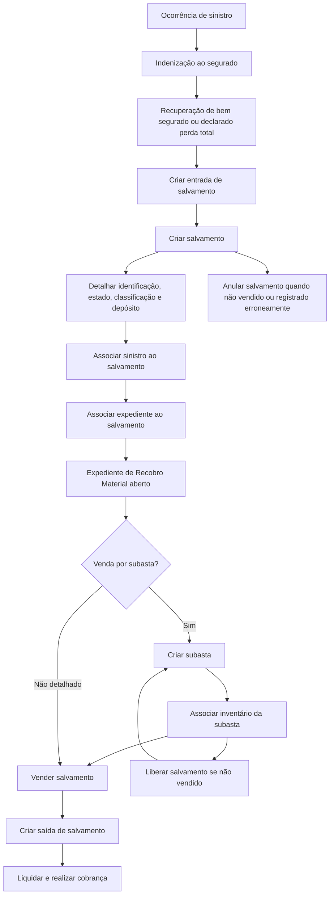

# Módulo de Salvamentos — Controle de Bens Recuperados, Subastas, Venda e Liquidação

## 1. Metadados do Documento
- **Arquivo de Origem:** Não identificado no conteúdo fornecido
- **Tipo de Documento:** Apresentação Executiva
- **Domínio / Sistema:** Reef — módulo de Salvamentos
- **Público-Alvo:** Não identificado explicitamente
- **Data/Versão Identificada:** Não identificada
- **Estado do Documento:** `Approved Source` — ciclo de vida indicado como `VL`
- **Owner Identificado:** `user:agonzalez_mapfre.com`

---

## 2. Resumo Executivo & Contexto de Negócio

O documento apresenta o módulo de **Salvamentos** do sistema Reef, cujo objetivo é controlar bens recuperados de sinistros que passam a ser propriedade da companhia após a indenização do segurado. O ciclo controlado pelo módulo começa na recuperação do bem e se estende até a sua venda e respectiva liquidação.

Os exemplos de bens recuperados apresentados incluem veículos roubados que reaparecem após a indenização, veículos declarados como perda total destinados à venda como sucata e mercadorias recuperadas após terem sido roubadas durante transporte por caminhão, trem ou avião. Esses bens são tratados como **bens recuperados ou salvados**.

Para que um bem recuperado possa ser vendido, o documento estabelece a necessidade de abertura de um expediente de **Recobro Material**, também denominado Recobro Salvamento. O Recobro Material é um tipo de dano e expediente destinado a realizar gestões para recuperar valores devidos à companhia por meio da venda de um bem sob sua posse.

O módulo de Salvamentos concentra funcionalidades de identificação, registro de atributos, subasta, venda e liquidação. O comportamento do módulo é parametrizável e depende de definições prévias configuradas no **Taller de Productos**, abrangendo níveis de definição comum, geral, por ramo, por setor e específicos de salvamentos.

A documentação também descreve operações de negócio para registrar o ingresso do salvado, detalhar ou modificar características, associar sinistros e expedientes, criar e administrar subastas, vender, liberar, anular, registrar a saída e consultar salvamentos por sinistro ou inventário.

---

## 3. Arquitetura, Componentes & Tecnologias Envolvidas

### Sistemas, módulos e conceitos identificados

| Componente / Termo | Papel descrito no documento |
| :--- | :--- |
| **Reef** | Sistema no qual está inserida a documentação e o módulo de Salvamentos. |
| **Módulo de Salvamentos** | Controla classificação, identificação, venda e liquidação de bens recuperados de sinistros. |
| **Recobro Material / Recobro Salvamento** | Tipo de dano e expediente necessário para vender um bem recuperado. |
| **Taller de Productos** | Contexto de definições prévias das quais depende o comportamento parametrizável da aplicação. |
| **Terceros** | Cadastro no qual compradores e locais de depósito de salvamentos devem ser definidos ou registrados. |
| **Siniestro** | Sinistro que pode ser associado a um salvamento registrado. |
| **Expediente** | Expediente que pode ser vinculado ao salvamento; para venda, o expediente deve ser de Recobro Material. |
| **Subasta** | Processo de venda para o qual salvamentos pendentes podem ser associados como inventário. |
| **Liquidación** | Processo de cobrança realizado com base nas informações coletadas no módulo. |
| **Documentación Reef / Mapfredocument** | Referências de navegação e documentação apresentadas no conteúdo. |

### Elementos funcionais do módulo de Salvamentos

| Elemento | Função descrita |
| :--- | :--- |
| **Identificação / Registro** | Registra e identifica o salvamento. |
| **Atributos** | Armazena informações adicionais para detalhar o bem ou atender requisitos legais. |
| **Subasta** | Registra informações de subastas para venda, como data e localização. |
| **Venta** | Armazena dados da venda, comprador, valor e data de compra do bem recuperado. |
| **Liquidación** | Possibilita realizar a cobrança usando as informações registradas no módulo. |

### Fluxo operacional reconstruído



> **Nota de Análise:** O documento não detalha arquitetura técnica de software, APIs, bancos de dados, protocolos de integração, métodos HTTP, contratos JSON, tecnologias de infraestrutura ou ambientes de execução. O diagrama representa exclusivamente o fluxo funcional explicitamente descrito.

---

## 4. Regras de Negócio, Especificações Funcionais & Processos

### 4.1 Conceito de bem recuperado ou salvado

Um **bem recuperado ou salvado** é um objeto segurado que foi recuperado depois de roubo ou após ter sido declarado perda total. Depois de a companhia indenizar o segurado, o bem recuperado passa a ser propriedade da companhia.

Exemplos apresentados:

- Veículo recuperado.
- Mercadoria transportada por avião, trem ou caminhão.
- Automóvel roubado, indenizado e posteriormente localizado.
- Automóvel declarado perda total destinado à venda como ferro.
- Mercadoria roubada durante transporte e posteriormente recuperada.

### 4.2 Conceito de Recobro Material

O **Recobro Material**, também chamado de **Recobro Salvamento**, é um tipo de dano e expediente que realiza as gestões necessárias para recuperar aquilo que é devido à companhia.

O documento diferencia dois tipos de recobro:

| Tipo de Recobro | Objetivo |
| :--- | :--- |
| **Recobro econômico** | Recuperar dinheiro. |
| **Recobro material** | Recuperar parte do valor do sinistro mediante a venda de um bem em posse da companhia. |

### 4.3 Obrigação de abertura de Recobro Material

Para vender um bem recuperado, como veículo ou mercadoria recuperada de um sinistro, deve existir um expediente aberto de **Recobro Material (Salvamento)**.

Essa condição é apresentada como obrigatória para a venda de salvamentos.

### 4.4 Parametrização do módulo

O módulo de Salvamentos é parametrizável. O comportamento da aplicação depende de definições previamente estabelecidas no **Taller de Productos**.

As definições são organizadas nos seguintes níveis:

1. Comum.
2. Geral.
3. Ramo.
4. Setor.
5. Salvamentos.

### 4.5 Registro do comprador

Para realizar cobranças às pessoas que compram salvamentos, o comprador deve estar registrado no sistema **Terceros**.

O cadastro do comprador deve contemplar:

- Meios de contato.
- Meios de cobrança ou pagamento.
- Dados necessários para realizar a cobrança.
- Dados necessários para contatar o comprador.

O comprador pode ser pessoa física ou pessoa jurídica.

### 4.6 Liquidações de Salvamentos

Podem existir uma ou várias liquidações em um expediente de Salvamentos. A quantidade de liquidações corresponde aos compradores ou pessoas físicas ou jurídicas que intervenham no expediente.

Exemplos de participantes mencionados:

- Pessoa contratada para recuperar um veículo roubado.
- Pessoa contratada para transportar a mercadoria de um caminhão sinistrado.

### 4.7 Dados de identificação do salvamento

O salvamento deve ser identificado com informações como:

- Tipo de salvamento, por exemplo veículo ou mercadoria proveniente de navio ou caminhão.
- Estado do bem recuperado.
- Classificação do bem recuperado ou salvado.
- Local onde o bem foi depositado.
- Outras informações não especificadas no documento.

### 4.8 Atributos de Salvamentos

O elemento **Atributos** contém informações adicionais que permitem detalhar melhor o bem recuperado ou registrar dados exigidos por legislação.

O documento não define quais atributos específicos são obrigatórios, nem apresenta formatos, tipos de dados ou regras de preenchimento para cada atributo.

### 4.9 Venda do Salvamento

A venda do salvamento registra informações como:

- Pessoa física ou jurídica que compra o bem recuperado.
- Valor da venda.
- Data de compra do bem recuperado.

### 4.10 Definições por nível

#### Nível Comum

O nível comum contém definições que não são exclusivas do módulo de sinistros, mas são necessárias para a configuração de Salvamentos.

- **Depósitos de Salvamentos:** definição, em Terceros, dos locais nos quais os salvados podem ser depositados.
- **Recuperadores:** definição das pessoas que procurarão veículos ou propriedades roubadas de segurados.

#### Nível Geral

O nível geral contém definições que afetam todos os possíveis expedientes de salvamentos.

- **Causa Processo:** cataloga os motivos pelos quais se deseja realizar uma operação.
- **Tipo Expediente:** define tipos de dano e suas classes, incluindo a distinção entre expediente de Recobro, seu tipo e expediente que não é de Recobro.

#### Nível Setor

O nível setor afeta todos os ramos do setor definido.

- **Ubicaciones:** define possíveis localizações dos bens recuperados.
- **Documentos:** define documentos necessários para que os bens recuperados possam ser vendidos.
- **Clasificación:** define classificações possíveis dos bens recuperados em relação ao seu estado para venda.
- **Actividades Compradoras:** define atividades que podem comprar salvados.

#### Nível Ramo

O nível ramo contém definições exclusivas do ramo configurado.

- **Causa Processo:** cataloga os motivos para realização de operações em cada ramo.

#### Nível Salvamentos

O nível Salvamentos reúne definições próprias do módulo.

- **Atributo:** define informações adicionais de salvamentos, como dados do salvado.
- **Estructura:** define informações adicionais compostas por atributos, obrigatoriedade de solicitação de informações e ordem de solicitação.
- **Información Inicial:** registra informação prévia para atributos de operações de salvamentos, evitando introdução posterior.
- **Validaciones Información:** define comportamentos e validações para as informações solicitadas nas operações de salvamentos.

### 4.11 Operações de Salvamentos

| Operação | Descrição funcional |
| :--- | :--- |
| **CREAR entrada salvamento** | Registra o ingresso do salvado na companhia. |
| **CREAR salvamento** | Detalha as características do salvamento. |
| **MODIFICAR salvamento** | Permite alterar características do salvado. |
| **ASOCIAR siniestro al salvamento** | Vincula o sinistro ao salvamento registrado. |
| **ASOCIAR expediente al salvamento** | Vincula o expediente ao salvamento. |
| **CREAR subasta** | Registra dados de subastas para venda de salvamentos, incluindo data e localização. |
| **ASOCIAR inventario subasta** | Vincula salvamentos pendentes de venda ao inventário da subasta. |
| **MODIFICAR subasta** | Permite alterar dados da subasta. |
| **VENDER salvamento** | Registra a venda do salvamento, o comprador e o valor da venda. |
| **LIBERAR salvamento** | Desvincula o salvamento de uma subasta quando não foi vendido, permitindo associá-lo a outra subasta. |
| **ANULAR salvamento** | Elimina o salvamento quando ele não será vendido ou foi registrado incorretamente. |
| **CREAR salida salvamento** | Registra a saída do salvamento quando o bem é vendido. |
| **CONSULTAR salvamentos (Por Siniestro)** | Mostra informações do salvado a partir do sinistro. |
| **CONSULTAR salvamentos (Por Inventario)** | Mostra informações do salvado a partir da identificação do próprio bem. |

---

## 5. Tabelas de Parâmetros, Ambientes e Estruturas de Dados

### 5.1 Estrutura funcional do Salvamento

| Item / Parâmetro | Descrição / Função | Tipo / Valores / Formato | Ambiente / Observações |
| :--- | :--- | :--- | :--- |
| Tipo de Salvamento | Identifica a natureza do bem recuperado. | Exemplos: veículo; mercadoria de navio; mercadoria de caminhão. | Formato não detalhado. |
| Estado do Salvamento | Registra o estado do bem recuperado. | Valores não detalhados. | Relacionado à classificação para venda. |
| Classificação do Salvamento | Classifica o bem recuperado em relação ao seu estado para venda. | Valores parametrizáveis; não detalhados. | Definição no nível Setor. |
| Local de Depósito | Indica onde o bem recuperado foi depositado. | Localização / depósito. | Depósitos definidos em Terceros; Ubicaciones definidas no nível Setor. |
| Atributos | Informações adicionais para detalhar o bem ou atender legislação. | Estrutura composta por atributos. | Obrigatoriedade e ordem de solicitação podem ser definidas. |
| Comprador | Pessoa que adquire o salvamento. | Pessoa física ou jurídica. | Deve estar registrada em Terceros. |
| Meios de Contato | Dados para contatar o comprador. | Não detalhado. | Cadastro em Terceros. |
| Meios de Cobrança / Pagamento | Dados necessários para cobrança ao comprador. | Não detalhado. | Cadastro em Terceros. |
| Valor de Venda | Valor pelo qual o salvamento foi vendido. | Valor monetário; formato não detalhado. | Registrado na operação de venda. |
| Data de Compra | Data de compra do bem recuperado. | Data; formato não detalhado. | Registrada na venda. |
| Data da Subasta | Data associada à subasta de venda. | Data; formato não detalhado. | Registrada ao criar subasta. |
| Localização da Subasta | Local em que a subasta ocorre. | Localização; formato não detalhado. | Registrada ao criar subasta. |

### 5.2 Matriz de definições parametrizáveis

| Nível de Definição | Item | Descrição / Função | Observações |
| :--- | :--- | :--- | :--- |
| Comum | Depósitos de Salvamentos | Define em Terceros os locais de depósito dos salvados. | Não exclusiva do módulo de sinistros. |
| Comum | Recuperadores | Define pessoas responsáveis por buscar veículos ou propriedades roubadas. | Não exclusiva do módulo de sinistros. |
| Geral | Causa Processo | Cataloga os motivos para realizar uma operação. | Afeta todos os possíveis expedientes de salvamentos. |
| Geral | Tipo Expediente | Define tipos de dano e classe: Recobro, tipo de Recobro ou não Recobro. | Afeta todos os possíveis expedientes de salvamentos. |
| Setor | Ubicaciones | Define possíveis localizações dos bens recuperados. | Afeta todos os ramos do setor. |
| Setor | Documentos | Define documentos necessários à venda de bens recuperados. | Documentos específicos não informados. |
| Setor | Clasificación | Define classificações segundo o estado do bem para venda. | Valores não informados. |
| Setor | Actividades Compradoras | Define atividades que podem comprar salvados. | Atividades específicas não informadas. |
| Ramo | Causa Processo | Cataloga motivos de operações para cada ramo. | Exclusiva do ramo definido. |
| Salvamentos | Atributo | Define informação adicional de salvamentos. | Exemplos de dados não detalhados. |
| Salvamentos | Estructura | Define atributos, obrigatoriedade e ordem de solicitação de informação. | Configuração própria de Salvamentos. |
| Salvamentos | Información Inicial | Registra informação prévia para atributos das operações. | Evita introdução posterior da informação. |
| Salvamentos | Validaciones Información | Define comportamentos e validações das informações solicitadas. | Regras de validação específicas não detalhadas. |

### 5.3 Consultas disponíveis

| Consulta | Chave de Consulta | Resultado descrito |
| :--- | :--- | :--- |
| Consultar Salvamentos por Siniestro | Sinistro | Mostra toda a informação do salvado usando o sinistro informado. |
| Consultar Salvamentos por Inventario | Identificação do salvamento | Mostra toda a informação do salvado usando sua identificação. |

### 5.4 Ambientes, URLs, servidores e logs

| Item / Parâmetro | Descrição / Função | Tipo / Valores / Formato | Ambiente / Observações |
| :--- | :--- | :--- | :--- |
| Ambientes | Não identificados. | Não aplicável. | O documento não apresenta URLs de ambientes, servidores, portas ou credenciais. |
| Rotas de log | Não identificadas. | Não aplicável. | O documento não descreve logging, observabilidade ou monitoramento. |
| APIs / contratos | Não identificados. | Não aplicável. | O documento não detalha APIs, endpoints, métodos HTTP ou contratos JSON. |

---

## 6. Bateria de Perguntas & Respostas para RAG (FAQ Sintético)

### P1: O que é um salvamento no contexto do módulo Reef?
**R:** Um salvamento, também chamado de bem recuperado, é um objeto segurado recuperado após roubo ou após declaração de perda total. Depois que a companhia indeniza o segurado, o bem passa a ser propriedade da companhia e pode ser controlado pelo módulo de Salvamentos até sua venda.

### P2: Quais exemplos de bens podem ser tratados como salvamentos?
**R:** O documento apresenta como exemplos veículos roubados que reaparecem após indenização, veículos declarados como perda total destinados à venda como ferro e mercadorias transportadas por caminhão, trem ou avião que foram roubadas, indenizadas e posteriormente recuperadas.

### P3: É obrigatório abrir um expediente de Recobro Material para vender um bem recuperado?
**R:** Sim. O documento afirma que, para vender um bem recuperado, como veículo ou mercadoria recuperada de um sinistro, é necessário ter aberto um expediente de Recobro Material, também denominado Recobro Salvamento.

### P4: Qual é a diferença entre Recobro econômico e Recobro Material?
**R:** O Recobro econômico busca recuperar dinheiro devido à companhia. O Recobro Material ocorre quando a companhia possui um bem recuperado e busca recuperar parte do valor do sinistro por meio da venda desse bem.

### P5: Quais dados devem ser identificados para um salvamento?
**R:** O salvamento deve incluir, no mínimo conforme descrito, o tipo de salvamento, o estado em que se encontra, a classificação do bem recuperado ou salvado e o local onde o bem foi depositado. O documento também indica que podem existir outras informações não especificadas.

### P6: Onde o comprador de um salvamento deve ser registrado?
**R:** O comprador deve ser registrado no sistema Terceros. O cadastro deve conter meios de contato e meios de cobrança ou pagamento, para permitir o contato com o comprador e a realização da cobrança.

### P7: O módulo permite mais de uma liquidação para o mesmo expediente de Salvamentos?
**R:** Sim. Podem existir tantas liquidações quanto compradores ou pessoas físicas ou jurídicas intervenham no expediente de Salvamentos. O documento cita, como exemplos, pessoas contratadas para recuperar um veículo roubado ou transportar mercadoria de um caminhão sinistrado.

### P8: O que acontece quando um salvamento associado a uma subasta não é vendido?
**R:** A operação LIBERAR salvamento permite desvincular o salvamento da subasta quando ele não foi vendido. Depois de liberado, o salvamento pode ser associado a outra subasta.

### P9: Em quais situações a operação ANULAR salvamento deve ser utilizada?
**R:** A operação ANULAR salvamento é utilizada para eliminar um salvamento quando o bem não será vendido ou quando o registro do salvamento estiver incorreto.

### P10: Quais informações são registradas ao vender um salvamento?
**R:** A venda registra informações como a pessoa física ou jurídica que compra o bem recuperado, o valor da venda e a data de compra. A operação VENDER salvamento também registra a quem o salvamento foi vendido e por qual valor.

### P11: Quais são os níveis de definição usados para parametrizar Salvamentos?
**R:** O documento apresenta cinco níveis de definição: Comum, Geral, Ramo, Setor e Salvamentos. Cada nível contém configurações específicas, como depósitos, recuperadores, tipos de expediente, documentos, classificações, atributos e validações de informação.

### P12: Como consultar informações de um salvamento no módulo?
**R:** O módulo permite consultar salvamentos por Siniestro, informando o sinistro para visualizar os dados do salvado, ou por Inventario, informando a identificação do próprio salvamento.

---

## 7. Glossário de Termos, Siglas & Conceitos-Chave

- **Salvamento / Salvado:** Bem segurado recuperado após roubo ou após ser declarado perda total, que passa a ser propriedade da companhia após indenização ao segurado.
- **Bien recuperado:** Termo em espanhol para bem recuperado; usado como sinônimo de salvamento no documento.
- **Recobro:** Expediente destinado a recuperar valores devidos à companhia.
- **Recobro económico:** Recobro cujo objetivo é recuperar dinheiro.
- **Recobro Material / Recobro Salvamento:** Recobro que busca recuperar parte do valor de um sinistro por meio da venda de bem recuperado em posse da companhia.
- **Siniestro:** Sinistro associado a um salvamento.
- **Expediente:** Registro ou processo vinculado ao salvamento; para venda, deve existir expediente de Recobro Material.
- **Subasta:** Subasta ou leilão utilizado para venda de salvamentos.
- **Inventario subasta:** Inventário da subasta ao qual são vinculados salvamentos pendentes de venda.
- **Liquidación:** Processo pelo qual é possível realizar cobrança com base nas informações registradas no módulo.
- **Terceros:** Sistema ou cadastro utilizado para registrar compradores e definir locais de depósito de salvamentos.
- **Taller de Productos:** Contexto de definições prévias que determina o comportamento parametrizável da aplicação.
- **Ramo:** Nível de definição exclusivo do ramo configurado.
- **Sector:** Nível de definição que afeta todos os ramos do setor definido.
- **Ubicaciones:** Definições das possíveis localizações dos bens recuperados.
- **Actividades Compradoras:** Definições das atividades aptas a comprar salvados.
- **Recuperadores:** Pessoas definidas para procurar veículos ou propriedades roubadas de segurados.
- **Causa Proceso:** Definição que cataloga os motivos para realização de uma operação.
- **Tipo Expediente:** Definição de tipos de dano e de sua classe, incluindo Recobro e não Recobro.
- **Atributo:** Informação adicional de salvamentos.
- **Estructura:** Configuração de atributos, obrigatoriedade de informação e ordem de solicitação.
- **Información Inicial:** Informação previamente registrada para atributos das operações de salvamentos.
- **Validaciones Información:** Definições de comportamento e validação para informações solicitadas em operações de salvamentos.

---

## 8. Notas Críticas, Riscos & Limitações

- O documento não informa o nome do arquivo de origem, data, versão formal, autores técnicos ou público-alvo.
- Não há detalhamento de arquitetura técnica, microsserviços, APIs, endpoints, bancos de dados, filas, eventos, protocolos, autenticação ou autorização.
- Não são apresentados formatos de dados, tipos de campos, domínios de valores, valores obrigatórios, regras de cálculo, regras de transição de estado ou mensagens de erro.
- O documento menciona que o módulo é parametrizável e depende de definições no Taller de Productos, mas não descreve o processo operacional ou técnico de configuração.
- Os documentos necessários para venda são mencionados no nível Setor, mas o documento não lista quais documentos são exigidos nem seus critérios de validação.
- As classificações de bens para venda são mencionadas, mas seus valores e consequências operacionais não são detalhados.
- A operação de venda pressupõe um expediente de Recobro Material aberto, mas o documento não detalha validações sistêmicas que garantam essa obrigatoriedade.
- O documento informa que pode haver uma ou várias liquidações, mas não especifica critérios de cálculo, divisão de valores, responsáveis financeiros ou integrações de cobrança.
- Não há informações sobre ambientes, URLs, servidores, rotas de log, monitoramento, auditoria, permissões ou recuperação de falhas.
- **Nota de Análise:** O conteúdo possui caráter introdutório e funcional. Não há detalhamento adicional para contratos de integração, implementação técnica ou regras de dados específicas.

---

## 9. Conteúdo Bruto Estruturado (Referência Fiel)

```text
--- [PÁGINA 1 DE 5] ---

INTRODUCCIÓN - Salvamentos
 n
OBJETIVO
La nalidad de este módulo es controlar los bienes que se han recuperado de un siniestro y que pasan a ser propiedad de la compañía, desde
que se recuperan hasta su venta.
Por ejemplo:
Automóviles que han sido robados, se han indemnizado al asegurado y posteriormente aparecen.
Automóviles declarados pérdida total y se van a vender como hierro.
Mercancía transportada por un camión, tren, avión y se ha robado, se ha indemnizado al asegurado y posteriormente aparece.
Etc.
Conceptos
Conceptos:
Bien recuperado o Salvado
Recobro Material
Características
Elementos del Módulo de Salvamento
Deniciones de Salvamentos
Operaciones de Salvamentos
Bien recuperado o salvado
Objeto asegurado que ha sido recuperado, después de ser robado o después de ser declarado pérdida total. Ese bien pasa a ser propiedad de
la compañía, después de haber indemnizado al asegurado. Ejemplo:
Vehículo
Mercancía que transporta un avión, tren, camión
Etc
Documentation / DOCUMENTACIÓN Reef
DOCUMENTACIÓN Reef
Mapfredocument
DOCUMENTACIÓN Reef
Owner
user:agonzalez_mapfre.com
Lifecycle
Approved Source
 / 
 VL
Buscar Inicio Soluciones Arquitecturas APIs Componentes Cloud Documentación Zeus Reef Ayuda
ES


--- [PÁGINA 2 DE 5] ---

Recobro Material (Recobro Salvamento)
Es un tipo de daño, tipo de expediente, que se encarga de realizar todas las gestiones necesarias para recuperar lo que se le debe a la
compañía. Estos tipos de expediente se les denomina Recobro. Los recobros pueden ser económicos, cuando se quiere recuperar dinero, o
materiales, cuando la compañía tiene un bien y con su venta va a recuperar parte del importe del siniestro.
Características
Obligación apertura de un Recobro
Para poder vender el bien recuperado (un vehículo o mercancía que transporta un camión recuperada de un siniestro, etc), es necesario
tener abierto un expediente de Recobro material (salvamento)
Cubre todas las funcionalidades para el control de Salvados
Este módulo, contiene todas las funcionalidades necesarias para el control, la clasicación y la venta de los bienes recuperados
(salvados).
Parametrizable
El módulo es parametrizable y el comportamiento de la aplicación depende de las deniciones previas (Taller de Productos)
Registro del Comprador
Para realizar los cobros a las personas que compran los salvamentos, el comprador tiene que estar registrado en el sistema (Terceros),
con sus medios de contacto, sus medios de cobro / pago, para poder realizar el cobro y para poder contactar con ellos.
Una o varias liquidaciones para Salvamentos
Existirán tantas liquidaciones como compradores o personas físicas o jurídicas intervengan en el expediente de Salvamentos.
Por ejemplo:
Si se contrata a alguien para que recupere un vehículo robado
Si se contrata a alguien para que transporte la mercancía de un camión siniestrado
Etc.
Elementos de Salvamentos
Los salvamentos está compuesto de varios elementos:
SALVAMENTOS
IDENTIFICACIÓN/REGISTRO ATRIBUTOS SUBASTA VENTA LIQUIDACIÓN
Datos Identicación de Salvamentos
Se tiene que identicar:
Tipo de Salvamento ( si es un vehículo, mercancía de un barco, de un camión, etc)
El estado en el que se encuentra
Clasicación del Bien recuperado o Salvado
El lugar donde se ha depositado
Etc.
Atributos
Este elemento va a contener la información adicional que ayude a detallar mejor el bien recuperado o datos necesarios por legislación.
Venta del Salvado
Este elemento contiene toda la información de la venta como por ejemplo:
Persona física o jurídica que compra el bien recuperado
Importe de la venta
Fecha del compra del bien recuperado


--- [PÁGINA 3 DE 5] ---

Etc.
Liquidación
Con toda la información recogida en este módulo, se puede realizar el cobro.
Deniciones de Salvamentos
Los elementos de denición atienden a distintos niveles:
NIVELES DE DEFINICIÓN
COMÚN GENERAL RAMO SECTOR SALVAMENTOS
COMÚN
En este nivel se encuentran deniciones que NO son exclusivas del módulo de siniestros, pero son
necesarias para poder realizar la denición. Entre otras deniciones se encuentra:
DEPÓSITOS DE SALVAMENTOS
Denir en terceros los lugares donde se pueden depositar los
salvados
RECUPERADORES
Denir a las personas que se van a dedidar a buscar vehículos o
propiedades de nuestros asegurados que han sido robados
GENERAL
En este nivel se encuentran deniciones que afectarán a todos los posibles expedientes de salvamentos
CAUSA PROCESO
Permite catalogar los motivos por los que se quiere realizar una
operación
TIPO EXPEDIENTE
Permite denir los Tipos de Daño y su clase (Si es de Recobro y su
tipo, Si no es de Recobro)
SECTOR
Afectan a todos los ramos del sector que se está deniendo
UBICACIONES
Denición de las Posibles ubicaciones de
los bienes recuperados
DOCUMENTOS
Denición de Documentos necesarios
para que los bienes recuperados puedan
ser vendidos
CLASIFICACIÓN
Posibles clasicaciones de los bienes
recuperados con respecto al estado para
ser vendidos
ACTIVIDADES COMPRADORAS
Denición de las Actividades que pueden
Comprar salvados


--- [PÁGINA 4 DE 5] ---

RAMO
Son exclusivas del ramo que se está deniendo
CAUSA PROCESO
Permite catalogar los motivos por los que se quiere realizar las operaciones para cada ramo
SALVAMENTOS
Deniciones propias de salvamentos
ATRIBUTO
Permite denir la información adicional de
salvamentos , como datos del salvado, etc
ESTRUCTURA
Información adicional de salvamentos
compuesta por atributos, obligatoriedad o
no de pedir información, orden en el que
se va a pedir
INFORMACIÓN INICIAL
Registrar información previa para los
atributos de las operaciones de
salvamentos, para no tener que
introducirla posteriormente.
VALIDACIONES INFORMACIÓN
Denir comportamientos y validaciones de
la información que se pide en las
operaciones de salvamentos
Operaciones de Salvamentos
SALVAMENTOS
Operaciones posibles de salvamentos
CREAR entrada salvamento
Se Registra el ingreso del salvado a la
compañía
CREAR salvamento
Se detalla las características del
salvamento
MODIFICAR salvamento
Permite cambiar las características del
salvado
ASOCIAR siniestro al salvamento
Se necesita para vincular el siniestro al
salvamento registrado
ASOCIAR expediente al salvamento
Permite vincular el expediente al
salvamento.
CREAR subasta
Se registra la información de las subastas
para la venta de salvamentos, fecha,
ubicación, etc
ASOCIAR inventario subasta
Se vinculan los salvamentos pendientes
para ser vendidos
MODIFICAR subasta
Permite cambiar los datos de la subasta
VENDER salvamento
Si un salvamento es vendido se registra su
venta, a quien se le ha vendido, por cuanto,
etc
LIBERAR salvamento
 ANULAR salvamento
 CREAR salida salvamento


--- [PÁGINA 5 DE 5] ---

Permite desvincular el salvamento de la
subasta si este no ha sido vendido para
poder asociarse a otra subasta
Esta operación permite eliminar el
salvamento, porque no se vende, porque
está erróneo
Permite registrar la salida del salvamento
cuando es vendido
CONSULTAR salvamentos (Por Siniestro)
Muestra toda la información del salvado
introduciendo el siniestro
CONSULTAR salvamentos (Por Inventario)
Muestra toda la información del salvado,
introduciendo la identicación del mismo
```
