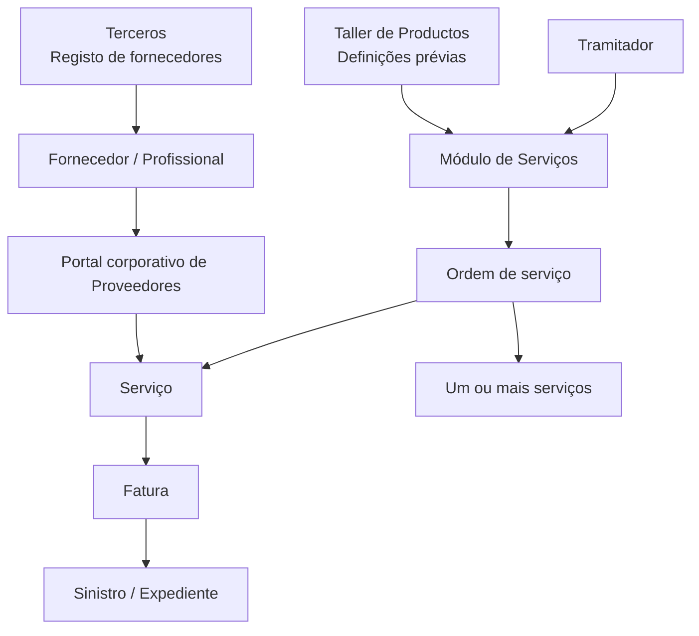
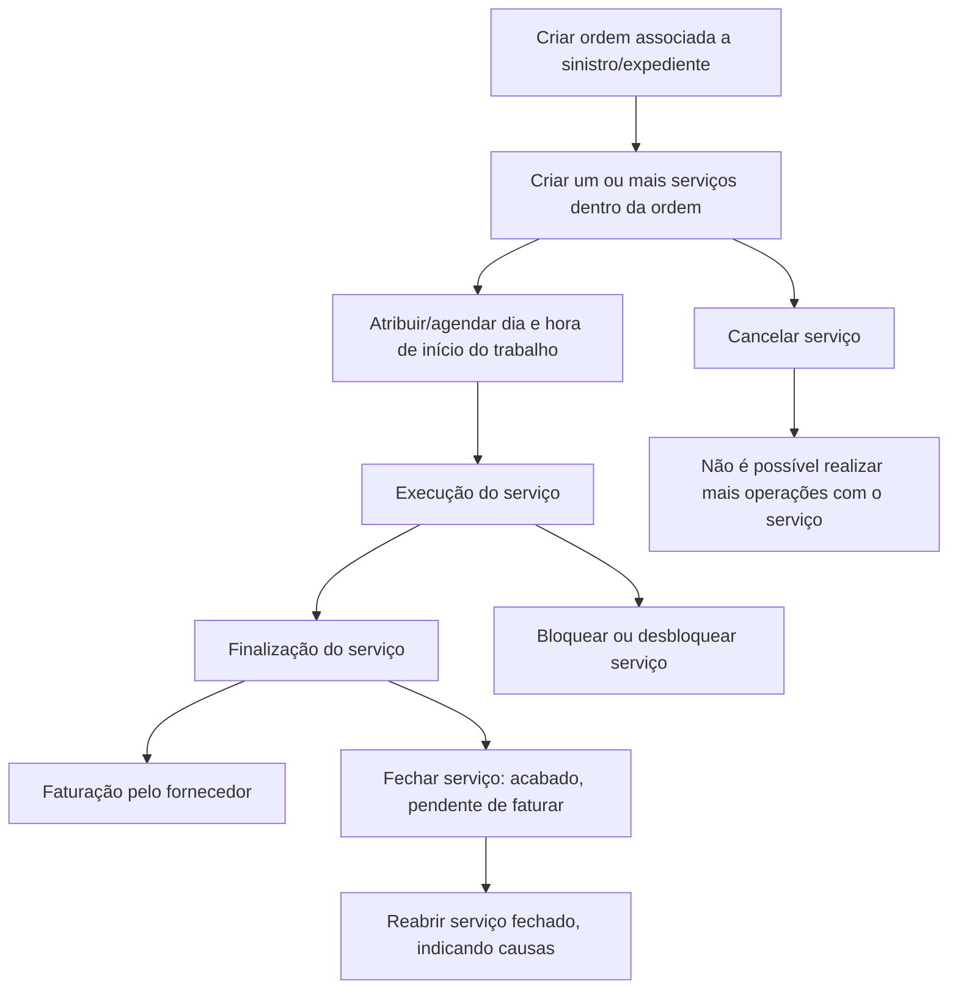

# Módulo de Serviços: Gestão de Ordens, Serviços, Fornecedores, Faturas e Operações

## 1. Metadados do Documento
- **Arquivo de Origem:** Não identificado no conteúdo fornecido
- **Tipo de Documento:** Apresentação Executiva / Manual Funcional
- **Domínio / Sistema:** Serviços — Documentação Reef / Mapfre
- **Público-Alvo:** Tramitadores, fornecedores, equipas de sinistros/expedientes e operação
- **Data/Versão Identificada:** Não identificada

---

## 2. Resumo Executivo & Contexto de Negócio

O documento descreve o módulo de **Serviços**, cuja finalidade é registar e gerir trabalhos desde o respetivo encargo a um profissional até à finalização e receção do resultado. O módulo cobre funcionalidades de tramitação de serviços por meio de um portal de Serviços e de comunicação com fornecedores através do portal corporativo de Proveedores.

A gestão operacional está organizada em torno de quatro elementos: **ordem**, **serviço**, **fatura** e **liquidação**. Uma ordem representa o encargo de trabalho e pode requerer um ou mais serviços. Cada serviço representa um trabalho solicitado a um fornecedor para solucionar uma ordem. A fatura representa o montante a pagar ao fornecedor e deve estar associada, no mínimo, a um sinistro ou expediente.

A execução de serviços depende do registo prévio dos fornecedores no sistema de **Terceros**. O registo deve contemplar meios de contacto e meios de cobrança/pagamento, permitindo tanto o contacto operacional como a realização de pagamentos.

O módulo é parametrizável: o comportamento da aplicação depende de definições prévias realizadas no **Taller de Productos**. As definições estão distribuídas por níveis comum, geral e ramo, cobrindo, entre outros elementos, oficinas, causas de processo, motivos de bloqueio e avisos de serviços.

O documento atribui operações ao tramitador e, em determinadas ações, ao fornecedor por meio do portal. Entre as operações destacam-se criar ordem, criar serviço, atribuir/agendar serviço, alterar dados, alterar estados, gerir bloqueios, fechar, cancelar, reabrir e consultar avanços ou histórico de movimentos.

---

## 3. Arquitetura, Componentes & Tecnologias Envolvidas

### Componentes e entidades identificados

| Componente / Entidade | Papel identificado no documento | Relações ou observações |
| :--- | :--- | :--- |
| Módulo de Serviços | Tramita serviços desde o encargo ao profissional até à finalização e receção do resultado. | Parametrizável; comportamento dependente de definições prévias. |
| Portal de Serviços | Canal para funcionalidades de tramitação de serviços. | Comunica-se através do portal corporativo de fornecedores. |
| Portal corporativo de Proveedores | Canal utilizado por fornecedores para determinadas operações sobre serviços. | Permite, entre outras ações, atribuição, alteração de estados, bloqueio/desbloqueio, fecho, cancelamento, consulta de avanços e consulta de histórico. |
| Terceros | Sistema onde fornecedores devem ser registados. | O registo contempla meios de contacto e meios de cobrança/pagamento. |
| Taller de Productos | Referência para definições prévias que condicionam o comportamento da aplicação. | O documento não detalha a estrutura ou configuração do Taller de Productos. |
| Ordem de serviço | Encargo de trabalho associado a um sinistro/expediente. | Pode ser resolvida por um ou vários serviços. |
| Serviço | Pedido de realização de trabalho a um profissional. | Está sempre incluído numa ordem. |
| Fatura | Montante a pagar pelo serviço ao fornecedor. | Está sempre ligada a pelo menos um sinistro/expediente. |
| Liquidação | Elemento listado na estrutura de Serviços. | O documento não fornece detalhamento funcional adicional. |
| Fornecedor | Profissional ou prestador que realiza trabalhos. | Exemplos mencionados: fornecedor de peças, oficina, pedreiro. |
| Tramitador | Utilizador que opera e intervém no ciclo de vida do serviço. | Pode criar, modificar, bloquear, desbloquear, fechar, cancelar, reabrir e emitir notificações manuais. |
| Sinistro / Expediente | Contexto ao qual ordens e faturas podem estar ligados. | Uma ordem pode ser associada a um sinistro/expediente; uma fatura deve estar ligada a pelo menos um. |



### Fluxo funcional de gestão de serviço



> **Nota de Análise:** O documento menciona os estados “Ejecución”, “Finalizado”, “Facturado”, fechado e cancelado, mas não apresenta uma máquina de estados completa, transições obrigatórias, métodos técnicos, APIs, contratos JSON ou persistência de dados.

---

## 4. Regras de Negócio, Especificações Funcionais & Processos

### 4.1 Finalidade do módulo

O módulo de Serviços permite registar todos os trabalhos desde o momento em que são encarregados a um profissional até à finalização e receção do resultado. O módulo contém funcionalidades necessárias para solicitar um serviço a um profissional e conduzir o serviço até à finalização, comunicando-se através do portal corporativo de fornecedores.

### 4.2 Registo obrigatório de fornecedores

Para executar um serviço, os fornecedores devem estar registados no sistema Terceros. O documento exemplifica os seguintes tipos de fornecedor:

- Fornecedor de peças.
- Oficina.
- Pedreiro.

O registo de fornecedor deve contemplar:

- Meios de contacto.
- Meios de cobrança/pagamento.
- Informação necessária para realizar pagamentos.
- Informação necessária para contactar o fornecedor.

### 4.3 Elementos de um serviço

| Elemento | Definição funcional | Regras e relações |
| :--- | :--- | :--- |
| Ordem de serviço | Encargo de um trabalho. | Pode ser resolvida por um ou vários serviços. Pode ser associada a um sinistro/expediente. |
| Serviço | Cada trabalho a realizar por um fornecedor para solucionar uma ordem. | Está sempre incluído numa ordem. |
| Fatura | Montante a pagar pelo serviço ao fornecedor. | Deve estar sempre ligada a, pelo menos, um sinistro/expediente. |
| Liquidação | Elemento listado no módulo de Serviços. | Sem detalhamento adicional no texto fornecido. |

### 4.4 Dados mencionados no elemento Serviço

O serviço pode conter, entre outros, os seguintes dados:

| Campo / Informação | Descrição identificada |
| :--- | :--- |
| Data de criação do serviço | Data associada à criação do serviço. |
| Identificação do fornecedor | Identificação do fornecedor responsável pelo trabalho. |
| Atividade | Informação de atividade do serviço. |
| Documento | Documento relacionado ao serviço. |
| Tipo de documento | Tipo do documento relacionado ao serviço. |
| Estado | Estado atual do serviço. |
| Montantes | Valores monetários associados ao serviço. |
| Outros dados | O documento indica “etc.”, sem especificar campos adicionais. |

### 4.5 Níveis de definição

As definições de Serviços estão organizadas pelos níveis **Comum**, **Geral**, **Ramo** e **Expediente**. O conteúdo fornecido detalha definições para os níveis Comum, Geral e Ramo; não detalha definições específicas do nível Expediente.

| Nível | Definições identificadas | Finalidade / regra |
| :--- | :--- | :--- |
| Comum | Taller | Inclui definições que não são exclusivas do módulo de sinistros, mas necessárias para definir serviços. Permite registar oficinas da companhia com meios de pagamento, meios de contacto e outras informações. |
| Geral | Causa Processo | Definição que afeta todos os possíveis expedientes aos quais um serviço possa ser associado. O documento também relaciona a causa de processo à catalogação de motivos de cancelamento ou reabertura. |
| Geral | Motivos Bloqueo | Permite catalogar as causas pelas quais um serviço é bloqueado. |
| Geral | Motivos Bloqueo por Estado | Listado como definição geral; o documento não fornece detalhamento adicional. |
| Ramo | Causa Processo | Permite catalogar, por ramo, os motivos para cancelamento ou reabertura de um serviço. |
| Ramo | Avisos Servicios | Permite definir avisos por tipo de serviço, tipo de expediente, nível, trâmite e outros critérios indicados pelo documento. |
| Expediente | Não detalhado | O nível é listado, mas o documento não apresenta definições específicas. |

### 4.6 Operações sobre serviços

| Operação | Responsável identificado | Descrição funcional | Condições, estados ou observações |
| :--- | :--- | :--- | :--- |
| Criar ordem | Tramitador | Gera uma ordem de trabalho e associa-a a um sinistro/expediente. | Uma ordem pode precisar de um a “n” serviços para ser satisfeita. |
| Criar serviço | Tramitador | Gera o pedido de realização de um trabalho a um profissional. | O serviço está sempre incluído numa ordem. |
| Atribuir serviço | Tramitador e fornecedor via portal | Agenda dia e hora para o fornecedor iniciar o trabalho. | Exemplos: agendar a entrada de veículo numa oficina; agendar a deslocação de um pedreiro a um domicílio. |
| Modificar serviço | Tramitador | Modifica dados do serviço quando considerar necessário. | O documento não limita quais dados podem ser modificados. |
| Modificar estados | Apenas fornecedor via portal | Coloca o serviço em Ejecución, Finalizado e Facturado. | O documento afirma que apenas o fornecedor pode executar esta alteração pelo portal. |
| Criar notificações manuais | Tramitador | Gera notificações manuais para o fornecedor. | O tramitador pode visualizar se a notificação foi lida pelo fornecedor. |
| Gerir bloqueios | Tramitador e fornecedor via portal | Paralisa, bloqueia ou desbloqueia a execução do serviço. | O tramitador pode usar motivos catalogados; o fornecedor também pode bloquear e desbloquear pelo portal. |
| Fechar serviço | Tramitador e fornecedor via portal | Fecha o serviço. | O estado fechado indica que o serviço está acabado e pendente de faturar. |
| Cancelar serviço | Tramitador e fornecedor via portal | Cancela o serviço. | O cancelamento suspende a realização do serviço; depois desse estado não podem ser realizadas mais operações com o serviço. |
| Reabrir serviço | Tramitador | Reabre um serviço fechado. | Requer indicação das causas. |
| Consultar avanços | Tramitador e fornecedor via portal | Mostra os diferentes movimentos no estado de Ejecución. | Habilitado para tramitador e portal do fornecedor. |
| Consultar histórico de movimentos | Tramitador e fornecedor via portal | Mostra todos os estados pelos quais um serviço passou. | Habilitado para tramitador e portal do fornecedor. |

### 4.7 Regras explícitas de estado e operação

1. Um serviço deve estar incluído numa ordem.
2. Uma ordem pode necessitar de um ou mais serviços.
3. Uma fatura deve estar ligada a pelo menos um sinistro/expediente.
4. O fornecedor, e apenas o fornecedor, pode colocar o serviço nos estados de Ejecución, Finalizado e Facturado a partir do portal.
5. O serviço fechado está acabado, mas permanece pendente de faturação.
6. O serviço cancelado suspende a sua realização.
7. Depois do cancelamento, não é possível realizar mais operações sobre o serviço.
8. A reabertura aplica-se a um serviço fechado e exige indicação de causas.
9. O bloqueio pode ser realizado pelo tramitador com base em motivos catalogados.
10. O fornecedor pode bloquear e desbloquear o serviço através do portal.
11. O tramitador pode emitir notificações manuais ao fornecedor e verificar se foram lidas.
12. A consulta de avanços mostra movimentos ocorridos dentro do estado de Ejecución.
13. A consulta de histórico mostra todos os estados percorridos por um serviço.

---

## 5. Tabelas de Parâmetros, Ambientes e Estruturas de Dados

### 5.1 Parâmetros e definições de negócio

| Item / Parâmetro | Descrição / Função | Tipo / Valores / Formato | Ambiente / Observações |
| :--- | :--- | :--- | :--- |
| Taller | Registo de oficinas da companhia com meios de pagamento, meios de contacto e outras informações. | Definição de nível Comum. | Necessário para definição de serviços; não exclusivo do módulo de sinistros. |
| Causa Processo — Geral | Definição que afeta possíveis expedientes associados a serviços. | Definição de nível Geral. | Associada no documento à catalogação de motivos de cancelamento ou reabertura. |
| Motivos Bloqueo | Catalogação das causas para bloquear um serviço. | Definição de nível Geral. | Utilizada na gestão de bloqueios. |
| Motivos Bloqueo por Estado | Parâmetro listado pelo documento. | Definição de nível Geral. | Sem descrição adicional. |
| Causa Processo — Ramo | Catalogação, por ramo, dos motivos para cancelamento ou reabertura de serviços. | Definição de nível Ramo. | Aplicável a cada ramo. |
| Avisos Servicios | Definição de avisos. | Por tipo de serviço, tipo de expediente, nível, trâmite e outros. | Definição de nível Ramo. |
| Serviço — Data de criação | Data em que o serviço foi criado. | Data; formato não especificado. | Campo mencionado no serviço. |
| Serviço — Fornecedor | Identificação do fornecedor. | Formato não especificado. | Campo mencionado no serviço. |
| Serviço — Atividade | Atividade associada ao serviço. | Formato não especificado. | Campo mencionado no serviço. |
| Serviço — Documento | Documento relacionado ao serviço. | Formato não especificado. | Campo mencionado no serviço. |
| Serviço — Tipo de documento | Tipo do documento relacionado ao serviço. | Formato não especificado. | Campo mencionado no serviço. |
| Serviço — Estado | Estado atual do serviço. | Ejecución, Finalizado, Facturado; fechado e cancelado também são descritos. | O documento não define todos os estados nem a ordem integral de transição. |
| Serviço — Montantes | Valores económicos associados ao serviço. | Formato e moeda não especificados. | Campo mencionado no serviço. |

### 5.2 Matriz de responsabilidades operacionais

| Operação | Tramitador | Fornecedor via portal | Observação |
| :--- | :---: | :---: | :--- |
| Criar ordem | Sim | Não indicado | A ordem é associada a sinistro/expediente. |
| Criar serviço | Sim | Não indicado | O serviço pertence a uma ordem. |
| Atribuir/agendar serviço | Sim | Sim | Define dia e hora de início do trabalho. |
| Modificar dados do serviço | Sim | Não indicado | O documento atribui esta capacidade ao tramitador. |
| Alterar para Ejecución | Não indicado | Sim, apenas fornecedor | Restrição explícita ao fornecedor pelo portal. |
| Alterar para Finalizado | Não indicado | Sim, apenas fornecedor | Restrição explícita ao fornecedor pelo portal. |
| Alterar para Facturado | Não indicado | Sim, apenas fornecedor | Restrição explícita ao fornecedor pelo portal. |
| Criar notificações manuais | Sim | Não indicado | O tramitador verifica leitura pelo fornecedor. |
| Bloquear serviço | Sim | Sim | Tramitador utiliza motivos catalogados. |
| Desbloquear serviço | Sim | Sim | Permitido pelo portal ao fornecedor. |
| Fechar serviço | Sim | Sim | Fechado significa acabado e pendente de faturar. |
| Cancelar serviço | Sim | Sim | Cancelamento impede operações posteriores. |
| Reabrir serviço | Sim | Não indicado | Exige indicação de causas. |
| Consultar avanços | Sim | Sim | Apresenta movimentos em Ejecución. |
| Consultar histórico de movimentos | Sim | Sim | Apresenta todos os estados percorridos. |

### 5.3 Ambientes, URLs, logs e infraestrutura

| Item / Parâmetro | Descrição / Função | Tipo / Valores / Formato | Ambiente / Observações |
| :--- | :--- | :--- | :--- |
| Ambientes | Não identificados. | Não aplicável. | O documento não apresenta URLs, servidores ou ambientes. |
| Rotas de log | Não identificadas. | Não aplicável. | O documento não apresenta caminhos, variáveis ou ferramentas de logs. |
| APIs / métodos HTTP | Não identificados. | Não aplicável. | O documento não descreve endpoints, contratos JSON ou métodos HTTP. |
| Tecnologias de implementação | Não identificadas. | Não aplicável. | O texto descreve funcionalidades, não a implementação técnica. |

---

## 6. Bateria de Perguntas & Respostas para RAG (FAQ Sintético)

### P1: Qual é a finalidade do módulo de Serviços?
**R:** O módulo de Serviços permite registar e gerir trabalhos desde o momento em que são encarregados a um profissional até à finalização e receção do resultado. O módulo suporta a solicitação de serviços a fornecedores e a tramitação correspondente através do portal de Serviços e do portal corporativo de Proveedores.

### P2: Quais são os elementos que compõem a gestão de Serviços?
**R:** O documento identifica quatro elementos: ordem, serviço, fatura e liquidação. A ordem representa o encargo de trabalho; o serviço é o trabalho solicitado a um fornecedor dentro de uma ordem; a fatura representa o montante a pagar ao fornecedor; e a liquidação é listada como elemento, embora não tenha detalhamento funcional adicional.

### P3: Uma ordem de serviço pode ter mais do que um serviço?
**R:** Sim. Uma ordem de serviço é um encargo de trabalho que pode ser solucionado por um ou vários serviços. Ao criar uma ordem, o documento indica que pode ser necessário de um a “n” serviços para satisfazê-la.

### P4: Que relação existe entre o serviço e a ordem?
**R:** Um serviço representa a solicitação de realização de um trabalho a um profissional para resolver uma ordem. O documento estabelece que o serviço está sempre englobado dentro de uma ordem.

### P5: Que condição deve cumprir uma fatura no módulo de Serviços?
**R:** A fatura corresponde ao montante a pagar ao fornecedor pelo serviço e deve estar sempre ligada a, pelo menos, um sinistro ou expediente.

### P6: Que dados podem estar presentes num serviço?
**R:** O documento menciona data de criação do serviço, identificação do fornecedor, atividade, documento, tipo de documento, estado e montantes. Também indica que podem existir outros dados, sem especificá-los.

### P7: Um fornecedor pode ser usado para realizar serviços sem estar registado?
**R:** Não. Para realizar um serviço, os fornecedores devem estar registados no sistema Terceros. Esse registo deve incluir meios de contacto e meios de cobrança/pagamento, permitindo contactar o fornecedor e realizar pagamentos.

### P8: Quem pode colocar um serviço nos estados Ejecución, Finalizado e Facturado?
**R:** Apenas o fornecedor pode colocar o serviço nos estados Ejecución, Finalizado e Facturado, realizando essa operação a partir do portal corporativo de Proveedores.

### P9: O que significa fechar um serviço?
**R:** Fechar um serviço indica que o serviço está acabado, mas pendente de faturar. A funcionalidade pode ser realizada pelo tramitador e também pelo fornecedor através do portal.

### P10: O que acontece quando um serviço é cancelado?
**R:** O cancelamento suspende a realização do serviço. Após o serviço ser cancelado, não podem ser realizadas mais operações sobre esse serviço. O tramitador e o fornecedor pelo portal podem realizar o cancelamento.

### P11: Como funciona a reabertura de um serviço?
**R:** A reabertura pode ser efetuada pelo tramitador sobre um serviço fechado. Para reabrir o serviço, o tramitador deve indicar as causas da reabertura.

### P12: Quem pode bloquear ou desbloquear um serviço?
**R:** O tramitador pode intervir para paralisar, bloquear ou desbloquear a execução do serviço, utilizando motivos catalogados. O fornecedor também pode bloquear e desbloquear o serviço através do portal corporativo de Proveedores.

### P13: Qual é a diferença entre consultar avanços e consultar o histórico de movimentos?
**R:** Consultar avanços mostra os diferentes movimentos ocorridos dentro do estado de Ejecución. Consultar o histórico de movimentos mostra todos os estados pelos quais o serviço passou. Ambas as consultas estão habilitadas para o tramitador e para o portal do fornecedor.

### P14: Quais são os níveis de definição existentes para Serviços?
**R:** O documento lista os níveis Comum, Geral, Ramo e Expediente. O nível Comum inclui, por exemplo, Taller; o nível Geral inclui Causa Processo, Motivos Bloqueo e Motivos Bloqueo por Estado; e o nível Ramo inclui Causa Processo e Avisos Servicios. O documento não detalha configurações específicas do nível Expediente.

### P15: Que parâmetros podem ser definidos em Avisos Servicios?
**R:** Avisos Servicios permite definir avisos por tipo de serviço, tipo de expediente, nível, trâmite e outros critérios mencionados de forma aberta pelo documento. A definição pertence ao nível Ramo.

---

## 7. Glossário de Termos, Siglas & Conceitos-Chave

- **Avisos Servicios:** Definições de avisos por tipo de serviço, tipo de expediente, nível, trâmite e outros critérios, no nível Ramo.
- **Causa Proceso:** Definição utilizada para catalogar motivos de cancelamento ou reabertura de serviços; existe nos níveis Geral e Ramo.
- **Ejecución:** Estado no qual são apresentados movimentos por meio da funcionalidade Consultar avanços.
- **Expediente:** Entidade à qual uma ordem pode ser associada e à qual uma fatura deve estar ligada, no mínimo uma vez.
- **Facturado:** Estado que o fornecedor pode atribuir ao serviço através do portal.
- **Finalizado:** Estado que o fornecedor pode atribuir ao serviço através do portal.
- **Liquidação:** Elemento listado no módulo de Serviços; não detalhado no conteúdo fornecido.
- **Motivos Bloqueo:** Definição geral para catalogar causas de bloqueio de um serviço.
- **Motivos Bloqueo por Estado:** Definição geral listada no documento, sem explicação adicional.
- **Ordem de serviço:** Encargo de trabalho que pode requerer um ou mais serviços.
- **Portal corporativo de Proveedores:** Portal por meio do qual o fornecedor realiza determinadas operações sobre serviços.
- **Ramo:** Nível de definição que permite parametrizações específicas para cada ramo.
- **Serviço:** Trabalho solicitado a um fornecedor e sempre pertencente a uma ordem.
- **Sinistro:** Entidade que pode ser associada a uma ordem e à qual uma fatura deve estar ligada, no mínimo uma vez.
- **Taller:** Definição de nível Comum para registar oficinas da companhia com meios de pagamento, contacto e outras informações.
- **Taller de Productos:** Referência a definições prévias das quais depende o comportamento parametrizável da aplicação.
- **Terceros:** Sistema no qual fornecedores devem estar registados.
- **Tramitador:** Utilizador responsável por operar e intervir no processo de gestão de serviços.

---

## 8. Notas Críticas, Riscos & Limitações

- O documento não identifica o nome do arquivo de origem, data, versão, autor ou responsáveis pelo conteúdo.
- O documento não descreve arquitetura de infraestrutura, protocolos de integração, APIs, métodos HTTP, contratos JSON, bases de dados, filas, URLs, servidores, ambientes ou mecanismos de autenticação.
- O documento não detalha a implementação técnica dos portais de Serviços e de Proveedores.
- A máquina de estados completa não é apresentada. Apenas são explicitamente mencionados os estados Ejecución, Finalizado, Facturado, fechado e cancelado.
- Não são documentadas as transições permitidas entre todos os estados, pré-condições, validações, permissões técnicas ou regras de exceção.
- A operação “Modificar estados” é atribuída exclusivamente ao fornecedor pelo portal para os estados Ejecución, Finalizado e Facturado, mas o documento não esclarece quem cria o estado inicial de um serviço.
- O documento menciona “Motivos Bloqueo por Estado”, mas não explica a estrutura, os valores, a associação aos estados ou o comportamento dessa definição.
- O nível de definição Expediente é listado, mas não contém exemplos ou regras detalhadas.
- A liquidação é apresentada como elemento de Serviços, porém o documento não fornece processo, dados, responsáveis ou relação explícita com faturas.
- O termo “Taller de Productos” é citado como fonte de definições prévias, mas a sua operação, dados de configuração e dependências não são explicados.
- Os exemplos de fornecedores, oficina e pedreiro são funcionais; o documento não define taxonomias, códigos de atividade ou critérios de elegibilidade.
- Não são descritos mecanismos de auditoria além da consulta de histórico de movimentos e da verificação de leitura de notificações pelo fornecedor.

---

## 9. Conteúdo Bruto Estruturado (Referência Fiel)

```text
--- [PÁGINA 1 DE 4] ---

INTRODUCCIÓN - Servicios
Objetivo
La finalidad de este módulo, es poder registrar todas los trabajos, desde que se encargan a un profesional, hasta que se finaliza y se recibe el
resultado.
Características
Elementos de un Servicio
orden
Servicio
Factura
Definiciones de Servicios
Operaciones de Servicios
Características
Cubre todas las funcionalidades para tramitar servicios, a través del portal de Servicios
Contiene todas las funcionalidades necesarias para la solicitud de un servicio a un profesional, hasta la finalización del mismo,
comunicándose a través del portal corporativo de Proveedores.
Parametrizable
El módulo es parametrizable y el comportamiento de la aplicación depende de las definiciones previas (Taller de Productos).
Registro de Proveedor
Para realizar un servicio,los proveedores (proveedor de piezas, taller,albañil..), etc tienen que estar registrados en el sistema (Terceros),
con sus medios de contacto, sus medios de cobro / pago, para poder realizar pagos y para poder contactar con ellos.
Elementos de los Servicios
Las Servicios están compuestas de varios elementos:
Documentation / DOCUMENTACIÓN Reef
DOCUMENTACIÓN Reef
Mapfredocument
DOCUMENTACIÓN Reef
Owner
user:agonzalez_mapfre.com
Lifecycle
Approved Source
 /
 VL
Buscar Inicio Soluciones Arquitecturas APIs Componentes Cloud Documentación Zeus Reef Ayuda
ES


--- [PÁGINA 2 DE 4] ---

SERVICIOS
ORDEN SERVICIO FACTURA LIQUIDACIÓN
Orden del servicio
Encargo de un trabajo, que puede ser solucionado por uno o varios servicios.
Servicio
Cada uno de los trabajos a realizar por un proveedor, para poder solucionar una orden. Este elemento contendrá:
Fecha creación del servicio
Identificación del proveedor:
Actividad
Documento
Tipo de Documento
Estado
Importes
Etc.
Factura
Importe a pagar por el servicio al proveedor. Siempre estará ligado al menos a un siniestro / expediente.
Definiciones Servicios
Los elementos de definición atienden a distintos niveles:
NIVELES DE DEFINICIÓN
COMÚN GENERAL RAMO EXPEDIENTE
COMÚN
En este nivel se encuentran definiciones que NO son exclusivas del módulo de siniestros, pero son
necesarias para poder realizar la definición de servicios. En otros se encuentran:
TALLER
Registrar todos los talleres de la compañía con sus medios de pago, medio de contacto, etc
GENERAL
En este Nivel se encuentran definiciones que afectarán a todos los posibles expedientes a los que se les
pueda asociar un servicio. Entre otros se define:
CAUSA PROCESO
 MOTIVOS BLOQUEO
 MOTIVOS BLOQUEO POR ESTADO


--- [PÁGINA 3 DE 4] ---

Permite catalogar los motivos por los que
se quiere cancelar un servicio o
reaperturar un servicio
Permite catalogar las causas por las que
se bloquea un servicio
RAMO
En este Nivel se encuentran definiciones para cada ramo
CAUSA PROCESO
Permite catalogar los motivos por los que se quiere realizar la
cancelación o reapertura de un servicio para cada ramo
AVISOS SERVICIOS
Permite definir los avisos por tipo de servicio, tipo de expediente,
nivel, trámite etc
Operaciones de Servicios
SERVICIOS
Operaciones se pueden realizar con los servicios de los proveedores
CREAR orden
Permite generar una orden de trabajo y
asociarla a un siniestro/expediente. Para
satisfacer una orden puede necesitarse de
uno a "n" servicios
CREAR servicio
Permite generar la petición de la
realización de un trabajo a un profesional,
que siempre estará englobado dentro una
orden
ASIGNAR Servicio
Agendar día y hora para que el proveedor
comience el trabajo. Ejemplo: Agendar al
taller cuando entra un vehículo, agendar a
una albañil cuando tiene que ir a un
domicilio...
Desde el portal, el proveedor también
puede realizar esta operación.
MODIFICAR servicio
El tramitador podrá modificar datos del
servicio cuando así lo considere
MODIFICAR estados
Desde el portal el proveedor y sólo el
proveedor, podrá poner el servicio en
Ejecución, Finalizado y Facturado.
CREAR notificaciones manuales
El tramitador puede generar notificaciones
manualmente al proveedor. El tramitador
puede visualizar si esta ha sido leída por
el proveedor
GESTIONAR Bloqueos
El tramitador, puede intervenir para
paralizar, bloquear la ejecución del
servicio, por motivos catalogados o para
desbloquear el mismo.
Desde el portal, el proveedor también
puede realizar ambas operaciones,
bloquear y desbloquear el servicio.
CERRAR servicio
El tramitador puede cerrar el servicio, este
estado indica que el servicio está
acabado, pendiente de facturar.
Desde el portal, el proveedor también
puede realizar esta funcionalidad
CANCELAR servicio
El tramitador puede cancelar el servicio.
Este estado indica que se suspende la
realización del servicio, desde este estado
ya no se puede realizar más operaciones
con el servicio
Desde el portal, el proveedor también
puede realizar esta funcionalidad
RE-APERTURAR servicio
El tramitador puede reaperturar un servicio
que está cerrado, indicando las causas
CONSULTAR avances
 CONSULTAR Histórico Mvtos.


--- [PÁGINA 4 DE 4] ---

Muestra los diferentes movimientos
dentro del estado de Ejecución. Habilitado
para el tramitador y el portal del proveedor
Muestra todos los estados por los que ha
pasado un servicio. Habilitado para el
tramitador y el portal del proveedor
Checking links...
```
