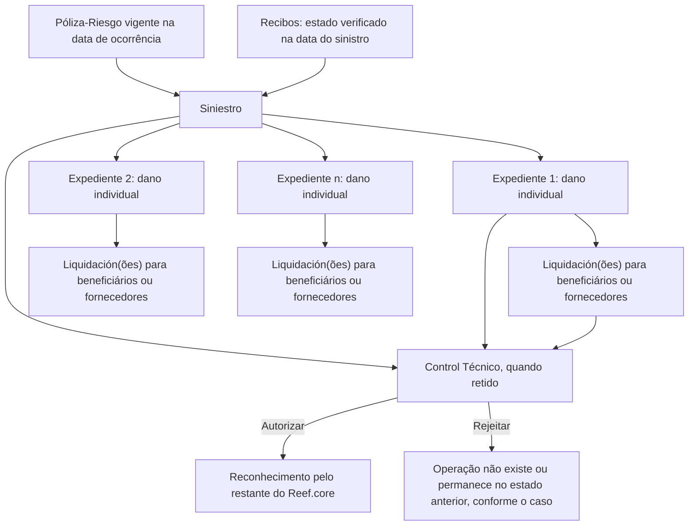
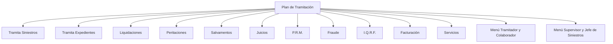

# Módulo de Siniestros do Reef.core — Gestão de Sinistros, Expedientes, Liquidações e Controle Técnico

## 1. Metadados do Documento
- **Arquivo de Origem:** `Não identificado — conteúdo bruto fornecido`
- **Tipo de Documento:** `Apresentação Executiva / Manual Funcional`
- **Domínio / Sistema:** `Reef.core — Módulo de Siniestros`
- **Público-Alvo:** `Tramitadores, Supervisores, Chefes de Siniestros, Colaboradores, Operação e Arquitetura`
- **Data/Versão Identificada:** `Não identificada`

---

## 2. Resumo Executivo & Contexto de Negócio

O documento apresenta o módulo de **Siniestros** do sistema **Reef.core**, destinado a suportar as gestões necessárias quando um risco segurado é afetado. O ciclo funcional cobre desde o conhecimento inicial do evento até o respectivo encerramento, incluindo o registro do sinistro, a abertura de expedientes por dano e a geração de liquidações para beneficiários ou fornecedores.

A unidade central de negócio é o **siniestro**, definido como o fato que afeta um risco assegurado pela companhia. Um único sinistro pode originar múltiplos **expedientes**, pois cada dano decorrente do evento é tratado individualmente. Cada expediente possui dados e informações econômicas próprios, podendo gerar uma ou mais liquidações.

O módulo suporta múltiplos negócios de seguros, incluindo Automóvel, Saúde, Vida, Transporte e Diversos. A solução possui características configuráveis por catálogos, com definição livre de dados de sinistro, expediente, coberturas e detalhe econômico. Também contempla modalidades de coaseguro cedido, aceito ou inexistente.

A operação é orientada a perfis, incluindo tramitador, supervisor e colaborador. As ferramentas baseadas no **Plan de Tramitación** organizam a gestão diária, a supervisão e a auditoria operacional. O documento também descreve operações de **Control Técnico**, pelas quais eventos retidos podem ser autorizados ou rejeitados, controlando quando alterações passam a ser reconhecidas pelo restante do Reef.core.

---

## 3. Arquitetura, Componentes & Tecnologias Envolvidas

### Componentes e entidades identificados

| Componente / Entidade | Papel descrito no documento |
| :--- | :--- |
| Reef.core | Sistema que reconhece sinistros, expedientes, modificações, liquidações, faturas e planos de renda após autorização em Controle Técnico. |
| Módulo de Siniestros | Módulo responsável pela gestão de sinistros, expedientes e liquidações. |
| Póliza-Riesgo | Pré-requisito para gerar um sinistro; deve existir, ser contratada pela empresa e estar vigente na data de ocorrência. |
| Recibos | Elemento verificado pelo módulo de Siniestros na data do sinistro; o comportamento pode variar conforme o ramo. |
| Siniestro | Fato que ocorre quando um risco segurado é afetado. |
| Expediente | Unidade correspondente a cada dano provocado como consequência de um sinistro. |
| Liquidación | Meio para pagar ou cobrar valores relacionados a beneficiários e fornecedores de um expediente. |
| Plan de Tramitación | Mecanismo que gerencia submódulos e fundamenta ferramentas de gestão, supervisão e auditoria. |
| Tramitador | Responsável pelas gestões necessárias em um expediente. |
| Supervisor | Responsável pelos tramitadores. |
| Colaborador | Perfil como perito ou advogado; pode executar uma série limitada de trâmites. |
| Control Técnico | Conjunto de operações de autorização e rejeição para itens retidos por auditoria. |
| Peritaciones | Submódulo de sinistros gerenciado pelo Plan de Tramitación. |
| Salvamentos | Submódulo de sinistros gerenciado pelo Plan de Tramitación. |
| Juicios | Submódulo de sinistros gerenciado pelo Plan de Tramitación. |
| P.R.M. | Submódulo listado como gerenciado pelo Plan de Tramitación. |
| Fraude | Submódulo de sinistros gerenciado pelo Plan de Tramitación. |
| I.Q.R.F. | Submódulo de sinistros gerenciado pelo Plan de Tramitación. |
| Facturación | Submódulo de sinistros gerenciado pelo Plan de Tramitación. |
| Servicios | Submódulo listado como gerenciado pelo Plan de Tramitación. |
| Reaseguro | Componente apresentado no fluxo de entradas e saídas do módulo. |

### Fluxo funcional principal



### Relação entre operação e Plan de Tramitación



> **Nota de Análise:** O documento não detalha tecnologias de implementação, métodos HTTP, APIs, contratos JSON, bancos de dados, URLs, ambientes, versões, portas ou protocolos de integração.

---

## 4. Regras de Negócio, Especificações Funcionais & Processos

### 4.1 Conceito de siniestro

Um **siniestro** é o fato que ocorre quando um risco segurado pela companhia é afetado. Os exemplos apresentados incluem:

- Habitação segurada: casa inundada ou incendiada.
- Veículo segurado: veículo acidentado ou roubado.
- Pessoa segurada: operação de uma pessoa ou falecimento.
- Mercadoria segurada: mercadoria roubada ou incendiada.

No sinistro é armazenada a informação recebida pelos diferentes canais, como telefone e páginas web. Entre os dados citados estão:

- Póliza e risco afetado pelo sinistro.
- Datas de ocorrência.
- Relato do sinistro.
- Local do sinistro.

### 4.2 Regra de abertura de expediente

Um **expediente** representa cada dano ocasionado como consequência de um sinistro. Um sinistro pode gerar um ou mais expedientes.

No exemplo do documento, um segurado informa um acidente no qual colidiu com outro veículo e ficou ferido. O fato inteiro é classificado como um siniestro. Como existem danos distintos, são abertos três expedientes:

1. Expediente de danos materiais ao veículo segurado.
2. Expediente de danos materiais ao veículo contrário.
3. Expediente de lesões do ocupante do veículo segurado.

Cada expediente possui informação própria, tanto de dados quanto econômica.

### 4.3 Regra de liquidação

A **liquidación** é o meio pelo qual são realizados pagamentos ou cobranças relacionados aos afetados e fornecedores que participaram em um expediente.

Deve ser gerada a quantidade de liquidações necessária para atender a todos os beneficiários envolvidos no expediente.

### 4.4 Pré-requisitos de entrada

Para gerar um sinistro, devem ser atendidas as seguintes condições:

1. Deve existir uma póliza-risco contratada pela empresa.
2. A póliza-risco deve estar vigente na data de ocorrência do sinistro.
3. O módulo de Siniestros verifica o estado do recibo na data do sinistro.
4. Conforme o ramo, o módulo pode comportar-se de forma distinta após a verificação dos recibos.

### 4.5 Características funcionais configuráveis

O módulo de Siniestros possui as seguintes capacidades:

- Suporte a múltiplos tipos de negócio: Automóvel, Saúde, Vida, Transporte, Diversos e outros.
- Configuração por catálogos do comportamento e das características da aplicação de sinistros para cada produto.
- Tratamento de coaseguro cedido, coaseguro aceito ou ausência de coaseguro.
- Suporte a um ou mais expedientes para um siniestro.
- Definição livre do detalhe do sinistro.
- Definição livre do detalhe do expediente, incluindo o que ou quem foi afetado, localização e danos produzidos.
- Definição livre das coberturas afetadas por um expediente.
- Definição livre do detalhe econômico para pagamento a profissionais ou afetados.
- Retenção de sinistros, expedientes e ordens de pagamento para posterior autorização ou rejeição.
- Operação por telas fornecidas, por outras telas ou sem telas, em diferido, por processo de carga massiva.

### 4.6 Papéis operacionais

| Perfil | Responsabilidade descrita |
| :--- | :--- |
| Tramitador | Responsável por realizar todas as gestões necessárias para um expediente. |
| Supervisor | Responsável pelos tramitadores. |
| Colaborador | Perfil como perito ou advogado. |
| Jefe de Supervisores / Jefe de Siniestros | Responsável pela gestão de supervisores e pela visão consolidada de controle descrita no menu correspondente. |

### 4.7 Operações do Menu Tramitador e Colaborador

O Menu do Tramitador e do Colaborador organiza o trabalho dos tramitadores e de colaboradores que realizam somente determinados trâmites. As operações são baseadas no Plan de Tramitación.

| Operação | Resultado apresentado |
| :--- | :--- |
| Consultar avisos pendientes detalle | Mostra expedientes que possuem o aviso indicado pendente, conforme condições filtradas pelo tramitador. |
| Consultar tramites pendientes detalle | Mostra expedientes que possuem o trâmite indicado pendente, conforme condições filtradas pelo tramitador. |
| Consultar cartas detalle | Mostra expedientes para os quais foi gerada a carta indicada, conforme condições filtradas pelo tramitador. |
| Consultar expedientes sin actividad detalle | Mostra expedientes nos quais não foi realizada nenhuma operação, conforme condições filtradas pelo tramitador. |
| Consultar expedientes asignados detalle | Mostra expedientes do tramitador conforme estado, incluindo pendente, em juízo e retido por controle técnico, conforme filtros aplicados. |
| Consultar estado control tramites detalle | Mostra expedientes com data de controle definida, correspondente ao tempo máximo para execução, no estado indicado pelo tramitador e conforme filtros aplicados. |

### 4.8 Operações do Menu Supervisor e Jefe de Siniestros

O menu de Supervisor e Jefe de Siniestros organiza a gestão e a auditoria com base no Plan de Tramitación. O objetivo principal é controlar a gestão dos tramitadores e, para responsáveis ou chefes de sinistros, a gestão dos supervisores.

Para supervisores, a consulta exibe tramitadores e o número de expedientes que atendem às condições. Para o jefe de siniestros, a consulta exibe supervisores e o número de tramitadores do supervisor que atendem às condições.

| Operação | Resultado apresentado |
| :--- | :--- |
| Consultar avisos pendientes totales | Mostra os tramitadores do supervisor e a quantidade de expedientes com aviso pendente, conforme filtros do supervisor. |
| Consultar tramites pendientes totales | Mostra os tramitadores do supervisor e a quantidade de expedientes com o trâmite indicado pendente. |
| Consultar cartas totales | Mostra os tramitadores do supervisor e a quantidade de expedientes para os quais foi gerada a carta indicada. |
| Consultar expedientes sin actividad totales | Mostra os tramitadores do supervisor e a quantidade de expedientes nos quais não foi realizada nenhuma operação. |
| Consultar expedientes asignados totales | Mostra os tramitadores do supervisor e a quantidade de expedientes do tramitador em estados como pendente, em juízo ou retido por controle técnico. |
| Consultar estado control tramites totales | Mostra os tramitadores do supervisor e a quantidade de expedientes com data de controle definida no estado indicado. |

### 4.9 Outras ferramentas do supervisor

O documento descreve um Menu del Supervisor que não é baseado no Plan de Tramitación. Entre as operações relevantes estão a manutenção de tramitadores pela rotina de terceiros, especialização de tramitadores e carga de trabalho.

| Operação | Regra funcional |
| :--- | :--- |
| Asignar tramitador | Atribui um tramitador a um siniestro ou expediente que ainda não possui tramitador atribuído. |
| Reasignar tramitador | Reatribui expedientes de um tramitador para outro devido à carga de trabalho ou porque o expediente entrou em um módulo que o tramitador atual não pode executar, como Juicios. |

### 4.10 Controle Técnico: autorizações

| Operação | Efeito após autorização |
| :--- | :--- |
| Autorizar Apertura Siniestro | Um siniestro retido por Controle Técnico passa a aprovado; o restante do Reef.core passa a reconhecê-lo como siniestro. |
| Autorizar Modificación siniestro | Uma modificação de siniestro retida passa a aprovada; o restante do Reef.core reconhece a modificação. |
| Autorizar Rehabilitación siniestro | A reabilitação retida é aprovada; o restante do Reef.core reconhece que o siniestro volta a estar pendente. |
| Autorizar Apertura expediente | Um expediente retido passa a aprovado; o restante do Reef.core passa a reconhecê-lo como expediente. |
| Autorizar Cambio valoración | Uma modificação de valoração retida é aprovada; o restante do Reef.core reconhece a nova valoração do expediente. |
| Autorizar Rehabilitación expediente | A reabilitação retida é aprovada; o restante do Reef.core reconhece que o expediente volta a estar pendente. |
| Autorizar Liquidación | Uma liquidação retida é aprovada; o restante do Reef.core reconhece a nova liquidação ou ordem de pagamento do expediente. |
| Autorizar creación facturación | Uma fatura retida é autorizada e validada; o restante do Reef.core reconhece a nova fatura. |
| Autorizar modificación facturación | Uma modificação de fatura retida é aceita; o restante do Reef.core reconhece a modificação da fatura. |
| Autorizar plan renta | Um Plan de Renta criado e retido é autorizado; o restante do Reef.core reconhece o plano de renda. |

### 4.11 Controle Técnico: rejeições

| Operação | Efeito após rejeição |
| :--- | :--- |
| Rechazar Apertura siniestro | O siniestro retido não é autorizado; para o Reef.core, não existe e não existiu. |
| Rechazar Modificación siniestro | A modificação retida não é autorizada; para o restante do Reef.core, a modificação não existe. |
| Rechazar Rehabilitación siniestro | A reabilitação retida não é autorizada; o siniestro permanece terminado. |
| Rechazar Apertura expediente | O expediente retido não é autorizado; para o restante do Reef.core, o expediente não existe. |
| Rechazar Cambio valoración | A modificação de valoração retida não é autorizada; o Reef.core conserva a valoração anterior. |
| Rechazar Rehabilitación expediente | A reabilitação retida não é autorizada; o expediente permanece terminado. |
| Rechazar Liquidación | A liquidação retida não é autorizada; para o restante do Reef.core, a liquidação não existe. |
| Rechazar creación facturación | A criação da fatura retida não é autorizada; a fatura não existe. |
| Rechazar modificación facturación | A modificação da fatura retida não é autorizada; a fatura permanece na situação anterior à modificação. |
| Rechazar plan renta | O Plan de Renta retido não é autorizado; para o restante do Reef.core, o plano de renda não existe. |

---

## 5. Tabelas de Parâmetros, Ambientes e Estruturas de Dados

| Item / Parâmetro | Descrição / Função | Tipo / Valores / Formato | Ambiente / Observações |
| :--- | :--- | :--- | :--- |
| Póliza-Riesgo | Base contratual necessária para gerar um sinistro. | Deve existir e estar vigente na data de ocorrência. | Entrada do Módulo de Siniestros. |
| Recibos | Informação consultada na data do sinistro. | Estado do recibo. | O comportamento do módulo pode variar conforme o ramo. |
| Siniestro | Fato que afeta um risco segurado. | Pode conter póliza, risco, datas, relato e lugar. | Pode gerar um ou mais expedientes. |
| Expediente | Registro individual de um dano decorrente de siniestro. | Dados próprios e informação econômica própria. | Pode estar em estados como pendente, em juízo ou retido por controle técnico. |
| Liquidación | Mecanismo de pagamento ou cobrança. | Uma ou mais por expediente, conforme beneficiários. | Pode gerar ordem de pagamento; pode estar retida por Controle Técnico. |
| Coaseguro | Modalidade de coasseguro suportada. | Cedido, aceito ou sem coaseguro. | Configurável no módulo. |
| Coberturas | Coberturas afetadas por um expediente. | Definição livre. | Não são detalhados nomes, regras ou formatos de cobertura. |
| Detalhe do siniestro | Informação requerida sobre o siniestro. | Definição livre. | Não são definidos campos obrigatórios adicionais além dos exemplos citados. |
| Detalhe do expediente | Informação sobre dano, pessoa ou bem afetado, localização e danos. | Definição livre. | Não é apresentado modelo de dados. |
| Detalhe econômico | Informação para pagamento a profissionais ou afetados. | Definição livre. | Não são definidos valores, moedas ou fórmulas. |
| Data de controle | Prazo máximo para realização de um trâmite. | Data definida para o expediente. | Consultada em “estado control tramites”. |
| Tramitador | Perfil responsável pelas gestões de expediente. | Perfil operacional. | Pode receber atribuição ou reatribuição de expedientes. |
| Supervisor | Perfil responsável pelos tramitadores. | Perfil de gestão e auditoria. | Consulta dados consolidados por tramitador. |
| Colaborador | Perfil como perito ou advogado. | Perfil operacional especializado. | Pode executar série específica de trâmites. |
| P.R.M. | Submódulo listado no Plan de Tramitación. | Sigla não expandida no texto. | Também há referência a “Plan de Renta Mensual” para acidentes laborais. |
| I.Q.R.F. | Submódulo listado no Plan de Tramitación. | Sigla não expandida no texto. | Sem detalhamento adicional. |

> **Nota de Análise:** O documento não apresenta URLs, nomes de servidores, bancos de dados, arquivos de configuração, rotas de log, versões de software, variáveis de ambiente ou especificações formais de estruturas de dados.

---

## 6. Bateria de Perguntas & Respostas para RAG (FAQ Sintético)

### P1: O que é um siniestro no módulo de Siniestros do Reef.core?
**R:** Um siniestro é o fato que ocorre quando um risco segurado pela companhia é afetado. O documento exemplifica siniestros como uma casa inundada ou incendiada, um veículo acidentado ou roubado, uma pessoa operada ou falecida e mercadoria roubada ou incendiada. O siniestro armazena informações como póliza e risco afetado, datas de ocorrência, relato e local do evento.

### P2: Qual é a diferença entre siniestro, expediente e liquidación?
**R:** O siniestro é o fato que afeta o risco segurado. O expediente representa cada dano ocasionado em consequência desse siniestro. A liquidación é o meio usado para pagar ou cobrar valores relacionados a afetados e fornecedores que participam de um expediente. Um siniestro pode ter múltiplos expedientes, e cada expediente pode ter múltiplas liquidações.

### P3: Quais condições devem ser atendidas para gerar um siniestro?
**R:** Deve existir uma póliza-risco contratada pela empresa e ela deve estar vigente na data de ocorrência do sinistro. Além disso, o módulo verifica o estado do recibo na data do sinistro; o comportamento resultante pode variar conforme o ramo.

### P4: Um único sinistro pode gerar vários expedientes?
**R:** Sim. Cada dano causado como consequência do siniestro deve possuir um expediente próprio. No exemplo apresentado, um acidente de veículo gera três expedientes: danos materiais ao veículo segurado, danos materiais ao veículo contrário e lesões do ocupante do veículo segurado.

### P5: Como o módulo trata coaseguro?
**R:** O módulo suporta coaseguro cedido, coaseguro aceito e situações sem coaseguro. O documento não apresenta regras adicionais de cálculo, contratos, percentuais ou fluxo operacional específicos para cada modalidade.

### P6: Para que serve o Menu do Tramitador e do Colaborador?
**R:** O Menu do Tramitador e do Colaborador organiza o trabalho de tramitadores e colaboradores com base no Plan de Tramitación. Permite consultar avisos pendentes, trâmites pendentes, cartas geradas, expedientes sem atividade, expedientes atribuídos e estado de controle de trâmites, aplicando as condições filtradas pelo tramitador.

### P7: Qual é a diferença entre as consultas detalhadas e totais?
**R:** As consultas detalhadas do Menu Tramitador e Colaborador mostram os expedientes que atendem aos critérios filtrados. As consultas totais do Menu Supervisor e Jefe de Siniestros apresentam uma visão agregada: para o supervisor, mostram os tramitadores e o número de expedientes correspondentes; para o jefe de siniestros, mostram supervisores e o número de tramitadores que atendem às condições.

### P8: O que acontece quando a abertura de um siniestro é autorizada pelo Controle Técnico?
**R:** Um siniestro retido por Controle Técnico passa ao estado aprovado. Como consequência, o restante do Reef.core passa a reconhecê-lo como um siniestro existente.

### P9: O que acontece quando uma abertura de expediente é rejeitada pelo Controle Técnico?
**R:** O expediente retido não é autorizado. Para o restante do Reef.core, esse expediente não existe.

### P10: O que acontece quando uma modificação de valoração é rejeitada?
**R:** Quando uma modificação de valoração de expediente retida por Controle Técnico é rejeitada, o restante do Reef.core mantém a valoração anterior ao փոփոխamento.

### P11: Como é atribuída a responsabilidade de gestão dos expedientes?
**R:** O tramitador é responsável por realizar todas as gestões necessárias de um expediente. O supervisor é responsável pelos tramitadores. O módulo também contempla colaboradores, como peritos e advogados. O supervisor pode atribuir um tramitador a um siniestro ou expediente sem atribuição e pode reatribuir expedientes entre tramitadores por carga de trabalho ou incompatibilidade de especialização, como entrada no módulo de Juicios.

### P12: Quais módulos são gerenciados pelo Plan de Tramitación?
**R:** O documento lista Tramita Siniestros, Tramita Expedientes, Liquidaciones, Peritaciones, Salvamentos, Juicios, P.R.M., Fraude, I.Q.R.F., Facturación e Servicios como módulos gerenciados pelo Plan de Tramitación.

---

## 7. Glossário de Termos, Siglas & Conceitos-Chave

- **Reef.core:** Sistema mencionado como responsável por reconhecer operações autorizadas no módulo de Siniestros.
- **Siniestro:** Fato que ocorre quando um risco segurado é afetado.
- **Expediente:** Registro de cada dano ocasionado como consequência de um siniestro.
- **Liquidación:** Meio para pagar ou cobrar valores vinculados a afetados e fornecedores de um expediente.
- **Póliza-Riesgo:** Póliza e risco contratados que devem existir e estar vigentes para gerar um sinistro.
- **Recibos:** Elementos cujo estado é verificado na data do sinistro.
- **Plan de Tramitación:** Estrutura que gerencia submódulos e fundamenta ferramentas de gestão, supervisão e auditoria.
- **Tramitador:** Responsável pelas gestões necessárias de um expediente.
- **Supervisor:** Responsável pelos tramitadores.
- **Colaborador:** Perfil como perito ou advogado que pode realizar determinados trâmites.
- **Control Técnico:** Processo de auditoria que autoriza ou rejeita operações retidas.
- **Peritaciones:** Submódulo listado de sinistros; o documento não o detalha.
- **Salvamentos:** Submódulo listado de sinistros; o documento não o detalha.
- **Juicios:** Submódulo listado de sinistros; é citado como motivo possível para reatribuição de expediente.
- **Fraude:** Submódulo listado de sinistros; o documento não o detalha.
- **Facturación:** Submódulo relacionado à criação e modificação de faturas, sujeitas a Controle Técnico.
- **P.R.M.:** Sigla apresentada como submódulo; o documento não explicita seu significado.
- **I.Q.R.F.:** Sigla apresentada como submódulo; o documento não explicita seu significado.
- **Plan de Renta Mensual:** Módulo citado para produtos de acidentes laborais.
- **Coaseguro cedido:** Modalidade de coaseguro citada como suportada.
- **Coaseguro aceptado:** Modalidade de coaseguro citada como suportada.

---

## 8. Notas Críticas, Riscos & Limitações

- O documento não identifica arquivo de origem, autor, data, versão, ambiente ou URL de acesso.
- Não há especificação de APIs, contratos de integração, métodos HTTP, formatos de mensagem, bancos de dados, filas, protocolos ou tecnologias de implementação.
- As siglas **P.R.M.** e **I.Q.R.F.** são listadas, mas não são expandidas nem explicadas.
- Os submódulos Peritaciones, Salvamentos, Juicios, Fraude, Facturación e Servicios são citados, mas seu comportamento funcional detalhado não é apresentado.
- As regras de configuração por catálogos são mencionadas sem detalhar catálogos, campos, permissões, regras de publicação ou governança.
- O módulo permite retenção para posterior autorização ou rejeição; portanto, operações retidas não devem ser consideradas reconhecidas pelo restante do Reef.core até que sejam autorizadas.
- A rejeição pode fazer uma entidade ou operação deixar de existir para o Reef.core, manter estado terminado ou preservar o estado anterior, dependendo do tipo de operação.
- O documento menciona carga massiva em diferido, mas não informa layouts, mecanismos de validação, canais de execução, tratamento de erros ou rastreabilidade.
- A extração contém artefatos de codificação, como ``, e conteúdo de interface/documentação corporativa não relacionado diretamente à especificação funcional, como “Documentation / DOCUMENTACIÓN Reef”, “Owner”, “Lifecycle” e “Checking links...”.

---

## 9. Conteúdo Bruto Estruturado (Referência Fiel)

```text
--- [PÁGINA 1 DE 6] ---

INTRODUCCIÓN - Módulo Siniestros
OBJETIVO
La nalidad de este módulo es realizar todas las gestiones necesarias cuando se ha afectado un riesgo asegurado por la compañía. Se van a
poder realizar todas las gestiones, desde que se tiene constancia de que el riesgo es afectado, hasta su cierre.
Conceptos
Siniestro
Expediente
Liquidación
Características
Entradas/Salidas
Módulos Gestionados por el Plan de Tramitación
Herramientas Basadas en el Plan de Tramitación
Otras Herramientas
Control Técnico
Conceptos
Siniestro
Es el HECHO que ocurre cuando es afectado un riesgo asegurado por la compañía.
Por ejemplo:
Riesgo asegurado una Vivienda: Casa inundada, casa incendiada..
Riesgo asegurado un Vehículo: Vehículo accidentado, Vehículo robado ..
Riesgo asegurado una Persona: operación de una Persona, Persona ha muerto ..
Riesgo asegurado Mercancía: Mercancía robada, Mercancía incendiada..
Etc.
En el siniestro se almacena, toda la información que nos han facilitado por los diferentes canales (teléfono, páginas web, etc) Como por
ejemplo:
Documentation / DOCUMENTACIÓN Reef
DOCUMENTACIÓN Reef
Mapfredocument
DOCUMENTACIÓN Reef
Owner
user:agonzalez_mapfre.com
Lifecycle
Approved Source
 /
 VL
Buscar Inicio Soluciones Arquitecturas APIs Componentes Cloud Documentación Zeus Reef Ayuda
ES

--- [PÁGINA 2 DE 6] ---

Póliza y riesgo afectado por el siniestro
Fechas de ocurrencia
Relato del siniestro
Lugar del siniestro
Etc.
Expediente
Es cada uno de los DAÑOS ocasionado como consecuencia del hecho, del siniestro.
Ejemplo:
Un asegurado, se pone en contacto con la compañía indicando que ha tenido un accidente y ha chocado con otro coche y él está herido.
Según el relato, la culpa es suya debido a un despiste. A este hecho, se le denomina siniestro.
Por cada daño que se ha ocasionado se va a abrir un expediente. En este caso se abrirán tres expedientes:
Expediente del tipo Daños Materiales al vehículo Asegurado
Expediente del tipo Daños Materiales al vehículo Contrario
Expediente del tipo Lesiones ocupante Vehículo Asegurado
Cada expediente va a tener su propia información tanto de datos, como económica.
Liquidación
Es el medio mediante el cual se va poder pagar o cobrar a los afectados y a los proveedores que han intervenido en un expediente.
Habrá que generar tantas liquidaciones como beneciarios haya involucrados en el expediente.
SINIESTRO
Expediente 1
Expediente 2
Expediente n
Liquidación 1
Liquidación n
Liquidación 1
Liquidación 1
Características
Múltiples tipos de negocio
El carácter abierto del módulo facilita la posibilidad de trabajar seguros del tipo:
Automóvil
Salud
Vida
Transporte
Diversos
Etc.
Congurable
Mediante catálogos se va a poder denir el comportamiento y las características que se le va a dar a toda aplicación de siniestros para
cada producto.
Tratamiento del coaseguro. Se trabaja el coaseguro cedido, el coaseguro aceptado o sin coaseguro.
Uno o más expedientes Es posible que un siniestro tenga más de un daño, cada daño es un expediente.
Denición libre del detalle del siniestro La denición de qué información se requiere es abierta.

--- [PÁGINA 3 DE 6] ---

Denición Libre del detalle del expediente La denición de qué o a quién está afectando el daño, ubicación, daños producidos etc.
Libre denición de las coberturas a las que afecta un expediente
Libre denición de detalle económico por el que se va a pagar a profesionales o afectados
Posibilidad de retener siniestros, expedientes y órdenes de pago para su posterior autorización o rechazo
Otros módulos de siniestros:
Peritaciones,
Juicios,
Fraudes,
IQRF,
Facturación para productos de Salud,
Plan de Renta Mensual para productos de accidentes laborales….
Todos los módulos pueden operarse a través de las pantallas suministradas o con cualquier otro tipo de pantallas o incluso sin
pantallas, en diferido (proceso de carga masiva).
Orientado a perles Este módulo necesita denir los perles que pueden trabajar con el mismo y su especialización.
Tramitador (Responsable de que se realicen todas las gestiones necesarias a un expediente)
Supervisor (Responsable de los tramitadores)
Colaborador (perito, abogado...).
Herramientas de gestión
En este módulo existe una herramienta de gestión de expedientes para, tramitadores, para supervisores, para jefe de supervisores y para
algún colaborador de la empresa.
Entradas/Salidas
Póliza-Riesgo
Para poder generar un siniestro, tiene que existir una póliza riesgo contratada por la empresa y vigente a la fecha de ocurrencia del siniestro.
Recibos
Desde siniestros se comprueba el estado del recibo a la fecha del siniestro y según el ramo el módulo se puede comportar de distinta
manera.
PÓLIZA-RIESGO
RECIBOS
Módulo
de
Siniestros
SINIESTROS
EXPEDIENTES
LIQUIDACIONES
REASEGURO
Módulos Gestionados por el Plan de Tramitación
Los principales sub-módulos con los que cuenta el módulo de Siniestros y que son gestionados por el Plan de tramitación son:
MÓDULOS GESTIONADOS

--- [PÁGINA 4 DE 6] ---

TRAMITA SINIESTROS
  TRAMITA EXPEDIENTES
LIQUIDACIONES
  PERITACIONES
SALVAMENTOS
  JUICIOS
  PLAN TRAMITACIÓN
 P.R.M.
  FRAUDE
 I.Q.R.F.
  FACTURACIÓN
 SERVICIOS
Herramientas Basadas en el Plan de Tramitación
El módulo de siniestros tiene varias herramientas para la gestión diaria del tramitador y del supervisor, así como auditoría para supervisores y
responsables de Supervisores, que están basadas en el Plan de Tramitación. A continuación se detalla las operaciones que se pueden
ejecutar.
MENÚ TRAMITADOR Y COLABORADOR
El Menú del Tramitador y del Colaborador es una herramienta para organizar el trabajo de los tramitadores, y de los colaboradores
(tramitadores que sólo realizan una serie de trámites) basados en el “Plan de Tramitación”. Las distintas operaciones son:
CONSULTAR avisos pendientes detalle
Muestra todos los expedientes que tengan
el aviso indicado pendiente, con las
condiciones que haya ltrado el tramitador
CONSULTAR tramites pendientes detalle
Muestra todos los expedientes que tengan
el trámite indicado pendiente con las
condiciones que haya ltrado el tramitador
CONSULTAR cartas detalle
Muestra todos los expedientes a los que
se les haya generado la carta indicada,
con las condiciones que haya ltrado el
tramitador
CONSULTAR expedientes sin actividad
detalle
Muestra todos los expedientes que no se
haya realizado ninguna operación con
ellos, con las condiciones que haya
ltrado el tramitador
CONSULTAR expedientes asignados
detalle
Muestra todos los expedientes que tenga
el tramitador con el estado (pendiente, en
juicio, retenido por c.t...) y las condiciones
que haya ltrado el tramitador
CONSULTAR estado control tramites
detalle
Muestra todos los expedientes que tengan
denido fecha de control (tiempo máximo
para realizarse) en el estado que indique
el tramitador y las condiciones que haya
ltrado el tramitador
MENÚ SUPERVISOR Y JEFE DE SINIESTROS

--- [PÁGINA 5 DE 6] ---

Herramienta para organizar el trabajo de gestión y auditoria de los supervisores, basado en el "Plan de Tramitación", cuyo principal
objetivo es el Control de la gestión de sus tramitadores y en el caso de los responsables o jefes de siniestros la gestión de sus
supervisores. A continuación se detallan las distintas operaciones de ambos menús.
En el caso del supervisor lo que muestra son los tramitadores y el número de expedientes que cumplen las condiciones, en el caso del
jefe del siniestros, muestra los supervisores, y el número de tramitadores del supervisor que cumplen con las condiciones.
CONSULTAR avisos pendientes totales
Muestra los tramitadores del supervisor y
el número de expedientes que tengan
aviso pendiente, con las condiciones que
haya ltrado el supervisor
CONSULTAR tramites pendientes totales
Muestra los tramitadores del supervisor y
el número expedientes que tengan el
trámite indicado pendiente con las
condiciones que haya ltrado el tramitador
CONSULTAR cartas totales
Muestra los tramitadores del supervisor y
el número expedientes a los que se les
haya generado la carta indicada, con las
condiciones que haya ltrado el tramitador
CONSULTAR expedientes sin actividad
totales
Muestra los tramitadores del supervisor y
el número expedientes que no se haya
realizado ninguna operación con ellos, con
las condiciones que haya ltrado el
tramitador
CONSULTAR expedientes asignados
totales
Muestra los tramitadores del supervisor y
el número expedientes que tenga el
tramitador con el estado (pendiente, en
juicio, retenido por c.t...) y las condiciones
que haya ltrado el tramitador
CONSULTAR estado control tramites
totales
Muestra los tramitadores del supervisor y
el número expedientes que tengan
denido fecha de control (tiempo máximo
para realizarse) en el estado que indique
el tramitador y las condiciones que haya
ltrado el tramitador
OTRAS HERRAMIENTAS
MENÚ DEL SUPERVISOR
Herramienta del supervisor que NO está basado en el Plan de Tramitación. Las operaciones más importantes son el mantenimiento de
tramitadores desde la rutina de terceros y especialización de tramitadores, carga de trabajo, etc..
ASIGNAR tramitador
Operación que consiste en asignar tramitador a un siniestro/
expediente que no se le haya asignado tramitador
REASIGNAR tramitador
Consiste en Reasignar expedientes de un tramitador a otro, por
carga de trabajo, porque el expediente entró en un módulo que el
tramitador actual no puede realizar por ejemplo entró en Juicio.
CONTROL TÉCNICO
CONTROL TÉCNICO
Distintas operaciones de autorización y rechazo de controles técnicos de auditoría
AUTORIZAR Apertura Siniestro
Un siniestro que está retenido por control
técnico pasa a estar aprobado y por
consiguiente, hace que el resto de
Reef.core lo reconozca como siniestro
AUTORIZAR Modicación siniestro
Una modicación realizada a un siniestro
que se quedó retenida por control técnico,
pasa a estar aprobada y por consiguiente,
hace que el resto de Reef.core reconozca
la modicación del siniestro
AUTORIZAR Rehabilitación siniestro
La rehabilitación realizada a un siniestro
que se quedó retenida por control técnico,
pasa a estar aprobada y por consiguiente,
hace que el resto de Reef.core reconozca
que el siniestro vuelve a estar pendiente
AUTORIZAR Apertura expediente
 AUTORIZAR Cambio valoración
 AUTORIZAR Rehabilitación expediente

--- [PÁGINA 6 DE 6] ---

Un expediente que está retenido por
control técnico pasa a estar aprobado y
por consiguiente, hace que el resto de
Reef.core lo reconozca como expediente
La modicación de valoración realizada a
un expediente que se quedó retenida por
control técnico, pasa a estar aprobada y
por consiguiente, hace que el resto de
Reef.core reconozca la nueva valoración
del expediente
La rehabilitación realizada a un expediente
que se quedó retenida por control técnico,
pasa a estar aprobada y por consiguiente,
hace que el resto de Reef.core reconozca
que el expediente vuelva a estar pendiente
AUTORIZAR Liquidación
Una Liquidación realizada a un expediente
que se quedó retenida por control técnico,
pasa a estar aprobada y por consiguiente,
hace que el resto de Reef.core reconozca
la nueva liquidación, orden de pago del
expediente
RECHAZAR Apertura siniestro
Un siniestro que está retenido por control
técnico no es autorizado y por
consiguiente para el Reef.core no existe, ni
ha existido
RECHAZAR Modicación siniestro
Una modicación realizada a un siniestro
que se quedó retenida por control técnico,
no es autorizada y por consiguiente, hace
que el resto de Reef.core no existe
RECHAZAR Rehabilitación siniestro
La rehabilitación realizada a un siniestro
que se quedó retenida por control técnico,
no es autorizada y por consiguiente, hace
que el resto de Reef.core el siniestro sigue
terminado
RECHAZAR Apertura expediente
Un expediente que está retenido por
control técnico,no es autorizado y por
consiguiente, hace que el resto de
Reef.core ese expediente no existe
RECHAZAR Cambio valoración
La modicación de valoración realizada a
un expediente que se quedó retenida por
control técnico, no es autorizada y por
consiguiente, hace que el resto de
Reef.core se quede con la valoración
anterior a este cambio
RECHAZAR Rehabilitación expediente
La rehabilitación realizada a un expediente
que se quedó retenida por control técnico,
no es autorizada y por consiguiente, hace
que el resto de Reef.core el expediente
sigue terminado
RECHAZAR Liquidación
Una Liquidación realizada a un expediente
que se quedó retenida por control técnico,
no es autorizada y por consiguiente, hace
que para el resto de Reef.core esta
liquidación no exista
AUTORIZAR creación facturación
La creación de una factura de un
expediente que se quedó retenida por
control técnico, y es autorizada, validada y
por consiguiente, hace que el resto de
Reef.core reconozca la nueva factura
AUTORIZAR modicación facturación
La modicación de una factura realizada a
un expediente que se quedó retenida por
control técnico, es aceptada y por
consiguiente, hace que el resto de
Reef.core reconozca la modicación de
dicha factura
AUTORIZAR plan renta
Un Plan de Renta creado a un expediente
que se quedó retenida por control técnico,
es autorizada y por consiguiente, hace que
el resto de Reef.core reconozca el plan de
renta
RECHAZAR creación facturación
La creación de una factura de un
expediente que se quedó retenida por
control técnico,no es autorizada y por
consiguiente hace que esta factura no
exista
RECHAZAR modicación facturación
La modicación de una factura se quedó
retenida por control técnico,no es
autorizada y por consiguiente, hace que
para el resto de Reef.core la modicación
de la factura no exista, se queda con la
situación anterior a la modicación
RECHAZAR plan renta
Un Plan de Renta creado a un expediente
que se quedó retenida por control técnico,
no es autorizada y por consiguiente, hace
que para el resto de Reef.core plan de
renta no exista
Checking links...
```
