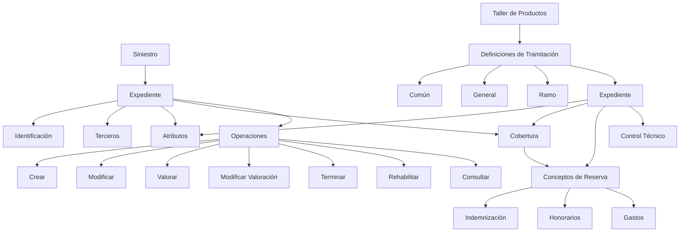
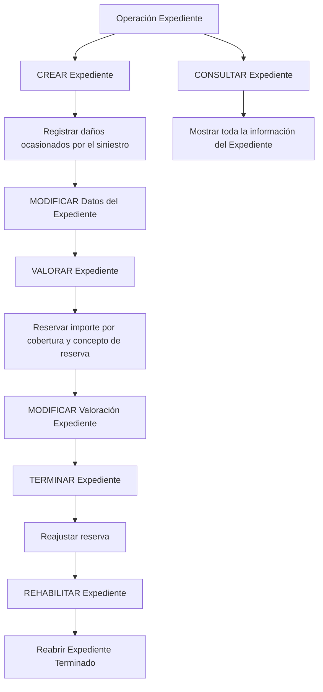

# Módulo de Tramitación de Expedientes — Conceitos, Definições, Estrutura e Operações

## 1. Metadados do Documento
- **Arquivo de Origem:** Não identificado no conteúdo extraído
- **Tipo de Documento:** Manual Operacional / Apresentação Funcional
- **Domínio / Sistema:** REEF / Documentación Reef / MAPFRE — Tramitación de Expedientes
- **Público-Alvo:** Negócio, analistas funcionais, desenvolvedores, arquitetura e operação de sinistros
- **Data/Versão Identificada:** Não identificada

---

## 2. Resumo Executivo & Contexto de Negócio

O documento descreve o módulo de **Tramitación de Expedientes**, cuja finalidade é permitir a realização de operações associadas a um expediente. O módulo cobre as funcionalidades necessárias para tramitar expedientes relacionados a sinistros, incluindo criação, alteração, valoração, término, reabilitação e consulta.

Um expediente é tratado como uma estrutura vinculada a um sinistro e pode representar danos diferentes originados pelo mesmo evento. Um sinistro pode possuir de um a vários expedientes, conforme a quantidade de danos ocorridos. A identificação do expediente é composta pelo número do sinistro e por um consecutivo iniciado em 1.

A estrutura funcional do expediente inclui identificação, terceiros, atributos, cobertura e conceitos de reserva. Os conceitos de reserva representam a valoração econômica associada às coberturas e permitem detalhar os valores reservados para indenização, honorários ou gastos.

O módulo é parametrizável e seu comportamento depende de definições prévias no **Taller de Productos**. As definições são organizadas nos níveis comum, geral, ramo e expediente, permitindo configurar estruturas, coberturas, causas, atributos, validações, limites econômicos e controles técnicos.

O documento também destaca suporte a abertura automática de expedientes, valoração em múltiplas moedas e pagamento em moeda distinta da moeda de valoração e da moeda do sinistro ou apólice.

---

## 3. Arquitetura, Componentes & Tecnologias Envolvidas

Os componentes funcionais identificados no documento são:

| Componente | Papel no domínio de Tramitación de Expedientes |
| :--- | :--- |
| Siniestro | Evento ao qual um ou vários expedientes estão associados. |
| Expediente | Unidade de tramitação que registra danos, informações, coberturas e reservas. |
| Identificación | Dados de identificação do expediente, incluindo sinistro afetado, datas de notificação e moeda. |
| Terceros | Pessoas físicas ou jurídicas que participam do expediente. |
| Atributos | Dados adicionais e opcionais que variam conforme o tipo de expediente. |
| Cobertura | Elemento que identifica o amparo do risco e a prestação que MAPFRE realizará. |
| Conceptos de Reserva | Detalhamento econômico de cada cobertura para indenização, honorários ou gastos. |
| Taller de Productos | Origem das definições prévias que parametrizam o comportamento da aplicação. |
| Control Técnico | Definições de erros, tipos de erros e condições de paralisação ou autorização da tramitação. |
| REEF / Documentación Reef | Contexto documental no qual o conteúdo está publicado. |
| Mapfredocument | Termo exibido na extração como parte do contexto documental. |



**Nota de Análise:** o documento apresenta a arquitetura funcional do módulo, mas não detalha tecnologias de implementação, interfaces HTTP, contratos JSON, banco de dados, mensageria, URLs, servidores, pipelines de CI/CD ou integrações técnicas entre aplicações.

---

## 4. Regras de Negócio, Especificações Funcionais & Processos

### 4.1 Finalidade do módulo

A finalidade do módulo de Tramitación de Expedientes é permitir realizar qualquer operação com um expediente. O módulo contém as funcionalidades necessárias para tramitar expedientes.

### 4.2 Parametrização do comportamento

O módulo é parametrizável. O comportamento da aplicação depende de definições prévias realizadas no **Taller de Productos**.

As definições são organizadas em quatro níveis:

1. **Común**
2. **General**
3. **Ramo**
4. **Expediente**

### 4.3 Abertura automática

O módulo permite a abertura automática dos tipos de expediente que forem definidos para esse comportamento.

### 4.4 Regra de múltiplos expedientes por sinistro

Um sinistro pode possuir de um a `n` expedientes, conforme a quantidade de danos ocasionados.

A identificação do número de expediente segue a regra:

- número do sinistro;
- acrescido de um consecutivo;
- o consecutivo começa em `1`.

### 4.5 Regra de valores econômicos

Cada expediente possui importes econômicos armazenados no nível de:

1. cobertura;
2. conceito de reserva.

A valoração econômica de um expediente é realizada por meio de conceitos econômicos denominados **conceptos de reserva**.

### 4.6 Tipos de conceitos de reserva

O documento identifica três tipos de conceitos de reserva:

1. Indemnización;
2. Honorarios;
3. Gastos.

Também são apresentados exemplos de conceitos de reserva com códigos:

- `12 Indemnización`;
- `22 Honorarios Profesionales`;
- `34 Gastos Profesionales`;
- `44 Reservas Matemáticas`.

### 4.7 Regra de múltiplas moedas

Os expedientes podem ser valorados em uma moeda diferente da moeda do sinistro ou da apólice.

Os expedientes também podem ser pagos em uma moeda diferente da moeda utilizada para a valoração.

### 4.8 Elementos de um expediente

Um expediente é composto pelos seguintes elementos:

- identificação;
- terceiros;
- atributos;
- cobertura;
- conceitos de reserva.

#### Identificação

A identificação do expediente inclui, entre outros dados:

- o sinistro ao qual o expediente afetará;
- datas de notificação;
- moeda do expediente.

#### Terceiros

O elemento de terceiros identifica pessoas físicas e/ou jurídicas que participam do expediente. Esses terceiros são necessários para realizar gestões como comunicações e geração de liquidações.

Exemplos de terceiros apresentados:

- asegurado;
- perjudicado;
- propietario;
- taller;
- abogado.

#### Atributos

Os atributos são dados adicionais relacionados ao expediente. O elemento de atributos é opcional e suas informações variam conforme o tipo de expediente.

Para um expediente de **Daños al vehículo contrario**, os exemplos apresentados são:

- propietario vehículo contrario;
- conductor vehículo contrario;
- aseguradora del contrario;
- matrícula;
- marca;
- modelo.

Para um expediente de **Daños Personales**, os exemplos apresentados são:

- lesionado;
- lesiones;
- información de contacto;
- hospital.

#### Cobertura

A cobertura identifica contra o que o risco está amparado. Quando o risco é afetado por eventos como roubo, quebra, dano, lesão ou doença, a cobertura determina a prestação que MAPFRE realizará.

Um expediente pode afetar uma ou várias coberturas.

#### Conceito de reserva associado à cobertura

O conceito de reserva é o detalhamento econômico da cobertura. O detalhamento determina se será reservado valor para:

- indenização;
- honorários;
- gastos.

Cada cobertura pode afetar um ou vários conceitos de reserva.

O exemplo apresentado associa a cobertura `2001 Daños Propios Vehículo` aos seguintes conceitos:

- `1 Indemnización Asegurado`;
- `2 Honorarios Profesionales`;
- `3 Gastos Profesionales`.

### 4.9 Definições no nível Común

O nível Común contém definições que não são exclusivas do módulo de sinistros, mas são necessárias para a definição do módulo.

As definições citadas são:

- estrutura de tramitação;
- cobertura;
- franquia;
- controle técnico.

A estrutura de tramitação define escritórios onde os expedientes são tratados, supervisores e tramitadores.

A cobertura é descrita como obrigação principal em um contrato de seguro. Existem diferentes tipos de cobertura que determinam o comportamento nos processos de emissão e de prestações.

A franquia estabelece o valor pelo qual o segurado responde em caso de sinistro.

O controle técnico define erros e tipos de erros para a tramitação de expedientes.

### 4.10 Definições no nível General

O nível General contém definições que afetam todos os possíveis expedientes de um sinistro.

As definições citadas são:

- características gerais;
- causas de processo;
- tipo de expediente.

As características gerais permitem definir o comportamento das operações de expedientes, como solicitar causas na abertura de expediente ou na alteração de valoração.

As causas de processo permitem catalogar os motivos pelos quais se deseja realizar uma operação de expediente.

O tipo de expediente permite definir os tipos de dano.

### 4.11 Definições no nível Ramo

O nível Ramo contém definições exclusivas do ramo configurado.

As definições citadas são:

- tipo de expediente;
- causa de processo;
- sub-limites.

No nível Ramo, o tipo de expediente permite associar a cada produto os tipos de danos possíveis e suas características.

A causa de processo permite catalogar os motivos das operações para cada ramo.

Os sub-limites permitem definir, por ramo, quais tipos de expediente e coberturas utilizarão sub-limites.

### 4.12 Definições no nível Expediente

O nível Expediente contém definições que afetam cada um dos possíveis expedientes do sinistro.

As definições citadas são:

- atributo;
- estrutura;
- validações de informação;
- cobertura;
- conceito de reserva;
- causa-consequência;
- valor inicial;
- valor máximo;
- controle técnico.

Os atributos permitem definir informação adicional do sinistro, como dados de veículo, dados do veículo contrário ou dados de lesionado.

A estrutura é uma informação adicional do expediente composta por atributos, obrigatoriedade ou não de solicitar informação e ordem em que a informação será solicitada.

As validações de informação permitem definir comportamentos e validações para informações core solicitadas nas operações de expediente. O documento apresenta como exemplo tornar obrigatória a data de declaração de um expediente.

A definição de cobertura determina, dentre as coberturas definidas no produto, qual será afetada por cada tipo de expediente e qual será seu comportamento.

O conceito de reserva determina o desdobramento econômico do expediente. Os tipos de conceitos de reserva mencionados são indenização, honorários e gastos.

A definição de causa-consequência permite propor os possíveis tipos de expedientes que poderão ser abertos.

O valor inicial define o custo médio utilizado para valorar o expediente quando não houver uma valoração clara.

O valor máximo determina o valor máximo pelo qual uma cobertura e conceito de reserva podem ser valorados.

O controle técnico define as condições nas quais a tramitação de um expediente pode ser paralisada ou em quais situações será obrigatória uma autorização.

### 4.13 Operações de Tramitación de Expedientes

As operações de expediente podem ser realizadas em linha ou de forma diferida.



| Operação | Finalidade |
| :--- | :--- |
| CREAR Expediente | Registra os diferentes danos ocasionados pelo sinistro. |
| MODIFICAR Datos del Expediente | Permite alterar informações e dados registrados em um expediente. |
| VALORAR Expediente | Permite reservar um valor para um expediente por cobertura e conceito de reserva. |
| MODIFICAR Valoración Expediente | Permite alterar a reserva de um expediente por cobertura e conceito de reserva. |
| TERMINAR Expediente | Finaliza expedientes reajustando sua reserva. |
| REHABILITAR Expediente | Reabre um expediente terminado. |
| CONSULTAR Expediente | Mostra todas as informações do expediente. |

---

## 5. Tabelas de Parâmetros, Ambientes e Estruturas de Dados

| Item / Parâmetro | Descrição / Função | Tipo / Valores / Formato | Ambiente / Observações |
| :--- | :--- | :--- | :--- |
| Expediente | Unidade de tramitação associada a danos de um sinistro. | Um sinistro pode ter de 1 a `n` expedientes. | O número do expediente é formado pelo número do sinistro e por consecutivo iniciado em `1`. |
| Identificación | Identifica os dados básicos do expediente. | Sinistro afetado, datas de notificação, moeda do expediente e outros dados. | O documento não detalha todos os campos. |
| Terceros | Identifica participantes físicos e/ou jurídicos do expediente. | Asegurado, perjudicado, propietario, taller, abogado e outros. | Usado para comunicações, liquidações e outras gestões. |
| Atributos | Contém dados adicionais do expediente. | Opcional; varia conforme o tipo de expediente. | Inclui exemplos para danos ao veículo contrário e danos pessoais. |
| Cobertura | Identifica o amparo do risco e a prestação aplicável. | Um expediente pode afetar uma ou várias coberturas. | Determina a prestação que MAPFRE realizará quando o risco for afetado. |
| Concepto de Reserva | Detalhamento econômico de uma cobertura. | Indemnización, Honorarios ou Gastos. | Uma cobertura pode afetar um ou vários conceitos de reserva. |
| 12 Indemnización | Exemplo de conceito de reserva. | Código `12`. | Sem detalhamento adicional no documento. |
| 22 Honorarios Profesionales | Exemplo de conceito de reserva. | Código `22`. | Sem detalhamento adicional no documento. |
| 34 Gastos Profesionales | Exemplo de conceito de reserva. | Código `34`. | Sem detalhamento adicional no documento. |
| 44 Reservas Matemáticas | Exemplo de conceito de reserva. | Código `44`. | Sem detalhamento adicional no documento. |
| 2001 Daños Propios Vehículo | Exemplo de cobertura. | Código `2001`. | Associada a conceitos de indenização, honorários e gastos. |
| 1 Indemnización Asegurado | Conceito associado ao exemplo de cobertura `2001`. | Código `1`. | Relacionado a indenização. |
| 2 Honorarios Profesionales | Conceito associado ao exemplo de cobertura `2001`. | Código `2`. | Relacionado a honorários. |
| 3 Gastos Profesionales | Conceito associado ao exemplo de cobertura `2001`. | Código `3`. | Relacionado a gastos. |
| Características Generales | Configura comportamento das operações de expediente. | Exemplos: solicitar causas na abertura ou mudança de valoração. | Nível General. |
| Causas de Proceso | Cataloga os motivos para realizar uma operação de expediente. | Motivos de operação. | Níveis General e Ramo. |
| Tipo Expediente | Define tipos de dano ou associa tipos de dano a produtos. | Tipos de danos possíveis e suas características. | Níveis General e Ramo. |
| Sub-límites | Define uso de sub-limites por ramo. | Tipos de expediente e coberturas. | Nível Ramo. |
| Estructura | Informação adicional do expediente. | Atributos, obrigatoriedade, solicitação e ordem de apresentação. | Nível Expediente. |
| Validaciones Información | Define validações e comportamentos para informação core. | Exemplo: data de declaração obrigatória. | Nível Expediente. |
| Causa-Consecuencia | Propõe tipos de expediente que podem ser abertos. | Possíveis tipos de expedientes. | Nível Expediente. |
| Valor Inicial | Define custo médio para valoração sem valor claro. | Custo médio. | Nível Expediente. |
| Valor Máximo | Define limite máximo de valoração. | Importe máximo por cobertura e conceito de reserva. | Nível Expediente. |
| Control Técnico | Define erros, condições de paralisação e obrigação de autorização. | Erros e tipos de erro; condições de controle. | Presente nos níveis Común e Expediente. |
| Moeda de valoração | Moeda usada para valorar o expediente. | Pode ser diferente da moeda do sinistro ou apólice. | Suporte a múltiplas moedas. |
| Moeda de pagamento | Moeda usada para pagar o expediente. | Pode ser diferente da moeda de valoração. | Suporte a múltiplas moedas. |

**Nota de Análise:** o conteúdo não fornece URLs de ambientes, nomes de servidores, rotas de logs, variáveis de configuração, credenciais, portas de rede ou tecnologias de infraestrutura.

---

## 6. Bateria de Perguntas & Respostas para RAG (FAQ Sintético)

### P1: Qual é a finalidade do módulo de Tramitación de Expedientes?
**R:** A finalidade do módulo de Tramitación de Expedientes é permitir realizar qualquer operação relacionada a um expediente. O módulo contém as funcionalidades necessárias para tramitar expedientes associados a sinistros.

### P2: Um sinistro pode possuir mais de um expediente?
**R:** Sim. Um sinistro pode ter de um a `n` expedientes, em quantidade correspondente aos danos ocasionados. O número do expediente é formado pelo número do sinistro e por um consecutivo iniciado em `1`.

### P3: Quais são os elementos que compõem um expediente?
**R:** Um expediente é composto por identificação, terceiros, atributos, cobertura e conceitos de reserva. A identificação registra, entre outros dados, o sinistro afetado, datas de notificação e moeda; terceiros identifica participantes; atributos guardam informações adicionais; cobertura identifica o amparo do risco; e conceitos de reserva representam o detalhamento econômico da cobertura.

### P4: Quais tipos de conceitos de reserva são mencionados no documento?
**R:** O documento informa que há três tipos de conceitos de reserva: Indemnización, Honorarios e Gastos. Como exemplos, apresenta `12 Indemnización`, `22 Honorarios Profesionales`, `34 Gastos Profesionales` e `44 Reservas Matemáticas`.

### P5: Como a cobertura se relaciona com os conceitos de reserva?
**R:** A cobertura identifica o risco amparado e determina a prestação que MAPFRE realizará quando o risco for afetado. Cada cobertura pode afetar um ou vários conceitos de reserva, que detalham se o valor reservado será para indenização, honorários ou gastos.

### P6: Quais informações podem ser registradas nos atributos de um expediente de danos ao veículo contrário?
**R:** Para o tipo de expediente Daños al vehículo contrario, o documento apresenta como exemplos de atributos o proprietário do veículo contrário, condutor do veículo contrário, seguradora do contrário, matrícula, marca e modelo.

### P7: O módulo suporta múltiplas moedas?
**R:** Sim. Os expedientes podem ser valorados em moeda diferente da moeda do sinistro ou apólice. Além disso, o pagamento pode ocorrer em moeda diferente da moeda usada na valoração do expediente.

### P8: Quais são os níveis de definição utilizados para parametrizar a tramitação de expedientes?
**R:** O documento identifica quatro níveis de definição: Común, General, Ramo e Expediente. Esses níveis organizam configurações relacionadas a estrutura, coberturas, causas, tipos de expediente, atributos, validações, valores e controles técnicos.

### P9: O que é definido no nível General?
**R:** O nível General contém definições que afetam todos os possíveis expedientes de um sinistro. Entre elas estão características gerais do módulo, causas de processo e tipo de expediente. As características gerais podem definir, por exemplo, se serão solicitadas causas na abertura ou na mudança de valoração.

### P10: O que é definido no nível Ramo?
**R:** O nível Ramo contém definições exclusivas do ramo configurado. O documento cita tipo de expediente, causa de processo e sub-limites. Nesse nível, tipos de danos podem ser associados a cada produto, causas podem ser catalogadas por ramo e pode ser definido quais tipos de expediente e coberturas utilizarão sub-limites.

### P11: Para que servem o valor inicial e o valor máximo de um expediente?
**R:** O valor inicial define o custo médio com o qual o expediente será valorado quando não houver uma valoração clara. O valor máximo determina o importe máximo pelo qual uma combinação de cobertura e conceito de reserva pode ser valorada.

### P12: Quais operações podem ser executadas sobre um expediente?
**R:** As operações apresentadas são criar expediente, modificar dados do expediente, valorar expediente, modificar valoração do expediente, terminar expediente, reabilitar expediente e consultar expediente. Essas operações podem ser realizadas em linha ou de forma diferida.

### P13: O que acontece na operação TERMINAR Expediente?
**R:** A operação TERMINAR Expediente finaliza o expediente reajustando sua reserva.

### P14: Qual é a função do controle técnico no módulo?
**R:** O controle técnico define erros e tipos de erros para a tramitação de expedientes. No nível Expediente, também define as condições nas quais a tramitação pode ser paralisada ou nas quais uma autorização passa a ser obrigatória.

---

## 7. Glossário de Termos, Siglas & Conceitos-Chave

- **Asegurado:** Parte segurada no contexto do expediente.
- **Atributos:** Dados adicionais e opcionais relacionados ao expediente, variáveis conforme o tipo de expediente.
- **Cobertura:** Obrigação principal em um contrato de seguro; identifica o amparo do risco e a prestação aplicável.
- **Concepto de Reserva:** Conceito econômico utilizado para detalhar valores reservados por cobertura.
- **Control Técnico:** Definição de erros, tipos de erros e condições de controle da tramitação.
- **Expediente:** Unidade de tramitação associada a um sinistro e aos danos decorrentes desse sinistro.
- **Franquicia:** Quantidade pela qual o segurado responde em caso de sinistro.
- **Honorarios:** Tipo de conceito de reserva referente a honorários.
- **Indemnización:** Tipo de conceito de reserva referente a indenização.
- **MAPFRE:** Organização mencionada como responsável pela prestação associada à cobertura; o significado da sigla não é detalhado no conteúdo.
- **Perjudicado:** Pessoa prejudicada que pode participar do expediente.
- **Ramo:** Nível de definição exclusivo do ramo que está sendo configurado.
- **REEF:** Termo presente no contexto documental como “Documentation Reef” e “DOCUMENTACIÓN Reef”; o documento não expande a sigla.
- **Reservas Matemáticas:** Exemplo de conceito de reserva identificado pelo código `44`.
- **Siniestro:** Evento ao qual um ou vários expedientes podem estar associados.
- **Sub-límites:** Definições, por ramo, sobre tipos de expediente e coberturas que utilizarão sub-limites.
- **Taller de Productos:** Local ou mecanismo de definições prévias que parametrizam o comportamento do módulo.
- **Terceros:** Pessoas físicas e/ou jurídicas que participam do expediente.
- **Tipo Expediente:** Definição de tipos de dano ou de tipos de expediente possíveis.
- **Tramitación de Expedientes:** Processo ou módulo para realizar operações sobre expedientes.
- **Valor Inicial:** Custo médio usado para valorar um expediente sem valoração clara.
- **Valor Máximo:** Importe máximo permitido para valorar uma cobertura e conceito de reserva.

---

## 8. Notas Críticas, Riscos & Limitações

- O documento não informa nome do arquivo de origem, data, versão, autor técnico ou histórico de revisões.
- O conteúdo descreve regras e estruturas funcionais, mas não especifica APIs, métodos HTTP, contratos de dados, banco de dados, tecnologias de desenvolvimento ou protocolos de integração.
- Não há detalhamento dos critérios de cálculo aplicáveis à indenização, aos honorários, aos gastos ou às reservas matemáticas.
- O documento afirma que o comportamento do módulo depende de definições prévias no Taller de Productos, mas não descreve o processo operacional para criar, aprovar, publicar ou versionar essas definições.
- A abertura automática de expedientes é mencionada, porém não são descritos eventos disparadores, condições, tipos elegíveis ou regras de exceção.
- O suporte a múltiplas moedas é indicado, mas não há regras de conversão, taxas cambiais, datas de cotação, arredondamento ou contabilização.
- O controle técnico pode paralisar uma tramitação ou exigir autorização, mas o documento não fornece a matriz de condições, responsáveis, níveis de aprovação ou procedimentos de desbloqueio.
- **Nota de Análise:** o documento lista operações de expediente, porém não detalha permissões por perfil, transições de estado, auditoria, concorrência ou tratamento de falhas.
- **Nota de Análise:** o documento apresenta exemplos de atributos e conceitos de reserva, mas não especifica catálogos completos, obrigatoriedade por produto ou formato de cada campo.

---

## 9. Conteúdo Bruto Estruturado (Referência Fiel)

```text
--- [PÁGINA 1 DE 5] ---

INTRODUCCIÓN - Módulo Tramitación de Expedientes
Objetivo
La nalidad de este módulo es poder realizar cualquier operación con un Expediente.
Concepto
Concepto de Reserva
Características
Elementos de un expediente
Deniciones Tramitación de Expedientes
Operaciones Tramitación de Expedientes
Conceptos
Concepto de Reserva
La valoración económica de un expediente, se realiza a través de unos conceptos económicos que denominaremos conceptos de reserva.
Estos permiten detallar para cada cobertura, el importe que se está reservando a qué está afectando. Hay tres tipos de Conceptos:
Indemnización
Honorarios
Gastos
Ejemplo:
Conceptos de Reserva
12 Indemnización
22 Honorarios Profesionales
34 Gastos Profesionales
Documentation / DOCUMENTACIÓN Reef
DOCUMENTACIÓN Reef
Mapfredocument
DOCUMENTACIÓN Reef
Owner
user:agonzalez_mapfre.com
Lifecycle
Approved Source
 / 
 VL
Buscar Inicio Soluciones Arquitecturas APIs Componentes Cloud Documentación Zeus Reef Ayuda
ES


--- [PÁGINA 2 DE 5] ---

Conceptos de Reserva
44 Reservas Matemáticas
Características
Cubre todas las funcionalidades de expedientes
Este módulo, contiene todas las funcionalidades necesarias para tramitar expedientes.
Parametrizable
El módulo es parametrizable y el comportamiento de la aplicación depende de las deniciones previas (Taller de Productos).
Apertura Automática de expedientes
Se podrán aperturar automáticamente todos los tipos de expediente que se decidan.
Importes económicos
Cada expediente tiene importes económicos almacenados a nivel de cobertura y concepto de reserva.
Múltiples monedas
Los expedientes pueden valorarse en una moneda diferente a la del siniestro (póliza) y pagarse en otra moneda diferente a la de la
valoración.
Múltiples expedientes
Un siniestro podrá tener de uno a n expedientes, tantos expedientes como daños se hayan ocasionado. El número de expediente es el
número de siniestro más un consecutivo empezando por el 1.
Elementos de un expediente
Un expediente está compuesto de varios elementos:
EXPEDIENTE
IDENTIFICACIÓN TERCEROS ATRIBUTOS COBERTURA CONCEPTOS DE RESERVA
Datos Identicación del expediente
Se identica:
El siniestro al que va afectar el expediente
Las fechas de noticación
Moneda del expediente
Etc.
Terceros
Se identica a las personas (físicas y/o jurídicas) que intervienen en el Expediente. Son necesarias para realizar distintas gestiones, como
comunicaciones, generar liquidaciones, etc.
Asegurado
Perjudicado
Propietario
Taller
Abogado
Etc.


--- [PÁGINA 3 DE 5] ---

Atributos
Este elemento contiene todos los datos adicionales, relacionados con el expediente, es opcional. La información variará dependiendo del tipo
de expediente.
Ejemplo de estas características:
Si el tipo de expediente es Daños al vehículo contrario:
Propietario vehículo contrario
Conductor vehículo contrario
Aseguradora del contrario
Matrícula
Marca
Modelo
Etc.
Si el tipo de expediente es Daños Personales:
Lesionado
Lesiones
Información de contacto
Hospital
Etc.
Cobertura
Este elemento identica contra qué está amparado el riesgo y determina en caso que este se vea afectado (como puede ser por un robo, una
rotura, un daño, una lesión, enfermedad, etc.), la prestación que MAPFRE realizará. Un expediente puede afectar a una o varias coberturas
Concepto de Reserva
Detalle económico de la cobertura, en el que se determina si se va a reservar un importe para pagar Indemnización, Honorarios o Gastos.
Cada cobertura puede afectar a uno o varios conceptos de reserva.
Cobertura Concepto Reserva
2001 Daños Propios Vehículo 1 Indemnización Asegurado
2 Honorarios Profesionales
3 Gastos Profesionales
Deniciones Tramitación de Expedientes
Los elementos de denición atienden a distintos niveles:
NIVELES DE DEFINICIÓN
COMÚN GENERAL RAMO EXPEDIENTE
COMÚN


--- [PÁGINA 4 DE 5] ---

En este nivel se encuentran deniciones que NO son exclusivas del módulo de siniestros, pero son
necesarias para poder realizar la denición. Entre otras deniciones se encuentra:
ESTRUCTURA TRAMITACIÓN
Denición de ocinas donde se tramitan
expedientes, supervisores tramitadores
COBERTURA
Obligación principal en un contrato de
seguro. Existen diversos tipos de
cobertura que determinan el
comportamiento tanto en el proceso de
emisión, como en el proceso de
prestaciones
FRANQUICIA
Establecer la cantidad por la que el
asegurado responde en caso de siniestro
CONTROL TÉCNICO
Denición de errores, tipos de Errores para
tramitación de expedientes
GENERAL
En este nivel se encuentran deniciones que afectarán a todos los posibles expedientes de un siniestro.
Entre otros se dene:
CARACTERÍSTICAS GENERALES
Características generales del módulo de
siniestros, permite denir el
comportamiento de las operaciones de
expedientes como por ejemplo si se va a
pedir causas en la apertura de expediente,
en al cambio de valoración...
CAUSAS DE PROCESO
Permite catalogar los motivos por los que
se quiere realizar una operación de
expediente
TIPO EXPEDIENTE
Permite denir los Tipos de Daño
RAMO
Son exclusivas del ramo que se está deniendo. Por ejemplo:
TIPO EXPEDIENTE
Permite asociar a cada Producto los Tipos
de daños posibles y sus características
CAUSA PROCESO
Permite catalogar los motivos por los que
se quiere realizar las operaciones para
cada ramo
SUB-LIMITES
Permite denir por Ramo, qué tipos de
expediente y coberturas van a utilizar sub-
límites.
EXPEDIENTE
Deniciones que afectan a cada uno de los posibles expedientes del siniestro
ATRIBUTO
Permite denir la información adicional
del siniestro, como datos vehículo
ESTRUCTURA
Información adicional del expediente
compuesta por atributos, obligatoriedad o
VALIDACIONES INFORMACIÓN
Denir comportamientos y validaciones de
la información core, que se piden en las


--- [PÁGINA 5 DE 5] ---

contrario, datos lesionado, etc.
 no de pedir información, orden en el que
se va a pedir
operaciones de expedientes. Ejemplo
poner obligatoria la fecha de declaración
de un expediente
COBERTURA
Denir de todas las coberturas denidas
en el producto, cual va a ser afectada por
cada uno de los tipos de expedientes y su
comportamiento
CONCEPTO RESERVA
Determinar el desglose económico del
expediente. Los tipos de conceptos de
reserva pueden ser Indemnización,
Honorarios o Gastos
CAUSA-CONSECUENCIA
Permite proponer los posibles Tipos de
Expedientes que se podrán aperturar
VALOR INICIAL
Denición del coste medio con el que se
va a valorar el expediente si no se tiene
una valoración clara
VALOR MÁXIMO
Determinar el importe Máximo por el que
se puede valorar una cobertura concepto
de reserva
CONTROL TÉCNICO
Denir en qué condiciones se puede
paralizar la tramitación de un expediente u
obligación de ser autorizada
Operaciones Tramitación de Expedientes
OPERACIÓN EXPEDIENTE
Operaciones que se pueden realizar a cada uno de los posibles expedientes del siniestro, se pueden realizar
tanto en línea como diferido
CREAR Expediente
En esta operación se registran los
distintos daños que ha ocasionado el
siniestro
MODIFICAR Datos del Expediente
Permite cambiar la información, los datos
registrados de un expediente
VALORAR Expediente
Permite reservar un importe a un
expediente por cobertura y concepto de
reserva
MODIFICAR Valoración Expediente
Permite cambiar la reserva de un
expediente por cobertura y concepto de
reserva
TERMINAR Expediente
Finaliza expedientes reajustando su
reserva
REHABILITAR Expediente
Reabre un Expediente Terminado
CONSULTAR Expediente
Muestra toda la información del
Expediente
```
