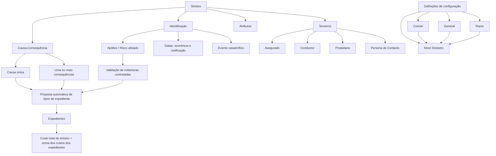

# Tramitación de Siniestros — Conceitos, Configuração, Elementos e Operações

## 1. Metadados do Documento
- **Arquivo de Origem:** `Não identificado no conteúdo bruto`
- **Tipo de Documento:** Manual Operacional / Especificação Funcional
- **Domínio / Sistema:** Reef / Tramitación de Siniestros
- **Público-Alvo:** Analistas funcionais, equipes de negócio, desenvolvedores, configuradores e operadores de sinistros
- **Data/Versão Identificada:** Não identificada

---

## 2. Resumo Executivo & Contexto de Negócio

O documento descreve o módulo de **Tramitación de Siniestros**, cuja finalidade é permitir a realização de operações relacionadas a um sinistro. O sinistro centraliza informações comuns aos expedientes associados e representa o evento principal a partir do qual danos, envolvidos, atributos e possíveis expedientes são tratados.

A modelagem funcional distingue claramente **causa** e **consequência**. A causa é o motivo ou origem do sinistro e é única por sinistro. As consequências representam os danos resultantes do evento e deve haver, no mínimo, uma consequência selecionada. A combinação entre causa e consequências permite ao sistema propor automaticamente os tipos de expedientes a abrir.

A abertura proposta de expedientes depende não apenas da relação entre causa e consequência, mas também das coberturas contratadas para a combinação de apólice e risco. No exemplo apresentado, a causa “Atropello” combinada com danos ao veículo segurado e danos pessoais a terceiros pode gerar propostas para os expedientes de Danos Próprios Materiais e Danos Pessoais, desde que as respectivas coberturas estejam contratadas.

O documento também apresenta uma estrutura de definição em quatro níveis: **Común**, **General**, **Ramo** e **Siniestro**. Esses níveis concentram configurações corporativas, comportamentos gerais do módulo, particularidades por ramo e definições específicas aplicáveis a todos os expedientes de um sinistro.

O sinistro não possui custo econômico próprio. O custo do sinistro corresponde à soma dos custos dos seus expedientes. O comportamento do módulo é parametrizável, dependendo das definições configuradas para numeração, eventos, características gerais, causas, consequências, atributos, estruturas de informação, validações e controle técnico.

---

## 3. Arquitetura, Componentes & Tecnologias Envolvidas

O conteúdo apresenta o sistema Reef como contexto documental, incluindo referências visuais a “Documentation / DOCUMENTACIÓN Reef”, “Mapfredocument” e “Zeus”. Entretanto, o material não detalha integração técnica, APIs, protocolos, tecnologias de implementação, contratos JSON, métodos HTTP, bases de dados, URLs de ambiente ou topologia de infraestrutura.

Os componentes funcionais identificados são:

| Componente / Conceito | Papel no domínio de Tramitación de Siniestros |
| :--- | :--- |
| Sinistro | Entidade que reúne informações comuns a todos os expedientes relacionados a um evento. |
| Expediente | Unidade de tratamento proposta ou aberta conforme causa, consequências e coberturas da apólice-risco. |
| Causa | Origem do sinistro; é única por sinistro. |
| Consequência | Dano resultante do sinistro; deve existir pelo menos uma consequência. |
| Causa-Consequência | Associação usada para propor automaticamente tipos de expedientes. |
| Apólice / Risco | Referência afetada pelo sinistro e base para verificar coberturas contratadas. |
| Cobertura | Condição contratual necessária para que determinado tipo de expediente seja proposto. |
| Terceiros | Pessoas físicas e/ou jurídicas que intervêm no sinistro. |
| Atributos | Dados adicionais do sinistro, como relato, localização, dados de veículo contrário ou dados de lesionado. |
| Controle Técnico | Definição das condições para paralisar a tramitação ou exigir autorização. |
| Estrutura de Tramitação | Definição de escritórios, supervisores e tramitadores responsáveis pelos expedientes. |



> **Nota de Análise:** O documento lista conceitos e estruturas funcionais do módulo, mas não detalha arquitetura de software, microsserviços, persistência de dados, endpoints, autenticação, logs ou mecanismos técnicos de integração.

---

## 4. Regras de Negócio, Especificações Funcionais & Processos

### 4.1 Finalidade do módulo

A finalidade do módulo de Tramitación de Siniestros é permitir realizar qualquer operação relacionada a um sinistro.

### 4.2 Regra de causa do sinistro

- A causa é o motivo que origina o sinistro.
- A causa representa a origem do sinistro.
- Cada sinistro possui uma única causa.
- Exemplos fornecidos:
  - Se um veículo é roubado e posteriormente incendiado, a causa/origem do sinistro é **Robo**.
  - Se uma casa sofre incêndio e posteriormente ocorre roubo, a causa do sinistro é **Incendio**.

### 4.3 Regra de consequências do sinistro

- Consequências são os danos que resultam do sinistro.
- Um sinistro pode possuir diferentes danos decorrentes do mesmo evento.
- É obrigatório selecionar pelo menos uma consequência para um sinistro.
- Exemplos de consequências citadas:
  - Danos materiais a veículos.
  - Danos materiais a coisas.
  - Morte.
  - Invalidez permanente.
  - Danos pessoais.

### 4.4 Regra de associação entre causa e consequências

A seleção conjunta da causa e das consequências permite ao sistema realizar uma proposta automática dos possíveis tipos de expedientes a abrir.

| Causa | Consequência | Tipo de Expediente | Cobertura |
| :--- | :--- | :--- | :--- |
| Atropello | Daños Vehículo Asegurado | DPM — Daños Propios Materiales | Daños Propios |
| Atropello | Daños Personales a Terceros | DPA — Daños Personales | Responsabilidad Civil |

Regras derivadas do exemplo funcional:

1. Quando a causa selecionada é **Atropello** e as duas consequências são selecionadas — danos ao veículo segurado e danos pessoais a terceiros — o sistema propõe a abertura de dois tipos de expedientes:
   - Danos Próprios.
   - Danos Pessoais.
2. A proposta dos dois expedientes só ocorre quando a apólice-risco possuir as duas coberturas contratadas.
3. Quando a causa selecionada é **Atropello** e apenas a consequência de danos ao veículo segurado é selecionada, o sistema propõe apenas o expediente de tipo Danos Próprios.
4. A proposta do expediente de Danos Próprios depende de a apólice-risco possuir a cobertura correspondente contratada.

### 4.5 Características do sinistro

| Característica | Regra / Descrição |
| :--- | :--- |
| Informação comum | O sinistro engloba a informação comum a todos os expedientes. |
| Sem custo próprio | O sinistro não possui importes econômicos próprios. |
| Custo total | O custo do sinistro é a soma dos custos de todos os seus expedientes. |
| Parametrizável | O comportamento do módulo depende da definição configurada. |

### 4.6 Elementos que compõem um sinistro

| Elemento | Informações descritas |
| :--- | :--- |
| Identificação | Apólice/risco afetado, datas de ocorrência e notificação, evento catastrófico e demais dados de identificação. |
| Terceiros | Pessoas físicas e/ou jurídicas que intervêm no sinistro. Exemplos: segurado, condutor, proprietário e pessoa de contato. |
| Causa-Consequência | Causa/origem do sinistro e consequências/danos ocasionados pelo sinistro. |
| Atributos | Dados adicionais do sinistro, como relato, localização do evento e outros atributos aplicáveis ao risco. |

### 4.7 Exemplos de atributos

Considerando que o risco seja um automóvel, o documento cita como exemplos de atributos:

- Relato do sinistro.
- Localização do sinistro.
- Dados do veículo contrário.
- Dados do lesionado.

### 4.8 Níveis de definição e configuração

Os elementos de definição estão distribuídos nos seguintes níveis:

| Nível | Escopo |
| :--- | :--- |
| Común | Definições não exclusivas do módulo de sinistros, mas necessárias para sua configuração. |
| General | Definições utilizadas no módulo de sinistros que não são exclusivas de um ramo. |
| Ramo | Definições exclusivas do ramo configurado. |
| Siniestro | Definições que afetam todos os possíveis expedientes de um sinistro. |

#### Nível Común

| Definição | Finalidade |
| :--- | :--- |
| Compañía | Informação geral da empresa. |
| Moneda | Informação geral das moedas. |
| Estructura Geográfica | Divisões do país por zonas. |
| Estructura Comercial | Divisões organizativas da companhia. |
| Estructura Producto | Divisões dos ramos. |
| Control Técnico | Definição de erros e tipos de erros. |
| Estructura Tramitación | Definição de escritórios onde expedientes são tratados, supervisores e tramitadores. |

#### Nível General

| Definição | Finalidade |
| :--- | :--- |
| Numeración | Determina quais elementos compõem o número de sinistro e em qual ordem. |
| Eventos | Registra fenômenos catastróficos ocorridos em uma zona geográfica determinada. |
| Características Generales | Determina comportamentos do módulo de sinistros. |
| Causas de Procesos | Cataloga os motivos pelos quais se deseja realizar uma operação. |

#### Nível Ramo

| Definição | Finalidade |
| :--- | :--- |
| Extemporaneidad | Indica o número máximo de dias que podem transcorrer entre a data de ocorrência do sinistro e a data de notificação à companhia. |
| Causa Proceso | Cataloga os motivos pelos quais se deseja realizar operações para cada ramo. |
| Especialidad Supervisores | Permite especializar supervisores em produtos determinados. |
| Especialidad Tramitadores | Permite especializar tramitadores em produtos determinados. |

#### Nível Siniestro

| Definição | Finalidade |
| :--- | :--- |
| Causa Origen | Cataloga as diferentes causas que originam um sinistro. |
| Consecuencia | Define os possíveis danos ocorridos pelo sinistro, incluindo danos materiais e danos pessoais. |
| Atributo | Define informações adicionais do sinistro, como dados do veículo contrário e dados do lesionado. |
| Estructura | Organiza informação adicional composta por atributos, incluindo obrigatoriedade de solicitação e ordem de solicitação. |
| Información Inicial | Registra informação prévia para atributos das operações de sinistro, reduzindo a necessidade de introdução posterior. |
| Validaciones Información | Define comportamentos e validações da informação core solicitada nas operações de sinistro. |
| Control Técnico | Define condições para paralisar a tramitação do sinistro ou tornar obrigatória uma autorização. |

### 4.9 Regras de informação inicial e validação

- A informação inicial permite registrar previamente dados de atributos de operações de sinistros.
- O objetivo da informação inicial é evitar a digitação posterior de dados já conhecidos ou predefinidos.
- O documento apresenta como exemplo a data de comunicação do sinistro preenchida com a data do dia.
- As validações de informação definem comportamentos e validações para a informação core solicitada nas operações de sinistro.
- O documento apresenta como exemplo tornar obrigatória a hora da declaração de um sinistro.

### 4.10 Operações disponíveis para sinistros

As operações de sinistro podem ser realizadas tanto **em linha** quanto **em diferido**.

| Operação | Descrição |
| :--- | :--- |
| CREAR Siniestro | Permite gerar um novo sinistro. |
| MODIFICAR Siniestro | Permite alterar as informações do sinistro. |
| TERMINAR Siniestro | Finaliza sinistros sem expedientes. |
| REHABILITAR Siniestro | Reabre um sinistro terminado. |
| CONSULTAR Siniestro | Mostra todas as informações do sinistro. |

---

## 5. Tabelas de Parâmetros, Ambientes e Estruturas de Dados

### 5.1 Estrutura funcional do sinistro

| Item / Parâmetro | Descrição / Função | Tipo / Valores / Formato | Ambiente / Observações |
| :--- | :--- | :--- | :--- |
| Sinistro | Entidade que reúne informações comuns aos expedientes. | Entidade funcional. | Não possui importes econômicos próprios. |
| Causa | Origem do sinistro. | Uma causa por sinistro. | Exemplos: Robo, Incendio, Atropello. |
| Consequência | Dano resultante do sinistro. | Uma ou mais consequências. | Ao menos uma consequência é obrigatória. |
| Tipo de Expediente | Tipo de expediente proposto conforme causa e consequência. | DPM, DPA no exemplo. | A proposta depende de cobertura contratada. |
| Cobertura | Cobertura contratada para a apólice-risco. | Daños Propios; Responsabilidad Civil no exemplo. | Condiciona a abertura proposta do expediente. |
| Apólice / Risco | Referência afetada pelo sinistro. | Dado de identificação. | Usado para verificar coberturas. |
| Data de ocorrência | Data em que o sinistro ocorreu. | Data. | Usada pela regra de extemporaneidade. |
| Data de notificação | Data em que a companhia é notificada. | Data. | Usada pela regra de extemporaneidade. |
| Evento catastrófico | Evento relacionado ao sinistro. | Informação de identificação. | Eventos registram fenômenos catastróficos por zona geográfica. |
| Atributo | Informação adicional do sinistro. | Estruturado conforme definição. | Pode possuir obrigatoriedade e ordem de solicitação. |
| Controle Técnico | Controle de erros, paralisação e autorização. | Definições parametrizáveis. | Pode definir condições de paralisação da tramitação. |

### 5.2 Pessoas e papéis identificados como terceiros

| Item / Parâmetro | Descrição / Função | Tipo / Valores / Formato | Ambiente / Observações |
| :--- | :--- | :--- | :--- |
| Asegurado | Pessoa identificada como participante do sinistro. | Pessoa física e/ou jurídica. | Citado como exemplo de terceiro. |
| Conductor | Pessoa identificada como participante do sinistro. | Pessoa física e/ou jurídica. | Citado como exemplo de terceiro. |
| Propietario | Pessoa identificada como participante do sinistro. | Pessoa física e/ou jurídica. | Citado como exemplo de terceiro. |
| Persona de Contacto | Pessoa identificada como participante do sinistro. | Pessoa física e/ou jurídica. | Citado como exemplo de terceiro. |

### 5.3 Configurações por nível de definição

| Item / Parâmetro | Descrição / Função | Tipo / Valores / Formato | Ambiente / Observações |
| :--- | :--- | :--- | :--- |
| Compañía | Informação geral da empresa. | Definição Común. | Necessária para configuração. |
| Moneda | Informação geral de moedas. | Definição Común. | Necessária para configuração. |
| Estructura Geográfica | Divisão do país por zonas. | Definição Común. | Relacionada ao registro de eventos catastróficos. |
| Estructura Comercial | Divisões organizativas da companhia. | Definição Común. | Não exclusiva de sinistros. |
| Estructura Producto | Divisões de ramos. | Definição Común. | Base para o nível Ramo. |
| Estructura Tramitación | Escritórios, supervisores e tramitadores. | Definição Común. | Relacionada ao tratamento de expedientes. |
| Numeración | Composição e ordem do número de sinistro. | Definição General. | Parametrizável. |
| Eventos | Registro de fenômenos catastróficos. | Definição General. | Associado a zona geográfica determinada. |
| Características Generales | Comportamento do módulo. | Definição General. | Parametrizável. |
| Causas de Procesos | Motivos para realizar operações. | Definição General. | Não exclusiva de ramo. |
| Extemporaneidad | Prazo máximo entre ocorrência e notificação. | Definição Ramo. | Número máximo de dias; valor não informado. |
| Causa Proceso | Motivos de operação por ramo. | Definição Ramo. | Específica para cada ramo. |
| Especialidad Supervisores | Especialização de supervisores por produto. | Definição Ramo. | Produtos determinados. |
| Especialidad Tramitadores | Especialização de tramitadores por produto. | Definição Ramo. | Produtos determinados. |
| Causa Origen | Catálogo de causas de sinistro. | Definição Siniestro. | Aplicável aos possíveis expedientes do sinistro. |
| Consecuencia | Catálogo de danos possíveis. | Definição Siniestro. | Inclui danos materiais e pessoais. |
| Información Inicial | Pré-registro de dados de atributos. | Definição Siniestro. | Exemplo: data de comunicação igual à data atual. |
| Validaciones Información | Validações da informação core. | Definição Siniestro. | Exemplo: hora da declaração obrigatória. |

### 5.4 Ambientes, servidores, URLs e logs

| Item / Parâmetro | Descrição / Função | Tipo / Valores / Formato | Ambiente / Observações |
| :--- | :--- | :--- | :--- |
| Ambientes | Não detalhados. | Não informado. | O documento não apresenta URLs, servidores ou identificação de ambientes. |
| Rotas de log | Não detalhadas. | Não informado. | O documento não apresenta caminhos, variáveis ou políticas de logs. |
| APIs / Contratos | Não detalhados. | Não informado. | O documento não apresenta métodos HTTP, endpoints ou contratos de integração. |

---

## 6. Bateria de Perguntas & Respostas para RAG (FAQ Sintético)

### P1: Qual é a finalidade do módulo de Tramitación de Siniestros?
**R:** O módulo de Tramitación de Siniestros tem como finalidade permitir a realização de qualquer operação relacionada a um sinistro. Entre as operações explicitamente apresentadas estão criar, modificar, terminar, reabilitar e consultar sinistros.

### P2: Qual é a diferença entre causa e consequência em um sinistro?
**R:** A causa é o motivo ou a origem do sinistro e deve ser única por sinistro. A consequência corresponde aos danos resultantes do evento. Um sinistro pode possuir várias consequências, mas deve possuir pelo menos uma consequência selecionada.

### P3: Um sinistro pode ter mais de uma causa?
**R:** Não. O documento estabelece que a causa é única por sinistro. Mesmo quando ocorrem eventos subsequentes, a causa deve representar a origem do sinistro. Por exemplo, se um veículo é roubado e depois incendiado, a causa é “Robo”.

### P4: É obrigatório informar consequências durante o registro de um sinistro?
**R:** Sim. O documento afirma que, em um sinistro, deve ser selecionada ao menos uma consequência. As consequências representam os danos ocasionados pelo evento, como danos materiais, morte, invalidez permanente ou danos pessoais.

### P5: Como o sistema propõe automaticamente os tipos de expedientes a abrir?
**R:** O sistema usa a combinação entre a causa do sinistro e as consequências selecionadas para propor os possíveis tipos de expedientes. A proposta também depende de a apólice-risco possuir as coberturas correspondentes contratadas.

### P6: O que acontece quando a causa é “Atropello” e são selecionadas danos ao veículo segurado e danos pessoais a terceiros?
**R:** O sistema propõe dois tipos de expedientes: DPM — Daños Propios Materiales, associado à cobertura Daños Propios, e DPA — Daños Personales, associado à cobertura Responsabilidad Civil. A proposta ocorre somente se a apólice-risco possuir ambas as coberturas contratadas.

### P7: O sinistro possui valor econômico próprio?
**R:** Não. O documento indica que o sinistro não possui importes econômicos próprios. O custo do sinistro corresponde à soma dos custos de todos os seus expedientes.

### P8: Quais elementos compõem um sinistro?
**R:** Um sinistro é composto por identificação, terceiros, causa-consequência e atributos. A identificação inclui dados como apólice/risco afetado, datas de ocorrência e notificação e evento catastrófico. Terceiros incluem pessoas físicas e/ou jurídicas intervenientes. Atributos contêm dados adicionais, como relato e localização do sinistro.

### P9: O que a configuração de extemporaneidade controla?
**R:** A configuração de extemporaneidade, definida no nível Ramo, permite indicar o número máximo de dias que podem transcorrer entre a data de ocorrência do sinistro e a data em que o sinistro é notificado à companhia. O documento não informa o valor numérico desse prazo.

### P10: Para que serve a definição de Información Inicial?
**R:** Información Inicial permite registrar previamente informações para atributos das operações de sinistros, evitando a necessidade de inseri-las posteriormente. O exemplo informado é preencher a data de comunicação do sinistro com a data do dia.

### P11: Quais operações podem ser realizadas sobre um sinistro?
**R:** As operações disponíveis são criar sinistro, modificar sinistro, terminar sinistro sem expedientes, reabilitar um sinistro terminado e consultar todas as informações de um sinistro. Essas operações podem ser realizadas em linha ou em diferido.

### P12: O que o Controle Técnico pode determinar na tramitação de um sinistro?
**R:** O Controle Técnico pode definir condições em que a tramitação de um sinistro deve ser paralisada ou em que uma autorização passa a ser obrigatória. No nível Común, o Controle Técnico também contempla a definição de erros e tipos de erros.

---

## 7. Glossário de Termos, Siglas & Conceitos-Chave

- **Asegurado:** Segurado identificado como pessoa interveniente no sinistro.
- **Atributo:** Informação adicional do sinistro, como relato, localização, dados de veículo contrário ou dados de lesionado.
- **Causa:** Motivo ou origem do sinistro; única por sinistro.
- **Causa Origen:** Definição usada para catalogar as diferentes causas que originam um sinistro.
- **Causa Proceso:** Catálogo de motivos pelos quais se deseja realizar operações para cada ramo.
- **Causas de Procesos:** Catálogo de motivos pelos quais se deseja realizar uma operação em nível geral.
- **Cobertura:** Cobertura contratada na apólice-risco que condiciona a proposta de abertura de expediente.
- **Consecuencia:** Dano ocasionado pelo sinistro; deve haver ao menos uma consequência.
- **Control Técnico:** Conjunto de definições de erros, tipos de erros, paralisação de tramitação e obrigação de autorização.
- **DPA:** `Daños Personales`, tipo de expediente apresentado no exemplo associado a danos pessoais a terceiros.
- **DPM:** `Daños Propios Materiales`, tipo de expediente apresentado no exemplo associado a danos ao veículo segurado.
- **Estructura:** Informação adicional do sinistro composta por atributos, obrigatoriedade e ordem de solicitação.
- **Estructura Comercial:** Divisões organizativas da companhia.
- **Estructura Geográfica:** Divisão do país por zonas.
- **Estructura Producto:** Divisões dos ramos.
- **Estructura Tramitación:** Definição de escritórios, supervisores e tramitadores envolvidos no tratamento de expedientes.
- **Evento catastrófico:** Fenômeno catastrófico ocorrido em uma zona geográfica determinada.
- **Expediente:** Unidade de tratamento relacionada a um sinistro, proposta conforme causa, consequências e coberturas.
- **Extemporaneidad:** Regra de prazo máximo entre ocorrência do sinistro e notificação à companhia.
- **Información Inicial:** Registro prévio de dados para atributos de operações de sinistros.
- **Numeración:** Definição dos elementos que compõem o número de sinistro e sua ordem.
- **Póliza / Riesgo:** Apólice e risco afetados pelo sinistro, utilizados para verificar coberturas contratadas.
- **Ramo:** Nível de definição exclusivo do ramo configurado.
- **Rehabilitar Siniestro:** Operação que reabre um sinistro terminado.
- **Siniestro:** Evento que reúne a informação comum a todos os expedientes associados.
- **Terceros:** Pessoas físicas e/ou jurídicas que intervêm no sinistro.
- **Tramitación de Siniestros:** Módulo destinado à execução de operações relacionadas a sinistros.
- **Validaciones Información:** Definições de comportamento e validação da informação core solicitada nas operações de sinistros.

---

## 8. Notas Críticas, Riscos & Limitações

- O documento não identifica o nome do arquivo original, data, versão, autor técnico ou histórico de alterações.
- O material não apresenta URLs, ambientes, servidores, portas, credenciais, rotas de logs, políticas de monitoramento ou mecanismos de auditoria.
- Não há detalhamento técnico sobre APIs, endpoints, microsserviços, protocolos, contratos de dados, persistência, filas ou integrações externas.
- O documento informa que as operações podem ocorrer em linha ou em diferido, mas não descreve critérios de execução, agendamento, processamento assíncrono, tratamento de falhas ou reconciliação.
- A regra de extemporaneidade menciona um número máximo de dias entre ocorrência e notificação, mas não apresenta os valores parametrizados para nenhum ramo.
- O comportamento do módulo é descrito como parametrizável, mas o conteúdo não fornece exemplos completos de parametrização, telas, responsáveis por configuração ou procedimentos de publicação.
- A proposta automática de expedientes é exemplificada apenas para a causa “Atropello”; o documento não apresenta catálogo completo de causas, consequências, tipos de expedientes ou coberturas.
- A condição de controle técnico pode paralisar a tramitação ou exigir autorização, mas as condições concretas, perfis autorizadores e fluxos de aprovação não são detalhados.

---

## 9. Conteúdo Bruto Estruturado (Referência Fiel)

```text
--- [PÁGINA 1 DE 5] ---

INTRODUCCIÓN - Tramitación Siniestros
Objetivo
La finalidad de este módulo es poder realizar cualquier operación con un Siniestro.
Conceptos
Causa
Consecuencias
Causas-Consecuencias
Características
Elementos de un siniestro
Definiciones Tramitación de Siniestros
Operaciones de Tramitación Siniestros
Conceptos
Causa
Es el motivo que origina el siniestro, origen del siniestro. La causa es única por siniestro.
Ejemplos:
Si un vehículo es robado y luego se incendia, la causa del siniestro, el origen es "Robo".
Si una casa se incendia y luego entran a robar, la causa del siniestro será "Incendio".
Consecuencias
Es el o los daños que resultan del siniestro, es decir, las consecuencias son los diferentes daños que podrán ser ocasionados a raíz de un
siniestro.
En un siniestro, se tiene que seleccionar al menos una consecuencia.
Ejemplos de consecuencias:
Daños materiales a vehículos
Daños materiales a Cosas
Documentation / DOCUMENTACIÓN Reef
DOCUMENTACIÓN Reef
Mapfredocument
DOCUMENTACIÓN Reef
Owner
user:agonzalez_mapfre.com
Lifecycle
Approved Source
 / 
 VL
Buscar Inicio Soluciones Arquitecturas APIs Componentes Cloud Documentación Zeus Reef Ayuda
ES


--- [PÁGINA 2 DE 5] ---

Muerte
Invalidez Permanente
Daños personales....
Unión Causa Consecuencias
Mediante la elección de la causa del siniestro y de las consecuencias, el sistema es capaz de realizar una propuesta automática de los
posibles Tipos de Expedientes a aperturar.
Ejemplo de causa de autos y diferentes consecuencias:
Causa Consecuencia Tipo Expediente Cobertura
Atropello Daños Vehículo Asegurado DPM- Daños Propios Materiales Daños Propios
Daños Personales a Terceros DPA- Daños Personales Responsabilidad Civil
En este caso:
Si seleccionamos como causa del siniestro "Atropello" y las dos consecuencias, el sistema propondrá abrir dos tipos de Expedientes el
de Daños Propios y el de Daños Personales, siempre y cuando la póliza-riesgo tenga esas dos coberturas contratadas.
Si seleccionamos como causa del siniestro "Atropello" y sólo la consecuencia de Daños al Vehículo Asegurado, el sistema sólo
propondrá la apertura del expediente de tipo de expediente Daños Propios, siempre y cuando la póliza riesgo, tenga contratada esa
cobertura.
Características
Información Común a todos los expedientes
El siniestro, engloba toda la información común a todos los expedientes.
Sin Coste
No tiene importes económicos, el coste del siniestro es la suma del coste de todos sus expedientes.
Parametrizable
El comportamiento del módulo depende de la definición del mismo.
Elementos de un siniestro
Un siniestro está compuesto de varios elementos
SINIESTRO
IDENTIFICACIÓN TERCEROS CAUSA-CONSECUENCIA ATRIBUTOS
Datos Identificación
Se identifican:
La póliza/ riesgo afectado
Fechas: ocurrencia, notificación
Evento catastrófico
Etc.
Terceros


--- [PÁGINA 3 DE 5] ---

Se identifica que personas (físicas y/o jurídicas) intervienen en el Siniestro.
Asegurado
Conductor
Propietario
Persona de Contacto
Etc.
Causa-Consecuencia
Causa del siniestro, Origen del siniestro
Consecuencia del siniestro, cada uno de los Daños ocasionados en siniestro
Atributos
Este elemento contiene todos los datos adicionales del siniestro. Un ejemplo de estas características puede ser, y suponiendo que el riesgo
es un automóvil:
Relato del siniestro
Ubicación del lugar del siniestro
Etc.
Definiciones Tramitación de Siniestro
Los elementos de definición atienden a distintos niveles:
NIVELES DE DEFINICIÓN
COMÚN GENERAL RAMO SINIESTRO
COMÚN
En este nivel se encuentran definiciones que NO son exclusivas del módulo de siniestros, pero son
necesarias para poder realizar la definición. Entre otras definiciones se encuentra:
COMPAÑÍA
Información General de la empresa
MONEDA
Información General de las monedas
ESTRUCTURA GEOGRÁFICA
Divisiones del país por zonas
ESTRUCTURA COMERCIAL
Divisiones organizativas de la compañía
ESTRUCTURA PRODUCTO
Divisiones de los ramos
CONTROL TÉCNICO
Definición de errores, tipos de Errores
ESTRUCTURA TRAMITACIÓN
Definición de oficinas donde se tramitan
expedientes, supervisores tramitadores
GENERAL


--- [PÁGINA 4 DE 5] ---

Son definiciones que NO son exclusivas de un ramo y se utilizan en el módulo de siniestros. Las más
importantes son:
NUMERACIÓN
Determina qué elementos formarán parte
del número de siniestros y en qué orden
EVENTOS
Registra todos los fenómenos
catastróficos ocurridos en una zona
geográfica determinada
CARACTERÍSTICAS GENERALES
Determinar comportamientos del módulo
de siniestros
CAUSAS DE PROCESOS
Permite catalogar los motivos por los que
se quiere realizar una operación
RAMO
Son exclusivas del ramo que se está definiendo. Por ejemplo:
EXTEMPORANEIDAD
Permite indicar el número máximo de días
que pueden transcurrir entre la fecha de
ocurrencia del siniestro y la fecha en la
que se notifica a la compañía
CAUSA PROCESO
Permite catalogar los motivos por los que
se quiere realizar las operaciones para
cada ramo
ESPECIALIDAD SUPERVISORES
Permite especializar a los supervisores en
Productos determinados
ESPECIALIDAD TRAMITADORES
Permite especializar a los tramitadores en
Productos determinados
SINIESTRO
En este nivel se encuentran definiciones que afectarán a todos los posibles expedientes de un siniestro.
Entre otros se define:
CAUSA ORIGEN
Catalogar las diferentes causas que
originan un siniestro
CONSECUENCIA
Permite definir los posibles daños
ocurridos por el siniestro (Daños
materiales, daños personales...)
ATRIBUTO
Permite definir la información adicional
del siniestro, como datos vehículo
contrario, datos lesionado, etc.
ESTRUCTURA
Información adicional del siniestro
compuesta por atributos, obligatoriedad o
no de pedir información, orden en el que
se va a pedir
INFORMACIÓN INICIAL
Registrar información previa para los
atributos de las operaciones de siniestros,
para no tener que introducirla
posteriormente. Un ejemplo sería la fecha
de comunicación del siniestro que salga la
fecha del día
VALIDACIONES INFORMACIÓN
Definir comportamientos y validaciones de
la información core, que se piden en las
operaciones de siniestros. Ejemplo poner
obligatoria la hora de declaración de un
siniestro


--- [PÁGINA 5 DE 5] ---

CONTROL TÉCNICO
Definición de en qué condiciones se puede
paralizar la tramitación de un siniestro u
obligación de ser autorizado
Operaciones de Tramitación Siniestros
SINIESTRO
Operaciones que se pueden realizar a un siniestro, se pueden realizar tanto en línea como diferido
CREAR Siniestro
Permite generar un nuevo siniestro
MODIFICAR Siniestro
Permite cambiar la información del
siniestro
TERMINAR Siniestro
Finaliza siniestros sin expedientes
REHABILITAR Siniestro
Reabre un siniestro Terminado
CONSULTAR Siniestro
Muestra toda la información del siniestro
```
