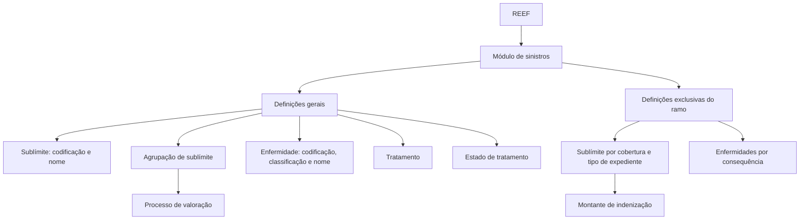

# Documentação REEF — Sublímite e Enfermidade no Módulo de Sinistros

## 1. Metadados do Documento
- **Arquivo de Origem:** Não identificado no conteúdo fornecido
- **Tipo de Documento:** Manual Operacional
- **Domínio / Sistema:** REEF / módulo de sinistros / Mapfre
- **Público-Alvo:** Negócio, analistas funcionais e operação
- **Data/Versão Identificada:** Não identificada

---

## 2. Resumo Executivo & Contexto de Negócio

O conteúdo documenta definições funcionais disponíveis no módulo de sinistros do sistema REEF, com foco em **sublímites** e **enfermidades**. As definições são organizadas entre elementos gerais, reutilizáveis no módulo de sinistros, e elementos específicos de um ramo.

Um sublímite determina o valor pelo qual a companhia indenizará. O sublímite é associado a um tipo de expediente e a uma cobertura, devendo ser definido nos níveis de ramo, cobertura e tipo de expediente.

Os sublímites podem ser agrupados para melhorar sua utilização no processo de valoração. A documentação prevê uma definição geral de codificação e nome dos sublímites, uma definição de agrupações de sublímites e uma definição específica por ramo.

Para enfermidades, o documento descreve a manutenção de codificação, classificação e nome de doenças, além de tratamentos e estados de tratamento. As enfermidades são usadas especialmente em sinistros de saúde e vida. No nível de ramo, a documentação menciona a definição de enfermidades que podem ocorrer por consequência, sem detalhar critérios adicionais.

---

## 3. Arquitetura, Componentes & Tecnologias Envolvidas

| Componente / Domínio | Descrição sustentada pelo documento |
| :--- | :--- |
| REEF | Sistema ou contexto de documentação identificado como “Documentation / DOCUMENTACIÓN Reef”. |
| Módulo de sinistros | Módulo no qual são utilizadas definições gerais, incluindo sublímite e enfermidade. |
| Sublímite | Elemento associado a tipo de expediente e cobertura, que determina o montante de indenização da companhia. |
| Agrupação de sublímite | Definição de códigos para reunir sublímites da mesma natureza. |
| Ramo | Nível no qual existem definições exclusivas do ramo em configuração. |
| Cobertura | Nível de definição de características de sublímites. |
| Tipo de expediente | Nível de associação e definição de características de sublímites. |
| Enfermidade | Definição utilizada para codificação, classificação e nome de doenças; frequentemente usada em sinistros de saúde e vida. |
| Tratamento | Definição de códigos dos tratamentos aplicáveis para curar enfermidades. |
| Estado | Definição de estados dos tratamentos. |
| Processo de valoração | Processo para o qual agrupamentos de sublímites são usados para melhor utilização. |
| Mapfredocument | Termo exibido no conteúdo como referência de documentação. |
| Zeus | Termo exibido na navegação da documentação, sem detalhamento funcional. |
| VL | Termo exibido no conteúdo, sem expansão ou detalhamento. |



> *Nota de Análise: o conteúdo não detalha interfaces, métodos HTTP, contratos JSON, bancos de dados, tecnologias de implementação, URLs, ambientes ou integrações técnicas entre o sistema REEF e outros sistemas.*

---

## 4. Regras de Negócio, Especificações Funcionais & Processos

### 4.1 Sublímite

1. Um sublímite é um elemento de livre definição.
2. Um sublímite está associado a:
   - um tipo de expediente;
   - uma cobertura.
3. Um sublímite determina o montante pelo qual a companhia indenizará.
4. Os sublímites devem ser definidos nos seguintes níveis:
   - ramo;
   - cobertura;
   - tipo de expediente.
5. Os sublímites devem ser agrupados para proporcionar melhor utilização no processo de valoração.
6. No contexto de definições gerais do módulo de sinistros, o sublímite permite definir:
   - codificação;
   - nome;
   - diferentes sublímites.
7. No contexto de ramo, o sublímite permite definir as características dos diferentes sublímites por:
   - cobertura;
   - tipo de expediente.

### 4.2 Agrupação de Sublímite

1. A agrupação de sublímite permite definir códigos.
2. Os códigos de agrupação servem para reunir diferentes sublímites.
3. Os sublímites reunidos devem possuir a mesma natureza.
4. A finalidade declarada da agrupação é apoiar uma melhor utilização dos sublímites no processo de valoração.

### 4.3 Enfermidade

1. A definição de enfermidades é normalmente utilizada para sinistros de saúde e de vida.
2. No contexto de definições gerais do módulo de sinistros, a enfermidade permite definir:
   - codificação;
   - classificação;
   - nome das diferentes enfermidades.
3. No contexto de ramo, a enfermidade permite definir as diferentes enfermidades que podem ocorrer por consequência.

> *Nota de Análise: o documento não especifica o significado de “por consequência”, nem descreve regras de associação, cálculo, validação ou hierarquia entre enfermidades.*

### 4.4 Tratamento e Estado

1. O tratamento permite definir códigos para os diferentes tratamentos aplicáveis para curar diferentes enfermidades.
2. O estado permite definir os estados dos tratamentos.

> *Nota de Análise: o documento não informa quais são os valores possíveis para estados de tratamento, nem apresenta transições de estado, responsáveis ou critérios de mudança.*

---

## 5. Tabelas de Parâmetros, Ambientes e Estruturas de Dados

| Item / Parâmetro | Descrição / Função | Tipo / Valores / Formato | Ambiente / Observações |
| :--- | :--- | :--- | :--- |
| Sublímite | Determina o montante pelo qual a companhia indenizará. | Elemento de livre definição. | Associado a tipo de expediente e cobertura. |
| Codificação de sublímite | Identifica diferentes sublímites. | Não detalhado. | Definição geral no módulo de sinistros. |
| Nome de sublímite | Nomeia diferentes sublímites. | Não detalhado. | Definição geral no módulo de sinistros. |
| Características de sublímite | Define características dos diferentes sublímites. | Não detalhado. | Definição exclusiva de ramo, por cobertura e tipo de expediente. |
| Agrupação de sublímite | Reúne sublímites de mesma natureza. | Códigos de agrupação. | Usada para melhor utilização no processo de valoração. |
| Ramo | Contexto de definições exclusivas do ramo em configuração. | Não detalhado. | Abrange sublímite e enfermidade específicos do ramo. |
| Cobertura | Nível de definição de características de sublímite. | Não detalhado. | Associada ao sublímite. |
| Tipo de expediente | Nível de associação e definição de sublímite. | Não detalhado. | Associado ao sublímite. |
| Enfermidade | Mantém codificação, classificação e nome de enfermidades. | Não detalhado. | Usada habitualmente em sinistros de saúde e vida. |
| Codificação de enfermidade | Identifica diferentes enfermidades. | Não detalhado. | Definição geral. |
| Classificação de enfermidade | Classifica diferentes enfermidades. | Não detalhado. | Definição geral. |
| Nome de enfermidade | Nomeia diferentes enfermidades. | Não detalhado. | Definição geral. |
| Enfermidade por consequência | Define enfermidades que podem ocorrer por consequência. | Não detalhado. | Definição exclusiva de ramo. |
| Tratamento | Define códigos dos tratamentos para curar diferentes enfermidades. | Códigos de tratamento. | Definição geral no módulo de sinistros. |
| Estado | Define estados dos tratamentos. | Estados não especificados. | Definição geral no módulo de sinistros. |
| Processo de valoração | Processo no qual agrupamentos de sublímites têm melhor utilização. | Não detalhado. | Sem regras de cálculo ou etapas descritas. |
| REEF | Contexto/sistema identificado na documentação. | Não detalhado. | O conteúdo não apresenta ambiente, URL ou versão. |
| Owner | Identificação exibida na fonte. | `user:agonzalez_mapfre.com` | Exibido no conteúdo bruto. |
| Lifecycle | Estado de ciclo de vida exibido na fonte. | `Approved Source` | Exibido no conteúdo bruto. |

---

## 6. Bateria de Perguntas & Respostas para RAG (FAQ Sintético)

### P1: O que é um sublímite no módulo de sinistros do REEF?
**R:** Um sublímite é um elemento de livre definição associado a um tipo de expediente e a uma cobertura. O sublímite determina o montante pelo qual a companhia indenizará.

### P2: Em quais níveis um sublímite deve ser definido?
**R:** Os sublímites devem ser definidos nos níveis de ramo, cobertura e tipo de expediente.

### P3: Qual é a finalidade da agrupação de sublímite?
**R:** A agrupação de sublímite permite definir códigos para reunir diferentes sublímites da mesma natureza. O agrupamento visa melhorar a utilização dos sublímites no processo de valoração.

### P4: Quais dados podem ser definidos para sublímites nas definições gerais?
**R:** Nas definições gerais do módulo de sinistros, o sublímite permite definir a codificação e o nome dos diferentes sublímites.

### P5: O que é definido para sublímites no nível de ramo?
**R:** No nível de ramo, são definidas as características dos diferentes sublímites por cobertura e tipo de expediente.

### P6: Para quais tipos de sinistro a definição de enfermidades costuma ser utilizada?
**R:** A definição de enfermidades costuma ser utilizada para sinistros de saúde e de vida.

### P7: Quais informações podem ser definidas para enfermidades nas definições gerais?
**R:** Nas definições gerais, a enfermidade permite definir a codificação, a classificação e o nome das diferentes enfermidades.

### P8: O que é definido para enfermidades no nível de ramo?
**R:** No nível de ramo, a enfermidade permite definir as diferentes enfermidades que podem ocorrer por consequência. O documento não detalha os critérios dessa consequência.

### P9: Qual é a função da definição de tratamento?
**R:** A definição de tratamento permite cadastrar códigos dos diferentes tratamentos que podem ser aplicados para curar diferentes enfermidades.

### P10: O que representa a definição de estado?
**R:** A definição de estado permite definir os estados dos tratamentos. O documento não informa quais estados estão disponíveis nem as regras de transição entre eles.

### P11: O documento informa como é calculado o valor da indenização a partir de um sublímite?
**R:** Não. O documento afirma que o sublímite determina o montante pelo qual a companhia indenizará, mas não apresenta fórmula de cálculo, critérios de aplicação ou prioridade entre sublímites.

### P12: O documento apresenta APIs, URLs, métodos HTTP ou contratos de integração para REEF?
**R:** Não. O conteúdo fornecido não detalha APIs, URLs, métodos HTTP, contratos JSON, tecnologias de implementação ou integrações técnicas.

---

## 7. Glossário de Termos, Siglas & Conceitos-Chave

- **REEF:** Sistema ou contexto de documentação identificado como “Documentation / DOCUMENTACIÓN Reef”; o conteúdo não expande a sigla.
- **Sublímite:** Elemento de livre definição associado a tipo de expediente e cobertura que determina o montante de indenização da companhia.
- **Agrupação de sublímite:** Mecanismo de definição de códigos para reunir sublímites da mesma natureza.
- **Ramo:** Contexto de definições exclusivas do ramo em configuração.
- **Cobertura:** Nível relacionado à definição das características de sublímites.
- **Tipo de expediente:** Entidade associada ao sublímite e utilizada na definição de suas características.
- **Enfermidade:** Definição de doenças, usualmente empregada em sinistros de saúde e vida.
- **Tratamento:** Código de tratamento aplicável para curar diferentes enfermidades.
- **Estado:** Estado atribuído a tratamentos.
- **Processo de valoração:** Processo mencionado como beneficiário da agrupação de sublímites; não detalhado.
- **VL:** Termo presente na interface da documentação, sem significado explicitado.
- **Zeus:** Termo presente na navegação da documentação, sem detalhamento no conteúdo fornecido.
- **Mapfredocument:** Termo exibido no conteúdo de navegação/documentação, sem definição adicional.

---

## 8. Notas Críticas, Riscos & Limitações

- O conteúdo não identifica nome de arquivo, versão, data de publicação ou versão do sistema REEF.
- O documento não detalha regras de cálculo de indenização, precedência entre sublímites ou comportamento quando múltiplos sublímites são aplicáveis.
- Não foram apresentados valores de exemplo, formatos de código, campos obrigatórios, validações ou restrições de cadastro para sublímites, enfermidades, tratamentos e estados.
- O processo de valoração é citado, mas não possui fluxo, fórmula, entradas, saídas ou responsabilidades descritas.
- A noção de enfermidades “por consequência” é mencionada sem definição operacional.
- Estados de tratamento são mencionados sem catálogo de valores, transições ou condições de alteração.
- Não há especificações de arquitetura técnica, APIs, integrações, segurança, autenticação, bancos de dados, servidores, ambientes, URLs ou logs.
- Termos como `VL`, `Zeus` e `Mapfredocument` aparecem no conteúdo, mas não recebem explicação funcional.

---

## 9. Conteúdo Bruto Estruturado (Referência Fiel)

```text
--- [PÁGINA 1 DE 2] ---

INTRODUCCIÓN - Varios
OBJETIVO
Sublímite
Enfermedad
Conceptos
SUBLÍMITE
SUBLÍMITE
Un sublímite es un elemento de libre
denición asociado a un tipo de
expediente, cobertura, que determinará el
monto por el que la compañía
indemnizará. Los sub-límites deberán ser
denidos a nivel de ramo, cobertura y tipo
de expediente. Los sub-límites serán
agrupados para una mejor utilización en el
proceso de valoración.
GENERAL
Son deniciones que NO son
exclusivas de un ramo y se
utilizan en el módulo de
siniestros. Las más importantes
son:
SUB-LIMITE
Permite denir la codicación y nombre de
los diferentes sub-límites
AGRUPACIÓN SUB-LIMITE
Permite denir códigos para aunar,
agrupar, diferentes sub-límites de la
misma naturaleza.
RAMO
Son exclusivas del ramo que se
está deniendo
SUB-LIMITE
Permite denir las características de los
diferentes sub-límites por cobertura y tipo
de expediente
ENFERMEDAD
ENFERMEDAD
Denición de enfermedades, suele ser
usado para siniestros de salud y de vida.
GENERAL
Documentation / DOCUMENTACIÓN Reef
DOCUMENTACIÓN Reef
Mapfredocument
DOCUMENTACIÓN Reef
Owner
user:agonzalez_mapfre.com
Lifecycle
Approved Source
 / 
 VL
Buscar Inicio Soluciones Arquitecturas APIs Componentes Cloud Documentación Zeus Reef Ayuda
ES


--- [PÁGINA 2 DE 2] ---

Son deniciones que NO son
exclusivas de un ramo y se
utilizan en el módulo de
siniestros. Las más importantes
son:
ENFERMEDAD
Permite denir la codicación
clasicación y nombre de las diferentes
enfermedades
TRATAMIENTO
Permite denir códigos de los diferentes
tratamientos que se pueden aplicar para
poder curar las diferentes enfermedades
ESTADO
Permite denir estados de los
tratamientos
RAMO
Son exclusivas del ramo que se
está deniendo
ENFERMEDAD
Permite denir las diferentes
enfermedades que se pueden dar por
consecuencia
```
