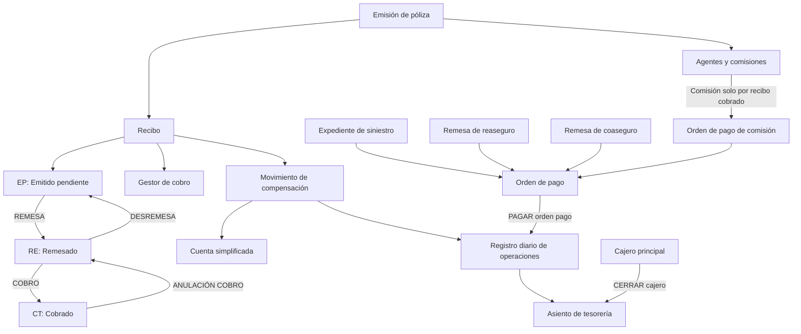

# Documentação Reef — Módulo de Tesorería: Conceitos, Configuração e Operações

## 1. Metadados do Documento
- **Arquivo de Origem:** Não informado; texto extraído de documentação Reef.
- **Tipo de Documento:** Manual funcional.
- **Domínio / Sistema:** Reef.core / MAPFRE — Módulo de Tesorería.
- **Público-Alvo:** Operação, negócio, analistas funcionais, desenvolvedores e arquitetos.
- **Data/Versão Identificada:** Não identificada.
- **Status identificado no repositório documental:** `Approved Source`; proprietário exibido: `user:agonzalez_mapfre.com`.

---

## 2. Resumo Executivo & Contexto de Negócio

O módulo de **Tesorería** do Reef.core controla os fluxos monetários da companhia, abrangendo gestão de pagamentos, gestão de cobranças e gestões bancárias. O módulo permite registrar contabilmente cobranças e pagamentos sem exigir conhecimento contábil aprofundado do usuário operacional.

O registro diário de operações é o núcleo operacional do módulo. Cada operação é registrada cronologicamente como lançamento contábil, com movimentos no **Debe** e no **Haber**. Gastos são refletidos no Debe, enquanto receitas são registradas no Haber. As transações precisam permanecer quadradas na moeda do país, mesmo quando a operação original ocorrer em moeda estrangeira.

A Tesorería integra informações originadas em emissão de apólices, recibos, agentes, comissões, sinistros, remessas de resseguro e cosseguro e ordens de pagamento. Recibos são emitidos por movimentos definitivos que afetam prêmio; comissões de agentes são calculadas na emissão e somente são pagas após o recebimento dos recibos relacionados.

O módulo estabelece segregação operacional por meio de usuários com papel de cajero. O cajero principal é o único perfil que pode encerrar o registro diário, e deve existir um cajero principal por cada nível 3 da estrutura comercial, além dos cajeros secundários necessários.

A documentação descreve operações manuais e processos massivos para cobranças e pagamentos, incluindo geração de arquivos/lotes, execução de cobranças e pagamentos batch e consultas de estado. **Nota de Análise:** o documento apresenta operações funcionais e contábeis, mas não detalha interfaces técnicas, contratos HTTP, banco de dados, URLs, serviços ou APIs.

---

## 3. Arquitetura, Componentes & Tecnologias Envolvidas

### Componentes funcionais identificados

| Componente / Entidade | Papel no módulo de Tesorería |
| :--- | :--- |
| Reef.core | Sistema no qual são realizadas operações de companhia, moedas e Tesorería. |
| Registro diario de operaciones | Registro cronológico de cobranças e pagamentos em forma de lançamento contábil. |
| Asiento de tesorería | Agrupa e totaliza movimentos do registro diário por conta contábil. |
| Recibo | Documento gerado a partir da emissão para movimentos definitivos que afetam prêmio. |
| Gestor de cobro | Pessoa ou entidade responsável pela cobrança de recibos. |
| Agente | Intermediário vinculado à apólice que pode receber comissão. |
| Comisión | Valor calculado na emissão e pago somente para recibos cobrados. |
| Orden de pago | Meio para pagamento a pessoas físicas ou jurídicas relacionadas à companhia. |
| Cuenta simplificada | Chave que identifica a conta contábil usada em uma cobrança ou pagamento de recibo. |
| Movimiento de compensación | Movimento que registra a forma de entrada ou saída do valor cobrado ou pago. |
| Cajero | Usuário autorizado a trabalhar com o módulo de Tesorería. |
| Banco | Terceiro com propriedades específicas para operações bancárias. |
| Remesa | Contexto de operações de recibos, resseguro e cosseguro. |
| Proceso masivo | Processamento por lotes de cobranças e pagamentos mediante arquivos. |



### Fluxo contábil e de fechamento

```mermaid
flowchart LR
    Operacion[Operación de cobro o pago] --> DebeHaber[Movimientos en Debe y Haber]
    DebeHaber --> Compensacion[Operación de compensación]
    Compensacion --> Cuadre[Cuadre en moneda del país]
    Cuadre --> RegistroDiario[Registro diario]
    RegistroDiario --> Cierre[Cierre de caja por cajero principal]
    Cierre --> AsientoTesoreria[Generación del asiento de tesorería]
    AsientoTesoreria --> Agrupacion[Agrupación por cuenta contable]
```



**Nota de Análise:** a documentação não identifica tecnologias de implementação, versões, protocolos de integração, ambientes técnicos, servidores, rotas de logs ou contratos de serviços.

---

## 4. Regras de Negócio, Especificações Funcionais & Processos

### 4.1 Registro diário e contabilidade

1. Todas as operações diárias de cobrança e pagamento são registradas cronologicamente no registro diário de operações.
2. O registro diário representa operações como lançamentos contábeis, com movimentos no Debe e no Haber.
3. Gastos são refletidos no Debe.
4. Receitas são registradas no Haber.
5. As transações registradas constituem o lançamento contábil de Tesorería.
6. Toda operação no registro diário deve ter um movimento no Debe e outro no Haber.
7. A contrapartida é realizada por meio da operação de compensação.
8. Todas as transações precisam estar quadradas na moeda do país.
9. Cada movimento do registro diário é regido por uma data que identifica a data do lançamento.
10. A data do lançamento muda com o fechamento de “caja” e com a geração do lançamento de Tesorería.
11. “Caja” refere-se a todos os movimentos ou lançamentos realizados no registro diário durante o dia.
12. O asiento de tesorería agrupa e totaliza, por conta contábil, os movimentos do registro diário.

### 4.2 Gestor de cobro

1. O gestor de cobro é a pessoa ou entidade responsável por cobrar recibos.
2. O gestor de cobro é identificado na emissão da apólice.
3. O gestor de cobro pode ser alterado a partir de Tesorería.
4. A codificação do tipo de gestor é configurável para cada companhia.
5. A classe de gestor determina as características do gestor de cobro.

| Classe de gestor | Descrição |
| :--- | :--- |
| 1 | Agente |
| 2 | Banco |
| 3 | Cobrador |
| 4 | Débito automático em conta |
| 5 | Gestor direto |
| 6 | Gestor piloto de cosseguro |
| 7 | Oficina comercial |
| 8 | Débito com cartão de crédito |
| 10 | Gestor de inadimplência |

| Tipo de gestor | Descrição | Classe de gestor |
| :--- | :--- | :--- |
| AG | Agente | 1 |
| OF | Oficina | 7 |
| TA | Cartão | 8 |
| DB | Débito bancário / domiciliación bancaria | 4 |

### 4.3 Agentes e comissões

1. A emissão da apólice identifica as figuras que participam da apólice e podem receber comissão.
2. Uma apólice sempre possui um agente principal.
3. Uma apólice pode possuir agentes secundários, organizador ou assessor que também podem receber comissão.
4. A comissão de cada agente é calculada nos movimentos de emissão.
5. O quadro de comissão selecionado para o agente principal determina o valor da comissão.
6. Nem o quadro de comissão nem seus valores podem ser alterados em Tesorería.
7. Somente são pagas comissões referentes a recibos cobrados.
8. Após a cobrança de um recibo, os valores de comissão associados ao recibo são registrados em Tesorería.
9. Os valores de comissão registrados são a base para pagamento de comissões aos agentes.

### 4.4 Recibos

1. Recibos são gerados na emissão para movimentos definitivos que afetam prêmio.
2. O valor dos recibos não pode ser alterado em Tesorería.
3. Um recibo possui identificador único, situação, datas, gestor de cobro, informações econômicas, agentes/comissões e pagador.
4. O estado do recibo determina quais operações de Tesorería podem ser realizadas.

| Situação | Descrição |
| :--- | :--- |
| EP | Emitido pendente |
| RE | Remessado |
| CT | Cobrado |

| Estado de origem | Operação | Estado de destino |
| :--- | :--- | :--- |
| EP — Emitido pendiente | REMESA | RE — Remesado |
| RE — Remesado | COBRO | CT — Cobrado |
| RE — Remesado | DESREMESA | EP — Emitido pendiente |
| CT — Cobrado | ANULACIÓN COBRO | RE — Remesado |

### 4.5 Conta simplificada e compensação

1. A cuenta simplificada é uma chave que identifica a conta contábil usada em uma cobrança ou pagamento de recibo.
2. Operações de cobrança e pagamento possuem movimento de compensação.
3. O movimento de compensação registra a forma de entrada ou saída do valor cobrado ou pago.
4. A cuenta simplificada está vinculada ao movimento de compensação.
5. A cuenta simplificada é determinada pelo tipo de compensação utilizado.
6. Para cobrança ou pagamento em efetivo, existe uma cuenta simplificada predefinida.
7. Para operação com banco, é necessário identificar a cuenta simplificada daquele banco no momento da compensação.

| Tipo de compensação citado |
| :--- |
| Cheque |
| Efetivo |
| Transferência |
| Cartão de crédito |
| Outros (`etc.`) |

### 4.6 Conceitos de cobrança e pagamento

1. O conceito de cobro y pago representa o detalhamento econômico da ordem de pagamento.
2. O conceito permite detalhar o gasto.
3. O conceito identifica a conta contábil utilizada para gerar a ordem de pagamento.
4. Cada companhia define seus próprios conceitos de cobrança e pagamento.
5. Os conceitos são classificados de acordo com a natureza do gasto.

| Classificação | Descrição |
| :--- | :--- |
| SI | Siniestros |
| RE | Reaseguro |
| CC | Coaseguro cedido |
| CA | Coaseguro aceptado |
| CP | Cobros y pagos varios |
| AC | Agentes y comisiones |
| VI | Conceptos de vida |

| Código de conceito | Descrição | Classificação |
| :--- | :--- | :--- |
| DC | Descuento de comisiones | AC |
| PC1 | Anticipo de comisiones | AC |
| S04 | Indemnización talleres | SI |

### 4.7 Ordens de pagamento

1. A ordem de pagamento é o meio utilizado pela companhia para pagar pessoas físicas ou jurídicas que tiveram relação com a companhia.
2. Existem tipos de ordens de pagamento de Tesorería, sinistros, remessas de resseguro, remessas de cosseguro, comissões de agente e devoluções de prêmio.
3. Ordens de pagamento de sinistros são geradas no módulo de sinistros, mas o pagamento ocorre em Tesorería.
4. As ordens originadas em sinistros são chamadas de Liquidaciones de expedientes.
5. Podem existir liquidações negativas para cobrança e recuperação de sinistros, incluindo franquias e recuperação de sinistros de outra companhia.

| Tipo | Descrição |
| :--- | :--- |
| T | Tesorería |
| S | Siniestros |
| R | Remesas de reaseguro |
| C | Remesas de coaseguro |
| A | Comisiones de agente |
| D | Devoluciones de prima |

### 4.8 Acesso, cajeros e fechamento

1. Para utilizar Tesorería, o usuário deve existir no sistema e possuir papel de cajero.
2. Cajeros podem ser principais (`P`) ou secundários (`S`).
3. Deve existir um cajero principal por cada nível 3 da estrutura comercial.
4. Podem existir tantos cajeros secundários quanto necessário.
5. Somente o cajero principal pode executar o fechamento do registro diário.

| Código | Perfil | Regra |
| :--- | :--- | :--- |
| P | Cajero principal | Único perfil que pode realizar o fechamento do registro diário. |
| S | Cajero secundario | Perfil operacional de Tesorería sem autorização exclusiva de fechamento. |

### 4.9 Multimoeda

1. Operações de Tesorería podem ser realizadas em diferentes moedas.
2. As moedas e seus tipos de câmbio correspondentes devem estar registrados no sistema.
3. Um recibo emitido em moeda estrangeira é cobrado nessa moeda.
4. Um recibo emitido em moeda estrangeira pode ser compensado na própria moeda, na moeda local ou em outra moeda.
5. Todo movimento, inclusive em moeda estrangeira, deve registrar o valor correspondente em moeda local para permitir o quadramento do registro diário.

### 4.10 Operações suportadas

#### Cobranças e devoluções

| Operação | Descrição |
| :--- | :--- |
| GESTIONAR recibo cobro devolución | Cobrar recibos ou anular cobranças de recibos. |
| GENERAR cobro pago vario | Gerar cobranças e ordens de pagamento para fornecedores não vinculados ao negócio de seguros. |
| ENTREGAR caja efectivo | Compensar uma anulação de cobrança em efetivo. |
| ENTREGAR banco efectivo | Compensar uma anulação de cobrança paga no banco. |
| RECIBIR caja banco cheque | Compensar valores devolvidos de banco cobrados por cheque. |
| RECIBIR caja banco tarjeta | Compensar valores devolvidos de banco cobrados por cartão. |
| ENTREGAR cuenta gestión | Compensar uma anulação de cobrança contra conta de gestão. |
| ANULAR caja cheque | Compensar uma anulação de cobrança contra cheque em caixa. |
| ANULAR caja tarjeta | Compensar uma anulação de cobrança contra cartão. |
| ENTREGAR caja diferencia cambio | Compensar diferença positiva em caixa por tipos de câmbio. |
| RECIBIR caja efectivo | Compensar uma cobrança em efetivo. |
| RECIBIR caja cheque | Compensar uma cobrança com cheque. |
| RECIBIR caja tarjeta | Compensar uma cobrança com cartão. |
| RECIBIR caja banco efectivo | Compensar uma cobrança quando o cliente paga no banco. |
| RECIBIR caja cuenta gestión | Compensar uma cobrança contra conta de gestão. |
| RECIBIR caja diferencia cambio | Compensar diferença negativa em caixa por tipos de câmbio. |
| RECIBIR caja cancelación cobro anticipado | Compensar cobrança de recibo com cancelamento de cobrança antecipada. |
| CREAR recibo grupo | Agrupar recibos em um documento de cobrança para gestão conjunta. |
| ANULAR recibo grupo | Desagrupar recibos associados a um documento de cobrança. |
| GENERAR orden pago anulado cobro | Criar ordem de pagamento pela anulação de recibo cobrado. |
| CREAR anticipo cobro | Cobrar valor em conta de prêmio em depósito até a cobrança do recibo da apólice. |
| COBRAR siniestro | Registrar cobrança de liquidações negativas de sinistros. |
| ANULAR cobro siniestro | Anular a cobrança de liquidação negativa de sinistro. |

#### Pagamentos

| Operação | Descrição |
| :--- | :--- |
| PAGAR orden pago | Pagar a um terceiro o valor de uma ordem de pagamento. |
| AUTORIZAR orden pago | Aprovar o pagamento de uma ordem de pagamento. |
| CREAR anticipo comisión | Gerar ordem de pagamento para antecipar total ou parte de comissão a agente. |
| ANULAR orden pago | Cancelar ordens de pagamento geradas e pendentes de pagamento. |
| ANULAR orden pago cheque transferencia | Anular cheques ou transferências de pagamentos, com ou sem reexpedição. |
| ANULAR orden pago otra forma pago | Anular ordens pagas por conta de gestão, banco em efetivo ou caixa em efetivo. |
| CAMBIAR oficina orden pago | Alterar a oficina de pagamento de uma ordem de pagamento. |
| MODIFICAR cheque dañado impreso | Registrar cheque de pagamento deteriorado no momento da impressão. |
| MODIFICAR cheque manual dañado | Registrar cheque de pagamento deteriorado antes da impressão. |
| IMPRIMIR cheque | Imprimir cheques para realizar pagamentos. |

#### Resseguro e cosseguro

| Operação | Descrição |
| :--- | :--- |
| GENERAR cobro pago remesa | Registrar abono ou débito por remessas de cosseguro e resseguro. |

#### Fechamento de cajeros

| Operação | Descrição |
| :--- | :--- |
| CERRAR cajero | Finalizar operações do dia no registro diário e gerar lançamentos de Tesorería. |
| CERRAR cajero error otra fecha | Finalizar operações do registro diário sem gerar lançamentos de Tesorería, em data diferente da parte ativa, quando o fechamento provocou algum erro. |
| GENERAR asiento tesorería | Realizar lançamentos de Tesorería para datas anteriores à data da parte ativa. |

#### Operações não contábeis

| Operação | Descrição |
| :--- | :--- |
| AJUSTAR comisión liquidación | Realizar ajuste de débito ou crédito que afeta saldo de comissão do agente. |
| CREAR comisión liquidación | Gerar ordens de pagamento para quitar comissões de agentes. |
| CREAR comisión informe | Gerar impresso da liquidação de comissões de agentes. |
| REMESAR recibo prima | Colocar recibos de apólices em cobrança; altera estado de EP para RE. |
| DESREMESAR recibo | Alterar recibo de RE para EP. |
| CAMBIAR recibo prima gestor | Atribuir outro gestor de cobro a um recibo. |
| REGISTRAR factura | Inserir uma fatura na aplicação. |

#### Consultas

| Operação | Descrição |
| :--- | :--- |
| CONSULTAR recibo | Consultar informações de recibos por critérios de busca. |
| CONSULTAR orden pago | Consultar dados de ordens de pagamento por critérios de busca. |
| CONSULTAR registro diario | Consultar operações realizadas no dia por critérios de busca. |
| CONSULTAR histórico registro diario | Consultar operações de Tesorería realizadas em datas anteriores. |
| CONSULTAR recibo agente gestor | Consultar recibos por gestor de cobro. |
| CONSULTAR cheque en caja | Consultar cheques em caixa. |
| CONSULTAR tarjeta en caja | Consultar cartões em caixa. |
| CONSULTAR saldo banco | Consultar saldo das contas bancárias da companhia. |
| CONSULTAR saldo cajero | Consultar saldo dos cajeros por moeda. |

#### Processos massivos

| Operação | Descrição |
| :--- | :--- |
| GENERAR tabla buzón cobros batch | Preparar informações de recibos a cobrar em processo massivo a partir de arquivo. |
| GENERAR carga cobros batch | Preparar informações de recibos domiciliados a enviar ao banco para cobrança massiva. |
| COBRAR prima batch | Executar cobrança massiva dos recibos incluídos no processo. |
| CONSULTAR cobros batch | Consultar estado de cobranças dentro de processo massivo. |
| GENERAR tabla buzón pagos batch | Preparar informações de ordens de pagamento a pagar em processo massivo a partir de arquivo. |
| GENERAR carga pagos batch | Preparar informações das ordens de pagamento que serão pagas no processo massivo. |
| INCLUIR orden pago batch | Incluir no processo massivo uma ordem de pagamento anteriormente excluída. |
| PAGAR orden pago batch | Executar pagamento das ordens incluídas no processo. |
| CONSULTAR pagos batch | Consultar estado de pagamentos dentro de processo massivo. |

---

## 5. Tabelas de Parâmetros, Ambientes e Estruturas de Dados

### Estrutura do recibo

| Item / Parâmetro | Descrição / Função | Tipo / Valores / Formato | Ambiente / Observações |
| :--- | :--- | :--- | :--- |
| Número de recibo | Identificador único do recibo. | Identificador único. | Gerado a partir da emissão. |
| Situação | Indica o estado operacional do recibo. | EP, RE ou CT. | Determina operações possíveis em Tesorería. |
| Fecha de efecto y vencimiento | Datas de efeito e vencimento do recibo. | Datas. | Parte dos dados do recibo. |
| Fecha de vencimiento de pago | Data de vencimento para pagamento. | Data. | Parte dos dados do recibo. |
| Gestor de cobro | Responsável pela cobrança. | Pessoa ou entidade; tipo configurável. | Identificado na emissão; pode ser alterado em Tesorería. |
| Moneda del recibo | Moeda do recibo. | Moeda registrada no sistema. | Pode envolver compensação em mesma moeda, moeda local ou outra moeda. |
| Conceptos económicos | Conceitos que compõem informação econômica. | Conceitos econômicos. | Necessitam definição prévia em nível comum. |
| Tipo de agente | Identifica tipo de agente. | Não detalhado. | Parte da composição de agentes e comissões. |
| Importe de comisión | Valor da comissão. | Valor monetário. | Calculado na emissão; não alterável em Tesorería. |
| Pagador | Terceiro responsável pelo pagamento. | Tipo e código de documento do terceiro. | Parte da composição do recibo. |

### Estrutura da ordem de pagamento

| Item / Parâmetro | Descrição / Função | Tipo / Valores / Formato | Ambiente / Observações |
| :--- | :--- | :--- | :--- |
| Fechas estimadas de pago | Datas estimadas para pagamento. | Datas. | Parte da identificação. |
| Moneda del pago | Moeda do pagamento. | Moeda. | Parte da identificação. |
| Datos de la factura | Dados de fatura. | Não detalhado. | Aplicável quando o pagamento é realizado por fatura. |
| Beneficiario | Terceiro a receber pagamento. | Tipo e código de documento do terceiro. | Pessoa física ou jurídica. |
| Forma de pago | Forma de realização do pagamento. | Efetivo, cheque, transferência bancária etc. | Parte do beneficiário. |
| Concepto de cobro pago | Natureza do gasto. | Conceito definido pela companhia. | Identifica conta contábil para gerar ordem. |
| Impuestos o retenciones | Tributos e retenções vinculados ao conceito. | Impostos e retenções. | Devem ser definidos em Tesorería. |

### Definições prévias — nível comum

| Item / Parâmetro | Descrição / Função | Tipo / Valores / Formato | Ambiente / Observações |
| :--- | :--- | :--- | :--- |
| Usuarios | Pessoas com acesso ao sistema e papéis atribuídos. | Usuários e roles. | Necessário para acesso a Tesorería. |
| Programas | Operações contempladas pelo sistema e suas características. | Programas/operações. | Definição comum. |
| Compañía | Entidade ou entidades para criação de apólices e demais elementos. | Companhia. | Definição comum. |
| Moneda | Divisas usadas por Reef.core nas operações da companhia. | Moedas. | Requer tipo de câmbio registrado para multimoeda. |
| Estructura comercial | Organização territorial da companhia. | Estrutura organizacional. | Há exigência de cajero principal por nível 3. |
| Terceros | Pessoas físicas ou jurídicas relacionadas à entidade MAPFRE. | Terceiros. | Inclui pagadores e beneficiários. |
| Agente | Terceiros que atuam como intermediários entre cliente e companhia. | Agentes. | Podem receber comissão. |
| Aseguradora | Propriedades específicas de terceiros seguradores relacionados à MAPFRE. | Seguradora. | Definição comum. |
| Conceptos económicos | Conceitos da informação econômica de recibos. | Conceitos. | Associado à composição do recibo. |
| Plan pago | Forma de fracionar o pagamento do seguro. | Plano de pagamento. | Definição comum. |
| Bancos | Propriedades específicas de terceiros bancários. | Bancos. | Usado em operações bancárias. |
| Ejercicio contable | Período em que são realizadas operações contábeis. | Exercício contábil. | Após cada fechamento, deve-se definir novo exercício. |
| Plan de cuentas | Contas usadas pela companhia no exercício e seus parâmetros. | Plano de contas. | Base do agrupamento contábil. |
| Concepto contable | Identificador que agrupa lançamentos para consulta posterior. | Identificador contábil. | Definição comum. |

### Definições específicas de Tesorería

| Item / Parâmetro | Descrição / Função | Tipo / Valores / Formato | Ambiente / Observações |
| :--- | :--- | :--- | :--- |
| Cajero | Usuários que podem operar Tesorería. | P ou S. | Cajero principal pode encerrar registro diário. |
| Impuesto | Obrigações tributárias, características e métodos de cálculo. | Impostos. | Relacionado a impostos/retenções de ordens de pagamento. |
| Cuenta por tipo actualización | Contas contábeis usadas conforme a operação do registro diário. | Contas contábeis. | Operação do registro diário. |
| Cuenta simplificada | Chaves que identificam contas contábeis. | Chaves contábeis. | Associada a movimento de compensação. |
| Gestor cobro | Tipos de gestores de cobrança de recibos. | Classes/tipos de gestor. | Classe determina características. |
| Cobros anticipados | Tipos de cobranças antecipadas permitidas e características. | Tipos de antecipação. | Relacionado a `CREAR anticipo cobro`. |
| Orden pago | Informação necessária para criar ordens de pagamento. | Dados de ordem de pagamento. | Inclui identificação, beneficiário, conceito e tributos/retenções. |
| Autorización orden pago | Dados para determinar necessidade e responsável por autorização. | Regras de autorização. | Documento não detalha os critérios. |
| Concepto cobro pago | Desdobramento econômico das ordens de pagamento. | Conceitos por natureza de gasto. | Cada companhia define os próprios conceitos. |
| Tarjetas crédito | Identificação e características de cartões para cobranças. | Cartões de crédito. | Forma de compensação/cobrança. |
| Subvención agente | Características de subsídios de comissões de agentes. | Subvenções. | Documento não detalha regras de cálculo. |
| Parámetros y definiciones Tesorería | Definições e parâmetros que condicionam o funcionamento do módulo. | Parâmetros. | Sem lista detalhada de parâmetros. |
| Proceso masivo | Definições necessárias ao funcionamento de processos massivos de cobranças e pagamentos. | Processos batch. | Usa dados de arquivos conforme operações descritas. |

### Ambientes, servidores, URLs e logs

| Item / Parâmetro | Descrição / Função | Tipo / Valores / Formato | Ambiente / Observações |
| :--- | :--- | :--- | :--- |
| Ambientes técnicos | Não identificados. | Não aplicável. | O texto não informa DEV, QA, UAT, produção ou equivalentes. |
| Servidores | Não identificados. | Não aplicável. | O texto não lista hosts, endereços ou infraestrutura. |
| URLs | Não identificadas. | Não aplicável. | O texto não fornece URLs funcionais ou técnicas. |
| Rotas de log | Não identificadas. | Não aplicável. | O texto não especifica arquivos, diretórios ou plataformas de observabilidade. |
| APIs / contratos | Não identificados. | Não aplicável. | Não há métodos HTTP, payloads, endpoints ou contratos JSON. |

---

## 6. Bateria de Perguntas & Respostas para RAG (FAQ Sintético)

### P1: Qual é o objetivo do módulo de Tesorería no Reef.core?
**R:** O módulo de Tesorería controla os fluxos monetários da companhia, incluindo gestão de pagamentos, gestão de cobranças e gestões bancárias. O módulo permite registrar lançamentos contábeis de cobranças e pagamentos no registro diário de operações.

### P2: Como um gasto e uma receita são representados no registro diário de operações?
**R:** Um gasto é refletido no Debe e uma receita é registrada no Haber. Toda operação do registro diário deve possuir um movimento no Debe e outro no Haber, sendo a contrapartida executada mediante operação de compensação.

### P3: Quais são os estados possíveis de um recibo e quais transições a Tesorería suporta?
**R:** Um recibo pode estar em EP — Emitido pendiente, RE — Remesado ou CT — Cobrado. A operação REMESA muda o recibo de EP para RE; COBRO muda de RE para CT; DESREMESA retorna de RE para EP; e ANULACIÓN COBRO retorna de CT para RE.

### P4: O valor de um recibo ou os valores de comissão podem ser modificados em Tesorería?
**R:** Não. O valor dos recibos não pode ser modificado em Tesorería. As comissões são calculadas nos movimentos de emissão, e nem o quadro de comissão selecionado para o agente principal nem os valores de comissão podem ser alterados em Tesorería.

### P5: Quando uma comissão de agente pode ser paga?
**R:** Comissões são pagas somente para recibos cobrados. Quando um recibo é cobrado, os valores de comissão relacionados são registrados em Tesorería e passam a constituir a base para pagamento das comissões aos agentes.

### P6: Qual é a finalidade da cuenta simplificada?
**R:** A cuenta simplificada é uma chave que identifica a conta contábil usada para uma operação de cobrança ou pagamento de recibo. Ela está vinculada ao movimento de compensação e é determinada conforme o tipo de compensação, como cheque, efetivo, transferência ou cartão de crédito.

### P7: Quem pode executar o fechamento do registro diário?
**R:** Somente o cajero principal pode realizar o fechamento do registro diário. Deve existir um cajero principal para cada nível 3 da estrutura comercial, podendo haver tantos cajeros secundários quanto necessários.

### P8: Como Tesorería trata uma operação em moeda estrangeira?
**R:** As operações podem ser realizadas em várias moedas desde que as moedas e seus respectivos tipos de câmbio estejam cadastrados. Um recibo em moeda estrangeira pode ser compensado na mesma moeda, em moeda local ou em outra moeda. Ainda assim, todos os movimentos devem registrar o valor correspondente em moeda local para permitir o quadramento do registro diário.

### P9: Quais tipos de ordem de pagamento são definidos no documento?
**R:** São definidos os tipos T — Tesorería, S — Siniestros, R — Remesas de reaseguro, C — Remesas de coaseguro, A — Comisiones de agente e D — Devoluciones de prima.

### P10: Como são tratadas ordens de pagamento originadas em sinistros?
**R:** Ordens de pagamento de sinistros são geradas no próprio módulo de sinistros, mas o pagamento é realizado em Tesorería. Essas ordens são chamadas de Liquidaciones de expedientes e podem ser negativas para cobrança ou recuperação de sinistros, como franquias ou recuperações de outra companhia.

### P11: O que faz a operação REMESAR recibo prima?
**R:** A operação REMESAR recibo prima coloca recibos de apólices em cobrança e altera sua situação de Emitido Pendiente (EP) para Remesado (RE).

### P12: Quais etapas existem no processo massivo de cobranças?
**R:** O processo massivo de cobranças inclui `GENERAR tabla buzón cobros batch`, que prepara informações a partir de arquivo; `GENERAR carga cobros batch`, que prepara recibos domiciliados para envio ao banco; `COBRAR prima batch`, que executa a cobrança dos recibos incluídos; e `CONSULTAR cobros batch`, que consulta o estado das cobranças por critérios de busca.

### P13: O que ocorre durante a operação CERRAR cajero?
**R:** A operação CERRAR cajero finaliza as operações do dia no registro diário e gera os lançamentos de Tesorería. O asiento de tesorería agrupa por conta contábil os movimentos registrados no diário.

---

## 7. Glossário de Termos, Siglas & Conceitos-Chave

- **AC:** Agentes y comisiones; classificação de conceitos de cobrança e pagamento.
- **Asiento de tesorería:** Lançamento de Tesorería que agrupa e totaliza movimentos do registro diário por conta contábil.
- **CA:** Coaseguro aceptado; classificação de conceitos de cobrança e pagamento.
- **Caja:** Todos os movimentos ou lançamentos efetuados no registro diário durante um dia.
- **Cajero:** Usuário autorizado a trabalhar no módulo de Tesorería.
- **Cajero principal:** Perfil de cajero com autorização exclusiva para encerrar o registro diário.
- **Cajero secundario:** Perfil operacional de Tesorería sem a autorização exclusiva atribuída ao cajero principal.
- **CC:** Coaseguro cedido; classificação de conceitos de cobrança e pagamento.
- **Concepto cobro pago:** Desdobramento econômico de ordem de pagamento que detalha o gasto e identifica conta contábil.
- **Concepto contable:** Identificador que agrupa lançamentos contábeis para consulta posterior.
- **Cuenta simplificada:** Chave que identifica a conta contábil usada em cobrança ou pagamento de recibo.
- **CT:** Cobrado; situação de recibo após a operação de cobrança.
- **Debe:** Lado do lançamento contábil em que o documento informa que gastos são refletidos.
- **Domiciliación bancaria:** Débito automático/bancário; tipo de gestor DB, classe 4.
- **EP:** Emitido pendiente; situação inicial descrita para recibos emitidos pendentes.
- **Gestor de cobro:** Pessoa ou entidade responsável pela cobrança de recibos.
- **Haber:** Lado do lançamento contábil em que o documento informa que receitas são registradas.
- **Liquidaciones de expedientes:** Ordens de pagamento originadas no módulo de sinistros.
- **Movimiento de compensación:** Movimento que registra a forma de entrada ou saída do valor em uma cobrança ou pagamento.
- **Orden de pago:** Meio pelo qual a companhia realiza pagamento a pessoa física ou jurídica.
- **P:** Código do cajero principal.
- **Proceso masivo:** Processamento por lotes de cobranças ou pagamentos.
- **RE:** Remesado; situação de recibo após remessa e antes de cobrança.
- **Reef.core:** Sistema citado para operações de companhia e Tesorería.
- **Registro diario de operaciones:** Registro cronológico de operações diárias de cobranças e pagamentos.
- **S:** Código do cajero secundario.
- **SI:** Siniestros; classificação de conceitos de cobrança e pagamento.
- **Tesorería:** Módulo que controla os fluxos monetários, cobranças, pagamentos e gestões bancárias.
- **VI:** Conceptos de vida; classificação de conceitos de cobrança e pagamento.

---

## 8. Notas Críticas, Riscos & Limitações

- O documento não fornece arquitetura técnica detalhada, APIs, endpoints, contratos JSON, esquemas de banco de dados, filas, integrações ou tecnologias de implementação.
- Não são identificados ambientes técnicos, URLs, servidores, portas, credenciais, caminhos de logs ou ferramentas de observabilidade.
- O documento informa que critérios para `AUTORIZACIÓN ORDEN PAGO` são definidos, mas não detalha os parâmetros, limites, perfis ou regras de autorização.
- São citados `PARÁMETROS Y DEFINICIONES TESORERÍA`, `COBROS ANTICIPADOS`, `SUBVENCIÓN AGENTE` e `PROCESO MASIVO`, porém os atributos de configuração não são enumerados.
- A execução multimoeda depende do cadastro prévio de moedas e respectivos tipos de câmbio; sem esses registros, a operação em múltiplas moedas não é suportada conforme a documentação.
- O quadramento do registro diário é obrigatório em moeda local, inclusive em transações efetuadas em moeda estrangeira.
- O fechamento diário depende exclusivamente do cajero principal; essa regra é uma dependência operacional para a conclusão do ciclo diário.
- Valores de recibos e comissões calculadas na emissão não podem ser alterados em Tesorería, limitando correções posteriores nesse módulo.
- Processos massivos dependem de arquivos, mas o documento não especifica layout, formato, mecanismo de entrada, validações, tratamento de erro ou reconciliação.
- **Nota de Análise:** o texto contém caracteres de extração corrompidos em palavras como “definición”, “flujo”, “oficina” e “finalización”; o significado foi preservado sem introduzir informações externas.

---

## 9. Conteúdo Bruto Estruturado (Referência Fiel)

```text
--- [PÁGINA 1 DE 11] ---

INTRODUCCIÓN - Módulo Tesorería
Objetivo
Este módulo se encarga de controlar todos los flujos monetarios de la compañía: Gestión de Pagos, Gestión de Cobros, Gestiones Bancarias.
Permite, fundamentalmente, realizar apuntes contables de cobros y pagos, sin tener mayor conocimiento de contabilidad.
En este documento se abordarán los siguientes puntos:
Conceptos principales
Características
Entradas y salidas
Definiciones
Operaciones soportadas

Conceptos principales
Registro diario de operaciones
Gestor de cobro
Agentes y Comisiones
Recibos
Cuenta simplificada
Concepto de cobro y pago
Orden de pago

Registro diario de operaciones
Es donde se registran todas las operaciones diarias de cobros y pagos de la compañía, de manera cronológica y en forma de asiento contable, es decir, registrando los movimientos en el Debe y el Haber.
Cuando se trata de un gasto se refleja en el Debe.
Cuando es un ingreso se registra en el Haber.
El registro de estas transacciones conforman el asiento contable de tesorería.

Gestor de cobro
Es la persona o entidad que se encarga de realizar el cobro de los recibos. Se identifica desde la emisión de la póliza, aunque se puede permitir modificar desde tesorería.

Documentation / DOCUMENTACIÓN Reef
DOCUMENTACIÓN Reef
Mapfredocument
DOCUMENTACIÓN Reef
Owner
user:agonzalez_mapfre.com
Lifecycle
Approved Source
/
VL
Buscar Inicio Soluciones Arquitecturas APIs Componentes Cloud Documentación Zeus Reef Ayuda
ES

--- [PÁGINA 2 DE 11] ---

La codificación del tipo de gestor es configurable por cada compañía, identificando la clase de gestor a la que pertenece. Esta clase de gestor es la que determina las características del gestor de cobro:

Clase de gestor
1: Agente
2: Banco
3: Cobrador
4: Débito automático en cuenta
5: Gestor directo
6: Gestor piloto de coaseguro
7: Oficina comercial
8: Débito con tarjeta de crédito
10: Gestor de impagos

Ejemplo de gestor de cobro:
TIPO DE GESTOR | DESCRIPCIÓN | CLASE DE GESTOR
AG | Agente | 1
OF | Oficina | 7
TA | Tarjeta | 8
DB | Domiciliación bancaria | 4

Agentes y Comisiones
Desde la emisión de la póliza se identifican las distintas figuras que intervienen en la póliza y que pueden cobrar comisión, así, una póliza siempre tiene un agente principal, pero también puede tener otras agentes a los que también hay que pagarles comisión, como son agentes secundarios y el organizador o el asesor.
La comisión que corresponde a cada agente se calcula en los propios movimientos de emisión. El importe de la comisión lo determina el cuadro de comisión que se elige para el agente principal y ni el cuadro ni los importes pueden ser modificado desde tesorería.
Solamente se pagan comisiones de recibos cobrados. Cuando se cobra el recibo, los importes de comisiones que pertenecen a ese recibo se registran en tesorería y esta información servirá de base para el pago de comisiones a los agentes.

Recibos
Se generan desde la emisión en aquellos movimientos que afectan a prima, cuando el movimiento a la póliza es definitivo. El importe de los recibos no puede ser modificado desde la tesorería.
Un recibo tiene las siguientes situaciones:
SITUACIÓN | DESCRIPCIÓN
EP | Emitido pendiente
RE | Remesado
CT | Cobrado

Según el estado del recibo se podrán realizar determinadas operaciones de tesorería:
EP
Emitido pendiente REMESA RE
Remesado

--- [PÁGINA 3 DE 11] ---

RE
Remesado
COBRO CT
Cobrado
DESREMESA EP
Emitido pendiente
CT
Cobrado ANULACIÓN COBRO RE
Remesado

Composición del recibo
RECIBO
DATOS DEL RECIBO | INFORMACIÓN ECONÓMICA | AGENTES Y COMISIONES | PAGADOR

DATOS DEL RECIBO:
Número de recibo (identificador único)
Situación
Fecha de efecto y vencimiento del recibo
Fecha de vencimiento de pago
Gestor de cobro

INFORMACIÓN ECONÓMICA:
Moneda del recibo
Conceptos económicos

AGENTES Y COMISIONES:
Tipo de agente
Importe de comisión

PAGADOR:
Tipo y código de documento del tercero

Cuenta simplificada
Se trata de una clave que identifica la cuenta contable que se utiliza para realizar una operación de cobro o pago de recibo.
Todas estas operaciones conllevan un movimiento de compensación, que es el que registra la forma de entrada o salida del importe cobrado o pagado, según el tipo de compensación.

Tipos de compensación
CHEQUE
EFECTIVO
TRANSFERENCIA
TARJETA DE CRÉDITO
etc.

La cuenta simplificada está unida al movimiento de compensación y se determina según el tipo de compensación que se realice. En un movimiento de cobro o pago en efectivo, existirá una cuenta simplificada predefinida, mientras que si se trata de una operación con banco, será necesario identifica la cuenta simplificada de dicho banco, en el momento de la compensación.

Concepto de cobro y pago
Es el desglose económico de la orden de pago, es decir nos va a permitir detallar el gasto. Identifica la cuenta contable que se utiliza para generar la orden de pago.

--- [PÁGINA 4 DE 11] ---

Cada compañía definirá sus propios conceptos de cobro y pago, clasificándolos según la naturaleza del gasto.

Clasificación de conceptos de cobro y pago:
SI: Siniestros
RE: Reaseguro
CC: Coaseguro cedido
CA: Coaseguro aceptado
CP: Cobros y pagos varios
AC: Agentes y comisiones
VI: Conceptos de vida

Ejemplo de conceptos de cobro y pago:
CÓDIGO DE CONCEPTO | DESCRIPCIÓN | CLASIFICACIÓN
DC | Descuento de comisiones | AC
PC1 | Anticipo de comisiones | AC
S04 | Indemnización talleres | SI

Orden de pago
Es el medio por el cual la compañía va a poder realizar el pago a personas físicas o jurídicas que hayan tenido relación con la misma.

Existen diferentes tipos de órdenes de pago:
T: Tesorería
S: Siniestros
R: Remesas de reaseguro
C: Remesas de coaseguro
A: Comisiones de agente
D: Devoluciones de prima

Las órdenes de pago de siniestros, se generan en el propio módulo, aunque el pago se realiza desde tesorería. Estas órdenes de pago son las llamadas Liquidaciones de expedientes. Pueden existir liquidaciones negativas para el cobro y recuperación de siniestros, por ejemplo, deducibles, recuperación de siniestros de otra compañía, etc.

Composición de la orden de pago
ORDEN DE PAGO
IDENTIFICACIÓN | BENEFICIARIO | CONCEPTO DE COBRO PAGO | IMPUESTOS O RETENCIONES

IDENTIFICACIÓN:
Fechas estimadas de pago
Moneda del pago
Datos de la factura (siempre que el pago se haga por una factura)
etc.

BENEFICIARIO:
Tipo y código de documento del tercero a pagar
Forma en la que se realiza el pago (efectivo, cheque, transferencia bancaria, etc.)

CONCEPTO DE COBRO PAGO:
Concepto de pago según la naturaleza del gasto

IMPUESTOS O RETENCIONES:
Impuestos y retenciones asociados al concepto de cobro y pago

--- [PÁGINA 5 DE 11] ---

Características
Generales
Acceso
Multimoneda

Generales
Este módulo está basado en el plan general contable, siendo este un documento que contiene la normativa contable vigente y aplicable a las compañías. Es el marco legal y normativo para la elaboración de la contabilidad financiera, que es la contabilidad ‘legal’ y obligatoria.
Se trabaja con el registro diario de operaciones. Cualquier tipo de operación que se haga en el registro diario debe tener un movimiento en el Debe y otro en el Haber. El movimiento de contrapartida al que se está ejecutando, se realiza por medio de la operación de compensación.
Todas las transacciones del registro diario deben estar cuadradas, este cuadre se realiza en moneda del país.
Los movimientos del registro diario se rigen por una fecha que identifica la fecha del asiento, la cual se cambia con el cierre de "caja" y la generación del asiento de tesorería.
El término "caja" se refiere a todos los movimientos o apuntes realizados en el registro diario de operaciones en el día.
El asiento de tesorería agrupa, por cuenta contable, todos los movimientos del registro diario de operaciones. Es decir, totaliza las operaciones agrupadas por cuenta contable.

Acceso
Para trabajar con el módulo de tesorería, el usuario debe estar definido en el sistema y además, tener rol de cajero.
Los cajeros se clasifican como:
P: Cajero principal
S: Cajero secundario
Por cada nivel 3 de la estructura comercial, debe existir un cajero principal y tantos secundarios como sea necesario.
El cajero principal es el único que puede realizar el cierre del registro diario.

Multimoneda
Las operaciones de tesorería se pueden realizar en distintas monedas, siempre que estas monedas y su correspondiente tipo de cambio estén registrados en el sistema.
Por ejemplo: Un recibo emitido en moneda extranjera se cobra en dicha moneda, pero se puede compensar en la misma moneda, en moneda local o en cualquier otra moneda.
Todos los movimientos, aunque sean en moneda extranjera, llevan registrado su correspondiente importe en moneda local para poder realizar el cuadre del registro diario.

Entradas y Salidas
Gestión de recibo
Recibo
OPERACIÓN DE TESORERÍA
Recibo cobrado
Recibo pagado
Generación orden pago

--- [PÁGINA 6 DE 11] ---

Comisión agente
Expediente de siniestro
Remesa reaseguro y coaseguro
OPERACIÓN DE TESORERÍA
Orden pago

Gestión orden pago
Orden pago
OPERACIÓN DE TESORERÍA
Orden pago pagada
Orden pago cobrada

Definiciones
Para poder trabajar con el módulo de tesorería es necesario que previamente se realicen definiciones de los distintos elementos.
Estas definiciones están englobadas en los siguientes niveles:

NIVELES DE DEFINICIÓN
COMÚN
TESORERÍA

COMÚN
En este nivel se encuentran definiciones que no pertenecen exclusivamente al módulo de tesorería, pero son necesarias para poder realizar la definición de dicho módulo.

USUARIOS
Definición de las personas que pueden acceder al sistema así como los roles que tienen asignados.

PROGRAMAS
Definición de las distintas operaciones que contempla el sistema y sus características.

COMPAÑÍA
Definición de la entidad o entidades con las que se van a crear las pólizas y por consiguiente el resto de elementos.

MONEDA
Definición de las divisas con las que Reef.core va a realizar las distintas operaciones de la compañía.

ESTRUCTURA COMERCIAL
Definición de como se va a establecer la organización territorial de la compañía.

TERCEROS
Definición de las personas físicas o jurídicas que pueden tener alguna relación con la entidad MAPFRE.

AGENTE
Definición de los terceros que ejercerán de intermediarios entre el cliente y la compañía.

ASEGURADORA
Definición de las propiedades específicas de los terceros que actúan como entidades aseguradoras y que pueden tener relación con MAPFRE.

CONCEPTOS ECONÓMICOS
Definición de los conceptos que formarán parte de la información económica del recibo.

--- [PÁGINA 7 DE 11] ---

PLAN PAGO
Definir como se va a fraccionar el pago del seguro.

BANCOS
Definición de las propiedades específicas de los terceros que actúan como entidades bancarias.

EJERCICIO CONTABLE
Se define el periodo de tiempo en el que se realizarán las operaciones contables. Después de cada cierre de ejercicio se debe definir el nuevo ejercicio.

PLAN DE CUENTAS
Definición de las cuentas utilizadas por la compañía dentro del ejercicio contable y los parámetros correspondientes a cada cuenta.

CONCEPTO CONTABLE
Se define el identificador que agrupa los apuntes contables para su posterior consulta.

TESORERÍA
Definiciones específicas del módulo de Tesorería.

CAJERO
Definición de los usuarios del sistema que pueden trabajar con el módulo de Tesorería.

IMPUESTO
Se definen los tipos de obligaciones tributarias que se deben tener en cuenta, así como sus características y formas de cálculo.

CUENTA POR TIPO ACTUALIZACIÓN
Definición de las cuentas contables que se utilizarán según la operación del registro diario.

CUENTA SIMPLIFICADA
Se definen las claves que identifican las cuentas contables.

GESTOR COBRO
Identificación de los distintos tipos de gestor de cobro que pueden gestionar el cobro de los recibos.

COBROS ANTICIPADOS
Definición de los tipos de cobros anticipados que se permiten y sus características.

ORDEN PAGO
Definición de la información necesaria para la creación de órdenes de pago.

AUTORIZACIÓN ORDEN PAGO
Datos para determinar cuándo es necesario autorizar una orden de pago y quien puede autorizarla.

CONCEPTO COBRO PAGO
Definición del desglose económico que llevarán las órdenes de pago para detallar el gasto.

TARJETAS CRÉDITO
Identificación y características de las tarjetas de crédito que pueden ser utilizadas en cobros.

SUBVENCIÓN AGENTE
Definición de las características de subvenciones de comisiones de agentes.

PARÁMETROS Y DEFINICIONES TESORERÍA
Definiciones y parámetros que condicionarán el funcionamiento del módulo de tesorería.

PROCESO MASIVO
Definiciones necesarias para el funcionamiento de los procesos masivos de cobros y pagos.

Operaciones soportadas
El módulo de Tesorería dispone de las siguientes operaciones que se muestran agrupadas según el criterio de la siguiente figura.

--- [PÁGINA 8 DE 11] ---

AGRUPACIÓN DE OPERACIONES
COBROS Y DEVOLUCIONES
PAGOS
REASEGURO / COASEGURO
CIERRE DE CAJEROS
OPERACIONES NO CONTABLES
CONSULTAS
PROCESOS MASIVOS

COBROS Y DEVOLUCIONES
Operaciones relacionadas con cobros, devoluciones de cobros o anulaciones.

GESTIONAR recibo cobro devolución
Operación para cobrar o anular de cobro recibos.

GENERAR cobro pago vario
Generar cobros y órdenes de pago a proveedores no vinculados al negocio del seguro.

ENTREGAR caja efectivo
Realiza la compensación de un anulado de cobro en efectivo.

ENTREGAR banco efectivo
Realiza la compensación de un anulado de cobro pagado en el banco.

RECIBIR caja banco cheque
Realiza la compensación de los importes devueltos de banco cobrados por cheque.

RECIBIR caja banco tarjeta
Realiza la compensación de los importes devueltos de banco cobrados por tarjeta.

ENTREGAR cuenta gestión
Realiza la compensación de un anulado de cobro contra una cuenta de gestión.

ANULAR caja cheque
Realiza la compensación de un anulado de cobro contra un cheque en caja.

ANULAR caja tarjeta
Realiza la compensación de un anulado de cobro contra una tarjeta.

ENTREGAR caja diferencia cambio
Realiza la compensación de la diferencia positiva en la caja por tipos de cambio.

RECIBIR caja efectivo
Realiza la compensación de un cobro en efectivo.

RECIBIR caja cheque
Realiza la compensación de un cobro con cheque.

RECIBIR caja tarjeta
Realiza la compensación de un cobro con tarjeta.

RECIBIR caja banco efectivo
Realiza la compensación de un cobro cuando el cliente paga en el banco.

RECIBIR caja cuenta gestión
Realiza la compensación de un cobro contra una cuenta de gestión.

RECIBIR caja diferencia cambio
Realiza la compensación de la diferencia negativa en la caja por tipos de cambio.

RECIBIR caja cancelación cobro anticipado
Realiza la compensación de un cobro de un recibo con la cancelación de un cobro anticipado.

CREAR recibo grupo
Se trata de agrupar recibos en un solo documento de cobro permitiendo su gestión conjunta, pudiendo ser recibos de una póliza grupo, de varias pólizas individuales, de un tomador, etc.

ANULAR recibo grupo
Es el movimiento opuesto a CREAR recibo grupo, ya que consiste en desagrupar los recibos que se han asociado a un documento de cobro.

GENERAR orden pago anulado cobro
Consiste en crear una orden de pago por la anulación de un recibo cobrado.

CREAR anticipo cobro
Realiza el cobro de un importe a una cuenta de prima en depósito hasta que se haga el cobro del recibo de la póliza.

COBRAR siniestro
ANULAR cobro siniestro

--- [PÁGINA 9 DE 11] ---

COBRAR siniestro
Registra el cobro de liquidaciones negativas de siniestros, pudiendo ser por franquicias, recuperaciones de siniestros, etc.

ANULAR cobro siniestro
Esta operación realiza la anulación del cobro de una liquidación negativa.

PAGOS
Operaciones relacionadas con los pagos que realiza la compañía.

PAGAR orden pago
Consiste en abonar a un tercero el importe de una orden de pago.

AUTORIZAR orden pago
Mediante esta operación se permite aprobar el pago de una orden de pago.

CREAR anticipo comisión
Genera la orden de pago que permite pagar por adelantado la comisión o parte de esta a un agente.

ANULAR orden pago
Esta operación permite cancelar órdenes de pago generadas que están pendientes de pago.

ANULAR orden pago cheque transferencia
Se trata de la anulación de cheques o transferencias por pagos, con o sin reexpedición.

ANULAR orden pago otra forma pago
Consiste en la anulación de órdenes de pago pagadas por una cuenta de gestión, banco en efectivo o caja en efectivo.

CAMBIAR oficina orden pago
Operación para modificar la oficina de pago de una orden de pago.

MODIFICAR cheque dañado impreso
Consiste en registrar un cheque de pago deteriorado en el momento de la impresión.

MODIFICAR cheque manual dañado
Se trata de registrar un cheque de pago deteriorado antes de su impresión.

IMPRIMIR cheque
Por esta operación se imprimen los cheques para realizar pagos.

REASEGURO/COASEGURO
Operaciones relacionadas con movimientos de reaseguro y coaseguro.

GENERAR cobro pago remesa
Operación que permite registrar el abono o el cargo por las remesas de coaseguro y reaseguro.

CIERRE DE CAJEROS
Operaciones relacionadas con la finalización del trabajo diario de los cajeros.

CERRAR cajero
Esta operación permite finalizar las operaciones del día del registro diario y generar los asientos de tesorería.

CERRAR cajero error otra fecha
Se utiliza para finalizar las operaciones del registro diario, sin generar asientos de tesorería, a una fecha distinta a la del parte activo, en la que el cierre provocó algún error.

GENERAR asiento tesorería
Permite realizar apuntes de tesorería para las fechas anteriores a la del parte activo.

--- [PÁGINA 10 DE 11] ---

OPERACIONES NO CONTABLES
Otras operaciones del módulo que no afectan a la contabilidad.

AJUSTAR comisión liquidación
Consiste en hacer un ajuste de débito o crédito que afecta al saldo de la comisión del agente.

CREAR comisión liquidación
Se trata de la generación de las órdenes de pago con las que se abonarán la comisiones a los agentes.

CREAR comisión informe
Por esta operación se genera el impreso de la liquidación de comisiones de agentes.

REMESAR recibo prima
Esta operación permite poner al cobro recibos de pólizas, es decir, cambia el estado del recibo de Emitido Pendiente (EP) a Remesado (RE).

DESREMESAR recibo
Se trata de volver a dejar en estado Emitido pendiente (EP) un recibo que previamente estaba en estado Remesado (RE).

CAMBIAR recibo prima gestor
Permite asignar otro gestor de cobro a un recibo.

REGISTRAR factura
Operación para ingresar una factura en la aplicación.

CONSULTAS
Distintas opciones de consulta.

CONSULTAR recibo
Muestra la información de recibos por diferentes criterios de búsqueda.

CONSULTAR orden pago
Muestra los datos de órdenes de pago por diferentes criterios de búsqueda.

CONSULTAR registro diario
Muestra las operaciones realizadas en el día por diferentes criterios de búsqueda.

CONSULTAR histórico registro diario
Muestra las operaciones de tesorería realizadas en fechas anteriores en el registro diario.

CONSULTAR recibo agente gestor
Muestra la información de recibos por gestor de cobro.

CONSULTAR cheque en caja
Muestra los cheques que están en caja.

CONSULTAR tarjeta en caja
Muestra las tarjetas que están en caja.

CONSULTAR saldo banco
Muestra el saldo de las cuentas de banco de la compañía.

CONSULTAR saldo cajero
Muestra el saldo por moneda de los cajeros.

PROCESOS MASIVOS
Operaciones relacionadas con los procesos por lotes.

--- [PÁGINA 11 DE 11] ---

GENERAR tabla buzón cobros batch
Preparara la información de los recibos a cobrar en un proceso masivo, tomando los datos de un archivo.

GENERAR carga cobros batch
Prepara la información de los recibos domiciliados que van a ser enviados al banco para que se cobren por el proceso masivo.

COBRAR prima batch
Consiste en la ejecución del proceso masivo por el que se realiza el cobro de los recibos que estén incluidos en dicho proceso.

CONSULTAR cobros batch
Muestra el estado de los cobros dentro de un proceso masivo por diferentes criterios de búsqueda.

GENERAR Tabla buzón pagos batch
Operación que prepara la información de las órdenes de pago a pagar en un proceso masivo, tomando los datos de un archivo.

GENERAR carga pagos batch
Prepara la información de las órdenes de pago que se pagarán por el proceso masivo.

INCLUIR orden pago batch
Permite incluir en el proceso masivo de pagos una orden de pago excluida previamente.

PAGAR orden pago batch
Ejecuta el pago de las órdenes de pago que están en el proceso.

CONSULTAR pagos batch
Muestra el estado de los pagos dentro de un proceso masivo por diferentes criterios de búsqueda.

Checking links...
```
