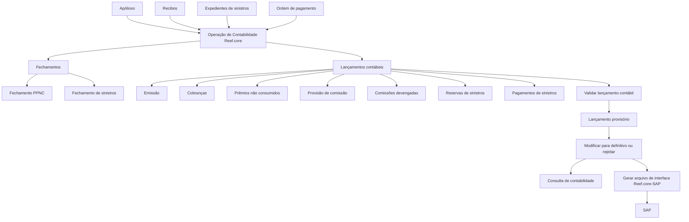
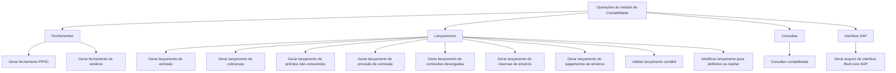

# Módulo de Contabilidade Reef.core — Conceitos, Operações, Definições e Integração SAP

## 1. Metadados do Documento
- **Arquivo de Origem:** `Não identificado`
- **Tipo de Documento:** Manual Operacional / Especificação Funcional
- **Domínio / Sistema:** Reef.core — Módulo de Contabilidade
- **Público-Alvo:** Desenvolvedores, Arquitetos, Operação e Negócio
- **Data/Versão Identificada:** Não identificada

---

## 2. Resumo Executivo & Contexto de Negócio

O documento descreve o módulo de Contabilidade do Reef.core, responsável por registrar operações contábeis por exercício. A contabilidade consolidada da companhia é realizada em SAP; portanto, o Reef.core gera movimentos contábeis básicos para disponibilizar ao SAP as informações necessárias.

O módulo estrutura a informação por exercício contábil, plano de contas, ramos contábeis e lançamentos contábeis. Um exercício possui data de abertura e data de fechamento e não precisa coincidir com o ano natural. Cada companhia define o respectivo plano de contas para cada exercício contábil.

Os lançamentos contábeis obedecem ao modelo de partidas dobradas, com registros no Deve e no Haber. O documento estabelece que despesas são refletidas no Deve e receitas são registradas no Haber. Os lançamentos podem ser originados por emissão e anulação de apólices, cobranças, comissões, sinistros, resseguro e provisões de prêmios não consumidos.

A operação contábil recebe informações provenientes de apólices, recibos, expedientes de sinistros e ordens de pagamento, gerando lançamentos contábeis. Os processos incluem fechamentos prévios, geração e validação de lançamentos, transformação de lançamentos provisórios em definitivos, consultas e geração de arquivo de interface Reef.core–SAP.

O módulo suporta contas multimoeda, estrutura piramidal de plano de contas com até cinco níveis e integração com SAP por meio de uma interface já desenvolvida. Todas as contas de receitas e despesas devem informar fonte de produção e ramo contábil.

---

## 3. Arquitetura, Componentes & Tecnologias Envolvidas

### Componentes e conceitos identificados

| Componente / Conceito | Descrição |
| :--- | :--- |
| Reef.core | Sistema que gera os movimentos contábeis básicos para a integração contábil. |
| Módulo de Contabilidade | Módulo do Reef.core que registra e consulta operações contábeis por exercício. |
| SAP | Sistema que realiza a contabilidade consolidada da companhia e recebe os movimentos contábeis do Reef.core. |
| Interface Reef.core–SAP | Interface que recupera dados dos lançamentos contábeis e cria arquivo de informação contábil para SAP. |
| Exercício contábil | Período em que são realizadas as operações contábeis. |
| Plano de contas | Relação de contas necessárias para registrar movimentos contábeis da companhia. |
| Ramo contábil | Chave associada à cobertura para relacioná-la à conta sobre a qual será feita a contabilização. |
| Lançamento contábil | Registro no livro contábil de uma receita ou despesa, realizado por partida dobrada. |
| Apólices | Entrada para a operação de contabilidade. |
| Recibos | Entrada para a operação de contabilidade. |
| Expedientes de sinistros | Entrada para a operação de contabilidade. |
| Ordem de pagamento | Entrada para a operação de contabilidade. |
| RE21 | Origem atual dos lançamentos de resseguro, conforme o documento. |



> *Nota de Análise: O documento cita a interface SAP, mas não detalha formato de arquivo, protocolos de transporte, frequência de execução, contratos de dados ou mecanismos de tratamento de falhas.*

---

## 4. Regras de Negócio, Especificações Funcionais & Processos

### Exercício contábil

- O exercício é o período de tempo em que se realizam operações contábeis.
- Todo exercício possui:
  - Data de abertura, que indica o início do exercício contábil.
  - Data de fechamento, que indica o fim do exercício contábil.
- O exercício não precisa coincidir obrigatoriamente com o ano natural.
- Toda a informação contábil é associada ao exercício que estiver aberto.
- Após cada fechamento de exercício, deve ser definido um novo exercício.

### Ramo contábil

- O ramo contábil é uma chave associada à cobertura.
- A chave relaciona a cobertura à conta sobre a qual a contabilização será realizada.
- A associação entre ramo contábil e cobertura ocorre durante a definição da cobertura no ramo.
- O ramo contábil de uma cobertura também pode ser determinado pelo valor de um atributo.
- O documento apresenta o tipo de veículo como exemplo de atributo utilizado para definir o ramo contábil em ramos de automóveis.

### Plano de contas

- O plano de contas é a relação das contas necessárias para registrar os movimentos contábeis de uma companhia.
- Cada companhia define o respectivo plano de contas por exercício contábil.
- O plano de contas pode possuir dois tipos de níveis:
  - **A:** níveis de agrupamento.
  - **D:** nível de detalhe.
- O nível **A** é utilizado para organizar e classificar as contas da companhia.
- A definição dos parâmetros das contas e a imputação da informação contábil são realizadas nas contas de nível **D**.
- A estrutura do plano de contas pode ter até cinco níveis.
- Atualmente, apenas o último nível é obrigatório.

### Parâmetros das contas

- **Moeda:** embora as contas sejam multimoeda, o parâmetro pode limitar uma conta a uma única moeda.
- **Nível 3 da estrutura comercial:** pode limitar a conta a uma estrutura comercial específica.
- **Terceiro:** indica que a conta deve estar associada a um terceiro; é utilizado em contas de despesas, como comissão de agentes.
- **Ramo contábil:** informa que os movimentos da conta são realizados por ramo contábil; é utilizado, por exemplo, em contas de receitas e despesas.
- **Canal de vendas:** informa que a conta deve incluir canal de venda ou fonte de produção.
- Todas as contas de receitas e despesas devem informar a fonte de produção e o ramo contábil.

### Lançamentos contábeis

- Um lançamento contábil é uma anotação no livro contábil para registrar receita ou despesa.
- Cada lançamento utiliza partida dobrada, registrando movimentos no Deve e no Haber.
- Uma despesa é refletida no Deve.
- Uma receita é registrada no Haber.
- Exemplo documentado:
  - Quando uma apólice é emitida, é gerado um prêmio considerado receita.
  - São gerados recibos para cobrar o prêmio.
  - Enquanto os recibos não forem cobrados, o prêmio gera um pendente.
  - Registro indicado: **Deve: Pendiente de pago; Haber: Prima emitida**.
- Nos fechamentos mensais, são extraídas informações para lançamentos contábeis que registram anotações nas contas definidas.

### Classes de lançamentos

| Classe de lançamento | Regra / origem da informação |
| :--- | :--- |
| Emissão e anulações | Gerados a partir de movimentos de apólices: emissão, suplementos de aumento ou redução de prêmio e anulações de apólices. |
| Cobrança | Contêm informação de prêmios cobrados e anulações de cobrança. |
| Comissão | Contêm comissões liquidadas a agentes e reservas de fundos para pagamento de comissões futuras. |
| Sinistros | Contêm sinistros ocorridos antes da data de fechamento, reservas de sinistros e pagamentos de indenizações, honorários e despesas. |
| Resseguro | Contêm informação de resseguro de operações de prêmio, pagamentos de sinistros, reserva de prêmio não consumido e reserva de sinistros. Atualmente realizados por RE21. |
| Provisão de prêmios não consumidos | Gerados a partir de apólices vigentes, usando prêmios não consumidos entre a data de fechamento e o fim da vigência da apólice. |

### Operações suportadas



---

## 5. Tabelas de Parâmetros, Ambientes e Estruturas de Dados

### Exemplos de exercício contábil

| Item / Parâmetro | Descrição / Função | Tipo / Valores / Formato | Ambiente / Observações |
| :--- | :--- | :--- | :--- |
| Exercício coincidente com ano natural | Exercício correspondente ao ano de 2023. | Abertura: 01/01/2023; Fechamento: 31/12/2023 | Identificador: 2023 |
| Exercício entre dois anos naturais | Exercício correspondente ao segundo semestre de 2023 e primeiro semestre de 2024. | Abertura: 01/07/2023; Fechamento: 30/06/2024 | Identificador: 2023-2024 |
| Primeiro exercício no ano natural | Exercício correspondente ao primeiro período do exemplo de 2023. | Abertura: 01/01/2023; Fechamento: 30/06/2023 | Identificador: 2023-1 |
| Segundo exercício no ano natural | Exercício correspondente ao segundo período do exemplo de 2023. | Abertura: 01/07/2023; Fechamento: 31/12/2023 | Identificador: 2023-2 |

### Exemplo de ramo contábil por cobertura

| Cobertura | Ramo contábil |
| :--- | :--- |
| Responsabilidade civil | 100000007 |
| Danos próprios | 100000003 |
| Roubo do veículo | 003030001 |

### Exemplo de ramo contábil por atributo de tipo de veículo

| Cobertura | Atributo: tipo de veículo | Ramo contábil |
| :--- | :--- | :--- |
| Danos próprios | Automóvel | 101401001 |
| Danos próprios | Motocicleta | 101401002 |
| Danos próprios | Caminhão | 101401003 |
| Responsabilidade civil | Automóvel | 101401001 |
| Responsabilidade civil | Motocicleta | 101401002 |

### Exemplo de plano de contas por nível

| Nível | Conta | Descrição da conta |
| :---: | :--- | :--- |
| A | 102 | Investimentos financeiros |
| A | 102101 | Investimentos a custo amortizado |
| A | 10210101 | Valores representativos de dívida |
| A | 102101011 | Emitidos por instituições estatais |
| D | 1021010111 | Investimentos Banco Central |
| D | 1021010199 | Investimentos outras entidades estatais |
| A | 102101012 | Emitidos por outras instituições |
| D | 1021010121 | Investimentos Citibank |
| D | 1021010122 | Investimentos BBVA |
| D | 1021010123 | Investimentos FMI |

### Parâmetros de conta

| Item / Parâmetro | Descrição / Função | Tipo / Valores / Formato | Ambiente / Observações |
| :--- | :--- | :--- | :--- |
| Moeda | Limita uma conta a uma moeda específica, embora as contas sejam multimoeda. | Moeda definida no sistema | Exemplo: contas de investimento em moeda específica. |
| Nível 3 da estrutura comercial | Limita a conta a uma estrutura comercial específica. | Estrutura comercial | Exemplo: conta manejada apenas pela oficina central. |
| Terceiro | Exige associação da conta a um terceiro. | Indicador de associação | Utilizado em contas de despesas, como comissões de agentes. |
| Ramo contábil | Determina que movimentos da conta são registrados por ramo contábil. | Indicador de ramo contábil | Utilizado em contas de receitas e despesas. |
| Canal de vendas | Exige canal de venda ou fonte de produção na informação da conta. | Canal de venda / fonte de produção | Necessário para identificar, por exemplo, vendas por internet ou canal direto. |

### Operações do módulo

| Grupo | Operação | Descrição / Função |
| :--- | :--- | :--- |
| Fechamentos | Gerar fechamento do processo de provisão de prêmio não consumido (PPNC) | Calcula reservas de riscos em curso antes da execução do lançamento. |
| Fechamentos | Gerar fechamento do processo de sinistros | Calcula reservas de sinistros antes da execução do lançamento. |
| Lançamentos | Gerar lançamento de emissão | Registra mensalmente movimentos de apólices de novas emissões e suplementos. |
| Lançamentos | Gerar lançamento de cobranças | Registra prêmios cobrados e anulações de cobrança no mês. |
| Lançamentos | Gerar lançamento de prêmios não consumidos | Registra contabilmente a reserva de riscos em curso. |
| Lançamentos | Gerar lançamento de provisão de comissão | Gera lançamento referente a comissões pendentes de liquidação. |
| Lançamentos | Gerar lançamento de comissões devengadas | Registra as comissões pagas aos agentes. |
| Lançamentos | Gerar lançamento de reservas de sinistros | Registra provisões de sinistros pelo importe bruto das reservas no fechamento mensal. |
| Lançamentos | Gerar lançamento de pagamentos de sinistros | Registra pagamentos por indenizações, honorários e despesas realizados no mês. |
| Lançamentos | Validar lançamento contábil | Valida se lançamentos estão quadrados e se todos os dados estão corretos para criação como provisórios. |
| Lançamentos | Modificar lançamento para definitivo | Converte lançamentos provisórios em definitivos ou os rejeita. |
| Consultas | Consultar contabilidade | Exibe informações dos apontamentos contábeis segundo critérios distintos. |
| Interface SAP | Gerar arquivo de interface Reef.core-SAP | Recupera informações dos lançamentos e cria arquivo contábil para SAP. |

---

## 6. Bateria de Perguntas & Respostas para RAG (FAQ Sintético)

### P1: Qual é a finalidade do módulo de Contabilidade do Reef.core?
**R:** O módulo de Contabilidade do Reef.core registra operações contábeis por exercício e gera os movimentos contábeis básicos necessários para que o SAP realize a contabilidade consolidada da companhia.

### P2: O exercício contábil precisa coincidir com o ano natural?
**R:** Não. O documento informa que o exercício contábil possui data de abertura e data de fechamento, mas não precisa coincidir obrigatoriamente com o ano natural.

### P3: O que ocorre após o fechamento de um exercício contábil?
**R:** Após cada fechamento de exercício, deve ser definido um novo exercício contábil para que novas operações possam ser associadas a um exercício aberto.

### P4: O que é ramo contábil no Reef.core?
**R:** Ramo contábil é uma chave associada à cobertura que a relaciona à conta sobre a qual será realizada a contabilização. A associação pode ocorrer na definição da cobertura no ramo ou ser determinada pelo valor de um atributo, como tipo de veículo.

### P5: Quais são os níveis do plano de contas?
**R:** O documento identifica o nível A como nível de agrupamento e o nível D como nível de detalhe. O nível A organiza e classifica as contas; os parâmetros das contas e a imputação contábil são definidos no nível D.

### P6: Quais informações são obrigatórias para contas de receitas e despesas?
**R:** Todas as contas de receitas e despesas devem informar a fonte de produção e o ramo contábil.

### P7: Como funcionam os lançamentos contábeis por partida dobrada?
**R:** Cada lançamento registra movimentos no Deve e no Haber. Quando se trata de despesa, o valor é refletido no Deve; quando é receita, o valor é registrado no Haber.

### P8: Quais entradas alimentam a operação de contabilidade?
**R:** A operação de contabilidade recebe informações de apólices, recibos, expedientes de sinistros e ordens de pagamento, gerando lançamentos contábeis.

### P9: Quais operações são executadas antes dos lançamentos contábeis?
**R:** Os fechamentos executam cálculos prévios: o fechamento de provisão de prêmio não consumido calcula reservas de riscos em curso, e o fechamento de sinistros calcula reservas de sinistros antes da execução dos respectivos lançamentos.

### P10: O que validação de lançamento contábil verifica?
**R:** A validação verifica se os lançamentos contábeis estão quadrados e se todos os dados estão corretos para criá-los como provisórios.

### P11: Como um lançamento provisório se torna definitivo?
**R:** A operação “Modificar lançamento a definitivo” permite transformar lançamentos provisórios em definitivos ou rejeitá-los.

### P12: Como o Reef.core integra informações contábeis com SAP?
**R:** A operação “Gerar arquivo de interface Reef.core-SAP” recupera informações dos lançamentos contábeis e cria um arquivo com informações contábeis para SAP. O documento também informa que existe uma interface já desenvolvida para os traspasses.

---

## 7. Glossário de Termos, Siglas & Conceitos-Chave

- **Reef.core:** Sistema no qual são gerados os movimentos contábeis básicos para a integração com SAP.
- **SAP:** Sistema que realiza a contabilidade consolidada da companhia.
- **PPNC:** Provisão de Prêmio Não Consumido; processo de fechamento que calcula reservas de riscos em curso antes do lançamento.
- **Exercício contábil:** Período de tempo em que são realizadas operações contábeis.
- **Plano de contas:** Relação de contas necessárias para registrar movimentos contábeis de uma companhia.
- **Nível A:** Nível de agrupamento de contas no plano de contas.
- **Nível D:** Nível de detalhe no plano de contas, no qual são definidos parâmetros e imputações contábeis.
- **Ramo contábil:** Chave que relaciona cobertura e conta contábil.
- **Partida dobrada:** Modelo de registro contábil com movimentos no Deve e no Haber.
- **Deve:** Lado do lançamento em que a despesa é refletida, segundo o documento.
- **Haber:** Lado do lançamento em que a receita é registrada, segundo o documento.
- **Fonte de produção:** Informação que identifica a origem de produção ou canal de venda.
- **RE21:** Origem atual dos lançamentos de resseguro, conforme indicado pelo documento.

---

## 8. Notas Críticas, Riscos & Limitações

- O documento informa que os lançamentos de resseguro são atualmente realizados por **RE21**, mas não descreve integração, responsabilidades operacionais ou migração dessa dependência.
- A interface Reef.core–SAP é citada como já desenvolvida, mas o documento não especifica layout, periodicidade, transporte, validações, reprocessamento ou tratamento de erros.
- Não há detalhamento sobre permissões, perfis de acesso, trilha de auditoria, retenção de arquivos ou mecanismos de conciliação com SAP.
- O documento não apresenta métodos HTTP, contratos JSON, rotas técnicas, servidores, URLs, credenciais, versões de software ou portas de comunicação.
- Não são detalhadas regras de cálculo para reserva de riscos em curso, reservas de sinistros, provisão de comissões ou prêmios não consumidos.
- A obrigatoriedade atual de apenas o último nível do plano de contas é citada, mas não são explicitadas regras de validação para níveis intermediários.

---

## 9. Conteúdo Bruto Estruturado (Referência Fiel)

```text
--- [PÁGINA 1 DE 7] ---

INTRODUCCIÓN - Módulo Contabilidad
Objetivo
Este módulo permite registrar y anotar operaciones contables por períodos.
Actualmente la contabilidad consolidada de la compañía se realiza en SAP, por tanto, en Reef.core se generan los movimientos contables
básicos para poder obtener la información que necesita SAP.
En este documento se abordarán los siguientes puntos:
Conceptos principales
Características
Entradas y salidas
Definiciones
Operaciones soportadas
Conceptos principales
Ejercicio
Ramo contable
Plan de cuentas
Asientos
Ejercicio
El período de tiempo en el que se realizan las operaciones contables, se denomina ejercicio.
El período que comprende cada ejercicio se identifica con una fecha de apertura, que indica la fecha en la que inicia el ejercicio contable, y
una fecha de cierre que indica la fecha en la que finaliza el ejercicio contable.
Este período no tiene que coincidir obligatoriamente con el año natural.
Ejemplo:
• El ejercicio coincide con el año natural
Para el ejemplo suponemos que el año natural es 2023.
Documentation / DOCUMENTACIÓN Reef
DOCUMENTACIÓN Reef
Mapfredocument
DOCUMENTACIÓN Reef
Owner
user:agonzalez_mapfre.com
Lifecycle
Approved Source
 / 
 VL
Buscar Inicio Soluciones Arquitecturas APIs Componentes Cloud Documentación Zeus Reef Ayuda
ES

--- [PÁGINA 2 DE 7] ---

2023
Fecha apertura:
01/01/2023
Fecha cierre:
31/12/2023
• El ejercicio está entre dos años naturales
Para el ejemplo suponemos que el período contempla el segundo semestre del año 2023 y el primer semestre del año 2024.
2023-2024
Fecha apertura:
01/07/2023
Fecha cierre:
30/06/2024
• Si hay más de un ejercicio en el mismo año natural
Para el ejemplo suponemos que el año natural es 2023 y que existen dos ejercicios, uno que comprende el primer trimestre y el segundo que
comprende el segundo trimestre.
1. Primer ejercicio
2023-1
Fecha apertura:
01/01/2023
Fecha cierre:
30/06/2023
1. Segundo ejercicio
2023-2
Fecha apertura:
01/07/2023
Fecha cierre:
31/12/2023
Ramo contable
Se trata de una clave, asociada a la cobertura, que la relaciona con la cuenta sobre la que se va a realizar su contabilización. La asociación
del ramo contable con la cobertura se realiza en el momento de la definición de la cobertura en el ramo.
Ejemplo ramo contable por cobertura:
COBERTURA RAMO
CONTABLE
Responsabilidad civil 100000007
Daños propios 100000003
Robo del vehículo 003030001
Además, se permite determinar el ramo contable de una cobertura por el valor de algún atributo, por ejemplo, en ramos de autos, se puede
asociar a un atributo que identifique si el tipo de vehículo asegurado es un automóvil, una motocicleta, un camión, etc.
Ejemplo ramo contable por atributo:
| COBERTURA | ATRIBUTO TIPO
DE VEHÍCULO | RAMO
CONTABLE | | :--- | :--- | :---: | | Daños Propios | Automóvil | 101401001 | | Daños Propios | Motocicleta | 101401002 | | Daños Propios | Camión |
101401003 | | Responsabilidad civil | Automóvil | 101401001 | | Responsabilidad civil | Motocicleta | 101401002 |

--- [PÁGINA 3 DE 7] ---

Plan de cuentas
Es la relación de las cuentas que son necesarias para registrar los movimientos contables de una compañía.
Cada compañía define su plan de cuentas por ejercicio contable, pudiendo definir 2 tipos de niveles:
A: Niveles de agrupación
D: Nivel de detalle
El nivel A se utiliza para organizar y clasificar las cuentas de la compañía.
La definición de los parámetros de las cuentas, así como la imputación de la información contable se realizan sobre las cuentas de nivel D.
Ejemplo definición de cuentas por nivel:
| NIVEL | CUENTA | DESCRIPCIÓN CUENTA | | :---: | :--- | :--- | | A | 102 | Inversiones financieras | | A | 102101 | Inversiones a costo amortizado | |
A | 10210101 | Valores representativos de deuda | | A | 102101011 | Emitidos por instituciones estatales | | D | 1021010111 | Inversiones
Banco Central | | D | 1021010199 | Inversiones otras entidades estatales | | A | 102101012 | Emitidos por otras instituciones | | D |
1021010121 | Inversiones Citibank | | D | 1021010122 | Inversiones BBVA | | D | 1021010123 | Inversiones FMI |
Principales parámetros de las cuentas:
Moneda
Aunque las cuentas son multimoneda, por medio de este parámetro se puede limitar la cuenta a una sola moneda. Por ejemplo, para
cuentas de inversión en una moneda específica.
Nivel 3 de la estructura comercial
Se puede limitar la cuenta a una estructura comercial específica. Por ejemplo, para cuentas contables que solo pueden ser manejadas
desde la oficina central.
Tercero
Mediante este parámetro se indica que la cuenta tiene que estar asociada a un tercero. Se utiliza en cuentas de gastos, como puede ser
la cuenta de comisiones de los agentes.
Ramo contable
Indica que los movimientos de la cuenta van por ramo contable. Se utiliza en cuentas de ingresos y gatos, por ejemplo, cuentas para
analizar los ingresos por determinado tipo de cobertura.
Canal de ventas
Indica que la información de la cuenta debe incluir el canal de venta o fuente de producción. De esta forma se pueden identificar por
ejemplo las ventas por internet o por canal directo, etc.
Todas las cuentas de ingresos y gastos deben llevar informados la fuente de producción y el ramo contable.
Asientos
Es la anotación que se realiza en el libro de contabilidad para registrar un ingreso o un gasto. Cada asiento contable realiza un apunte por
partida doble, registrando los movimientos en el Debe y el Haber.
Cuando se trata de un gasto se refleja en el Debe
Cuando es un ingreso se registra en el Haber
Por ejemplo, cuando se emite una póliza se genera la prima, que se considera un ingreso, y los recibos para cobrar dicha prima, mientras los
recibos de la póliza no se cobren, esta prima genera un pendiente. El registro de este movimiento en la contabilidad quedaría de la siguiente
forma:
DEBE HABER
Pendiente de pago Prima emitida
En los cierres mensuales, se extrae la información para los asientos contables, que realizan las anotaciones en las cuentas definidas para
cada uno de ellos.

--- [PÁGINA 4 DE 7] ---

Los asientos contables se clasifican en función del origen de la información que contienen.
Clases de asiento:
Asientos de emisión y anulaciones
Se generan a partir de los movimientos de pólizas, tanto de emisión, como suplementos de aumento o disminución de prima y de
anulaciones de pólizas.
Asientos de cobro
Contiene la información de las primas cobradas y anulados de cobro.
Asientos de comisión
Son asientos que contienen las comisiones liquidadas a los agentes y asientos que contienen la reserva de fondos para el pago de
comisiones futuras (provisión de comisiones).
Asientos de siniestros
Son asientos que contienen la información de los siniestros ocurridos antes de la fecha de cierre (reservas de siniestros) y también,
asientos que contienen los pagos realizados por indemnizaciones, honorarios y gastos.
Asientos de reaseguro
Estos asientos contienen la información correspondiente al reaseguro de los movimientos de operaciones de prima, de pagos de
siniestros, así como de reserva de prima no consumida y reserva de siniestros. Actualmente estos asientos se realizan por RE21.
Asientos de provisión de primas no consumidas
Se genera a partir de pólizas vigentes, tomando la información de las primas no consumidas desde la fecha de cierre al final de la
vigencia de la póliza.
Características
Información por ejercicio
Plan de cuentas piramidal
Cuentas multimoneda
Integración con SAP
Información por ejercicio
Toda la información contable va asociada al ejercicio que esté abierto.
Plan de cuentas piramidal
Cada compañía se define la estructura de su plan de cuentas, pudiendo tener hasta 5 niveles, aunque actualmente solo es obligatorio el
último nivel.
Cuentas multimoneda
Las cuentas permiten movimientos en cualquier moneda, siempre que esté definida en el sistema.
Todos los apuntes en moneda extranjera llevan su correspondiente importe en moneda del país.
Integración con SAP
Todos los movimientos contables del sistema se traspasan a SAP. Existe una interfaz, ya desarrollada, para estos traspasos.
Entradas/Salidas

--- [PÁGINA 5 DE 7] ---

Pólizas
Recibos
Expedientes de siniestros
Orden Pago
OPERACIÓN
DE
CONTABILIDAD
Asientos contables
Definiciones
Para poder trabajar con el módulo de contabilidad es necesario que previamente se realicen definiciones de los distintos elementos.
Estas definiciones están englobadas en los siguientes niveles:
NIVELES DE DEFINICIÓN
COMÚN CONTABILIDAD
COMÚN
En este nivel se encuentran definiciones que no pertenecen exclusivamente al módulo de contabilidad, pero
son necesarias para poder realizar la definición de dicho módulo
COMPAÑÍA
Definición de la entidad o entidades con
las que se van a crear las pólizas y por
consiguiente el resto de elementos
MONEDA
Definición de las divisas con las que
Reef.core va a realizar las distintas
operaciones de la compañía
ESTRUCTURA COMERCIAL
Definición de como se va a establecer la
organización territorial de la compañía
ESTRUCTURA PRODUCTO
Definición de como estarán organizados
los ramos que se comercializan
IMPUESTO
Definir los tipos de obligaciones tributarias
que se deben tener en cuenta, así como
sus características y formas de cálculo
CONTABILIDAD
Definiciones específicas del módulo de Contabilidad
EJERCICIO CONTABLE
Se define el periodo de tiempo en el que
se realizarán las operaciones contables.
Después de cada cierre de ejercicio se
debe definir el nuevo ejercicio
PLAN DE CUENTAS
Definición de las cuentas utilizadas por la
compañía dentro del ejercicio contable y
los parámetros correspondientes a cada
cuenta
CONCEPTO CONTABLE
Se define el identificador que agrupa los
apuntes contables para su posterior
consulta
ASIENTO CONTABLE
 INTERFAZ SAP

--- [PÁGINA 6 DE 7] ---

Definición de los tipos y características de
los asientos contables con los que
trabajará la compañía
Definición de la información que se llevará
a SAP así como la relación de los datos de
ambos sistemas
Operaciones soportadas
El módulo de contabilidad dispone de las siguientes operaciones que se muestran agrupadas según el criterio de la siguiente figura.
AGRUPACIÓN DE OPERACIONES
CIERRES ASIENTOS CONSULTAS INTERFAZ SAP
CIERRES
Operaciones que realizan cálculos previos a los asientos contables
GENERAR Cierre proceso provisión prima no consumida (PPNC)
Realiza el cálculo de las reservas de riesgos en curso previo a la
ejecución del asiento
GENERAR Cierre proceso siniestros
Realiza el cálculo de las reservas de siniestros previo a la
ejecución del asiento
ASIENTOS
Operaciones enfocadas a registrar en la contabilidad las entradas y salidas de los distintos movimientos
económicos
GENERAR Asiento de emisión
Realiza la anotación contable mensual de
movimientos de póliza correspondientes a
nuevas emisiones y suplementos
GENERAR Asiento de cobros
Realiza la anotación contable por el
importe de primas cobradas y anulados de
cobro en el mes
GENERAR Asiento de primas no
consumidas
Corresponde a la anotación contable de la
reserva de riesgos en curso
GENERAR Asiento de provisión de
comisión
Genera la anotación contable
correspondiente a las comisiones
pendientes de liquidar
GENERAR Asiento de comisiones
devengadas
Corresponde a la anotación contable de
las comisiones pagadas a los agentes
GENERAR Asiento de reservas de
siniestros
Realiza la anotación contable
correspondiente a provisiones de
siniestros por el importe bruto de las
reservas al cierre de mes
GENERAR Asiento de pagos de siniestros
Corresponde a la anotación contable de
pagos de siniestros realizados por
indemnizaciones, honorarios y gastos en
el mes.
VALIDAR Asiento contable
Proceso que valida que los asientos
contables están cuadrados y todos los
datos son correctos para crearlos como
provisionales
MODIFICAR Asiento a definitivo
Esta operación permite pasar los asientos
provisionales a definitivos o bien
rechazarlos
CONSULTAS

--- [PÁGINA 7 DE 7] ---

Operaciones por las que se puede ver la información registrada
CONSULTAR Contabilidad
Muestra la información de los apuntes contables por distintos criterios
INTERFAZ SAP
Operaciones que generan información para integrar con SAP
GENERAR Archivo interfaz Reef.core-SAP
Recupera información de los asientos y crea archivo con información contable para SAP
Checking links...
```
