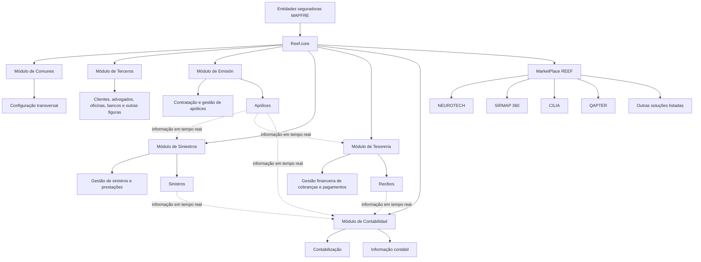
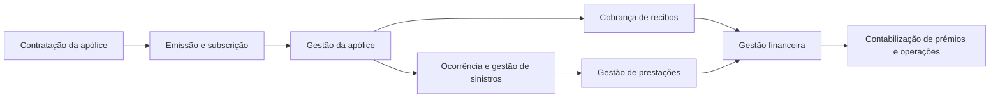

# Reef.core — Capacidades, Modularidade, Flexibilidade e Integrações do MarketPlace REEF

## 1. Metadados do Documento
- **Arquivo de Origem:** Não identificado no conteúdo extraído
- **Tipo de Documento:** Apresentação Executiva
- **Domínio / Sistema:** Reef.core / Plataforma REEF / Gestão de Seguros MAPFRE
- **Público-Alvo:** Arquitetos, Desenvolvedores, Operação, Negócio e entidades seguradoras MAPFRE
- **Data/Versão Identificada:** Outubro de 2023, para a relação de integrações MarketPlace REEF; demais versão não identificada

---

## 2. Resumo Executivo & Contexto de Negócio

Reef.core é apresentado como uma solução integral de gestão de seguros destinada a permitir que entidades MAPFRE administrem o ciclo de vida completo de suas apólices. A solução é descrita como uma evolução histórica de produtos anteriores, incluindo Tronador, Tron2000, TronWeb, WebTronWeb, TRON21 e NewTron, culminando na nomenclatura e evolução SaaS denominada Reef.core em 2022.

A plataforma cobre processos essenciais de uma entidade seguradora, incluindo emissão e subscrição de apólices, cobrança de recibos, gestão de sinistros, gestão financeira de cobranças e pagamentos e contabilização. Reef.core é concebido como uma solução modular, mas completamente integrada, pois os módulos compartilham em tempo real informações relativas a apólices, sinistros e recibos.

A solução atende cenários corporativos distribuídos internacionalmente, com presença histórica em países da América Latina, Espanha, Portugal, Estados Unidos e Filipinas. O documento ressalta que Filipinas deixou de utilizar o sistema por estar fora do perímetro do Grupo MAPFRE.

Reef.core oferece capacidades de configuração parametrizada para adaptar processos, produtos, regras de negócio, elementos de interface e comportamentos operacionais às necessidades locais de cada entidade. Quando a funcionalidade padrão não cobre integralmente necessidades locais, o documento informa que as entidades podem configurar processos e produtos ou personalizar o código-fonte, embora exista uma intenção de modificar tecnicamente esse comportamento com a introdução da Plataforma REEF.

O ecossistema é ampliado por integrações com soluções oferecidas no MarketPlace REEF. Essas integrações abrangem subscrição, precificação, sinistros, inspeção automotiva, gestão documental, assinatura eletrônica, comunicação com clientes, busca semântica, identificação biométrica, planejamento financeiro e digitalização de despesas.

---

## 3. Arquitetura, Componentes & Tecnologias Envolvidas

Reef.core é uma plataforma de seguros modular e integrada. A configuração transversal é concentrada no módulo de Comunes, enquanto as capacidades de negócio são organizadas em módulos especializados para terceiros, emissão, sinistros, tesouraria e contabilidade.

O documento não detalha tecnologias de implementação, protocolos de comunicação, APIs, métodos HTTP, contratos JSON, bancos de dados, infraestrutura, portas de rede ou URLs de ambientes. Também não detalha a arquitetura técnica interna das integrações do MarketPlace REEF.



### Componentes e capacidades identificadas

| Componente / Sistema | Função sustentada pelo documento | Observações |
| :--- | :--- | :--- |
| Reef.core | Solução integral para gestão do ciclo de vida de apólices de seguros. | Evolução SaaS identificada em 2022. |
| Módulo de Comunes | Realiza configuração transversal aplicável a todos os módulos. | Centraliza parâmetros e configurações transversais. |
| Módulo de Terceros | Configura e gerencia clientes e outras figuras, como advogados, oficinas e bancos. | Suporta identificação e gestão centralizada de clientes. |
| Módulo de Emisión | Realiza contratação e gestão de apólices. | Relacionado à emissão, subscrição, suplementos e cotizações. |
| Módulo de Siniestros | Realiza gestão de sinistros e prestações. | Inclui processos associados a sinistros. |
| Módulo de Tesorería | Realiza gestão financeira de cobranças e pagamentos. | Não são detalhados fluxos financeiros ou interfaces externas. |
| Módulo de Contabilidad | Realiza contabilização. | Compartilha informações em tempo real com os demais módulos. |
| Plataforma REEF | Plataforma que oferece soluções complementares ao núcleo Reef.core. | As soluções podem ser consumidas por sistemas locais ou diretamente na plataforma. |
| MarketPlace REEF | Catálogo de soluções para extensão e complementação funcional do núcleo. | Relação apresentada como válida em outubro de 2023. |
| Microsserviço RTE | Tarifica prêmios das coberturas contratadas em objetos segurados e expõe simulador de cálculo de prêmio. | O documento não detalha métodos HTTP, contratos ou implantação. |

> **Nota de Análise:** O documento menciona o microsserviço RTE, mas não detalha endpoints, métodos HTTP, autenticação, contratos JSON, persistência ou estratégia de integração com Reef.core.

---

## 4. Regras de Negócio, Especificações Funcionais & Processos

### 4.1 Ciclo de vida de apólices suportado

Reef.core contempla o ciclo de vida de uma apólice de ponta a ponta, desde a contratação até a contabilização de prêmios e a gestão de sinistros. O documento menciona explicitamente as seguintes capacidades:

1. Emitir e subscrever apólices.
2. Cobrar recibos.
3. Gerenciar sinistros.
4. Gerenciar prestações associadas a sinistros.
5. Gerenciar cobranças e pagamentos.
6. Contabilizar prêmios e operações relacionadas.
7. Configurar produtos e processos de seguros.
8. Configurar regras de negócio e cálculo de prêmios.
9. Configurar tarefas dos processos de gestão de sinistros e prestações.



### 4.2 Capacidades corporativas

- Reef.core é uma solução implementada por e para MAPFRE.
- A evolução funcional aproveita conhecimento e experiência acumulados por países que utilizam a solução.
- A solução é apresentada como testada e consolidada geográfica e temporalmente.
- A solução é escalável para atender necessidades empresariais de países distintos, incluindo Espanha, Brasil e países da América Central.

### 4.3 Capacidades operacionais

- A solução é descrita como fácil de utilizar.
- A solução busca utilizar adequadamente os recursos empregados.
- A solução é descrita como possuidora de alto grau de confiabilidade.
- Reef.core é multiempresa, permitindo configurar mais de uma entidade seguradora na mesma plataforma.
- Reef.core é multipaís.
- Reef.core é multimoeda e suporta subscrição e gestão de apólices em US dólares, euros, francos suíços e outras moedas conforme configuração.
- Reef.core é multilíngue e possui, de caixa, literais para espanhol e inglês.
- A apresentação de informações nas telas é determinada pelos acessos e papéis atribuídos aos usuários da aplicação.

### 4.4 Capacidades orientadas a produtos

- Reef.core é centrado em produtos de seguros, tais como seguros de saúde, automóveis, residência e comércios.
- A solução permite definir e configurar produtos e processos.
- A configuração pode conter regras de negócio, cálculo de prêmios e tarefas do processo de gestão de sinistros e prestações.
- A solução suporta múltiplas linhas de negócio:
  - Produtos Vida.
  - Produtos Não Vida.
  - Produtos Individuais.
  - Produtos Coletivos.
- A solução contempla produtos pré-configurados para utilização por países.

### 4.5 Capacidades orientadas a clientes

- Reef.core permite identificação única e gestão centralizada de clientes.
- A solução classifica pessoas físicas e jurídicas de acordo com atividades atribuídas, incluindo agentes, segurados, fornecedores e advogados.
- A solução suporta comercialização omnicanal de apólices:
  - Contratação telefônica.
  - Contratação via Web.
  - Contratação por agente de seguros.
  - Contratação em plataforma de bancasseguros.
- A evolução da solução inclui funcionalidade reforçada para tratamento de coletivos.
- A evolução da solução inclui identificação e gestão de terceiros como fornecedores.
- Reef.core suporta contabilização, gestão e acompanhamento de Incidências, Queixas, Reclamações e Felicitações de clientes, também denominadas I.Q.R.F.

### 4.6 Regras e exemplos de configuração parametrizada

Os parâmetros configuráveis são valores definidos manualmente que alteram o comportamento do sistema. Esses parâmetros permitem controlar módulos, processos, funcionalidades e interface da solução.

| Regra / Parâmetro | Comportamento ou finalidade |
| :--- | :--- |
| Número de decimais | Define a quantidade de casas decimais utilizada no cálculo dos prêmios de apólices. |
| Tipo de moeda | Define se uma moeda é uma divisa real ou uma Unidade de Valor Financeiro, como UDI no México ou Unidade de Fomento no Chile. |
| Contas e cartões de terceiros | Define se a instalação permite capturar múltiplas contas correntes, cartões de crédito ou cartões de débito para um terceiro. |
| Formato de hora na emissão | Define se a data de efeito padrão em emissão de apólices ou suplementos apresenta 24:00 ou 12:00 horas. |
| Lista de valores para tratamento de pessoas físicas | Permite identificar tratamentos como Ilmo., Excelentísimo, Señor, Don e Doña. |
| Motivo de alteração de valoração de sinistro | Define se é solicitado o motivo de uma mudança na valoração do sinistro. |
| Restrição de emissão para automóveis | Pode restringir temporariamente a emissão de apólice de automóvel quando a marca do veículo for FERRARI ou ASTON MARTIN. |
| Restrição de idade em seguro de saúde | Pode impedir o seguro de pessoas menores de 18 anos. |
| Identificação de clientes | Permite configurar como os clientes são identificados no sistema. |
| Classificação de produtos | Permite configurar como produtos são classificados. |
| Numeração de sinistros | Permite configurar como os sinistros são numerados. |

### 4.7 Adaptação local

Para operar localmente o sistema, as entidades devem:

1. Configurar diretamente os processos e produtos conforme necessidades operacionais locais.
2. Configurar e personalizar o código-fonte quando a funcionalidade de caixa não cobrir, ou cobrir apenas parcialmente, as necessidades locais.

> **Nota de Análise:** O documento informa que, com a introdução da Plataforma REEF, existe uma intenção de modificar tecnicamente o comportamento de personalização de código-fonte a médio prazo. Não são detalhados o modelo futuro, cronograma, mecanismos de extensão ou critérios de migração.

---

## 5. Tabelas de Parâmetros, Ambientes e Estruturas de Dados

### 5.1 Evolução de versões

| Ano | Denominação | Aplicação / Evolução |
| :--- | :--- | :--- |
| 1989 | Tronador | Adaptação do sistema de procedência argentina. |
| 1993 | Tron2000 | Reengenharia, redesenho e evolução funcional. |
| 2002 | TronWeb | Frontal Java. |
| 2007 | TRON21 | Adaptação de back-end para MAPFRE Espanha. |
| 2009/2010 | WebTronWeb | Html. |
| 2017 | NewTron | Reengenharia, redesenho e evolução funcional. |
| 2022 | Reef.core | Nomenclatura e evolução SaaS. |

### 5.2 Presença internacional informada

| Período | Países / Contexto |
| :--- | :--- |
| Até 1990 | Argentina |
| 1990–2000 | Espanha, incluindo Mutral–Reale Mutua; México; Peru; Espanha, incluindo Mutua Valenciana de Taxis; Chile; Porto Rico; Venezuela; Portugal; Colômbia |
| 2000–2010 | Paraguai; República Dominicana; Estados Unidos; Espanha, incluindo MAPFRE Tron21 |
| 2010–2020 | Costa Rica; Uruguai; Nicarágua; Guatemala; Filipinas; Honduras; El Salvador |
| 2020–Atual | Panamá |
| Observação | Filipinas não utiliza mais o sistema por estar fora do perímetro do Grupo MAPFRE. |

### 5.3 Módulos Reef.core

| Item / Parâmetro | Descrição / Função | Tipo / Valores / Formato | Ambiente / Observações |
| :--- | :--- | :--- | :--- |
| Comunes | Configuração transversal para todos os módulos. | Módulo funcional. | Atua transversalmente. |
| Terceros | Configuração e gestão de clientes, advogados, oficinas, bancos e outras figuras. | Módulo funcional. | Inclui pessoas físicas e jurídicas. |
| Emisión | Contratação e gestão de apólices. | Módulo funcional. | Inclui emissão e gestão de apólices. |
| Siniestros | Gestão de sinistros e prestações. | Módulo funcional. | Inclui tarefas dos processos de sinistros. |
| Tesorería | Gestão financeira de cobranças e pagamentos. | Módulo funcional. | Não são detalhadas integrações financeiras. |
| Contabilidad | Realização da contabilização. | Módulo funcional. | Compartilha informação em tempo real. |

### 5.4 Integrações MarketPlace REEF

| Solução | Descrição / Função | Tipo / Valores / Formato | Ambiente / Observações |
| :--- | :--- | :--- | :--- |
| NEUROTECH | Motor de subscrição centralizado com regras personalizáveis e fontes fornecidas por MAPFRE. | Solução de subscrição. | Não são detalhadas fontes, regras ou interfaces. |
| SIRMAP 360 | Ferramenta para sistemática comercial padronizada de venda consultiva para o segmento PYME. | Solução comercial. | Focada na rede agencial e empresas. |
| CILIA | Sistema auxiliar de orçamentação de reparações automotivas com IA para identificação de danos. | Solução de sinistros automotivos. | Não detalha modelo de IA ou integração. |
| QAPTER | Conjunto modular global para indústria automotiva, alimentado por IA, que detecta dano em imagens e retorna custo ótimo de reparação. | Solução de sinistros automotivos. | Baseada em imagem enviada. |
| DOCUMENTUM | Plataforma para armazenamento e conservação de documentação digital. | Gestão documental. | Não detalha repositórios ou retenção. |
| AUTOINSPECCIÓN MAPFRE | Aplicação móvel para autogestão de inspeções de veículo por clientes, intermediários e peritos. | Aplicação móvel. | Ambiente 100% digital. |
| OFICINA DIGITAL MAPFRE (ODM) | Solução para comercialização de produtos e operação de seguros. | Solução comercial e operacional. | Sem detalhamento adicional. |
| MINDBREEZE | Motor de análise de informação para busca moderna e intuitiva; realiza processamento e análise semântica automatizada de documentos. | Busca e análise semântica. | Denominado Mindbreeze InSpire. |
| ONEINC | ClaimsPay® permite desembolso digital de pagamentos de sinistros por qualquer método e de qualquer lugar. | Pagamento digital de sinistros. | Busca aumentar retenção, reduzir custos e risco. |
| MARLEY | Plataforma inteligente de mensagens de texto bidirecionais para seguros. | Comunicação. | Denominada Hi Marley. |
| MAPFRE RED EN LA RED | Ferramenta para gerar páginas web otimizadas para escritórios, agentes, oficinas e centros médicos. | Presença digital e SEO. | Busca unificar a imagem de marca MAPFRE. |
| CONTROL EXPERT (PolicyCheck) | Aplica IA para detectar dano ou não dano em tempo real em imagens de automóveis durante contratação de apólice. | IA para contratação. | Não são detalhados critérios ou precisão. |
| Prestadores de firma eletrônica | Prestadores LOGALTY, EVICERTIA, DOCUSIGN e SIA para assinatura e comunicações de documentos eletrônicos. | Assinatura eletrônica. | O documento indica necessidade de prestador de assinatura. |
| SMART INDEXING | Ferramenta de captura inteligente de documentos para identificar tipologias e extrair e validar conteúdo. | Captura documental. | Sem detalhamento adicional. |
| MAPFRE PLANIFICADOR FINANCIERO | Ferramenta comercial que analisa bem-estar financeiro familiar e propõe soluções de proteção, educação, poupança e aposentadoria. | Planejamento financeiro. | Denominada Planificador Financiero de Vida MAPFRE. |
| DUP | Ferramenta de subscrição e preço rentável e dinâmico; calcula rentabilidade antes de retornar um preço. | Underwriting e pricing. | Sigla: Dynamic Underwriting & Pricing. |
| ORION G2 | Sistema integral online para valoração e gestão de danos materiais de veículos. | Gestão de sinistros automotivos. | Integra fornecedores de peças e oficinas. |
| FINAMETRIX | Portal web seguro, moderno e escalável para simular, contratar e gerir objetivos de poupança ou investimento online. | Portal financeiro. | Destinado a clientes e assessores MAPFRE. |
| Microsserviço RTE | Tarifica prêmios de coberturas por objeto segurado e expõe simulador de cálculo. | Microsserviço. | Denominado Activo Digital Tarificador/Cotizador. |
| CAPTIO (E-TICKET) | Solução cloud para digitalização de faturas e tickets para gestão de despesas de empregados. | Gestão de despesas. | Permite comunicar gastos para liquidação. |
| IDENTIFICACIÓN BIOMÉTRICA | Verifica identidade por biometria facial, biometria de voz e verificação de documentos de identidade. | Identificação digital. | Não são detalhados provedores ou mecanismos. |
| FIS CSF | Automatiza geração de documentação e facilita distribuição em canais de comunicação digital. | Geração documental. | Pode ser usada para qualquer documento e processo de negócio. |

---

## 6. Bateria de Perguntas & Respostas para RAG (FAQ Sintético)

### P1: O que é Reef.core e qual problema corporativo a solução atende?
**R:** Reef.core é uma solução integral de gestão de seguros para entidades MAPFRE. A solução atende o ciclo de vida completo de apólices, incluindo contratação, emissão, subscrição, cobrança de recibos, gestão de sinistros, prestações, cobranças, pagamentos e contabilização.

### P2: Quais módulos funcionais compõem Reef.core?
**R:** Reef.core agrupa suas funcionalidades nos módulos de Comunes, Terceros, Emisión, Siniestros, Tesorería e Contabilidad. Comunes realiza configuração transversal; Terceros administra clientes e outras figuras; Emisión trata contratação e apólices; Siniestros administra sinistros e prestações; Tesorería trata cobranças e pagamentos; Contabilidad realiza contabilização.

### P3: Reef.core é uma solução modular ou integrada?
**R:** Reef.core é modular e totalmente integrada. Embora as funcionalidades sejam classificadas por módulos, todos compartilham em tempo real informações de apólices, sinistros, recibos e demais dados operacionais.

### P4: Quais capacidades multilocais Reef.core oferece?
**R:** Reef.core é multiempresa, multipaís, multimoeda e multilíngue. A solução permite configurar mais de uma entidade seguradora na mesma plataforma, operar em múltiplos países, trabalhar com moedas como US dólares, euros e francos suíços e apresentar textos em diferentes idiomas, possuindo espanhol e inglês declarados de caixa.

### P5: Como Reef.core controla os acessos às telas da aplicação?
**R:** A apresentação das informações nas telas de Reef.core ocorre conforme os acessos e os papéis atribuídos aos usuários da aplicação. O documento não detalha modelos de autorização, perfis específicos, mecanismos de autenticação ou matriz de permissões.

### P6: Quais regras de negócio podem ser implementadas por parâmetros em Reef.core?
**R:** Os parâmetros podem controlar regras como restringir temporariamente a emissão de apólices de automóveis para veículos FERRARI ou ASTON MARTIN e impedir que pessoas menores de 18 anos sejam seguradas em produtos de saúde. Também podem controlar casas decimais de cálculo de prêmios, numeração de sinistros, identificação de clientes e outros comportamentos.

### P7: O que uma entidade precisa fazer para operar Reef.core localmente?
**R:** A entidade deve configurar processos e produtos de acordo com suas necessidades operacionais locais. Quando a funcionalidade de caixa não cobrir ou cobrir apenas parcialmente necessidades locais, a entidade pode configurar e personalizar o código-fonte do sistema.

### P8: Quais soluções do MarketPlace REEF apoiam o processo de sinistros automotivos?
**R:** O documento lista CILIA, QAPTER, AUTOINSPECCIÓN MAPFRE, CONTROL EXPERT (PolicyCheck) e ORION G2. CILIA auxilia a orçamentação de reparações com IA; QAPTER detecta danos em imagens e retorna custo ótimo de reparação; Autoinspección apoia inspeções digitais; PolicyCheck detecta dano ou não dano durante contratação; ORION G2 gerencia danos materiais de veículos.

### P9: Para que serve o microsserviço RTE?
**R:** O microsserviço RTE, denominado Activo Digital Tarificador/Cotizador, permite tarificar o prêmio das coberturas contratadas em cada objeto segurado da apólice. O microsserviço também expõe um simulador para calcular o prêmio com base em uma configuração previamente estabelecida.

### P10: Como Reef.core trata produtos de seguros?
**R:** Reef.core é orientado a produtos e permite definir e configurar produtos e processos, incluindo regras de negócio, cálculos de prêmios e tarefas de gestão de sinistros e prestações. A solução suporta linhas de negócio Vida, Não Vida, produtos individuais e coletivos, além de produtos pré-configurados para utilização pelos países.

### P11: Quais capacidades Reef.core possui para gestão de clientes?
**R:** Reef.core permite identificação única e gestão centralizada de clientes. A solução classifica pessoas físicas e jurídicas conforme suas atividades, incluindo agentes, segurados, fornecedores e advogados, e possui funcionalidades relacionadas a coletivos e terceiros como fornecedores.

### P12: O documento informa APIs, URLs ou contratos técnicos das integrações MarketPlace REEF?
**R:** Não. O documento descreve funcionalmente as soluções do MarketPlace REEF, mas não apresenta APIs, URLs, portas, protocolos, contratos de dados, métodos HTTP, mecanismos de autenticação ou topologias de implantação.

---

## 7. Glossário de Termos, Siglas & Conceitos-Chave

- **AI / IA:** Inteligência Artificial; termo utilizado para CILIA, QAPTER e CONTROL EXPERT.
- **Back-end:** Camada de adaptação mencionada para TRON21 destinado à MAPFRE Espanha.
- **BM25:** Não mencionado no documento de origem.
- **CILIA:** Sistema auxiliar para orçamentação de reparações automotivas com IA para identificação de danos.
- **DUP:** Dynamic Underwriting & Pricing; ferramenta para gestão rentável e dinâmica de subscrição e preço.
- **I.Q.R.F.:** Incidências, Queixas, Reclamações e Felicitações de clientes.
- **MAPFRE:** Organização para a qual Reef.core é descrito como solução implementada.
- **ODM:** Oficina Digital MAPFRE; solução para comercialização de produtos e operação de seguros.
- **ORION G2:** Sistema integral online para valoração e gestão de danos materiais de veículos.
- **PYME:** Segmento empresarial referido no contexto de venda consultiva da solução SIRMAP 360.
- **REEF:** Plataforma que oferece soluções complementares e integráveis ao núcleo Reef.core.
- **Reef.core:** Solução integral de gestão de seguros e evolução SaaS identificada em 2022.
- **RTE:** Microsserviço ativo digital tarificador/cotizador de coberturas de objetos segurados.
- **SaaS:** Nomenclatura de evolução associada a Reef.core em 2022.
- **SIRMAP 360:** Ferramenta para sistemática comercial padronizada de venda consultiva no segmento PYME.
- **UDI:** Unidade de Valor Financeiro citada como exemplo no México.
- **Unidade de Fomento:** Unidade de valor financeiro citada como exemplo no Chile.

---

## 8. Notas Críticas, Riscos & Limitações

- O documento é uma apresentação funcional e executiva; não contém uma arquitetura técnica detalhada de Reef.core.
- Não são informadas tecnologias de desenvolvimento, bancos de dados, infraestrutura, ambientes, URLs, APIs, protocolos, autenticação, autorização técnica, mensageria ou contratos de integração.
- A relação de soluções MarketPlace REEF é explicitamente contextualizada como válida em outubro de 2023; o próprio documento orienta consultar a página oficial do MarketPlace para uma relação atualizada.
- A adaptação local pode envolver configuração e personalização de código-fonte quando a funcionalidade de caixa for insuficiente. Esse modelo pode introduzir dependências de manutenção e divergências locais.
- O documento indica que a introdução da Plataforma REEF pretende modificar tecnicamente o comportamento de personalização a médio prazo, mas não apresenta escopo, cronograma ou estratégia de transição.
- Filipinas deixou de utilizar o sistema por estar fora do perímetro do Grupo MAPFRE.
- A solução afirma suportar múltiplos idiomas, mas o texto somente identifica espanhol e inglês como literais declarados de caixa.
- Não há detalhamento sobre métodos de cálculo de prêmios, estruturas de dados de apólices, regras de contabilização, mecanismos de auditoria ou critérios de confiabilidade.

---

## 9. Conteúdo Bruto Estruturado (Referência Fiel)

```text
--- [PÁGINA 1 DE 6] ---

INTRODUCCIÓN a Reef.core
OBJETIVO
Conocer las principales capacidades de Reef.core como Solución integral de Gestión de Seguros que permite a las entidades MAPFRE
gestionar el ciclo de vida de sus pólizas.
Evolución Versiones
Presencia Internacional
Características Principales
Solución Modular
Flexibilidad de la Solución
Integraciones MarketPlace REEF
Evolución Versiones
La Evolución temporal de las soluciones Reef.core, ha sido...
AÑO DENOMINACIÓN APLICACIÓN
1989 Tronador Adaptación del Sistema de Procedencia ARGENTINA
1993 Tron2000 Reingeniería, Rediseño y Evolución Funcional
2002 TronWeb Frontal Java
2009/2010 WebTronWeb Html
2007 TRON21 Adaptación BACK-END para MAPFRE España
2017 NewTron Reingeniería, Rediseño y Evolución Funcional
2022 Reef.core Nomenclatura y Evolución SaaS
Presencia Internacional
Documentation / DOCUMENTACIÓN Reef
DOCUMENTACIÓN Reef
Mapfredocument
DOCUMENTACIÓN Reef
Owner
user:agonzalez_mapfre.com
Lifecycle
Approved Source
 / 
 VL
Buscar Inicio Soluciones Arquitecturas APIs Componentes Cloud Documentación Zeus Reef Ayuda
ES


--- [PÁGINA 2 DE 6] ---

AÑOS PAÍSES
... - 1990 Argentina
1990 - 2000 España (Mutral- Reale Mutua). México. Perú
España (Mutua Valenciana de Taxis). Chile
Puerto Rico. Venezuela. Portugal. Colombia
2000 – 2010 Paraguay. República Dominicana. U.S.A
España (MAPFRE Tron21)
2010 – 2020 Costa Rica. Uruguay. Nicaragua. Guatemala.
Filipinas. Honduras. El Salvador.
2020 - Actual Panamá
NOTA: Filipinas ya no utiliza el Sistema por estar fuera del perímetro del Grupo MAPFRE.
Características Principales
Para facilitar su comprensión, las capacidades de Reef.core se agrupan y dividen en:
Características Corporativas
Características Operativas
Características Orientadas al Producto
Características Orientadas al Cliente
Características Corporativas
Una Solución implementada por y para MAPFRE.
Una Solución que se aprovecha del conocimiento y de la experiencia de los países en su evolución funcional.
Una Solución Probada y consolidada geográficamente y temporalmente.


--- [PÁGINA 3 DE 6] ---

Una Plataforma de Seguros moderna y actual.
Una Plataforma de Seguros que cumple correctamente con las funciones para las que ha sido diseñada: emitir y suscribir pólizas, cobrar
recibos, gestionar siniestros, étc.
Una Solución escalable con capacidad de satisfacer las necesidades empresariales de países tan dispares como España, Brasil o los
Países CentroAmericanos.
Características Operativas
Una Solución que es fácil de utilizar.
Una Solución eficiente puesto que hace un uso adecuado de los recursos que utiliza.
Una Solución con un alto grado de fiabilidad.
Una Solución cuya funcionalidad contempla el ciclo de vida de la póliza de extremo a extremo, es decir, desde la contratación de la póliza
hasta la contabilización de sus primas, la gestión de sus siniestros, etcétera.
Una Solución Multi Compañía que permite configurar más de una entidad aseguradora en la misma plataforma.
Una Solución Multi País.
Una Solución Multi Moneda que permite la suscripción y gestión de las pólizas en US$ Dólares, Euros, Francos Suizos, etcétera, de
acuerdo con la configuración realizada.
Una Solución Multi Idioma que permite visualizar los literales o textos de las pantallas de la aplicación en diferentes idiomas teniendo
declarados 'de caja' los literales correspondientes a los idiomas Español e Inglés.
La presentación de la información en las pantallas de la Solución se efectúa de acuerdo con los accesos y roles asignados a los Usuarios
de la aplicación.
Características Orientadas al Producto
Una Solución centrada en el Producto: Seguros de Salud, de Automóviles, Seguro de Hogar, Comercios, étc.
Una Solución que cuenta con la capacidad de definir y configurar Productos y Procesos (como por ejemplo la definición de un 'Seguro
Todo Riesgo de Automóviles') que contemple sus reglas de negocio y cálculo de sus primas, así como la configuración del conjunto de
tareas del Proceso de Gestión de Siniestros y Prestaciones sobre dicho Seguro.
Una Solución que soporta la definición y operación de múltiples Líneas de Negocio: para productos Vida y No Vida y para productos
Individuales o Colectivos.
Una Solución que contempla la posibilidad de contar con Productos Pre-Configurados para su utilización por los países.
Características Orientadas al Cliente
Una Solución que permite la identificación única y la gestión centralizada de clientes.
Una Solución que clasifica a las Personas Físicas y Jurídicas de acuerdo con las actividades que tengan asignadas: Agentes,
Asegurados, Proveedores, Abogados, étc.
Una Solución Omni canal en la comercialización de las pólizas por parte de la compañía (Contratación Telefónica, contratación vía Web, a
través de un Agente de Seguros, en una plataforma de Banca Seguros, etcétera.)
Una Solución que en su evolución presenta funcionalidad reforzada para el tratamiento de los Colectivos y la identificación y gestión de
los Terceros como Proveedores.
Una Solución que permite medir la calidad en la prestación de los servicios realizados, al contabilizar y dar soporte a la gestión y
seguimiento de las Incidencias, Quejas, Reclamaciones y Felicitaciones de los Clientes (también denominadas "I.Q.R.F").
Solución Modular
La Solución agrupa y clasifica sus funcionalidades en los siguientes módulos:
La Configuración que aplica transversalmente a todos los módulos se realiza en el Módulo de Comunes.
La Configuración y Gestión de Clientes o Otras figuras como Abogados, Talleres, Bancos, etcétera se realiza en el Módulo de Terceros.
La Contratación y Gestión de Pólizas se efectúa en el Módulo de Emisión.
La Gestión de los Siniestros y sus Prestaciones se realiza en el Módulo de Siniestros.
La Gestión Financiera de Cobros y Pagos se efectúa en el Módulo de Tesorería.
La acción y el efecto de contabilizar se realizar en el Módulo de Contabilidad.
Es Importante señalar que aún siendo una Solución Modular, es una Solución totalmente Integrada puesto que todos los módulos comparten
en tiempo real la información de las pólizas, sus siniestros, sus recibos, etcétera.


--- [PÁGINA 4 DE 6] ---

Flexibilidad de la Solución
Una Solución basada en parámetros configurables (entendiendo como tales a los valores que se configuran manualmente y que afectan el
comportamiento del sistema) que permiten:
Controlar diferentes aspectos de los módulos, de sus procesos y de sus funcionalidades así como la interfaz de la Solución.
Configurar determinadas características de los elementos principales de los módulos, como por ejemplo cómo identificar a los Clientes
en el sistema, cómo clasificar los diferentes Productos, cómo numerar los Siniestros, etc.
Representar y definir reglas de negocio, como por ejemplo para restringir temporalmente la posibilidad de emitir una póliza del Seguro de
Automóviles siempre y cuando la marca del Vehículo corresponda a un vehículo FERRARI o a un ASTON MARTIN, o en el Seguro de Salud
controlar que no puedan asegurarse personas menores de 18 años.
Definir constantes y listas de valores.
Ejemplos de parámetros de Reef.core:
El número de decimales con el que se van a calcular las primas de las pólizas.
Saber si una moneda es una divisa real o una Unidad de Valor Financiero como por ejemplo las UDI's en México o las Unidades de
Fomento en Chile.
Si la instalación permite o no la captura para un Tercero de múltiples cuentas corrientes / tarjetas de crédito/débito.
Si en el formato que se va a mostrar por defecto en la captura de la fecha de efecto en la emisión de las pólizas/suplementos de los
Seguros que así lo tengan configurado muestra las 24:00 o las 12:00 hrs.
El uso de Listas de Valores para identificar el Tratamiento de las Personas Físicas (Ilmo., Excelentísimo, Señor, Don, Doña,...)
Si se solicita o no el motivo por el que se realiza un cambio en la valoración del siniestro.
etcétera.
Por otra parte, la Solución cuenta de caja con la funcionalidad necesaria para operar y gestionar la información de las pólizas en los
principales procesos de una entidad aseguradora sin embargo, para operar localmente el Sistema, es necesario que las entidades...
Configuren directamente en la Solución los procesos y los productos de acuerdo con las necesidades Operativas locales.
Configuren y Personalicen el código fuente del sistema para adaptarlo a sus necesidades específicas siempre y cuando la funcionalidad
de caja no cubra o cubra parcialmente las necesidades locales.
... Si bien y a medio plazo, con la Introducción de la Plataforma REEF, se está planteando modificar técnicamente este comportamiento.
Integraciones MarketPlace REEF
Fruto de la necesidad de integración con otras soluciones y aplicaciones, la solución Reef.core puede realizarlo con otras Soluciones
ofrecidas por la Plataforma REEF (ya sea desde los sistemas locales de cada entidad o ser consumidas directamente sobre la propia
plataforma), Soluciones que permiten extender y complementar la funcionalidad del núcleo del Sistema.
Estas Soluciones a Octubre de 2023, son...
NEUROTECH
Es una solución de motor de suscripción centralizado con reglas personalizables utilizando fuentes proporcionadas por MAPFRE.
SIRMAP 360
SIRMAP 360 es una solución que permite tener una sistemática comercial estandarizada para la venta consultiva del negocio asociado al
segmento PYME. Se trata de una herramienta enfocada en promover y facilitar a la Red Agencial la gestión comercial con Empresas de
manera profesional, orientada al asesoramiento a clientes respecto al grado de protección y cobertura aseguradora de sus negocios y la
detección de necesidades de cara a promover la captación de nuevo negocio y la venta cruzada.
CILIA
Sistema auxiliar en el proceso de presupuestación de reparaciones automotrices utilizando Inteligencia artificial (AI) para identificación
de daños.
QAPTER
Qapter es el conjunto modular de productos de industria automotriz disponible globalmente, alimentado por Inteligencia Artificial (IA),
para que aseguradoras puedan acelerar el proceso de siniestros. Esta herramienta detecta automáticamente el daño causado a un
vehículo desde una imagen enviada y devuelve el costo óptimo de la reparación.


--- [PÁGINA 5 DE 6] ---

DOCUMENTUM
Documentum es una plataforma destinada al almacenamiento y conservación de documentación en formato digital.
AUTOINSPECCIÓN MAPFRE
Aplicación móvil para brindar autogestión a los clientes, intermediarios y peritos que deseen realizar las inspecciones de vehículo a
través de un ambiente 100% digital.
OFICINA DIGITAL MAPFRE (ODM)
Solución para ofrecer la comercialización de productos y operativa de seguros
MINDBREEZE
Mindbreeze InSpire es un motor de análisis de información que proporciona y procesa datos empresariales para una búsqueda moderna
e intuitiva. Es un sistema inteligente de auto-aprendizaje para el procesamiento y análisis semántico automatizado de documentos
ONEINC
ClaimsPay® es una solución de pago digital comprobada que permite a las aseguradoras desembolsar el pago de reclamos a cualquier
persona, utilizando cualquier método y desde cualquier lugar. Creado por aseguradoras para aseguradoras, cuando se trata de
desembolsos, ClaimsPay® aumenta la retención de clientes, reduce los costos y reduce el riesgo al ofrecer pagos digitales rápidos y
seguros a través de los canales y métodos preferidos de los clientes.
MARLEY
Hi Marley es la plataforma inteligente de comunicación de mensajes de texto bidireccionales para la industria de seguros. Creada por
personas que saben de seguros, la plataforma permite enviar mensajes de texto sin problemas en todo el ecosistema, lo que empodera a
los profesionales de seguros y a los asegurados.
MAPFRE RED EN LA RED
El Marco Global de Red en la Red de MAPFRE es una herramienta que ofrece múltiples beneficios a todas las entidades de MAPFRE.
Permite generar páginas web optimizadas de forma masiva para oficinas, agentes, talleres, centros médicos, entre otros, mejorando su
posicionamiento en buscadores y ofreciendo una experiencia de usuario optima, unificando la imagen de marca de MAPFRE en nuestra
red.
CONTROL EXPERT (PolicyCheck)
Solución que aplica IA a la detección de daño/no daño en tiempo real en imágenes de autos en el proceso de contratación de la póliza.
CATÁLOGO de PRESTADORES de FIRMA Electrónica (LOGALTY, EVICERTIA, DOCUSIGN, SIA)
Se necesita un prestador de servicios de firma para la firma y comunicaciones de documentos electrónicos.
SMART INDEXING
Herramienta de captura inteligente de documentos para automatizar la identificación de tipologías, extracción y validación del contenido.
MAPFRE PLANIFICADOR FINANCIERO
El Planificador Financiero de Vida MAPFRE es una herramienta comercial de oferta, que analiza el bienestar financiero de las familias,
detecta sus necesidades y plantea una solución en materia de protección ante fallecimiento, educación de los hijos, objetivos de ahorro y
jubilación.
DUP (DYNAMIC UNDERWRITING & PRICING)
DUP es una herramienta para la gestión de la suscripción y el precio de manera rentable y dinámica. Antes de devolver un precio a un
cliente durante la emisión de una póliza, un presupuesto o una cotización DUP calcula si es rentable en función de las coberturas.
ORION G2
ORIÓN G2 es un sistema integral de gestión de siniestros, 100% ON LINE, de desarrollo interno, para la valorización y gestión de daños
materiales de vehículos. Además, es el sistema de gestión operacional omnicanal entre Mapfre y su cliente que permite conocer el riesgo
asumido de un siniestro y los tiempos y valores de mano de obra para la reparación adecuados. Integra a proveedores para la compra de
repuestos y a los talleres de reparación con sus distintas funcionalidades.


--- [PÁGINA 6 DE 6] ---

FINAMETRIX
Finametrix es una herramienta que pone a disposición un portal web seguro, moderno y escalable que permita tanto a clientes como
asesores de Mapfre simular, contratar y gestionar objetivos de ahorro y/o inversión online.
MICROSERVICIO RTE - ACTIVO DIGITAL TARIFICADOR/COTIZADOR
El microservicio RTE es una herramienta que permite tarificar la prima de las coberturas contratadas en cada uno de los objetos
asegurados de la póliza. También expone un simulador para calcular la prima de acuerdo a una configuración previamente establecida.
CAPTIO (E-TICKET)
Captio es una solución en cloud de digitalización de facturas y tickets orientada a la gestión de gastos de empleados. Permite a los
empleados comunicar los gastos de empresa para su liquidación.
IDENTIFICACIÓN BIOMÉTRICA
Esta solución sirve para verificar la identidad de las personas a través de biometría facial, biometría de voz y verificación de documentos
de identidad.
FIS CSF - GENERACIÓN de Documentos
Esta solución automatiza la generación de documentación y facilita su distribución por los diferentes canales de comunicación digitales
que necesites. Puedes utilizarlo para cualquier documento y cualquier proceso de negocio.
(... Para una relación más actualizada de las soluciones visite la página oficial del MaketPlace.)
```
