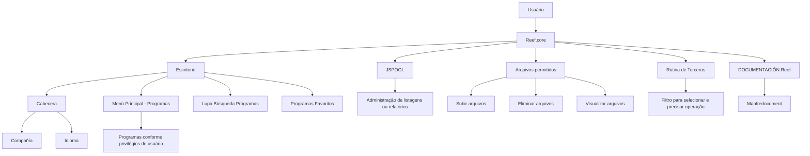

# Introducción a la Usabilidad de la Aplicación en Reef.core

## 1. Metadados do Documento
- **Arquivo de Origem:** Não identificado
- **Tipo de Documento:** Apresentação Executiva / Guia de Usabilidade
- **Domínio / Sistema:** Reef.core / MAPFRE
- **Público-Alvo:** Usuários da aplicação, operação e negócio
- **Data/Versão Identificada:** Não identificada

---

## 2. Resumo Executivo & Contexto de Negócio

O documento apresenta uma introdução à usabilidade da aplicação **Reef.core**, descrita como uma solução integral de gestão de seguros para entidades MAPFRE. O objetivo explicitamente indicado é conhecer as principais capacidades da solução para gerir o ciclo de vida de apólices.

A apresentação concentra-se nos elementos de navegação e interação da interface: escritório, cabeçalho, menus, programas, pesquisa de programas, programas favoritos, versão da aplicação e ambiente. Também informa que a aplicação é web e adaptável ao tamanho e ao dispositivo utilizado.

O conteúdo cita funcionalidades relacionadas à administração de listagens ou relatórios por meio de **JSPOOL**, bem como capacidades para envio por correio e manipulação de arquivos permitidos, incluindo ações de subir, eliminar e visualizar arquivos.

Há referências a uma rotina de terceiros com filtro para selecionar e precisar a operação, além de um espaço de documentação Reef associado a Mapfredocument. O conteúdo disponível não detalha fluxos operacionais completos, contratos técnicos, permissões específicas nem regras de processamento de apólices.

---

## 3. Arquitetura, Componentes & Tecnologias Envolvidas

Os componentes e conceitos explicitamente mencionados são:

- **Reef.core:** solução integral de gestão de seguros.
- **MAPFRE:** entidade corporativa associada ao uso da solução Reef.core.
- **Escritorio:** área ou contexto da interface da aplicação.
- **Cabecera:** cabeçalho da aplicação.
- **Menú Principal - Programas:** navegação de programas condicionada pelos privilégios de usuário.
- **Lupa Búsqueda Programas:** recurso de pesquisa de programas.
- **Programas Favoritos:** programas marcados como favoritos pelo usuário.
- **Compañía:** informação disponível no cabeçalho.
- **Idioma:** informação ou seleção disponível no cabeçalho.
- **JSPOOL:** administração de listagens ou relatórios.
- **Rutina de Terceros:** rotina com filtro para selecionar e precisar a operação.
- **DOCUMENTACIÓN Reef / Mapfredocument:** área ou fonte de documentação citada.
- **Zeus, APIs, Componentes, Cloud, Soluciones, Arquitecturas:** categorias ou opções de navegação listadas na área de documentação.
- **Owner:** `user:agonzalez_mapfre.com`
- **Lifecycle:** `Approved`
- **Source:** `VL`
- **Idioma exibido:** `ES`



> **Nota de Análise:** O documento não descreve arquitetura de infraestrutura, protocolos de integração, microsserviços, bancos de dados, versões de tecnologia, URLs, portas ou contratos de API.

---

## 4. Regras de Negócio, Especificações Funcionais & Processos

### Objetivo funcional da solução

A aplicação Reef.core é apresentada como uma solução de gestão de seguros que permite às entidades MAPFRE gerir o ciclo de vida de suas apólices.

### Navegação e programas

1. O usuário acessa o ambiente de trabalho identificado como **Escritorio**.
2. A aplicação disponibiliza uma **Cabecera** com informações ou opções relacionadas a:
   - Companhia.
   - Idioma.
   - Usuário.
   - Versão da aplicação e ambiente.
3. O **Menú Principal - Programas** apresenta programas de acordo com os privilégios do usuário.
4. A **Lupa Búsqueda Programas** permite pesquisar programas.
5. A aplicação contém uma área de **Programas Favoritos**.

### Adaptabilidade da interface

A aplicação é descrita como:
- Web.
- Adaptável ao tamanho utilizado.
- Adaptável ao dispositivo utilizado.

### Administração de listagens, relatórios e arquivos

1. **JSPOOL** é citado para administração de listagens ou relatórios.
2. O documento menciona tipos de arquivos permitidos, mas não enumera extensões, formatos ou limites.
3. São apresentadas ações para:
   - Subir arquivos.
   - Eliminar arquivos.
   - Visualizar arquivos.
4. O conteúdo também cita a funcionalidade de enviar por correio.

### Rotina de terceiros

A **Rutina de Terceros** apresenta um filtro cuja finalidade é permitir ao usuário:
1. Selecionar a operação.
2. Precisar a operação selecionada.

### Documentação Reef

A área de documentação apresenta a referência **DOCUMENTACIÓN Reef** e **Mapfredocument**. A navegação listada inclui:

- Buscar
- Inicio
- Soluciones
- Arquitecturas
- APIs
- Componentes
- Cloud
- Documentación
- Zeus
- Reef
- Ayuda

> **Nota de Análise:** O documento menciona privilégios de usuário no menu principal, porém não detalha perfis, papéis, permissões ou critérios de autorização.

---

## 5. Tabelas de Parâmetros, Ambientes e Estruturas de Dados

| Item / Parâmetro | Descrição / Função | Tipo / Valores / Formato | Ambiente / Observações |
| :--- | :--- | :--- | :--- |
| Reef.core | Solução integral de gestão de seguros | Sistema / aplicação | Permite gerir o ciclo de vida de apólices para entidades MAPFRE |
| Escritorio | Área de trabalho da aplicação | Elemento de interface | Citado como parte da usabilidade da aplicação |
| Cabecera | Cabeçalho da aplicação | Elemento de interface | Contém referências a companhia, idioma, usuário, versão e ambiente |
| Menú Principal - Programas | Área principal de programas | Menu de navegação | Programas condicionados por privilégios de usuário |
| Lupa Búsqueda Programas | Pesquisa de programas | Função de busca | Não há detalhamento sobre filtros ou critérios de pesquisa |
| Programas Favoritos | Programas favoritos do usuário | Recurso de interface | Não há detalhamento sobre inclusão, remoção ou persistência |
| Compañía | Informação ou seleção no cabeçalho | Campo / opção de interface | Sem valores especificados |
| Idioma | Informação ou seleção no cabeçalho | Campo / opção de interface | O texto apresenta `ES` |
| Versión App y Entorno | Versão da aplicação e ambiente | Informação de interface | Não há versão nem ambiente nominalmente especificados |
| JSPOOL | Administração de listagens ou relatórios | Componente / funcionalidade | Não há detalhamento técnico adicional |
| Tipos de Archivos Permitidos | Restrições de arquivos aceitos | Regra de arquivo | Tipos não especificados |
| Subir archivos | Carregar arquivos | Ação | Associada a arquivos permitidos |
| Eliminar archivos | Excluir arquivos | Ação | Associada a arquivos permitidos |
| Visualizar archivos | Consultar arquivos | Ação | Associada a arquivos permitidos |
| Enviar por Correo | Envio por correio | Função | Não há detalhes de destinatários ou protocolo |
| Rutina de Terceros | Rotina relacionada a terceiros | Processo / funcionalidade | Inclui filtro para selecionar e precisar operação |
| Filtro de operação | Seleção e detalhamento da operação | Filtro | Usado na rotina de terceiros |
| DOCUMENTACIÓN Reef | Área de documentação | Repositório / navegação | Também aparece como “Documentation” |
| Mapfredocument | Referência documental | Fonte / sistema citado | Sem detalhamento adicional |
| Owner | Responsável identificado | Identificador de usuário | `user:agonzalez_mapfre.com` |
| Lifecycle | Estado de ciclo de vida | Status | `Approved` |
| Source | Origem identificada | Sigla / valor | `VL`; significado não detalhado |
| Idioma exibido | Idioma apresentado no conteúdo | Código | `ES` |

---

## 6. Bateria de Perguntas & Respostas para RAG (FAQ Sintético)

### P1: Qual é o objetivo da aplicação Reef.core?
**R:** Reef.core é apresentada como uma solução integral de gestão de seguros que permite às entidades MAPFRE gerir o ciclo de vida de suas apólices.

### P2: Como os programas são apresentados no menu principal de Reef.core?
**R:** O documento informa que o “Menú Principal - Programas” disponibiliza programas conforme os privilégios do usuário. Não são descritos os perfis de acesso, as permissões específicas ou a matriz de autorização.

### P3: Como um usuário pode localizar programas na aplicação Reef.core?
**R:** A interface menciona a “Lupa Búsqueda Programas”, indicando a existência de um recurso de busca de programas. O documento não especifica campos pesquisáveis, filtros ou comportamento da pesquisa.

### P4: Quais informações são citadas na cabecera de Reef.core?
**R:** A cabecera é associada a companhia, idioma, usuário, versão da aplicação e ambiente. O conteúdo não detalha quais valores são exibidos, nem se os campos são apenas informativos ou configuráveis.

### P5: Reef.core é uma aplicação web responsiva?
**R:** Sim. O documento descreve Reef.core como uma “Aplicación Web y Adaptable”, indicando adaptação ao tamanho e ao dispositivo utilizado.

### P6: Qual é a função de JSPOOL em Reef.core?
**R:** JSPOOL é citado como mecanismo ou área para administração de listagens ou relatórios. O documento não esclarece como relatórios são criados, executados, armazenados ou exportados.

### P7: Quais operações com arquivos são mencionadas?
**R:** O conteúdo menciona tipos de arquivos permitidos e três ações: subir arquivos, eliminar arquivos e visualizar arquivos. As extensões aceitas, limites de tamanho e validações não são informados.

### P8: Como funciona a rotina de terceiros?
**R:** A “Rutina de Terceros” apresenta um filtro que permite selecionar e precisar a operação. O documento não descreve quais operações estão disponíveis, quais dados de terceiros são tratados ou quais validações são aplicadas.

### P9: Existe funcionalidade de envio por e-mail na aplicação?
**R:** Sim. O documento cita “Enviar por Correo”. Não há detalhes sobre configuração de correio, modelos de mensagem, destinatários, anexos ou rastreabilidade de envios.

### P10: Onde a documentação relacionada a Reef é referenciada?
**R:** A documentação é referenciada como “DOCUMENTACIÓN Reef”, “Documentation / DOCUMENTACIÓN Reef” e “Mapfredocument”. A navegação listada inclui Buscar, Inicio, Soluciones, Arquitecturas, APIs, Componentes, Cloud, Documentación, Zeus, Reef e Ayuda.

### P11: Qual é o estado de ciclo de vida identificado para o conteúdo de documentação?
**R:** O conteúdo apresenta o campo “Lifecycle” com o valor `Approved`, indicando que esse é o estado explicitamente exibido. O documento não define o fluxo de estados ou os critérios para aprovação.

### P12: Quem é o owner identificado no conteúdo de documentação?
**R:** O campo “Owner” apresenta o valor `user:agonzalez_mapfre.com`. O documento não descreve responsabilidades, funções ou dados adicionais desse usuário.

---

## 7. Glossário de Termos, Siglas & Conceitos-Chave

- **Reef.core:** Solução integral de gestão de seguros citada no documento.
- **MAPFRE:** Entidade corporativa para a qual Reef.core permite gerir o ciclo de vida de apólices.
- **Apólice:** Elemento do ciclo de vida de seguros mencionado como objeto de gestão pela solução.
- **Escritorio:** Área de trabalho ou contexto principal da interface.
- **Cabecera:** Cabeçalho da aplicação.
- **Menú Principal - Programas:** Menu que disponibiliza programas segundo privilégios de usuário.
- **Programas Favoritos:** Programas destacados como favoritos na interface.
- **JSPOOL:** Recurso citado para administração de listagens ou relatórios.
- **Rutina de Terceros:** Rotina relacionada a terceiros que disponibiliza filtro de operação.
- **Mapfredocument:** Referência documental citada no conteúdo.
- **Lifecycle:** Campo de ciclo de vida exibido com o valor `Approved`.
- **Owner:** Campo que identifica o responsável pelo conteúdo.
- **VL:** Valor apresentado no campo “Source”; o significado não é definido no documento.
- **ES:** Código exibido para idioma; o documento não apresenta definição adicional.

---

## 8. Notas Críticas, Riscos & Limitações

- O arquivo de origem, data, versão e autoria formal do documento não foram identificados no texto fornecido.
- O conteúdo é predominantemente resumido e orientado à apresentação de interface; não contém detalhamento de implementação técnica.
- Não há especificação de APIs, métodos HTTP, contratos JSON, banco de dados, integrações, protocolos, URLs, servidores, portas ou credenciais.
- O documento afirma que os programas dependem de privilégios de usuário, mas não apresenta uma matriz de permissões.
- Os tipos de arquivos permitidos são mencionados, porém extensões, limites de tamanho, políticas de retenção e regras de segurança não são detalhados.
- JSPOOL é associado à administração de listagens ou relatórios, mas não há definição de arquitetura, entradas, saídas ou processo de geração.
- A rotina de terceiros possui filtro para selecionar e precisar operações, mas as operações, regras de negócio e dados envolvidos não são descritos.
- O significado de `VL`, apresentado como “Source”, não está definido no conteúdo.
- A relação entre Reef.core, Mapfredocument, Zeus, APIs, Componentes e Cloud não é explicada; esses itens aparecem como opções de navegação ou categorias.

---

## 9. Conteúdo Bruto Estruturado (Referência Fiel)

```text
--- [PÁGINA 1 DE 1] ---

INTRODUCCIÓN a la Usabilidad de la Aplicación en Reef.core
OBJETIVO
Conocer las principales capacidades de Reef.core como Solución integral de Gestión de Seguros que permite a las entidades MAPFRE
gestionar el ciclo de vida de sus pólizas.
Escritorio
Detalle Cabecera
Menús & Programas
Escritorio
¿Con qué nos encontramos?
Cabecera
Lupa Búsqueda Programas
Menú Principal - Programas (Privilegios de Usuario)
Programas Favoritos
Versión App y Entorno
Aplicación Web y Adaptable (Tamaño y Dispositivo)
Detalle Cabecera
Cabecera
Compañía
Idioma
JSPOOL - Administración Listados o Informes
Tipos de Archivos Permitidos
Acciones para Subir / Eliminar / Visualizar archivos
Enviar por Correo
Usuario
Menus y Programas
Rutina de Terceros
Aparece un Filtro que permite Seleccionar y Precisar la Operación
Documentation / DOCUMENTACIÓN Reef
DOCUMENTACIÓN Reef
Mapfredocument
DOCUMENTACIÓN Reef
Owner
user:agonzalez_mapfre.com
Lifecycle
Approved Source
 / 
 VL
Buscar Inicio Soluciones Arquitecturas APIs Componentes Cloud Documentación Zeus Reef Ayuda
ES
```
