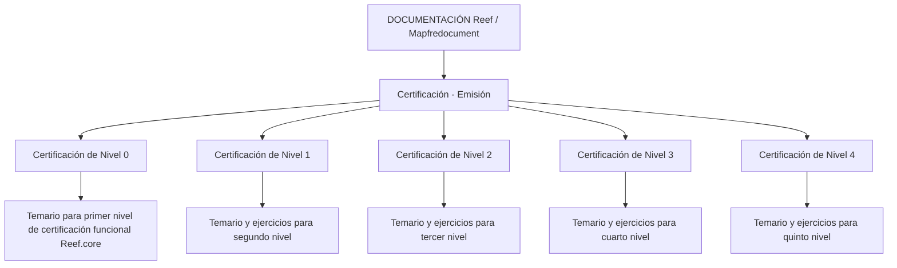

# Certificação Funcional de Emissão — Reef.core

## 1. Metadados do Documento
- **Arquivo de Origem:** `Não identificado no conteúdo extraído`
- **Tipo de Documento:** `Manual Operacional / Documentação de Certificação`
- **Domínio / Sistema:** `Reef.core — módulo de emissão`
- **Público-Alvo:** `Profissionais envolvidos na certificação funcional de Reef.core`
- **Data/Versão Identificada:** `Não identificada`

---

## 2. Resumo Executivo & Contexto de Negócio

O conteúdo apresenta a seção **“Certificación - Emisión”**, destinada a concentrar os temários dos níveis de certificação do módulo de emissão do sistema **Reef.core**. A página está inserida no contexto da **DOCUMENTACIÓN Reef**, disponível em uma plataforma documental identificada como **Mapfredocument**.

A certificação funcional de Reef.core está organizada em cinco níveis: níveis 0, 1, 2, 3 e 4. Cada nível descreve o conhecimento temático necessário para obtenção de uma certificação funcional correspondente, aumentando do primeiro ao quinto nível.

Os níveis 1 a 4 mencionam explicitamente a existência de exercícios juntamente com o temário. O nível 0 menciona somente o temário necessário para a primeira certificação funcional. O conteúdo extraído não detalha os tópicos dos temários, os exercícios, critérios de aprovação, duração, pré-requisitos ou mecanismos de avaliação.

A navegação documental inclui áreas como Soluções, Arquiteturas, APIs, Componentes, Cloud, Documentação, Zeus, Reef e Ajuda. Entretanto, o documento não descreve a relação funcional ou técnica entre essas áreas de navegação e os níveis de certificação.

---

## 3. Arquitetura, Componentes & Tecnologias Envolvidas

Os elementos identificados no conteúdo são:

| Componente / Elemento | Descrição fundamentada no conteúdo |
| :--- | :--- |
| `Reef.core` | Sistema citado como objeto da certificação funcional. |
| `Módulo de emissão` | Módulo de Reef.core ao qual a seção de certificação se refere. |
| `Certificación - Emisión` | Área que reúne os temários dos níveis de certificação do módulo de emissão. |
| `DOCUMENTACIÓN Reef` | Área documental na qual o conteúdo está publicado. |
| `Mapfredocument` | Identificação exibida na página documental. |
| `Owner` | Campo exibido com o valor `user:agonzalez_mapfre.com`. |
| `Lifecycle` | Campo exibido com o valor `Approved`. |
| `Source` | Campo exibido com o valor `VL`. |



> **Nota de Análise:** O conteúdo não descreve arquitetura de software, integrações, APIs, microsserviços, bancos de dados, protocolos, ambientes técnicos ou fluxos de dados do módulo de emissão Reef.core.

---

## 4. Regras de Negócio, Especificações Funcionais & Processos

### Estrutura de certificação funcional

1. A seção de certificação do módulo de emissão contém os temários de cada nível de certificação.
2. Existem cinco níveis identificados: 0, 1, 2, 3 e 4.
3. A certificação de nível 0 corresponde ao primeiro nível de certificação funcional de Reef.core.
4. A certificação de nível 1 corresponde ao segundo nível de certificação funcional de Reef.core e inclui temário e exercícios.
5. A certificação de nível 2 corresponde ao terceiro nível de certificação funcional de Reef.core e inclui temário e exercícios.
6. A certificação de nível 3 corresponde ao quarto nível de certificação funcional de Reef.core e inclui temário e exercícios.
7. A certificação de nível 4 corresponde ao quinto nível de certificação funcional de Reef.core e inclui temário e exercícios.

### Escopo não detalhado

O documento não informa:

- Conteúdo específico de cada temário.
- Tipo, quantidade ou critérios de resolução dos exercícios.
- Critérios de aprovação ou reprovação.
- Pontuação mínima.
- Duração das avaliações.
- Pré-requisitos entre os níveis.
- Responsáveis pela aplicação ou validação da certificação.
- Processo de inscrição, agendamento ou emissão de certificado.
- Métodos HTTP, contratos JSON, APIs ou componentes técnicos do módulo de emissão.

---

## 5. Tabelas de Parâmetros, Ambientes e Estruturas de Dados

| Item / Parâmetro | Descrição / Função | Tipo / Valores / Formato | Ambiente / Observações |
| :--- | :--- | :--- | :--- |
| Área documental | Área onde o conteúdo está publicado | `DOCUMENTACIÓN Reef` | Exibida na página |
| Plataforma documental | Identificação da plataforma | `Mapfredocument` | Exibida na página |
| Módulo certificado | Módulo ao qual a certificação se refere | `Emisión` | Associado a Reef.core |
| Sistema | Sistema objeto da certificação funcional | `Reef.core` | Nome exibido com variação `Reef.core` e `Reef` |
| Nível 0 | Primeiro nível de certificação funcional | Temário | Não há menção a exercícios |
| Nível 1 | Segundo nível de certificação funcional | Temário e exercícios | Conteúdo específico não detalhado |
| Nível 2 | Terceiro nível de certificação funcional | Temário e exercícios | Conteúdo específico não detalhado |
| Nível 3 | Quarto nível de certificação funcional | Temário e exercícios | Conteúdo específico não detalhado |
| Nível 4 | Quinto nível de certificação funcional | Temário e exercícios | Conteúdo específico não detalhado |
| Owner | Proprietário indicado na página | `user:agonzalez_mapfre.com` | Valor literal extraído |
| Lifecycle | Estado do ciclo de vida do documento | `Approved` | Valor literal extraído |
| Source | Origem indicada na página | `VL` | Significado não detalhado |
| Idioma da interface | Idioma exibido na navegação | `ES` | Interface em espanhol |

---

## 6. Bateria de Perguntas & Respostas para RAG (FAQ Sintético)

### P1: Qual sistema é coberto pela certificação funcional apresentada no documento?
**R:** A certificação funcional apresentada é referente ao sistema **Reef.core**, especificamente ao seu módulo de **emissão**.

### P2: Quantos níveis de certificação funcional do módulo de emissão são apresentados?
**R:** O documento apresenta cinco níveis de certificação funcional: níveis **0, 1, 2, 3 e 4**.

### P3: O que é necessário para obter a certificação de nível 0 de Reef.core?
**R:** Para obter o primeiro nível de certificação funcional de Reef.core, o documento informa que é necessário conhecer o temário associado à **Certificación de Nivel 0**. Não há menção a exercícios para esse nível.

### P4: Quais níveis de certificação incluem exercícios?
**R:** Os níveis **1, 2, 3 e 4** incluem temário e exercícios. O conteúdo não especifica o formato, a quantidade ou os critérios de avaliação desses exercícios.

### P5: A certificação de nível 1 corresponde a qual etapa da certificação funcional?
**R:** A **Certificación de Nivel 1** corresponde ao segundo nível de certificação funcional de Reef.core e exige o conhecimento do temário juntamente com exercícios.

### P6: Qual é o nível associado à quinta certificação funcional de Reef.core?
**R:** A quinta certificação funcional de Reef.core está associada à **Certificación de Nivel 4**, que inclui temário e exercícios.

### P7: Onde está publicada a documentação de certificação do módulo de emissão?
**R:** O conteúdo está publicado na área **DOCUMENTACIÓN Reef**, em uma página que também apresenta a identificação **Mapfredocument**.

### P8: O documento detalha os tópicos de estudo de cada nível de certificação?
**R:** Não. O documento informa que existem temários para os níveis de certificação, mas não apresenta os tópicos, conteúdos programáticos ou materiais específicos de cada temário.

### P9: O documento informa critérios de aprovação para as certificações?
**R:** Não. O conteúdo não apresenta critérios de aprovação, notas mínimas, pesos, prazos, duração das provas ou regras de reprovação.

### P10: Quem aparece como proprietário da página documental?
**R:** O campo `Owner` da página apresenta o valor literal **`user:agonzalez_mapfre.com`**.

### P11: Qual é o status de ciclo de vida exibido para a documentação?
**R:** O campo `Lifecycle` está identificado como **`Approved`**.

### P12: O documento descreve APIs ou arquitetura técnica do módulo de emissão?
**R:** Não. O conteúdo não descreve APIs, métodos HTTP, contratos de integração, componentes técnicos, ambientes, servidores ou arquitetura de software do módulo de emissão.

---

## 7. Glossário de Termos, Siglas & Conceitos-Chave

- **Reef.core:** Sistema citado como objeto da certificação funcional.
- **Emisión:** Módulo de emissão de Reef.core ao qual a certificação se refere.
- **Certificación de Nivel 0:** Primeiro nível de certificação funcional de Reef.core.
- **Certificación de Nivel 1:** Segundo nível de certificação funcional de Reef.core, com temário e exercícios.
- **Certificación de Nivel 2:** Terceiro nível de certificação funcional de Reef.core, com temário e exercícios.
- **Certificación de Nivel 3:** Quarto nível de certificação funcional de Reef.core, com temário e exercícios.
- **Certificación de Nivel 4:** Quinto nível de certificação funcional de Reef.core, com temário e exercícios.
- **DOCUMENTACIÓN Reef:** Área documental exibida como local de publicação do conteúdo.
- **Mapfredocument:** Identificação exibida na página documental; o documento não explica sua função.
- **Lifecycle:** Campo de ciclo de vida do documento, com valor `Approved`.
- **Source:** Campo de origem do documento, com valor `VL`; o significado de `VL` não é detalhado.

---

## 8. Notas Críticas, Riscos & Limitações

- O documento é uma visão resumida da estrutura de certificação e não contém o conteúdo dos temários.
- Não há detalhamento dos exercícios citados nos níveis 1, 2, 3 e 4.
- Não foram identificados critérios de aprovação, pré-requisitos, dependências entre níveis ou processo operacional de certificação.
- Não há informações sobre arquitetura de software, integrações, APIs, logs, URLs, ambientes, servidores ou parâmetros técnicos.
- O significado dos campos `Source: VL` e `Mapfredocument` não é explicado no conteúdo extraído.
- **Nota de Análise:** A numeração dos níveis sugere uma progressão de certificação do primeiro ao quinto nível, mas o documento não declara explicitamente que a conclusão de um nível seja pré-requisito para o nível seguinte.

---

## 9. Conteúdo Bruto Estruturado (Referência Fiel)

```text
--- [PÁGINA 1 DE 1] ---

CERTIFICACIÓN - EMISIÓN
 En este apartado se encuentran los temarios de cada uno de los niveles de certicación del módulo de emisión.
CERTIFICACIÓN DE NIVEL 0
En este apartado se encuentra el temario
que se necesita conocer para obtener el
primer nivel de certicación funcional de
Reef.core
CERTIFICACIÓN DE NIVEL 1
En este apartado se encuentra el temario
que se necesita conocer junto con
ejercicios para obtener el segundo nivel de
certicación funcional de Reef.core
CERTIFICACIÓN DE NIVEL 2
En este apartado se encuentra el temario
que se necesita conocer junto con
ejercicios para obtener el tercer nivel de
certicación funcional de Reef.core
CERTIFICACIÓN DE NIVEL 3
En este apartado se encuentra el temario
que se necesita conocer junto con
ejercicios para obtener el cuarto nivel de
certicación funcional de Reef.core
CERTIFICACIÓN DE NIVEL 4
En este apartado se encuentra el temario
que se necesita conocer junto con
ejercicios para obtener el quinto nivel de
certicación funcional de Reef.core
Documentation / DOCUMENTACIÓN Reef
DOCUMENTACIÓN Reef
Mapfredocument
DOCUMENTACIÓN Reef
Owner
user:agonzalez_mapfre.com
Lifecycle
Approved Source
 / 
 VL
Buscar Inicio Soluciones Arquitecturas APIs Componentes Cloud Documentación Zeus Reef Ayuda
ES
```
