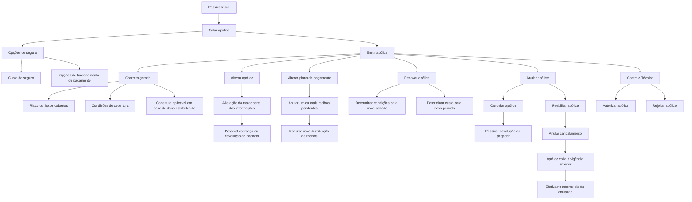

# Certificação — Emissão Nível 1: Definições e Operações do Reef.core

## 1. Metadados do Documento
- **Arquivo de Origem:** Não identificado no conteúdo extraído
- **Tipo de Documento:** Apresentação Executiva / Material de Certificação
- **Domínio / Sistema:** Reef.core — módulo de emissão de seguros
- **Público-Alvo:** Desenvolvedores, Arquitetos, Analistas Funcionais, Operação e equipes de configuração de produtos de seguros
- **Data/Versão Identificada:** Não identificada

---

## 2. Resumo Executivo & Contexto de Negócio

O documento descreve a estrutura de definições e operações associadas ao nível de emissão do sistema **Reef.core**. O material organiza os elementos necessários para configurar produtos, apólices, riscos, coberturas, agentes, documentos, condições comerciais e controles técnicos no contexto de uma companhia seguradora.

A configuração é apresentada de forma hierárquica. O nível de **Definição Comum** contém cadastros transversais, como companhia, moeda, estrutura comercial, canais, agentes e conceitos econômicos. O nível de **Ramo** contém definições do módulo de emissão que não pertencem exclusivamente a um ramo específico. Em seguida, os níveis de **Apólice**, **Risco** e **Cobertura** detalham elementos progressivamente mais específicos do contrato de seguro.

O documento também descreve operações de negócio relacionadas ao ciclo de vida da apólice. Entre elas estão cotação, emissão, alteração, alteração de plano de pagamento, renovação, anulação, reabilitação, autorização ou rejeição por controle técnico e consulta de apólices.

O Reef.core utiliza controles técnicos para determinar condições nas quais uma contratação pode ser paralisada ou submetida à decisão de uma ou mais pessoas quanto à aceitabilidade do seguro pela seguradora. O material não detalha implementações técnicas, APIs, métodos HTTP, contratos JSON, infraestrutura, ambientes ou integrações externas.

---

## 3. Arquitetura, Componentes & Tecnologias Envolvidas

O conteúdo descreve uma arquitetura funcional e de configuração de seguros no Reef.core. Os principais níveis funcionais identificados são:

- **Definição Comum:** elementos corporativos e transversais necessários para a emissão.
- **Ramo:** características gerais das apólices e definições aplicáveis ao contexto do ramo.
- **Apólice:** definições que afetam todos os riscos possíveis de uma apólice.
- **Risco:** definições aplicáveis a cada risco da apólice.
- **Cobertura:** definições aplicáveis a cada cobertura definida.
- **Operação:** processos de cotação, produção, suplementos, controle técnico e consultas.

```mermaid
graph TD
    A[Reef.core — Emissão Nível 1] --> B[Definição Comum]
    A --> C[Ramo]
    A --> D[Apólice]
    A --> E[Risco]
    A --> F[Cobertura]
    A --> G[Operações]

    B --> B1[Companhia]
    B --> B2[Moeda]
    B --> B3[Estrutura Comercial]
    B --> B4[Estrutura de Produto]
    B --> B5[Canal]
    B --> B6[Quadro de Comissão]
    B --> B7[Agente]
    B --> B8[Conceito Econômico]
    B --> B9[Documentos de Entrada/Saída]
    B --> B10[Controle Técnico]

    C --> C1[Características gerais da apólice]
    C --> C2[Suplemento]
    C --> C3[Documentos de Entrada/Saída]

    D --> D1[Moeda]
    D --> D2[Importe Mínimo]
    D --> D3[Escala]
    D --> D4[Intervenção]
    D --> D5[Cláusula]
    D --> D6[Texto Anexo]
    D --> D7[Plano de Pagamento]
    D --> D8[Controle Técnico]
    D --> D9[Atributo]
    D --> D10[Controle Técnico de Atributo]
    D --> D11[Ocorrência]

    E --> E1[Intervenção]
    E --> E2[Atributo]
    E --> E3[Controle Técnico de Atributo]
    E --> E4[Ocorrência]
    E --> E5[Ramo Contábil Múltiplo]
    E --> E6[Modalidade]
    E --> E7[Cláusula]
    E --> E8[Comissão]

    F --> F1[Cobertura]
    F --> F2[Controle Técnico]
    F --> F3[Atributo]
    F --> F4[Ocorrência]
    F --> F5[Limite]
    F --> F6[Intervalo]
    F --> F7[Franquia]
    F --> F8[Conceito de Desglose]
    F --> F9[Tarifa Multivariável]
    F --> F10[Cláusula]
    F --> F11[Comissão]

    G --> G1[Orçamento]
    G --> G2[Nova Produção]
    G --> G3[Suplemento]
    G --> G4[Controle Técnico]
    G --> G5[Consultas]

    G1 --> G11[Cotar apólice]
    G2 --> G21[Emitir apólice]
    G3 --> G31[Alterar apólice]
    G3 --> G32[Alterar plano de pagamento]
    G3 --> G33[Renovar apólice]
    G3 --> G34[Anular apólice]
    G3 --> G35[Reabilitar apólice]
    G4 --> G41[Autorizar apólice]
    G4 --> G42[Rejeitar apólice]
    G5 --> G51[Consultar apólice]
```



> **Nota de Análise:** O documento identifica o Reef.core como sistema central do domínio, mas não especifica arquitetura de implantação, microsserviços, bancos de dados, protocolos de comunicação, URLs, APIs ou ambientes técnicos.

---

## 4. Regras de Negócio, Especificações Funcionais & Processos

### 4.1 Definição Comum

A Definição Comum reúne definições que não são exclusivas do módulo de emissão, mas são necessárias para realizar configurações de emissão.

- **Companhia:** definição da entidade ou entidades com as quais serão criadas as apólices e, consequentemente, os demais elementos.
- **Moeda:** definição das divisas com as quais o Reef.core realizará as operações da companhia.
- **Estrutura Comercial:** definição de como será estabelecida a organização territorial da companhia.
- **Estrutura de Produto:** definição de como estarão organizados os ramos comercializados.
- **Canal:** definição das diferentes vias pelas quais a nova produção chegará à companhia.
- **Quadro de Comissão:** definição dos agrupadores que determinam as comissões a serem pagas aos agentes.
- **Agente:** definição dos terceiros que atuarão como intermediários entre cliente e companhia.
- **Conceito Econômico:** definição dos conceitos que integrarão a informação econômica do recibo.
- **Documentos de Entrada/Saída:** definição dos documentos que devem ser emitidos em uma operação e dos documentos exigidos para executar uma operação.
- **Controle Técnico:** definição dos parâmetros necessários para realizar validações que permitam ou não finalizar uma operação.

### 4.2 Definições de Ramo

No nível de ramo, existem definições pertencentes ao módulo de emissão, mas não exclusivas do ramo específico que está sendo definido.

- **Ramo:** determina características gerais das apólices, incluindo dias por ano, coletivos, cláusulas, tipo de apólice temporal e outros elementos não detalhados.
- **Suplemento:** define os tipos de modificações que poderão afetar as apólices, incluindo anulação, reabilitação e renovação.
- **Documentos de Entrada/Saída:** determina documentos que acompanham uma operação e documentos necessários para realizá-la. Como exemplo apresentado, para emitir uma apólice de automóvel é necessário dispor da licença de condução.

### 4.3 Definições de Apólice

O nível de apólice contém definições que afetam todos os possíveis riscos de uma apólice.

- **Moeda:** determina as moedas possíveis para emissão de apólices; afeta capitais, prêmios, comissões e recibos.
- **Importe Mínimo:** estabelece os valores mínimos para gerar um recibo.
- **Escala:** define a porção de prêmio aplicável quando uma apólice não é anual e não se deseja cálculo proporcional ao tempo.
- **Intervenção:** define as figuras que podem participar da contratação. Essas figuras referem-se a clientes, como tomador, segurado e condutor.
- **Cláusula:** estabelece estipulações contratuais que precisam, ampliam, derrogam ou modificam o conteúdo do seguro.
- **Texto Anexo:** define se é possível incluir manualmente em uma apólice estipulações contratuais que precisam, ampliam, derrogam ou modificam o conteúdo do seguro.
- **Plano de Pagamento:** define como o pagamento do seguro será fracionado.
- **Controle Técnico:** define as condições em que a contratação pode ser paralisada ou submetida à decisão de uma ou mais pessoas sobre a aceitabilidade do seguro pela seguradora.
- **Atributo:** representa uma característica necessária disponível no Reef.core, como um local para registrar um desconto que afeta a apólice.
- **Controle Técnico de Atributo:** aplica controles técnicos a atributos.
- **Ocorrência:** corresponde ao mesmo conceito de atributo, porém com solicitação realizada “n” vezes; representa um conjunto de atributos cuja solicitação pode ocorrer várias vezes. O exemplo fornecido é o armazenamento, na apólice, de uma série de matérias cujo transporte é limitado em quantidade.

### 4.4 Definições de Risco

O nível de risco contém definições que afetam cada um dos possíveis riscos de uma apólice.

- **Intervenção:** definição de figuras participantes da contratação, tais como tomador, segurado e condutor.
- **Atributo:** característica necessária disponível no Reef.core; o exemplo mencionado é um local de registro de desconto que afeta o risco.
- **Controle Técnico de Atributo:** definição das condições em que a contratação pode ser paralisada ou submetida à decisão sobre aceitabilidade pela seguradora.
- **Ocorrência:** conjunto de atributos cuja solicitação pode ocorrer “n” vezes.
- **Ramo Contábil Múltiplo:** possibilidade de definir ramos contábeis pelo conteúdo de algum atributo.
- **Modalidade:** agrupamento de coberturas que, em conjunto, se transforma em um pacote comercializável.
- **Cláusula:** estipulações contratuais que precisam, ampliam, derrogam ou modificam o conteúdo do seguro.
- **Comissão:** remuneração pela intermediação na contratação de um seguro. Existem diferentes tipos de comissão conforme a forma de intervenção do agente e existem exceções, não detalhadas pelo documento.

### 4.5 Definições de Cobertura

O nível de cobertura reúne definições que afetam cada cobertura configurada.

- **Cobertura:** obrigação principal em um contrato de seguro. Existem tipos de cobertura que determinam comportamento tanto no processo de emissão quanto no processo de prestações.
- **Controle Técnico:** condições nas quais a contratação pode ser paralisada ou submetida à decisão sobre aceitabilidade pela seguradora.
- **Atributo:** característica necessária disponível no Reef.core, como o registro de desconto que afeta a cobertura.
- **Ocorrência:** conjunto de atributos cuja solicitação ocorre “n” vezes.
- **Limite:** estipulação do importe máximo contratado durante o período de vigência do seguro e/ou importe máximo aplicável a cada prestação realizada durante o período de vigência. Esses importes são pré-fixados.
- **Intervalo:** estabelecimento de somas seguradas entre dois limites: um inferior e outro superior.
- **Franquia:** estabelece as quantidades pelas quais o segurado responde. A redução de prêmio aplicável pode estar definida na própria franquia ou dedutível.
- **Conceito de Desglose:** define o detalhamento necessário para segregação da informação econômica de uma cobertura.
- **Tarifa Multivariável:** meio para determinar o cálculo. A definição é centrada no conceito de fator, que é o conceito pelo qual se realiza um cálculo.
- **Cláusula:** estipulações contratuais que precisam, ampliam, derrogam ou modificam o conteúdo do seguro.
- **Comissão:** remuneração por intermediar a contratação de um seguro, com diferentes tipos conforme a intervenção do agente e possíveis exceções.

### 4.6 Operações de Orçamento, Produção e Gestão da Apólice



#### Cotar apólice
A operação de cotação oferece diferentes opções de seguro, juntamente com o custo e diferentes opções de fracionamento de pagamento.

#### Emitir apólice
A emissão consiste na geração do contrato que estabelece:

1. O risco ou os riscos cobertos.
2. As condições nas quais o risco é coberto.
3. A cobertura que será fornecida quando o risco sofrer algum dano estabelecido.

#### Alterar apólice
A alteração permite modificar a maior parte das informações da apólice. As informações não permitidas nesse suplemento podem ser modificadas por outros suplementos. As alterações identificadas podem afetar o custo do seguro e provocar cobrança ou devolução ao pagador.

#### Alterar plano de pagamento
A alteração do plano de pagamento anula um ou vários recibos pendentes e, com o valor correspondente, realiza nova distribuição de recibos. Portanto, o pagamento é novamente fracionado.

#### Renovar apólice
A renovação realiza a renovação efetiva da apólice, determinando condições e custo do seguro para um novo período de vigência.

#### Anular apólice
A anulação realiza o cancelamento da apólice e pode gerar valor a devolver ao pagador.

#### Reabilitar apólice
A reabilitação é a anulação de uma cancelamento de apólice. A apólice volta a vigorar na situação anterior à anulação. A reabilitação é efetiva no mesmo dia em que a apólice foi anulada.

#### Autorizar apólice
Uma apólice retida por controle técnico passa a estar aprovada e, consequentemente, o restante do Reef.core passa a reconhecê-la como apólice.

#### Rejeitar apólice
Uma apólice retida por controle técnico não é autorizada e, consequentemente, desaparece do Reef.core.

#### Consultar apólice
A consulta permite acessar as informações de uma apólice após seleção prévia por diferentes critérios de busca. Os critérios específicos não são detalhados no documento.

---

## 5. Tabelas de Parâmetros, Ambientes e Estruturas de Dados

| Item / Parâmetro | Descrição / Função | Tipo / Valores / Formato | Ambiente / Observações |
| :--- | :--- | :--- | :--- |
| Companhia | Define a entidade ou entidades com as quais apólices e demais elementos serão criados. | Definição corporativa | Definição Comum |
| Moeda — Companhia | Define as divisas com as quais o Reef.core realiza operações da companhia. | Divisas não especificadas | Definição Comum |
| Estrutura Comercial | Define a organização territorial da companhia. | Estrutura organizacional | Definição Comum |
| Estrutura de Produto | Define a organização dos ramos comercializados. | Estrutura de produto | Definição Comum |
| Canal | Define as vias pelas quais chega nova produção à companhia. | Canais não especificados | Definição Comum |
| Quadro de Comissão | Define agrupadores que determinam comissões pagas aos agentes. | Agrupadores não especificados | Definição Comum |
| Agente | Define terceiros que atuam como intermediários entre cliente e companhia. | Entidade intermediária | Definição Comum |
| Conceito Econômico | Define conceitos integrantes da informação econômica do recibo. | Conceitos não especificados | Definição Comum |
| Documentos de Entrada/Saída | Define documentos emitidos e exigidos em operações. | Documentos não especificados | Definição Comum e Ramo |
| Controle Técnico | Define parâmetros para validações que permitem ou impedem a finalização de uma operação. | Regras de validação não especificadas | Definição Comum |
| Ramo | Define características gerais das apólices, incluindo dias por ano, coletivos, cláusulas e tipo temporal. | Características gerais | Ramo |
| Suplemento | Define tipos de modificações possíveis para apólices. | Anulação, reabilitação, renovação e outros não detalhados | Ramo |
| Moeda — Apólice | Determina moedas possíveis para emissão de apólices. | Afeta capitais, prêmios, comissões e recibos | Apólice |
| Importe Mínimo | Estabelece valores mínimos para gerar um recibo. | Valor não especificado | Apólice |
| Escala | Estabelece porção de prêmio em apólices não anuais quando não se deseja proporcionalidade temporal. | Regra de cálculo não especificada | Apólice |
| Intervenção | Define figuras que podem participar da contratação. | Tomador, segurado, condutor e outros não detalhados | Apólice e Risco |
| Cláusula | Define estipulações contratuais que precisam, ampliam, derrogam ou modificam o seguro. | Estipulação contratual | Apólice, Risco e Cobertura |
| Texto Anexo | Define possibilidade de inclusão manual de estipulações contratuais na apólice. | Inclusão manual | Apólice |
| Plano de Pagamento | Define como o pagamento do seguro será fracionado. | Fracionamento não especificado | Apólice |
| Atributo — Apólice | Característica necessária disponível no Reef.core. | Exemplo: registro de desconto da apólice | Apólice |
| Ocorrência — Apólice | Conjunto de atributos solicitado “n” vezes. | Repetível | Apólice |
| Atributo — Risco | Característica necessária disponível no Reef.core. | Exemplo: registro de desconto do risco | Risco |
| Ramo Contábil Múltiplo | Possibilita definir ramos contábeis conforme conteúdo de algum atributo. | Condicionado por atributo | Risco |
| Modalidade | Agrupa coberturas para formar pacote comercializável. | Agrupamento de coberturas | Risco |
| Comissão | Define remuneração pela intermediação na contratação. | Tipos dependem da intervenção do agente; há exceções | Risco e Cobertura |
| Cobertura | Representa obrigação principal de contrato de seguro. | Tipos de cobertura não especificados | Cobertura |
| Atributo — Cobertura | Característica necessária disponível no Reef.core. | Exemplo: registro de desconto da cobertura | Cobertura |
| Limite | Define importe máximo contratado na vigência e/ou por prestação. | Importes pré-fixados | Cobertura |
| Intervalo | Define somas seguradas entre um limite inferior e outro superior. | Limite inferior e superior | Cobertura |
| Franquia | Define quantidades pelas quais o segurado responde. | Pode conter redução de prêmio | Cobertura |
| Conceito de Desglose | Define detalhe necessário para segregação da informação econômica da cobertura. | Estrutura de detalhe não especificada | Cobertura |
| Tarifa Multivariável | Determina cálculo centrado no conceito de fator. | Fatores não especificados | Cobertura |
| Cotar apólice | Oferece opções de seguro, custo e opções de fracionamento de pagamento. | Operação de orçamento | Operações |
| Emitir apólice | Gera contrato de seguro. | Operação de nova produção | Operações |
| Alterar apólice | Modifica a maior parte das informações da apólice. | Pode gerar cobrança ou devolução | Operações / Suplemento |
| Alterar plano de pagamento | Anula recibos pendentes e redistribui recibos. | Novo fracionamento | Operações / Suplemento |
| Renovar apólice | Define condições e custo para novo período de vigência. | Renovação real | Operações / Suplemento |
| Anular apólice | Cancela a apólice. | Pode gerar devolução ao pagador | Operações / Suplemento |
| Reabilitar apólice | Anula o cancelamento e restaura situação anterior. | Efetiva no dia da anulação | Operações / Suplemento |
| Autorizar apólice | Aprova apólice retida por controle técnico. | Apólice passa a ser reconhecida pelo Reef.core | Operações / Controle Técnico |
| Rejeitar apólice | Não autoriza apólice retida por controle técnico. | Apólice desaparece do Reef.core | Operações / Controle Técnico |
| Consultar apólice | Permite acesso às informações de apólice. | Seleção por critérios de busca não especificados | Operações / Consultas |

---

## 6. Bateria de Perguntas & Respostas para RAG (FAQ Sintético)

### P1: Qual é a finalidade da Definição Comum no processo de emissão do Reef.core?
**R:** A Definição Comum contém configurações que não são exclusivas do módulo de emissão, mas são necessárias para executar as definições de emissão. Inclui companhia, moeda, estrutura comercial, estrutura de produto, canal, quadro de comissão, agente, conceito econômico, documentos de entrada e saída e controle técnico.

### P2: Quais elementos da apólice são afetados pela moeda definida no nível de apólice?
**R:** A moeda definida no nível de apólice determina as moedas possíveis para emissão e afeta capitais, prêmios, comissões e recibos.

### P3: O que é uma ocorrência no Reef.core?
**R:** Uma ocorrência utiliza o mesmo conceito de atributo, mas permite que a solicitação dos atributos seja realizada “n” vezes. O documento cita como exemplo o armazenamento, na apólice, de uma série de matérias cujo transporte possui limitação de quantidade.

### P4: Como o Reef.core trata uma apólice retida por controle técnico?
**R:** Uma apólice retida por controle técnico pode ser autorizada ou rejeitada. Quando autorizada, a apólice passa a estar aprovada e o restante do Reef.core a reconhece como apólice. Quando rejeitada, a apólice não é autorizada e desaparece do Reef.core.

### P5: O que acontece quando uma apólice é alterada?
**R:** A operação de alteração permite modificar a maior parte das informações da apólice. Informações não modificáveis por esse suplemento podem ser alteradas mediante outros suplementos. Os cambios identificados podem afetar o custo do seguro e gerar cobrança ou devolução ao pagador.

### P6: Como funciona a alteração do plano de pagamento da apólice?
**R:** A alteração do plano de pagamento anula um ou vários recibos pendentes. O valor desses recibos é usado para gerar uma nova distribuição de recibos, ou seja, o pagamento é novamente fracionado.

### P7: O que define uma modalidade no nível de risco?
**R:** Modalidade é o agrupamento de coberturas que, juntas, se convertem em um pacote a ser comercializado.

### P8: Qual é a diferença entre limite e intervalo no nível de cobertura?
**R:** Limite define o importe máximo contratado durante a vigência do seguro e/ou o importe máximo aplicável a cada prestação realizada, com importes pré-fixados. Intervalo estabelece somas seguradas entre dois limites: um inferior e outro superior.

### P9: O que representa a franquia em uma cobertura?
**R:** A franquia estabelece as quantidades pelas quais o segurado responde. O documento também informa que a redução de prêmio aplicável pode estar definida na própria franquia ou dedutível.

### P10: O que significa emitir uma apólice no Reef.core?
**R:** Emitir uma apólice consiste em gerar o contrato que estabelece o risco ou riscos cobertos, as condições de cobertura e a cobertura aplicável quando o risco sofrer algum dano estabelecido.

### P11: Como ocorre a renovação de uma apólice?
**R:** A renovação realiza a renovação real da apólice, determinando condições e custo do seguro para um novo período de vigência.

### P12: Qual é o efeito da reabilitação de uma apólice anulada?
**R:** A reabilitação anula a cancelamento da apólice. A apólice volta a estar vigente na situação anterior à anulação, e a reabilitação é efetiva no mesmo dia em que ocorreu a anulação.

---

## 7. Glossário de Termos, Siglas & Conceitos-Chave

- **Reef.core:** Sistema citado como responsável por realizar operações da companhia e reconhecer apólices autorizadas.
- **Apólice:** Contrato gerado na emissão que estabelece riscos cobertos, condições e cobertura aplicável.
- **Ramo:** Definição que fixa características gerais das apólices e organiza ramos comercializados.
- **Risco:** Elemento da apólice sujeito a definições específicas, incluindo atributos, intervenções, modalidade e comissão.
- **Cobertura:** Obrigação principal em um contrato de seguro; pode determinar comportamento no processo de emissão e no processo de prestações.
- **Prêmio:** Elemento econômico afetado pela moeda da apólice; o documento também cita redução de prêmio ligada à franquia ou dedutível.
- **Recibo:** Elemento econômico sujeito a valor mínimo de geração e a redistribuição durante alteração de plano de pagamento.
- **Suplemento:** Tipo de modificação que uma apólice pode sofrer, incluindo anulação, reabilitação e renovação.
- **Controle Técnico:** Conjunto de parâmetros ou condições de validação que pode permitir, impedir, paralisar, autorizar ou rejeitar uma operação ou contratação.
- **Atributo:** Característica necessária disponível no Reef.core, aplicável à apólice, risco ou cobertura.
- **Ocorrência:** Conjunto repetível de atributos, solicitado “n” vezes.
- **Intervenção:** Definição das figuras que participam da contratação, como tomador, segurado e condutor.
- **Tomador:** Tipo de figura de cliente que pode intervir na contratação.
- **Segurado:** Tipo de figura de cliente que pode intervir na contratação.
- **Condutor:** Tipo de figura de cliente que pode intervir na contratação.
- **Modalidade:** Agrupamento de coberturas convertido em pacote comercializável.
- **Franquia:** Quantidade pela qual o segurado responde; pode conter redução de prêmio.
- **Deducível:** Termo citado como possível local de definição da redução de prêmio aplicável.
- **Tarifa Multivariável:** Meio de determinar cálculo com foco no conceito de fator.
- **Conceito de Desglose:** Detalhamento necessário para segregar informação econômica de cobertura.
- **Ramo Contábil Múltiplo:** Possibilidade de definir ramos contábeis conforme o conteúdo de algum atributo.

---

## 8. Notas Críticas, Riscos & Limitações

- O conteúdo não identifica o nome do arquivo de origem, data, versão formal, autores técnicos ou ciclo de aprovação completo.
- O documento não informa métodos HTTP, APIs, contratos JSON, eventos, filas, bancos de dados, padrões de integração ou endpoints do Reef.core.
- O material não especifica valores, formatos ou algoritmos para importe mínimo, escalas, tarifas multivariáveis, limites, intervalos, franquias, comissões ou controles técnicos.
- O documento afirma que existem diversos tipos de cobertura e comissão, bem como exceções de comissão, porém não descreve a taxonomia, as regras de seleção ou os critérios de exceção.
- Os critérios de busca usados para consultar apólices não são detalhados.
- Não há definição explícita dos estados técnicos intermediários de uma apólice além da retenção por controle técnico, aprovação, rejeição, anulação e reabilitação.
- Não são apresentados ambientes, URLs, servidores, rotas de logs, permissões, matrizes de acesso ou procedimentos operacionais.
- **Nota de Análise:** O documento lista conceitos funcionais do Reef.core, mas não detalha estruturas de dados, telas, serviços ou contratos de integração correspondentes.

---

## 9. Conteúdo Bruto Estruturado (Referência Fiel)

```text
--- [PÁGINA 1 DE 5] ---

CERTIFICACIÓN - EMISIÓN NIVEL 1
DEFINICIÓN
OPERACIÓN
DEFINICIÓN
COMÚN
En este nivel se encuentran definiciones que no son exclusivas del módulo de emisión, pero son necesarias
para poder realizar la definición. Entre otras definiciones se encuentra:
COMPAÑÍA
Definición de la entidad o entidades con
las que se van a crear las pólizas y por
consiguiente el resto de elementos
MONEDA
Definición de las divisas con las que
Reef.core va a realizar las distintas
operaciones de la compañía
ESTRUCTURA COMERCIAL
Definición de como se va a establecer la
organización territorial de la compañía
ESTRUCTURA PRODUCTO
Definición de como estarán organizados
los ramos que se comercializan
CANAL
Definición de las distintas vías por las que
llegará la nueva producción a la compañía
CUADRO COMISIÓN
Definición de los agrupadores que
determinan las comisiones que se van a
pagar a los agentes
AGENTE
Definición de los terceros que ejercerán de
intermediarios entre el cliente y la
compañía
CONCEPTO ECONÓMICO
Definición de los conceptos que formarán
parte de la información económica del
recibo
DOCUMENTOS DE ENTRADA/SALIDA
Definición de los documentos que deben
salir cuando se realiza una operación y de
los documentos que son necesarios
solicitar cuando se realiza una operación
CONTROL TÉCNICO
Documentation / DOCUMENTACIÓN Reef
DOCUMENTACIÓN Reef
Mapfredocument
DOCUMENTACIÓN Reef
Owner
user:agonzalez_mapfre.com
Lifecycle
Approved Source
 /
VL
Buscar Inicio Soluciones Arquitecturas APIs Componentes Cloud Documentación Zeus Reef Ayuda
ES


--- [PÁGINA 2 DE 5] ---

Definición de los parámetros necesarios
para realizar validaciones que permitan o
no finalizar la operación
RAMO
Son definiciones que siendo del módulo de emisión, no son exclusivas del ramo que se está definiendo. Por
ejemplo:
RAMO
Fija las características generales con las
que contarán las pólizas, como días por
año, colectivos, cláusulas, tipo de póliza
temporal, etc.
SUPLEMENTO
Tipos de modificaciones que podrán sufrir
las pólizas (anulación, rehabilitación,
renovación, etc.)
DOCUMENTOS DE ENTRADA/SALIDA
Determinar aquellos documentos que
deben acompañar a una operación (por
ejemplo, que documentos se generan
cuando se emite una nueva póliza) y
documentos que son necesarios disponer
para poder realizar una operación (por
ejemplo, para emitir una póliza de
automóvil es necesario disponer de la
licencia de conducir)
PÓLIZA
En este nivel se encuentran definiciones que afectarán a todos los posibles riesgos de la póliza. Entre otros
se define:
MONEDA
Determina las posibles monedas en las
que se emitirán las pólizas. Afecta a
capitales, primas, comisiones y recibos
IMPORTE MÍNIMO
Se establecen los importes mínimos para
generar un recibo
ESCALA
Se establece cual será la porción de prima
cuando una póliza no es anual y no se
desea que el cálculo sea proporcional al
tiempo
INTERVENCIÓN
Definición de aquellas figuras que podrán
intervenir en la contratación. Estas figuras
se refieren a clientes y son del tipo
tomador, asegurado, conductor, etc.
CLÁUSULA
Establecer diferentes estipulaciones
contractuales que precisan, amplían,
derogan o modifican el contenido del
seguro
TEXTO ANEXO
Fijar si es posible incluir de forma manual
en una póliza diferentes estipulaciones
contractuales que precisan, amplían,
derogan o modifican el contenido del
seguro
PLAN DE PAGO
Definir como se va a fraccionar el pago del
seguro
CONTROL TÉCNICO
Definición de en qué condiciones se puede
paralizar la contratación o hacer que una o
varias personas puedan determinar si el
seguro es asumible por la aseguradora
ATRIBUTO
Son características que sea necesario
disponer y de las que Reef.core dispone,
por ejemplo disponer de un lugar donde se
registre un descuento que afecta a la
póliza
CONTROL TÉCNICO ATRIBUTO
OCURRENCIA


--- [PÁGINA 3 DE 5] ---

Definición de en qué condiciones se puede
paralizar la contratación o hacer que una o
varias personas puedan determinar si el
seguro es asumible por la aseguradora
Es el mismo concepto de atributo, pero la
solicitud de esos atributos se realiza "n"
veces. Es decir, es un conjunto de
atributos que su petición se realiza varias
veces. Por ejemplo si fuera almacenar en
la póliza una serie de materias que su
transporte está limitado en cantidad
RIESGO
Definiciones que afectan a cada uno de los posibles riesgos de la póliza. Por ejemplo:
INTERVENCIÓN
Definición de aquellas figuras que podrán
intervenir en la contratación. Estas figuras
se refieren a clientes y son del tipo
tomador, asegurado, conductor, etc.
ATRIBUTO
Son características que sea necesario
disponer y de las que Reef.core dispone,
por ejemplo disponer de un lugar donde se
registre un descuento que afecta al riesgo
CONTROL TÉCNICO ATRIBUTO
Definición de en qué condiciones se puede
paralizar la contratación o hacer que una o
varias personas puedan determinar si el
seguro es asumible por la aseguradora
OCURRENCIA
Es el mismo concepto de atributo, pero la
solicitud de esos atributos se realiza "n"
veces. Es decir, es un conjunto de
atributos que su petición se realiza varias
veces. Por ejemplo si fuera almacenar en
la póliza una serie de materias que su
transporte está limitado en cantidad
RAMO CONTABLE MULTIPLE
Posibilidad de definir ramos contables po
el contenido de algún atributo
MODALIDAD
Agrupación de coberturas que juntas se
convierten en un paquete a comercializar
CLÁUSULA
Establecer diferentes estipulaciones
contractuales que precisan, amplían,
derogan o modifican el contenido del
seguro
COMISIÓN
Establecer la remuneración por
intermediar en la contratación de un
seguro. Existen distintos tipos de
comisiones dependiendo de como
interviene el agente, así como
excepciones
COBERTURA
Definiciones que afectan a cada una de las coberturas definidas. Por ejemplo:
COBERTURA
Obligación principal en un contrato de
seguro. Existen diversos tipos de
cobertura que determinan el
comportamiento tanto en el proceso de
emisión, como en el proceso de
prestaciones
CONTROL TÉCNICO
Definición de en qué condiciones se puede
paralizar la contratación o hacer que una o
varias personas puedan determinar si el
seguro es asumible por la aseguradora
ATRIBUTO
Son características que sea necesario
disponer y de las que Reef.core dispone,
por ejemplo disponer de un lugar donde se
registre un descuento que afecta a la
cobertura
OCURRENCIA
LÍMITE
INTERVALO


--- [PÁGINA 4 DE 5] ---

Es el mismo concepto de atributo, pero la
solicitud de esos atributos se realiza "n"
veces. Es decir, es un conjunto de
atributos que su petición se realiza varias
veces. Por ejemplo si fuera almacenar en
la póliza una serie de materias que su
transporte está limitado en cantidad
Estipulación del importe máximo
contratado por el periodo de vigencia del
seguro y/o importe máximo aplicable por
cada uno de las prestaciones realizadas
durante le periodo de vigencia. Estos
importes están prefijados
Establecimiento de sumas aseguradas
entre dos límites, uno inferior y otro
superior
FRANQUICIA
Establecer las antidades por el que el
asegurado responde. Existe la posibilidad
que la reducción de la prima a aplicar se
encuentre definida en la propia franquicia
o deducible
CONCEPTO DESGLOSE
Definición del detalle necesario de
segregación de la información económica
de una cobertura
TARIFA MULTIVARIABLE
Medio por el que se determina el cálculo.
La definición se centra en el concepto
factor que es el concepto por el que se
realiza un cálculo
CLÁUSULA
Establecer diferentes estipulaciones
contractuales que precisan, amplían,
derogan o modifican el contenido del
seguro
COMISIÓN
Establecer la remuneración por
intermediar en la contratación de un
seguro. Existen distintos tipos de
comisiones dependiendo de como
interviene el agente, así como
excepciones
OPERACIÓN
PRESUPUESTO
Operaciones relacionadas con los de seguro de un posible riesgo
COTIZAR póliza
Ofrecer distintas opciones de un seguro junto con su coste y diferentes opciones de fraccionamiento de pago
NUEVA PRODUCCIÓN
Distintas formas de crear nuevas pólizas o aplicaciones
EMITIR póliza
Consiste en la generación del contrato por el que se establece el riesgo o riesgos cubiertos, las condiciones en las que se cubre y la
cobertura que se dará cuando el riesgo sufra algún tipo de daño establecido
SUPLEMENTO
Operaciones relacionadas con la modificación de la información que contiene una póliza o aplicación
ALTERAR póliza
ALTERAR póliza plan pago
RENOVAR póliza


--- [PÁGINA 5 DE 5] ---

Permite la modificación de la mayor parte
de la información de la póliza. La
información que no se permite modificar
en este suplemento, se permite mediante
otros suplementos. Los cambios
identificados pueden afectar al coste del
seguro, provocando un cobro o devolución
al pagador del seguro
Realiza la anulación de uno o varios
recibos pendientes y con ese importe se
realiza una nueva distribución de recibos.
Es decir, se vuelve a fraccionar el pago
Realiza la renovación real de la póliza. Es
decir, se determina las condiciones y el
coste del seguro para un nuevo periodo de
vigencia
ANULAR póliza
Realiza la cancelación de la póliza, puede
generar un importe a devolver al pagador
REHABILITAR póliza
Es la anulación de una cancelación de
póliza. Es decir, la póliza vuelve a estar
vigente con la situación previa a la
anulación. La Rehabilitación es efectiva el
mismo día en el que se anuló la póliza
CONTROL TÉCNICO
Distintas operaciones de autorización y rechazo de controles técnicos de auditoría
AUTORIZAR póliza
Una póliza retenida por control técnico pasa a estar aprobada y
por consiguiente, hace que el resto de Reef.core la reconozca
como póliza
RECHAZAR póliza
Una póliza retenida por control técnico no es autorizada y por
consiguiente desaparece de Reef.core
CONSULTAS
Distintas opciones de consulta
CONSULTAR póliza
Permite el acceso a la información de una póliza, donde previamente se ha facilitado la selección mediante distintos criterios de
búsqueda
Checking links...
```
