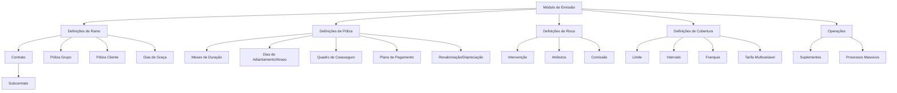
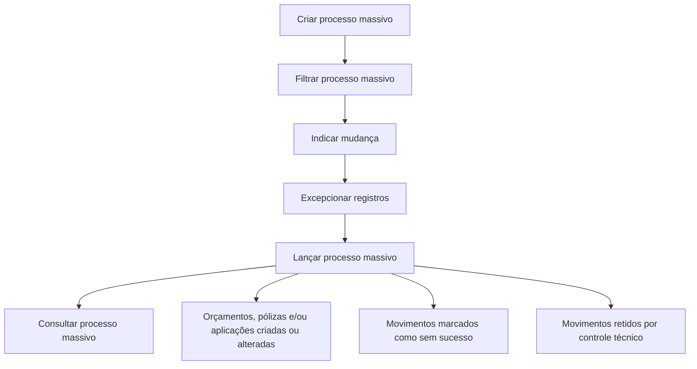

# Certificação — Emissão Nível 2: Definições, Suplementos e Processos Massivos

## 1. Metadados do Documento
- **Arquivo de Origem:** `Não identificado no conteúdo fornecido`
- **Tipo de Documento:** `Apresentação Executiva / Material de Certificação`
- **Domínio / Sistema:** `Emissão de seguros; Reef; Mapfredocument`
- **Público-Alvo:** `Negócio, operação, analistas funcionais e equipes de emissão`
- **Data/Versão Identificada:** `Não identificada`

---

## 2. Resumo Executivo & Contexto de Negócio

O documento descreve conceitos e definições do módulo de emissão de seguros no contexto de uma certificação de “Emisión Nivel 2”. O conteúdo organiza definições por níveis funcionais: ramo, póliza, risco e cobertura, além de apresentar operações de suplemento e processos massivos.

A estrutura apresentada permite configurar ou alterar características de um ramo de seguro por meio de contratos, subcontratos, clientes ou colaboradores. Essas alterações podem definir valores concretos, conjuntos de valores permitidos e condições específicas aplicáveis a clientes, grupos empresariais, riscos ou coberturas.

No nível de póliza, o material descreve controles relacionados à vigência, dias de adiantamento ou atraso, planos de pagamento, coasseguro e revalorização/depreciação. No nível de risco e cobertura, são apresentadas definições específicas de atributos, intervenções, comissões, limites, intervalos, franquias e tarifas multivariáveis.

O documento também apresenta operações que modificam uma póliza — denominadas suplementos — e o ciclo de um processo massivo, que inclui criação, filtragem, indicação de alterações, definição de exceções, execução e consulta.

---

## 3. Arquitetura, Componentes & Tecnologias Envolvidas

### Sistemas, módulos e conceitos identificados

| Componente / Termo | Papel identificado no documento |
| :--- | :--- |
| Módulo de emissão | Contexto das definições de ramo, póliza, risco e cobertura. |
| Ramo | Nível de definição de produtos ou características de seguro. |
| Contrato | Condição que altera a definição de um ramo para um ou mais clientes. |
| Subcontrato | Condição que altera condições de um contrato; pode representar condições de um grupo empresarial. |
| Póliza | Entidade de seguro sujeita a definições, suplementos, reabilitação e anulação. |
| Risco | Nível de definições aplicáveis a cada risco possível da póliza. |
| Cobertura | Nível de definições aplicáveis a cada cobertura. |
| Processo massivo | Processo em lote para criar ou alterar orçamentos, pólizas e/ou aplicações. |
| Reef | Referenciado como “DOCUMENTACIÓN Reef”. |
| Mapfredocument | Referenciado como fonte ou local de documentação. |



> **Nota de Análise:** O documento menciona Reef e Mapfredocument, mas não detalha integrações técnicas, URLs, APIs, contratos HTTP, persistência de dados ou tecnologias de implementação.

---

## 4. Regras de Negócio, Especificações Funcionais & Processos

### 4.1 Definições de ramo

O ramo contém definições pertencentes ao módulo de emissão que não são necessariamente exclusivas do ramo em definição.

- **Contrato:** condições que alteram a definição de um ramo. Aplicam-se sempre a um ou vários clientes. Um contrato pode determinar valores concretos ou vários valores permitidos.
- **Subcontrato:** condições que alteram as condições de um contrato e, por consequência, alteram a definição de um ramo. O documento cita como exemplo condições distintas aplicáveis a um grupo empresarial. Um subcontrato pode determinar valores ou grupos de valores possíveis.
- **Póliza grupo:** conjunto de pólizas independentes. As pólizas podem ser individuais, coletivas ou multirriscos. O conjunto está sujeito a algum tipo de exceção — contrato e/ou subcontrato — sobre a definição padrão do ramo.
- **Póliza cliente:** chave adicional associável a uma póliza, capaz de unir várias pólizas de um cliente ou colaborador.
- **Dias de graça:** número de dias adicionados à data de efeito de um recibo para determinar quando a póliza deve seguir ao processo de anulação por falta de pagamento.
- **Dias de graça contrato:** alteração da definição específica para um cliente ou colaborador.
- **Dias de graça subcontrato:** listado no material, sem explicação adicional visível na extração.
- **Anulação por falta de pagamento:** processo mencionado como dependente dos parâmetros considerados para determinar quais pólizas devem ser anuladas.

### 4.2 Definições no nível de póliza

As definições de póliza afetam todos os riscos possíveis da apólice.

- **Meses de duração mínimo/máximo:** fixa o número máximo e/ou mínimo de meses de vigência que uma póliza pode possuir.
- **Meses de duração mínimo/máximo contrato:** alteração da definição específica para um cliente ou colaborador.
- **Dias de adiantamento/atraso:** define quantos dias anteriores ou posteriores à data atual podem ser usados para fixar o efeito na criação ou modificação de uma póliza.
- **Dias de adiantamento/atraso contrato:** alteração da definição específica para um cliente ou colaborador.
- **Quadro de coasseguro:** define previamente as companhias que participarão no risco com conhecimento do cliente. A definição prévia é utilizada posteriormente nas emissões de póliza.
- **Intervenção contrato:** alteração da definição específica para um cliente ou colaborador.
- **Plano de pagamento contrato:** alteração da definição específica para um cliente ou colaborador.
- **Plano de pagamento cliente:** permite estabelecer planos de pagamento por cliente e aplicá-los mesmo quando o ramo não possuir plano de pagamento.
- **Revalorização/depreciação:** define como o valor de um risco é incrementado ou decrementado.
- **Atributo contrato e atributo subcontrato:** alterações de definição específica para cliente ou colaborador.

### 4.3 Definições no nível de risco

As definições de risco afetam cada um dos possíveis riscos de uma póliza.

- **Intervenção contrato:** alteração da definição específica para cliente ou colaborador.
- **Atributo contrato:** alteração da definição específica para cliente ou colaborador.
- **Atributo subcontrato:** alteração da definição específica para cliente ou colaborador.
- **Comissão contrato:** alteração da definição específica para cliente ou colaborador.

### 4.4 Definições no nível de cobertura

As definições de cobertura afetam cada cobertura definida.

- **Contrato e subcontrato:** aplicam condições que alteram a definição do ramo para clientes, colaboradores ou grupos empresariais.
- **Atributo contrato e atributo subcontrato:** alteram a definição específica para cliente ou colaborador.
- **Limite contrato:** alteração da definição específica para cliente ou colaborador.
- **Intervalo contrato e intervalo subcontrato:** alterações da definição específica para cliente ou colaborador.
- **Franquia contrato:** alteração da definição específica para cliente ou colaborador.
- **Tarifa multivariável contrato e tarifa multivariável subcontrato:** alterações da definição específica para cliente ou colaborador.
- **Comissão contrato:** alteração da definição específica para cliente ou colaborador.

### 4.5 Operações de suplemento

| Operação | Regra funcional e impacto |
| :--- | :--- |
| Anular póliza modificação | Anula o último suplemento vigente realizado sobre a póliza, desfazendo a última modificação sofrida. Pode afetar o custo do seguro. |
| Alterar póliza cambio agente | Anula comissões e recibos, regenerando comissões e recibos para um novo agente. Não afeta o custo do seguro. |
| Regularizar póliza | Modifica a póliza com impacto na anualidade anterior, isto é, no período prévio à última renovação vigente. O documento indica que este suplemento não possui cancelamento; é normal que afete o custo do seguro. |
| Liquidar póliza | Regulariza uma situação em que houve cobrança antecipada de prêmio, por exemplo, prêmio em depósito pelo pagador. Pode incrementar ou decrementar o custo do seguro. |
| Reabilitar póliza extensão vigência | Operação análoga à reabilitação de póliza, com data de reabilitação posterior à data de anulação. A alteração estende a póliza: o vencimento é deslocado pelo período em que a póliza esteve anulada. Não gera custo adicional. |
| Reabilitar póliza sem extensão vigência | Operação análoga à reabilitação com extensão de vigência, mas o tempo em que a póliza esteve anulada gera redução de custo no momento da reabilitação. |
| Reabilitar póliza modificando qualquer dado | Operação análoga à reabilitação de póliza, permitindo modificar qualquer informação da póliza. |

### 4.6 Processo massivo



1. **Criar processo massivo:** definir processo capaz de criar ou alterar orçamentos, pólizas e/ou aplicações.
2. **Filtrar processo massivo:** definir quais pólizas ou aplicações participam do processo.
3. **Indicar mudança processo massivo:** especificar as alterações que serão realizadas nas pólizas e/ou aplicações participantes.
4. **Excepcionar processo massivo:** determinar quais orçamentos, pólizas ou aplicações previamente selecionados serão excluídos do processo.
5. **Lançar processo massivo:** executar o processo. Os resultados possíveis incluem registros criados ou alterados, movimentos sem sucesso e movimentos retidos por controle técnico.
6. **Consultar processo massivo:** acessar as informações existentes relacionadas ao processo massivo.

---

## 5. Tabelas de Parâmetros, Ambientes e Estruturas de Dados

| Item / Parâmetro | Descrição / Função | Tipo / Valores / Formato | Ambiente / Observações |
| :--- | :--- | :--- | :--- |
| Contrato | Altera a definição de um ramo para um ou mais clientes. | Valores concretos ou vários valores permitidos. | Aplicável ao módulo de emissão. |
| Subcontrato | Altera condições de contrato e a definição de ramo. | Valores ou grupos de valores possíveis. | Exemplo citado: grupo empresarial. |
| Póliza grupo | Agrupa pólizas independentes. | Individual, coletiva ou multirriscos. | Sujeita a exceções de contrato e/ou subcontrato. |
| Póliza cliente | Chave adicional associada à póliza. | Não detalhado. | Pode unir várias pólizas de cliente ou colaborador. |
| Dias de graça | Determina prazo adicional para anulação por falta de pagamento. | Número de dias. | Adicionado ao efeito de um recibo. |
| Meses duração mínimo/máximo | Controla a vigência permitida de uma póliza. | Número mínimo e/ou máximo de meses. | Nível de póliza. |
| Dias de adiantamento/atraso | Controla datas de efeito para criação ou modificação de póliza. | Número de dias antes ou depois da data atual. | Nível de póliza. |
| Quadro de coasseguro | Define previamente companhias participantes do risco. | Companhias participantes não especificadas. | Uso posterior em emissões de póliza. |
| Plano de pagamento cliente | Aplica planos de pagamento por cliente. | Não detalhado. | Pode ser aplicado mesmo que o ramo não o possua. |
| Revalorização/depreciação | Define aumento ou redução do valor de risco. | Não detalhado. | Nível de póliza. |
| Limite contrato | Altera definição específica. | Não detalhado. | Nível de cobertura. |
| Intervalo contrato/subcontrato | Altera definição específica. | Não detalhado. | Nível de cobertura. |
| Franquia contrato | Altera definição específica. | Não detalhado. | Nível de cobertura. |
| Tarifa multivariável contrato/subcontrato | Altera definição específica. | Não detalhado. | Nível de cobertura. |
| Comissão contrato | Altera definição específica. | Não detalhado. | Citada para risco e cobertura. |
| Reef | Repositório ou contexto de documentação mencionado. | `DOCUMENTACIÓN Reef`. | Sem URL ou detalhes técnicos na extração. |
| Mapfredocument | Referência documental. | `Mapfredocument`. | Sem detalhes adicionais na extração. |
| Owner | Proprietário indicado no conteúdo. | `user:agonzalez_mapfre.com` | Dado transcrito literalmente. |
| Lifecycle | Ciclo de vida do documento. | `Approved` | Dado transcrito literalmente. |
| Source | Origem indicada no conteúdo. | `VL` | Dado transcrito literalmente. |

---

## 6. Bateria de Perguntas & Respostas para RAG (FAQ Sintético)

### P1: O que é um contrato no módulo de emissão?
**R:** Um contrato é uma condição que altera a definição de um ramo de seguro. O contrato aplica-se sempre a um ou mais clientes e pode determinar valores concretos ou vários valores permitidos.

### P2: Qual é a diferença entre contrato e subcontrato?
**R:** O contrato altera diretamente a definição de um ramo para um ou mais clientes. O subcontrato altera as condições de um contrato e, consequentemente, também altera a definição do ramo. O documento cita como exemplo as condições distintas aplicáveis a um grupo empresarial.

### P3: Como os dias de graça influenciam a anulação por falta de pagamento?
**R:** Dias de graça são o número de dias adicionados à data de efeito de um recibo para determinar quando uma póliza deve passar ao processo de anulação por falta de pagamento.

### P4: Qual é a finalidade dos meses de duração mínimo e máximo de uma póliza?
**R:** Os meses de duração mínimo e máximo definem o número mínimo e/ou máximo de meses de vigência que uma póliza pode possuir.

### P5: O que controlam os dias de adiantamento e atraso?
**R:** Os dias de adiantamento e atraso determinam quantos dias antes ou depois da data atual podem ser utilizados para fixar a data de efeito na criação ou modificação de uma póliza.

### P6: O que é um quadro de coasseguro?
**R:** O quadro de coasseguro define previamente as companhias que participarão de um risco com conhecimento do cliente. Essa definição prévia é utilizada posteriormente nas emissões de póliza.

### P7: O que ocorre na operação “ALTERAR póliza cambio agente”?
**R:** A operação anula as comissões e os recibos existentes e regenera comissões e recibos para um novo agente. Segundo o documento, essa operação não afeta o custo do seguro.

### P8: O que significa regularizar uma póliza?
**R:** Regularizar uma póliza é uma modificação que afeta a anualidade anterior, isto é, o período anterior à última renovação vigente. O documento afirma que esse suplemento não possui cancelamento e normalmente afeta o custo do seguro.

### P9: Qual é a diferença entre reabilitação com extensão e sem extensão de vigência?
**R:** Na reabilitação com extensão de vigência, a data de reabilitação é posterior à data de anulação, deslocando o vencimento pelo período em que a póliza esteve anulada, sem custo adicional. Na reabilitação sem extensão, o período de anulação gera uma redução de custo no momento da reabilitação.

### P10: Quais são as etapas de um processo massivo?
**R:** As etapas são: criar o processo massivo, filtrar as pólizas ou aplicações participantes, indicar as alterações, definir exceções, lançar a execução e consultar as informações do processo.

### P11: Quais resultados podem ocorrer ao lançar um processo massivo?
**R:** Ao lançar o processo massivo, orçamentos, pólizas e/ou aplicações podem ser criados ou alterados. Outros movimentos podem ser marcados como sem sucesso ou retidos por controle técnico.

### P12: O documento detalha APIs, métodos HTTP ou contratos JSON do módulo de emissão?
**R:** Não. O documento apresenta definições funcionais e operacionais de emissão, pólizas, suplementos e processos massivos, mas não detalha APIs, métodos HTTP, contratos JSON, URLs técnicas ou tecnologias de implementação.

---

## 7. Glossário de Termos, Siglas & Conceitos-Chave

- **Anulação por falta de pagamento:** processo para anular pólizas com base em parâmetros que determinam ausência de pagamento.
- **Aplicação:** entidade citada como participante de processos massivos; o documento não fornece definição adicional.
- **Cobertura:** definição que afeta cada cobertura definida de uma póliza.
- **Coasseguro:** participação pré-definida de companhias em um risco.
- **Contrato:** condição que altera a definição de ramo para clientes.
- **Franquia:** definição citada no nível de cobertura; sem detalhamento adicional.
- **Intervenção:** definição citada nos níveis de póliza e risco; sem detalhamento adicional.
- **Póliza:** entidade de seguro sujeita a emissão, alteração, suplemento, anulação e reabilitação.
- **Póliza cliente:** chave adicional capaz de associar diversas pólizas de cliente ou colaborador.
- **Póliza grupo:** conjunto de pólizas independentes sujeito a exceções de contrato e/ou subcontrato.
- **Ramo:** nível de definição de seguro no módulo de emissão.
- **Reabilitação:** operação aplicada a póliza anulada, com modalidades de extensão, sem extensão ou alteração de dados.
- **Reef:** referência de documentação citada no conteúdo.
- **Risco:** definição que afeta cada risco possível de uma póliza.
- **Subcontrato:** condição que altera um contrato e, por consequência, a definição de ramo.
- **Suplemento:** operação relacionada à modificação das informações de uma póliza ou aplicação.
- **Tarifa multivariável:** definição de cobertura citada para contrato e subcontrato, sem detalhamento de cálculo.

---

## 8. Notas Críticas, Riscos & Limitações

- O material não identifica nome de arquivo, data, versão, autor formal ou escopo completo da certificação.
- O conteúdo não apresenta detalhes de implementação, APIs, bancos de dados, integrações, endpoints, tecnologias, autenticação ou procedimentos operacionais de execução.
- Diversos itens são apenas listados como “alteração da definição específica para um cliente ou colaborador”, sem indicar quais atributos podem ser alterados, critérios de precedência ou regras de conflito entre contrato e subcontrato.
- O documento menciona que processos massivos podem resultar em movimentos sem sucesso ou retidos por controle técnico, mas não define códigos de erro, critérios de retenção, procedimentos de reprocessamento ou responsáveis operacionais.
- A extração contém caracteres corrompidos em palavras como “definiciones” e “modificación”; a interpretação foi preservada apenas quando o significado era inequivocamente identificável no texto.
- **Nota de Análise:** O documento lista Reef, Mapfredocument e um proprietário documental, porém não detalha os mecanismos de acesso, governança documental ou relação técnica desses elementos com o módulo de emissão.

---

## 9. Conteúdo Bruto Estruturado (Referência Fiel)

```text
--- [PÁGINA 1 DE 4] ---

CERTIFICACIÓN - EMISIÓN NIVEL 2
DEFINICIÓN
OPERACIÓN
DEFINICIÓN
RAMO
Son definiciones que siendo del módulo de emisión, no son exclusivas del ramo que se está definiendo. Por ejemplo:
CONTRATO
Condiciones que alteran la definición de un ramo. Estas condiciones aplican siempre a uno o varios clientes. También se pueden determinar valores concretos o varios valores permitidos
SUBCONTRATO
Condiciones que alteran las condiciones de un contrato y, por consiguiente alteran la definición de un ramo. Un ejemplo puede ser las distintas condiciones que rigen a un grupo empresarial. Al igual que el contrato, se pueden determinar valores o grupos de valores posibles
PÓLIZA GRUPO
Conjunto de pólizas independientes. Estas, pueden ser individuales, colectivas o multi-riesgo. Siempre el conjunto está sujeto a algún tipo de excepción (contrato y/o subcontrato) sobre la definición del ramo estándar
PÓLIZA CLIENTE
Clave adicional que puede asociarse a una póliza y que puede unir varias pólizas de un cliente o colaborador
DÍAS DE GRACIA
Número de días que se adicionan al efecto de un recibo para determinar que debe pasar al proceso de anulación por falta de pago
DÍAS DE GRACIA CONTRATO
Alteración de la definición específica para un cliente o colaborador
DÍAS DE GRACIA SUBCONTRATO
ANULACIÓN FALTA PAGO
DOCUMENTOS DE ENTRADA/SALIDA
CONTRATO
Documentation / DOCUMENTACIÓN Reef
DOCUMENTACIÓN Reef
Mapfredocument
DOCUMENTACIÓN Reef
Owner
user:agonzalez_mapfre.com
Lifecycle
Approved
Source
VL

--- [PÁGINA 2 DE 4] ---

Alteración de la definición específica para un cliente o colaborador
Parámetros que tendrá en cuenta este proceso a la hora de determinar qué pólizas deben anularse por falta de pago
Alteración de la definición específica para un cliente o colaborador
PÓLIZA
En este nivel se encuentran definiciones que afectarán a todos los posibles riesgos de la póliza. Entre otros se define:
MESES DURACIÓN MÍNIMO/MÁXIMO
Se fija el número máximo y/o mínimo de meses de vigencia que una póliza puede disponer
MESES DURACIÓN MÍNIMO/MÁXIMO CONTRATO
Alteración de la definición específica para un cliente o colaborador
DÍAS DE ADELANTO/ATRASO
Con cuantos días previos o posteriores al día de hoy se puede fijar el efecto en la creación o modificación de una póliza
DÍAS DE ADELANTO/ATRASO CONTRATO
Alteración de la definición específica para un cliente o colaborador
CUADRO COASEGURO
Se establecen de forma previa aquellas compañías que participarán en el riesgo con el conocimiento del cliente. Esta definición previa es para uso posterior en las emisiones de póliza
INTERVENCIÓN CONTRATO
Alteración de la definición específica para un cliente o colaborador
PLAN DE PAGO CONTRATO
Alteración de la definición específica para un cliente o colaborador
PLAN DE PAGO CLIENTE
Establecer planes de pago por cliente y aplicarlos aunque el ramo no disponga de él
REVALORIZACIÓN/DEPRECIACIÓN
Fijar como se incrementa o decrementa el valor de un riesgo
CONTRATO
Condiciones que alteran la definición de un ramo. Estas condiciones aplican siempre a uno o varios clientes. También se pueden determinar valores concretos o varios valores permitidos
SUBCONTRATO
Condiciones que alteran las condiciones de un contrato y, por consiguiente alteran la definición de un ramo. Un ejemplo puede ser las distintas condiciones que rigen a un grupo empresarial. Al igual que el contrato, se pueden determinar valores o grupos de valores posibles
ATRIBUTO CONTRATO
Alteración de la definición específica para un cliente o colaborador
ATRIBUTO SUBCONTRATO
Alteración de la definición específica para un cliente o colaborador
RIESGO
Definiciones que afectan a cada uno de los posibles riesgos de la póliza. Por ejemplo:
INTERVENCIÓN CONTRATO
ATRIBUTO CONTRATO
ATRIBUTO SUBCONTRATO

--- [PÁGINA 3 DE 4] ---

Alteración de la definición específica para un cliente o colaborador
Alteración de la definición específica para un cliente o colaborador
Alteración de la definición específica para un cliente o colaborador
COMISIÓN CONTRATO
Alteración de la definición específica para un cliente o colaborador
COBERTURA
Definiciones que afectan a cada una de las coberturas definidas. Por ejemplo:
CONTRATO
Condiciones que alteran la definición de un ramo. Estas condiciones aplican siempre a uno o varios clientes. También se pueden determinar valores concretos o varios valores permitidos
SUBCONTRATO
Condiciones que alteran las condiciones de un contrato y, por consiguiente alteran la definición de un ramo. Un ejemplo puede ser las distintas condiciones que rigen a un grupo empresarial. Al igual que el contrato, se pueden determinar valores o grupos de valores posibles
ATRIBUTO CONTRATO
Alteración de la definición específica para un cliente o colaborador
ATRIBUTO SUBCONTRATO
Alteración de la definición específica para un cliente o colaborador
LÍMITE CONTRATO
Alteración de la definición específica para un cliente o colaborador
INTERVALO CONTRATO
Alteración de la definición específica para un cliente o colaborador
INTERVALO SUBCONTRATO
Alteración de la definición específica para un cliente o colaborador
FRANQUICIA CONTRATO
Alteración de la definición específica para un cliente o colaborador
TARIFA MULTIVARIABLE CONTRATO
Alteración de la definición específica para un cliente o colaborador
TARIFA MULTIVARIABLE SUBCONTRATO
Alteración de la definición específica para un cliente o colaborador
COMISIÓN CONTRATO
Alteración de la definición específica para un cliente o colaborador
OPERACIÓN
SUPLEMENTO
Operaciones relacionadas con la modificación de la información que contiene una póliza o aplicación
ANULAR póliza modificación
Consiste en anular el último suplemento vigente realizado sobre la póliza. Es decir, se "deshace" la última modificación que haya sufrido la póliza. Puede afectar al coste del seguro
ALTERAR póliza cambio agente
Realiza la anulación de las comisiones y recibos y regenera las comisiones y recibos para un nuevo agente. No afecta al coste del seguro
REGULARIZAR póliza
Modificación de la póliza que afecta a la anualidad anterior. Es decir, al periodo previo a la última renovación vigente. Tiene la particularidad de que este suplemento no halla la cancelación por lo

--- [PÁGINA 4 DE 4] ---

que es normal que afecte al coste del seguro
LIQUIDAR póliza
Modificación que permite regularizar la situación cuando hubo un cobro anticipado de prima (por ejemplo hubo una prima en depósito por parte del pagador). Este suplemento puede implicar un incremento o decremento del coste del seguro
REHABILITAR póliza extensión vigencia
Operación análoga a REHABILITAR póliza, salvo que la fecha de rehabilitación es posterior a la fecha de anulación de la póliza. Este cambio en la fecha, implica una extensión de la póliza (el vencimiento se mueve tanto tiempo como la póliza estuvo anulada) y no genera coste adicional del seguro
REHABILITAR póliza sin extensión vigencia
Análoga a la operación REHABILITAR póliza extensión vigencia, salvo que el tiempo en el que la póliza estuvo anulada genera una reducción de coste a la hora de rehabilitar
REHABILITAR póliza modificando cualquier dato
Análoga a la operación REHABILITAR póliza, pero permite modificar cualquier información de esta
PROCESOS MASIVOS
Operaciones relacionadas con procesos por lotes
CREAR proceso masivo
Se define un proceso masivo que permita crear o alterar presupuestos, pólizas y/o aplicaciones
FILTRAR proceso masivo
Permite la definición de qué pólizas o aplicaciones intervienen en un proceso masivo
INDICAR CAMBIO proceso masivo
Se especifican los cambios a realizar en el proceso masivo y que sufrirán las pólizas y/o aplicaciones que participen en él
EXCEPCIONAR proceso masivo
Se determina qué presupuesto, pólizas o aplicaciones inicialmente seleccionadas pasan a estar excluidas del proceso masivo
LANZAR proceso masivo
Ejecución del proceso masivo donde una serie de presupuestos, póliza y/o aplicaciones serán creadas o alteradas, otras quedarán marcadas como que el movimiento no tuvo éxito y otras quedarán retenidas por control técnico
CONSULTAR proceso masivo
Facilita el acceso a la información que existe relacionado con el proceso masivo
Checking links...
```
