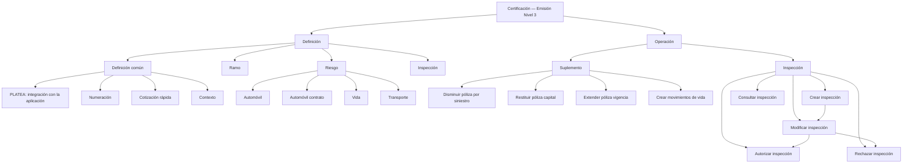
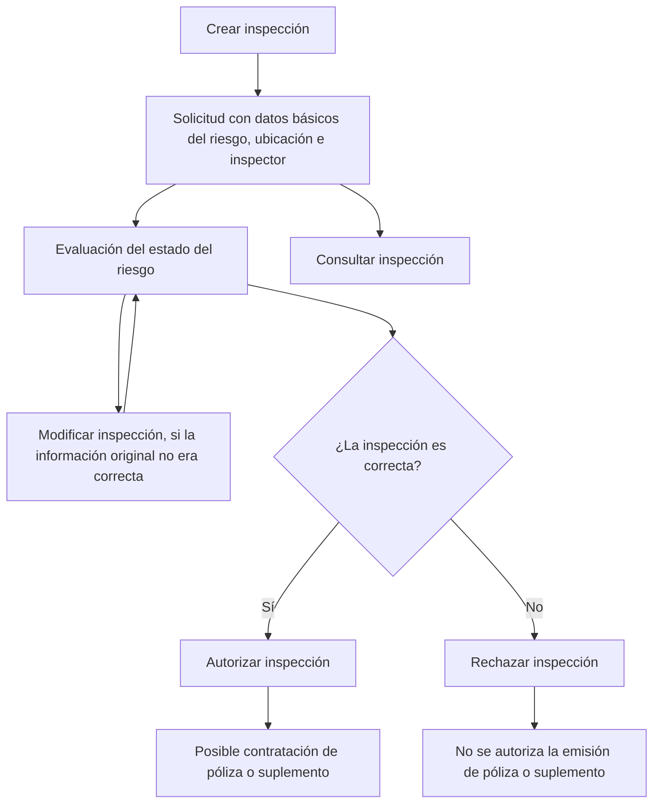

# Certificación — Emisión Nivel 3: Definiciones, Suplementos e Inspecciones

## 1. Metadados do Documento
- **Arquivo de Origem:** Não identificado no conteúdo fornecido
- **Tipo de Documento:** Manual Operacional
- **Domínio / Sistema:** Documentación Reef / módulo de emisión / seguros
- **Público-Alvo:** Negócio, operação, analistas funcionais e equipes de emissão de seguros
- **Data/Versão Identificada:** Não identificada

---

## 2. Resumo Executivo & Contexto de Negócio

O documento descreve conceitos de **Certificación — Emisión Nivel 3**, organizando definições e operações necessárias para a emissão e manutenção de apólices de seguros. O conteúdo diferencia definições comuns, definições relacionadas ao ramo de seguro, ao risco segurado, à integração com PLATEA e às operações de suplemento e inspeção.

As definições comuns incluem elementos necessários para configurar informações que não são exclusivas do módulo de emissão, mas que são indispensáveis para realizar a definição. Entre os exemplos apresentados estão PLATEA, ramo, numeração, cotação rápida e contexto.

No domínio de seguros, o documento explica configurações por risco, incluindo automóvel, automóvel contrato, vida, transporte e inspeção. Também apresenta operações que modificam dados contidos em uma apólice ou aplicação, com destaque para movimentos que alteram capital segurado, vigência, contribuições, antecipações, resgates e reduções.

O material define operações de inspeção de risco, desde a criação de uma solicitação até sua modificação, autorização, rejeição e consulta. A autorização de uma inspeção permite a contratação da apólice ou suplemento; a rejeição impede a emissão correspondente.

**Nota de Análise:** O documento não detalha interfaces de usuário, métodos HTTP, APIs, contratos JSON, persistência de dados, responsáveis operacionais, regras de autorização por perfil ou integrações técnicas além da referência a PLATEA.

---

## 3. Arquitetura, Componentes & Tecnologias Envolvidas

Os elementos identificados são:

| Componente / Conceito | Papel descrito no documento |
| :--- | :--- |
| Certificación — Emisión Nivel 3 | Nível de definição e operação apresentado pelo documento. |
| Módulo de emisión | Módulo de seguros ao qual pertencem algumas definições de ramo. |
| PLATEA | Aplicação ou ativo para o qual existem definições necessárias de integração. |
| Ramo | Agrupamento de definições do módulo de emissão que não são exclusivas do ramo em definição. |
| Riesgo | Conjunto de definições que afetam os possíveis riscos de uma apólice. |
| Suplemento | Operações relacionadas à modificação de informações contidas em uma apólice ou aplicação. |
| Inspección | Definições e operações relacionadas à revisão de riscos contratados. |
| Documentación Reef | Repositório ou contexto documental mencionado na extração. |
| Mapfredocument | Elemento de navegação ou sistema mencionado no conteúdo bruto. |
| Zeus | Elemento de navegação ou sistema mencionado no conteúdo bruto. |



**Nota de Análise:** O diagrama representa exclusivamente a relação conceitual extraída do texto. O documento não especifica arquitetura física, servidores, tecnologias de implementação, protocolos de comunicação ou fluxos de integração detalhados.

---

## 4. Regras de Negócio, Especificações Funcionais & Processos

### 4.1 Definições comuns

As definições comuns não são exclusivas do módulo de emissão, mas são necessárias para que as definições possam ser realizadas.

- **PLATEA:** definição necessária para integração com essa aplicação.
- **Ramo:** inclui definições que pertencem ao módulo de emissão, mas não são exclusivas do ramo que está sendo definido.
- **Numeração:** determina quais elementos formarão e em qual ordem serão compostos o número da apólice e o número do orçamento.
- **Cotação rápida:** processo que devolve o preço de várias simulações com o mínimo de informação requerida ao cliente. A definição determina:
  - as simulações para as quais será fornecido preço;
  - as informações solicitadas ao cliente;
  - as informações que não serão solicitadas ao cliente;
  - para cada informação não solicitada, o valor que será considerado para calcular ou fornecer o preço.
- **Contexto:** permite criar ambientes para determinar quais informações ou atributos não devem ser exibidos.

### 4.2 Definições relacionadas a risco

As definições de risco afetam cada um dos possíveis riscos incluídos em uma apólice.

- **Automóvel:** contém definições exclusivas para ramos de negócio do tipo automóvel, como definição de matrículas, marcas e modelos.
- **Automóvel contrato:** consiste em alteração da definição específica para um cliente ou colaborador.
- **Vida:** o documento a classifica como definição exclusiva para ramos do tipo negócio automóvel e cita exemplos como matrículas, marcas e modelos.
- **Transporte:** o documento a classifica como definição exclusiva para ramos do tipo negócio automóvel e cita exemplos como matrículas, marcas e modelos.
- **Inspeção:** define quando e como devem ser realizadas inspeções dos riscos contratados. As inspeções podem ocorrer antes da contratação ou durante o processo de contratação.

**Nota de Análise:** As descrições de **Vida** e **Transporte** repetem literalmente a formulação referente a “ramos del tipo de negocio automóvil”. O conteúdo fornecido não esclarece se essa repetição é intencional ou uma inconsistência do documento original.

### 4.3 Operações de suplemento

As operações de suplemento estão relacionadas à modificação das informações contidas em uma apólice ou aplicação.

#### DISMINUIR póliza por siniestro

Reduz a soma segurada de uma ou mais coberturas afetadas na tramitação de um sinistro. A redução coincide com a liquidação realizada pela tramitação. Essa operação não afeta o custo do seguro.

#### RESTITUIR póliza capital

Restitui a soma segurada previamente reduzida pela tramitação de um sinistro. A restituição afeta o custo do seguro.

#### EXTENDER póliza vigencia

Altera o vencimento da apólice, levando-o para uma data posterior ao vencimento original. Essa alteração afeta o custo do seguro.

#### CREAR aportación extraordinaria

Movimento gerado quando é adicionada uma quantia econômica extra de forma pontual, com a finalidade de incrementar expectativas de rentabilidade.

#### CREAR anticipo

No seguro de vida, para modalidades de contrato que preveem direito de resgate, representa a quantia que o segurado pode receber por conta do capital que lhe corresponderá quando forem cumpridas as condições estabelecidas na apólice.

#### CREAR cobro de anticipo

Consolidação de um anticipo.

#### CREAR prorrogado

Transformação por redução da apólice na qual o capital segurado para caso de vida é reduzido ou até anulado. Entretanto, o capital para caso de morte continua vigente durante determinado período.

#### CREAR reducción

Movimento que ocorre quando o contratante ou segurado deixa de pagar os prêmios estipulados. A apólice original é rescindida e surge um novo seguro, com:

- prêmio único representado pelas reservas matemáticas constituídas em favor do segurado no contrato original;
- capital segurado diminuído conforme os prêmios pagos até aquele momento.

#### CREAR rescate

Modificação realizada por vontade do segurado, pela qual o segurado recebe o valor que lhe corresponde — o valor de resgate — da provisão matemática constituída sobre o risco garantido. Após o resgate, a apólice resgatada fica automaticamente rescindida.

#### CREAR rescate parcial

Movimento equivalente a **CREAR rescate**, mas o valor recebido pelo segurado não é o total.

### 4.4 Operações de inspeção

As operações de inspeção relacionam-se às revisões de riscos.

| Etapa | Regra funcional | Resultado operacional |
| :--- | :--- | :--- |
| Criar inspeção | Gera uma solicitação de inspeção de risco com dados básicos do risco, localização e inspetor. | O risco pode ser avaliado quanto ao seu estado e à possibilidade de ser segurado pela companhia. |
| Modificar inspeção | Atualiza a solicitação quando a informação original não estava totalmente correta. | A solicitação passa a refletir as informações corrigidas. |
| Autorizar inspeção | Ocorre após a realização da inspeção, quando ela é considerada correta. | A contratação da apólice ou do suplemento torna-se possível. |
| Rejeitar inspeção | Ocorre após a realização da inspeção, quando ela não é considerada correta. | A emissão da apólice ou do suplemento não é autorizada. |
| Consultar inspeção | Permite acessar a informação armazenada sobre uma inspeção. | Informações registradas ficam disponíveis para consulta. |



---

## 5. Tabelas de Parâmetros, Ambientes e Estruturas de Dados

### 5.1 Definições e parâmetros funcionais

| Item / Parâmetro | Descrição / Função | Tipo / Valores / Formato | Ambiente / Observações |
| :--- | :--- | :--- | :--- |
| PLATEA | Definição necessária para integração com uma aplicação. | Não especificado. | O documento também menciona definições relacionadas com a integração com este ativo. |
| Ramo | Agrupa definições do módulo de emissão que não são exclusivas do ramo em definição. | Não especificado. | Exemplo de definição de emissão não exclusiva. |
| Numeração | Determina elementos e ordem de composição do número da apólice e do orçamento. | Elementos e ordem não especificados. | Aplicável a apólice e orçamento. |
| Cotação rápida | Devolve preço para várias simulações com informação mínima requerida ao cliente. | Simulações, informações solicitadas, informações não solicitadas e valores assumidos. | Não detalha fórmula de preço nem critérios de cálculo. |
| Contexto | Determina quais informações ou atributos não serão mostrados em ambientes criados. | Atributos ou informações não especificados. | Não especifica critérios de visibilidade. |
| Automóvel | Definições exclusivas para ramos do tipo negócio automóvel. | Matrículas, marcas, modelos e outros não especificados. | Aplicável a risco automóvel. |
| Automóvel contrato | Altera uma definição específica para cliente ou colaborador. | Cliente ou colaborador. | Não detalha quais atributos podem ser alterados. |
| Vida | Definição de risco conforme apresentada no documento. | O documento cita matrículas, marcas e modelos. | A descrição fornecida associa Vida a negócio automóvel. |
| Transporte | Definição de risco conforme apresentada no documento. | O documento cita matrículas, marcas e modelos. | A descrição fornecida associa Transporte a negócio automóvel. |
| Inspeção | Define quando e como inspecionar riscos contratados. | Pré-contratação ou processo de contratação. | Não especifica critérios, periodicidade ou responsáveis. |

### 5.2 Operações de suplemento

| Item / Parâmetro | Descrição / Função | Tipo / Valores / Formato | Ambiente / Observações |
| :--- | :--- | :--- | :--- |
| DISMINUIR póliza por siniestro | Reduz a soma segurada de coberturas afetadas por sinistro. | Uma ou várias coberturas. | Redução coincide com a liquidação; não afeta o custo do seguro. |
| RESTITUIR póliza capital | Restitui capital anteriormente reduzido devido a sinistro. | Soma segurada. | Afeta o custo do seguro. |
| EXTENDER póliza vigencia | Posterga o vencimento da apólice para data posterior ao vencimento original. | Nova data de vencimento. | Afeta o custo do seguro. |
| CREAR aportación extraordinaria | Adiciona quantia econômica extra pontual. | Quantia econômica extra. | Finalidade: incrementar expectativas de rentabilidade. |
| CREAR anticipo | Permite pagamento antecipado ao segurado em seguro de vida com direito de resgate. | Quantia por conta de capital futuro. | Condicionado às condições estabelecidas na apólice. |
| CREAR cobro de anticipo | Consolida um anticipo. | Não especificado. | Sem detalhamento adicional. |
| CREAR prorrogado | Reduz ou anula capital para caso de vida, mantendo capital de morte durante certo tempo. | Capital de vida e capital de morte. | Transformação por redução da apólice. |
| CREAR reducción | Rescinde apólice original por inadimplência e cria novo seguro com prêmio único. | Reservas matemáticas e capital diminuído. | Capital depende dos prêmios pagos até então. |
| CREAR rescate | Paga ao segurado o valor de resgate da provisão matemática e rescinde a apólice. | Valor de resgate. | Ocorre por vontade do segurado. |
| CREAR rescate parcial | Executa resgate sem pagamento do valor total ao segurado. | Valor parcial. | Equivalente ao resgate, mas não total. |

### 5.3 Dados de inspeção

| Item / Parâmetro | Descrição / Função | Tipo / Valores / Formato | Ambiente / Observações |
| :--- | :--- | :--- | :--- |
| Dados básicos do risco | Dados incluídos na solicitação de inspeção. | Não especificado. | Necessários para criar inspeção. |
| Localização | Informação incluída na solicitação de inspeção. | Não especificado. | Necessária para criar inspeção. |
| Inspetor | Pessoa ou referência incluída na solicitação de inspeção. | Não especificado. | Necessário para criar inspeção. |
| Resultado da inspeção | Classificação da inspeção como correta ou não correta. | Correta / não correta. | Define autorização ou rejeição para emissão. |
| Apólice | Objeto cuja contratação pode ser permitida ou não após inspeção. | Não especificado. | A emissão pode ser não autorizada após rejeição. |
| Suplemento | Objeto cuja contratação pode ser permitida ou não após inspeção. | Não especificado. | A emissão pode ser não autorizada após rejeição. |

### 5.4 Ambientes, URLs e infraestrutura

| Item / Parâmetro | Descrição / Função | Tipo / Valores / Formato | Ambiente / Observações |
| :--- | :--- | :--- | :--- |
| URLs de ambiente | Não identificadas. | Não aplicável. | O conteúdo não fornece URLs. |
| Servidores | Não identificados. | Não aplicável. | O conteúdo não fornece nomes, endereços ou portas. |
| Logs | Não identificados. | Não aplicável. | O conteúdo não fornece rotas, níveis ou variáveis de log. |
| Tecnologias de implementação | Não identificadas. | Não aplicável. | O conteúdo não especifica linguagens, frameworks ou bancos de dados. |

---

## 6. Bateria de Perguntas & Respostas para RAG (FAQ Sintético)

### P1: Qual é o objetivo de “Certificación — Emisión Nivel 3”?
**R:** O documento organiza definições e operações associadas ao módulo de emissão de seguros. O escopo cobre definições comuns, definições de ramo e risco, operações de suplemento e operações de inspeção de riscos.

### P2: Para que serve a definição de numeração no módulo de emissão?
**R:** A definição de numeração determina quais elementos formarão e em qual ordem serão compostos o número da apólice e o número do orçamento.

### P3: O que é uma cotação rápida segundo o documento?
**R:** Cotação rápida é um processo que devolve o preço de várias simulações usando o mínimo de informações requeridas ao cliente. A configuração define as simulações precificadas, quais informações serão solicitadas, quais não serão solicitadas e quais valores serão adotados para as informações não solicitadas.

### P4: Qual é a finalidade do contexto nas definições comuns?
**R:** O contexto permite criar ambientes nos quais é possível determinar que determinadas informações ou atributos não devem ser exibidos. O documento não detalha os atributos disponíveis nem os critérios de visibilidade.

### P5: A operação DISMINUIR póliza por siniestro altera o custo do seguro?
**R:** Não. A operação reduz a soma segurada de uma ou mais coberturas afetadas pela tramitação de um sinistro, em valor coincidente com a liquidação realizada, mas não afeta o custo do seguro.

### P6: Qual é a diferença entre DISMINUIR póliza por siniestro e RESTITUIR póliza capital?
**R:** DISMINUIR póliza por siniestro reduz a soma segurada das coberturas afetadas por um sinistro e não altera o custo do seguro. RESTITUIR póliza capital recompõe uma soma segurada previamente reduzida pela tramitação de um sinistro e afeta o custo do seguro.

### P7: O que ocorre quando a vigência de uma apólice é estendida?
**R:** A operação EXTENDER póliza vigencia altera o vencimento da apólice para uma data posterior ao vencimento original. Essa alteração afeta o custo do seguro.

### P8: Em que situação pode ser criado um anticipo no seguro de vida?
**R:** CREAR anticipo aplica-se ao seguro de vida e a modalidades de contrato nas quais foi previsto o direito de resgate. O segurado pode receber uma quantia por conta do capital que lhe corresponderá, desde que sejam cumpridas as condições estabelecidas na apólice.

### P9: O que acontece com a apólice após um CREAR rescate?
**R:** O segurado recebe o valor de resgate correspondente à provisão matemática constituída sobre o risco garantido. Após a realização do resgate, a apólice resgatada fica automaticamente rescindida.

### P10: Como funciona o movimento CREAR reducción?
**R:** CREAR reducción ocorre quando o contratante ou segurado deixa de pagar os prêmios estipulados. A apólice original é rescindida e surge um novo seguro com prêmio único representado pelas reservas matemáticas constituídas no contrato original e com capital segurado reduzido conforme os prêmios pagos até então.

### P11: Quais informações são incluídas na criação de uma inspeção?
**R:** CREAR inspección gera uma solicitação de inspeção de risco contendo os dados básicos do risco, a localização e o inspetor. A finalidade é avaliar o estado do risco e determinar se ele pode ou não ser segurado pela companhia.

### P12: Qual é o efeito de autorizar uma inspeção?
**R:** AUTORIZAR inspección ocorre quando a inspeção já foi realizada e é considerada correta. A autorização torna possível a contratação da apólice ou do suplemento.

### P13: O que ocorre quando uma inspeção é rejeitada?
**R:** RECHAZAR inspección ocorre quando a inspeção realizada não é considerada correta. Nessa situação, a emissão da apólice ou do suplemento não é autorizada.

### P14: O documento define APIs, métodos HTTP ou contratos JSON para PLATEA?
**R:** Não. O documento informa apenas que PLATEA requer uma definição para integração com a aplicação e menciona definições relacionadas com a integração com esse ativo. Não há detalhamento de APIs, métodos HTTP, endpoints, contratos JSON ou protocolos.

---

## 7. Glossário de Termos, Siglas & Conceitos-Chave

- **Apólice / Póliza:** contrato de seguro mencionado como objeto de emissão, modificação, redução, restituição, extensão de vigência, resgate ou inspeção.
- **Cotação rápida / Cotización rápida:** processo que retorna preço para várias simulações com o mínimo de informações requeridas do cliente.
- **Emisión:** módulo ou processo relacionado à emissão de apólices de seguro.
- **Inspetor / Inspector:** informação incluída na solicitação de inspeção de risco.
- **Inspeção / Inspección:** definição e conjunto de operações relacionados à revisão de riscos contratados.
- **PLATEA:** aplicação ou ativo mencionado como alvo de definições necessárias para integração.
- **Prêmio / Prima:** pagamento estipulado no contrato; a falta de pagamento pode desencadear CREAR reducción.
- **Provisão matemática / Provisión matemática:** provisão constituída sobre o risco garantido, da qual é extraído o valor de resgate.
- **Ramo:** agrupamento de definições do módulo de emissão que não são exclusivas do ramo sendo definido.
- **Resgate / Rescate:** modificação pela qual o segurado recebe o valor que lhe corresponde da provisão matemática; no resgate total, a apólice é rescindida.
- **Risco / Riesgo:** elemento segurável afetado pelas definições de automóvel, vida, transporte e inspeção.
- **Sinistro / Siniestro:** evento cuja tramitação pode provocar redução ou restituição de soma segurada.
- **Suplemento:** operação relacionada à modificação da informação contida em uma apólice ou aplicação.
- **Soma segurada / Suma asegurada:** valor associado a uma ou mais coberturas, que pode ser reduzido por sinistro ou posteriormente restituído.

---

## 8. Notas Críticas, Riscos & Limitações

- O conteúdo não identifica o arquivo de origem, data, versão, autor técnico ou responsáveis pelo processo.
- O texto não descreve APIs, contratos de integração, endpoints, autenticação, métodos HTTP, formatos de mensagens, bancos de dados, filas, logs ou infraestrutura.
- Não há URLs, nomes de servidores, portas, variáveis de configuração, ambientes de desenvolvimento, homologação ou produção.
- O documento menciona integração com **PLATEA**, mas não especifica o fluxo de integração, dados trocados, dependências, disponibilidade ou tratamento de falhas.
- Não são definidos critérios objetivos para considerar uma inspeção “correta” ou “não correta”.
- Não são detalhadas regras de cálculo de custo do seguro para RESTITUIR póliza capital e EXTENDER póliza vigencia, embora o documento afirme que ambas as operações afetam o custo.
- Não são informados perfis autorizados a criar, modificar, autorizar, rejeitar ou consultar inspeções.
- As descrições de **Vida** e **Transporte** reproduzem conteúdo associado a negócio automóvel; o documento não oferece esclarecimento adicional.
- O texto extraído contém caracteres corrompidos em palavras como “definición”, “modificación” e “fin”, apresentados no conteúdo bruto como `denición`, `modicación` e `n`.

---

## 9. Conteúdo Bruto Estruturado (Referência Fiel)

```text
--- [PÁGINA 1 DE 3] ---

CERTIFICACIÓN - EMISIÓN NIVEL 3
DEFINICIÓN
OPERACIÓN
DEFINICIÓN
COMÚN
En este nivel se encuentran deniciones que no son exclusivas del módulo de emisión, pero son necesarias
para poder realizar la denición. Entre otras deniciones se encuentra:
PLATEA
Denición necesaria para la integración con esta aplicación
RAMO
Son deniciones que siendo del módulo de emisión, no son exclusivas del ramo que se está deniendo. Por
ejemplo:
NUMERACIÓN
Determinar que elementos formarán y en
que orden el número de póliza y el número
de presupuesto
COTIZACIÓN RÁPIDA
Proceso que devuelve el precio de varias
simulaciones con un mínimo de
información requerida al cliente. En este
punto se dene las simulaciones con las
que se dará precio, qué información se
solicitará y qué información no se solicita
al cliente y, para aquella información que
CONTEXTO
Se pueden crear entornos en los que
determinar que información (atributos) no
mostrar
Documentation / DOCUMENTACIÓN Reef
DOCUMENTACIÓN Reef
Mapfredocument
DOCUMENTACIÓN Reef
Owner
user:agonzalez_mapfre.com
Lifecycle
Approved Source
 / 
 VL
Buscar Inicio Soluciones Arquitecturas APIs Componentes Cloud Documentación Zeus Reef Ayuda
ES


--- [PÁGINA 2 DE 3] ---

no será solicitada, determinar el valor con
el que se contará pra dar precio
PLATEA
Deniciones relacionadas con la
integración con este activo
MARCA
Fijar eventos con un nivel de gravedad que
puede desencadenar acciones sobre
pólizas. Estas acciones pueden ser
reactivas (la póliza ya está en cartera) o
proactivas (la póliza aún no ha sido
creada)
RIESGO
Deniciones que afectan a cada uno de los posibles riesgos de la póliza. Por ejemplo:
AUTOMÓVIL
Son deniciones exclusivas para ramos
del tipo de negocio automóvil. Como por
ejemplo, la denición de matrículas,
marcas, modelos, etc.
AUTOMÓVIL CONTRATO
Alteración de la denición especíca para
un cliente o colaborador
VIDA
Son deniciones exclusivas para ramos
del tipo de negocio automóvil. Como por
ejemplo, la denición de matrículas,
marcas, modelos, etc.
TRANSPORTE
Son deniciones exclusivas para ramos
del tipo de negocio automóvil. Como por
ejemplo, la denición de matrículas,
marcas, modelos, etc.
INSPECCIÓN
Denición de cuando y como realizar
inspecciones a los riesgos contratados.
las inspecciones pueden ser previas a la
contratación o en el proceso de
contratación
OPERACIÓN
SUPLEMENTO
Operaciones relacionadas con la modicación de la información que contiene una póliza o aplicación
DISMINUIR póliza por siniestro
Reduce la suma asegurada de una o
varias coberturas afectadas en la
tramitación de un siniestro. La reducción
coincide con la liquidación realizada por la
tramitación. No afecta al coste del seguro
RESTITUIR póliza capital
Restituye la suma asegurada que
previamente ha sido reducida por la
tramitación de un siniestro. La restitución
afecta al coste del seguro
EXTENDER póliza vigencia
Altera el vencimiento de la póliza
llevándolo a una fecha posterior al
vencimiento original. Esta alteración
afecta al coste del seguro
CREAR aportación extraordinaria
Movimiento que es generado cuando se
añade una cantidad económica extra y
que se realiza de forma puntual, con el n
de incrementar las expectativas de
rentabilidad
CREAR anticipo
En el seguro de vida, y respecto a las
modalidades de contratos en los que se
ha previsto el derecho de rescate, es la
cantidad que puede percibir el asegurado
a cuenta del capital que en su momento le
CREAR cobro de anticipo
Consolidación de un anticipo


--- [PÁGINA 3 DE 3] ---

corresponda, cumplidas las condiciones
establecidas en la póliza
CREAR prorrogado
Es la transformación por reducción de la
póliza en la que, si bien se reduce o
incluso anula el capital asegurado para
caso de vida, continúa en cambio en vigor
el capital para caso de muerte durante un
cierto tiempo
CREAR reducción
Movimiento que se produce cuando, al
dejar de pagar el contratante o asegurado
las primas estipuladas, se rescinde la
póliza original, surgiendo un nuevo seguro
con   prima única representada por las
reservas matemáticas que, a favor del
asegurado, se habían constituido en el
contrato primitivo, y con un capital
asegurado disminuido, a tenor de las
primas pagadas hasta ese momento
CREAR rescate
Modicación que por voluntad del
asegurado, este percibe el importe que le
corresponde (valor de rescate) de la
provisión matemática constituida sobre el
riesgo que tenía garantizado. Efectuado el
rescate, la póliza rescatada queda
automáticamente rescindida
CREAR rescate parcial
Movimiento equivalente a CREAR rescate,
pero el importe que recibe el asegurado no
es el total
INSPECCIÓN
Operaciones relacionadas con las revisiones de riesgos
CREAR inspección
Se genera una solicitud de inspección de
riesgo con los datos básicos del riesgo,
ubicación e inspector con el n de que se
evalúe el estado y pueda o no ser
asegurado por la compañía
MODIFICAR inspección
Se actualiza la solicitud de inspección si
por cualquier motivo la información
original no era totalmente correcta
AUTORIZAR inspección
Una vez realizada la inspección, esta se
considera correcta y es posible la
contratación de la póliza o suplemento
RECHAZAR inspección
Una vez realizada la inspección, esta no se
considera correcta y no se autoriza la
emisión de la póliza o suplemento
CONSULTAR inspección
Permite el acceso a la información
almacenada acerca de una inspección
```
