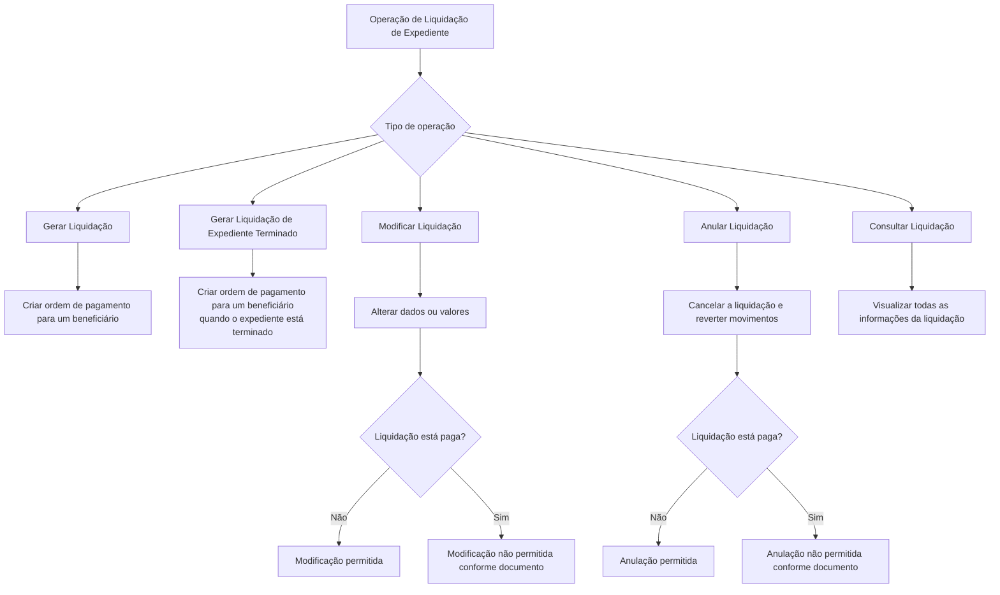

# Certificação de Sinistros — Liquidações de Expedientes: Definições e Operações

## 1. Metadados do Documento
- **Arquivo de Origem:** Não identificado — conteúdo bruto fornecido com 3 páginas
- **Tipo de Documento:** Especificação Funcional
- **Domínio / Sistema:** Sinistros — Liquidações de Expedientes; documentação Reef / Mapfre
- **Público-Alvo:** Negócio, Analistas Funcionais, Desenvolvedores e Operação
- **Data/Versão Identificada:** Não identificada

---

## 2. Resumo Executivo & Contexto de Negócio

O documento descreve as definições funcionais e as operações relacionadas a liquidações de expedientes no módulo de sinistros. O escopo contempla elementos comuns, gerais, específicos por ramo e específicos de cada liquidação de expediente.

As definições comuns abrangem cadastros e configurações necessários para operar pagamentos, cobranças, impostos, numeração de ordens de pagamento e controle técnico. Esses elementos não são exclusivos do módulo de sinistros, mas são necessários para definir e executar liquidações de expedientes.

No nível de ramo, o documento determina comportamentos aplicáveis às liquidações, tais como características gerais do módulo de sinistros, causas de processo e registro de faturas. No nível de liquidação, o documento estrutura atributos, informações iniciais, validações, coberturas, conceitos econômicos, beneficiários e limites monetários.

As operações de liquidação podem ser realizadas em linha ou de forma diferida. O documento prevê gerar liquidações, gerar liquidações para expedientes terminados, modificar liquidações ainda não pagas, anular liquidações ainda não pagas e consultar as informações de uma liquidação.

O objetivo funcional é garantir que as ordens de pagamento, cobranças, movimentos econômicos, validações e controles técnicos sejam definidos de maneira configurável e consistente durante o ciclo de liquidação de um expediente de sinistro.

---

## 3. Arquitetura, Componentes & Tecnologias Envolvidas

O documento apresenta uma organização funcional hierárquica para as definições de liquidações de expedientes:

- **Comum:** definições compartilhadas e necessárias para o módulo de sinistros.
- **Geral:** definições que afetam todas as liquidações.
- **Ramo:** definições que afetam as liquidações de determinado ramo.
- **Liquidação:** definições específicas de cada possível liquidação de um expediente.
- **Operações:** ações operacionais aplicáveis às liquidações de expediente.

São citadas referências de documentação denominadas **Documentation / DOCUMENTACIÓN Reef**, **Mapfredocument** e **Reef**. O conteúdo fornecido não descreve tecnologias, protocolos, APIs, bancos de dados, métodos HTTP, URLs de ambientes ou contratos de integração.

```mermaid
graph TD
  A[Certificação de Sinistros<br/>Liquidações de Expedientes] --> B[Definições]
  A --> C[Operações de Liquidação de Expedientes]

  B --> B1[Comum]
  B --> B2[Geral]
  B --> B3[Ramo]
  B --> B4[Liquidação]

  B1 --> B11[Oficinas Pagadoras]
  B1 --> B12[Documentos de Pagamento]
  B1 --> B13[Conceitos de Cobro e Pago]
  B1 --> B14[Imposto]
  B1 --> B15[Numeração de Ordens de Pagamento]
  B1 --> B16[Controle Técnico]

  B2 --> B21[Causas de Processos]

  B3 --> B31[Características Gerais]
  B3 --> B32[Causa Processo]

  B4 --> B41[Atributo]
  B4 --> B42[Estrutura]
  B4 --> B43[Informação Inicial]
  B4 --> B44[Validação de Informação]
  B4 --> B45[Cobertura]
  B4 --> B46[Conceito Reserva]
  B4 --> B47[Conceito Cobro Pago]
  B4 --> B48[Beneficiários Liquidação]
  B4 --> B49[Valor Inicial]
  B4 --> B410[Valor Máximo]
  B4 --> B411[Controle Técnico]

  C --> C1[Gerar Liquidação]
  C --> C2[Gerar Liquidação de Expediente Terminado]
  C --> C3[Modificar Liquidação]
  C --> C4[Anular Liquidação]
  C --> C5[Consultar Liquidação]
```



**Nota de Análise:** o documento descreve componentes funcionais e configurações, mas não detalha a implementação técnica, os serviços envolvidos, os métodos HTTP, contratos JSON, persistência de dados ou integrações externas.

---

## 4. Regras de Negócio, Especificações Funcionais & Processos

### 4.1 Definições comuns

As definições classificadas como **Comum** não são exclusivas do módulo de sinistros, porém são necessárias para realizar a definição de liquidações de expedientes.

1. **Oficinas Pagadoras:** registra as oficinas que podem realizar pagamentos.
2. **Documentos de Pagamento:** registra os documentos que podem ser pagos ou cobrados, incluindo exemplos como fatura e nota de crédito.
3. **Conceitos de Cobro e Pago:** define o desdobramento econômico que as ordens de pagamento utilizarão para detalhar o gasto.
4. **Imposto:** define os tipos de obrigações tributárias que devem ser considerados, suas características e formas de cálculo.
5. **Numeração de Ordens de Pagamento:** define o saco de ordens de pagamento.
6. **Controle Técnico:** define erros e tipos de erros de liquidações.

### 4.2 Definições gerais

As definições classificadas como **Geral** afetam todas as liquidações.

1. **Causas de Processos:** permite catalogar os motivos pelos quais se deseja realizar uma operação de liquidações.

### 4.3 Definições por ramo

As definições classificadas como **Ramo** afetam todas as liquidações do ramo.

1. **Características Gerais:** define características gerais do módulo de sinistros e determina comportamentos do módulo de liquidações. O documento cita como exemplo decidir se as faturas de sinistros serão registradas.
2. **Causa Processo:** cataloga os motivos para realizar uma operação de liquidações. O documento cita como exemplo o motivo para anulação de uma liquidação.

### 4.4 Definições por liquidação

As definições classificadas como **Liquidação** afetam cada uma das possíveis liquidações de um expediente.

1. **Atributo:** define informações adicionais da liquidação, como dados de finiquito.
2. **Estrutura:** organiza informações adicionais da liquidação compostas por atributos, obrigatoriedade ou não de solicitar informações e ordem de solicitação.
3. **Informação Inicial:** registra informações prévias para os atributos das operações de liquidação, evitando a introdução posterior desses dados. O exemplo fornecido define inicialmente a moeda da fatura com o valor da moeda do país.
4. **Validação de Informação:** define comportamentos e validações das informações de core solicitadas nas operações de liquidação. O exemplo fornecido estabelece que, se o documento for Real, o fornecedor da fatura não pode ser o tomador nem o segurado.
5. **Cobertura:** define, entre todas as coberturas definidas no produto, qual cobertura será afetada por cada tipo de expediente e qual será o comportamento nas liquidações.
6. **Conceito Reserva:** determina o desdobramento econômico do expediente para as liquidações.
7. **Conceito Cobro Pago:** determina o desdobramento econômico das liquidações.
8. **Beneficiários Liquidação:** determina as pessoas físicas e jurídicas às quais uma liquidação pode pagar ou cobrar.
9. **Valor Inicial:** define o valor utilizado para liquidar o conceito de reserva e o conceito de cobro e pago vario.
10. **Valor Máximo:** determina o valor máximo pelo qual podem ser liquidados uma cobertura, um conceito de reserva ou um conceito de cobro e pago vario.
11. **Controle Técnico:** define as condições em que as operações de liquidação podem ser paralisadas ou têm obrigação de serem autorizadas.

### 4.5 Operações de liquidação de expedientes

As operações de liquidações de um expediente podem ser executadas **em linha** ou **de forma diferida**.



### 4.6 Restrições operacionais explícitas

| Operação | Regra / Restrição |
| :--- | :--- |
| Modificar liquidação | É permitido alterar informações e valores somente quando a liquidação não estiver paga. |
| Anular liquidação | A anulação cancela a liquidação e reverte seus movimentos somente quando a liquidação não estiver paga. |
| Gerar liquidação | Cria uma ordem de pagamento para um beneficiário. |
| Gerar liquidação de expediente terminado | Cria uma ordem de pagamento para um beneficiário quando o expediente está terminado. |
| Consultar liquidação | Permite visualizar toda a informação de uma liquidação. |
| Documento Real | O fornecedor da fatura não pode ser o tomador nem o segurado. |

---

## 5. Tabelas de Parâmetros, Ambientes e Estruturas de Dados

| Item / Parâmetro | Descrição / Função | Tipo / Valores / Formato | Ambiente / Observações |
| :--- | :--- | :--- | :--- |
| Oficinas Pagadoras | Registra oficinas que podem realizar pagamentos. | Cadastro funcional | Definição comum. |
| Documentos de Pagamento | Registra documentos que podem ser pagos ou cobrados. | Exemplos: Fatura, Nota de Crédito | Definição comum. |
| Conceitos de Cobro e Pago | Define o desdobramento econômico das ordens de pagamento para detalhar o gasto. | Desdobramento econômico | Definição comum. |
| Imposto | Define obrigações tributárias, características e formas de cálculo. | Tipos de obrigações tributárias | Definição comum. |
| Numeração de Ordens de Pagamento | Define o saco de ordens de pagamento. | Numeração de ordens | Definição comum. |
| Controle Técnico comum | Define erros e tipos de erros de liquidações. | Erros de liquidação | Definição comum. |
| Causas de Processos | Cataloga motivos para realizar operações de liquidações. | Motivos de operação | Definição geral; afeta todas as liquidações. |
| Características Gerais | Determina comportamentos do módulo de liquidações. | Configuração funcional | Definição por ramo; exemplo: registrar faturas de sinistros. |
| Causa Processo | Cataloga motivos para uma operação de liquidações. | Exemplo: motivo de anulação | Definição por ramo. |
| Atributo | Define informação adicional da liquidação. | Exemplo: dados de finiquito | Definição por liquidação. |
| Estrutura | Organiza atributos, obrigatoriedade das informações e ordem de solicitação. | Estrutura de atributos | Definição por liquidação. |
| Informação Inicial | Registra valores prévios para atributos de operações de liquidação. | Exemplo: moeda da fatura = moeda do país | Definição por liquidação. |
| Validação de Informação | Define comportamentos e validações das informações de core. | Regra condicional | Documento Real: fornecedor não pode ser tomador ou segurado. |
| Cobertura | Define cobertura afetada por tipo de expediente e comportamento nas liquidações. | Coberturas de produto | Definição por liquidação. |
| Conceito Reserva | Determina o desdobramento econômico do expediente para liquidações. | Desdobramento econômico | Definição por liquidação. |
| Conceito Cobro Pago | Determina o desdobramento econômico das liquidações. | Desdobramento econômico | Definição por liquidação. |
| Beneficiários Liquidação | Define pessoas físicas e jurídicas que podem receber ou pagar uma liquidação. | Pessoa física ou jurídica | Definição por liquidação. |
| Valor Inicial | Define o valor para liquidar conceito de reserva e conceito de cobro e pago vario. | Importe | Definição por liquidação. |
| Valor Máximo | Determina o valor máximo para liquidar cobertura, conceito de reserva ou conceito de cobro e pago vario. | Importe máximo | Definição por liquidação. |
| Controle Técnico de liquidação | Define condições de paralisação ou autorização obrigatória de operações. | Condições de controle | Definição por liquidação. |
| Modalidade de execução | Define como operações de liquidação podem ser realizadas. | Em linha ou diferido | Aplicável a operações de liquidações de expediente. |

---

## 6. Bateria de Perguntas & Respostas para RAG (FAQ Sintético)

### P1: Quais são os níveis de definição para liquidações de expedientes no módulo de sinistros?
**R:** O documento organiza as definições em quatro níveis: Comum, Geral, Ramo e Liquidação. O nível Comum reúne definições não exclusivas de sinistros, mas necessárias para liquidações. O nível Geral afeta todas as liquidações. O nível Ramo define comportamentos aplicáveis às liquidações do ramo. O nível Liquidação contém definições específicas de cada possível liquidação de um expediente.

### P2: O que são Oficinas Pagadoras na definição comum de liquidações?
**R:** Oficinas Pagadoras são um registro de oficinas que podem realizar pagamentos. O documento classifica esse cadastro como uma definição comum, necessária para a operação de liquidações de expedientes.

### P3: Quais documentos podem ser registrados em Documentos de Pagamento?
**R:** Documentos de Pagamento registram documentos que podem ser pagos ou cobrados. O documento fornece como exemplos uma fatura e uma nota de crédito, sem apresentar uma lista exaustiva de tipos documentais.

### P4: Para que serve a Causa Processo no contexto de liquidações?
**R:** Causa Processo permite catalogar os motivos pelos quais se deseja realizar uma operação de liquidações. O documento cita como exemplo o motivo para anulação de uma liquidação.

### P5: Qual validação é aplicada quando o documento é Real?
**R:** Quando o documento é Real, o fornecedor da fatura não pode ser o tomador nem o segurado. Essa regra é apresentada como exemplo de validação de informação de core solicitada nas operações de liquidação.

### P6: O que a Estrutura de uma liquidação define?
**R:** A Estrutura define informações adicionais da liquidação compostas por atributos. A Estrutura também define se uma informação é obrigatória ou não e a ordem em que as informações serão solicitadas.

### P7: Como a Informação Inicial evita o preenchimento posterior de dados?
**R:** Informação Inicial permite registrar previamente informações para os atributos das operações de liquidação, evitando a introdução desses dados em momento posterior. O exemplo fornecido atribui inicialmente à moeda da fatura o valor da moeda do país.

### P8: Quando uma liquidação pode ser modificada?
**R:** Uma liquidação pode ser modificada para alterar informações e valores somente quando ainda não estiver paga. O documento não detalha as validações técnicas, perfis de autorização ou campos específicos disponíveis para modificação.

### P9: Quando uma liquidação pode ser anulada e qual é o efeito da anulação?
**R:** Uma liquidação pode ser anulada somente quando não estiver paga. A anulação cancela a liquidação e reverte seus movimentos.

### P10: Qual é a diferença entre Gerar Liquidação e Gerar Liquidação de Expediente Terminado?
**R:** Gerar Liquidação permite criar uma ordem de pagamento para um beneficiário. Gerar Liquidação de Expediente Terminado também cria uma ordem de pagamento para um beneficiário, mas é aplicável quando o expediente está terminado.

### P11: Como são definidos os beneficiários de uma liquidação?
**R:** Beneficiários Liquidação determina as pessoas físicas e jurídicas às quais se pode pagar ou cobrar uma liquidação.

### P12: O que controla o Valor Máximo em uma liquidação?
**R:** Valor Máximo determina o importe máximo pelo qual podem ser liquidados uma cobertura, um conceito de reserva ou um conceito de cobro e pago vario.

### P13: Como as operações de liquidação de expediente podem ser executadas?
**R:** As operações de liquidações de um expediente podem ser realizadas tanto em linha quanto de forma diferida. O documento não especifica os mecanismos técnicos, filas, serviços ou critérios de seleção entre execução em linha e execução diferida.

---

## 7. Glossário de Termos, Siglas & Conceitos-Chave

- **Cobertura:** elemento definido no produto que pode ser afetado por cada tipo de expediente e possuir comportamento específico nas liquidações.
- **Cobro:** termo utilizado no documento para cobrança.
- **Conceito Cobro Pago:** definição do desdobramento econômico das liquidações.
- **Conceito Reserva:** definição do desdobramento econômico do expediente para liquidações.
- **Controle Técnico:** definição de erros, condições de paralisação e obrigação de autorização em operações de liquidação.
- **Expediente:** unidade sobre a qual são realizadas operações de liquidação no módulo de sinistros.
- **Finiquito:** exemplo de informação adicional que pode ser definida por meio de um atributo de liquidação.
- **Liquidação:** operação e conjunto de definições aplicáveis ao pagamento, cobrança, importes, movimentos e informações de um expediente.
- **Mapfredocument:** referência citada no conteúdo de documentação.
- **Nota de Crédito:** exemplo de documento que pode ser pago ou cobrado.
- **Ordem de Pagamento:** ordem criada para um beneficiário durante a geração de uma liquidação.
- **Reef:** referência de documentação citada como “DOCUMENTACIÓN Reef”.
- **Ramo:** nível de definição que afeta as liquidações relacionadas ao ramo.
- **Tomador:** parte que não pode ser fornecedor da fatura quando o documento é Real, conforme a regra de validação apresentada.

---

## 8. Notas Críticas, Riscos & Limitações

- O documento não identifica nome de arquivo, data, versão, autor técnico ou responsável funcional, exceto a referência textual `user:agonzalez_mapfre.com`.
- O conteúdo não detalha arquitetura técnica, APIs, microsserviços, tecnologias, ambientes, servidores, URLs, portas, filas, bancos de dados ou mecanismos de autenticação.
- O documento não define os critérios objetivos usados pelo Controle Técnico para paralisar uma operação de liquidação ou exigir autorização.
- O documento não especifica quais atributos, coberturas, conceitos de reserva, conceitos de cobro e pago ou beneficiários estão efetivamente configurados.
- O documento não detalha o significado técnico de “em linha” e “diferido”, nem o comportamento operacional de cada modalidade.
- A expressão “saco de ordens de pagamento” é reproduzida fielmente do documento, mas não recebe explicação adicional.
- Há artefatos de codificação no texto bruto, como `Deniciones`, `Ocinas` e `beneciario`; a interpretação funcional foi limitada ao conteúdo legível e contextualizado.
- **Nota de Análise:** o documento lista funções e regras de liquidação, porém não detalha contratos de entrada e saída, métodos HTTP, formatos de mensagens ou modelos de dados persistidos.

---

## 9. Conteúdo Bruto Estruturado (Referência Fiel)

```text
--- [PÁGINA 1 DE 3] ---

CERTIFICACIÓN de SINIESTROS - LIQUIDACIONES
Deniciones Liquidaciones de Expedientes
Operaciones de Liquidaciones de Expedientes
DEFINICIONES
COMÚN
En este nivel se encuentran deniciones que NO son exclusivas del módulo de siniestros, pero son
necesarias para poder realizar la denición. Entre otras deniciones se encuentra:
OFICINAS PAGADORAS
Registro de Ocinas que pueden realizar
pagos
DOCUMENTOS DE PAGO
Registro de Documentos que se pueden
pagar o cobrar. Factura, Nota de Crédito..
CONCEPTOS COBRO Y PAGO
Denición del desglose económico que
llevarán las órdenes de pago para detallar
el gasto
IMPUESTO
Denición de los tipos de obligaciones
tributarias que se deben tener en cuenta,
así como sus características y formas de
cálculo
NUMERACIÓN ORDENES PAGO
Denición del saco de órdenes de pago
CONTROL TÉCNICO
Denición de errores, tipos de Errores de
liquidaciones
GENERAL
En este nivel se encuentran deniciones que afectarán a todas las liquidaciones
CAUSAS DE PROCESOS 
Documentation / DOCUMENTACIÓN Reef
DOCUMENTACIÓN Reef
Mapfredocument
DOCUMENTACIÓN Reef
Owner
user:agonzalez_mapfre.com
Lifecycle
Approved Source
 / 
 VL
Buscar Inicio Soluciones Arquitecturas APIs Componentes Cloud Documentación Zeus Reef Ayuda
ES


--- [PÁGINA 2 DE 3] ---

Permite catalogar los motivos por los que se quiere realizar una operación de liquidaciones
RAMO
En este nivel se encuentran deniciones que afectarán a todos las liquidaciones. Entre otros se dene:
CARACTERÍSTICAS GENERALES 
Características Generales del módulo de siniestros, determina
comportamientos del módulo liquidaciones por ejemplo si se va
van a registrar las facturas de siniestros...
CAUSA PROCESO 
Permite catalogar los motivos por los que se quiere realizar una
operación de liquidaciones. Ejemplo: Motivo para la Anulación de
una liquidación
LIQUIDACIÓN
Deniciones que afectan a cada uno de las posibles liquidaciones de un expediente
ATRIBUTO
Permite denir la información adicional de
la liquidación, como datos de niquito
ESTRUCTURA
Información adicional de la liquidación
compuesta por atributos, obligatoriedad o
no de pedir información, orden en el que
se va a pedir
INFORMACIÓN INICIAL
Registrar información previa para los
atributos de las operaciones de
liquidaciones, para no tener que
introducirla posteriormente. Un ejemplo
sería dar a la moneda de la factura
inicialmente el valor de la moneda del país
VALIDACIÓN INFORMACIÓN
Denir comportamientos y validaciones de
la información de core que se piden en las
operaciones de liquidaciones. Ejemplo si
el documento es Real el Proveedor de la
factura no puede ser el tomador, o el
asegurado
COBERTURA 
Denir de todas las coberturas denidas
en el producto, cual va a ser afectada por
cada uno de los tipos de expedientes y su
comportamiento en las liquidaciones
CONCEPTO RESERVA 
Determinar el desglose económico del
expediente para las liquidaciones
CONCEPTO COBRO PAGO 
Determina el desglose económico de las
liquidaciones
BENEFICIARIOS LIQUIDACIÓN
Determina las personas físicas y Jurídicas
a las que se les puede pagar o cobrar una
liquidación
VALOR INICIAL
Denición del importe con el que se va a
liquidar el concepto de reserva y el
concepto de cobro y pago vario
VALOR MÁXIMO
Determinar el importe Máximo por el que
se puede liquidar una cobertura concepto
de reserva, concepto de cobro y pago
vario
CONTROL TÉCNICO
Denir en qué condiciones se puede
paralizar las operaciones de liquidación u
obligación de ser autorizada
OPERACIONES
LIQUIDACIÓN DE EXPEDIENTES


--- [PÁGINA 3 DE 3] ---

Operaciones de liquidaciones de un expediente, se pueden realizar tanto en línea como diferido
GENERAR liquidación
Permite crear una orden de pago para un
beneciario
GENERAR liquidación Expediente
Terminado
Permite crear una orden de pago para un
beneciario,cuando el expediente está
terminado
MODIFICAR liquidación
Permite cambiar la información de una
liquidación, tanto datos, como importes
siempre que no esté pagada
ANULAR liquidación
Cancela una liquidación, revierte sus
movimientos siempre y cuando no esté
pagada
CONSULTAR liquidación
Visualiza toda la información de una
liquidación
```
