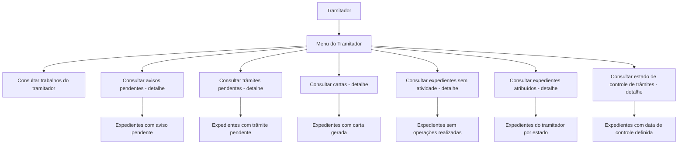

# Certificação de Sinistros — Operações do Menu do Tramitador no Reef

## 1. Metadados do Documento
- **Arquivo de Origem:** Não identificado
- **Tipo de Documento:** Manual Operacional
- **Domínio / Sistema:** Reef — Certificação de Sinistros
- **Público-Alvo:** Tramitadores, Operação e Negócio
- **Data/Versão Identificada:** Não identificada

---

## 2. Resumo Executivo & Contexto de Negócio

O documento descreve o **Menu do Tramitador** no contexto de **Certificação de Sinistros** do sistema Reef. O menu é apresentado como a ferramenta básica e fundamental na qual um tramitador realiza todo o seu trabalho operacional.

As operações documentadas são consultas destinadas a localizar expedientes, avisos, trâmites, cartas e trabalhos pendentes. As consultas retornam conjuntos de expedientes conforme o tipo de pendência, estado, carta gerada, ausência de atividade ou data de controle definida.

Diversas consultas são condicionadas pelos filtros informados pelo tramitador. O documento indica que esses filtros são aplicáveis a avisos pendentes, trâmites pendentes, cartas, expedientes sem atividade, expedientes atribuídos e estado de controle de trâmites.

O material não detalha telas, permissões, campos de filtro, contratos de integração, métodos HTTP, tecnologia de implementação ou critérios de ordenação dos resultados.

---

## 3. Arquitetura, Componentes & Tecnologias Envolvidas

Os elementos identificados no documento são:

- **Reef:** sistema ou domínio documental em que está registrada a documentação.
- **Certificação de Sinistros:** contexto funcional da operação.
- **Menu do Tramitador:** ponto central de operação para consultas do tramitador.
- **Tramitador:** usuário operacional que realiza consultas e aplica condições de filtro.
- **Expedientes:** registros consultados pelas operações.
- **Avisos pendentes:** avisos associados a expedientes e ainda pendentes.
- **Trâmites pendentes:** trâmites associados a expedientes e ainda pendentes.
- **Cartas:** cartas geradas para expedientes.
- **Estado de expediente:** exemplos citados incluem pendente, em juízo e retido por C.T.
- **Data de controle:** data definida para controle, associada ao tempo máximo para realização.



> **Nota de Análise:** O documento não descreve arquitetura técnica, bases de dados, interfaces, APIs, integrações, protocolos ou tecnologias utilizadas pelo Reef.

---

## 4. Regras de Negócio, Especificações Funcionais & Processos

### 4.1. Papel do Menu do Tramitador

O Menu do Tramitador é definido como a ferramenta básica e fundamental na qual um tramitador realiza todo o seu trabalho. O documento agrupa as funcionalidades sob a categoria **Operações**.

### 4.2. Consultar trabalhos do tramitador

A operação apresenta os trabalhos pendentes, avisos pendentes e trâmites próximos de caducar.

Critérios explicitamente citados:

- Trabalhos pendentes.
- Avisos pendentes.
- Trâmites a ponto de caducar.

O documento não detalha os critérios para determinar que um trâmite está “a ponto de caducar”.

### 4.3. Consultar avisos pendentes — detalhe

A operação apresenta todos os expedientes que possuam o aviso indicado como pendente.

Critérios explicitamente citados:

- O aviso deve estar pendente.
- O tramitador indica o aviso a consultar.
- A consulta considera as condições filtradas pelo tramitador.

### 4.4. Consultar trâmites pendentes — detalhe

A operação apresenta todos os expedientes que possuam o trâmite indicado como pendente.

Critérios explicitamente citados:

- O trâmite deve estar pendente.
- O tramitador indica o trâmite a consultar.
- A consulta considera as condições filtradas pelo tramitador.

### 4.5. Consultar cartas — detalhe

A operação apresenta todos os expedientes para os quais foi gerada a carta indicada.

Critérios explicitamente citados:

- A carta indicada deve ter sido gerada para o expediente.
- A consulta considera as condições filtradas pelo tramitador.

### 4.6. Consultar expedientes sem atividade — detalhe

A operação apresenta todos os expedientes nos quais não foi realizada nenhuma operação.

Critérios explicitamente citados:

- Nenhuma operação deve ter sido realizada no expediente.
- A consulta considera as condições filtradas pelo tramitador.

### 4.7. Consultar expedientes atribuídos — detalhe

A operação apresenta os expedientes do tramitador conforme o estado informado e as condições filtradas.

Estados exemplificados no documento:

- Pendente.
- Em juízo.
- Retido por C.T.

O documento não informa se os estados citados constituem uma lista completa de estados possíveis.

### 4.8. Consultar estado de controle de trâmites — detalhe

A operação apresenta os expedientes que possuam uma data de controle definida, associada ao tempo máximo para realização, no estado indicado pelo tramitador.

Critérios explicitamente citados:

- O expediente deve possuir data de controle definida.
- A data de controle representa o tempo máximo para realização.
- O tramitador indica o estado.
- A consulta considera as condições filtradas pelo tramitador.

---

## 5. Tabelas de Parâmetros, Ambientes e Estruturas de Dados

| Item / Parâmetro | Descrição / Função | Tipo / Valores / Formato | Ambiente / Observações |
| :--- | :--- | :--- | :--- |
| Menu do Tramitador | Ferramenta básica e fundamental para o trabalho do tramitador | Menu funcional | Associado à Certificação de Sinistros |
| Tramitador | Usuário que executa operações e define filtros ou estados de consulta | Papel operacional | O documento não descreve permissões |
| Condições filtradas | Condições aplicadas pelo tramitador às consultas | Filtros não detalhados | Citadas em várias operações de detalhe |
| Aviso indicado | Aviso usado como critério na consulta de avisos pendentes | Valor não detalhado | Deve estar pendente |
| Trâmite indicado | Trâmite usado como critério na consulta de trâmites pendentes | Valor não detalhado | Deve estar pendente |
| Carta indicada | Carta usada como critério na consulta de cartas | Valor não detalhado | Deve ter sido gerada para o expediente |
| Estado do expediente | Estado usado para consultar expedientes atribuídos | Pendente; em juízo; retido por C.T. | Valores apresentados como exemplos no documento |
| Data de controle | Data definida para controle de trâmites | Data; formato não informado | Representa o tempo máximo para realização |
| Expediente sem atividade | Expediente no qual não foi realizada nenhuma operação | Condição de consulta | Sujeito aos filtros do tramitador |
| Trâmite a ponto de caducar | Trâmite próximo de caducar | Condição de pendência | Regra de cálculo não detalhada |

---

## 6. Bateria de Perguntas & Respostas para RAG (FAQ Sintético)

### P1: Qual é a finalidade do Menu do Tramitador na Certificação de Sinistros?
**R:** O Menu do Tramitador é a ferramenta básica e fundamental em que um tramitador realiza todo o seu trabalho. O documento descreve operações de consulta de trabalhos, avisos, trâmites, cartas e expedientes.

### P2: O que mostra a consulta de trabalhos do tramitador?
**R:** A consulta de trabalhos do tramitador mostra trabalhos pendentes, avisos pendentes e trâmites que estão a ponto de caducar.

### P3: Como localizar expedientes com um aviso pendente específico?
**R:** Deve-se utilizar a operação **Consultar avisos pendentes — detalhe**. A operação mostra todos os expedientes que tenham o aviso indicado pendente, considerando as condições filtradas pelo tramitador.

### P4: Como consultar expedientes com um trâmite pendente?
**R:** Deve-se utilizar a operação **Consultar trâmites pendentes — detalhe**. A consulta mostra todos os expedientes que tenham o trâmite indicado pendente, conforme as condições filtradas pelo tramitador.

### P5: Qual operação permite consultar expedientes para os quais uma carta foi gerada?
**R:** A operação **Consultar cartas — detalhe** mostra todos os expedientes para os quais foi gerada a carta indicada, respeitando as condições filtradas pelo tramitador.

### P6: Como identificar expedientes sem qualquer operação realizada?
**R:** A operação **Consultar expedientes sem atividade — detalhe** mostra os expedientes nos quais não foi realizada nenhuma operação, de acordo com as condições filtradas pelo tramitador.

### P7: Quais estados de expediente são citados na consulta de expedientes atribuídos?
**R:** O documento cita os estados **pendente**, **em juízo** e **retido por C.T.** como exemplos de estados usados na consulta de expedientes atribuídos ao tramitador.

### P8: Como funciona a consulta de expedientes atribuídos ao tramitador?
**R:** A operação **Consultar expedientes atribuídos — detalhe** mostra os expedientes do tramitador com o estado indicado, como pendente, em juízo ou retido por C.T., além das condições filtradas pelo tramitador.

### P9: O que é a data de controle de um trâmite?
**R:** A data de controle é uma data definida no expediente e representa o tempo máximo para que uma realização ocorra. O documento não informa o formato da data nem a regra para calcular esse prazo.

### P10: Como consultar expedientes com data de controle definida?
**R:** Deve-se utilizar a operação **Consultar estado de controle de trâmites — detalhe**. A consulta mostra expedientes que tenham data de controle definida, no estado indicado pelo tramitador e sob as condições filtradas por esse usuário.

### P11: O documento define quais filtros o tramitador pode utilizar?
**R:** Não. O documento informa que várias consultas consideram condições filtradas pelo tramitador, mas não detalha os campos, valores, operadores ou regras desses filtros.

### P12: O documento descreve APIs ou contratos técnicos do Menu do Tramitador?
**R:** Não. O conteúdo descreve funcionalidades operacionais de consulta, mas não especifica métodos HTTP, APIs, contratos JSON, integrações, autenticação ou tecnologias de implementação.

---

## 7. Glossário de Termos, Siglas & Conceitos-Chave

- **Reef:** nome do sistema ou domínio documental identificado na origem.
- **Certificação de Sinistros:** contexto funcional mencionado no título da operação.
- **Tramitador:** usuário que realiza o trabalho operacional por meio do Menu do Tramitador.
- **Menu do Tramitador:** ferramenta operacional principal para execução das consultas descritas.
- **Expediente:** registro consultado nas operações do Menu do Tramitador.
- **Aviso pendente:** aviso associado a um expediente que permanece pendente.
- **Trâmite pendente:** trâmite associado a um expediente que permanece pendente.
- **Carta:** comunicação ou documento gerado para um expediente.
- **Data de controle:** data que representa o tempo máximo para realização de uma ação ou trâmite.
- **C.T.:** sigla citada no estado “retido por C.T.”; o significado não é detalhado no documento.

---

## 8. Notas Críticas, Riscos & Limitações

- O arquivo de origem, data, versão e responsável pelo documento não foram identificados de forma completa no conteúdo fornecido.
- O documento não descreve os campos, operadores, valores permitidos ou combinações das condições de filtro aplicadas pelo tramitador.
- Não há definição da regra que determina quando um trâmite está “a ponto de caducar”.
- A lista de estados de expedientes não é apresentada como exaustiva; apenas pendente, em juízo e retido por C.T. são citados.
- A sigla **C.T.** não é expandida ou definida.
- Não há detalhamento de permissões, segurança, auditoria, perfis, tempos de resposta, tratamento de erros ou critérios de ordenação das consultas.
- Não há especificações técnicas de arquitetura, APIs, banco de dados, integrações ou contratos de dados.

---

## 9. Conteúdo Bruto Estruturado (Referência Fiel)

```text
--- [PÁGINA 1 DE 2] ---

Documentation / DOCUMENTACIÓN Reef
DOCUMENTACIÓN Reef
Mapfredocument
DOCUMENTACIÓN Reef
Owner
user:agonzalez_mapfre.com
Lifecycle
Approved Source
 /
 VL
Buscar Inicio Soluciones Arquitecturas APIs Componentes Cloud Documentación Zeus Reef Ayuda
ES


--- [PÁGINA 2 DE 2] ---

CERTIFICACIÓN de SINIESTROS - MENÚ DEL TRAMITADOR
OPERACIONES
MENÚ DEL TRAMITADOR
Operaciones que se pueden realizar desde el menú del tamitador. Esta es la herramienta básica y
fundamental en la que un tramitador va a realizar todo su trabajo
CONSULTAR trabajos tramitador
Muestra todos los trabajos pendientes,
avisos pendientes, trámites a punto de
caducar...
CONSULTAR avisos pendientes detalle
Muestra todos los expedientes que tengan
el aviso indicado pendiente, con las
condiciones que haya �ltrado el tramitador
CONSULTAR tramites pendientes detalle
Muestra todos los expedientes que tengan
el trámite indicado pendiente con las
condiciones que haya �ltrado el tramitador
CONSULTAR cartas detalle
Muestra todos los expedientes a los que
se les haya generado la carta indicada,
con las condiciones que haya �ltrado el
tramitador
CONSULTAR expedientes sin actividad
detalle
Muestra todos los expedientes que no se
haya realizado ninguna operación con
ellos, con las condiciones que haya
�ltrado el tramitador
CONSULTAR expedientes asignados
detalle
Muestra todos los expedientes que tenga
el tramitador con el estado (pendiente, en
juicio, retenido por c.t...) y las condiciones
que haya �ltrado el tramitador
CONSULTAR estado control tramites
detalle
Muestra todos los expedientes que tengan
de�nido fecha de control (tiempo máximo
para realizarse) en el estado que indique
el tramitador y las condiciones que haya
�ltrado el tramitador
```
