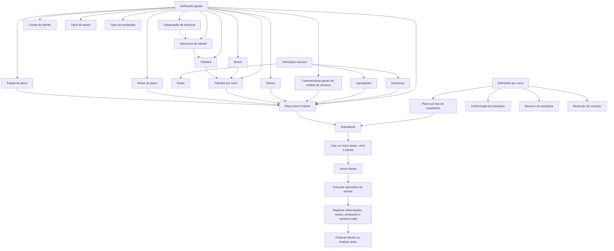

# Certificação de Sinistros — Plano de Tramitação: Definições e Operações

## 1. Metadados do Documento
- **Arquivo de Origem:** `Não identificado no conteúdo fornecido`
- **Tipo de Documento:** `Especificação Técnica`
- **Domínio / Sistema:** `REEF / Mapfre — módulo de sinistros e Plano de Tramitação`
- **Público-Alvo:** `Tramitadores, utilizadores com papéis no plano de tramitação e equipas de configuração do módulo de sinistros`
- **Data/Versão Identificada:** `Não identificada`
- **Estado documental identificado:** `Lifecycle: Approved Source`

---

## 2. Resumo Executivo & Contexto de Negócio

O documento descreve as definições e as operações do **Plano de Tramitação** no módulo de sinistros da documentação REEF. O Plano de Tramitação estrutura os passos necessários para processar um expediente de sinistro, agrupando trâmites em níveis e associando operações, observações, cartas, avisos, anotações e papéis de execução.

A configuração está organizada em definições comuns, definições gerais do Plano de Tramitação e definições por ramo. As definições comuns incluem estruturas de informação, agrupações de estruturas e notas para obtenção de comunicados. As definições gerais determinam características do módulo, códigos de planos, níveis, trâmites, associações e permissões por papel.

No contexto de um ramo, o documento estabelece que um tipo de expediente e um tipo de dano podem ser associados a um plano fixo ou a um plano determinado por lógica de negócio que avalia condições especiais. Também são previstas perguntas de confirmação, resumos para tramitadores e restrições de consulta aplicáveis a tramitadores de um centro telefônico.

As operações descritas permitem atribuir e manter o Plano de Tramitação de um expediente, executar e finalizar trâmites, criar e finalizar avisos, registrar anotações livres, postergar datas de aviso, gerar cartas ou e-mails, modificar datas de controle e consultar integralmente o plano.

---

## 3. Arquitetura, Componentes & Tecnologias Envolvidas

O documento não descreve tecnologias de implementação, protocolos, APIs, bancos de dados, URLs de execução, servidores, métodos HTTP ou contratos JSON. O conteúdo concentra-se no modelo funcional e configurável do módulo de sinistros REEF.

### Componentes e conceitos identificados

| Componente / Conceito | Função identificada |
| :--- | :--- |
| REEF | Sistema ou domínio documental em que se encontra a documentação do Plano de Tramitação. |
| Mapfre | Organização mencionada no contexto da documentação. |
| Módulo de sinistros | Módulo cujas características gerais determinam comportamentos do Plano de Tramitação. |
| Plano de Tramitação | Definição completa dos passos para tramitar um expediente, agrupados em níveis. |
| Expediente | Entidade que recebe um Plano de Tramitação e sobre a qual são registrados avisos, anotações e operações. |
| Sinistro | Entidade na qual podem ser registrados avisos e anotações visíveis em todos os expedientes do sinistro. |
| Nível | Agrupação de trâmites. |
| Trâmite | Cada passo que deve ser realizado para completar um processo. |
| Estrutura | Conjunto de atributos que formam uma estrutura de informação. |
| Agrupação | Associação de estruturas de informação à agrupação do Plano de Tramitação. |
| Operação de trâmite | Operação que pode ser realizada em um trâmite. |
| Observação de estrutura | Informação gravada no plano quando uma operação é executada. |
| Papel do plano | Papel que define quais níveis do Plano de Tramitação podem ser executados. |
| Ramo | Contexto no qual são configuradas definições específicas do Plano de Tramitação. |
| Tipo de expediente | Critério para definir o plano que tratará um tipo de dano. |
| Tipo de dano | Critério associado ao tipo de expediente para determinação do Plano de Tramitação. |
| Aviso | Recordatório associado a sinistro, expediente ou trâmite. |
| Anotação livre | Registro textual associado a sinistro, expediente ou trâmite. |
| Carta / e-mail | Texto que pode ser gerado e enviado a distintos destinatários. |



> **Nota de Análise:** O documento lista conceitos funcionais do Plano de Tramitação, mas não detalha a arquitetura técnica interna, interfaces entre sistemas, persistência de dados, métodos HTTP, contratos JSON ou tecnologias utilizadas.

---

## 4. Regras de Negócio, Especificações Funcionais & Processos

### 4.1 Definições comuns anteriores ao Plano de Tramitação

As definições comuns são prévias ao Plano de Tramitação. Nesse nível são configuradas definições que não são exclusivas de sinistros, mas necessárias para realizar a definição do Plano de Tramitação.

1. **Estrutura:** define um conjunto de atributos que forma uma estrutura de informação.
2. **Agrupação:** associa estruturas de informação à agrupação do Plano de Tramitação.
3. **Notas:** define informação de notas para obtenção de comunicados.

### 4.2 Definições gerais do Plano de Tramitação

1. **Características gerais:** determinam comportamentos do módulo de sinistros relacionados ao Plano de Tramitação.
   - O documento exemplifica a definição de uso de papéis.
   - O documento exemplifica a definição de uso de datas de controle.
   - O documento exemplifica a definição de uso do calendário laboral para cálculo de datas.

2. **Plano:** define códigos de planos que serão associados aos tipos de expedientes.

3. **Nível:** representa uma agrupação de trâmites.

4. **Trâmite:** representa cada passo necessário para completar um processo.

5. **Trâmites por nível:** associa trâmites da mesma natureza sob um nível.
   - Exemplo apresentado: um nível de peritação pode agrupar todos os trâmites de peritações.

6. **Níveis do plano:** define os diferentes níveis que compõem um plano.

7. **Plano-Nível-Trâmite:** representa a definição completa de um Plano de Tramitação, contendo todos os passos que podem ser realizados para tramitar o expediente, agrupados em níveis.

8. **Estruturas de trâmite:** define a operação ou as operações que podem ser realizadas em um trâmite.
   - Exemplo apresentado: o trâmite de solicitação de peritação executa a solicitação de peritação.

9. **Observação de estrutura:** define a observação que será gravada no plano cada vez que uma operação for executada.
   - Exemplo apresentado: quando é executada uma liquidação, a observação pode registrar a quem se paga e o importe.

10. **Cartas de trâmite:** define textos que podem ser enviados a distintos destinatários.

11. **Tipos de avisos:** tipifica os diferentes avisos que podem ser gerados.

12. **Tipos de anotações:** define as diferentes anotações livres que podem ser realizadas.

13. **Papéis do plano:** define papéis para trabalhar com os Planos de Tramitação.
   - Podem existir papéis autorizados somente a executar o nível de peritações.
   - Podem existir papéis autorizados somente a executar o nível de juízos.

### 4.3 Definições por ramo

1. **Plano por tipo de expediente:** define, para cada tipo de expediente e tipo de dano, qual Plano de Tramitação será responsável por tratar o dano.
   - O plano pode ser fixo.
   - O plano pode ser determinado por lógica de negócio que avalia condições especiais.

2. **Confirmação do tramitador:** define perguntas para confirmação de trâmites.
   - Exemplos apresentados: confirmar perda total, confirmar coberturas e confirmar situação de apólice.

3. **Resumo do tramitador:** define a informação do Plano de Tramitação visível para cada tramitador.
   - Exemplos apresentados: número de casos pendentes por tipo de expediente e número de avisos pendentes.

4. **Restrição de consulta:** define trâmites, níveis e tipos de trâmites que os tramitadores de um centro telefônico podem ou não podem consultar.

### 4.4 Operações do Plano de Tramitação

| Operação | Regra funcional extraída |
| :--- | :--- |
| Criar Plano de Tramitação | Permite atribuir o Plano de Tramitação a um expediente que ainda não tenha um plano atribuído. |
| Incluir trâmite | Permite adicionar ao plano um trâmite previamente definido no plano. |
| Incluir nível | Permite adicionar ao plano um nível previamente definido no plano. |
| Ativar trâmite | Executa o trâmite. |
| Finalizar trâmite | Termina o trâmite. |
| Criar aviso de sinistro | Registra um recordatório no sinistro, visível nos Planos de Tramitação de todos os expedientes. |
| Criar aviso de expediente | Registra um recordatório no expediente. |
| Criar aviso de trâmite | Registra um recordatório no trâmite. |
| Criar anotação livre de sinistro | Permite registrar uma anotação no sinistro, visível em todos os expedientes do sinistro. |
| Criar anotação livre de expediente | Permite registrar uma anotação no expediente. |
| Criar anotação livre de trâmite | Permite registrar uma anotação no trâmite. |
| Finalizar aviso de sinistro | Termina o recordatório para que não avise mais. |
| Finalizar aviso de expediente | Termina o recordatório para que não avise mais. |
| Finalizar aviso de trâmite | Termina o recordatório para que não avise mais. |
| Retrasar aviso | Permite postergar a data de aviso do sinistro. |
| Retrasar aviso de expediente | Permite postergar a data de aviso do expediente. |
| Retrasar aviso de trâmite | Permite postergar a data de aviso do trâmite. |
| Criar carta, e-mail | Gera a carta ou texto. |
| Modificar data de controle | Permite alterar a data de controle do trâmite. |
| Consultar Plano de Tramitação | Mostra toda a informação do Plano de Tramitação. |

---

## 5. Tabelas de Parâmetros, Ambientes e Estruturas de Dados

| Item / Parâmetro | Descrição / Função | Tipo / Valores / Formato | Ambiente / Observações |
| :--- | :--- | :--- | :--- |
| Estrutura | Conjunto de atributos que forma uma estrutura de informação. | Conjunto de atributos. | Definição comum, não exclusiva de sinistros. |
| Agrupação | Associação de estruturas de informação à agrupação do Plano de Tramitação. | Associação de estruturas. | Definição comum. |
| Notas | Informação de notas para obtenção de comunicados. | Informação de notas. | Definição comum. |
| Características gerais | Determinam comportamentos do módulo de sinistros e do Plano de Tramitação. | Uso de papéis, datas de controle e calendário laboral para cálculo de datas. | Definição geral. |
| Plano | Código de plano associado a tipos de expedientes. | Código de plano. | Definição geral. |
| Nível | Agrupação de trâmites. | Agrupação. | Definição geral. |
| Trâmite | Passo a executar para completar um processo. | Passo de processo. | Definição geral. |
| Trâmites por nível | Associação de trâmites da mesma natureza sob um nível. | Associação. | Exemplo: nível de peritação. |
| Níveis do plano | Diferentes níveis que integram um plano. | Lista ou definição de níveis. | Definição geral. |
| Plano-Nível-Trâmite | Definição completa dos passos de tramitação de um expediente organizados em níveis. | Composição de plano, níveis e trâmites. | Definição geral. |
| Estruturas de trâmite | Operação ou operações executáveis em um trâmite. | Uma ou mais operações. | Exemplo: solicitação de peritação. |
| Observação de estrutura | Informação gravada no plano após a execução de uma operação. | Observação. | Exemplo: destinatário e importe de uma liquidação. |
| Cartas de trâmite | Textos enviados a distintos destinatários. | Texto de carta. | Definição geral. |
| Tipos de avisos | Tipificação dos avisos que podem ser gerados. | Tipo de aviso. | Definição geral. |
| Tipos de anotações | Tipificação das anotações livres que podem ser realizadas. | Tipo de anotação. | Definição geral. |
| Papéis do plano | Papéis habilitados para trabalhar com o Plano de Tramitação. | Papel e escopo de execução. | Pode limitar execução a níveis como peritações ou juízos. |
| Plano por tipo de expediente | Define o plano responsável por tratar um tipo de dano para cada tipo de expediente. | Plano fixo ou plano determinado por lógica de negócio. | Definição por ramo. |
| Confirmação do tramitador | Perguntas para confirmação de trâmites. | Perguntas de confirmação. | Exemplos: perda total, coberturas e situação de apólice. |
| Resumo do tramitador | Informação do plano que cada tramitador deve visualizar. | Indicadores ou informações de acompanhamento. | Exemplos: casos pendentes e avisos pendentes. |
| Restrição de consulta | Define conteúdo visível ou não visível a tramitadores de um centro telefônico. | Trâmites, níveis e tipos de trâmites. | Definição por ramo. |
| Data de controle | Data de controle vinculada ao trâmite. | Data. | Pode ser alterada pela operação “Modificar data de controle”. |
| Calendário laboral | Elemento utilizado para cálculo de datas quando aplicável. | Calendário. | Citado como comportamento configurável. |
| Aviso de sinistro | Recordatório registrado no sinistro. | Aviso / recordatório. | Visível nos planos de todos os expedientes do sinistro. |
| Aviso de expediente | Recordatório registrado no expediente. | Aviso / recordatório. | Escopo do expediente. |
| Aviso de trâmite | Recordatório registrado no trâmite. | Aviso / recordatório. | Escopo do trâmite. |
| Anotação livre de sinistro | Anotação registrada no sinistro. | Anotação livre. | Visível em todos os expedientes do sinistro. |
| Anotação livre de expediente | Anotação registrada no expediente. | Anotação livre. | Escopo do expediente. |
| Anotação livre de trâmite | Anotação registrada no trâmite. | Anotação livre. | Escopo do trâmite. |

> **Nota de Análise:** O documento não informa servidores, URLs, nomes de ambientes, portas, credenciais, formatos de payload, campos obrigatórios, tipos de dados técnicos ou valores de configuração concretos.

---

## 6. Bateria de Perguntas & Respostas para RAG (FAQ Sintético)

### P1: O que é o Plano de Tramitação no módulo de sinistros?
**R:** O Plano de Tramitação é a definição completa dos diferentes passos que podem ser realizados para tramitar um expediente. Esses passos são agrupados em níveis e compostos por trâmites, operações, observações, avisos, anotações, cartas e papéis de execução.

### P2: Quando um Plano de Tramitação pode ser criado para um expediente?
**R:** A operação **Criar Plano de Tramitação** permite atribuir um plano a um expediente somente quando o expediente ainda não possui um Plano de Tramitação atribuído.

### P3: Como um plano é associado a um tipo de expediente e tipo de dano?
**R:** A definição **Plano por tipo de expediente**, no contexto de ramo, determina qual Plano de Tramitação tratará o dano para cada tipo de expediente e tipo de dano. O plano pode ser fixo ou determinado por lógica de negócio que avalia condições especiais.

### P4: Qual é a diferença entre nível e trâmite?
**R:** Um **nível** é uma agrupação de trâmites. Um **trâmite** é cada passo que deve ser executado para completar um processo. A definição de trâmites por nível permite associar trâmites da mesma natureza sob um nível, como no exemplo de um nível de peritação que agrupa trâmites de peritações.

### P5: O que é a estrutura de um trâmite?
**R:** A estrutura de um trâmite define a operação ou as operações que podem ser realizadas naquele trâmite. O documento exemplifica que o trâmite de solicitação de peritação executa a solicitação de peritação.

### P6: O que é registrado por uma observação de estrutura?
**R:** A observação de estrutura define a informação que será gravada no Plano de Tramitação cada vez que uma operação for executada. O exemplo do documento informa que, em uma liquidação, podem ser gravados dados como a quem se paga e o importe.

### P7: Como funcionam os avisos de sinistro, expediente e trâmite?
**R:** Um aviso é um recordatório. O aviso de sinistro é visível nos Planos de Tramitação de todos os expedientes do sinistro; o aviso de expediente é registrado no expediente; e o aviso de trâmite é registrado no trâmite. Há operações específicas para criar, finalizar ou postergar cada categoria de aviso.

### P8: O que ocorre ao finalizar um aviso?
**R:** As operações de finalizar aviso de sinistro, finalizar aviso de expediente e finalizar aviso de trâmite terminam o respectivo recordatório para que ele não avise mais.

### P9: Quais anotações livres podem ser criadas no Plano de Tramitação?
**R:** Podem ser criadas anotações livres no sinistro, no expediente ou no trâmite. A anotação livre de sinistro é visível em todos os expedientes do sinistro; a anotação de expediente fica no escopo do expediente; e a anotação de trâmite fica no escopo do trâmite.

### P10: Como os papéis do plano controlam a execução dos níveis?
**R:** Os papéis do plano são definidos para permitir o trabalho com os Planos de Tramitação. O documento informa que podem existir papéis que só podem executar determinados níveis, como o nível de peritações ou o nível de juízos.

### P11: Quais informações podem compor o resumo do tramitador?
**R:** O resumo do tramitador define a informação do Plano de Tramitação que cada tramitador deve visualizar. Os exemplos fornecidos são o número de casos pendentes por tipo de expediente e o número de avisos pendentes.

### P12: Como funcionam as restrições de consulta para um centro telefônico?
**R:** A restrição de consulta define quais trâmites, níveis e tipos de trâmites os tramitadores de um centro telefônico podem visualizar e quais não podem visualizar.

### P13: É possível mudar uma data de controle de um trâmite?
**R:** Sim. A operação **Modificar data de controle** permite alterar a data de controle do trâmite.

### P14: O documento especifica APIs, tecnologias ou contratos de integração do Plano de Tramitação?
**R:** Não. O documento descreve definições funcionais e operações do Plano de Tramitação, mas não apresenta APIs, tecnologias, métodos HTTP, contratos JSON, URLs, portas ou detalhes de integração técnica.

---

## 7. Glossário de Termos, Siglas & Conceitos-Chave

- **REEF:** Sistema ou contexto documental mencionado em “DOCUMENTACIÓN Reef”.
- **Plano de Tramitação:** Definição completa dos passos para tramitar um expediente, agrupados em níveis.
- **Expediente:** Entidade à qual um Plano de Tramitação pode ser atribuído e sobre a qual podem ser registrados avisos e anotações.
- **Sinistro:** Entidade que pode possuir avisos e anotações visíveis em todos os seus expedientes.
- **Trâmite:** Cada passo que deve ser realizado para completar um processo.
- **Nível:** Agrupação de trâmites.
- **Trâmites por nível:** Associação de trâmites da mesma natureza sob um nível.
- **Plano-Nível-Trâmite:** Definição completa do plano com seus níveis e trâmites.
- **Estrutura:** Conjunto de atributos que forma uma estrutura de informação.
- **Agrupação:** Associação de estruturas de informação à agrupação do Plano de Tramitação.
- **Estrutura de trâmite:** Definição das operações que podem ser realizadas em um trâmite.
- **Observação de estrutura:** Informação gravada no plano quando uma operação é executada.
- **Aviso:** Recordatório associado a sinistro, expediente ou trâmite.
- **Anotação livre:** Registro de anotação em sinistro, expediente ou trâmite.
- **Papel do plano:** Papel utilizado para definir permissões de trabalho e de execução em níveis do Plano de Tramitação.
- **Ramo:** Contexto de definição do Plano de Tramitação por tipo de expediente e tipo de dano.
- **Tramitador:** Utilizador que trabalha com o Plano de Tramitação e pode receber informações resumidas, confirmações e restrições de consulta.
- **Centro telefônico:** Contexto organizacional cujos tramitadores podem ter restrições de consulta.
- **Calendário laboral:** Calendário mencionado como possível base para cálculo de datas.
- **Data de controle:** Data associada ao trâmite que pode ser modificada.

---

## 8. Notas Críticas, Riscos & Limitações

- O documento não identifica uma versão, data de publicação ou nome de arquivo de origem.
- O documento não apresenta detalhes de implementação técnica, como arquitetura de software, persistência, modelos de dados, APIs, autenticação, autorização técnica, integrações, mensagens ou protocolos.
- A lógica de negócio usada para determinar um plano por condições especiais é mencionada, mas seus critérios não são detalhados.
- As regras de cálculo de datas com calendário laboral são citadas, mas o documento não define fórmulas, calendários aplicáveis, feriados, fusos horários ou comportamentos de exceção.
- Os papéis do plano podem restringir a execução de níveis, mas o documento não informa a matriz completa de papéis, permissões ou heranças.
- As restrições de consulta para centros telefônicos são mencionadas, porém não há lista de centros, regras de atribuição ou configuração de visibilidade.
- As operações de cartas e e-mails são descritas apenas como geração de texto; o documento não detalha canais de envio, modelos, destinatários, anexos ou mecanismos de entrega.
- **Nota de Análise:** O conteúdo é predominantemente conceitual e funcional. Não há detalhamento adicional para validações, estados intermediários, tratamento de erros, auditoria ou regras de transição entre ativação e finalização de trâmites.

---

## 9. Conteúdo Bruto Estruturado (Referência Fiel)

```text
--- [PÁGINA 1 DE 3] ---

CERTIFICACIÓN de SINIESTROS - PLAN TRAMITACIÓN
Deniciones Plan de Tramitación
Operaciones Plan de Tramitación
DEFINICIONES
COMÚN
Son deniciones Previas al Plan de tramitación. En este nivel se encuentran deniciones que NO son
exclusivas de siniestros, pero son necesarias para poder realizar la denición. Entre otras deniciones se
encuentra:
ESTRUCTURA
Denición de un conjunto de atributos que
forman una estructura de información.
AGRUPACIÓN
Asociación de Estructuras de información
a la agrupación del plan de tramitación
NOTAS
Denición de información de notas para
obtener comunicados
GENERAL
Deniciones Generales del Plan de Tramitación
CARACTERÍSTICAS GENERALES
Características Generales del módulo de
siniestros, determina comportamientos
del módulo de plan de tramitación por
ejemplo si se va a trabajar con roles, si se
PLAN
Denición de códigos que planes que
serán asociados a los tipos de
expedientes
NIVEL
Agrupación de Trámites
Documentation / DOCUMENTACIÓN Reef
DOCUMENTACIÓN Reef
Mapfredocument
DOCUMENTACIÓN Reef
Owner
user:agonzalez_mapfre.com
Lifecycle
Approved Source
 /
VL
Buscar Inicio Soluciones Arquitecturas APIs Componentes Cloud Documentación Zeus Reef Ayuda
ES


--- [PÁGINA 2 DE 3] ---

va a utilizar el calendario laboral para el
cálculo de fechas...
TRÁMITE
Denición de cada paso que hay que
realizar para completar un proceso
TRAMITES NIVEL
Asociación de trámites de la misma
naturaleza bajo un nivel, por ejemplo Nivel
de peritación aglutinará todos los trámites
de peritaciones
NIVELES PLAN
Denición de los distintos niveles que va a
contener un plan
PLAN NIVEL TRÁMITE
Denición completa de un plan de
tramitación, todos los diferentes pasos
que se pueden realizar para tramitar el
expediente agrupados en niveles.
ESTRUCTURAS TRÁMITE
Denición de la o las operaciones que
puede realizarse en un trámite. Ejemplo el
tramite de solicitud de peritación ejecutará
la solicitud de peritación
OBSERVACIÓN ESTRUCTURA
Denición de la observación que se
grabará en el plan cada vez que se ejecute
una operación. Ejemplo si se ejecuta una
liquidación a quien se paga, el importe, etc
CARTAS TRÁMITE
Denición de Textos que se pueden enviar
a distintos destinatarios
TIPOS AVISOS
Tipicar los distintos avisos que se
pueden generar
TIPOS ANOTACIONES
Denir las distintas anotaciones libres que
se pueden realizar
ROLES PLAN
Denir los distintos roles para poder
trabajar con los planes de tramitación.
Puede haber roles que sólo puedan
ejecutar el nivel de peritaciones, o roles
que sólo puedan ejecutar el nivel de
juicios etc
RAMO
Deniciones por RAMO del Plan de Tramitación
PLAN TIPO EXPEDIENTE
Denir para cada tipo de expediente, tipo
de daños qué plan se va a encargar de
tramitar ese daño. Puede ser un plan jo o
que se determine mediante una lógica de
negocio evaluando condiciones
especiales
CONFIRMACIÓN TRAMITADOR
Denición de preguntas para conrmación
de trámites. Ejemplo conrmar una
pérdida total, conrmar unas coberturas,
una situación de póliza, etc
RESUMEN TRAMITADOR
Denición de la información del plan de
tramitación que queremos que vea cada
tramitador, por ejemplo número de casos
pendientes por tipo de expediente, número
de avisos pendientes, etc
RESTRICCIÓN CONSULTA
Denición de trámites, niveles, tipos de
trámites que que pueden ver y no pueden
ver los tramitadores de un centro
telefónico
OPERACIONES


--- [PÁGINA 3 DE 3] ---

PLAN TRAMITACIÓN
Operaciones que se pueden realizar dentro del Plan de tramitación de un expediente
CREAR plan tramitación
Permite asignar el plan de tramitación a
un expediente, si este no tuviera uno
asignado
INCLUIR trámite
Permite añadir un trámite al Plan,
previamente denido en el plan
INCLUIR nivel
Permite añadir un nivel al Plan,
previamente denido en el plan
ACTIVAR trámite
Ejecutar el trámite
FINALIZAR trámite
Terminar el trámite
CREAR aviso siniestro
Registrar un recordatorio al siniestro,
visible en los planes de tramitación de
todos los expedientes
CREAR aviso expediente
Registra un recordatorio al expediente
CREAR aviso trámite
Registra un recordatorio al trámite
CREAR anotación libre siniestro
Permite ingresar una anotación en el
siniestro visible en todos los expedientes
del siniestro
CREAR anotación libre expediente
Permite ingresar una anotación en el
expediente
CREAR anotación libre trámite
Permite ingresar una anotación en el
trámite
FINALIZAR aviso siniestro
Permite terminar el recordatorio para que
no avise más
FINALIZAR aviso expediente
Permite terminar el recordatorio para que
no avise más
FINALIZAR aviso trámite
Permite terminar el recordatorio para que
no avise más
RETRASAR aviso
Permite post-poner la fecha de aviso del
siniestro
RETRASAR aviso expediente
Permite post-poner la fecha de aviso del
expediente
RETRASAR aviso trámite
Permite post-poner la fecha de aviso del
trámite
CREAR carta, email
Genera la carta o texto
MODIFICAR fecha control
Permite cambiar la fecha de control del
trámite
CONSULTAR plan tramitación
Muestra toda la información del Plan de
tramitación
```
