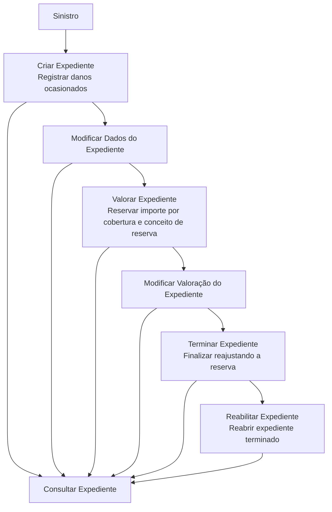

# Certificación de Siniestros — Tramitación de Expedientes

## 1. Metadados do Documento
- **Arquivo de Origem:** Não identificado no conteúdo fornecido
- **Tipo de Documento:** Apresentação Executiva
- **Domínio / Sistema:** Módulo de siniestros; tramitação de expedientes; Reef; Mapfredocument
- **Público-Alvo:** Negócio, analistas funcionais, desenvolvedores e operação
- **Data/Versão Identificada:** Não identificada

---

## 2. Resumo Executivo & Contexto de Negócio

O documento descreve definições e operações do módulo de **siniestros** para a **tramitação de expedientes**. O conteúdo organiza as configurações necessárias para tratar expedientes originados por um sinistro, incluindo estruturas organizacionais, coberturas, franquias, controles técnicos, tipos de expediente e operações de ciclo de vida.

A tramitação é configurada em diferentes níveis: **comum**, **general**, **ramo** e **expediente**. O nível comum concentra definições não exclusivas do módulo de siniestros, mas necessárias para a definição dos expedientes. O nível general reúne definições aplicáveis a todos os expedientes possíveis de um sinistro.

No nível de ramo, o documento apresenta configurações específicas ao ramo definido, como associação entre produtos, tipos de danos, coberturas, características, causas de processo e sub-limites. No nível de expediente, são definidos atributos, estruturas de informação, validações, reservas, limites de valoração e controles técnicos.

O documento também define operações operacionais aplicáveis aos expedientes: criar, modificar dados, valorar, modificar valoração, terminar, reabilitar e consultar. Essas operações podem ser realizadas **em linha** ou **de forma diferida**.

---

## 3. Arquitetura, Componentes & Tecnologias Envolvidas

Os componentes e conceitos identificados no conteúdo são:

- **Módulo de siniestros:** módulo no qual ocorre a tramitação de expedientes.
- **Expediente:** entidade tratada durante um sinistro, com dados, atributos, coberturas, reservas e operações associadas.
- **Estrutura de tramitação:** definição de oficinas onde os expedientes são tramitados, com associação de supervisores e tramitadores.
- **Cobertura:** obrigação principal de um contrato de seguro; seus tipos determinam comportamentos nos processos de emissão e prestações.
- **Franquicia:** valor pelo qual o segurado responde em caso de sinistro.
- **Controle técnico:** definição de erros, tipos de erro, condições de paralisação e necessidade de autorização.
- **Produto:** elemento ao qual são associados tipos de danos, coberturas e características.
- **Ramo:** nível de definição exclusivo do ramo que está sendo configurado.
- **Reef / DOCUMENTACIÓN Reef:** repositório ou área de documentação apresentada no conteúdo.
- **Mapfredocument:** termo exibido na referência de documentação.
- **Mapfredocument Owner:** `user:agonzalez_mapfre.com`.
- **Lifecycle:** `Approved Source`.
- **VL:** termo apresentado na área de documentação, sem detalhamento adicional.

```mermaid
graph TD
    S["Módulo de Siniestros<br/>Tramitación de Expedientes"]

    S --> C["Nível Comum"]
    S --> G["Nível General"]
    S --> R["Nível Ramo"]
    S --> E["Nível Expediente"]
    S --> O["Operações de Tramitação"]

    C --> C1["Estrutura de Tramitação"]
    C --> C2["Cobertura"]
    C --> C3["Franquicia"]
    C --> C4["Controle Técnico"]

    G --> G1["Características Generales"]
    G --> G2["Causas de Procesos"]

    R --> R1["Tipo Expediente"]
    R --> R2["Causa Proceso"]
    R --> R3["Sub-Limites"]

    E --> E1["Atributo"]
    E --> E2["Estructura"]
    E --> E3["Validaciones Información"]
    E --> E4["Cobertura"]
    E --> E5["Concepto Reserva"]
    E --> E6["Causa-Consecuencia"]
    E --> E7["Valor Inicial"]
    E --> E8["Valor Máximo"]
    E --> E9["Controle Técnico"]

    O --> O1["Crear Expediente"]
    O --> O2["Modificar Datos"]
    O --> O3["Valorar Expediente"]
    O --> O4["Modificar Valoración"]
    O --> O5["Terminar Expediente"]
    O --> O6["Rehabilitar Expediente"]
    O --> O7["Consultar Expediente"]
```



> **Nota de Análise:** O conteúdo não detalha interfaces técnicas, métodos HTTP, contratos JSON, bancos de dados, tecnologias de implementação, URLs de ambientes ou integrações entre sistemas.

---

## 4. Regras de Negócio, Especificações Funcionais & Processos

### 4.1. Definições de nível comum

O nível **comum** contém definições que não são exclusivas do módulo de siniestros, mas são necessárias para definir a tramitação de expedientes.

- **Estrutura de tramitação:** define as oficinas nas quais os expedientes são tramitados e associa supervisores e tramitadores.
- **Cobertura:** representa a obrigação principal de um contrato de seguro. Existem diversos tipos de cobertura que determinam o comportamento tanto no processo de emissão quanto no processo de prestações.
- **Franquicia:** estabelece a quantia pela qual o segurado responde em caso de sinistro.
- **Controle técnico:** define erros e tipos de erros aplicáveis à tramitação de expedientes.

### 4.2. Definições de nível general

O nível **general** contém definições que afetam todos os possíveis expedientes de um sinistro.

- **Características generales:** permitem definir o comportamento das operações de expedientes. O documento cita como exemplos a solicitação de causas na abertura de expediente e na alteração de valoração.
- **Causas de procesos:** permitem catalogar os motivos pelos quais se deseja realizar uma operação de expediente.

### 4.3. Definições exclusivas de ramo

As definições de **ramo** são exclusivas do ramo que está sendo definido.

- **Tipo expediente:** permite associar, para cada produto, os tipos de danos possíveis, as coberturas correspondentes e suas características.
- **Causa proceso:** permite catalogar os motivos para realizar operações de expedientes para cada ramo.
- **Sub-limites:** permite definir, por ramo, quais tipos de expediente e coberturas utilizarão sub-limites.

### 4.4. Definições aplicáveis ao expediente

As definições de **expediente** afetam cada um dos possíveis expedientes de um sinistro.

- **Atributo:** define informação adicional do expediente.
- **Estructura:** organiza informações adicionais do expediente por atributos, incluindo a obrigatoriedade ou não de solicitar informação e a ordem em que a informação será solicitada.
- **Validaciones información:** define comportamentos e validações para informações de core requisitadas nas operações de expedientes. O documento apresenta como exemplo tornar obrigatória a data de declaração de um expediente.
- **Cobertura:** define, entre todas as coberturas estabelecidas no produto, qual cobertura será afetada por cada tipo de expediente e qual será seu comportamento.
- **Concepto reserva:** determina o detalhamento econômico do expediente. Os conceitos de reserva citados são **Indemnización**, **Honorarios** e **Gastos**.
- **Causa-consecuencia:** permite propor os possíveis tipos de expediente que poderão ser abertos por causa-consequência.
- **Valor inicial:** define o custo médio usado para valorar o expediente quando não houver uma valoração clara.
- **Valor máximo:** determina o valor máximo pelo qual uma cobertura e conceito de reserva de um expediente podem ser valorados.
- **Controle técnico:** define condições nas quais a tramitação de um expediente pode ser paralisada ou deve ser autorizada.

### 4.5. Operações de tramitação de expedientes

As operações podem ser realizadas **em linha** ou **diferidas**.



| Operação | Regra funcional descrita |
| :--- | :--- |
| **Crear Expediente** | Registra os distintos danos ocasionados pelo sinistro. |
| **Modificar Datos del Expediente** | Permite alterar informações e dados registrados em um expediente. |
| **Valorar Expediente** | Permite reservar um importe para um expediente por cobertura e conceito de reserva. |
| **Modificar Valoración Expediente** | Permite alterar a reserva de um expediente por cobertura e conceito de reserva. |
| **Terminar Expediente** | Finaliza expedientes reajustando sua reserva. |
| **Rehabilitar Expediente** | Reabre um expediente terminado. |
| **Consultar Expediente** | Mostra toda a informação do expediente. |

---

## 5. Tabelas de Parâmetros, Ambientes e Estruturas de Dados

| Item / Parâmetro | Descrição / Função | Tipo / Valores / Formato | Ambiente / Observações |
| :--- | :--- | :--- | :--- |
| Estrutura de tramitação | Define oficinas de tramitação e associa supervisores e tramitadores. | Estrutura organizacional | Nível comum |
| Cobertura | Obrigação principal em contrato de seguro; influencia processos de emissão e prestações. | Tipos de cobertura não detalhados | Nível comum e nível expediente |
| Franquicia | Quantia pela qual o segurado responde em caso de sinistro. | Valor não detalhado | Nível comum |
| Controle técnico | Define erros, tipos de erro, paralisação da tramitação e necessidade de autorização. | Condições e tipos não detalhados | Nível comum e nível expediente |
| Características generales | Configura comportamento das operações de expedientes. | Exemplos: solicitar causas na abertura ou alteração de valoração | Nível general |
| Causas de procesos | Cataloga motivos para realizar operação de expediente. | Motivos não detalhados | Nível general |
| Tipo expediente | Associa produto aos tipos de danos, coberturas e características. | Tipos de dano não detalhados | Nível ramo |
| Causa proceso | Cataloga motivos para operações de expediente por ramo. | Motivos não detalhados | Nível ramo |
| Sub-limites | Define tipos de expediente e coberturas que utilizam sub-limites. | Sub-limites não detalhados | Nível ramo |
| Atributo | Define informação adicional do expediente. | Atributos não detalhados | Nível expediente |
| Estructura | Define atributos, obrigatoriedade de informação e ordem de solicitação. | Estrutura de informação | Nível expediente |
| Validaciones información | Configura validações de informações de core para operações. | Exemplo: data de declaração obrigatória | Nível expediente |
| Concepto reserva | Determina detalhamento econômico do expediente. | Indemnización; Honorarios; Gastos | Nível expediente |
| Causa-consecuencia | Propõe tipos de expediente possíveis para abertura por causa-consequência. | Relação causa-consequência | Nível expediente |
| Valor inicial | Define custo médio para valoração sem valoração clara. | Importe/custo médio não detalhado | Nível expediente |
| Valor máximo | Define valor máximo de valoração por cobertura e conceito de reserva. | Importe máximo não detalhado | Nível expediente |
| Modalidade de execução | Determina como operações de expediente podem ser realizadas. | Em linha ou diferido | Operações de tramitação |
| Owner da documentação Reef | Proprietário exibido na área de documentação. | `user:agonzalez_mapfre.com` | DOCUMENTACIÓN Reef |
| Lifecycle | Estado exibido na área de documentação. | `Approved Source` | DOCUMENTACIÓN Reef |

---

## 6. Bateria de Perguntas & Respostas para RAG (FAQ Sintético)

### P1: Qual é a finalidade da estrutura de tramitação de expedientes?
**R:** A estrutura de tramitação define as oficinas nas quais os expedientes são tramitados e permite associar supervisores e tramitadores a essa estrutura.

### P2: O que é uma cobertura no contexto da tramitação de siniestros?
**R:** Cobertura é a obrigação principal em um contrato de seguro. O documento indica que existem diversos tipos de cobertura e que esses tipos determinam o comportamento tanto no processo de emissão quanto no processo de prestações.

### P3: Qual é o papel da franquicia em um sinistro?
**R:** A franquicia estabelece a quantia pela qual o segurado responde quando ocorre um sinistro.

### P4: Em que nível são configuradas as características gerais das operações de expediente?
**R:** As características gerais são configuradas no nível general, que contém definições aplicáveis a todos os possíveis expedientes de um sinistro. Essas características podem definir, por exemplo, se causas serão solicitadas na abertura do expediente ou em uma mudança de valoração.

### P5: Como os tipos de expediente são associados aos produtos?
**R:** No nível de ramo, a definição de tipo expediente permite associar a cada produto os tipos de danos possíveis, suas coberturas e suas características.

### P6: O que são sub-limites na definição de ramo?
**R:** Sub-limites permitem definir, por ramo, quais tipos de expediente e quais coberturas utilizarão sub-limites. O documento não informa valores, fórmulas ou critérios adicionais para esses sub-limites.

### P7: Como são configuradas informações adicionais de um expediente?
**R:** Informações adicionais são definidas por atributos. A estrutura do expediente é composta por esses atributos e determina se cada informação é obrigatória e em qual ordem a informação será solicitada.

### P8: Que exemplo de validação de informação de core é apresentado?
**R:** O documento apresenta como exemplo tornar obrigatória a data de declaração de um expediente durante as operações de expedientes.

### P9: Quais conceitos de reserva são explicitamente citados?
**R:** Os conceitos de reserva explicitamente citados são Indemnización, Honorarios e Gastos. Esses conceitos determinam o detalhamento econômico do expediente.

### P10: Quando o valor inicial deve ser usado na valoração de um expediente?
**R:** O valor inicial corresponde ao custo médio com o qual o expediente será valorado quando não houver uma valoração clara.

### P11: O que limita a valoração de uma cobertura e conceito de reserva?
**R:** O valor máximo determina o importe máximo pelo qual uma cobertura e um conceito de reserva de um expediente podem ser valorados.

### P12: Quais operações podem ser realizadas em um expediente?
**R:** As operações são criar expediente, modificar dados do expediente, valorar expediente, modificar valoração do expediente, terminar expediente, reabilitar expediente e consultar expediente. Essas operações podem ser realizadas em linha ou de forma diferida.

### P13: O que ocorre na operação Terminar Expediente?
**R:** A operação Terminar Expediente finaliza o expediente e reajusta sua reserva.

### P14: Para que serve a operação Rehabilitar Expediente?
**R:** Rehabilitar Expediente serve para reabrir um expediente que já foi terminado.

---

## 7. Glossário de Termos, Siglas & Conceitos-Chave

- **Siniestro:** termo utilizado no documento para o evento que origina expedientes e danos a serem tratados.
- **Expediente:** registro ou entidade de tramitação associada a um sinistro, contendo dados, danos, coberturas, reservas, atributos e operações.
- **Tramitación de Expedientes:** processo de tratamento e execução de operações sobre expedientes.
- **Cobertura:** obrigação principal em contrato de seguro; influencia o comportamento de processos de emissão e prestações.
- **Franquicia:** quantia pela qual o segurado responde em caso de sinistro.
- **Ramo:** nível de definição exclusivo do ramo que está sendo configurado.
- **Producto:** elemento ao qual são associados tipos de danos, coberturas e características.
- **Tipo Expediente:** definição que permite associar tipos de dano, coberturas e características a um produto.
- **Causa Proceso:** catálogo de motivos para executar operações de expedientes.
- **Concepto Reserva:** conceito usado para determinar o detalhamento econômico de um expediente.
- **Indemnización:** tipo de conceito de reserva citado no documento.
- **Honorarios:** tipo de conceito de reserva citado no documento.
- **Gastos:** tipo de conceito de reserva citado no documento.
- **Valor Inicial:** custo médio usado para valorar um expediente sem valoração clara.
- **Valor Máximo:** importe máximo permitido para valorar uma cobertura e conceito de reserva.
- **Control Técnico:** definição de erros, condições de paralisação e exigências de autorização na tramitação.
- **Reef:** termo e área de documentação apresentados no conteúdo, sem detalhamento funcional adicional.
- **Mapfredocument:** termo apresentado na referência de documentação, sem definição adicional.
- **VL:** termo exibido na referência de documentação, sem expansão ou descrição no conteúdo.

---

## 8. Notas Críticas, Riscos & Limitações

- O documento não identifica o arquivo de origem, data, versão, autor formal ou histórico de alterações.
- O conteúdo não detalha APIs, métodos HTTP, contratos JSON, bases de dados, integrações, tecnologias de implementação ou mecanismos de autenticação.
- Não foram especificados valores concretos para franquicias, valores iniciais, valores máximos ou sub-limites.
- O documento não detalha critérios de cálculo, moedas, periodicidade de reajuste de reserva ou regras contábeis para os conceitos de reserva.
- Os tipos de dano, tipos de cobertura, causas de processo, erros técnicos e condições de autorização são mencionados, mas não enumerados.
- Não há detalhamento sobre os fluxos de aprovação, responsáveis por autorização, critérios para paralisação ou condições para reabilitação de expedientes.
- Não foram apresentados contratos ou regras de persistência para atributos e informações de core.
- **Nota de Análise:** O conteúdo lista Reef, Mapfredocument, `Approved Source` e `VL`, porém não descreve o papel técnico ou operacional desses elementos na tramitação de expedientes.

---

## 9. Conteúdo Bruto Estruturado (Referência Fiel)

```text
--- [PÁGINA 1 DE 3] ---

CERTIFICACIÓN de SINIESTROS - TRAMITACIÓN EXPEDIENTES
Deniciones Tramitación de Expedientes
Operaciones de Tramitación de Expedientes
DEFINICIONES
COMÚN
En este nivel se encuentran deniciones que NO son exclusivas del módulo de siniestros, pero son
necesarias para poder realizar la denición. Entre otras deniciones se encuentra:
ESTRUCTURA TRAMITACIÓN
Denición de ocinas donde se tramitan
expedientes, se asocian supervisores,
tramitadores
COBERTURA
Obligación principal en un contrato de
seguro. Existen diversos tipos de
cobertura que determinan el
comportamiento tanto en el proceso de
emisión, como en el proceso de
prestaciones
FRANQUICIA
Establecer la cantidad por la que el
asegurado responde en caso de siniestro
CONTROL TÉCNICO
Denición de errores, tipos de Errores para
tramitación de expedientes
GENERAL
En este nivel se encuentran deniciones que afectarán a todos los posibles expedientes de un siniestro.
Entre otros se dene:
Documentation / DOCUMENTACIÓN Reef
DOCUMENTACIÓN Reef
Mapfredocument
DOCUMENTACIÓN Reef
Owner
user:agonzalez_mapfre.com
Lifecycle
Approved Source
 / 
 VL
Buscar Inicio Soluciones Arquitecturas APIs Componentes Cloud Documentación Zeus Reef Ayuda
ES

--- [PÁGINA 2 DE 3] ---

CARACTERÍSTICAS GENERALES 
Características generales del módulo de
siniestros, permite denir el
comportamiento de las operaciones de
expedientes como por ejemplo si se va a
pedir causas en la apertura de expediente,
en al cambio de valoración...
CAUSAS DE PROCESOS 
Permite catalogar los motivos por los que
se quiere realizar una operación de
expediente
TIPO EXPEDIENTE 
Permite denir los Tipos de Daño
RAMO
Son exclusivas del ramo que se está deniendo
TIPO EXPEDIENTE 
Permite asociar a cada Producto los Tipos
de daños posibles , sus coberturas y sus
características
CAUSA PROCESO 
Permite catalogar los motivos por los que
se quiere realizar las operaciones de
expedientes para cada ramo
SUB-LIMITES
Permite denir por Ramo, qué tipos de
expediente y coberturas van a utilizar sub-
límites.
EXPEDIENTE
Deniciones que afectan a cada uno de los posibles expedientes del siniestro
ATRIBUTO
Permite denir la información adicional
del expediente.
ESTRUCTURA
Información adicional del expediente
compuesta por atributos, obligatoriedad o
no de pedir información, orden en el que
se va a pedir
VALIDACIONES INFORMACIÓN 
Denir comportamientos y validaciones de
la información de core, que se piden en las
operaciones de expedientes. Ejemplo
poner obligatoria la fecha de declaración
de un expediente
COBERTURA 
Denir de todas las coberturas denidas
en el producto, cual va a ser afectada por
cada uno de los tipos de expedientes y su
comportamiento
CONCEPTO RESERVA 
Determinar el desglose económico del
expediente. Los tipos de conceptos de
reserva pueden ser Indemnización,
Honorarios o Gastos
CAUSA-CONSECUENCIA 
Permite proponer los posibles Tipos de
Expedientes que se podrán aperturar por
causa consecuencia
VALOR INICIAL 
Denición del coste medio con el que se
va a valorar el expediente si no se tiene
una valoración clara
VALOR MÁXIMO 
Determinar el importe Máximo por el que
se puede valorar una cobertura concepto
de reserva de un expediente
CONTROL TÉCNICO
Denir en qué condiciones se puede
paralizar la tramitación de un expediente u
obligación de ser autorizado
OPERACIONES
TRAMITACIÓN DE EXPEDIENTES

--- [PÁGINA 3 DE 3] ---

Operaciones que se pueden realizar a cada uno de los posibles expedientes del siniestro, se pueden realizar
tanto en línea como diferido
CREAR Expediente
En esta operación se registran los
distintos daños que ha ocasionado el
siniestro
MODIFICAR Datos del Expediente
Permite cambiar la información, los datos
registrados de un expediente
VALORAR Expediente
Permite reservar un importe a un
expediente por cobertura y concepto de
reserva
MODIFICAR Valoración Expediente
Permite cambiar la reserva de un
expediente por cobertura y concepto de
reserva
TERMINAR Expediente
Finaliza expedientes reajustando su
reserva
REHABILITAR Expediente
Reabre un Expediente Terminado
CONSULTAR Expediente
Muestra toda la información del
Expediente
```
