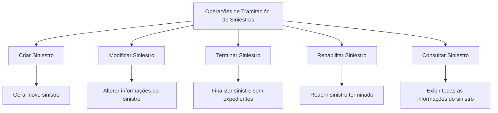

# Certificación de Operaciones de Siniestros — Tramitación de Siniestros

## 1. Metadados do Documento
- **Arquivo de Origem:** Não identificado no conteúdo fornecido
- **Tipo de Documento:** Apresentação Executiva
- **Domínio / Sistema:** Operações de Siniestros — Tramitación de Siniestros / Documentación Reef
- **Público-Alvo:** Negócio, Operação, Analistas Funcionais e equipes responsáveis pela configuração do módulo de sinistros
- **Data/Versão Identificada:** Não identificada

---

## 2. Resumo Executivo & Contexto de Negócio

O documento descreve definições e operações associadas à **tramitación de siniestros**, isto é, ao tratamento operacional de sinistros. A estrutura apresentada organiza configurações em níveis: **Común**, **General**, **Ramo** e **Siniestro**, além de listar operações que podem ser executadas sobre um sinistro.

O nível **Común** reúne definições compartilhadas, não exclusivas do módulo de sinistros, mas necessárias para sua configuração. Entre os elementos citados estão companhia, moeda, estruturas geográfica, comercial e de produto, controle técnico e estrutura de tramitação.

O nível **General** contém definições não exclusivas de um ramo específico e utilizadas no módulo de sinistros. O conteúdo destaca numeração de sinistros, eventos catastróficos, características gerais do módulo e causas de processos.

O nível **Ramo** concentra configurações exclusivas do ramo definido, incluindo extemporaneidade, causas de processo por ramo e especialidades de supervisores e tramitadores por produto. O nível **Siniestro** reúne definições que impactam todos os expedientes de um sinistro, como causa de origem, consequência, atributos, estruturas de informações, validações e controle técnico.

Por fim, o documento enumera operações de tratamento de sinistros que podem ser realizadas **em linha ou de forma diferida**: criar, modificar, terminar, reabilitar e consultar sinistros. O material não detalha interfaces, tecnologias, contratos de integração, permissões, APIs, URLs ou mecanismos técnicos de execução dessas operações.

---

## 3. Arquitetura, Componentes & Tecnologias Envolvidas

O documento não descreve uma arquitetura de software com servidores, APIs, microsserviços, bancos de dados, protocolos ou tecnologias de implementação. A arquitetura identificável é uma **estrutura funcional de configuração e operação** do módulo de tramitación de siniestros.

Componentes e domínios funcionais mencionados:

- **Documentación Reef:** Área documental citada no material.
- **Mapfredocument:** Termo apresentado na área de documentação, sem detalhamento adicional.
- **Compañía:** Informações gerais da empresa.
- **Moneda:** Informações gerais das moedas.
- **Estructura Geográfica:** Divisões do país por zonas.
- **Estructura Comercial:** Divisões organizativas da companhia.
- **Estructura Producto:** Divisões dos ramos.
- **Estructura Tramitación:** Definição de escritórios que tratam expedientes; associação de supervisores e tramitadores.
- **Control Técnico:** Definição de erros, tipos de erro, condições de paralisação da tramitação e obrigatoriedade de autorização.
- **Siniestro:** Entidade funcional sobre a qual são definidas informações, validações e operações.
- **Expediente:** Elemento associado ao sinistro; o documento afirma que um sinistro pode ser terminado sem expedientes, mas não define a estrutura do expediente.

```mermaid
graph TD
  A[Tramitación de Siniestros] --> B[Definiciones]
  A --> C[Operaciones de Tramitación]

  B --> D[Común]
  B --> E[General]
  B --> F[Ramo]
  B --> G[Siniestro]

  D --> D1[Compañía]
  D --> D2[Moneda]
  D --> D3[Estructura Geográfica]
  D --> D4[Estructura Comercial]
  D --> D5[Estructura Producto]
  D --> D6[Control Técnico]
  D --> D7[Estructura Tramitación]

  E --> E1[Numeración]
  E --> E2[Eventos]
  E --> E3[Características Generales]
  E --> E4[Causas de Procesos]

  F --> F1[Extemporaneidad]
  F --> F2[Causa Proceso]
  F --> F3[Especialidad Supervisores]
  F --> F4[Especialidad Tramitadores]

  G --> G1[Causa Origen]
  G --> G2[Consecuencia]
  G --> G3[Causa-Consecuencia]
  G --> G4[Atributo]
  G --> G5[Estructura]
  G --> G6[Información Inicial]
  G --> G7[Validaciones Información]
  G --> G8[Control Técnico]

  C --> H[Crear Siniestro]
  C --> I[Modificar Siniestro]
  C --> J[Terminar Siniestro]
  C --> K[Rehabilitar Siniestro]
  C --> L[Consultar Siniestro]
```



> **Nota de Análise:** O documento apresenta uma organização funcional e conceitual, não uma arquitetura técnica implementável. Não há detalhamento de integrações, endpoints, contratos JSON, tecnologias, ambientes ou dependências de infraestrutura.

---

## 4. Regras de Negócio, Especificações Funcionais & Processos

### 4.1 Definições no nível Común

As definições do nível **Común** não são exclusivas do módulo de sinistros, porém são necessárias para a realização da definição e operação de sinistros.

- **Compañía:** contém informações gerais da empresa.
- **Moneda:** contém informações gerais das moedas.
- **Estructura Geográfica:** organiza divisões do país por zonas.
- **Estructura Comercial:** organiza divisões organizativas da companhia.
- **Estructura Producto:** organiza divisões dos ramos.
- **Control Técnico:** contempla a definição de erros e de tipos de erros.
- **Estructura Tramitación:** define os escritórios nos quais os expedientes são tratados e associa supervisores e tramitadores.

### 4.2 Definições no nível General

As definições do nível **General** não são exclusivas de um ramo e são utilizadas pelo módulo de sinistros.

- **Numeración:** determina quais elementos formarão parte do número de sinistros e em qual ordem esses elementos serão utilizados.
- **Eventos:** registra todos os fenômenos catastróficos ocorridos em uma determinada zona geográfica.
- **Características Generales:** determina comportamentos do módulo de sinistros.
- **Causas de Procesos:** cataloga os motivos pelos quais se deseja realizar uma operação.

### 4.3 Definições no nível Ramo

As definições do nível **Ramo** são exclusivas do ramo que está sendo definido.

- **Extemporaneidad:** define o número máximo de dias que pode transcorrer entre a data de ocorrência do sinistro e a data em que o sinistro é comunicado à companhia.
- **Causa Proceso:** cataloga, para cada ramo, os motivos pelos quais se deseja realizar operações de sinistros.
- **Especialidad Supervisores:** permite especializar supervisores em determinados produtos.
- **Especialidad Tramitadores:** permite especializar tramitadores em determinados produtos.

### 4.4 Definições no nível Siniestro

As definições do nível **Siniestro** afetam todos os possíveis expedientes de um sinistro.

- **Causa Origen:** cataloga as diferentes causas que originam um sinistro.
- **Consecuencia:** define os possíveis danos ocorridos em decorrência do sinistro, incluindo danos materiais e danos pessoais.
- **Causa-Consecuencia:** define, para cada causa de origem de sinistro, os possíveis danos decorrentes do sinistro.
- **Atributo:** define informações adicionais do sinistro, como dados do veículo contrário e dados do lesionado.
- **Estructura:** organiza informações adicionais do sinistro compostas por atributos, obrigatoriedade ou não de solicitar determinada informação e ordem em que a informação será solicitada.
- **Información Inicial:** registra informações prévias para atributos de operações de sinistros, evitando inserção posterior. O exemplo apresentado é utilizar a data do dia como data de comunicação do sinistro.
- **Validaciones Información:** define comportamentos e validações para informações de core solicitadas nas operações de sinistros. O exemplo apresentado é tornar obrigatória a hora de declaração de um sinistro.
- **Control Técnico:** define em quais condições a tramitação de um sinistro pode ser paralisada ou em quais condições é obrigatória uma autorização.

### 4.5 Operações de Tramitación de Siniestros

As operações de tramitação podem ser realizadas **em linha** ou de modo **diferido**.



| Operação | Regra ou efeito funcional identificado |
| :--- | :--- |
| Crear Siniestro | Permite gerar um novo sinistro. |
| Modificar Siniestro | Permite alterar as informações do sinistro. |
| Terminar Siniestro | Finaliza sinistros sem expedientes. |
| Rehabilitar Siniestro | Reabre um sinistro que foi terminado. |
| Consultar Siniestro | Mostra todas as informações do sinistro. |

> **Nota de Análise:** O documento não informa pré-condições, perfis autorizados, transições formais de estado, códigos de retorno, regras de auditoria ou exceções para as operações de criar, modificar, terminar, reabilitar e consultar sinistros.

---

## 5. Tabelas de Parâmetros, Ambientes e Estruturas de Dados

| Item / Parâmetro | Descrição / Função | Tipo / Valores / Formato | Ambiente / Observações |
| :--- | :--- | :--- | :--- |
| Compañía | Informações gerais da empresa. | Não detalhado. | Definição do nível Común. |
| Moneda | Informações gerais das moedas. | Não detalhado. | Definição do nível Común. |
| Estructura Geográfica | Divisões do país por zonas. | Zonas geográficas; formato não detalhado. | Definição do nível Común. |
| Estructura Comercial | Divisões organizativas da companhia. | Estrutura organizativa; formato não detalhado. | Definição do nível Común. |
| Estructura Producto | Divisões dos ramos. | Ramos; formato não detalhado. | Definição do nível Común. |
| Control Técnico — Común | Definição de erros e tipos de erros. | Erros e tipos de erro; valores não detalhados. | Definição do nível Común. |
| Estructura Tramitación | Define escritórios de tramitação de expedientes e associa supervisores e tramitadores. | Escritórios, supervisores e tramitadores; formato não detalhado. | Definição do nível Común. |
| Numeración | Determina elementos integrantes do número de sinistros e sua ordem. | Elementos e ordem; formato não detalhado. | Definição do nível General. |
| Eventos | Registra fenômenos catastróficos ocorridos em uma zona geográfica. | Fenômenos e zona geográfica; formato não detalhado. | Definição do nível General. |
| Características Generales | Determina comportamentos do módulo de sinistros. | Comportamentos; valores não detalhados. | Definição do nível General. |
| Causas de Procesos | Cataloga motivos para realizar uma operação. | Motivos de operação; formato não detalhado. | Definição do nível General. |
| Extemporaneidad | Define número máximo de dias entre ocorrência e comunicação do sinistro à companhia. | Número máximo de dias. | Definição exclusiva do nível Ramo. |
| Causa Proceso | Cataloga motivos para operações de sinistros por ramo. | Motivos por ramo; formato não detalhado. | Definição exclusiva do nível Ramo. |
| Especialidad Supervisores | Especializa supervisores em produtos determinados. | Relação supervisor-produto; formato não detalhado. | Definição exclusiva do nível Ramo. |
| Especialidad Tramitadores | Especializa tramitadores em produtos determinados. | Relação tramitador-produto; formato não detalhado. | Definição exclusiva do nível Ramo. |
| Causa Origen | Cataloga causas que originam um sinistro. | Causas de origem; formato não detalhado. | Definição do nível Siniestro. |
| Consecuencia | Define danos possíveis decorrentes do sinistro. | Exemplos: danos materiais, danos pessoais. | Definição do nível Siniestro. |
| Causa-Consecuencia | Relaciona uma causa de origem aos danos possíveis. | Relação causa-dano; formato não detalhado. | Definição do nível Siniestro. |
| Atributo | Define informações adicionais do sinistro. | Exemplos: dados do veículo contrário, dados do lesionado. | Definição do nível Siniestro. |
| Estructura | Agrupa atributos, obrigatoriedade e ordem de solicitação de informações adicionais. | Atributos, obrigatoriedade e ordem. | Definição do nível Siniestro. |
| Información Inicial | Registra informações prévias para atributos das operações de sinistros. | Exemplo: data de comunicação igual à data atual. | Definição do nível Siniestro. |
| Validaciones Información | Define comportamentos e validações de informações de core. | Exemplo: hora de declaração obrigatória. | Definição do nível Siniestro. |
| Control Técnico — Siniestro | Define condições para paralisar a tramitação ou exigir autorização. | Condições e obrigatoriedade de autorização; valores não detalhados. | Definição do nível Siniestro. |
| Modo de execução das operações | As operações podem ser realizadas em linha ou de forma diferida. | `En línea` ou `diferido`. | Aplicável às operações de tramitación. |

> **Nota de Análise:** Não foram identificados URLs, servidores, ambientes técnicos, portas, caminhos de logs, variáveis de configuração, formatos de payload ou esquemas de dados no conteúdo fornecido.

---

## 6. Bateria de Perguntas & Respostas para RAG (FAQ Sintético)

### P1: Quais são os níveis de definição utilizados na tramitación de siniestros?
**R:** O documento apresenta quatro níveis de definição: **Común**, **General**, **Ramo** e **Siniestro**. O nível Común contém definições compartilhadas necessárias ao módulo; General reúne configurações usadas no módulo, mas não exclusivas de um ramo; Ramo concentra definições exclusivas de cada ramo; e Siniestro agrupa definições que afetam todos os possíveis expedientes de um sinistro.

### P2: Qual é a finalidade da definição de Numeración no módulo de sinistros?
**R:** A definição de **Numeración** determina quais elementos formarão parte do número de sinistros e em qual ordem esses elementos serão organizados. O documento não especifica os elementos possíveis nem o formato final do número de sinistro.

### P3: Como o documento define Extemporaneidad para um ramo?
**R:** **Extemporaneidad** permite indicar o número máximo de dias que podem transcorrer entre a data de ocorrência do sinistro e a data em que o sinistro é comunicado à companhia. Essa definição é exclusiva do ramo que está sendo configurado.

### P4: Para que serve a Estructura Tramitación?
**R:** A **Estructura Tramitación** define os escritórios nos quais os expedientes são tratados e associa supervisores e tramitadores a essa estrutura. O conteúdo não detalha regras de distribuição, critérios de associação ou permissões dos perfis envolvidos.

### P5: O que é configurado em Causa-Consecuencia?
**R:** **Causa-Consecuencia** permite definir, para cada causa de origem de um sinistro, os possíveis danos ocorridos em decorrência desse sinistro. Os exemplos de consequências apresentados no documento são danos materiais e danos pessoais.

### P6: Quais informações podem ser tratadas como atributos de um sinistro?
**R:** Um **Atributo** permite definir informações adicionais de um sinistro. O documento cita como exemplos dados do veículo contrário e dados do lesionado, sem listar todos os atributos disponíveis ou seus formatos.

### P7: Como a Estructura controla a solicitação de informações adicionais do sinistro?
**R:** A **Estructura** é composta por atributos e permite definir se uma informação deve ser obrigatoriamente solicitada ou não, além da ordem em que as informações serão pedidas durante as operações de sinistros.

### P8: Qual é o objetivo de Información Inicial?
**R:** **Información Inicial** permite registrar antecipadamente dados destinados aos atributos das operações de sinistros, evitando a necessidade de introduzi-los posteriormente. O exemplo do documento é preencher a data de comunicação do sinistro com a data do dia.

### P9: Que tipo de validação pode ser definida em Validaciones Información?
**R:** **Validaciones Información** permite definir comportamentos e validações para informações de core solicitadas nas operações de sinistros. O exemplo apresentado consiste em tornar obrigatória a hora de declaração de um sinistro.

### P10: Quando o Control Técnico pode interferir na tramitação de um sinistro?
**R:** No nível Siniestro, o **Control Técnico** define em quais condições a tramitação de um sinistro pode ser paralisada e em quais condições é obrigatória uma autorização. No nível Común, o mesmo termo também abrange a definição de erros e tipos de erros.

### P11: Quais operações podem ser executadas sobre um sinistro?
**R:** As operações listadas são: **Crear Siniestro**, para gerar um novo sinistro; **Modificar Siniestro**, para alterar informações; **Terminar Siniestro**, para finalizar sinistros sem expedientes; **Rehabilitar Siniestro**, para reabrir um sinistro terminado; e **Consultar Siniestro**, para mostrar todas as informações do sinistro.

### P12: As operações de tramitación de siniestros são executadas somente em tempo real?
**R:** Não. O documento afirma que as operações de tramitação de sinistros podem ser realizadas tanto **em linha** quanto de forma **diferida**. Não são especificados mecanismos técnicos, filas, agendamentos ou critérios para selecionar cada modo.

---

## 7. Glossário de Termos, Siglas & Conceitos-Chave

- **Siniestro:** Sinistro tratado pelo módulo de tramitação; o documento descreve definições e operações aplicáveis a essa entidade.
- **Tramitación de Siniestros:** Tratamento operacional de sinistros, incluindo definições de configuração e operações sobre sinistros.
- **Expediente:** Elemento associado a um sinistro. O documento informa que um sinistro pode ser terminado sem expedientes, mas não define o conceito em maior detalhe.
- **Común:** Nível que contém definições não exclusivas do módulo de sinistros, mas necessárias para sua configuração.
- **General:** Nível com definições não exclusivas de um ramo e utilizadas no módulo de sinistros.
- **Ramo:** Nível de definições exclusivas do ramo que está sendo definido.
- **Causa Origen:** Catálogo de causas que originam um sinistro.
- **Consecuencia:** Possíveis danos decorrentes de um sinistro, como danos materiais ou pessoais.
- **Causa-Consecuencia:** Relação entre uma causa de origem e os danos possíveis do sinistro.
- **Atributo:** Informação adicional do sinistro, como dados de veículo contrário ou de lesionado.
- **Extemporaneidad:** Número máximo de dias entre a ocorrência do sinistro e sua comunicação à companhia.
- **Tramitador:** Perfil associado ao tratamento de expedientes e que pode ser especializado em produtos determinados.
- **Supervisor:** Perfil associado à estrutura de tramitação e que pode ser especializado em produtos determinados.
- **Control Técnico:** Configuração de erros e tipos de erro, bem como de condições para paralisação da tramitação ou exigência de autorização.
- **Rehabilitar Siniestro:** Operação que reabre um sinistro terminado.
- **Mapfredocument:** Termo citado na área de documentação; significado funcional ou técnico não detalhado.
- **Reef:** Nome mencionado na área “Documentación Reef”; o documento não detalha o significado da denominação.

---

## 8. Notas Críticas, Riscos & Limitações

- O conteúdo não identifica o nome do arquivo de origem, data, versão, autor responsável ou histórico de alterações do documento.
- O documento não detalha arquitetura técnica, tecnologias, componentes de infraestrutura, bancos de dados, APIs, serviços, integrações, protocolos ou contratos de dados.
- Não foram identificados ambientes, URLs, endereços de servidores, portas, caminhos de log, mecanismos de autenticação ou regras de observabilidade.
- As regras de autorização são mencionadas somente de forma genérica pelo **Control Técnico**; não há matriz de permissões, perfis autorizadores ou critérios de aprovação.
- A operação **Terminar Siniestro** é definida como finalização de sinistros sem expedientes. O material não informa se sinistros com expedientes podem ser terminados, sob quais condições ou por qual fluxo alternativo.
- O documento afirma que operações podem ocorrer em linha ou de forma diferida, mas não detalha critérios de escolha, processamento assíncrono, monitoramento, reprocessamento ou tratamento de falhas.
- As definições de atributos, estruturas, validações e informações iniciais não incluem catálogos completos, tipos de dados, obrigatoriedades concretas ou exemplos além dos explicitamente apresentados.
- **Nota de Análise:** “Reef” e “Mapfredocument” aparecem no conteúdo como referências documentais, mas não são explicados como sistemas, módulos ou plataformas técnicas.

---

## 9. Conteúdo Bruto Estruturado (Referência Fiel)

```text
--- [PÁGINA 1 DE 3] ---

CERTIFICACIÓN OPERACIONES de SINIESTROS - TRAMITACIÓN
SINIESTROS
Deniciones Tramitación de Siniestros
Operaciones de Tramitación Siniestros
DEFINICIONES
COMÚN
En este nivel se encuentran deniciones que NO son exclusivas del módulo de siniestros, pero son
necesarias para poder realizar la denición. Entre otras deniciones se encuentra:
COMPAÑÍA
Información General de la empresa
MONEDA
Información General de las monedas
ESTRUCTURA GEOGRÁFICA
Divisiones del país por zonas
ESTRUCTURA COMERCIAL
Divisiones organizativas de la compañía
ESTRUCTURA PRODUCTO
Divisiones de los ramos
CONTROL TÉCNICO
Denición de errores, tipos de Errores
ESTRUCTURA TRAMITACIÓN
Denición de ocinas donde se tramitan
expedientes, se asocian supervisores,
tramitadores
GENERAL
Documentation / DOCUMENTACIÓN Reef
DOCUMENTACIÓN Reef
Mapfredocument
DOCUMENTACIÓN Reef
Owner
user:agonzalez_mapfre.com
Lifecycle
Approved Source
 / 
 VL
Buscar Inicio Soluciones Arquitecturas APIs Componentes Cloud Documentación Zeus Reef Ayuda
ES


--- [PÁGINA 2 DE 3] ---

Son deniciones que NO son exclusivas de un ramo y se utilizan en el módulo de siniestros. Las más
importantes son:
NUMERACIÓN 
Determina qué elementos formarán parte
del número de siniestros y en qué orden
EVENTOS :
Registra todos los fenómenos
catrastrócos ocurridos en una zona
geográca determinada
CARACTERÍSTICAS GENERALES 
Determinar comportamientos del módulo
de siniestros
CAUSAS DE PROCESOS 
Permite catalogar los motivos por los que
se quiere realizar una operación
RAMO
Son exclusivas del ramo que se está deniendo. Por ejemplo:
EXTEMPORANEIDAD
Permite indicar el número máximo de días
que pueden transcurrir entre la fecha de
ocurrencia del siniestro y la fecha en la
que se notica a la compañía
CAUSA PROCESO 
Permite catalogar los motivos por los que
se quiere realizar las operaciones de
siniestros para cada ramo
ESPECIALIDAD SUPERVISORES 
Permite especializar a los supervisores en
Productos determinados
ESPECIALIDAD TRAMITADORES 
Permite especializar a los tramitadores en
Productos determinados
SINIESTRO
En este nivel se encuentran deniciones que afectarán a todos los posibles expedientes de un siniestro.
Entre otros se dene:
CAUSA ORIGEN 
Catalogar las diferentes causas que
originan un siniestro
CONSECUENCIA 
Permite denir los posibles daños
ocurridos por el siniestro (Daños
materiales, daños personales...)
CAUSA-CONSECUENCIA 
Permite denir para cada causa de origen
de siniestros las posibles daños ocurridos
por el siniestro (Daños materiales, daños
personales...)
ATRIBUTO
Permite denir la información adicional
del siniestro, como datos vehículo
contrario, datos lesionado, etc.
ESTRUCTURA
Información adicional del siniestro
compuesta por atributos, obligatoriedad o
no de pedir información, orden en el que
se va a pedir
INFORMACIÓN INICIAL 
Registrar información previa para los
atributos de las operaciones de siniestros,
para no tener que introducirla
posteriormente. Un ejemplo sería la fecha
de comunicación del siniestro que salga la
fecha del día


--- [PÁGINA 3 DE 3] ---

VALIDACIONES INFORMACIÓN 
Denir comportamientos y validaciones de
la información de core, que se piden en las
operaciones de siniestros. Ejemplo poner
obligatoria la hora de declaración de un
siniestro
CONTROL TÉCNICO
Denición de en qué condiciones se puede
paralizar la tramitación de un siniestro u
obligación de ser autorizado
OPERACIONES
TRAMITACIÓN DE SINIESTROS
Operaciones que se pueden realizar a un siniestro, se pueden realizar tanto en línea como diferido:
CREAR Siniestro
Permite generar un nuevo siniestro
MODIFICAR Siniestro
Permite cambiar la información del
siniestro
TERMINAR Siniestro
Finaliza siniestros sin expedientes
REHABILITAR Siniestro
Reabre un siniestro Terminado
CONSULTAR Siniestro
Muestra toda la información del siniestro
```
