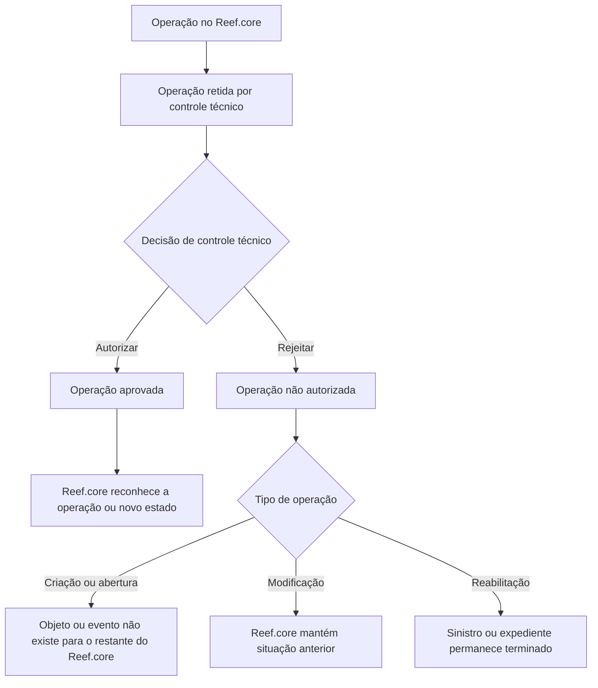

# Certificação de Sinistros — Controle Técnico no Reef.core

## 1. Metadados do Documento
- **Arquivo de Origem:** `Não identificado no conteúdo fornecido`
- **Tipo de Documento:** `Procedimento`
- **Domínio / Sistema:** `Reef.core — Certificação de Sinistros / Controle Técnico`
- **Público-Alvo:** `Operação, Negócio, Analistas Funcionais e Desenvolvedores`
- **Data/Versão Identificada:** `Não identificada`

---

## 2. Resumo Executivo & Contexto de Negócio

O documento descreve operações de **autorização** e **rejeição** de controles técnicos de auditoria no sistema **Reef.core**, no contexto de sinistros e expedientes. As operações sujeitas a controle técnico ficam retidas até que sejam formalmente autorizadas ou rejeitadas.

Quando uma operação é autorizada, o documento estabelece que a alteração passa a ser aprovada, validada quando aplicável, e reconhecida pelo restante do Reef.core. Os efeitos incluem o reconhecimento de sinistros, expedientes, modificações, reabilitações, alterações de valoração, liquidações, faturas e planos de renda.

Quando uma operação é rejeitada, o Reef.core mantém ou restaura a condição anterior conforme o tipo da operação. Em alguns casos, o objeto ou evento não existe para o restante do sistema; em outros, o sinistro ou expediente permanece terminado, ou a valoração e a fatura mantêm a situação anterior à modificação rejeitada.

O processo de controle técnico atua, portanto, como um mecanismo de governança e auditoria para impedir que operações retidas produzam efeitos no ecossistema Reef.core antes de uma decisão explícita. O material também referencia a área de documentação Reef, Mapfredocument, e identifica `user:agonzalez_mapfre.com` como owner.

---

## 3. Arquitetura, Componentes & Tecnologias Envolvidas

### Sistemas, áreas e componentes identificados

| Componente / Termo | Papel identificado no documento |
| :--- | :--- |
| `Reef.core` | Sistema que reconhece, ignora ou mantém o estado anterior das operações conforme a decisão de controle técnico. |
| Controle técnico | Etapa de auditoria na qual operações ficam retidas para autorização ou rejeição. |
| Certificación de Siniestros | Contexto funcional apresentado para as operações de controle técnico sobre sinistros. |
| Siniestro | Entidade de sinistro sujeita a abertura, modificação e reabilitação. |
| Expediente | Entidade sujeita a abertura, mudança de valoração, reabilitação, liquidação, faturamento e plano de renda. |
| Mapfredocument | Referência presente na área de documentação Reef. |
| Documentation / DOCUMENTACIÓN Reef | Área ou seção documental citada no conteúdo. |
| `user:agonzalez_mapfre.com` | Owner informado no documento. |
| `Approved Source` | Estado de lifecycle exibido no conteúdo. |

### Fluxo lógico de decisão do controle técnico



### Nota de Análise

O documento não detalha interfaces técnicas, APIs, métodos HTTP, contratos JSON, banco de dados, URLs de ambiente, mecanismos de persistência, filas, eventos ou integrações entre serviços. O fluxo Mermaid representa exclusivamente o comportamento funcional descrito para operações retidas por controle técnico.

---

## 4. Regras de Negócio, Especificações Funcionais & Processos

### Princípio geral do controle técnico

1. Uma operação pode ficar **retida por controle técnico**.
2. A autorização faz a operação ser reconhecida pelo restante do Reef.core.
3. A rejeição impede o reconhecimento da operação ou preserva o estado anterior, conforme a natureza da operação.
4. O efeito de rejeição não é uniforme para todos os tipos:
   - operações de abertura ou criação podem resultar em inexistência do objeto ou evento;
   - operações de modificação podem preservar o estado anterior;
   - operações de reabilitação podem manter sinistros ou expedientes como terminados.

### Operações autorizadas

#### Autorizar abertura de sinistro
- Um sinistro retido por controle técnico passa a estar aprovado.
- O restante do Reef.core reconhece o sinistro como sinistro.

#### Autorizar modificação de sinistro
- Uma modificação de sinistro retida por controle técnico passa a estar aprovada.
- O restante do Reef.core reconhece a modificação do sinistro.

#### Autorizar reabilitação de sinistro
- Uma reabilitação de sinistro retida por controle técnico passa a estar aprovada.
- O restante do Reef.core reconhece que o sinistro volta a estar pendente.

#### Autorizar abertura de expediente
- Um expediente retido por controle técnico passa a estar aprovado.
- O restante do Reef.core reconhece o expediente como expediente.

#### Autorizar mudança de valoração
- Uma modificação de valoração realizada em um expediente e retida por controle técnico passa a estar aprovada.
- O restante do Reef.core reconhece a nova valoração do expediente.

#### Autorizar reabilitação de expediente
- Uma reabilitação de expediente retida por controle técnico passa a estar aprovada.
- O restante do Reef.core reconhece que o expediente volta a estar pendente.

#### Autorizar liquidação
- Uma liquidação realizada em um expediente e retida por controle técnico passa a estar aprovada.
- O restante do Reef.core reconhece a nova liquidação.
- A liquidação é associada à ordem de pagamento do expediente.

#### Autorizar criação de faturamento
- A criação de uma fatura de expediente retida por controle técnico, quando autorizada, é validada.
- O restante do Reef.core reconhece a nova fatura.

#### Autorizar modificação de faturamento
- A modificação de uma fatura de expediente retida por controle técnico é aceita.
- O restante do Reef.core reconhece a modificação da fatura.

#### Autorizar plano de renda
- Um plano de renda criado para um expediente e retido por controle técnico é autorizado.
- O restante do Reef.core reconhece o plano de renda.

### Operações rejeitadas

#### Rejeitar abertura de sinistro
- Um sinistro retido por controle técnico não é autorizado.
- Para o Reef.core, o sinistro não existe e não existiu.

#### Rejeitar modificação de sinistro
- Uma modificação de sinistro retida por controle técnico não é autorizada.
- O texto afirma que, consequentemente, “para o restante de Reef.core não existe”.
- **Nota de Análise:** o documento não detalha explicitamente se essa inexistência se refere à modificação ou ao sinistro inteiro; a formulação original foi preservada na seção de conteúdo bruto.

#### Rejeitar reabilitação de sinistro
- Uma reabilitação de sinistro retida por controle técnico não é autorizada.
- O sinistro permanece terminado para o restante do Reef.core.

#### Rejeitar abertura de expediente
- Um expediente retido por controle técnico não é autorizado.
- Para o restante do Reef.core, o expediente não existe.

#### Rejeitar mudança de valoração
- Uma modificação de valoração de expediente retida por controle técnico não é autorizada.
- O Reef.core mantém a valoração anterior à mudança rejeitada.

#### Rejeitar reabilitação de expediente
- Uma reabilitação de expediente retida por controle técnico não é autorizada.
- O expediente permanece terminado para o restante do Reef.core.

#### Rejeitar liquidação
- Uma liquidação de expediente retida por controle técnico não é autorizada.
- Para o restante do Reef.core, a liquidação não existe.

#### Rejeitar criação de faturamento
- A criação de uma fatura de expediente retida por controle técnico não é autorizada.
- A fatura não existe.

#### Rejeitar modificação de faturamento
- A modificação de uma fatura retida por controle técnico não é autorizada.
- Para o restante do Reef.core, a modificação não existe.
- A fatura permanece na situação anterior à modificação.

#### Rejeitar plano de renda
- Um plano de renda criado para um expediente e retido por controle técnico não é autorizado.
- Para o restante do Reef.core, o plano de renda não existe.

---

## 5. Tabelas de Parâmetros, Ambientes e Estruturas de Dados

| Item / Parâmetro | Descrição / Função | Tipo / Valores / Formato | Ambiente / Observações |
| :--- | :--- | :--- | :--- |
| Controle técnico | Mecanismo de auditoria que retém operações até decisão. | Estado funcional: retido, autorizado ou rejeitado. | Aplicável às operações descritas no Reef.core. |
| Decisão de controle técnico | Determina o efeito final de uma operação retida. | `AUTORIZAR` ou `RECHAZAR`. | A consequência depende do tipo de operação. |
| Abertura de sinistro | Criação ou reconhecimento de um sinistro. | Operação de sinistro. | Autorizada: sinistro reconhecido; rejeitada: sinistro não existe nem existiu. |
| Modificação de sinistro | Alteração realizada sobre sinistro. | Operação de sinistro. | Autorizada: modificação reconhecida; rejeitada: o texto informa que para Reef.core “não existe”. |
| Reabilitação de sinistro | Reabilitação de um sinistro terminado. | Operação de sinistro. | Autorizada: sinistro volta a pendente; rejeitada: sinistro segue terminado. |
| Abertura de expediente | Criação ou reconhecimento de expediente. | Operação de expediente. | Autorizada: expediente reconhecido; rejeitada: expediente não existe. |
| Mudança de valoração | Modificação da valoração de um expediente. | Operação de expediente. | Autorizada: nova valoração reconhecida; rejeitada: valoração anterior preservada. |
| Reabilitação de expediente | Reabilitação de expediente terminado. | Operação de expediente. | Autorizada: expediente volta a pendente; rejeitada: expediente segue terminado. |
| Liquidação | Liquidação realizada em expediente. | Operação de expediente. | Autorizada: nova liquidação e ordem de pagamento reconhecidas; rejeitada: liquidação não existe. |
| Criação de faturamento | Criação de fatura de expediente. | Operação de faturamento. | Autorizada: fatura validada e reconhecida; rejeitada: fatura não existe. |
| Modificação de faturamento | Alteração de fatura de expediente. | Operação de faturamento. | Autorizada: modificação reconhecida; rejeitada: situação anterior da fatura preservada. |
| Plano de renda | Plano de renda criado para expediente. | Operação de expediente. | Autorizada: plano reconhecido; rejeitada: plano não existe. |
| Owner | Proprietário identificado na área documental. | `user:agonzalez_mapfre.com` | Informação exibida no conteúdo. |
| Lifecycle | Estado de ciclo de vida documental. | `Approved Source` | Informação exibida no conteúdo. |
| Ambiente / URL | Endereço de ambiente de execução. | Não informado. | O documento não apresenta URLs, hosts, portas ou rotas. |
| Logs | Caminhos, variáveis ou política de logs. | Não informado. | O documento não apresenta configurações de logs. |

---

## 6. Bateria de Perguntas & Respostas para RAG (FAQ Sintético)

### P1: O que acontece quando a abertura de um sinistro retida por controle técnico é autorizada?
**R:** A abertura do sinistro passa a estar aprovada. Como consequência, o restante do Reef.core reconhece o sinistro como existente.

### P2: Qual é o resultado da rejeição de uma abertura de sinistro no Reef.core?
**R:** A abertura de sinistro não é autorizada. Para o Reef.core, o sinistro não existe e não existiu.

### P3: Como o Reef.core trata uma reabilitação de sinistro autorizada?
**R:** A reabilitação retida por controle técnico passa a estar aprovada. O restante do Reef.core reconhece que o sinistro volta a estar pendente.

### P4: O que ocorre se a reabilitação de um sinistro for rejeitada?
**R:** A reabilitação não é autorizada. O restante do Reef.core mantém o sinistro como terminado.

### P5: Qual é o comportamento após a autorização de uma mudança de valoração de expediente?
**R:** A modificação de valoração passa a estar aprovada, e o restante do Reef.core reconhece a nova valoração do expediente.

### P6: O que acontece com a valoração de um expediente quando a mudança de valoração é rejeitada?
**R:** A modificação de valoração não é autorizada. O Reef.core permanece com a valoração anterior ao փոփոխamento rejeitado.

### P7: Qual é o efeito de rejeitar a abertura de um expediente?
**R:** O expediente retido por controle técnico não é autorizado. Para o restante do Reef.core, esse expediente não existe.

### P8: Como uma liquidação autorizada é refletida no Reef.core?
**R:** A liquidação retida por controle técnico passa a estar aprovada. O restante do Reef.core reconhece a nova liquidação e a ordem de pagamento do expediente.

### P9: O que ocorre ao rejeitar uma liquidação de expediente?
**R:** A liquidação não é autorizada. Para o restante do Reef.core, essa liquidação não existe.

### P10: O que acontece quando a criação de uma fatura é autorizada?
**R:** A criação da fatura de expediente, que estava retida por controle técnico, é autorizada e validada. O restante do Reef.core reconhece a nova fatura.

### P11: Como o Reef.core trata uma modificação de faturamento rejeitada?
**R:** A modificação da fatura não é autorizada e não existe para o restante do Reef.core. A fatura mantém a situação anterior à modificação.

### P12: Qual é o efeito da autorização de um plano de renda?
**R:** Um plano de renda criado para um expediente e retido por controle técnico é autorizado, fazendo com que o restante do Reef.core reconheça o plano de renda.

### P13: O documento informa APIs, métodos HTTP ou contratos de integração para o controle técnico?
**R:** Não. O documento descreve efeitos funcionais de autorização e rejeição no Reef.core, mas não detalha APIs, métodos HTTP, contratos JSON, URLs, portas, banco de dados ou mecanismos de integração.

---

## 7. Glossário de Termos, Siglas & Conceitos-Chave

- **Reef.core:** Sistema citado como responsável por reconhecer operações autorizadas ou aplicar os efeitos de operações rejeitadas.
- **Controle técnico:** Controle de auditoria que retém operações até sua autorização ou rejeição.
- **Siniestro / Sinistro:** Entidade de sinistro sujeita a abertura, modificação e reabilitação.
- **Expediente:** Entidade sujeita a abertura, alteração de valoração, reabilitação, liquidação, faturamento e plano de renda.
- **Reabilitação:** Operação que, quando autorizada, faz o sinistro ou expediente voltar ao estado pendente; quando rejeitada, mantém a entidade terminada.
- **Valoração:** Valor ou avaliação atribuída a um expediente; pode ser modificada sob controle técnico.
- **Liquidação:** Operação de expediente relacionada no documento à nova liquidação e à ordem de pagamento.
- **Faturamento / Facturación:** Criação ou modificação de fatura de expediente sob controle técnico.
- **Plano de renda / Plan renta:** Plano criado para um expediente e sujeito a autorização ou rejeição.
- **Mapfredocument:** Termo apresentado na área de documentação Reef, sem detalhamento adicional.
- **Owner:** Campo que identifica o proprietário do conteúdo documental como `user:agonzalez_mapfre.com`.
- **Lifecycle:** Campo de ciclo de vida apresentado com o valor `Approved Source`.

---

## 8. Notas Críticas, Riscos & Limitações

- O documento não identifica nome de arquivo, data, versão, autores formais, aprovação, ambiente ou URL de publicação.
- Não há detalhamento de APIs, serviços, métodos HTTP, contratos de mensagens, formatos JSON, modelo de dados, transações, persistência, filas ou integrações técnicas.
- Não são informados perfis de acesso, matriz de permissões, responsáveis pela autorização, critérios de auditoria ou trilha de auditoria.
- Não há informação sobre tratamento de falhas, retentativas, reversão, concorrência ou comportamento em caso de indisponibilidade do controle técnico.
- A descrição de **RECHAZAR Modificación siniestro** apresenta redação incompleta ou ambígua: “hace que el resto de Reef.core no existe”. O documento não esclarece se o efeito se aplica à modificação ou ao sinistro integralmente.
- O conteúdo extraído apresenta caracteres corrompidos em palavras como `Modicación`; esta estrutura preserva a forma original na transcrição de referência.
- O documento menciona operações de controle técnico, mas não apresenta detalhamento adicional sobre seu disparo, ordem de execução ou dependências entre operações.

---

## 9. Conteúdo Bruto Estruturado (Referência Fiel)

```text
--- [PÁGINA 1 DE 2] ---

CERTIFICACIÓN de SINIESTROS CONTROL TÉCNICO
CONTROL TÉCNICO
Distintas operaciones de autorización y rechazo de controles técnicos de auditoría
AUTORIZAR Apertura Siniestro
Un siniestro que está retenido por control
técnico pasa a estar aprobado y por
consiguiente, hace que el resto de
Reef.core lo reconozca como siniestro
AUTORIZAR Modicación siniestro
Una modicación realizada a un siniestro
que se quedó retenida por control técnico,
pasa a estar aprobada y por consiguiente,
hace que el resto de Reef.core reconozca
la modicación del siniestro
AUTORIZAR Rehabilitación siniestro
La rehabilitación realizada a un siniestro
que se quedó retenida por control técnico,
pasa a estar aprobada y por consiguiente,
hace que el resto de Reef.core reconozca
que el siniestro vuelve a estar pendiente
AUTORIZAR Apertura expediente
Un expediente que está retenido por
control técnico pasa a estar aprobado y
por consiguiente, hace que el resto de
Reef.core lo reconozca como expediente
AUTORIZAR Cambio valoración
La modicación de valoración realizada a
un expediente que se quedó retenida por
control técnico, pasa a estar aprobada y
por consiguiente, hace que el resto de
Reef.core reconozca la nueva valoración
del expediente
AUTORIZAR Rehabilitación expediente
La rehabilitación realizada a un expediente
que se quedó retenida por control técnico,
pasa a estar aprobada y por consiguiente,
hace que el resto de Reef.core reconozca
que el expediente vuelva a estar pendiente
AUTORIZAR Liquidación
Una Liquidación realizada a un expediente
que se quedó retenida por control técnico,
pasa a estar aprobada y por consiguiente,
hace que el resto de Reef.core reconozca
la nueva liquidación, orden de pago del
expediente
RECHAZAR Apertura siniestro
Un siniestro que está retenido por control
técnico no es autorizado y por
consiguiente para el Reef.core no existe, ni
ha existido
RECHAZAR Modicación siniestro
Una modicación realizada a un siniestro
que se quedó retenida por control técnico,
no es autorizada y por consiguiente, hace
que el resto de Reef.core no existe
RECHAZAR Rehabilitación siniestro
 RECHAZAR Apertura expediente
 RECHAZAR Cambio valoración
Documentation / DOCUMENTACIÓN Reef
DOCUMENTACIÓN Reef
Mapfredocument
DOCUMENTACIÓN Reef
Owner
user:agonzalez_mapfre.com
Lifecycle
Approved Source
 / 
 VL
Buscar Inicio Soluciones Arquitecturas APIs Componentes Cloud Documentación Zeus Reef Ayuda
ES


--- [PÁGINA 2 DE 2] ---

La rehabilitación realizada a un siniestro
que se quedó retenida por control técnico,
no es autorizada y por consiguiente, hace
que el resto de Reef.core el siniestro sigue
terminado
Un expediente que está retenido por
control técnico,no es autorizado y por
consiguiente, hace que el resto de
Reef.core ese expediente no existe
La modicación de valoración realizada a
un expediente que se quedó retenida por
control técnico, no es autorizada y por
consiguiente, hace que el resto de
Reef.core se quede con la valoración
anterior a este cambio
RECHAZAR Rehabilitación expediente
La rehabilitación realizada a un expediente
que se quedó retenida por control técnico,
no es autorizada y por consiguiente, hace
que el resto de Reef.core el expediente
sigue terminado
RECHAZAR Liquidación
Una Liquidación realizada a un expediente
que se quedó retenida por control técnico,
no es autorizada y por consiguiente, hace
que para el resto de Reef.core esta
liquidación no exista
AUTORIZAR creación facturación
La creación de una factura de un
expediente que se quedó retenida por
control técnico, y es autorizada, validada y
por consiguiente, hace que el resto de
Reef.core reconozca la nueva factura
AUTORIZAR modicación facturación
La modicación de una factura realizada a
un expediente que se quedó retenida por
control técnico, es aceptada y por
consiguiente, hace que el resto de
Reef.core reconozca la modicación de
dicha factura
AUTORIZAR plan renta
Un Plan de Renta creado a un expediente
que se quedó retenida por control técnico,
es autorizada y por consiguiente, hace que
el resto de Reef.core reconozca el plan de
renta
RECHAZAR creación facturación
La creación de una factura de un
expediente que se quedó retenida por
control técnico,no es autorizada y por
consiguiente hace que esta factura no
exista
RECHAZAR modicación facturación
La modicación de una factura se quedó
retenida por control técnico,no es
autorizada y por consiguiente, hace que
para el resto de Reef.core la modicación
de la factura no exista, se queda con la
situación anterior a la modicación
RECHAZAR plan renta
Un Plan de Renta creado a un expediente
que se quedó retenida por control técnico,
no es autorizada y por consiguiente, hace
que para el resto de Reef.core plan de
renta no exista
```
