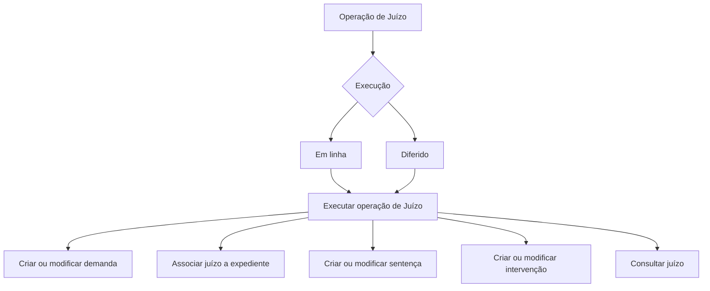

# Certificação de Sinistros — Juízos: Definições e Operações no Reef

## 1. Metadados do Documento
- **Arquivo de Origem:** Não identificado no conteúdo fornecido
- **Tipo de Documento:** Apresentação Executiva / Manual Funcional
- **Domínio / Sistema:** Reef — módulo de Sinistros / Juízos
- **Público-Alvo:** Negócio, analistas funcionais, desenvolvedores, arquitetos e operação
- **Data/Versão Identificada:** Não identificada

---

## 2. Resumo Executivo & Contexto de Negócio

O documento descreve a funcionalidade de **Juízos** no módulo de **Sinistros** da documentação Reef. O conteúdo organiza as definições de cadastros e configurações necessárias para operar processos judiciais associados a sinistros, além de enumerar as operações disponíveis para gestão de demandas, sentenças e intervenções.

A estrutura funcional é separada em três níveis: **Comum**, **Geral** e **Ramo**. O nível Comum concentra definições não exclusivas do módulo de sinistros, mas necessárias para a configuração de juízos, incluindo advogados, procuradores, tribunais e julgados. O nível Geral contém definições que afetam todos os expedientes com juízos. O nível Ramo reúne definições exclusivas do ramo configurado.

O módulo permite configurar informações adicionais de juízos por meio de atributos, estruturas, informações iniciais e validações de informação. Também contempla a determinação do desdobramento econômico de cobranças e pagamentos relacionados a juízos, com exemplos como consignações judiciais e honorários de advogado.

As operações de Juízos podem ser realizadas tanto **em linha** quanto de forma **diferida**. Entre as operações apresentadas estão criar e modificar demanda, associar juízo a expediente, criar e modificar sentença, criar e modificar intervenção no juízo e consultar juízo.

**Nota de Análise:** o documento não detalha contratos de API, métodos HTTP, modelo de dados físico, permissões, integrações externas, regras de cálculo ou critérios técnicos específicos das validações.

---

## 3. Arquitetura, Componentes & Tecnologias Envolvidas

Os componentes funcionais identificados no documento são:

- **Reef:** plataforma/documentação na qual o conteúdo do módulo está publicado.
- **Módulo de Sinistros:** domínio funcional que contém o módulo de Juízos.
- **Juízos:** área funcional destinada à definição e operação de processos judiciais.
- **Mapfredocument:** termo exibido na navegação do documento, sem detalhamento funcional adicional.
- **Definições Comuns:** advogados, procuradores, tribunais e julgados.
- **Definições Gerais:** características, causa de processo e interesses de demora.
- **Definições por Ramo:** causa de processo e tipo de expediente.
- **Definições de Juízos:** atributo, estrutura, informação inicial, validações de informação e desdobramento de conceito de cobrança/pagamento.
- **Operações de Juízos:** criação, modificação, associação e consulta de informações judiciais.

```mermaid
graph TD
  Reef[Documentação Reef] --> Sinistros[Módulo de Sinistros]
  Sinistros --> Juizos[Módulo de Juízos]

  Juizos --> Comum[Definições Comuns]
  Comum --> Advogados[Advogados]
  Comum --> Procuradores[Procuradores]
  Comum --> Tribunais[Tribunais]
  Comum --> Julgados[Julgados]

  Juizos --> Geral[Definições Gerais]
  Geral --> Caracteristicas[Características]
  Geral --> CausaGeral[Causa de Processo]
  Geral --> Interesses[Interesses de Demora]

  Juizos --> Ramo[Definições por Ramo]
  Ramo --> CausaRamo[Causa de Processo por Ramo]
  Ramo --> TipoExpediente[Tipo de Expediente]

  Juizos --> ConfigJuizo[Definições de Juízos]
  ConfigJuizo --> Atributo[Atributo]
  ConfigJuizo --> Estrutura[Estrutura]
  ConfigJuizo --> InfoInicial[Informação Inicial]
  ConfigJuizo --> Validacoes[Validações de Informação]
  ConfigJuizo --> Desglose[Desdobramento de Cobrança/Pagamento]

  Juizos --> Operacoes[Operações de Juízos]
  Operacoes --> CriarDemanda[Criar Demanda]
  Operacoes --> ModificarDemanda[Modificar Demanda]
  Operacoes --> Associar[Associar Juízo a Expediente]
  Operacoes --> CriarSentenca[Criar Sentença]
  Operacoes --> ModificarSentenca[Modificar Sentença]
  Operacoes --> CriarIntervencao[Criar Intervenção]
  Operacoes --> ModificarIntervencao[Modificar Intervenção]
  Operacoes --> Consultar[Consultar Juízo]
```





---

## 4. Regras de Negócio, Especificações Funcionais & Processos

### 4.1 Organização das definições

#### Nível Comum
O nível Comum contém definições que não são exclusivas do módulo de sinistros, mas são necessárias para realizar a definição de Juízos.

As definições comuns apresentadas são:

1. **Advogados:** definir os advogados que trabalharão com a companhia.
2. **Procuradores:** definir os procuradores que trabalharão com a companhia.
3. **Tribunais:** definir os tribunais que trabalharão com a companhia.
4. **Julgados:** definir os julgados que trabalharão com a companhia.

#### Nível Geral
O nível Geral contém definições que afetarão todos os expedientes com juízos.

As definições gerais apresentadas são:

1. **Características:** características gerais do módulo de sinistros que determinam comportamentos.
2. **Causa de Processo:** permite catalogar os motivos pelos quais se deseja reabrir um juízo no nível da companhia.
3. **Interesses de Demora:** permite definir os diferentes tipos de interesse de demora para juízos.

#### Nível Ramo
O nível Ramo contém definições exclusivas do ramo que está sendo definido.

As definições por ramo apresentadas são:

1. **Causa de Processo:** permite catalogar os motivos pelos quais se deseja realizar a reabertura de um juízo para cada ramo.
2. **Tipo de Expediente:** permite definir os tipos de danos aos quais um juízo será associado.

### 4.2 Configuração de Juízos

O documento apresenta os seguintes elementos de configuração para Juízos:

1. **Atributo:** permite definir a informação adicional necessária em cada instalação de Juízos.
2. **Estrutura:** representa informação adicional do juízo composta por atributos, indicação de obrigatoriedade ou não de solicitar informação e ordem em que a informação será solicitada.
3. **Informação Inicial:** permite registrar informação padrão e inicial dos atributos das operações de Juízo, evitando a introdução posterior desses dados.
4. **Validações de Informação:** permite definir comportamentos e validações para a informação de core solicitada nas operações de Juízos.
5. **Desdobramento de Conceito de Cobrança/Pagamento de Juízos:** determina o desdobramento econômico dos juízos. Os exemplos fornecidos são consignações judiciais e honorários de advogado.

### 4.3 Operações de Juízos

Todas as operações que podem ser realizadas com um Juízo podem ser executadas em linha ou de modo diferido.

| Operação | Regra funcional descrita |
| :--- | :--- |
| Criar demanda | Cria a demanda de um juízo. |
| Modificar demanda | Permite alterar informações da demanda de um juízo, incluindo dados e valores. |
| Associar juízo a expediente | Indica quais expedientes estão relacionados ao juízo. |
| Criar sentença | Gera os dados da sentença de um juízo. |
| Modificar sentença | Permite alterar a informação da sentença de um juízo, incluindo dados e valores. |
| Criar intervenção de juízo | Associa ao juízo as pessoas relacionadas a ele, como advogados e testemunhas. |
| Modificar intervenção de juízo | Permite modificar as intervenções e as pessoas associadas ao juízo. |
| Consultar juízo | Visualiza toda a informação de um juízo. |

---

## 5. Tabelas de Parâmetros, Ambientes e Estruturas de Dados

| Item / Parâmetro | Descrição / Função | Tipo / Valores / Formato | Ambiente / Observações |
| :--- | :--- | :--- | :--- |
| Advogados | Define os advogados que trabalharão com a companhia. | Definição comum | Não exclusivo do módulo de sinistros. |
| Procuradores | Define os procuradores que trabalharão com a companhia. | Definição comum | Não exclusivo do módulo de sinistros. |
| Tribunais | Define os tribunais que trabalharão com a companhia. | Definição comum | Não exclusivo do módulo de sinistros. |
| Julgados | Define os julgados que trabalharão com a companhia. | Definição comum | Não exclusivo do módulo de sinistros. |
| Características | Determina comportamentos por meio de características gerais do módulo de sinistros. | Definição geral | Afeta todos os expedientes com juízos. |
| Causa de Processo — companhia | Cataloga motivos para reabrir um juízo no nível da companhia. | Definição geral | Afeta todos os expedientes com juízos. |
| Interesses de Demora | Define diferentes tipos de interesse de demora para juízos. | Definição geral | Não há detalhamento de tipos, cálculos ou valores. |
| Causa de Processo — ramo | Cataloga motivos para reabrir um juízo para cada ramo. | Definição por ramo | Exclusiva do ramo que está sendo definido. |
| Tipo de Expediente | Define os tipos de danos aos quais um juízo será associado. | Definição por ramo | Exclusiva do ramo que está sendo definido. |
| Atributo | Define informações adicionais necessárias em cada instalação de Juízos. | Configuração de Juízo | Não há catálogo de atributos apresentado. |
| Estrutura | Organiza atributos, obrigatoriedade de informação e ordem de solicitação. | Configuração de Juízo | Não há formato de estrutura detalhado. |
| Informação Inicial | Registra valores padrão e iniciais dos atributos das operações de Juízo. | Configuração de Juízo | Evita a introdução posterior de informação. |
| Validações de Informação | Define comportamentos e validações sobre informação de core solicitada nas operações. | Configuração de Juízo | Regras de validação não detalhadas. |
| Desdobramento de Cobrança/Pagamento | Determina o desdobramento econômico de Juízos. | Configuração econômica | Exemplos: consignações judiciais e honorários de advogado. |
| Modalidade de operação | Indica como uma operação de Juízo pode ser executada. | Em linha ou diferido | Aplica-se a todas as operações de Juízos apresentadas. |
| Owner | `user:agonzalez_mapfre.com` | Metadado de documentação | Exibido no conteúdo extraído. |
| Lifecycle | `Approved Source` | Metadado de documentação | Exibido no conteúdo extraído. |

---

## 6. Bateria de Perguntas & Respostas para RAG (FAQ Sintético)

### P1: Qual é o objetivo do módulo de Juízos no módulo de Sinistros?
**R:** O módulo de Juízos organiza definições e operações para gestão de processos judiciais associados a sinistros. O conteúdo apresentado inclui configurações de participantes, tribunais, causas de processo, atributos, estruturas, validações, desdobramentos econômicos, demandas, sentenças, intervenções e consultas.

### P2: Quais cadastros pertencem ao nível Comum das definições de Juízos?
**R:** O nível Comum inclui Advogados, Procuradores, Tribunais e Julgados. Essas definições não são exclusivas do módulo de sinistros, mas são necessárias para realizar a definição de Juízos.

### P3: O que é configurado no nível Geral para Juízos?
**R:** O nível Geral contém definições que afetam todos os expedientes com juízos. O documento cita Características, Causa de Processo no nível da companhia e Interesses de Demora.

### P4: Qual é a diferença entre Causa de Processo no nível Geral e no nível Ramo?
**R:** No nível Geral, Causa de Processo permite catalogar os motivos para reabrir um juízo no nível da companhia. No nível Ramo, Causa de Processo permite catalogar os motivos para realizar a reabertura de um juízo especificamente para cada ramo.

### P5: Para que serve o Tipo de Expediente na configuração por ramo?
**R:** O Tipo de Expediente permite definir os tipos de danos aos quais um juízo será associado. Essa definição é exclusiva do ramo que está sendo configurado.

### P6: Como a Estrutura de Juízo controla as informações adicionais?
**R:** A Estrutura representa a informação adicional de um juízo e é composta por atributos. A Estrutura também define se a solicitação de informação é obrigatória e a ordem em que cada informação será solicitada.

### P7: Qual é a finalidade da Informação Inicial nas operações de Juízo?
**R:** A Informação Inicial permite registrar informações padrão e iniciais para atributos das operações de Juízo. O objetivo descrito é evitar a necessidade de introduzir posteriormente essas informações.

### P8: Quais operações podem ser realizadas sobre uma demanda de Juízo?
**R:** O documento apresenta as operações Criar demanda, que cria a demanda de um juízo, e Modificar demanda, que permite alterar dados e valores da demanda de um juízo.

### P9: Como um Juízo é vinculado a expedientes?
**R:** A operação Associar juízo expediente indica quais expedientes estão relacionados com o juízo.

### P10: Quais operações estão disponíveis para sentenças de Juízos?
**R:** É possível Criar sentença, para gerar os dados da sentença de um juízo, e Modificar sentença, para alterar dados e valores da sentença.

### P11: Como são geridas as pessoas relacionadas a um Juízo?
**R:** A operação Criar intervenção juízo associa ao juízo as pessoas relacionadas, incluindo advogados e testemunhas. A operação Modificar intervenção juízo permite modificar as intervenções e as pessoas associadas ao juízo.

### P12: As operações de Juízos são executadas apenas em tempo real?
**R:** Não. O documento informa que todas as operações que podem ser realizadas com um Juízo podem ser executadas tanto em linha quanto de forma diferida.

---

## 7. Glossário de Termos, Siglas & Conceitos-Chave

- **Reef:** nome da documentação/plataforma em que o conteúdo do módulo está publicado.
- **Sinistros:** módulo funcional que contém o domínio de Juízos.
- **Juízos:** domínio funcional destinado a definições e operações relativas a processos judiciais associados a expedientes.
- **Expediente:** elemento associado a um Juízo; o documento informa que é possível indicar quais expedientes estão relacionados ao Juízo.
- **Ramo:** nível de configuração cujas definições são exclusivas do ramo definido.
- **Causa de Processo:** catálogo de motivos para reabertura de um Juízo, configurável no nível da companhia ou por ramo.
- **Interesses de Demora:** tipos de interesse de demora aplicáveis a Juízos.
- **Atributo:** informação adicional necessária em cada instalação de Juízos.
- **Estrutura:** composição de atributos que inclui obrigatoriedade e ordem de solicitação de informações.
- **Informação Inicial:** informação padrão e inicial para atributos das operações de Juízo.
- **Desdobramento de Cobrança/Pagamento:** determinação do desdobramento econômico de Juízos.
- **Consignações judiciais:** exemplo de desdobramento econômico mencionado no documento.
- **Intervenção de Juízo:** associação e manutenção de pessoas relacionadas a um Juízo, como advogados e testemunhas.
- **Em linha:** modalidade de execução de operações de Juízo.
- **Diferido:** modalidade de execução de operações de Juízo.

---

## 8. Notas Críticas, Riscos & Limitações

- O documento não identifica o nome do arquivo de origem, data, versão ou autoria editorial além do campo `Owner`.
- O documento não detalha o significado técnico de **Reef**, **Mapfredocument**, **expediente**, **ramo**, **instalação de Juízos** ou **informação de core**.
- Não há definição de modelo de dados, campos obrigatórios, formatos, regras de validação, mensagens de erro, valores de domínio ou critérios de cálculo.
- Os tipos de Interesses de Demora são mencionados, mas não há detalhamento dos tipos disponíveis, taxas, fórmulas ou condições de aplicação.
- O documento cita execução em linha e diferida, mas não descreve mecanismo de processamento, agendamento, filas, estados, auditoria ou tratamento de falhas.
- Não há detalhes sobre integrações, APIs, autenticação, autorização, permissões de usuário, ambiente de execução, URLs, servidores, logs ou monitoramento.
- **Nota de Análise:** o documento lista operações de Juízos, porém não detalha os fluxos de aprovação, contratos de entrada/saída, métodos HTTP ou contratos JSON.

---

## 9. Conteúdo Bruto Estruturado (Referência Fiel)

```text
--- [PÁGINA 1 DE 3] ---

CERTIFICACIÓN de SINIESTROS - JUICIOS
Deniciones Juicios
Operaciones Juicios
DEFINICIONES
COMÚN
En este nivel se encuentran deniciones que NO son exclusivas del módulo de siniestros, pero son
necesarias para poder realizar la denición. Entre otras deniciones se encuentra:
ABOGADOS
Denir los abogados que van a trabajar
con la compañía
PROCURADORES
Denir los procuradores que van a trabajar
con la compañía
TRIBUNALES
Denir los tribunales que van a trabajar
con la compañía
JUZGADO
Denir los juzgados que van a trabajar con
la compañía
GENERAL
En este nivel se encuentran deniciones que afectarán a todos los expedientes con juicios.
CARACTERÍSTICAS
Características Generales del módulo de
siniestros, determina comportamientos
CAUSA PROCESO
Permite catalogar los motivos por los que
se quiere re-aperturar un juicio a nivel de
INTERESES DE DEMORA
Permite denir los Tipos distintos tipos de
interés de demora para los juicios
Documentation / DOCUMENTACIÓN Reef
DOCUMENTACIÓN Reef
Mapfredocument
DOCUMENTACIÓN Reef
Owner
user:agonzalez_mapfre.com
Lifecycle
Approved Source
 / 
 VL
Buscar Inicio Soluciones Arquitecturas APIs Componentes Cloud Documentación Zeus Reef Ayuda
ES


--- [PÁGINA 2 DE 3] ---

del módulo de juicios por ejemplo si se
permite más de un siniestro en un juicio
compañía
RAMO
Son exclusivas del ramo que se está deniendo.
CAUSA PROCESO
Permite catalogar los motivos por los que se quiere realizar la
reapertura de un juicio para cada ramo
TIPO EXPEDIENTE
Permite denir los Tipos de Daños a los que se le va a asociar un
juicio
JUICIO
Deniciones de juicios
ATRIBUTO
Permite denir la información adicional
que se necesite en cada instalación de los
juicios.
ESTRUCTURA
Información adicional del juicio
compuesta por atributos, obligatoriedad o
no de pedir información, orden en el que
se va a pedir
INFORMACIÓN INICIAL
Permite registrar información por defecto,
inicial de los atributos de las operaciones
de juicio, para no tener que introducirla
posteriormente
VALIDACIONES INFORMACIÓN
Denir comportamientos y validaciones de
la información de core que se piden en las
operaciones de juicios
DESGLOSE CONCEPTO COBRO PAGO
JUICIOS
Determinar el desglose económico de los
juicios. Por ejemplo consignaciones
judiciales u honorarios abogado...
OPERACIONES
JUICIOS
Todas las Operaciones que se pueden realizar con un Juicios, se pueden realizar tanto en línea como
diferido
CREAR demanda
En esta operación se crea la demanda de
un juicio
MODIFICAR demanda
Permite cambiar información de la
demanda de un juicio, datos e importes
ASOCIAR juicio expediente
En esta operación se indica que
expedientes están relacionados con el
juicio
CREAR Sentencia
En esta operación se generan los datos de
la sentencia de un juicio
MODIFICAR Sentencia
Permite cambiar la información de la
sentencia de un juicio, datos e importes
CREAR intervención juicio
Asociar al juicio las personas relacionadas
con el mismo, abogados, testigos.. etc
MODIFICAR intervención juicio
 CONSULTAR juicio


--- [PÁGINA 3 DE 3] ---

Permite modicar las intervenciones, las
personas asociadas al juicio
Visualiza toda la información de un juicio
```
