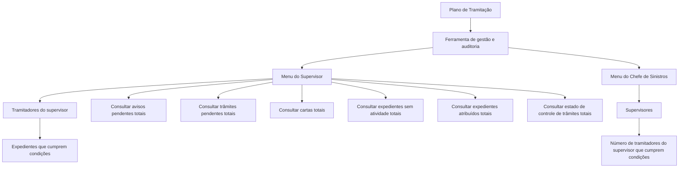

# Certificação de Sinistros — Menu do Supervisor e Auditoria

## 1. Metadados do Documento
- **Arquivo de Origem:** Não identificado no conteúdo fornecido
- **Tipo de Documento:** Manual Operacional
- **Domínio / Sistema:** Reef / Certificação de Sinistros / Auditoria
- **Público-Alvo:** Supervisores, chefes de sinistros e tramitadores
- **Data/Versão Identificada:** Não identificada

---

## 2. Resumo Executivo & Contexto de Negócio

O documento descreve os menus de **Supervisor** e **Chefe de Sinistros** da funcionalidade de auditoria associada à **Certificação de Sinistros**. A ferramenta organiza o trabalho de gestão e auditoria dos supervisores com base no **Plano de Tramitação**.

O objetivo principal declarado é controlar a gestão dos tramitadores. Para responsáveis ou chefes de sinistros, o objetivo é controlar a gestão dos supervisores sob sua responsabilidade.

No menu do supervisor, as consultas apresentam os tramitadores vinculados ao supervisor e a quantidade de expedientes que atendem às condições aplicáveis. No menu do chefe de sinistros, são apresentados os supervisores e a quantidade de tramitadores de cada supervisor que cumprem as condições consultadas.

As operações disponíveis cobrem avisos pendentes, trâmites pendentes, cartas geradas, expedientes sem atividade, expedientes atribuídos e estado de controle de trâmites. O documento não detalha telas, permissões específicas, contratos técnicos, métodos HTTP, persistência de dados ou critérios completos de filtragem.

---

## 3. Arquitetura, Componentes & Tecnologias Envolvidas

Os elementos explicitamente citados no documento são:

- **Certificação de Sinistros:** contexto funcional do menu.
- **Auditoria:** finalidade associada ao menu de supervisor e chefe de sinistros.
- **Plano de Tramitação:** base para organização do trabalho de gestão e auditoria.
- **Supervisor:** consulta tramitadores e números de expedientes que atendem às condições.
- **Chefe de Sinistros:** consulta supervisores e o número de tramitadores do supervisor que atendem às condições.
- **Tramitador:** possui expedientes e aplica condições de filtro em determinadas consultas.
- **Expediente:** unidade consultada nas operações disponíveis.
- **DOCUMENTACIÓN Reef / Reef:** área documental indicada no rodapé do conteúdo.
- **Mapfredocument:** nome apresentado na navegação documental.
- **Zeus:** item apresentado na navegação documental.



**Nota de Análise:** O conteúdo não descreve arquitetura de infraestrutura, APIs, bancos de dados, tecnologias de implementação, URLs de ambiente, servidores ou integrações externas.

---

## 4. Regras de Negócio, Especificações Funcionais & Processos

### Finalidade da ferramenta

1. A ferramenta organiza o trabalho de gestão e auditoria dos supervisores.
2. A organização é baseada no **Plano de Tramitação**.
3. O controle de gestão é aplicado aos tramitadores no contexto do supervisor.
4. Para responsáveis ou chefes de sinistros, a gestão é aplicada aos supervisores.

### Visão por perfil

1. **Supervisor**
   - Visualiza os tramitadores sob sua supervisão.
   - Visualiza o número de expedientes que cumprem as condições aplicáveis à consulta.

2. **Chefe de Sinistros**
   - Visualiza os supervisores.
   - Visualiza o número de tramitadores de cada supervisor que cumprem as condições aplicáveis.

### Operações de consulta

1. **Consultar avisos pendentes totais**
   - Mostra os tramitadores do supervisor.
   - Mostra o número de expedientes que possuem aviso pendente.
   - Considera as condições filtradas pelo supervisor.

2. **Consultar trâmites pendentes totais**
   - Mostra os tramitadores do supervisor.
   - Mostra o número de expedientes que possuem o trâmite indicado pendente.
   - Considera as condições filtradas pelo tramitador.

3. **Consultar cartas totais**
   - Mostra os tramitadores do supervisor.
   - Mostra o número de expedientes para os quais foi gerada a carta indicada.
   - Considera as condições filtradas pelo tramitador.

4. **Consultar expedientes sem atividade totais**
   - Mostra os tramitadores do supervisor.
   - Mostra o número de expedientes nos quais não foi realizada nenhuma operação.
   - Considera as condições filtradas pelo tramitador.

5. **Consultar expedientes atribuídos totais**
   - Mostra os tramitadores do supervisor.
   - Mostra o número de expedientes atribuídos ao tramitador.
   - Os exemplos de estado exibidos são: **pendente**, **em juízo** e **retido por c.t.**
   - Considera as condições filtradas pelo tramitador.

6. **Consultar estado de controle de trâmites totais**
   - Mostra os tramitadores do supervisor.
   - Mostra o número de expedientes que possuem data de controle definida.
   - A data de controle representa o tempo máximo para realização.
   - A consulta considera o estado indicado pelo tramitador.
   - Considera as condições filtradas pelo tramitador.

---

## 5. Tabelas de Parâmetros, Ambientes e Estruturas de Dados

| Item / Parâmetro | Descrição / Função | Tipo / Valores / Formato | Ambiente / Observações |
| :--- | :--- | :--- | :--- |
| Plano de Tramitação | Base para organização do trabalho de gestão e auditoria | Conceito/processo | Não há detalhamento adicional |
| Supervisor | Consulta tramitadores e quantidades de expedientes que atendem a condições | Perfil funcional | Aplicável ao menu do supervisor |
| Chefe de Sinistros | Consulta supervisores e número de tramitadores que cumprem condições | Perfil funcional | Aplicável ao menu de chefe de sinistros |
| Tramitador | Responsável associado aos expedientes apresentados nas consultas | Entidade/perfil funcional | Aplica filtros em diversas operações descritas |
| Expediente | Unidade contabilizada nas operações de consulta | Entidade de negócio | Não há estrutura de dados detalhada |
| Aviso pendente | Condição para contabilização de expedientes | Estado/condição | Filtro realizado pelo supervisor |
| Trâmite indicado pendente | Condição para contabilização de expedientes | Estado/condição | Filtro realizado pelo tramitador |
| Carta indicada gerada | Condição para contabilização de expedientes | Evento/condição | Filtro realizado pelo tramitador |
| Sem atividade | Expediente sem nenhuma operação realizada | Estado/condição | Filtro realizado pelo tramitador |
| Estado de expediente | Estado usado na consulta de expedientes atribuídos | Pendente; em juízo; retido por c.t. | Lista apresentada como exemplos no documento |
| Data de controle | Tempo máximo para realização de um trâmite | Data | Considerada na consulta de estado de controle de trâmites |
| Estado indicado pelo tramitador | Estado usado na consulta de controle de trâmites | Não detalhado | Associado a expedientes com data de controle definida |

**Nota de Análise:** O conteúdo não fornece servidores, URLs, variáveis de configuração, portas, formatos de payload, contratos de dados ou ambientes técnicos.

---

## 6. Bateria de Perguntas & Respostas para RAG (FAQ Sintético)

### P1: Qual é o objetivo do menu de Supervisor e Chefe de Sinistros?
**R:** O menu organiza o trabalho de gestão e auditoria dos supervisores com base no Plano de Tramitação. O objetivo principal é controlar a gestão dos tramitadores e, para responsáveis ou chefes de sinistros, controlar a gestão dos supervisores.

### P2: O que o supervisor visualiza nas consultas do menu?
**R:** O supervisor visualiza os tramitadores sob sua supervisão e o número de expedientes que cumprem as condições da consulta realizada.

### P3: O que o chefe de sinistros visualiza no menu?
**R:** O chefe de sinistros visualiza os supervisores e o número de tramitadores de cada supervisor que cumprem as condições consultadas.

### P4: O que é mostrado em “Consultar avisos pendentes totais”?
**R:** A consulta mostra os tramitadores do supervisor e o número de expedientes que possuem aviso pendente, considerando as condições filtradas pelo supervisor.

### P5: Como funciona a consulta de trâmites pendentes totais?
**R:** A consulta apresenta os tramitadores do supervisor e o número de expedientes que possuem o trâmite indicado pendente, considerando as condições filtradas pelo tramitador.

### P6: O que a consulta de cartas totais contabiliza?
**R:** A consulta mostra os tramitadores do supervisor e o número de expedientes para os quais foi gerada a carta indicada, considerando as condições filtradas pelo tramitador.

### P7: Como são identificados os expedientes sem atividade?
**R:** A consulta de expedientes sem atividade totais mostra os tramitadores do supervisor e a quantidade de expedientes nos quais não foi realizada nenhuma operação, considerando as condições filtradas pelo tramitador.

### P8: Quais estados são citados para expedientes atribuídos?
**R:** O documento cita como exemplos os estados pendente, em juízo e retido por c.t. A consulta mostra os tramitadores do supervisor e o número de expedientes que cada tramitador possui nesses estados, conforme as condições filtradas pelo tramitador.

### P9: O que significa data de controle na consulta de estado de controle de trâmites?
**R:** A data de controle é definida como o tempo máximo para realização. A consulta mostra expedientes que possuem data de controle definida no estado indicado pelo tramitador, considerando as condições filtradas pelo tramitador.

### P10: O documento especifica APIs, métodos HTTP ou contratos JSON?
**R:** Não. O conteúdo fornecido descreve funcionalidades de consulta do menu, mas não detalha APIs, métodos HTTP, contratos JSON, tecnologias, bancos de dados ou integrações técnicas.

---

## 7. Glossário de Termos, Siglas & Conceitos-Chave

- **Auditoria:** contexto funcional do menu destinado à gestão e ao controle.
- **Carta:** elemento cuja geração em um expediente pode ser consultada.
- **Certificação de Sinistros:** contexto ou módulo indicado no título do conteúdo.
- **Chefe de Sinistros:** perfil que visualiza supervisores e a quantidade de tramitadores que cumprem condições.
- **Expediente:** unidade de negócio contabilizada nas consultas do menu.
- **Plano de Tramitação:** base utilizada para organizar o trabalho de gestão e auditoria.
- **Supervisor:** perfil que visualiza seus tramitadores e as quantidades de expedientes correspondentes.
- **Tramitador:** perfil ou entidade associada aos expedientes e aos filtros de diversas consultas.
- **c.t.:** sigla apresentada na expressão “retido por c.t.”; o significado não é detalhado no documento.
- **Reef:** nome presente na área de documentação indicada no conteúdo.
- **Mapfredocument:** nome apresentado na navegação da documentação.
- **Zeus:** item apresentado na navegação da documentação.

---

## 8. Notas Críticas, Riscos & Limitações

- O documento não identifica o arquivo original, data, versão, autor técnico ou responsável funcional.
- O documento não detalha os campos dos filtros aplicados pelo supervisor ou pelo tramitador.
- O documento não define o critério operacional de “aviso pendente”, “trâmite pendente”, “sem atividade” ou “carta indicada”.
- A expressão **“retido por c.t.”** é citada, mas a sigla **c.t.** não é expandida.
- O documento não especifica permissões, autenticação, matriz de acesso ou diferenciação técnica entre os perfis.
- O documento não descreve tecnologias, arquitetura de implantação, bancos de dados, APIs, integrações, logs ou mecanismos de tratamento de erro.
- **Nota de Análise:** O conteúdo lista operações de consulta, mas não detalha o comportamento de navegação, os critérios completos de agregação nem as regras para atualização dos dados exibidos.

---

## 9. Conteúdo Bruto Estruturado (Referência Fiel)

```text
--- [PÁGINA 1 DE 1] ---

CERTIFICACIÓN de SINIESTROS - MENÚ DEL SUPERVISOR
AUDITORIA
MENÚ SUPERVISOR Y JEFE DE SINIESTROS
Herramienta para organizar el trabajo de gestión y auditoria de los supervisores, basado en el "Plan de Tramitación", cuyo principal
objetivo es el Control de la gestión de sus tramitadores y en el caso de los responsables o jefes de siniestros la gestión de sus
supervisores. A continuación se detallan las distintas operaciones de ambos menús.
En el caso del supervisor lo que muestra son los tramitadores y el número de expedientes que cumplen las condiciones, en el caso del
jefe del siniestros, muestra los supervisores, y el número de tramitadores del supervisor que cumplen con las condiciones.
CONSULTAR avisos pendientes totales
Muestra los tramitadores del supervisor y
el número de expedientes que tengan
aviso pendiente, con las condiciones que
haya ltrado el supervisor
CONSULTAR tramites pendientes totales
Muestra los tramitadores del supervisor y
el número expedientes que tengan el
trámite indicado pendiente con las
condiciones que haya ltrado el tramitador
CONSULTAR cartas totales
Muestra los tramitadores del supervisor y
el número expedientes a los que se les
haya generado la carta indicada, con las
condiciones que haya ltrado el tramitador
CONSULTAR expedientes sin actividad
totales
Muestra los tramitadores del supervisor y
el número expedientes que no se haya
realizado ninguna operación con ellos, con
las condiciones que haya ltrado el
tramitador
CONSULTAR expedientes asignados
totales
Muestra los tramitadores del supervisor y
el número expedientes que tenga el
tramitador con el estado (pendiente, en
juicio, retenido por c.t...) y las condiciones
que haya ltrado el tramitador
CONSULTAR estado control tramites
totales
Muestra los tramitadores del supervisor y
el número expedientes que tengan
denido fecha de control (tiempo máximo
para realizarse) en el estado que indique
el tramitador y las condiciones que haya
ltrado el tramitador
Documentation / DOCUMENTACIÓN Reef
DOCUMENTACIÓN Reef
Mapfredocument
DOCUMENTACIÓN Reef
Owner
user:agonzalez_mapfre.com
Lifecycle
Approved Source
 / 
 VL
Buscar Inicio Soluciones Arquitecturas APIs Componentes Cloud Documentación Zeus Reef Ayuda
ES
```
