# Certificação de Sinistros — Peritagens: Definições, Configurações e Operações

## 1. Metadados do Documento
- **Arquivo de Origem:** `Não identificado no conteúdo fornecido`
- **Tipo de Documento:** Manual Operacional / Documentação Funcional
- **Domínio / Sistema:** Certificação de Sinistros — Peritagens; documentação Reef / Mapfredocument
- **Público-Alvo:** Não identificado explicitamente no texto
- **Data/Versão Identificada:** Não identificada

---

## 2. Resumo Executivo & Contexto de Negócio

O documento descreve o domínio funcional de **peritagens** no contexto de certificação de sinistros. O conteúdo organiza as definições necessárias para configurar peritos, oficinas, centros de peritagem, locais de trabalho, honorários, causas de processo e resultados de visitas.

A documentação separa as configurações em níveis: **COMÚN**, destinado a definições não exclusivas do módulo de sinistros; **GENERAL**, aplicável a expedientes que podem receber uma peritagem; **RAMO**, com definições exclusivas do ramo configurado; e **PERITACIÓN**, com elementos que afetam todas as peritagens.

O processo operacional contempla a criação e alteração de solicitações de peritagem, resultados, danos e ordens de reparação, além da anulação de ordens e consulta integral de uma peritagem. As operações podem ser realizadas tanto **em linha** quanto **diferidas**.

O documento não especifica métodos HTTP, contratos de integração, URLs de ambientes, tecnologias de implementação, modelos de dados físicos, permissões, responsáveis operacionais ou regras de cálculo monetário. O conteúdo é predominantemente funcional e configuracional.

---

## 3. Arquitetura, Componentes & Tecnologias Envolvidas

Os componentes e conceitos explicitamente citados são:

- **Reef / DOCUMENTACIÓN Reef:** contexto de documentação apresentado no conteúdo.
- **Mapfredocument:** nome exibido no cabeçalho da documentação.
- **Módulo de sinistros:** módulo citado como referência para definições comuns e peritagens.
- **Expediente:** entidade sobre a qual podem ser realizadas operações de peritagem.
- **Perito, inspetor, tramitador e profissional:** papéis mencionados em configurações ou operações.
- **Oficina, centro de peritagem, local de peritagem e propriedade:** entidades funcionais relacionadas à execução da peritagem.
- **Solicitação, resultado, dano e ordem de reparação:** elementos operacionais da peritagem.

```mermaid
graph TD
  A[Certificação de Sinistros — Peritagens] --> B[Definições]
  A --> C[Operações de Peritagem]

  B --> B1[Comum]
  B --> B2[General]
  B --> B3[Ramo]
  B --> B4[Peritação]

  B1 --> B11[Perito]
  B1 --> B12[Oficina]
  B1 --> B13[Centro de Peritagem]

  B2 --> B21[Causa Processo]
  B2 --> B22[Lugares de Peritagem]
  B2 --> B23[Quadro de Honorários]
  B2 --> B24[Resultado de Visitas]
  B2 --> B25[Peritos por Centro]

  B3 --> B31[Tipo de Expediente]
  B3 --> B32[Causa Processo]
  B3 --> B33[Atividade Peritar]
  B3 --> B34[Propriedade]

  B4 --> B41[Atributo]
  B4 --> B42[Estrutura]
  B4 --> B43[Informação Inicial]
  B4 --> B44[Validações de Informação]
  B4 --> B45[Detalhe de Peritagem]
  B4 --> B46[Partes e Sub-partes]
  B4 --> B47[Danos]
  B4 --> B48[Reparação]

  C --> C1[Criar solicitação]
  C --> C2[Modificar solicitação]
  C --> C3[Criar resultado]
  C --> C4[Modificar resultado]
  C --> C5[Criar dano]
  C --> C6[Modificar dano]
  C --> C7[Criar ordem de reparação]
  C --> C8[Modificar ordem de reparação]
  C --> C9[Anular ordem de reparação]
  C --> C10[Consultar peritagem]
```



**Nota de Análise:** o documento apresenta relações funcionais entre entidades e operações, mas não detalha arquitetura lógica, microsserviços, bancos de dados, APIs, protocolos ou integrações técnicas.

---

## 4. Regras de Negócio, Especificações Funcionais & Processos

### 4.1 Nível COMÚN

O nível **COMÚN** contém definições que não são exclusivas do módulo de sinistros, mas são necessárias para definir peritagens.

- **Perito:** permite registrar todos os peritos da companhia.
- **Oficina:** permite registrar todas as oficinas da companhia.
- **Centro de Peritagem:** permite registrar diferentes centros de peritagem para posterior associação de peritos.

### 4.2 Nível GENERAL

O nível **GENERAL** contém definições que afetam todos os possíveis expedientes aos quais pode ser realizada uma peritagem.

- **Causa Processo:** permite catalogar os motivos pelos quais se pretende realizar uma peritagem.
- **Lugares de Peritagem:** permite definir locais de trabalho de peritos e inspetores, isto é, onde poderão realizar peritagens. Os exemplos citados são oficina, residência do segurado e empresa do segurado.
- **Quadro de Honorários:** permite definir honorários distintos para peritos, inspetores externos e outros profissionais, conforme os diferentes locais de trabalho.
- **Resultado de Visitas:** permite definir resultados de visitas que podem ou não disparar o resultado da peritagem.
  - Se uma visita for **falida**, o resultado da peritagem **não será disparado**.
  - Em caso de visita falida, é necessário realizar a visita novamente.
- **Peritos por Centro:** permite associar peritos aos diferentes centros de peritagem.

### 4.3 Nível RAMO

O nível **RAMO** contém definições exclusivas do ramo que está sendo configurado.

- **Tipo de Expediente:** permite definir os tipos de dano que poderão receber uma peritagem e indicar se a peritagem é obrigatória ou não.
- **Causa Processo:** permite catalogar os motivos pelos quais se pretende realizar uma operação. Os exemplos fornecidos são causa da peritagem, subscrição e avaliação de danos para reparação.
- **Atividade Peritar:** permite definir quais atividades estão capacitadas para realizar peritagens. Os exemplos mencionados são peritos, inspetores e tramitadores.
- **Propriedade:** define a propriedade que será peritada por tipo de dano.

### 4.4 Nível PERITACIÓN

O nível **PERITACIÓN** afeta todas as peritagens.

- **Atributo:** permite definir informação adicional da peritagem.
- **Estrutura:** corresponde a informação adicional da peritagem.
- **Informação Inicial:** permite registrar informação prévia para atributos das operações de peritagem, evitando a introdução posterior dessa informação.
  - Exemplo do documento: atribuir por padrão a atividade de perito para realizar a peritagem.
- **Validações de Informação:** permite definir comportamentos e validações da informação de core solicitada nas operações de peritagem.
- **Detalhe de Peritagem:** determina o conceito de detalhe da peritagem para realizar uma ordem de reparação.
  - Exemplos: reparação, chapa, pintura e mão de obra.
- **Partes:** define partes de uma propriedade.
  - Exemplo: para um veículo, parte dianteira ou lateral direita.
- **Sub-partes:** permite dividir partes de uma propriedade.
  - Exemplo: a parte dianteira pode ser subdividida.
- **Danos:** define danos por propriedade.
- **Reparação:** codifica as possíveis reparações de uma propriedade.
  - Exemplos: substituir ou reparar elementos como capô e para-choques.

### 4.5 Operações de Peritagem

As operações de peritagem de um expediente podem ser executadas **em linha** ou **de forma diferida**.

| Operação | Regra ou finalidade funcional |
| :--- | :--- |
| Criar solicitação de peritagem | Registra uma solicitação para realizar uma peritagem ou investigação. |
| Modificar solicitação | Permite alterar informações da solicitação de peritagem. |
| Criar resultado | Gera os dados do resultado da peritagem realizada por um profissional. |
| Modificar resultado | Permite alterar informações do resultado da peritagem. |
| Criar dano de peritagem | Registra danos ocasionados em veículo, imóvel ou outra propriedade. |
| Modificar dano de peritagem | Permite modificar danos ocasionados em veículo, imóvel ou outra propriedade. |
| Criar ordem de reparação | Gera uma ordem que permite pagar um profissional que tenha intervindo na peritagem. |
| Modificar ordem de reparação | Permite modificar dados e importes de uma ordem de reparação. |
| Anular ordem de reparação | Permite cancelar uma ordem de reparação. |
| Consultar peritagem | Visualiza todas as informações de uma peritagem. |

---

## 5. Tabelas de Parâmetros, Ambientes e Estruturas de Dados

| Item / Parâmetro | Descrição / Função | Tipo / Valores / Formato | Ambiente / Observações |
| :--- | :--- | :--- | :--- |
| Perito | Registra todos os peritos da companhia. | Entidade de configuração | Nível COMÚN |
| Oficina | Registra todas as oficinas da companhia. | Entidade de configuração | Nível COMÚN |
| Centro de Peritagem | Registra centros para posterior associação de peritos. | Entidade de configuração | Nível COMÚN |
| Causa Processo | Cataloga motivos para realizar uma peritagem. | Catálogo de motivos | Nível GENERAL |
| Lugares de Peritagem | Define locais onde peritos e inspetores podem realizar peritagens. | Oficina; residência do segurado; empresa do segurado | Nível GENERAL |
| Quadro de Honorários | Define honorários por tipo de profissional e local de trabalho. | Honorários diferenciados | Nível GENERAL |
| Resultado de Visitas | Define resultados de visita e seu impacto no disparo do resultado da peritagem. | Visita falida não dispara resultado | Nível GENERAL |
| Peritos por Centro | Associa peritos aos centros de peritagem. | Associação perito–centro | Nível GENERAL |
| Tipo de Expediente | Define tipos de dano sujeitos a peritagem e obrigatoriedade. | Obrigatória ou não obrigatória | Nível RAMO |
| Causa Processo | Cataloga motivos para realizar uma operação. | Exemplos: causa da peritagem, subscrição, avaliação de danos para reparação | Nível RAMO |
| Atividade Peritar | Define atividades capacitadas para realizar peritagens. | Peritos; inspetores; tramitadores | Nível RAMO |
| Propriedade | Define a propriedade a peritar por tipo de dano. | Propriedade por tipo de dano | Nível RAMO |
| Atributo | Define informação adicional da peritagem. | Informação adicional | Nível PERITACIÓN |
| Estrutura | Representa informação adicional da peritagem. | Informação adicional | Nível PERITACIÓN |
| Informação Inicial | Registra valores prévios para atributos de operações de peritagem. | Exemplo: atividade padrão de perito | Nível PERITACIÓN |
| Validações de Informação | Define comportamentos e validações para informação de core. | Regras de validação | Nível PERITACIÓN |
| Detalhe de Peritagem | Determina conceitos para ordem de reparação. | Reparação; chapa; pintura; mão de obra | Nível PERITACIÓN |
| Partes | Define partes de uma propriedade. | Exemplo: parte dianteira; lateral direita | Nível PERITACIÓN |
| Sub-partes | Subdivide partes de uma propriedade. | Subdivisão de partes | Nível PERITACIÓN |
| Danos | Define danos por propriedade. | Configuração de danos | Nível PERITACIÓN |
| Reparação | Codifica reparações possíveis para uma propriedade. | Substituir; reparar; capô; para-choques | Nível PERITACIÓN |
| Modalidade de operação | Indica como operações de peritagem podem ser executadas. | Em linha; diferido | Operações de peritagem |

**Nota de Análise:** o documento não fornece nomes técnicos de parâmetros, tipos de dados, valores numéricos, URLs, servidores, portas, credenciais, caminhos de log ou identificação de ambientes.

---

## 6. Bateria de Perguntas & Respostas para RAG (FAQ Sintético)

### P1: Qual é a finalidade do nível COMÚN nas definições de peritagem?
**R:** O nível COMÚN reúne definições que não são exclusivas do módulo de sinistros, mas são necessárias para configurar peritagens. Nesse nível são registrados peritos, oficinas e centros de peritagem.

### P2: Como é feita a associação entre peritos e centros de peritagem?
**R:** A associação é realizada pela definição **Peritos por Centro**, localizada no nível GENERAL. Essa definição permite vincular peritos aos diferentes centros de peritagem.

### P3: O que acontece quando uma visita de peritagem tem resultado falido?
**R:** Quando a visita é falida, o resultado da peritagem não é disparado. O documento estabelece que, nesse caso, será necessário realizar a visita novamente.

### P4: Quais locais podem ser definidos em Lugares de Peritagem?
**R:** Lugares de Peritagem define os locais de trabalho onde peritos e inspetores poderão realizar peritagens. Os exemplos apresentados são uma oficina, a residência do segurado e a empresa do segurado.

### P5: Como o Tipo de Expediente controla a obrigatoriedade da peritagem?
**R:** O Tipo de Expediente, no nível RAMO, permite definir os tipos de dano que poderão receber uma peritagem e indicar se a peritagem é obrigatória ou não.

### P6: Quais atividades podem ser capacitadas para realizar peritagens?
**R:** A definição Atividade Peritar permite configurar quais atividades estão capacitadas para realizar peritagens. O documento cita como exemplos peritos, inspetores e tramitadores.

### P7: Para que serve a Informação Inicial em uma peritagem?
**R:** Informação Inicial permite registrar informações prévias para atributos das operações de peritagem, evitando sua inserção posterior. O exemplo apresentado é atribuir por padrão a atividade de perito para a realização da peritagem.

### P8: O que é configurado em Detalhe de Peritagem?
**R:** Detalhe de Peritagem determina o conceito de detalhe necessário para realizar uma ordem de reparação. Os exemplos citados são reparação, chapa, pintura e mão de obra.

### P9: Quais operações podem ser realizadas sobre uma solicitação de peritagem?
**R:** O documento prevê criar uma solicitação de peritagem, para registrar uma solicitação de peritagem ou investigação, e modificar uma solicitação, para alterar suas informações.

### P10: Qual operação permite registrar danos em veículos ou imóveis?
**R:** A operação **Criar dano de peritagem** permite registrar danos ocasionados em veículos, imóveis ou outras propriedades. A operação **Modificar dano de peritagem** permite alterar os danos registrados.

### P11: Qual é a finalidade de uma ordem de reparação?
**R:** A operação Criar ordem de reparação gera uma ordem que permite pagar um profissional que tenha intervindo na peritagem. A ordem pode ser modificada quanto aos dados e importes, ou anulada para cancelamento.

### P12: As operações de peritagem são apenas online?
**R:** Não. O documento informa que as operações de peritagem de um expediente podem ser realizadas tanto em linha quanto de forma diferida.

---

## 7. Glossário de Termos, Siglas & Conceitos-Chave

- **Peritagem / Peritación:** atividade e conjunto de operações para avaliar uma propriedade, dano ou expediente no contexto de sinistros.
- **Perito:** profissional registrado pela companhia para atuar em peritagens.
- **Inspetor:** papel citado como apto a realizar peritagens e como usuário de locais de peritagem.
- **Tramitador:** atividade citada como potencialmente capacitada para realizar peritagens.
- **Expediente:** entidade para a qual podem ser realizadas operações de peritagem.
- **Ramo:** nível de definição exclusivo do ramo configurado.
- **Centro de Peritagem:** centro cadastrado ao qual peritos podem ser associados.
- **Quadro de Honorários:** definição de honorários para peritos, inspetores externos e outros profissionais conforme o local de trabalho.
- **Ordem de Reparação:** ordem gerada para permitir o pagamento de um profissional que intervenha na peritagem.
- **Reef:** termo exibido como contexto de documentação; o documento não apresenta sua expansão.
- **Mapfredocument:** nome exibido na documentação; o documento não detalha seu significado funcional ou técnico.
- **VL:** sigla exibida no cabeçalho da documentação, sem expansão ou explicação no conteúdo.

---

## 8. Notas Críticas, Riscos & Limitações

- O documento não apresenta métodos HTTP, APIs, contratos JSON, eventos, filas, integrações ou detalhes de microsserviços.
- O documento não informa tecnologias, versões, ambientes, servidores, URLs, portas, credenciais, rotas de log ou mecanismos de autenticação.
- Não há detalhamento de campos obrigatórios, regras de cálculo de honorários, regras de cálculo de importes ou critérios de validação de core.
- A relação entre criação de solicitação, criação de resultado, registro de danos e ordem de reparação é funcionalmente apresentada, mas o documento não define uma sequência obrigatória entre todas essas operações.
- A operação de consulta informa que visualiza toda a informação da peritagem, mas não especifica filtros, permissões, formatos de saída ou campos exibidos.
- **Nota de Análise:** o documento lista funcionalidades de peritagem, porém não detalha contratos operacionais ou técnicos para implementação e integração.

---

## 9. Conteúdo Bruto Estruturado (Referência Fiel)

```text
--- [PÁGINA 1 DE 3] ---

CERTIFICACIÓN de SINIESTROS - PERITACIONES
Deniciones Peritaciones
Operaciones Peritaciones
DEFINICIONES
COMÚN
En este nivel se encuentran deniciones que NO son exclusivas del módulo de siniestros, pero son
necesarias para poder realizar la denición de peritaciones. En otros se encuentran:
PERITO
Registrar todos los peritos de la compañía
TALLER
Registrar todos los talleres de la compañía
CENTRO DE PERITACIÓN
Registrar los diferentes Centros de
Peritación, para posteriormente asociar
peritos
GENERAL
En este Nivel se encuentran deniciones que afectarán a todos los posibles expedientes a los que se les
pueda realizar una peritación. Entre otros se dene:
CAUSA PROCESO 
Permite catalogar los motivos por los que
se quiere realizar una peritación
LUGARES PERITACIÓN
Permite denir los lugares de trabajo de
los peritos, inspectores, es decir dónde va
a poder realizar las peritaciones. Por
ejemplo en un taller, en el hogar del
CUADRO HONORARIOS
Permite denir para peritos, inspectores
externos etc, diferentes honorarios según
los distintos lugares de trabajo de los
peritos
Documentation / DOCUMENTACIÓN Reef
DOCUMENTACIÓN Reef
Mapfredocument
DOCUMENTACIÓN Reef
Owner
user:agonzalez_mapfre.com
Lifecycle
Approved Source
 / 
 VL
Buscar Inicio Soluciones Arquitecturas APIs Componentes Cloud Documentación Zeus Reef Ayuda
ES


--- [PÁGINA 2 DE 3] ---

asegurado, en la empresa del asegurado,
etc
RESULTADO VISITAS
Permite denir diferentes resultados de
las visitas pudiendo desencadenar o no el
resultado de la peritación. Por ejemplo si
la visita es fallida no se disparará el
resultado de la peritación, ya que habrá
que volver a realizar la visita
PERITOS POR CENTRO
Permite asociar los peritos a los distintos
centros de periración
RAMO
Son exclusivas del ramo que se está deniendo
TIPO EXPEDIENTE 
Permite denir los Tipos de Daño a los
que se les va a poder realizar una
peritación y si esta es obligatoria o no
CAUSA PROCESO 
Permite catalogar los motivos por los que
se quiere realizar una operación. Ejemplo
causa de la peritación, para suscripción,
evaluación de daños para reparación
ACTIVIDAD PERITAR
Denir que actividad está capacitada para
realizar peritaciones, peritos, inspectores,
tramitadores..
PROPIEDAD
Denición de la propiedad que se va a
peritar por tipo de daño
PERITACIÓN
Afecta a todas las peritaciones
ATRIBUTO
Permite denir la información adicional de
la peritación
ESTRUCTURA
Información adicional de la peritación
INFORMACIÓN INICIAL
Registrar información previa para los
atributos de las operaciones de
peritaciones, para no tener que
introducirla posteriormente. Un ejemplo
sería dar a la actividad para realizar la
peritación por defecto perito
VALIDACIONES INFORMACIÓN
Denir comportamientos y validaciones de
la información de core, que se piden en las
operaciones de peritación.
DETALLE PERITACIÓN
Determina el concepto de detalle de la
peritación para realizar una orden de
reparación. Ejemplo Reparación, chapa,
pintura, mano de obra...
PARTES
Partes de una propiedad Si es un vehículo,
parte delantera, parte lateral derecha...
SUB-PARTES
División de las partes de una propiedad Si
es la parte delantera se puede sub-dividir
DAÑOS
Denición de Daños por propiedad
REPARACIÓN
Codicación de las posibles reparaciones
de una propiedad, sustituir, reparar


--- [PÁGINA 3 DE 3] ---

en capó, para-golpes... etc
OPERACIONES
PERITACIONES
Operaciones de peritación de un expediente, se pueden realizar tanto en línea como diferido
CREAR solicitud peritación
En esta operación se registra la solicitud
para que se realice una peritación /
investigación
MODIFICAR solicitud
Permite cambiar información de la
solicitud de peritación
CREAR resultado
En esta operación se generan los datos
del resultado de la peritación realizada por
un profesional
MODIFICAR resultado
Permite cambiar la información del
resultado de la peritación
CREAR daño peritación
Permite registrar los daños ocasionados
del vehículo, del inmueble...
MODIFICAR daño peritación
Permite modicar los daños ocasionados
del vehículo, del inmueble...
CREAR orden reparación
Permite generar una orden para poder
pagar a un profesional que haya
intervenido en la peritación
MODIFICAR orden reparación
Permite modicar una orden tanto los
datos, como los importes de la misma
ANULAR orden reparación
Permite cancelar una orden de reparación
CONSULTAR peritación
Visualiza toda la información de una
peritación.
```
