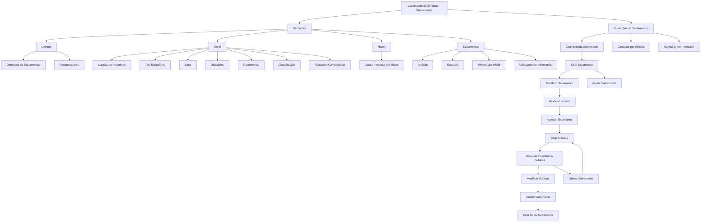

# Certificação de Sinistros — Salvamentos: Definições e Operações

## 1. Metadados do Documento
- **Arquivo de Origem:** Não informado; conteúdo extraído de documento com 3 páginas.
- **Tipo de Documento:** Apresentação Executiva / Guia Funcional.
- **Domínio / Sistema:** Sinistros — Salvamentos; documentação Reef / Mapfredocument.
- **Público-Alvo:** Usuários envolvidos na definição e operação de salvamentos; não explicitamente identificado.
- **Data/Versão Identificada:** Não identificada.

---

## 2. Resumo Executivo & Contexto de Negócio

O documento descreve a certificação de sinistros no domínio de **Salvamentos**, organizando as definições necessárias e as operações possíveis sobre bens recuperados ou salvados. O conteúdo separa definições comuns, gerais, específicas por ramo e próprias de salvamentos.

As definições comuns abrangem depósitos de salvamentos e recuperadores. Depósitos correspondem a locais cadastrados em terceiros onde os salvados podem ser depositados. Recuperadores correspondem às pessoas responsáveis por buscar veículos ou propriedades de segurados que tenham sido roubados.

As definições gerais afetam todos os possíveis expedientes de salvamentos e todos os ramos do setor definido. Entre os elementos apresentados estão causas de processos, tipos de expediente, setor, localizações, documentos, classificação e atividades compradoras.

O documento também apresenta operações do ciclo de vida de um salvamento: entrada, detalhamento, associações com siniestro e expediente, inclusão em subasta, venda, liberação, anulação, saída e consultas por siniestro ou inventário. Não há detalhamento de contratos de integração, métodos HTTP, persistência, regras de autorização, estados formais ou validações técnicas específicas.

---

## 3. Arquitetura, Componentes & Tecnologias Envolvidas

O conteúdo não apresenta arquitetura técnica de software, microsserviços, integrações, URLs, ambientes ou tecnologias de implementação. A estrutura identificada é funcional e organiza o módulo de Salvamentos em níveis de definição e operações.

Componentes funcionais citados:

- **Definições comuns:** depósitos de salvamentos e recuperadores.
- **Definições gerais:** causas de processos, tipo de expediente, setor, localizações, documentos, classificação e atividades compradoras.
- **Definições por ramo:** causa de processo exclusiva do ramo definido.
- **Definições próprias de salvamentos:** atributo, estrutura, informação inicial e validações de informação.
- **Operações de salvamentos:** criação, modificação, associação, subasta, venda, liberação, anulação, saída e consulta.
- **Portais ou referências documentais citadas:** Documentation / DOCUMENTACIÓN Reef, Mapfredocument e Reef.



> **Nota de Análise:** O diagrama representa relações funcionais inferidas das operações listadas. O documento não define uma sequência obrigatória completa, nem estados formais para salvamentos ou subastas.

---

## 4. Regras de Negócio, Especificações Funcionais & Processos

### 4.1 Definições comuns

As definições comuns não são exclusivas do módulo de sinistros, mas são necessárias para realizar a definição de salvamentos.

1. **Depósitos de salvamentos**
   - Devem ser definidos em terceiros.
   - Representam os lugares onde os salvados podem ser depositados.

2. **Recuperadores**
   - Devem ser definidos como pessoas que buscarão veículos ou propriedades de segurados roubados.

### 4.2 Definições gerais

As definições gerais afetam todos os possíveis expedientes de salvamentos e todos os ramos do setor definido.

1. **Causas de processos**
   - Permitem catalogar os motivos pelos quais se pretende realizar uma operação.

2. **Tipo de expediente**
   - Permite definir os tipos de dano e sua classe.
   - A definição distingue se o expediente é de recobro e qual é seu tipo; também contempla a situação em que não é de recobro.

3. **Setor**
   - Afeta todos os ramos do setor que está sendo definido.

4. **Ubicações**
   - Permitem definir as possíveis localizações dos bens recuperados.

5. **Documentos**
   - Permitem definir os documentos necessários para que bens recuperados possam ser vendidos.

6. **Classificação**
   - Permite definir possíveis classificações dos bens recuperados em relação ao estado necessário para venda.

7. **Atividades compradoras**
   - Permitem definir as atividades que podem comprar salvados.

### 4.3 Definições exclusivas por ramo

1. **Causa de processo por ramo**
   - Cataloga os motivos para realização de operações para cada ramo.
   - É exclusiva do ramo que está sendo definido.

### 4.4 Definições próprias de salvamentos

1. **Atributo**
   - Define informações adicionais de salvamentos, incluindo dados do salvado.

2. **Estrutura**
   - Define informações adicionais de salvamentos compostas por atributos.
   - Define se a solicitação da informação é obrigatória ou não.
   - Define a ordem na qual a informação será solicitada.

3. **Informação inicial**
   - Registra previamente informações para atributos das operações de salvamentos.
   - Evita a necessidade de introduzir posteriormente essas informações.

4. **Validações de informação**
   - Define comportamentos e validações para as informações solicitadas nas operações de salvamentos.

### 4.5 Operações de salvamentos

1. **Criar entrada de salvamento**
   - Registra o ingresso do salvado na companhia.

2. **Criar salvamento**
   - Detalha as características do salvamento.

3. **Modificar salvamento**
   - Permite alterar as características do salvado.

4. **Associar sinistro ao salvamento**
   - Vincula o sinistro ao salvamento registrado.

5. **Associar expediente ao salvamento**
   - Vincula o expediente ao salvamento.

6. **Criar subasta**
   - Registra informações de subastas para venda de salvamentos, incluindo data, localização e outros dados não detalhados no documento.

7. **Associar inventário à subasta**
   - Vincula à subasta os salvamentos pendentes de venda.

8. **Modificar subasta**
   - Permite alterar dados da subasta.

9. **Vender salvamento**
   - Registra a venda de um salvamento.
   - Registra para quem o salvamento foi vendido e por quanto foi vendido.

10. **Liberar salvamento**
    - Desvincula o salvamento da subasta quando o salvamento não foi vendido.
    - Permite que o salvamento seja associado a outra subasta.

11. **Anular salvamento**
    - Permite eliminar o salvamento.
    - Aplica-se quando o salvamento não é vendido ou está incorreto.

12. **Criar saída de salvamento**
    - Registra a saída do salvamento quando o salvamento é vendido.

13. **Consultar salvamentos por sinistro**
    - Exibe todas as informações do salvado mediante a introdução do sinistro.

14. **Consultar salvamentos por inventário**
    - Exibe todas as informações do salvado mediante a introdução de sua identificação.

---

## 5. Tabelas de Parâmetros, Ambientes e Estruturas de Dados

| Item / Parâmetro | Descrição / Função | Tipo / Valores / Formato | Ambiente / Observações |
| :--- | :--- | :--- | :--- |
| Depósitos de salvamentos | Locais em terceiros onde salvados podem ser depositados | Definição comum | Não exclusivo do módulo de sinistros |
| Recuperadores | Pessoas dedicadas à busca de veículos ou propriedades roubadas de segurados | Definição comum | Não exclusivo do módulo de sinistros |
| Causas de processos | Cataloga motivos para realização de uma operação | Definição geral | Afeta expedientes de salvamentos |
| Tipo de expediente | Define tipos de dano, classe e condição de recobro | Definição geral | O documento não especifica valores permitidos |
| Setor | Contexto que afeta todos os ramos definidos | Definição geral | Sem estrutura ou valores detalhados |
| Ubicações | Possíveis localizações de bens recuperados | Definição geral | Grafia apresentada no documento: “UBICACIONES” |
| Documentos | Documentos necessários para venda de bens recuperados | Definição geral | Não lista documentos específicos |
| Classificação | Classifica bens recuperados conforme seu estado para venda | Definição geral | Não lista classificações possíveis |
| Atividades compradoras | Atividades que podem comprar salvados | Definição geral | Não lista atividades específicas |
| Causa processo por ramo | Cataloga motivos para operações de cada ramo | Definição por ramo | Exclusiva do ramo definido |
| Atributo | Informação adicional de salvamentos, como dados do salvado | Definição própria de salvamentos | Campos não detalhados |
| Estrutura | Agrupa atributos e define obrigatoriedade e ordem de solicitação | Definição própria de salvamentos | Sem modelo de dados apresentado |
| Informação inicial | Registra previamente valores para atributos das operações | Definição própria de salvamentos | Evita introdução posterior de informação |
| Validações de informação | Define comportamentos e validações das informações solicitadas | Definição própria de salvamentos | Regras de validação não detalhadas |
| Criar entrada salvamento | Registra ingresso do salvado na companhia | Operação | Sem campos obrigatórios detalhados |
| Criar subasta | Registra dados de subasta para venda de salvamentos | Operação | São citados data e localização |
| Vender salvamento | Registra a venda, comprador e valor | Operação | Formato de valor e identificação do comprador não detalhados |
| Consulta por sinistro | Mostra informações do salvado a partir do sinistro | Consulta | Não especifica campos de busca |
| Consulta por inventário | Mostra informações do salvado a partir de sua identificação | Consulta | Não especifica formato da identificação |

> **Nota de Análise:** O documento não informa servidores, URLs, portas, variáveis de ambiente, rotas de log, contratos de API, formatos JSON, mecanismos de autenticação ou tecnologias de implementação.

---

## 6. Bateria de Perguntas & Respostas para RAG (FAQ Sintético)

### P1: Qual é a finalidade da operação “Criar entrada salvamento”?
**R:** A operação **Criar entrada salvamento** registra o ingresso do salvado na companhia. O documento não detalha quais campos, documentos ou validações são obrigatórios nesse registro.

### P2: Qual é a diferença entre criar um salvamento e criar uma entrada de salvamento?
**R:** **Criar entrada salvamento** registra o ingresso do salvado na companhia. **Criar salvamento** detalha as características do salvamento. O documento não define a sequência obrigatória entre as duas operações, mas apresenta ambas como operações possíveis de salvamentos.

### P3: Como um salvamento pode ser relacionado a um sinistro?
**R:** A relação é realizada pela operação **Associar siniestro al salvamento**, necessária para vincular o sinistro ao salvamento já registrado.

### P4: Para que serve associar um expediente a um salvamento?
**R:** A operação **Associar expediente al salvamento** permite vincular o expediente ao salvamento. O documento não especifica quais tipos de expediente podem ser associados nem quais dados compõem esse vínculo.

### P5: O que deve ser definido para que um bem recuperado possa ser vendido?
**R:** O documento menciona que devem ser definidos **documentos** necessários para venda de bens recuperados, a **classificação** do bem em relação ao seu estado para venda e as **atividades compradoras** que podem comprar salvados. Os documentos, classificações e atividades concretas não são listados.

### P6: O que acontece quando um salvamento não é vendido em uma subasta?
**R:** A operação **Liberar salvamento** permite desvincular o salvamento da subasta quando ele não foi vendido, possibilitando sua associação posterior a outra subasta.

### P7: Quais informações são registradas ao vender um salvamento?
**R:** A operação **Vender salvamento** registra a venda do salvamento, incluindo para quem o salvamento foi vendido e por quanto foi vendido. O documento não especifica o formato do valor, a identificação do comprador ou documentos comprobatórios.

### P8: Em que situações um salvamento pode ser anulado?
**R:** A operação **Anular salvamento** permite eliminar um salvamento quando ele não é vendido ou quando está incorreto. O documento não informa permissões, impactos em vínculos existentes ou regras de auditoria para a anulação.

### P9: Qual é o objetivo da informação inicial em operações de salvamentos?
**R:** A **Informação inicial** registra antecipadamente informações para atributos das operações de salvamentos, evitando que essas informações precisem ser introduzidas posteriormente.

### P10: Como são consultados os salvamentos por sinistro e por inventário?
**R:** A consulta **por sinistro** mostra todas as informações do salvado mediante a introdução do sinistro. A consulta **por inventário** mostra todas as informações do salvado mediante a introdução de sua identificação.

### P11: O que define a estrutura de salvamentos?
**R:** A **Estrutura** define informações adicionais de salvamentos compostas por atributos, a obrigatoriedade ou não de solicitar cada informação e a ordem em que a informação será solicitada.

### P12: Qual é a diferença entre causa de processo geral e causa de processo por ramo?
**R:** A **causa de processo** geral permite catalogar motivos para realização de operações no contexto geral de expedientes de salvamentos. A **causa de processo por ramo** permite catalogar motivos para operações de cada ramo e é exclusiva do ramo que está sendo definido.

---

## 7. Glossário de Termos, Siglas & Conceitos-Chave

- **Salvamento / Salvado:** Bem tratado nas operações de salvamentos; o documento cita seu ingresso, características, associação, subasta, venda, liberação, anulação, saída e consulta.
- **Sinistro:** Entidade que pode ser vinculada a um salvamento registrado.
- **Expediente:** Entidade que pode ser vinculada a um salvamento; possui tipos de dano, classe e condição de recobro conforme a descrição de tipo de expediente.
- **Recobro:** Condição mencionada na classificação de tipo de expediente. O documento não define o conceito.
- **Depósito de salvamentos:** Local definido em terceiros para depósito de salvados.
- **Recuperador:** Pessoa dedicada à busca de veículos ou propriedades roubadas de segurados.
- **Ramo:** Contexto para o qual determinadas definições, como causa de processo, podem ser exclusivas.
- **Atributo:** Informação adicional de salvamentos, incluindo dados do salvado.
- **Estrutura:** Composição de atributos que define obrigatoriedade e ordem de solicitação de informações.
- **Subasta:** Registro para venda de salvamentos que inclui, entre outras informações, data e localização.
- **Inventário:** Identificação usada para consultar informações do salvado e conjunto de salvamentos pendentes que pode ser associado a uma subasta.
- **Reef:** Referência documental exibida como “DOCUMENTACIÓN Reef”.
- **Mapfredocument:** Referência documental exibida no conteúdo extraído.

---

## 8. Notas Críticas, Riscos & Limitações

- O documento contém descrições funcionais resumidas e não apresenta arquitetura de software, tecnologias, APIs, integrações, bancos de dados ou ambientes.
- Não são informados contratos de dados, campos obrigatórios, formatos de identificadores, valores válidos, regras de autorização ou perfis de acesso.
- As operações são listadas, porém o documento não define uma máquina de estados formal para salvamentos, subastas ou vendas.
- A relação entre criação de entrada, criação de salvamento, associação ao sinistro, associação ao expediente, subasta, venda e saída não é estabelecida como fluxo obrigatório.
- O documento menciona validações de informação, mas não especifica regras de validação, mensagens de erro ou comportamentos de exceção.
- Não há detalhamento adicional para tecnologias ou URLs exibidas no portal de documentação.
- A expressão “etc” aparece na descrição de criação de subasta e venda de salvamento; os dados adicionais não são especificados.

---

## 9. Conteúdo Bruto Estruturado (Referência Fiel)

```text
--- [PÁGINA 1 DE 3] ---

CERTIFICACIÓN de SINIESTROS - SALVAMENTOS
Deniciones Salvamentos
Operaciones Salvamentos
DEFINICIONES
COMÚN
En este nivel se encuentran deniciones que NO son exclusivas del módulo de siniestros, pero son
necesarias para poder realizar la denición. Entre otras deniciones se encuentra:
DEPÓSITOS DE SALVAMENTOS
Denir en terceros los lugares donde se pueden depositar los
salvados
RECUPERADORES
Denir a las personas que se van a dedidar a buscar vehículos o
propiedades de nuestros asegurados que han sido robados
GENERAL
En este nivel se encuentran deniciones que afectarán a todos los posibles expedientes de salvamentos
CAUSAS DE PROCESOS
Permite catalogar los motivos por los que se quiere realizar una
operación
TIPO EXPEDIENTE
Permite denir los Tipos de Daño y su clase (Si es de Recobro y su
tipo, Si no es de Recobro)
SECTOR
Documentation / DOCUMENTACIÓN Reef
DOCUMENTACIÓN Reef
Mapfredocument
DOCUMENTACIÓN Reef
Owner
user:agonzalez_mapfre.com
Lifecycle
Approved Source
 /
 VL
Buscar Inicio Soluciones Arquitecturas APIs Componentes Cloud Documentación Zeus Reef Ayuda
ES

--- [PÁGINA 2 DE 3] ---

Afectan a todos los ramos del sector que se está deniendo
UBICACIONES
Denición de las Posibles ubicaciones de
los bienes recuperados
DOCUMENTOS
Denición de Documentos necesarios
para que los bienes recuperados puedan
ser vendidos
CLASIFICACIÓN
Posibles clasicaciones de los bienes
recuperados con respecto al estado para
ser vendidos
ACTIVIDADES COMPRADORAS
Denición de las Actividades que pueden
Comprar salvados
RAMO
Son exclusivas del ramo que se está deniendo
CAUSA PROCESO
Permite catalogar los motivos por los que se quiere realizar las operaciones para cada ramo
SALVAMENTOS
Deniciones propias de salvamentos
ATRIBUTO
Permite denir la información adicional de
salvamentos , como datos del salvado, etc
ESTRUCTURA
Información adicional de salvamentos
compuesta por atributos, obligatoriedad o
no de pedir información, orden en el que
se va a pedir
INFORMACIÓN INICIAL
Registrar información previa para los
atributos de las operaciones de
salvamentos, para no tener que
introducirla posteriormente.
VALIDACIONES INFORMACIÓN
Denir comportamientos y validaciones de
la información que se pide en las
operaciones de salvamentos
OPERACIONES
SALVAMENTOS
Operaciones posibles de salvamentos
CREAR entrada salvamento
Se Registra el ingreso del salvado a la
compañía
CREAR salvamento
Se detalla las características del
salvamento
MODIFICAR salvamento
Permite cambiar las características del
salvado

--- [PÁGINA 3 DE 3] ---

ASOCIAR siniestro al salvamento
Se necesita para vincular el siniestro al
salvamento registrado
ASOCIAR expediente al salvamento
Permite vincular el expediente al
salvamento.
CREAR subasta
Se registra la información de las subastas
para la venta de salvamentos, fecha,
ubicación, etc
ASOCIAR inventario subasta
Se vinculan los salvamentos pendientes
para ser vendidos
MODIFICAR subasta
Permite cambiar los datos de la subasta
VENDER salvamento
Si un salvamento es vendido se registra su
venta, a quien se le ha vendido, por cuanto,
etc
LIBERAR salvamento
Permite desvincular el salvamento de la
subasta si este no ha sido vendido para
poder asociarse a otra subasta
ANULAR salvamento
Esta operación permite eliminar el
salvamento, porque no se vende, porque
está erróneo
CREAR salida salvamento
Permite registrar la salida del salvamento
cuando es vendido
CONSULTAR salvamentos (Por Siniestro)
Muestra toda la información del salvado
introduciendo el siniestro
CONSULTAR salvamentos (Por Inventario)
Muestra toda la información del salvado,
introduciendo la identicación del mismo
```
