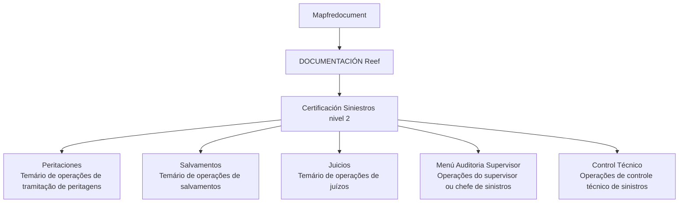

# Certificación — Siniestros Nivel 2: Temário de Operações

## 1. Metadados do Documento
- **Arquivo de Origem:** Não identificado no conteúdo fornecido
- **Tipo de Documento:** Manual Operacional / Documentação de treinamento
- **Domínio / Sistema:** Siniestros — DOCUMENTACIÓN Reef / Mapfredocument
- **Público-Alvo:** Operação de sinistros, supervisores, chefes de sinistros e usuários de documentação
- **Data/Versão Identificada:** Não identificada

---

## 2. Resumo Executivo & Contexto de Negócio

O documento apresenta a estrutura temática da **Certificación Siniestros nivel 2**, organizada como um temário para operações relacionadas ao tratamento de sinistros. O conteúdo está disponível no contexto de **DOCUMENTACIÓN Reef**, com referência a **Mapfredocument**.

A certificação é segmentada em cinco áreas operacionais: **Peritaciones**, **Salvamentos**, **Juicios**, **Menú Auditoria Supervisor** e **Control Técnico**. Para cada área, o documento informa que existe um temário contendo as operações correspondentes.

O material indica que o escopo não se limita à execução operacional de peritagens, salvamentos e processos judiciais: inclui também atividades de auditoria realizadas por supervisor ou chefe de sinistros e operações de controle técnico de sinistros.

Não há detalhamento de procedimentos, regras de elegibilidade, responsáveis, sistemas transacionais, fluxos de aprovação ou contratos técnicos. O documento funciona como uma visão de índice ou portal de acesso aos temas da certificação.

---

## 3. Arquitetura, Componentes & Tecnologias Envolvidas

Os componentes e contextos explicitamente citados são:

| Componente / Contexto | Descrição sustentada pelo documento |
| :--- | :--- |
| Certificación Siniestros nivel 2 | Certificação estruturada em temas de operações de sinistros. |
| Peritaciones | Área que contém o temário das operações de tramitação de peritagens. |
| Salvamentos | Área que contém o temário das operações de salvamentos. |
| Juicios | Área que contém o temário das operações de juízos/processos judiciais. |
| Menú Auditoria Supervisor | Área que contém o temário das operações do menu de auditoria do supervisor ou chefe de sinistros. |
| Control Técnico | Área que contém o temário das operações de controle técnico de sinistros. |
| DOCUMENTACIÓN Reef | Contexto de documentação citado no conteúdo. |
| Mapfredocument | Nome citado junto de DOCUMENTACIÓN Reef; não há explicação adicional sobre sua função. |
| Owner `user:agonzalez_mapfre.com` | Proprietário identificado no conteúdo. |
| Lifecycle `Approved Source` | Estado de ciclo de vida exibido no conteúdo. |
| VL | Identificador exibido junto do estado de ciclo de vida; sem detalhamento adicional. |



> **Nota de Análise:** O conteúdo não descreve arquitetura de software, integrações, protocolos, APIs, bancos de dados, tecnologias, URLs ou ambientes técnicos.

---

## 4. Regras de Negócio, Especificações Funcionais & Processos

O documento não apresenta regras de negócio detalhadas, critérios de validação, fórmulas, estados de processo ou procedimentos passo a passo. As especificações funcionais explicitamente apresentadas são:

1. **Peritaciones:** existe um temário de todas as operações relativas à tramitação de peritagens.
2. **Salvamentos:** existe um temário de todas as operações relativas a salvamentos.
3. **Juicios:** existe um temário de todas as operações relativas a juízos.
4. **Menú Auditoria Supervisor:** existe um temário de todas as operações do menu de auditoria executadas pelo supervisor ou pelo chefe de sinistros.
5. **Control Técnico:** existe um temário de todas as operações de controle técnico de sinistros.

> **Nota de Análise:** O documento lista os domínios operacionais, mas não detalha as operações individuais, suas entradas, saídas, responsáveis, regras de decisão ou exceções.

---

## 5. Tabelas de Parâmetros, Ambientes e Estruturas de Dados

| Item / Parâmetro | Descrição / Função | Tipo / Valores / Formato | Ambiente / Observações |
| :--- | :--- | :--- | :--- |
| Certificación Siniestros nivel 2 | Estrutura de certificação relacionada a sinistros. | Título / certificação | Sem versão ou data identificada. |
| Peritaciones | Temário das operações da tramitação de peritagens. | Área temática | Sem operações detalhadas. |
| Salvamentos | Temário das operações de salvamentos. | Área temática | Sem operações detalhadas. |
| Juicios | Temário das operações de juízos. | Área temática | Sem operações detalhadas. |
| Menú Auditoria Supervisor | Temário das operações de auditoria do supervisor ou chefe de sinistros. | Área temática / menu | Não especifica permissões nem ações disponíveis. |
| Control Técnico | Temário das operações de controle técnico de sinistros. | Área temática | Sem regras ou critérios técnicos detalhados. |
| DOCUMENTACIÓN Reef | Contexto documental citado. | Repositório ou seção documental, não detalhado | Aparece como “Documentation / DOCUMENTACIÓN Reef”. |
| Mapfredocument | Nome citado no conteúdo. | Não especificado | Não há descrição funcional adicional. |
| Owner | Proprietário do conteúdo. | `user:agonzalez_mapfre.com` | Valor literal exibido no documento. |
| Lifecycle | Estado de ciclo de vida do conteúdo. | `Approved Source` | Aprovado conforme valor literal exibido. |
| Identificador adicional | Valor exibido junto ao lifecycle. | `VL` | Significado não identificado. |
| Idioma da interface | Idioma indicado no menu. | `ES` | O conteúdo principal está em espanhol. |

---

## 6. Bateria de Perguntas & Respostas para RAG (FAQ Sintético)

### P1: Qual é o objetivo da Certificación Siniestros nivel 2?
**R:** A Certificación Siniestros nivel 2 organiza um temário sobre operações relacionadas a sinistros. O conteúdo abrange Peritaciones, Salvamentos, Juicios, Menú Auditoria Supervisor e Control Técnico.

### P2: O que está incluído na seção Peritaciones?
**R:** A seção Peritaciones contém o temário de todas as operações da tramitação de peritagens. O documento não detalha quais são essas operações nem os seus procedimentos.

### P3: O que a seção Salvamentos documenta?
**R:** A seção Salvamentos contém o temário de todas as operações de salvamentos. Não há detalhamento adicional sobre regras, fluxos ou responsabilidades de salvamentos.

### P4: Qual conteúdo é indicado para Juicios?
**R:** A seção Juicios reúne o temário de todas as operações relacionadas a juízos. O texto fornecido não descreve etapas, documentos, sistemas ou critérios para essas operações.

### P5: Quem utiliza o Menú Auditoria Supervisor?
**R:** O documento informa que o Menú Auditoria Supervisor contém operações de auditoria do supervisor ou do chefe de sinistros. Não são especificadas permissões, perfis de acesso ou ações disponíveis no menu.

### P6: O que é abordado em Control Técnico?
**R:** Control Técnico contém o temário de todas as operações de controle técnico de sinistros. O documento não explica os critérios técnicos, indicadores ou validações usados nesse controle.

### P7: Qual é o contexto documental da certificação?
**R:** A certificação é apresentada no contexto de DOCUMENTACIÓN Reef, com referência a Mapfredocument. O documento não esclarece a relação técnica ou funcional entre DOCUMENTACIÓN Reef e Mapfredocument.

### P8: Quem é o proprietário identificado para o conteúdo?
**R:** O proprietário exibido no documento é `user:agonzalez_mapfre.com`.

### P9: Qual é o estado de ciclo de vida identificado no conteúdo?
**R:** O estado de ciclo de vida exibido é `Approved Source`. O documento também mostra o valor `VL`, mas não define seu significado.

### P10: O documento especifica APIs, URLs, ambientes ou tecnologias?
**R:** Não. O conteúdo fornecido não apresenta APIs, métodos HTTP, URLs, servidores, ambientes, portas, tecnologias, integrações ou contratos de dados.

---

## 7. Glossário de Termos, Siglas & Conceitos-Chave

- **Siniestros:** Domínio central mencionado no título da certificação e nas referências a controle técnico e chefe de sinistros.
- **Certificación Siniestros nivel 2:** Certificação que reúne temários de operações relacionadas a sinistros.
- **Peritaciones:** Área temática relacionada à tramitação de peritagens.
- **Salvamentos:** Área temática relacionada a operações de salvamentos.
- **Juicios:** Área temática relacionada a operações de juízos.
- **Menú Auditoria Supervisor:** Menu cujas operações são atribuídas ao supervisor ou ao chefe de sinistros.
- **Control Técnico:** Área temática de operações de controle técnico de sinistros.
- **DOCUMENTACIÓN Reef:** Contexto de documentação citado no documento.
- **Mapfredocument:** Termo citado no conteúdo sem definição adicional.
- **Lifecycle:** Campo de ciclo de vida apresentado com o valor `Approved Source`.
- **VL:** Identificador citado junto ao ciclo de vida, sem significado definido.

---

## 8. Notas Críticas, Riscos & Limitações

- O conteúdo fornecido corresponde a uma única página e apresenta somente a estrutura temática da certificação.
- Não há detalhamento das operações listadas em Peritaciones, Salvamentos, Juicios, Menú Auditoria Supervisor ou Control Técnico.
- Não foram identificadas regras de negócio, critérios de aprovação, exceções, responsáveis por etapa, requisitos de auditoria ou controles de acesso.
- Não foram identificadas informações de arquitetura técnica, integrações, APIs, ambientes, URLs, logs, tecnologias ou estruturas de dados.
- O significado do identificador `VL` não é explicado.
- A função específica de Mapfredocument não é descrita.
- Não há notas de apresentador, anexos ou conteúdo adicional disponível no texto fornecido.

---

## 9. Conteúdo Bruto Estruturado (Referência Fiel)

```text
--- [PÁGINA 1 DE 1] ---

CERTIFICACIÓN - SINIESTROS NIVEL 2
CERTIFICACIÓN Siniestros nivel 2
 PERITACIONES
En este apartado se encuentra el temario
de todas las operaciones de la tramitación
de peritaciones
 SALVAMENTOS
En este apartado se encuentra el temario
de todas las operaciones de salvamentos
 JUICIOS
En este apartado se encuentra el temario
de todas las operaciones de los juicios
 MENÚ AUDITORIA
SUPERVISOR
En este apartado se encuentra el temario
de todas las operaciones del menú de
auditoria del supervisor o del jefe de
siniestros
 CONTROL TÉCNICO
En este apartado se encuentra el temario
de todas las operaciones de Control
técnico de siniestros
Documentation / DOCUMENTACIÓN Reef
DOCUMENTACIÓN Reef
Mapfredocument
DOCUMENTACIÓN Reef
Owner
user:agonzalez_mapfre.com
Lifecycle
Approved Source
 / 
 VL
Buscar Inicio Soluciones Arquitecturas APIs Componentes Cloud Documentación Zeus Reef Ayuda
ES
```
