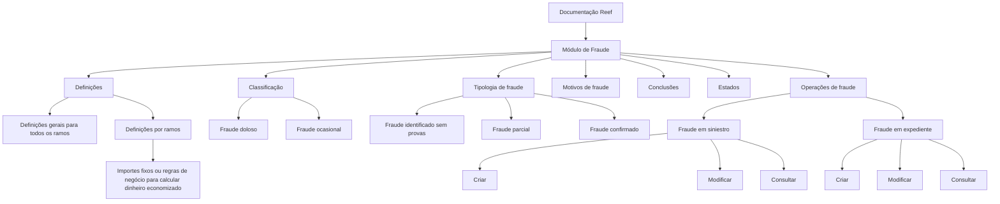

# Certificação de Sinistros — Fraude: Definições, Classificações e Operações

## 1. Metadados do Documento
- **Arquivo de Origem:** Não identificado no conteúdo fornecido
- **Tipo de Documento:** Documentação funcional
- **Domínio / Sistema:** Reef / Certificación de Siniestros — Fraude
- **Público-Alvo:** Negócio, analistas funcionais, operação e desenvolvedores
- **Data/Versão Identificada:** Não identificada

---

## 2. Resumo Executivo & Contexto de Negócio

O documento apresenta a documentação Reef referente ao domínio de **fraude em sinistros e expedientes**. O conteúdo organiza definições gerais, tipologias, motivos, classificações, estados, conclusões e operações disponíveis para o tratamento de fraude.

A estrutura funcional distingue o registro e a consulta de fraudes associadas a dois contextos: **siniestro** e **expediente**. Para ambos os contextos, são listadas operações de criação, modificação e consulta das informações de fraude.

O documento também indica que existem definições por ramo, incluindo importes fixos ou regras de negócio para cálculo de dinheiro economizado. Contudo, não detalha os valores, fórmulas, critérios de aplicação ou ramos específicos.

A documentação está identificada como **Approved Source** no ambiente/documentação Reef e associa a propriedade ao usuário `agonzalez_mapfre.com`. Não há contratos técnicos, métodos HTTP, estruturas JSON, URLs de API, tecnologias de implementação ou detalhes de integração apresentados.

---

## 3. Arquitetura, Componentes & Tecnologias Envolvidas

Os componentes conceituais identificados no conteúdo são:

- **Reef:** contexto de documentação e sistema referido.
- **Mapfredocument:** elemento listado na navegação/documentação.
- **Módulo de Fraude:** módulo que contém definições de comportamentos, classificações, estados, motivos, conclusões e operações.
- **Siniestro:** entidade para a qual podem ser criadas, modificadas e consultadas informações de fraude.
- **Expediente:** entidade para a qual podem ser criadas, modificadas e consultadas informações de fraude.
- **Ramo:** dimensão usada para organizar definições específicas, incluindo importes e regras de cálculo de dinheiro economizado.
- **D.I.S.M.A.:** referência presente como possível estado de fraude; o significado da sigla não é informado.



> **Nota de Análise:** O conteúdo não descreve uma arquitetura técnica de software, integrações, protocolos, componentes de infraestrutura, APIs, bancos de dados ou ambientes de execução.

---

## 4. Regras de Negócio, Especificações Funcionais & Processos

### Definições de fraude

O documento menciona definições aplicáveis a todos os ramos e definições específicas por ramo. A definição de fraude inclui comportamentos do módulo de fraude, mas o conteúdo fornecido não apresenta a descrição desses comportamentos.

### Tipologia de fraude

As tipologias de fraude explicitamente citadas são:

1. **Fraude identificado sem provas**.
2. **Fraude parcial**.
3. **Fraude confirmado**.

O documento utiliza reticências após as tipologias, indicando que podem existir tipos adicionais, porém esses tipos não estão identificados no conteúdo fornecido.

### Motivos de fraude

Os motivos de fraude citados incluem:

1. **Delinquência organizada**.
2. **Reclama montante superior ao autorizado**.
3. **Reclama os mesmos danos**.
4. **Reclama lesões fora do acidente**.

O documento não especifica quais motivos podem ser aplicados a cada tipo de fraude, ramo, estado ou conclusão.

### Conclusões de fraude

Os tipos de conclusão apresentados são:

- **Procedente**.
- **Rechazado**.

O documento também menciona “motivos de fraude por tipos de conclusão”, sem detalhar a matriz de associação entre motivos e conclusões.

### Classificação de fraude

O conteúdo lista duas classificações:

- **Fraude doloso**.
- **Fraude ocasional**.

Não são fornecidos critérios para distinguir fraude doloso de fraude ocasional.

### Estados de fraude

O documento informa que uma fraude pode estar nos seguintes estados:

- **Asignado**.
- **Revisión**.
- **Revisión D.I.S.M.A.**

Não há detalhes sobre transições de estado, responsáveis, regras de entrada, regras de saída ou significado de `D.I.S.M.A.`.

### Operações de fraude em siniestro

1. **Criar fraude siniestro:** permite registrar uma fraude em um siniestro.
2. **Modificar fraude siniestro:** permite modificar as informações de fraude de um siniestro.
3. **Consultar fraude siniestro:** mostra todas as informações de uma fraude associada a um siniestro.

### Operações de fraude em expediente

1. **Criar fraude expediente:** permite registrar uma fraude em um expediente.
2. **Modificar fraude expediente:** permite modificar as informações de fraude de um expediente.
3. **Consultar fraude expediente:** mostra todas as informações de uma fraude associada a um expediente.

> **Nota de Análise:** O documento lista as operações funcionais, mas não detalha permissões, validações, campos obrigatórios, mensagens de erro, métodos HTTP, contratos de entrada/saída ou trilha de auditoria.

---

## 5. Tabelas de Parâmetros, Ambientes e Estruturas de Dados

| Item / Parâmetro | Descrição / Função | Tipo / Valores / Formato | Ambiente / Observações |
| :--- | :--- | :--- | :--- |
| Sistema de documentação | Contexto documental indicado no conteúdo | Reef | Identificado como “DOCUMENTACIÓN Reef” |
| Fonte documental | Situação da fonte no ciclo de vida | Approved Source | Campo “Lifecycle” |
| Proprietário | Usuário listado como proprietário da documentação | `user:agonzalez_mapfre.com` | Campo “Owner” |
| Tipologia de fraude | Classifica o tipo de fraude | Fraude identificado sem provas | Outros tipos podem existir, mas não são detalhados |
| Tipologia de fraude | Classifica o tipo de fraude | Fraude parcial | — |
| Tipologia de fraude | Classifica o tipo de fraude | Fraude confirmado | — |
| Motivo de fraude | Motivo listado para fraude | Delinquência organizada | — |
| Motivo de fraude | Motivo listado para fraude | Reclama montante superior ao autorizado | — |
| Motivo de fraude | Motivo listado para fraude | Reclama os mesmos danos | — |
| Motivo de fraude | Motivo listado para fraude | Reclama lesões fora do acidente | — |
| Tipo de conclusão | Resultado de conclusão da fraude | Procedente | — |
| Tipo de conclusão | Resultado de conclusão da fraude | Rechazado | — |
| Classificação | Classificação de fraude | Fraude doloso | Critérios não detalhados |
| Classificação | Classificação de fraude | Fraude ocasional | Critérios não detalhados |
| Estado | Estado possível da fraude | Asignado | Transições não detalhadas |
| Estado | Estado possível da fraude | Revisión | Transições não detalhadas |
| Estado | Estado possível da fraude | Revisión D.I.S.M.A. | Significado de D.I.S.M.A. não informado |
| Importes | Valores ou regras para calcular dinheiro economizado | Importes fixos ou regras de negócio | Valores, fórmulas e condições não detalhados |
| Operação | Registro de fraude associada a siniestro | Criar fraude siniestro | Permite registrar uma fraude |
| Operação | Alteração de fraude associada a siniestro | Modificar fraude siniestro | Permite modificar informações de fraude |
| Operação | Consulta de fraude associada a siniestro | Consultar fraude siniestro | Mostra todas as informações associadas |
| Operação | Registro de fraude associada a expediente | Criar fraude expediente | Permite registrar uma fraude |
| Operação | Alteração de fraude associada a expediente | Modificar fraude expediente | Permite modificar informações de fraude |
| Operação | Consulta de fraude associada a expediente | Consultar fraude expediente | Mostra todas as informações associadas |

---

## 6. Bateria de Perguntas & Respostas para RAG (FAQ Sintético)

### P1: Quais operações de fraude estão disponíveis para um siniestro?
**R:** Estão disponíveis três operações para fraude associada a um siniestro: criar fraude siniestro, que registra uma fraude; modificar fraude siniestro, que altera as informações da fraude; e consultar fraude siniestro, que mostra todas as informações da fraude associada ao siniestro.

### P2: Quais operações de fraude estão disponíveis para um expediente?
**R:** Estão disponíveis criar fraude expediente, modificar fraude expediente e consultar fraude expediente. Essas operações permitem, respectivamente, registrar, alterar e consultar informações de fraude associadas a um expediente.

### P3: Quais tipologias de fraude são citadas na documentação Reef?
**R:** A documentação cita as tipologias “Fraude identificado sem provas”, “Fraude parcial” e “Fraude confirmado”. O uso de reticências no conteúdo indica que podem existir outras tipologias, mas elas não foram identificadas no texto fornecido.

### P4: Quais motivos de fraude são explicitamente listados?
**R:** Os motivos explicitamente listados são delinquência organizada, reclama montante superior ao autorizado, reclama os mesmos danos e reclama lesões fora do acidente.

### P5: Quais conclusões podem ser atribuídas a uma fraude?
**R:** O documento apresenta dois tipos de conclusão: “Procedente” e “Rechazado”. Também menciona motivos de fraude por tipos de conclusão, mas não fornece o mapeamento entre cada motivo e cada conclusão.

### P6: Como a fraude pode ser classificada?
**R:** A fraude pode ser classificada como “fraude doloso” ou “fraude ocasional”. O documento não define os critérios de negócio usados para determinar cada classificação.

### P7: Quais estados de fraude são mencionados?
**R:** Os estados citados são “asignado”, “revisión” e “revisión D.I.S.M.A.”. A documentação não descreve o fluxo de transição entre esses estados nem explica a sigla D.I.S.M.A.

### P8: O que são os importes nas definições por ramos?
**R:** Os importes são descritos como valores fixos ou regras de negócio para calcular o dinheiro economizado. O documento não fornece os valores, fórmulas, ramos aplicáveis ou critérios para executar o cálculo.

### P9: O documento especifica APIs ou métodos HTTP para as operações de fraude?
**R:** Não. O conteúdo somente descreve as operações funcionais de criação, modificação e consulta para siniestros e expedientes. Não há métodos HTTP, URLs, contratos JSON, campos de requisição ou respostas técnicas.

### P10: Quem é o proprietário identificado na documentação Reef?
**R:** O campo “Owner” apresenta o valor `user:agonzalez_mapfre.com`. O documento também identifica o ciclo de vida como “Approved Source”.

---

## 7. Glossário de Termos, Siglas & Conceitos-Chave

- **Reef:** sistema ou contexto de documentação mencionado no conteúdo como “DOCUMENTACIÓN Reef”.
- **Fraude:** domínio funcional documentado para siniestros e expedientes.
- **Siniestro:** entidade associada a operações de criação, modificação e consulta de fraude.
- **Expediente:** entidade associada a operações de criação, modificação e consulta de fraude.
- **Ramo:** categoria para a qual podem existir definições específicas de fraude e regras de importes.
- **Importes:** valores fixos ou regras de negócio para calcular dinheiro economizado.
- **Fraude doloso:** classificação de fraude listada no documento, sem definição adicional.
- **Fraude ocasional:** classificação de fraude listada no documento, sem definição adicional.
- **D.I.S.M.A.:** sigla presente no estado “revisión D.I.S.M.A.”; seu significado não é definido no conteúdo.
- **Mapfredocument:** termo listado na navegação/documentação; sua função não é detalhada.

---

## 8. Notas Críticas, Riscos & Limitações

- O documento não identifica o nome do arquivo de origem, data, versão ou autor além do campo de proprietário.
- Não há especificação técnica de APIs, endpoints, métodos HTTP, modelos de dados, contratos JSON, autenticação ou integrações.
- Não são detalhadas regras de transição entre os estados `asignado`, `revisión` e `revisión D.I.S.M.A.`.
- A sigla `D.I.S.M.A.` não é expandida ou explicada.
- Não há critérios para classificar uma fraude como doloso ou ocasional.
- Os importes e regras para calcular dinheiro economizado são mencionados, mas não são descritos.
- O documento menciona motivos por tipo e conclusão, mas não fornece a matriz de relacionamento.
- As tipologias de fraude apresentadas são incompletas, pois o conteúdo utiliza reticências após os tipos listados.

---

## 9. Conteúdo Bruto Estruturado (Referência Fiel)

```text
--- [PÁGINA 1 DE 2] ---

CERTIFICACIÓN de SINIESTROS - FRAUDE
Deniciones Fraude
Operaciones Fraude
DEFINICIONES
GENERAL
Deniciones para todos los Ramos
FRAUDE DEFINICIÓN
Denición de comportamientos del
módulo
TIPOS
Tipología de Fraudes: Fraude identicado
sin pruebas, Fraude parcial, Fraude
Conrmado...
MOTIVOS
Motivos del Fraude: Delincuencia
organizada, Reclama monto superior al
autorizado, Reclama los mismos daños,
Reclama lesiones fuera del accidente...
CONCLUSIÓN
Tipo de Conclusión: Procedente,
Rechazado
MOTIVOS POR TIPO Y CONCLUSIÓN
Motivos de Fraude por tipos de conclusión
CLASIFICACIÓN
Clasicación de los fraudes: fraude
doloso, fraude ocasional
ESTADOS
Estado en el que se puede encontrar el
Fraude: asignado, revisión, revisión
D.I.S.M.A.,
RAMO
Documentation / DOCUMENTACIÓN Reef
DOCUMENTACIÓN Reef
Mapfredocument
DOCUMENTACIÓN Reef
Owner
user:agonzalez_mapfre.com
Lifecycle
Approved Source
 / 
 VL
Buscar Inicio Soluciones Arquitecturas APIs Componentes Cloud Documentación Zeus Reef Ayuda
ES


--- [PÁGINA 2 DE 2] ---

Deniciones por Ramos
IMPORTES
Importes jos o reglas de negocio para calcular dinero ahorrado
OPERACIONES
FRAUDE
Operaciones de FRAUDE
CREAR fraude siniestro
Permite registrar un Fraude en un siniestro
MODIFICAR fraude siniestro
Permite modicar la información de
Fraude de un siniestro
CREAR fraude expediente
Permite registrar un Fraude en un
expediente
MODIFICAR fraude expediente
Permite modicar la información de
Fraude de un expediente
CONSULTAR fraude siniestro
Muestra toda la información de un Fraude
asociado a un siniestro
CONSULTAR fraude expediente
Muestra toda la información de un Fraude
asociado a un expediente
```
