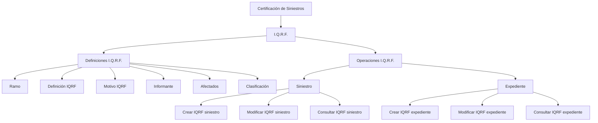

# Certificación de Siniestros — I.Q.R.F.: Definições, Classificações e Operações

## 1. Metadados do Documento
- **Arquivo de Origem:** Não identificado no conteúdo fornecido
- **Tipo de Documento:** Manual Operacional
- **Domínio / Sistema:** Reef / Certificación de Siniestros / I.Q.R.F.
- **Público-Alvo:** Operação, Negócio, Desenvolvedores e Arquitetos
- **Data/Versão Identificada:** Não identificada
- **Owner identificado:** `user:agonzalez_mapfre.com`
- **Lifecycle identificado:** Approved
- **Fonte identificada:** VL

---

## 2. Resumo Executivo & Contexto de Negócio

O documento apresenta conteúdo de documentação Reef referente à **Certificación de Siniestros** e ao domínio **I.Q.R.F.**. I.Q.R.F. é utilizado para registrar e gerir uma **Incidencia, Queja, Reclamación o Felicitación** associada a entidades de sinistro ou de expediente.

A documentação separa o domínio em dois blocos principais: **Definiciones I.Q.R.F.** e **Operaciones I.Q.R.F.**. O bloco de definições cobre conceitos configuráveis relacionados a ramo, definição IQRF, motivo, informante, afetados e classificação.

O bloco operacional apresenta seis capacidades: criar, modificar e consultar IQRF para **siniestro**; e criar, modificar e consultar IQRF para **expediente**. O documento afirma que essas são “todas las Operaciones que se pueden realizar I.Q.R.F.”.

O conteúdo fornecido não descreve contratos de API, métodos HTTP, interfaces de usuário, estrutura de persistência, regras de autorização, validações detalhadas, tecnologias de implementação ou integração entre sistemas. A referência de navegação indica “Documentation / DOCUMENTACIÓN Reef”, “Mapfredocument” e “DOCUMENTACIÓN Reef”.

---

## 3. Arquitetura, Componentes & Tecnologias Envolvidas

### Componentes e domínios identificados

| Componente / Termo | Papel identificado no documento | Detalhamento disponível |
| :--- | :--- | :--- |
| Reef | Contexto de documentação no qual o conteúdo I.Q.R.F. está publicado. | O documento não detalha arquitetura, tecnologia ou responsabilidade técnica do Reef. |
| DOCUMENTACIÓN Reef | Área de documentação associada ao conteúdo. | Identificada na navegação do documento. |
| Mapfredocument | Termo exibido na navegação/documentação. | O documento não detalha sua função. |
| Certificación de Siniestros | Contexto funcional principal do documento. | Não há descrição adicional do processo de certificação. |
| I.Q.R.F. | Domínio de definições e operações para Incidencia, Queja, Reclamación o Felicitación. | O significado expandido da sigla não é informado. |
| Siniestro | Entidade sobre a qual podem ser criados, modificados e consultados registros IQRF. | Não há estrutura de dados descrita. |
| Expediente | Entidade sobre a qual podem ser criados, modificados e consultados registros IQRF. | Não há estrutura de dados descrita. |
| Ramo | Elemento usado para diferenciar definições. | Há “Definiciones diferentes por Ramo”; critérios não são detalhados. |

### Fluxo funcional identificado



> **Nota de Análise:** O conteúdo não apresenta uma arquitetura de software com camadas, serviços, APIs, bancos de dados, protocolos ou integrações. O diagrama representa exclusivamente a organização funcional explicitamente apresentada.

---

## 4. Regras de Negócio, Especificações Funcionais & Processos

### 4.1 Definições I.Q.R.F.

O documento define uma área de “Definiciones I.Q.R.F.” e apresenta os seguintes elementos:

1. **Ramo**
   - Existem “Definiciones diferentes por Ramo”.
   - O conteúdo não informa quais ramos existem, nem quais definições são aplicadas a cada ramo.

2. **Definición IQRF**
   - Abrange a “Definición de los valores por defecto y validaciones de la información de IQRF”.
   - O documento afirma que existem definições para todos os ramos sem distinção.
   - Valores padrão e validações específicos não são fornecidos.

3. **Motivo IQRF**
   - Define os motivos de uma **Incidencia, Queja, Reclamación o Felicitación**.
   - O catálogo de motivos não foi apresentado.

4. **Informante**
   - Define os possíveis informantes de uma **Incidencia, Queja, Reclamación o Felicitación**.
   - Os tipos ou perfis de informante não foram apresentados.

5. **Afectados**
   - Define os possíveis afetados por uma **Incidencia, Queja, Reclamación o Felicitación**.
   - Os tipos de afetados não foram apresentados.

6. **Clasificación**
   - Define a classificação de uma **Incidencia, Queja, Reclamación o Felicitación**.
   - As categorias ou critérios de classificação não foram apresentados.

### 4.2 Operações I.Q.R.F.

| Operação | Entidade associada | Regra funcional explicitamente descrita |
| :--- | :--- | :--- |
| CREAR IQRF siniestro | Siniestro | Permite registrar uma Incidencia, Queja, Reclamación o Felicitación em um siniestro. |
| MODIFICAR IQRF siniestro | Siniestro | Permite alterar uma Incidencia, Queja, Reclamación o Felicitación em um ou mais siniestros, conforme a redação original “a un siniestros”. |
| CONSULTAR IQRF siniestro | Siniestro | Mostra toda a informação de IQRF de um siniestro. |
| CREAR IQRF expediente | Expediente | Permite registrar uma Incidencia, Queja, Reclamación o Felicitación em um expediente. |
| MODIFICAR IQRF expediente | Expediente | Permite alterar uma Incidencia, Queja, Reclamación o Felicitación em um expediente. |
| CONSULTAR IQRF expediente | Expediente | Mostra toda a informação de IQRF de um expediente. |

> **Nota de Análise:** O documento não especifica pré-condições, pós-condições, estados, campos obrigatórios, mensagens de erro, permissões, trilha de auditoria ou transições de status para as operações I.Q.R.F.

---

## 5. Tabelas de Parâmetros, Ambientes e Estruturas de Dados

| Item / Parâmetro | Descrição / Função | Tipo / Valores / Formato | Ambiente / Observações |
| :--- | :--- | :--- | :--- |
| Ramo | Suporta definições diferentes por ramo. | Não especificado. | Os ramos disponíveis não são informados. |
| Definición IQRF | Define valores padrão e validações da informação IQRF. | Não especificado. | Aplicável a todos os ramos sem distinção, segundo o documento. |
| Motivo IQRF | Define motivos de uma Incidencia, Queja, Reclamación o Felicitación. | Não especificado. | Catálogo de motivos não fornecido. |
| Informante | Define possíveis informantes de uma Incidencia, Queja, Reclamación o Felicitación. | Não especificado. | Valores permitidos não fornecidos. |
| Afectados | Define possíveis afetados de uma Incidencia, Queja, Reclamación o Felicitación. | Não especificado. | Valores permitidos não fornecidos. |
| Clasificación | Define a classificação de uma Incidencia, Queja, Reclamación o Felicitación. | Não especificado. | Categorias e critérios não fornecidos. |
| Crear IQRF siniestro | Registra IQRF em siniestro. | Operação funcional. | Métodos, entrada e saída não detalhados. |
| Modificar IQRF siniestro | Altera IQRF em siniestro. | Operação funcional. | Métodos, entrada e saída não detalhados. |
| Consultar IQRF siniestro | Exibe toda a informação IQRF de siniestro. | Operação funcional. | Filtros e formato de retorno não detalhados. |
| Crear IQRF expediente | Registra IQRF em expediente. | Operação funcional. | Métodos, entrada e saída não detalhados. |
| Modificar IQRF expediente | Altera IQRF em expediente. | Operação funcional. | Métodos, entrada e saída não detalhados. |
| Consultar IQRF expediente | Exibe toda a informação IQRF de expediente. | Operação funcional. | Filtros e formato de retorno não detalhados. |
| Owner | Proprietário exibido na documentação Reef. | `user:agonzalez_mapfre.com` | Identificado como Owner. |
| Lifecycle | Estado de ciclo de vida exibido. | `Approved` | Fonte exibida como `VL`. |
| Idioma da interface | Idioma indicado na navegação. | `ES` | Interface/documentação exibida em espanhol. |

---

## 6. Bateria de Perguntas & Respostas para RAG (FAQ Sintético)

### P1: Qual é o objetivo do conteúdo sobre Certificación de Siniestros - I.Q.R.F.?
**R:** O conteúdo documenta definições e operações I.Q.R.F. no contexto de Certificación de Siniestros. As operações permitem criar, modificar e consultar uma Incidencia, Queja, Reclamación o Felicitación associada a siniestro ou expediente.

### P2: Quais operações I.Q.R.F. estão disponíveis para um siniestro?
**R:** Para siniestro, o documento lista três operações: **CREAR IQRF siniestro**, para registrar uma Incidencia, Queja, Reclamación o Felicitación; **MODIFICAR IQRF siniestro**, para alterá-la; e **CONSULTAR IQRF siniestro**, para mostrar toda a informação IQRF do siniestro.

### P3: Quais operações I.Q.R.F. estão disponíveis para um expediente?
**R:** Para expediente, o documento lista **CREAR IQRF expediente**, para registrar uma Incidencia, Queja, Reclamación o Felicitación; **MODIFICAR IQRF expediente**, para alterá-la; e **CONSULTAR IQRF expediente**, para mostrar toda a informação IQRF do expediente.

### P4: O que é definido em “Definición IQRF”?
**R:** “Definición IQRF” cobre a definição de valores por defeito e validações da informação de IQRF. O documento informa que essas definições se aplicam a todos os ramos sem distinção, mas não informa quais são os valores padrão nem as regras de validação.

### P5: O que o documento informa sobre ramo?
**R:** O documento informa que existem “Definiciones diferentes por Ramo”. Entretanto, não identifica os ramos existentes nem detalha as definições específicas atribuídas a cada ramo.

### P6: Para que serve “Motivo IQRF”?
**R:** “Motivo IQRF” é a definição dos motivos de uma Incidencia, Queja, Reclamación o Felicitación. O documento não apresenta os motivos disponíveis nem critérios para sua seleção.

### P7: O que são “Informante” e “Afectados” no contexto I.Q.R.F.?
**R:** “Informante” define os possíveis informantes de uma Incidencia, Queja, Reclamación o Felicitación. “Afectados” define os possíveis afetados por essa mesma ocorrência. O documento não fornece a lista de valores permitidos para nenhum dos dois conceitos.

### P8: O que a operação CONSULTAR IQRF siniestro retorna?
**R:** A operação **CONSULTAR IQRF siniestro** mostra toda a informação de IQRF de um siniestro. O documento não especifica campos retornados, filtros de consulta, formato de resposta ou critérios de acesso.

### P9: O que a operação CONSULTAR IQRF expediente retorna?
**R:** A operação **CONSULTAR IQRF expediente** mostra toda a informação de IQRF de um expediente. O documento não detalha campos, filtros, formato de retorno ou permissões necessárias para a consulta.

### P10: Existem métodos HTTP, contratos JSON ou URLs de API para I.Q.R.F.?
**R:** Não. O conteúdo fornecido não especifica métodos HTTP, URLs, contratos JSON, APIs, microsserviços, endpoints, tecnologias ou portas de comunicação para I.Q.R.F.

### P11: O documento descreve regras de autorização para criar ou modificar IQRF?
**R:** Não. O documento lista operações de criação, alteração e consulta, mas não descreve perfis, permissões, autenticação, autorização ou segregação de responsabilidades.

### P12: Quem é o owner identificado na documentação Reef?
**R:** O owner identificado é `user:agonzalez_mapfre.com`. O documento também apresenta o lifecycle como `Approved` e a fonte como `VL`.

---

## 7. Glossário de Termos, Siglas & Conceitos-Chave

- **I.Q.R.F.:** Sigla utilizada pelo documento para o conjunto de definições e operações relacionadas a uma Incidencia, Queja, Reclamación o Felicitación. O significado expandido da sigla não é informado.
- **Incidencia:** Tipo de ocorrência mencionado no contexto I.Q.R.F.; não possui definição adicional no documento.
- **Queja:** Tipo de ocorrência mencionado no contexto I.Q.R.F.; não possui definição adicional no documento.
- **Reclamación:** Tipo de ocorrência mencionado no contexto I.Q.R.F.; não possui definição adicional no documento.
- **Felicitación:** Tipo de ocorrência mencionado no contexto I.Q.R.F.; não possui definição adicional no documento.
- **Siniestro:** Entidade para a qual podem ser criadas, modificadas e consultadas informações I.Q.R.F.
- **Expediente:** Entidade para a qual podem ser criadas, modificadas e consultadas informações I.Q.R.F.
- **Ramo:** Elemento que diferencia definições no domínio I.Q.R.F.
- **Motivo IQRF:** Definição dos motivos de uma Incidencia, Queja, Reclamación o Felicitación.
- **Informante:** Possível originador ou comunicante de uma Incidencia, Queja, Reclamación o Felicitación.
- **Afectados:** Possíveis pessoas ou entidades afetadas por uma Incidencia, Queja, Reclamación o Felicitación.
- **Clasificación:** Definição da classificação de uma Incidencia, Queja, Reclamación o Felicitación.
- **Reef:** Contexto de documentação identificado como “DOCUMENTACIÓN Reef”.
- **Mapfredocument:** Termo identificado na navegação documental; sem definição adicional.
- **VL:** Fonte identificada no bloco de lifecycle da documentação.

---

## 8. Notas Críticas, Riscos & Limitações

- O conteúdo é resumido e não detalha o significado expandido da sigla **I.Q.R.F.**
- Não há catálogo de ramos, motivos, informantes, afetados ou classificações.
- Não são fornecidos valores padrão nem regras específicas de validação para IQRF.
- Não há detalhamento de modelos de dados, atributos, formatos, tipos ou obrigatoriedade de campos.
- Não há especificação de APIs, endpoints, métodos HTTP, contratos JSON, protocolos, URLs, ambientes, servidores ou logs.
- Não são descritas permissões, autenticação, autorização, perfis operacionais ou regras de auditoria.
- Não há pré-condições, pós-condições, tratamento de erros, estados ou fluxos de aprovação para criar e modificar IQRF.
- A expressão original “MODIFICAR IQRF siniestro” menciona “a un siniestros”, com possível inconsistência gramatical; esta análise preserva o sentido operacional sem corrigir ou inferir comportamento adicional.
- A extração contém caracteres de codificação anômalos em palavras como `Deniciones` e `clasicación`; o conteúdo foi mantido na referência bruta para fins de auditoria.

---

## 9. Conteúdo Bruto Estruturado (Referência Fiel)

```text
--- [PÁGINA 1 DE 2] ---

CERTIFICACIÓN de SINIESTROS - I.Q.R.F.
Deniciones I.Q.R.F.
Operaciones I.Q.R.F
DEFINICIONES
RAMO
Deniciones diferentes por Ramo
DEFINICIÓN IQRF
Denición de los valores por defecto y validaciones de la información de IQRF
I.Q.R.F.
Deniciones para todos los ramos sin distinción
MOTIVO IQRF
Denición de los motivos de una
Incidencia, Queja, Reclamación o
Felicitación
INFORMANTE
Denición de los posibles informantes de
una Incidencia, Queja, Reclamación o
Felicitación
AFECTADOS
Denición de los posibles afectados por
una Incidencia, Queja, Reclamación o
Felicitación
CLASIFICACIÓN
Documentation / DOCUMENTACIÓN Reef
DOCUMENTACIÓN Reef
Mapfredocument
DOCUMENTACIÓN Reef
Owner
user:agonzalez_mapfre.com
Lifecycle
Approved Source
 / 
 VL
Buscar Inicio Soluciones Arquitecturas APIs Componentes Cloud Documentación Zeus Reef Ayuda
ES


--- [PÁGINA 2 DE 2] ---

Denición de la clasicación de una
Incidencia, Queja, Reclamación o
Felicitación
OPERACIONES
I.Q.R.F.
Todas las Operaciones que se pueden realizar I.Q.R.F.
CREAR IQRF siniestro
Permite registrar una Incidencia, Queja,
Reclamación o Felicitación a un siniestro
MODIFICAR IQRF siniestro
Permite cambiar una Incidencia, Queja,
Reclamación o Felicitación a un siniestros
CREAR IQRF expediente
Permite registrar una Incidencia, Queja,
Reclamación o Felicitación a un
expediente
MODIFICAR IQRF expediente
Permite cambiar una Incidencia, Queja,
Reclamación o Felicitación a un
expedienteo
CONSULTAR IQRF siniestro
Muestra toda la información de IQRF de
un siniestro
CONSULTAR IQRF expediente
Muestra toda la información de IQRF de
un expediente
```
