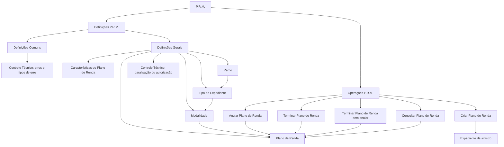

# Certificação de Sinistros — Definições e Operações P.R.M. (Plano de Renda)

## 1. Metadados do Documento
- **Arquivo de Origem:** Não identificado no conteúdo extraído
- **Tipo de Documento:** Manual Operacional / Especificação Funcional
- **Domínio / Sistema:** Sinistros, P.R.M., Plano de Renda, Reef, Mapfredocument
- **Público-Alvo:** Negócio, analistas funcionais, operação e equipes técnicas
- **Data/Versão Identificada:** Não identificada

---

## 2. Resumo Executivo & Contexto de Negócio

O documento descreve definições e operações associadas ao P.R.M. no contexto de **sinistros** e de **Planos de Renda**. O material está organizado entre definições comuns, definições gerais e operações aplicáveis a um Plano de Renda vinculado a um expediente de sinistro.

As definições comuns abrangem elementos não exclusivos do módulo de sinistros, mas necessários para sua configuração. Entre esses elementos está o **Controle Técnico**, responsável pela definição de erros e dos tipos de erro utilizados nas operações do P.R.M.

As definições gerais aplicam-se a expedientes que possuem um Plano de Renda. O documento menciona a configuração de planos, suas características, ramos, tipos de expediente, modalidades e condições de controle técnico que podem interromper operações ou exigir autorização.

O conjunto operacional do Plano de Renda contempla criação, anulação, encerramento, encerramento sem anulação e consulta. O conteúdo não detalha métodos HTTP, telas, contratos de integração, regras de cálculo, campos obrigatórios ou critérios específicos de autorização.

---

## 3. Arquitetura, Componentes & Tecnologias Envolvidas

Os componentes e conceitos explicitamente citados são:

- **P.R.M.:** domínio funcional abordado pelo documento; sua expansão não é informada.
- **Plano de Renda:** entidade funcional associável a um expediente.
- **Expediente de sinistro:** contexto no qual o Plano de Renda é registrado e gerenciado.
- **Controle Técnico:** configuração de erros, tipos de erro e condições capazes de paralisar operações ou exigir autorização.
- **Ramo:** dimensão utilizada para definir tipos de expediente e associações de modalidade.
- **Tipo de Expediente:** tipos de expediente por ramo que trabalharão com Planos de Renda.
- **Modalidade:** associação entre ramo, tipo de expediente, modalidade e tipo de Plano de Renda permitido.
- **Reef / Mapfredocument:** plataformas ou referências documentais exibidas na extração.
- **Owner identificado:** `user:agonzalez_mapfre.com`.
- **Lifecycle identificado:** `Approved Source / VL`.



> **Nota de Análise:** o documento apresenta uma estrutura funcional e conceitual, não uma arquitetura técnica de software. Não há detalhamento de APIs, bancos de dados, servidores, protocolos, tecnologias de implementação ou interfaces entre sistemas.

---

## 4. Regras de Negócio, Especificações Funcionais & Processos

### 4.1 Definições comuns

As definições comuns são configurações necessárias para realizar a definição do P.R.M., embora não sejam exclusivas do módulo de sinistros.

#### Controle Técnico — erros
O Controle Técnico contempla:
- Definição de erros.
- Definição de tipos de erro.
- Aplicação de erros e tipos de erro às operações do P.R.M.

### 4.2 Definições gerais para expedientes com Plano de Renda

As definições gerais afetam todos os possíveis expedientes que possuem um Plano de Renda.

#### Plano de Renda
O Plano de Renda define:
- A codificação dos possíveis planos.
- As validações associadas aos possíveis planos.

#### Características do Plano de Renda
As características do Plano de Renda incluem:
- Número de quotas.
- Existência de quotas extras.
- Outras características não detalhadas no conteúdo extraído.

#### Ramo
O documento menciona o Ramo como dimensão de definição. O texto extraído não apresenta regras adicionais para o Ramo.

#### Tipo de Expediente
O Tipo de Expediente define os tipos de expediente por Ramo que trabalharão com Planos de Renda.

#### Modalidade
A Modalidade permite associar:
- Ramo;
- Tipo de expediente;
- Modalidade;
- Tipo de Plano de Renda que pode ser associado.

#### Controle Técnico — condições operacionais
O Controle Técnico também define condições que podem:
- Paralisar operações de Plano de Renda.
- Tornar obrigatória a autorização de operações de Plano de Renda.

### 4.3 Operações de Plano de Renda

| Operação | Regra funcional extraída |
| :--- | :--- |
| Criar Plano de Renda | Permite registrar o Plano de Renda no expediente. |
| Anular Plano de Renda | Permite cancelar um Plano de Renda. |
| Terminar Plano de Renda | Permite finalizar o Plano de Renda quando não haverá mais quotas. |
| Terminar Plano de Renda sem anular | Permite finalizar o Plano de Renda sem cancelá-lo. |
| Consultar Plano de Renda | Mostra todas as informações do P.R.M. |

> **Nota de Análise:** o documento não especifica os critérios que distinguem operacionalmente “Terminar Plano de Renda” de “Terminar Plano de Renda sem anular”, além de informar que a segunda operação encerra o plano sem cancelá-lo.

---

## 5. Tabelas de Parâmetros, Ambientes e Estruturas de Dados

| Item / Parâmetro | Descrição / Função | Tipo / Valores / Formato | Ambiente / Observações |
| :--- | :--- | :--- | :--- |
| P.R.M. | Domínio funcional coberto pelo documento. | Sigla não expandida no texto. | Associado a sinistros e Plano de Renda. |
| Plano de Renda | Configuração e entidade gerenciada nas operações P.R.M. | Possui codificação e validações. | Pode ser registrado em um expediente. |
| Codificação de Plano de Renda | Identificação dos possíveis Planos de Renda. | Não detalhado. | Sujeita a validações não especificadas. |
| Características do Plano de Renda | Atributos funcionais do plano. | Número de quotas; quotas extras; outros não detalhados. | Aplicável a expedientes com Plano de Renda. |
| Ramo | Dimensão usada na definição de tipos de expediente. | Não detalhado. | Relacionado a Tipo de Expediente e Modalidade. |
| Tipo de Expediente | Define tipos de expediente por Ramo que utilizam Planos de Renda. | Não detalhado. | Aplicável ao contexto de sinistros. |
| Modalidade | Permite associação entre Ramo, Tipo de Expediente, Modalidade e tipo de Plano de Renda. | Não detalhado. | Define quais tipos de Plano de Renda podem ser associados. |
| Controle Técnico — erros | Define erros e tipos de erro para operações P.R.M. | Não detalhado. | Definição comum, não exclusiva de sinistros. |
| Controle Técnico — condições | Define condições que paralisam operações ou exigem autorização. | Não detalhado. | Aplicável às operações de Plano de Renda. |
| Criar Plano de Renda | Registra um Plano de Renda em um expediente. | Operação funcional. | Sem detalhes de validação ou autorização. |
| Anular Plano de Renda | Cancela um Plano de Renda. | Operação funcional. | Sem detalhes de efeitos posteriores. |
| Terminar Plano de Renda | Finaliza um Plano de Renda quando não haverá mais quotas. | Operação funcional. | Não informa se implica anulação. |
| Terminar Plano de Renda sem anular | Finaliza um Plano de Renda sem cancelá-lo. | Operação funcional. | Não detalha o estado final do plano. |
| Consultar Plano de Renda | Exibe todas as informações do P.R.M. | Operação de consulta. | Não informa filtros, permissões ou formato de saída. |
| Reef | Referência documental exibida no conteúdo. | Nome não expandido. | “Documentation / DOCUMENTACIÓN Reef”. |
| Mapfredocument | Referência documental exibida no conteúdo. | Nome não expandido. | Sem detalhes adicionais. |
| Owner | Responsável indicado na página documental. | `user:agonzalez_mapfre.com` | Conforme extração. |
| Lifecycle | Estado documental identificado. | `Approved Source / VL` | Significado de “VL” não detalhado. |

---

## 6. Bateria de Perguntas & Respostas para RAG (FAQ Sintético)

### P1: Qual é o escopo funcional do documento de Certificação de Sinistros — P.R.M.?
**R:** O documento descreve definições e operações P.R.M. relacionadas a Planos de Renda no contexto de expedientes de sinistro. O material inclui definições comuns, definições gerais para expedientes com Plano de Renda e operações para criar, anular, terminar, terminar sem anular e consultar um Plano de Renda.

### P2: O que o Controle Técnico define no contexto das operações P.R.M.?
**R:** O Controle Técnico define erros e tipos de erro para as operações P.R.M. Além disso, no contexto de Planos de Renda, o Controle Técnico define condições que podem paralisar operações ou tornar obrigatória a autorização para executá-las.

### P3: Quais informações são definidas para um Plano de Renda?
**R:** O Plano de Renda define a codificação dos possíveis planos e suas validações. O documento também menciona características do Plano de Renda, incluindo número de quotas e a existência de quotas extras.

### P4: Como o Tipo de Expediente se relaciona com o Ramo e os Planos de Renda?
**R:** O Tipo de Expediente define, por Ramo, quais tipos de expediente trabalharão com Planos de Renda. O documento não detalha códigos de Ramo, tipos específicos de expediente ou regras adicionais de elegibilidade.

### P5: Qual é a função da Modalidade na configuração de Planos de Renda?
**R:** A Modalidade permite associar Ramo, Tipo de Expediente e Modalidade ao tipo de Plano de Renda que pode ser associado. O conteúdo extraído não apresenta a lista de modalidades, tipos de plano ou critérios específicos dessa associação.

### P6: O que faz a operação Criar Plano de Renda?
**R:** A operação Criar Plano de Renda permite registrar um Plano de Renda no expediente. O documento não informa campos obrigatórios, validações aplicadas, permissões ou efeitos da criação.

### P7: Quando deve ser utilizada a operação Terminar Plano de Renda?
**R:** A operação Terminar Plano de Renda permite finalizar o Plano de Renda quando o plano não terá mais quotas. O texto não detalha se o encerramento altera estados adicionais ou se exige autorização do Controle Técnico.

### P8: Qual é a diferença documentada entre Terminar Plano de Renda e Terminar Plano de Renda sem anular?
**R:** Terminar Plano de Renda finaliza o plano quando não haverá mais quotas. Terminar Plano de Renda sem anular também finaliza o plano, mas explicitamente sem cancelá-lo. O documento não fornece detalhes adicionais sobre estados, consequências ou validações que diferenciem as duas operações.

### P9: O que acontece ao anular um Plano de Renda?
**R:** A operação Anular Plano de Renda permite cancelar um Plano de Renda. O conteúdo não detalha o impacto do cancelamento sobre quotas, expediente, histórico, autorizações ou consultas posteriores.

### P10: O que é mostrado na consulta de um Plano de Renda?
**R:** A operação Consultar Plano de Renda mostra todas as informações do P.R.M. O documento não especifica quais campos compõem essas informações, os filtros disponíveis, a forma de apresentação ou as regras de acesso.

### P11: O documento descreve APIs, integrações ou contratos de dados para P.R.M.?
**R:** Não. O conteúdo apresenta definições funcionais e operações de Plano de Renda, mas não detalha endpoints, métodos HTTP, payloads JSON, esquemas de banco de dados, integrações, protocolos ou tecnologias de implementação.

### P12: Quais informações documentais de governança foram identificadas?
**R:** A extração contém as referências “Documentation / DOCUMENTACIÓN Reef”, “Mapfredocument”, o owner `user:agonzalez_mapfre.com` e o lifecycle `Approved Source / VL`. O significado de “VL” e a relação técnica entre Reef e Mapfredocument não são explicados.

---

## 7. Glossário de Termos, Siglas & Conceitos-Chave

- **P.R.M.:** sigla utilizada no documento para o domínio de definições e operações associadas a Planos de Renda; a expansão da sigla não é informada.
- **Plano de Renda:** plano associado a um expediente, com codificação, validações e características como número de quotas e quotas extras.
- **Expediente:** registro ou caso associado ao contexto de sinistro; pode receber o registro de um Plano de Renda.
- **Sinistro:** domínio funcional no qual o documento posiciona os expedientes e Planos de Renda.
- **Ramo:** dimensão utilizada para definir Tipos de Expediente que trabalharão com Planos de Renda.
- **Tipo de Expediente:** classificação de expediente por Ramo aplicável a Planos de Renda.
- **Modalidade:** elemento que permite associar Ramo, Tipo de Expediente, Modalidade e tipo de Plano de Renda permitido.
- **Controle Técnico:** conjunto de definições de erros, tipos de erro e condições que podem paralisar operações ou exigir autorização.
- **Quota:** elemento mencionado como característica do Plano de Renda; o documento não define seu significado operacional.
- **Quota extra:** quota adicional mencionada como possível característica do Plano de Renda.
- **Reef:** referência documental exibida como “DOCUMENTACIÓN Reef”; não expandida no texto.
- **Mapfredocument:** referência documental exibida no conteúdo; não detalhada.
- **VL:** sigla apresentada no lifecycle “Approved Source / VL”; sem significado informado.

---

## 8. Notas Críticas, Riscos & Limitações

- O documento não informa a expansão da sigla **P.R.M.**
- Não há detalhamento técnico de APIs, integrações, contratos de mensagens, persistência, tecnologias, ambientes, URLs, portas ou servidores.
- Não são fornecidos os códigos, valores ou estruturas de dados para Ramo, Tipo de Expediente, Modalidade ou Plano de Renda.
- Não são detalhadas as validações de codificação dos Planos de Renda.
- Não são especificadas as condições concretas de Controle Técnico que paralisam operações ou exigem autorização.
- Não são informados perfis, matrizes de permissão, responsáveis por autorização ou trilhas de auditoria.
- A diferença entre “Terminar Plano de Renda” e “Terminar Plano de Renda sem anular” é parcialmente descrita; faltam regras de estado e consequências funcionais.
- O documento não explica o significado de **Reef**, **Mapfredocument** ou **VL**.
- A extração contém caracteres de substituição em palavras como “Deniciones” e “nalizar”, indicando provável problema de codificação no texto-fonte.

---

## 9. Conteúdo Bruto Estruturado (Referência Fiel)

```text
--- [PÁGINA 1 DE 2] ---

CERTIFICACIÓN de SINIESTROS - P.R.M.
Deniciones P.R.M.
Operaciones P.R.M.
DEFINICIONES
COMÚN
En este nivel se encuentran deniciones que NO son exclusivas del módulo de siniestros, pero son
necesarias para poder realizar la denición. Entre otras deniciones se encuentra:
CONTROL TÉCNICO
Denición de errores, tipos de Errores para las operaciones del P.R.M.
GENERAL
En este nivel se encuentran deniciones que afectarán a todos los posibles expedientes que tienen un plan
de renta
PLAN DE RENTA
Denición de la codicación de los posibles planes y sus
validaciones
CARACTERÍSTICAS
Denición de las características del plan de renta, número de
cuotas, si tiene cuotas extras, etc
RAMO
Documentation / DOCUMENTACIÓN Reef
DOCUMENTACIÓN Reef
Mapfredocument
DOCUMENTACIÓN Reef
Owner
user:agonzalez_mapfre.com
Lifecycle
Approved Source
 /
VL
Buscar Inicio Soluciones Arquitecturas APIs Componentes Cloud Documentación Zeus Reef Ayuda
ES


--- [PÁGINA 2 DE 2] ---

En este nivel se encuentran deniciones que afectarán a todos los posibles expedientes de un siniestro
TIPO DE EXPEDIENTE
Denición de los tipos de expediente por
Ramo que van a trabajar con planes de
Renta
MODALIDAD
Permite asociar por ramo, tipo de
expediente y modalidad que tipo de plan
de renta se puede asociar
CONTROL TÉCNICO
Denición de las condiciones que puede
paralizar las operaciones de plan de renta
u obligación de ser autorizada
OPERACIONES
PLAN DE RENTA
Operaciones que se pueden realizar con un Plan de Renta
CREAR Plan Renta
Permite registrar el Plan de Renta al
expediente
ANULAR Plan Renta
Permite cancelar un Plan de Renta
TERMINAR Plan Renta
Permite nalizar el Plan de Renta cuando
este ya no va a tener más cuotas
TERMINAR Plan Renta sin anular
Permite nalizar el Plan de Renta sin
cancelarlo
CONSULTAR Plan Renta
Muestra toda la información del P.R.M
```
