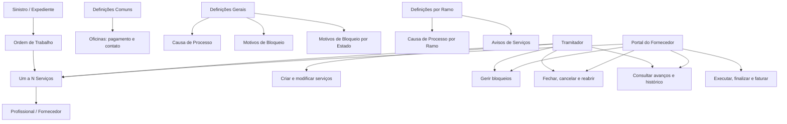
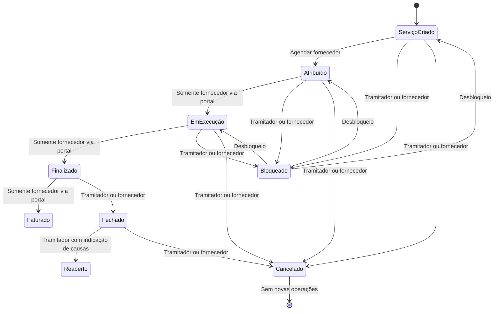

# Certificação de Sinistros — Definições e Operações de Serviços

## 1. Metadados do Documento
- **Arquivo de Origem:** Não identificado no conteúdo fornecido
- **Tipo de Documento:** Manual Operacional
- **Domínio / Sistema:** Certificação de Sinistros — Serviços; Reef; Mapfre
- **Público-Alvo:** Tramitadores, fornecedores, operadores de portal e equipes funcionais
- **Data/Versão Identificada:** Não identificada

---

## 2. Resumo Executivo & Contexto de Negócio

O documento descreve definições e operações para serviços associados ao processo de sinistros/expedientes. O conteúdo está organizado em níveis de definição — **Comum**, **Geral** e **Ramo** — e em operações realizadas sobre os serviços de fornecedores.

No nível **Comum**, o documento registra definições que não são exclusivas do módulo de sinistros, mas que são necessárias para definir peritações. Entre essas definições estão os cadastros de oficinas, incluindo meios de pagamento e meios de contato.

No nível **Geral**, o documento define elementos aplicáveis a todos os expedientes que possam possuir um serviço associado. Esses elementos incluem causas de processo para cancelamento ou reabertura de serviços e motivos de bloqueio de serviços, inclusive por estado.

No nível **Ramo**, existem definições específicas para cada ramo, incluindo causas de processo e avisos de serviços configurados por tipo de serviço, tipo de expediente, nível e trâmite. O documento também descreve o ciclo operacional de uma ordem de trabalho, que pode exigir de um a “n” serviços.

As operações podem ser realizadas por dois perfis principais: o **tramitador** e o **fornecedor**, por meio do portal. As permissões variam conforme a operação: algumas ações pertencem exclusivamente ao tramitador, enquanto outras podem ser executadas pelo fornecedor no portal.

---

## 3. Arquitetura, Componentes & Tecnologias Envolvidas

### Componentes e conceitos identificados

| Componente / Conceito | Papel descrito no documento |
| :--- | :--- |
| Certificação de Sinistros — Serviços | Domínio funcional que concentra definições e operações de serviços associados a sinistros/expedientes. |
| Definições Comuns | Configurações não exclusivas de sinistros, necessárias para definição de peritações. |
| Definições Gerais | Configurações aplicáveis a todos os expedientes aos quais seja possível associar um serviço. |
| Definições por Ramo | Configurações específicas de cada ramo. |
| Oficinas / Talleres | Cadastro de oficinas da companhia, incluindo meios de pagamento e contato. |
| Ordem de trabalho | Entidade criada e associada a um sinistro/expediente; pode necessitar de um a “n” serviços. |
| Serviço | Pedido de execução de um trabalho por um profissional; pertence sempre a uma ordem. |
| Tramitador | Perfil que cria, modifica, fecha, cancela, reabre, bloqueia e consulta serviços conforme as regras apresentadas. |
| Fornecedor | Perfil que atua pelo portal em operações autorizadas, incluindo execução, finalização, faturamento, bloqueio, desbloqueio e consultas. |
| Portal do fornecedor | Canal pelo qual o fornecedor realiza operações permitidas sobre o serviço. |
| Reef | Repositório/plataforma de documentação mencionada como “DOCUMENTACIÓN Reef”. |
| Mapfredocument | Termo citado no cabeçalho da documentação, sem detalhamento funcional adicional. |



> **Nota de Análise:** O documento não detalha arquitetura técnica de software, integrações, APIs, protocolos, contratos JSON, banco de dados, URLs, tecnologias de implementação ou infraestrutura.

---

## 4. Regras de Negócio, Especificações Funcionais & Processos

### 4.1. Níveis de definição

#### Nível Comum
O nível Comum reúne definições que não são exclusivas do módulo de sinistros, mas são necessárias para realizar a definição de peritações.

- **Oficinas / Talleres:** permite registrar todas as oficinas da companhia.
- Para cada oficina, o documento cita meios de pagamento, meios de contato e outros dados não detalhados.

#### Nível Geral
O nível Geral contém definições que afetam todos os possíveis expedientes aos quais um serviço possa ser associado.

- **Causa de Processo:** cataloga os motivos pelos quais se deseja cancelar ou reabrir um serviço.
- **Motivos de Bloqueio:** cataloga as causas pelas quais um serviço é bloqueado.
- **Motivos de Bloqueio por Estado:** item listado no documento, sem detalhamento adicional.

#### Nível por Ramo
O nível por Ramo contém definições específicas para cada ramo.

- **Causa de Processo por Ramo:** cataloga os motivos para realizar o cancelamento ou a reabertura de um serviço para cada ramo.
- **Avisos de Serviços:** permite definir avisos conforme tipo de serviço, tipo de expediente, nível, trâmite e demais critérios não detalhados.

### 4.2. Estrutura de ordem e serviço

1. Uma **ordem de trabalho** pode ser criada e associada a um sinistro/expediente.
2. Para satisfazer uma ordem de trabalho, podem ser necessários de um a “n” serviços.
3. Um **serviço** representa a solicitação para que um profissional realize um trabalho.
4. Todo serviço está obrigatoriamente englobado em uma ordem de trabalho.

### 4.3. Operações sobre serviços

#### Criar ordem
- Permite gerar uma ordem de trabalho.
- A ordem de trabalho é associada a um sinistro/expediente.
- Uma ordem pode requerer de um a “n” serviços para ser satisfeita.

#### Criar serviço
- Permite gerar uma solicitação para realização de trabalho por um profissional.
- O serviço deve estar sempre incluído dentro de uma ordem.

#### Atribuir serviço
- Permite agendar dia e hora para o fornecedor iniciar o trabalho.
- Exemplos apresentados:
  - Agendar uma oficina quando um veículo entra.
  - Agendar um pedreiro quando precisa ir a um domicílio.
- O fornecedor também pode executar essa operação pelo portal.

#### Modificar serviço
- O tramitador pode modificar dados do serviço quando considerar necessário.
- O documento não lista quais campos de serviço podem ser modificados.

#### Modificar estados
- Pelo portal, o fornecedor — e somente o fornecedor — pode colocar o serviço nos estados:
  - **Em Execução**
  - **Finalizado**
  - **Faturado**

#### Criar notificações manuais
- O tramitador pode gerar notificações manualmente para o fornecedor.
- O tramitador pode visualizar se a notificação foi lida pelo fornecedor.

#### Gerir bloqueios
- O tramitador pode intervir para:
  - Paralisar a execução do serviço.
  - Bloquear a execução do serviço.
  - Usar motivos catalogados para o bloqueio.
  - Desbloquear o serviço.
- Pelo portal, o fornecedor também pode bloquear e desbloquear o serviço.

#### Fechar serviço
- O tramitador pode fechar o serviço.
- O estado fechado indica que o serviço foi concluído e está pendente de faturamento.
- Pelo portal, o fornecedor também pode executar a funcionalidade de fechamento.

#### Cancelar serviço
- O tramitador pode cancelar o serviço.
- O estado cancelado indica que a realização do serviço foi suspensa.
- Após o cancelamento, não é possível realizar mais operações sobre o serviço.
- Pelo portal, o fornecedor também pode cancelar o serviço.

#### Reabrir serviço
- O tramitador pode reabrir um serviço que esteja fechado.
- A reabertura exige a indicação das causas.
- O documento não informa se o fornecedor pode reabrir um serviço.

#### Consultar avanços
- Exibe os diferentes movimentos dentro do estado **Em Execução**.
- Está habilitado para o tramitador e para o portal do fornecedor.

#### Consultar histórico de movimentos
- Exibe todos os estados pelos quais um serviço passou.
- Está habilitado para o tramitador e para o portal do fornecedor.

### 4.4. Fluxo funcional inferido apenas das operações descritas



> **Nota de Análise:** O diagrama de estados representa relações explicitamente citadas, mas o documento não fornece uma máquina de estados formal, transições completas nem confirma todos os estados de origem permitidos para bloqueio, cancelamento ou fechamento.

---

## 5. Tabelas de Parâmetros, Ambientes e Estruturas de Dados

| Item / Parâmetro | Descrição / Função | Tipo / Valores / Formato | Ambiente / Observações |
| :--- | :--- | :--- | :--- |
| Oficinas / Talleres | Registra oficinas da companhia. | Cadastro; detalhes incluem meio de pagamento e meio de contato. | Definições Comuns. |
| Meio de pagamento | Dado associado a uma oficina. | Não detalhado. | Documento não define valores permitidos. |
| Meio de contato | Dado associado a uma oficina. | Não detalhado. | Documento não define formato. |
| Causa de Processo | Cataloga motivos para cancelar ou reabrir um serviço. | Catálogo de motivos. | Definições Gerais. |
| Motivos de Bloqueio | Cataloga causas para bloquear um serviço. | Catálogo de causas. | Definições Gerais. |
| Motivos de Bloqueio por Estado | Item relacionado a bloqueios conforme estado. | Não detalhado. | Definições Gerais. |
| Causa de Processo por Ramo | Cataloga motivos de cancelamento ou reabertura por ramo. | Catálogo de motivos por ramo. | Definições por Ramo. |
| Avisos de Serviços | Define avisos para serviços. | Por tipo de serviço, tipo de expediente, nível e trâmite. | Definições por Ramo. |
| Ordem de Trabalho | Ordem associada a um sinistro/expediente. | Pode necessitar de um a “n” serviços. | Operações de Serviços. |
| Serviço | Solicitação de realização de trabalho por profissional. | Sempre pertencente a uma ordem. | Operações de Serviços. |
| Data e hora de agendamento | Agenda início do trabalho do fornecedor. | Dia e hora. | Usado na atribuição de serviço. |
| Estado Em Execução | Estado que registra realização do trabalho. | Estado de serviço. | Fornecedor, exclusivamente pelo portal, pode defini-lo. |
| Estado Finalizado | Estado definido pelo fornecedor via portal. | Estado de serviço. | Somente fornecedor. |
| Estado Faturado | Estado definido pelo fornecedor via portal. | Estado de serviço. | Somente fornecedor. |
| Estado Fechado | Indica serviço acabado e pendente de faturamento. | Estado de serviço. | Pode ser fechado por tramitador ou fornecedor pelo portal. |
| Estado Cancelado | Indica suspensão da realização do serviço. | Estado de serviço. | Nenhuma outra operação pode ser realizada após cancelamento. |
| Causa de reabertura | Motivo indicado ao reabrir serviço fechado. | Causa; formato não detalhado. | Reabertura executada pelo tramitador. |
| Notificação manual | Comunicação gerada manualmente ao fornecedor. | Notificação com indicador de leitura. | Criada pelo tramitador. |
| Avanços | Movimentos dentro do estado Em Execução. | Consulta de movimentos. | Tramitador e portal do fornecedor. |
| Histórico de movimentos | Todos os estados pelos quais um serviço passou. | Consulta de histórico. | Tramitador e portal do fornecedor. |

### Matriz de permissões identificada

| Operação | Tramitador | Fornecedor pelo Portal | Restrições / Observações |
| :--- | :---: | :---: | :--- |
| Criar ordem | Sim | Não informado | Associa ordem a sinistro/expediente. |
| Criar serviço | Sim | Não informado | Serviço sempre pertence a uma ordem. |
| Atribuir serviço | Sim | Sim | Agendamento de data e hora para início do trabalho. |
| Modificar dados do serviço | Sim | Não informado | Documento atribui explicitamente a operação ao tramitador. |
| Alterar para Em Execução | Não informado | Sim | Somente o fornecedor pode definir esse estado pelo portal. |
| Alterar para Finalizado | Não informado | Sim | Somente o fornecedor pode definir esse estado pelo portal. |
| Alterar para Faturado | Não informado | Sim | Somente o fornecedor pode definir esse estado pelo portal. |
| Criar notificações manuais | Sim | Não informado | Tramitador verifica se fornecedor leu a notificação. |
| Bloquear serviço | Sim | Sim | Pode usar motivos catalogados. |
| Desbloquear serviço | Sim | Sim | Permitido ao fornecedor pelo portal. |
| Fechar serviço | Sim | Sim | Fechado significa acabado e pendente de faturamento. |
| Cancelar serviço | Sim | Sim | Após cancelado, nenhuma operação adicional é permitida. |
| Reabrir serviço fechado | Sim | Não informado | Exige indicação das causas. |
| Consultar avanços | Sim | Sim | Mostra movimentos em Em Execução. |
| Consultar histórico de movimentos | Sim | Sim | Mostra todos os estados percorridos. |

---

## 6. Bateria de Perguntas & Respostas para RAG (FAQ Sintético)

### P1: Qual é a diferença entre as definições Comuns, Gerais e por Ramo na Certificação de Sinistros?
**R:** As definições Comuns não são exclusivas do módulo de sinistros, mas são necessárias para a definição de peritações, como o cadastro de oficinas. As definições Gerais afetam todos os expedientes que possam possuir um serviço associado, incluindo causas de processo e motivos de bloqueio. As definições por Ramo são específicas de cada ramo e incluem causas de cancelamento ou reabertura por ramo e avisos de serviços.

### P2: O que uma ordem de trabalho representa no processo de serviços?
**R:** Uma ordem de trabalho é gerada e associada a um sinistro/expediente. Para satisfazer uma ordem, podem ser necessários de um a “n” serviços. Cada serviço deve estar sempre englobado em uma ordem de trabalho.

### P3: Um serviço pode existir sem uma ordem de trabalho?
**R:** Não. O documento estabelece que um serviço é uma solicitação de realização de trabalho por um profissional e que o serviço sempre estará englobado dentro de uma ordem.

### P4: Quem pode agendar a data e a hora de início do trabalho de um fornecedor?
**R:** A atribuição de serviço permite agendar o dia e a hora para o fornecedor iniciar o trabalho. O documento informa que essa operação também pode ser realizada pelo fornecedor por meio do portal.

### P5: Quais estados somente o fornecedor pode definir no portal?
**R:** Pelo portal, o fornecedor — e somente o fornecedor — pode colocar o serviço nos estados Em Execução, Finalizado e Faturado.

### P6: O que significa fechar um serviço?
**R:** Fechar um serviço indica que o serviço está acabado, mas ainda pendente de faturamento. A funcionalidade pode ser executada pelo tramitador e também pelo fornecedor através do portal.

### P7: O que acontece depois que um serviço é cancelado?
**R:** O cancelamento indica que a realização do serviço foi suspensa. Após o serviço alcançar o estado cancelado, não é possível realizar mais operações sobre esse serviço.

### P8: Quem pode cancelar um serviço?
**R:** O tramitador pode cancelar o serviço. O fornecedor também pode realizar a funcionalidade de cancelamento pelo portal.

### P9: Como ocorre a reabertura de um serviço?
**R:** O tramitador pode reabrir um serviço que esteja fechado, devendo indicar as causas da reabertura. O documento não informa que o fornecedor possa realizar a reabertura pelo portal.

### P10: Quem pode bloquear e desbloquear um serviço?
**R:** O tramitador pode paralisar ou bloquear a execução de um serviço por motivos catalogados e também pode desbloqueá-lo. O fornecedor, pelo portal, também pode bloquear e desbloquear o serviço.

### P11: Qual é a finalidade dos motivos de bloqueio?
**R:** Os motivos de bloqueio permitem catalogar as causas pelas quais um serviço é bloqueado. O documento também lista motivos de bloqueio por estado, mas não fornece detalhamento adicional sobre sua configuração ou utilização.

### P12: O que é exibido na consulta de avanços de um serviço?
**R:** A consulta de avanços mostra os diferentes movimentos dentro do estado Em Execução. Essa consulta está habilitada tanto para o tramitador quanto para o portal do fornecedor.

### P13: Qual é a diferença entre consultar avanços e consultar o histórico de movimentos?
**R:** Consultar avanços mostra os movimentos realizados dentro do estado Em Execução. Consultar histórico de movimentos mostra todos os estados pelos quais o serviço passou. Ambas as consultas estão disponíveis para o tramitador e para o portal do fornecedor.

### P14: Quais informações são registradas para oficinas no nível Comum?
**R:** O documento informa que todas as oficinas da companhia podem ser registradas com seus meios de pagamento, meios de contato e outros dados não especificados.

---

## 7. Glossário de Termos, Siglas & Conceitos-Chave

- **Certificação de Sinistros:** Contexto funcional do documento que aborda definições e operações de serviços associados a sinistros/expedientes.
- **Sinistro / Expediente:** Entidade à qual uma ordem de trabalho pode ser associada.
- **Serviço:** Pedido para execução de um trabalho por um profissional; pertence sempre a uma ordem.
- **Ordem de Trabalho:** Estrutura associada a um sinistro/expediente que pode requerer de um a “n” serviços.
- **Fornecedor / Proveedor:** Perfil responsável pela realização do trabalho e por determinadas operações no portal.
- **Tramitador:** Perfil que intervém na gestão administrativa e operacional de serviços.
- **Portal do Fornecedor:** Canal pelo qual o fornecedor realiza operações autorizadas sobre serviços.
- **Peritação:** Termo citado como processo que exige definições comuns; o documento não apresenta definição adicional.
- **Ramo:** Nível de definição específico para determinada categoria de negócio; o documento não detalha os ramos existentes.
- **Causa de Processo:** Motivo catalogado para cancelamento ou reabertura de serviço.
- **Motivo de Bloqueio:** Causa catalogada para bloqueio de serviço.
- **Avisos de Serviços:** Configuração de avisos por tipo de serviço, expediente, nível e trâmite.
- **Reef:** Plataforma ou contexto de documentação citado no cabeçalho como “DOCUMENTACIÓN Reef”.
- **Mapfredocument:** Termo citado no cabeçalho; não há definição adicional no conteúdo fornecido.

---

## 8. Notas Críticas, Riscos & Limitações

- O documento não identifica nome do arquivo de origem, data, versão, autor funcional ou histórico de revisões.
- Não há especificação de APIs, métodos HTTP, contratos de integração, eventos, schemas de dados, banco de dados, URLs, credenciais ou ambientes técnicos.
- Os estados **Em Execução**, **Finalizado**, **Faturado**, **Fechado** e **Cancelado** são citados, mas o documento não fornece uma máquina de estados formal nem todas as transições permitidas.
- O documento não informa quais dados do serviço podem ser modificados pelo tramitador.
- O item **Motivos de Bloqueio por Estado** é listado sem explicação adicional.
- O documento não detalha os tipos de serviço, tipos de expediente, níveis ou trâmites aplicáveis aos avisos de serviços.
- O documento não informa se a criação de ordens e serviços é exclusiva do tramitador; apenas descreve explicitamente as operações atribuídas a cada perfil quando indicado.
- A reabertura é descrita para o tramitador e exige causas, mas não detalha quais estados resultam após a reabertura nem quais causas são válidas.
- Há artefatos de codificação no texto extraído, como `deniciones`, `modicar` e `noticaciones`, que aparentam corresponder a caracteres especiais extraídos incorretamente.

---

## 9. Conteúdo Bruto Estruturado (Referência Fiel)

```text
--- [PÁGINA 1 DE 2] ---

CERTIFICACIÓN de SINIESTROS - SERVICIOS
Deniciones Servicios
Operaciones Servicios
DEFINICIONES
COMÚN
En este nivel se encuentran deniciones que NO son exclusivas del módulo de siniestros, pero son
necesarias para poder realizar la denición de peritaciones. En otros se encuentran:
TALLERES
Registrar todos los talleres de la compañía con sus medios de pago, medio de contacto, etc
GENERAL
En este Nivel se encuentran deniciones que afectarán a todos los posibles expedientes a los que se les
pueda asociar un servicio. Entre otros se dene:
CAUSA PROCESO
Permite catalogar los motivos por los que
se quiere cancelar un servicio o
reaperturar un servicio
MOTIVOS BLOQUEO
Permite catalogar las causas por las que
se bloquea un servicio
MOTIVOS BLOQUEO POR ESTADO
RAMO
Documentation / DOCUMENTACIÓN Reef
DOCUMENTACIÓN Reef
Mapfredocument
DOCUMENTACIÓN Reef
Owner
user:agonzalez_mapfre.com
Lifecycle
Approved Source
 / 
 VL
Buscar Inicio Soluciones Arquitecturas APIs Componentes Cloud Documentación Zeus Reef Ayuda
ES


--- [PÁGINA 2 DE 2] ---

En este Nivel se encuentran deniciones para cada ramo
CAUSA PROCESO
Permite catalogar los motivos por los que se quiere realizar la
cancelación o reapertura de un servicio para cada ramo
AVISOS SERVICIOS
Permite denir los avisos por tipo de servicio, tipo de expediente,
nivel, trámite etc
OPERACIONES
SERVICIOS
Operaciones se pueden realizar con los servicios de los proveedores
CREAR orden
Permite generar una orden de trabajo y
asociarla a un siniestro/expediente. Para
satisfacer una orden puede necesitarse de
uno a "n" servicios
CREAR servicio
Permite generar la petición de la
realización de un trabajo a un profesional,
que siempre estará englobado dentro una
orden
ASIGNAR Servicio
Agendar día y hora para que el proveedor
comience el trabajo. Ejemplo: Agendar al
taller cuando entra un vehículo, agendar a
una albañil cuando tiene que ir a un
domicilio...
Desde el portal, el proveedor también
puede realizar esta operación.
MODIFICAR servicio
El tramitador podrá modicar datos del
servicio cuando así lo considere
MODIFICAR estados
Desde el portal el proveedor y sólo el
proveedor, podrá poner el servicio en
Ejecución, Finalizado y Facturado.
CREAR noticaciones manuales
El tramitador puede generar noticaciones
manualmente al proveedor. El tramitador
puede visualizar si esta ha sido leída por
el proveedor
GESTIONAR Bloqueos
El tramitador, puede intervenir para
paralizar, bloquear la ejecución del
servicio, por motivos catalogados o para
desbloquear el mismo.
Desde el portal, el proveedor también
puede realizar ambas operaciones,
bloquear y desbloquear el servicio.
CERRAR servicio
El tramitador puede cerrar el servicio, este
estado indica que el servicio está
acabado, pendiente de facturar.
Desde el portal, el proveedor también
puede realizar esta funcionalidad
CANCELAR servicio
El tramitador puede cancelar el servicio.
Este estado indica que se suspende la
realización del servicio, desde este estado
ya no se puede realizar más operaciones
con el servicio
Desde el portal, el proveedor también
puede realizar esta funcionalidad
RE-APERTURAR servicio
El tramitador puede reaperturar un servicio
que está cerrado, indicando las causas
CONSULTAR avances
Muestra los diferentes movimientos
dentro del estado de Ejecución. Habilitado
para el tramitador y el portal del proveedor
CONSULTAR Histórico Mvtos.
Muestra todos los estados por los que ha
pasado un servicio. Habilitado para el
tramitador y el portal del proveedor
```
