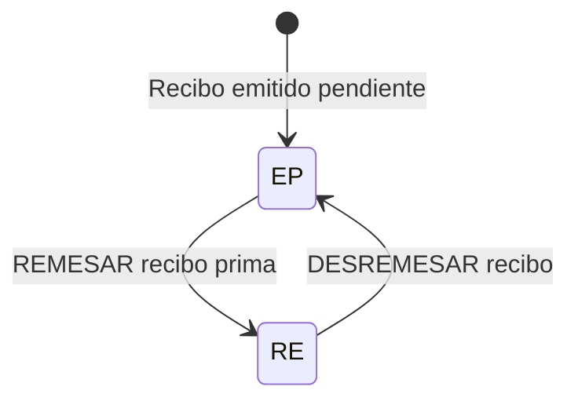

# Certificación Tesorería Nivel 1 — Gestión de Recibos de Cobro

## 1. Metadados do Documento
- **Arquivo de Origem:** Não identificado — conteúdo bruto fornecido pelo usuário
- **Tipo de Documento:** Procedimento
- **Domínio / Sistema:** Tesorería / DOCUMENTACIÓN Reef / Mapfre
- **Público-Alvo:** Operação, negócio e gestores de cobrança
- **Data/Versão Identificada:** Não identificada

---

## 2. Resumo Executivo & Contexto de Negócio

O documento descreve operações de **Tesorería nível 1** para gerir recibos de cobrança, incluindo compensações financeiras, consulta de recibos, remessa, desremessa e mudança de gestor de cobrança. O conteúdo está associado à **DOCUMENTACIÓN Reef** e apresenta o estado de ciclo de vida documental como **Approved**.

A gestão de recibos abrange operações de recebimento, entrega e anulação relacionadas a dinheiro em caixa, dinheiro em banco, cheque, cartão, conta de gestão e diferenças cambiais. Cada operação possui uma finalidade explícita de compensação de valores cobrados, devolvidos, anulados ou associados a diferenças de câmbio.

O documento também estabelece um fluxo de estados para recibos de prémios: a operação **REMESAR recibo prima** move o recibo de **Emitido Pendiente (EP)** para **Remesado (RE)**; a operação **DESREMESAR recibo** restaura o recibo de **RE** para **EP**.

Além das operações financeiras, são disponibilizadas consultas de recibos por diferentes critérios de busca e por gestor de cobrança. A operação **CAMBIAR recibo prima gestor** permite reatribuir um recibo para outro gestor de cobrança.

---

## 3. Arquitetura, Componentes & Tecnologias Envolvidas

### Componentes e domínios citados

| Componente / Termo | Papel identificado no documento |
| :--- | :--- |
| Tesorería nivel 1 | Contexto funcional das operações de gestão de recibos e compensações. |
| Gestión de recibos | Conjunto de operações para cobrar, anular, consultar, remessar, desremessar e alterar gestor de recibos. |
| DOCUMENTACIÓN Reef | Área documental em que o conteúdo está publicado. |
| Mapfredocument | Termo exibido na navegação/documentação. |
| Gestor de cobro | Responsável de cobrança associado a um recibo. |
| Caja | Contexto de operações de recebimento, entrega, anulação e diferenças de câmbio. |
| Banco | Contexto de pagamentos, devoluções e recebimentos processados em banco. |
| Cuenta de gestión | Conta utilizada para compensações de cobranças ou anulações. |
| Cheque | Meio de pagamento ou compensação em operações de caixa e banco. |
| Tarjeta | Meio de pagamento ou compensação em operações de caixa e banco. |

### Fluxo de estados do recibo de prémio



> **Nota de Análise:** O documento não detalha arquitetura de software, APIs, contratos JSON, métodos HTTP, servidores, bases de dados ou tecnologias de implementação.

---

## 4. Regras de Negócio, Especificações Funcionais & Processos

### Operações de compensação relacionadas a cobranças anuladas

1. **ENTREGAR caja efectivo**
   - Realiza a compensação de uma anulação de cobrança em dinheiro.

2. **ENTREGAR banco efectivo**
   - Realiza a compensação de uma anulação de cobrança paga no banco.

3. **ENTREGAR cuenta gestión**
   - Realiza a compensação de uma anulação de cobrança contra uma conta de gestão.

4. **ANULAR caja cheque**
   - Realiza a compensação de uma anulação de cobrança contra um cheque em caixa.

5. **ANULAR caja tarjeta**
   - Realiza a compensação de uma anulação de cobrança contra um cartão.

### Operações de compensação relacionadas a devoluções bancárias

1. **RECIBIR caja banco cheque**
   - Realiza a compensação dos valores devolvidos pelo banco que foram cobrados por cheque.

2. **RECIBIR caja banco tarjeta**
   - Realiza a compensação dos valores devolvidos pelo banco que foram cobrados por cartão.

### Operações de recebimento de cobranças

1. **RECIBIR caja efectivo**
   - Realiza a compensação de uma cobrança em dinheiro.

2. **RECIBIR caja cheque**
   - Realiza a compensação de uma cobrança com cheque.

3. **RECIBIR caja tarjeta**
   - Realiza a compensação de uma cobrança com cartão.

4. **RECIBIR caja banco efectivo**
   - Realiza a compensação de uma cobrança quando o cliente paga no banco.

5. **RECIBIR caja cuenta gestión**
   - Realiza a compensação de uma cobrança contra uma conta de gestão.

6. **RECIBIR caja cancelación cobro anticipado**
   - Realiza a compensação de uma cobrança de um recibo com o cancelamento de uma cobrança antecipada.

### Operações relacionadas a diferenças de câmbio

1. **ENTREGAR caja diferencia cambio**
   - Realiza a compensação da diferença positiva em caixa por tipos de câmbio.

2. **RECIBIR caja diferencia cambio**
   - Realiza a compensação da diferença negativa em caixa por tipos de câmbio.

### Consultas e gestão de responsáveis

1. **CONSULTAR recibo**
   - Mostra informações de recibos por diferentes critérios de busca.

2. **CONSULTAR recibo agente gestor**
   - Mostra informações de recibos por gestor de cobrança.

3. **CAMBIAR recibo prima gestor**
   - Permite atribuir outro gestor de cobrança a um recibo.

### Gestão de estados de recibos de prémios

1. **REMESAR recibo prima**
   - Coloca recibos de apólices em cobrança.
   - Altera o estado do recibo de **Emitido Pendiente (EP)** para **Remesado (RE)**.

2. **DESREMESAR recibo**
   - Retorna para **Emitido Pendiente (EP)** um recibo previamente em **Remesado (RE)**.

---

## 5. Tabelas de Parâmetros, Ambientes e Estruturas de Dados

| Item / Parâmetro | Descrição / Função | Tipo / Valores / Formato | Ambiente / Observações |
| :--- | :--- | :--- | :--- |
| ENTREGAR caja efectivo | Compensa uma anulação de cobrança em dinheiro. | Operação de compensação | Caja / efectivo |
| ENTREGAR banco efectivo | Compensa uma anulação de cobrança paga no banco. | Operação de compensação | Banco / efectivo |
| RECIBIR caja banco cheque | Compensa valores devolvidos de banco cobrados por cheque. | Operação de compensação | Caja / banco / cheque |
| RECIBIR caja banco tarjeta | Compensa valores devolvidos de banco cobrados por cartão. | Operação de compensação | Caja / banco / tarjeta |
| ENTREGAR cuenta gestión | Compensa uma anulação de cobrança contra conta de gestão. | Operação de compensação | Cuenta de gestión |
| ANULAR caja cheque | Compensa uma anulação de cobrança contra cheque em caixa. | Operação de compensação | Caja / cheque |
| ANULAR caja tarjeta | Compensa uma anulação de cobrança contra cartão. | Operação de compensação | Caja / tarjeta |
| ENTREGAR caja diferencia cambio | Compensa diferença positiva em caixa por tipos de câmbio. | Operação de compensação | Caja / diferencia cambio |
| RECIBIR caja efectivo | Compensa uma cobrança em dinheiro. | Operação de compensação | Caja / efectivo |
| RECIBIR caja cheque | Compensa uma cobrança com cheque. | Operação de compensação | Caja / cheque |
| RECIBIR caja tarjeta | Compensa uma cobrança com cartão. | Operação de compensação | Caja / tarjeta |
| RECIBIR caja banco efectivo | Compensa cobrança quando o cliente paga no banco. | Operação de compensação | Caja / banco / efectivo |
| RECIBIR caja cuenta gestión | Compensa cobrança contra conta de gestão. | Operação de compensação | Caja / cuenta de gestión |
| RECIBIR caja diferencia cambio | Compensa diferença negativa em caixa por tipos de câmbio. | Operação de compensação | Caja / diferencia cambio |
| RECIBIR caja cancelación cobro anticipado | Compensa cobrança de recibo com cancelamento de cobrança antecipada. | Operação de compensação | Caja / cobro anticipado |
| CONSULTAR recibo | Exibe informações de recibos segundo critérios de busca. | Consulta | Critérios não detalhados |
| CONSULTAR recibo agente gestor | Exibe informações de recibos por gestor de cobrança. | Consulta | Gestor de cobro |
| REMESAR recibo prima | Coloca recibos de apólices em cobrança. | Transição de estado | EP → RE |
| DESREMESAR recibo | Retorna recibo remessado ao estado emitido pendente. | Transição de estado | RE → EP |
| CAMBIAR recibo prima gestor | Atribui outro gestor de cobrança ao recibo. | Gestão de responsável | Gestor de cobro |
| Emitido Pendiente | Estado de recibo antes de remessa ou após desremessa. | Estado | EP |
| Remesado | Estado de recibo após a operação de remessa. | Estado | RE |
| Owner | Proprietário exibido na documentação. | Identificador | `user:agonzalez_mapfre.com` |
| Lifecycle | Ciclo de vida documental exibido. | Valor | Approved |

---

## 6. Bateria de Perguntas & Respostas para RAG (FAQ Sintético)

### P1: Qual operação coloca recibos de apólices em cobrança?
**R:** A operação **REMESAR recibo prima** coloca recibos de apólices em cobrança e altera o estado do recibo de **Emitido Pendiente (EP)** para **Remesado (RE)**.

### P2: Como retornar um recibo Remesado para o estado Emitido Pendiente?
**R:** Deve-se utilizar a operação **DESREMESAR recibo**. A operação restaura um recibo que está em **Remesado (RE)** para o estado **Emitido Pendiente (EP)**.

### P3: Qual operação compensa uma cobrança em dinheiro?
**R:** A operação **RECIBIR caja efectivo** realiza a compensação de uma cobrança em dinheiro.

### P4: Qual operação deve ser usada quando o cliente paga uma cobrança no banco?
**R:** A operação **RECIBIR caja banco efectivo** realiza a compensação de uma cobrança quando o cliente efetua o pagamento no banco.

### P5: Como compensar uma cobrança anulada que foi paga no banco?
**R:** A operação **ENTREGAR banco efectivo** realiza a compensação de uma anulação de cobrança paga no banco.

### P6: Como tratar valores devolvidos pelo banco que haviam sido cobrados por cheque?
**R:** A operação **RECIBIR caja banco cheque** realiza a compensação dos valores devolvidos pelo banco que foram cobrados por cheque.

### P7: Qual operação compensa uma diferença positiva de câmbio em caixa?
**R:** A operação **ENTREGAR caja diferencia cambio** realiza a compensação da diferença positiva em caixa por tipos de câmbio.

### P8: Qual operação compensa uma diferença negativa de câmbio em caixa?
**R:** A operação **RECIBIR caja diferencia cambio** realiza a compensação da diferença negativa em caixa por tipos de câmbio.

### P9: Como consultar recibos de acordo com o gestor de cobrança?
**R:** A operação **CONSULTAR recibo agente gestor** mostra as informações de recibos por gestor de cobrança.

### P10: Como alterar o gestor de cobrança responsável por um recibo?
**R:** A operação **CAMBIAR recibo prima gestor** permite atribuir outro gestor de cobrança a um recibo.

### P11: Qual operação compensa uma cobrança de recibo com o cancelamento de uma cobrança antecipada?
**R:** A operação **RECIBIR caja cancelación cobro anticipado** realiza a compensação de uma cobrança de recibo com o cancelamento de uma cobrança antecipada.

### P12: Quais são os estados de recibo explicitamente descritos no documento?
**R:** O documento descreve os estados **Emitido Pendiente (EP)** e **Remesado (RE)**. A remessa move o recibo de EP para RE, enquanto a desremessa move o recibo de RE para EP.

---

## 7. Glossário de Termos, Siglas & Conceitos-Chave

- **Tesorería:** Contexto funcional das operações de gestão e compensação de recibos.
- **Recibo:** Entidade gerida pelas operações de cobrança, consulta, remessa, desremessa e mudança de gestor.
- **Cobro:** Cobrança associada a um recibo.
- **Caja:** Contexto de operações de caixa envolvendo dinheiro, cheque, cartão e diferenças de câmbio.
- **Banco:** Contexto de pagamentos de clientes e devoluções bancárias.
- **Cuenta de gestión:** Conta utilizada em compensações de cobranças ou de cobranças anuladas.
- **Gestor de cobro:** Responsável pela cobrança associado a um recibo.
- **EP:** **Emitido Pendiente**, estado de recibo antes da remessa e após a desremessa.
- **RE:** **Remesado**, estado de recibo após a operação de remessa.
- **Remesar:** Colocar recibos de apólices em cobrança, alterando o estado de EP para RE.
- **Desremesar:** Retornar recibo previamente remessado de RE para EP.
- **Diferencia cambio:** Diferença positiva ou negativa em caixa por tipos de câmbio.
- **DOCUMENTACIÓN Reef:** Área documental indicada no conteúdo de origem.

---

## 8. Notas Críticas, Riscos & Limitações

- O documento não especifica critérios concretos para a operação **CONSULTAR recibo**; apenas informa que a consulta usa diferentes critérios de busca.
- O documento não detalha permissões, perfis de acesso, validações, mensagens de erro ou pré-condições para executar as operações.
- Não foram identificados métodos HTTP, APIs, contratos de integração, estruturas JSON, tecnologias, URLs, ambientes, servidores ou caminhos de logs.
- O documento não define o significado expandido de **Reef**, **Mapfredocument**, **EP** além de “Emitido Pendiente”, nem **RE** além de “Remesado”.
- Não são descritas regras para valores, moedas, taxas ou cálculos de diferença de câmbio; somente as compensações positiva e negativa são explicitamente apresentadas.

---

## 9. Conteúdo Bruto Estruturado (Referência Fiel)

```text
--- [PÁGINA 1 DE 2] ---

CERTIFICACIÓN Tesorería nivel 1
GESTIONAR recibo cobro devolución
Operación para cobrar o anular de cobro
recibos
ENTREGAR caja efectivo
Realiza la compensación de un anulado de
cobro en efectivo
ENTREGAR banco efectivo
Realiza la compensación de un anulado de
cobro pagado en el banco
RECIBIR caja banco cheque
Realiza la compensación de los importes
devueltos de banco cobrados por cheque
RECIBIR caja banco tarjeta
Realiza la compensación de los importes
devueltos de banco cobrados por tarjeta
ENTREGAR cuenta gestión
Realiza la compensación de un anulado de
cobro contra una cuenta de gestión
ANULAR caja cheque
Realiza la compensación de un anulado de
cobro contra un cheque en caja
ANULAR caja tarjeta
Realiza la compensación de un anulado de
cobro contra una tarjeta
ENTREGAR caja diferencia cambio
Realiza la compensación de la diferencia
positiva en la caja por tipos de cambio
RECIBIR caja efectivo
Realiza la compensación de un cobro en
efectivo
RECIBIR caja cheque
Realiza la compensación de un cobro con
cheque
RECIBIR caja tarjeta
Realiza la compensación de un cobro con
tarjeta
RECIBIR caja banco efectivo
Realiza la compensación de un cobro
cuando el cliente paga en el banco
RECIBIR caja cuenta gestión
Realiza la compensación de un cobro
contra una cuenta de gestión
RECIBIR caja diferencia cambio
Realiza la compensación de la diferencia
negativa en la caja por tipos de cambio
RECIBIR caja cancelación cobro
anticipado
Realiza la compensación de un cobro de
un recibo con la cancelación de un cobro
anticipado
CONSULTAR recibo
Muestra la información de recibos por
diferentes criterios de búsqueda
CONSULTAR recibo agente gestor
Muestra la información de recibos por
gestor de cobro
Documentation / DOCUMENTACIÓN Reef
DOCUMENTACIÓN Reef
Mapfredocument
DOCUMENTACIÓN Reef
Owner
user:agonzalez_mapfre.com
Lifecycle
Approved Source
 / 
 VL
Buscar Inicio Soluciones Arquitecturas APIs Componentes Cloud Documentación Zeus Reef Ayuda
ES


--- [PÁGINA 2 DE 2] ---

REMESAR recibo prima
Esta operación permite poner al cobro
recibos de pólizas, es decir, cambia el
estado del recibo de Emitido Pendiente
(EP) a Remesado (RE)
DESREMESAR recibo
Se trata de volver a dejar en estado
Emitido pendiente (EP) un recibo que
previamente estaba en estado Remesado
(RE)
CAMBIAR recibo prima gestor
Permite asignar otro gestor de cobro a un
recibo
```
