# Certificação Tesouraria Nível 2 — Operações de Caixa, Cobrança, Pagamento e Comissão

## 1. Metadados do Documento
- **Arquivo de Origem:** Não identificado no conteúdo extraído
- **Tipo de Documento:** Procedimento / Manual Operacional
- **Domínio / Sistema:** Tesouraria; documentação Reef; Mapfre
- **Público-Alvo:** Operação, negócio e utilizadores de Tesouraria
- **Data/Versão Identificada:** Não identificada

---

## 2. Resumo Executivo & Contexto de Negócio

O documento apresenta operações de Tesouraria associadas à certificação de nível 2. O conteúdo descreve funcionalidades para gerar, cobrar, pagar, anular, autorizar e consultar movimentos financeiros registrados no sistema.

As operações cobrem cobranças e ordens de pagamento a terceiros, incluindo fornecedores não vinculados ao negócio de seguro, agentes com comissões, sinistros com liquidações negativas, faturas e antecipações de comissão. O documento também descreve consultas de ordens de pagamento, registros diários, histórico, cheques, cartões e saldos.

O processo operacional inclui o encerramento de caixa (`CERRAR cajero`) para finalizar as operações do registro diário e gerar lançamentos de Tesouraria. Há também procedimentos específicos para encerrar operações em outra data sem gerar lançamentos, quando um encerramento provocou erro.

O material não descreve arquitetura técnica, integrações, métodos HTTP, contratos de dados, tecnologias, perfis de autorização, ambientes ou critérios de acesso. A fonte apresenta principalmente o catálogo funcional das operações disponíveis.

---

## 3. Arquitetura, Componentes & Tecnologias Envolvidas

Os elementos identificados são:

| Componente / Referência | Papel identificado no documento |
| :--- | :--- |
| Tesouraria | Domínio funcional que registra cobranças, pagamentos, saldos, ordens e lançamentos. |
| Registro diário | Registro das operações realizadas no dia. |
| Parte ativo | Referência de data usada no encerramento de caixa. Não há detalhamento adicional. |
| Ordens de pagamento | Entidades usadas para pagamentos a terceiros, agentes e comissões. |
| Reef | Referência de documentação identificada como “DOCUMENTACIÓN Reef”. |
| Mapfredocument | Referência textual exibida na documentação. |
| Zeus | Item presente na navegação da documentação, sem descrição funcional. |

```mermaid
graph TD
  T[Tesouraria]
  T --> C[Cobranças]
  T --> P[Ordens de pagamento]
  T --> R[Registro diário]
  T --> S[Consultas de saldos e caixa]
  T --> CO[Comissões de agentes]
  T --> F[Registro de faturas]

  C --> CS[Cobrar sinistro]
  C --> ACS[Anular cobrança de sinistro]
  C --> CV[Cobro / pagamento vário]

  P --> OP[Gerar ordem de pagamento]
  P --> AOP[Autorizar ordem de pagamento]
  P --> POP[Pagar ordem de pagamento]
  P --> NOP[Anular ordem de pagamento]

  R --> CC[Encerrar caixa]
  R --> CCE[Encerrar caixa por erro em outra data]
  R --> AT[Gerar lançamento de Tesouraria]

  CO --> AC[Criar antecipação de comissão]
  CO --> ACL[Ajustar comissão de liquidação]
  CO --> CCL[Criar comissão de liquidação]
  CO --> CI[Criar relatório de comissão]
```



> **Nota de Análise:** o documento não detalha componentes técnicos, interfaces, integrações, tecnologias, ambientes, URLs, métodos HTTP ou contratos de dados.

---

## 4. Regras de Negócio, Especificações Funcionais & Processos

### Operações de cobrança e pagamento

1. **Gerar cobrança/pagamento vário**
   - Gera cobranças e ordens de pagamento para fornecedores não vinculados ao negócio de seguro.

2. **Gerar ordem de pagamento por cobrança anulada**
   - Cria uma ordem de pagamento em decorrência da anulação de um recibo já cobrado.

3. **Cobrar sinistro**
   - Registra o recebimento de liquidações negativas de sinistros.
   - As liquidações negativas podem ser relacionadas a franquias, recuperações de sinistros ou outros casos indicados como “etc.” pelo documento.

4. **Anular cobrança de sinistro**
   - Anula a cobrança associada a uma liquidação negativa de sinistro.

5. **Pagar ordem de pagamento**
   - Realiza o pagamento a um terceiro do valor de uma ordem de pagamento.

6. **Autorizar ordem de pagamento**
   - Permite aprovar o pagamento de uma ordem de pagamento.

7. **Anular ordem de pagamento**
   - Permite cancelar ordens de pagamento geradas que permaneçam pendentes de pagamento.

### Operações de caixa, registro diário e lançamentos

1. **Encerrar caixa**
   - Finaliza as operações do dia registradas no registro diário.
   - Gera os lançamentos de Tesouraria.

2. **Encerrar caixa por erro em outra data**
   - Finaliza as operações do registro diário sem gerar lançamentos de Tesouraria.
   - É utilizada em uma data diferente da data do parte ativo.
   - Aplica-se quando o encerramento provocou algum erro.

3. **Gerar lançamento de Tesouraria**
   - Permite realizar lançamentos de Tesouraria para datas anteriores à data do parte ativo.

### Operações de consulta

1. **Consultar ordem de pagamento**
   - Exibe dados de ordens de pagamento por diferentes critérios de busca.

2. **Consultar registro diário**
   - Exibe operações realizadas no dia por diferentes critérios de busca.

3. **Consultar histórico do registro diário**
   - Exibe operações de Tesouraria realizadas em datas anteriores no registro diário.

4. **Consultar cheque em caixa**
   - Exibe os cheques existentes em caixa.

5. **Consultar cartão em caixa**
   - Exibe os cartões existentes em caixa.

6. **Consultar saldo bancário**
   - Exibe o saldo das contas bancárias da companhia.

7. **Consultar saldo de caixa**
   - Exibe o saldo por moeda dos caixas.

### Operações de comissão e faturamento

1. **Criar antecipação de comissão**
   - Gera a ordem de pagamento que permite antecipar, total ou parcialmente, a comissão de um agente.

2. **Ajustar comissão de liquidação**
   - Executa um ajuste de débito ou crédito que afeta o saldo da comissão do agente.

3. **Criar comissão de liquidação**
   - Gera as ordens de pagamento utilizadas para pagar comissões aos agentes.

4. **Criar relatório de comissão**
   - Gera o impresso da liquidação de comissões de agentes.

5. **Registrar fatura**
   - Registra uma fatura na aplicação.

---

## 5. Tabelas de Parâmetros, Ambientes e Estruturas de Dados

| Item / Parâmetro | Descrição / Função | Tipo / Valores / Formato | Ambiente / Observações |
| :--- | :--- | :--- | :--- |
| GENERAR cobro pago vario | Gera cobranças e ordens de pagamento para fornecedores não vinculados ao negócio de seguro. | Operação de Tesouraria | Não detalhado |
| GENERAR orden pago anulado cobro | Cria uma ordem de pagamento por anulação de recibo cobrado. | Operação de Tesouraria | Não detalhado |
| COBRAR siniestro | Registra cobranças de liquidações negativas de sinistros. | Operação de cobrança | Inclui franquias e recuperações de sinistros, entre outros casos. |
| ANULAR cobro siniestro | Anula a cobrança de uma liquidação negativa. | Operação de anulação | Não detalhado |
| PAGAR orden pago | Abona a um terceiro o valor de uma ordem de pagamento. | Operação de pagamento | Não detalhado |
| AUTORIZAR orden pago | Aprova o pagamento de uma ordem de pagamento. | Operação de autorização | Não detalhado |
| CREAR anticipo comisión | Gera ordem de pagamento para antecipar comissão, total ou parcialmente, a um agente. | Operação de comissão | Não detalhado |
| ANULAR orden pago | Cancela ordem de pagamento gerada e pendente de pagamento. | Operação de anulação | A ordem deve estar pendente de pagamento. |
| CERRAR cajero | Finaliza operações do dia e gera lançamentos de Tesouraria. | Operação de encerramento | Associada ao registro diário. |
| CERRAR cajero error otra fecha | Finaliza operações sem gerar lançamentos de Tesouraria em data diferente da do parte ativo. | Operação de encerramento excepcional | Usada quando o encerramento provocou erro. |
| GENERAR asiento tesorería | Realiza lançamentos de Tesouraria para datas anteriores à do parte ativo. | Operação contábil / Tesouraria | Não detalhado |
| CONSULTAR orden pago | Exibe ordens de pagamento segundo critérios de busca. | Consulta | Critérios não detalhados. |
| CONSULTAR registro diario | Exibe operações realizadas no dia. | Consulta | Critérios não detalhados. |
| CONSULTAR histórico registro diario | Exibe operações de Tesouraria de datas anteriores. | Consulta histórica | Associada ao registro diário. |
| CONSULTAR cheque en caja | Exibe cheques existentes em caixa. | Consulta | Não detalhado |
| CONSULTAR tarjeta en caja | Exibe cartões existentes em caixa. | Consulta | Não detalhado |
| CONSULTAR saldo banco | Exibe saldo das contas bancárias da companhia. | Consulta de saldo | Não detalhado |
| CONSULTAR saldo cajero | Exibe saldo por moeda dos caixas. | Consulta de saldo | A dimensão explicitamente informada é moeda. |
| AJUSTAR comisión liquidación | Realiza ajuste de débito ou crédito no saldo de comissão do agente. | Operação de comissão | Não detalhado |
| CREAR comisión liquidación | Gera ordens de pagamento para abonar comissões aos agentes. | Operação de comissão | Não detalhado |
| CREAR comisión informe | Gera o impresso da liquidação de comissões de agentes. | Operação de relatório | Não detalhado |
| REGISTRAR factura | Registra uma fatura na aplicação. | Operação de faturamento | Não detalhado |

---

## 6. Bateria de Perguntas & Respostas para RAG (FAQ Sintético)

### P1: Como são geradas cobranças ou ordens de pagamento para fornecedores não vinculados ao negócio de seguro?
**R:** A operação `GENERAR cobro pago vario` gera cobranças e ordens de pagamento destinadas a fornecedores não vinculados ao negócio de seguro.

### P2: O que acontece quando um recibo cobrado é anulado?
**R:** A operação `GENERAR orden pago anulado cobro` cria uma ordem de pagamento em consequência da anulação de um recibo que já havia sido cobrado.

### P3: Para que serve a operação COBRAR siniestro?
**R:** `COBRAR siniestro` registra a cobrança de liquidações negativas de sinistros. O documento cita franquias e recuperações de sinistros como exemplos dessas liquidações negativas.

### P4: Como uma cobrança de sinistro é revertida?
**R:** A operação `ANULAR cobro siniestro` realiza a anulação da cobrança de uma liquidação negativa de sinistro.

### P5: Qual é a diferença entre autorizar e pagar uma ordem de pagamento?
**R:** `AUTORIZAR orden pago` permite aprovar o pagamento de uma ordem de pagamento. `PAGAR orden pago` realiza o abono efetivo do valor da ordem de pagamento a um terceiro.

### P6: Em que condição uma ordem de pagamento pode ser anulada?
**R:** `ANULAR orden pago` permite cancelar ordens de pagamento que foram geradas e que ainda estejam pendentes de pagamento.

### P7: O que é gerado ao encerrar o caixa?
**R:** `CERRAR cajero` finaliza as operações do dia no registro diário e gera os lançamentos de Tesouraria.

### P8: Quando deve ser usado o encerramento de caixa por erro em outra data?
**R:** `CERRAR cajero error otra fecha` é utilizado para finalizar operações do registro diário sem gerar lançamentos de Tesouraria, em uma data diferente da data do parte ativo, quando o encerramento causou algum erro.

### P9: Como registrar lançamentos de Tesouraria para datas anteriores à data do parte ativo?
**R:** A operação `GENERAR asiento tesorería` permite realizar lançamentos de Tesouraria para datas anteriores à data do parte ativo.

### P10: Quais consultas permitem acompanhar o registro diário?
**R:** `CONSULTAR registro diario` mostra operações realizadas no dia por critérios de busca. `CONSULTAR histórico registro diario` mostra operações de Tesouraria realizadas em datas anteriores no registro diário.

### P11: Como verificar os saldos bancários e os saldos por moeda dos caixas?
**R:** `CONSULTAR saldo banco` mostra os saldos das contas bancárias da companhia. `CONSULTAR saldo cajero` mostra os saldos dos caixas discriminados por moeda.

### P12: Como funciona a antecipação de comissão de um agente?
**R:** `CREAR anticipo comisión` gera uma ordem de pagamento para pagar antecipadamente a comissão de um agente, integralmente ou parcialmente.

### P13: Que operação ajusta o saldo de comissão de um agente?
**R:** `AJUSTAR comisión liquidación` efetua um ajuste de débito ou crédito que afeta o saldo da comissão do agente.

### P14: Como são criadas as ordens de pagamento de comissões?
**R:** `CREAR comisión liquidación` gera as ordens de pagamento utilizadas para abonar as comissões aos agentes.

### P15: Qual operação registra uma fatura na aplicação?
**R:** `REGISTRAR factura` é a operação destinada a inserir uma fatura na aplicação.

---

## 7. Glossário de Termos, Siglas & Conceitos-Chave

- **Tesouraria:** domínio funcional associado a cobranças, pagamentos, saldos, caixas, ordens de pagamento e lançamentos.
- **Ordem de pagamento:** entidade utilizada para realizar pagamentos a terceiros, agentes e comissões.
- **Registro diário:** registro das operações realizadas no dia.
- **Parte ativo:** referência de data utilizada nas operações de encerramento e geração de lançamentos; o documento não define o termo.
- **Liquidação negativa de sinistro:** liquidação de sinistro cuja cobrança pode estar associada a franquias, recuperações de sinistros ou outros casos.
- **Franquia:** termo citado como possível origem de uma liquidação negativa de sinistro; não detalhado.
- **Recuperação de sinistro:** termo citado como possível origem de uma liquidação negativa de sinistro; não detalhado.
- **Comissão de agente:** comissão associada a um agente, passível de antecipação, ajuste, liquidação e emissão de relatório.
- **Reef:** referência de documentação exibida como “DOCUMENTACIÓN Reef”.
- **Mapfredocument:** referência textual presente na documentação, sem descrição adicional.
- **Zeus:** item de navegação exibido no conteúdo, sem definição adicional.

---

## 8. Notas Críticas, Riscos & Limitações

- O documento não apresenta detalhes de arquitetura de software, integrações, APIs, métodos HTTP, contratos de dados, bancos de dados, tecnologias, servidores, ambientes, URLs ou caminhos de logs.
- Não há definição dos critérios de busca usados nas consultas de ordens de pagamento, registro diário ou histórico.
- O documento não informa perfis, permissões ou segregação de funções para autorizar, pagar, anular ou encerrar operações.
- O termo **parte ativo** é utilizado como referência de data, mas não é definido.
- A operação de encerramento de caixa em outra data é explicitamente vinculada a uma situação de erro de encerramento e não gera lançamentos de Tesouraria.
- As referências a Reef, Mapfredocument e Zeus não possuem detalhamento funcional ou técnico adicional.

---

## 9. Conteúdo Bruto Estruturado (Referência Fiel)

```text
--- [PÁGINA 1 DE 2] ---

CERTIFICACIÓN Tesorería nivel 2
GENERAR cobro pago vario
Generar cobros y órdenes de pago a
proveedores no vinculados al negocio del
seguro
GENERAR orden pago anulado cobro
Consiste en crear una orden de pago por
la anulación de un recibo cobrado
COBRAR siniestro
Registra el cobro de liquidaciones
negativas de siniestros, pudiendo ser por
franquicias, recuperaciones de siniestros,
etc.
ANULAR cobro siniestro
Esta operación realiza la anulación del
cobro de una liquidación negativa
PAGAR orden pago
Consiste en abonar a un tercero el importe
de una orden de pago
AUTORIZAR orden pago
Mediante esta operación se permite
aprobar el pago de una orden de pago
CREAR anticipo comisión
Genera la orden de pago que permite
pagar por adelantado la comisión o parte
de esta a un agente
ANULAR orden pago
Esta operación permite cancelar órdenes
de pago generadas que están pendientes
de pago
CERRAR cajero
Esta operación permite finalizar las
operaciones del día del registro diario y
generar los asientos de tesorería
CERRAR cajero error otra fecha
Se utiliza para finalizar las operaciones del
registro diario, sin generar asientos de
tesorería, a una fecha distinta a la del
parte activo, en la que el cierre provocó
algún error
GENERAR asiento tesorería
Permite realizar apuntes de tesorería para
las fechas anteriores a la del parte activo
CONSULTAR orden pago
Muestra los datos de órdenes de pago por
diferentes criterios de búsqueda
CONSULTAR registro diario
Muestra las operaciones realizadas en el
día por diferentes criterios de búsqueda
CONSULTAR histórico registro diario
Muestra las operaciones de tesorería
realizadas en fechas anteriores en el
registro diario
CONSULTAR cheque en caja
Muestra los cheques que están en caja
Documentation / DOCUMENTACIÓN Reef
DOCUMENTACIÓN Reef
Mapfredocument
DOCUMENTACIÓN Reef
Owner
user:agonzalez_mapfre.com
Lifecycle
Approved Source
/
VL
Buscar Inicio Soluciones Arquitecturas APIs Componentes Cloud Documentación Zeus Reef Ayuda
ES

--- [PÁGINA 2 DE 2] ---

CONSULTAR tarjeta en caja
Muestra las tarjetas que están en caja
CONSULTAR saldo banco
Muestra el saldo de las cuentas de banco
de la compañía
CONSULTAR saldo cajero
Muestra el saldo por moneda de los
cajeros
AJUSTAR comisión liquidación
Consiste en hacer un ajuste de débito o
crédito que afecta al saldo de la comisión
del agente
CREAR comisión liquidación
Se trata de la generación de las órdenes
de pago con las que se abonarán la
comisiones a los agentes
CREAR comisión informe
Por esta operación se genera el impreso
de la liquidación de comisiones de
agentes
REGISTRAR factura
Operación para ingresar una factura en la
aplicación
```
