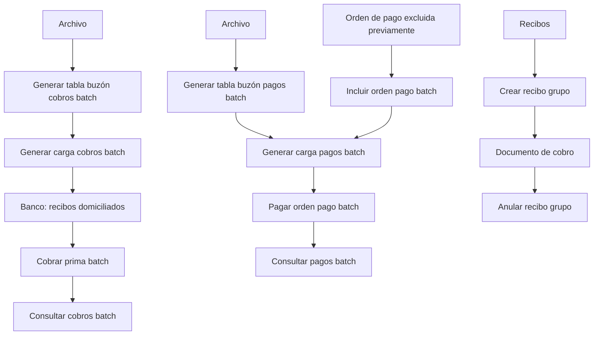

# Certificación Tesorería Nivel 3 — Operações de Cobros e Pagos Batch no Reef

## 1. Metadados do Documento
- **Arquivo de Origem:** Não identificado; conteúdo extraído de “DOCUMENTACIÓN Reef / Mapfredocument”
- **Tipo de Documento:** Manual Operacional
- **Domínio / Sistema:** Tesorería / Reef / Mapfre
- **Público-Alvo:** Operação, Negócio, Analistas Funcionais e Desenvolvedores
- **Data/Versão Identificada:** Não identificada
- **Proprietário Identificado:** `user:agonzalez_mapfre.com`
- **Lifecycle Identificado:** `Approved Source / VL`

---

## 2. Resumo Executivo & Contexto de Negócio

O documento apresenta operações de Tesorería de nível 3 relacionadas à gestão de recibos, cobranças, pagamentos, cheques, transferências, remessas e processamento massivo (*batch*). O conteúdo está disponibilizado no contexto da documentação Reef/Mapfredocument.

As operações de cobrança incluem agrupamento e desagrupamento de recibos, criação de antecipação de cobrança, geração de movimentos de cobranças e pagamentos de remessas, além da preparação, execução e consulta de cobranças em processos massivos.

As operações de pagamento incluem anulação de ordens de pagamento, alteração da oficina de pagamento, gestão de cheques danificados — antes ou durante a impressão —, impressão de cheques e preparação, inclusão, execução e consulta de pagamentos em processos massivos.

O documento evidencia uma separação operacional entre a preparação de informações para processos *batch*, normalmente baseada em arquivos, a execução efetiva das cobranças ou pagamentos e a consulta posterior do estado dos processos por critérios de busca.

---

## 3. Arquitetura, Componentes & Tecnologias Envolvidas

| Componente / Termo | Papel identificado no documento |
| :--- | :--- |
| **Reef** | Contexto de documentação no qual o conteúdo de Tesorería está publicado. |
| **Mapfredocument** | Identificação exibida na documentação de origem. |
| **Tesorería** | Domínio responsável pelas operações de recibos, cobranças, pagamentos, cheques, transferências e remessas. |
| **Proceso masivo / Batch** | Processo para preparar, executar e consultar cobranças ou pagamentos em lote. |
| **Archivo** | Fonte de dados utilizada para preparar informações de recibos a cobrar e ordens de pagamento em processos massivos. |
| **Banco** | Destino associado aos recibos domiciliados enviados para cobrança no processo massivo. |
| **Cuenta de prima en depósito** | Conta utilizada para registrar antecipação de cobrança até ocorrer a cobrança do recibo da apólice. |
| **Documento de cobro** | Documento que pode reunir recibos para gestão conjunta. |
| **Orden de pago** | Entidade utilizada nas operações de pagamento, anulação, alteração de oficina, inclusão em lote e execução de pagamento. |
| **Cheque** | Meio de pagamento sujeito a impressão, anulação e registro de dano. |
| **Transferencia** | Meio de pagamento que pode ser anulado, com ou sem reexpedição. |
| **Remesas de coaseguro y reaseguro** | Remessas para as quais pode ser registrado abono ou cargo. |



**Nota de Análise:** o documento não detalha tecnologias de implementação, interfaces, métodos HTTP, contratos JSON, bancos de dados, URLs de ambiente, servidores, autenticação ou integrações técnicas entre Reef e os processos de Tesorería.

---

## 4. Regras de Negócio, Especificações Funcionais & Processos

### 4.1 Gestão de recibos agrupados

1. **CREAR recibo grupo**
   - Agrupa recibos em um único documento de cobrança.
   - Permite a gestão conjunta dos recibos agrupados.
   - Os recibos podem pertencer a:
     - Uma apólice de grupo;
     - Várias apólices individuais;
     - Um tomador;
     - Outros contextos não detalhados no documento.

2. **ANULAR recibo grupo**
   - É o movimento oposto à operação **CREAR recibo grupo**.
   - Desagrupa os recibos que haviam sido associados a um documento de cobrança.

### 4.2 Antecipação de cobrança

1. **CREAR anticipo cobro**
   - Realiza a cobrança de um valor em uma conta de prêmio em depósito.
   - O valor permanece nessa conta até que ocorra a cobrança do recibo da apólice.

### 4.3 Anulação e alteração de ordens de pagamento

1. **ANULAR orden pago cheque transferencia**
   - Anula cheques ou transferências por pagamentos.
   - A anulação pode ocorrer com ou sem reexpedição.

2. **ANULAR orden pago otra forma pago**
   - Anula ordens de pagamento pagas por:
     - Conta de gestão;
     - Banco em dinheiro;
     - Caixa em dinheiro.

3. **CAMBIAR oficina orden pago**
   - Modifica a oficina de pagamento de uma ordem de pagamento.

### 4.4 Gestão e impressão de cheques

1. **MODIFICAR cheque dañado impreso**
   - Registra um cheque de pagamento deteriorado no momento da impressão.

2. **MODIFICAR cheque manual dañado**
   - Registra um cheque de pagamento deteriorado antes da impressão.

3. **IMPRIMIR cheque**
   - Imprime cheques para realização de pagamentos.

### 4.5 Cobranças e pagamentos de remessas

1. **GENERAR cobro pago remesa**
   - Registra o abono ou o cargo relativo às remessas de cosseguro e resseguro.

### 4.6 Processo massivo de cobranças

1. **GENERAR tabla buzón cobros batch**
   - Prepara as informações dos recibos a cobrar em um processo massivo.
   - Utiliza os dados provenientes de um arquivo.

2. **GENERAR carga cobros batch**
   - Prepara as informações dos recibos domiciliados.
   - Os recibos domiciliados preparados serão enviados ao banco para cobrança no processo massivo.

3. **COBRAR prima batch**
   - Executa o processo massivo de cobrança.
   - Realiza a cobrança dos recibos incluídos no processo.

4. **CONSULTAR cobros batch**
   - Mostra o estado das cobranças dentro de um processo massivo.
   - Permite consulta por diferentes critérios de busca.

### 4.7 Processo massivo de pagamentos

1. **GENERAR Tabla buzón pagos batch**
   - Prepara as informações das ordens de pagamento a pagar em um processo massivo.
   - Utiliza os dados provenientes de um arquivo.

2. **GENERAR carga pagos batch**
   - Prepara as informações das ordens de pagamento que serão pagas pelo processo massivo.

3. **INCLUIR orden pago batch**
   - Inclui no processo massivo de pagamentos uma ordem de pagamento que havia sido excluída anteriormente.

4. **PAGAR orden pago batch**
   - Executa o pagamento das ordens de pagamento presentes no processo.

5. **CONSULTAR pagos batch**
   - Mostra o estado dos pagamentos dentro de um processo massivo.
   - Permite consulta por diferentes critérios de busca.

---

## 5. Tabelas de Parâmetros, Ambientes e Estruturas de Dados

| Item / Parâmetro | Descrição / Função | Tipo / Valores / Formato | Ambiente / Observações |
| :--- | :--- | :--- | :--- |
| Recibo | Item sujeito a agrupamento, cobrança individual ou cobrança em lote. | Recibo de apólice grupo, várias apólices individuais ou tomador. | O documento não informa estrutura de dados. |
| Documento de cobro | Documento que reúne recibos para gestão conjunta. | Documento de cobrança. | Criado por `CREAR recibo grupo`; desfeito por `ANULAR recibo grupo`. |
| Anticipo cobro | Cobrança antecipada de um valor. | Importe. | Registrado em conta de prêmio em depósito até a cobrança do recibo da apólice. |
| Cuenta de prima en depósito | Conta utilizada no fluxo de antecipação de cobrança. | Conta. | Sem detalhes de identificador, moeda ou regras contábeis. |
| Orden de pago | Ordem tratada em operações de anulação, alteração, inclusão e pagamento. | Ordem de pagamento. | Pode participar de processo massivo de pagamentos. |
| Cheque | Meio de pagamento impresso, anulado ou marcado como danificado. | Cheque de pagamento. | O documento distingue cheque danificado antes e durante a impressão. |
| Transferencia | Meio de pagamento sujeito à anulação. | Transferência por pagamento. | A anulação pode ocorrer com ou sem reexpedição. |
| Oficina de pago | Oficina associada a uma ordem de pagamento. | Oficina. | Pode ser modificada por `CAMBIAR oficina orden pago`. |
| Remesa | Item associado a cosseguro e resseguro. | Remessa. | Permite registro de abono ou cargo. |
| Archivo | Origem dos dados para preparação de processos massivos. | Arquivo não especificado. | Formato, localização e validações não detalhados. |
| Recibos domiciliados | Recibos preparados para envio ao banco em processo massivo. | Recibos domiciliados. | Utilizados em `GENERAR carga cobros batch`. |
| Banco | Entidade para a qual os recibos domiciliados são enviados. | Banco. | Não foram informados banco, conta, canal ou protocolo. |
| Estado de cobros batch | Situação das cobranças no processo massivo. | Estado não especificado. | Consultado por critérios de busca. |
| Estado de pagos batch | Situação dos pagamentos no processo massivo. | Estado não especificado. | Consultado por critérios de busca. |

---

## 6. Bateria de Perguntas & Respostas para RAG (FAQ Sintético)

### P1: O que faz a operação CREAR recibo grupo em Tesorería?
**R:** A operação `CREAR recibo grupo` agrupa recibos em um único documento de cobrança para permitir a gestão conjunta. Os recibos podem ser de uma apólice de grupo, de várias apólices individuais ou de um tomador.

### P2: Como desfazer um agrupamento de recibos em um documento de cobrança?
**R:** A operação `ANULAR recibo grupo` é o movimento oposto a `CREAR recibo grupo`. Ela desagrupa os recibos que tinham sido associados a um documento de cobrança.

### P3: Qual é a finalidade de CREAR anticipo cobro?
**R:** `CREAR anticipo cobro` realiza a cobrança de um valor em uma conta de prêmio em depósito. O valor permanece nessa conta até que seja realizada a cobrança do recibo da apólice.

### P4: Quais meios de pagamento podem ser anulados por ANULAR orden pago cheque transferencia?
**R:** `ANULAR orden pago cheque transferencia` permite anular cheques ou transferências por pagamentos. O documento informa que a anulação pode ocorrer com ou sem reexpedição.

### P5: Em quais situações ANULAR orden pago otra forma pago é utilizada?
**R:** `ANULAR orden pago otra forma pago` é utilizada para anular ordens de pagamento que foram pagas por uma conta de gestão, por banco em dinheiro ou por caixa em dinheiro.

### P6: Qual é a diferença entre MODIFICAR cheque dañado impreso e MODIFICAR cheque manual dañado?
**R:** `MODIFICAR cheque dañado impreso` registra um cheque de pagamento deteriorado no momento da impressão. `MODIFICAR cheque manual dañado` registra um cheque de pagamento deteriorado antes da impressão.

### P7: Como é preparada uma cobrança massiva de recibos?
**R:** A preparação começa com `GENERAR tabla buzón cobros batch`, que prepara as informações dos recibos a cobrar a partir dos dados de um arquivo. Em seguida, `GENERAR carga cobros batch` prepara os recibos domiciliados que serão enviados ao banco para cobrança no processo massivo.

### P8: Qual operação executa efetivamente a cobrança de recibos em lote?
**R:** `COBRAR prima batch` executa o processo massivo que realiza a cobrança dos recibos incluídos no processo.

### P9: Como consultar o resultado de um processo massivo de cobranças?
**R:** `CONSULTAR cobros batch` mostra o estado das cobranças dentro de um processo massivo e permite realizar a consulta por diferentes critérios de busca. Os critérios específicos não são detalhados no documento.

### P10: Como uma ordem de pagamento previamente excluída pode retornar ao processo massivo?
**R:** A operação `INCLUIR orden pago batch` permite incluir no processo massivo de pagamentos uma ordem de pagamento que havia sido excluída previamente.

### P11: Quais são as etapas documentadas para pagamentos massivos?
**R:** O fluxo documentado inclui `GENERAR Tabla buzón pagos batch`, que prepara informações a partir de um arquivo; `GENERAR carga pagos batch`, que prepara as ordens a serem pagas; `INCLUIR orden pago batch`, quando uma ordem anteriormente excluída precisa ser reincluída; `PAGAR orden pago batch`, que executa os pagamentos; e `CONSULTAR pagos batch`, que apresenta o estado dos pagamentos.

### P12: O que é registrado por GENERAR cobro pago remesa?
**R:** `GENERAR cobro pago remesa` registra o abono ou o cargo relacionado às remessas de cosseguro e resseguro.

---

## 7. Glossário de Termos, Siglas & Conceitos-Chave

- **Batch / Proceso masivo:** Processo executado em lote para preparar, executar e consultar cobranças ou pagamentos.
- **Cobro:** Cobrança.
- **Cuenta de prima en depósito:** Conta de prêmio em depósito utilizada para antecipação de cobrança.
- **Documento de cobro:** Documento que agrupa recibos para gestão conjunta.
- **Oficina de pago:** Oficina de pagamento associada a uma ordem de pagamento.
- **Orden de pago:** Ordem de pagamento tratada nas operações de pagamento e processos massivos.
- **Pago:** Pagamento.
- **Prima:** Prêmio associado ao recibo de uma apólice.
- **Recibo:** Item de cobrança associado a apólice, tomador ou documento de cobrança.
- **Recibo domiciliado:** Recibo preparado para envio ao banco para cobrança massiva.
- **Reaseguro:** Resseguro.
- **Reexpedición:** Reemissão ou reexpedição mencionada no contexto da anulação de cheque ou transferência.
- **Remesa:** Remessa associada a operações de cosseguro e resseguro.
- **Tesorería:** Domínio de tesouraria responsável pelas operações descritas.
- **VL:** Sigla exibida no campo de ciclo de vida como `Approved Source / VL`; o significado não é detalhado.
- **Reef:** Nome exibido na documentação de origem; o documento não define tecnicamente o termo.

---

## 8. Notas Críticas, Riscos & Limitações

- O conteúdo é uma listagem operacional resumida e não descreve contratos técnicos, APIs, métodos HTTP, formatos de arquivo, esquemas de dados, URLs, servidores ou mecanismos de autenticação.
- O documento menciona arquivos como fonte para preparação de cobranças e pagamentos massivos, mas não especifica formato, layout, validações, local de armazenamento ou tratamento de erros.
- Os estados exibidos por `CONSULTAR cobros batch` e `CONSULTAR pagos batch` não são enumerados.
- Os critérios de busca disponíveis nas consultas de cobranças e pagamentos *batch* não são detalhados.
- A relação técnica entre Reef, Mapfredocument e as operações de Tesorería não é explicada.
- Não há detalhamento sobre regras de autorização, segregação de funções, trilha de auditoria, reversão, conciliação ou tratamento de falhas.
- **Nota de Análise:** o documento cita a operação `GENERAR Tabla buzón pagos batch`, mas não apresenta detalhes sobre o conteúdo da tabela, campos, formato de arquivo ou mecanismo de carga.
- **Nota de Análise:** o texto extraído contém fragmentação entre páginas e caracteres corrompidos em “oficina”; a interpretação foi preservada apenas onde o significado está sustentado pelo contexto textual.

---

## 9. Conteúdo Bruto Estruturado (Referência Fiel)

```text
--- [PÁGINA 1 DE 2] ---

CERTIFICACIÓN Tesorería nivel 3
CREAR recibo grupo
Se trata de agrupar recibos en un solo
documento de cobro permitiendo su
gestión conjunta, pudiendo ser recibos de
una póliza grupo, de varias pólizas
individuales, de un tomador, etc.
ANULAR recibo grupo
Es el movimiento opuesto a CREAR recibo
grupo, ya que consiste en desagrupar los
recibos que se han asociado a un
documento de cobro
CREAR anticipo cobro
Realiza el cobro de un importe a una
cuenta de prima en depósito hasta que se
haga el cobro del recibo de la póliza
ANULAR orden pago cheque
transferencia
Se trata de la anulación de cheques o
transferencias por pagos, con o sin
reexpedición
ANULAR orden pago otra forma pago
Consiste en la anulación de órdenes de
pago pagadas por una cuenta de gestión,
banco en efectivo o caja en efectivo
CAMBIAR ocina orden pago
Operación para modicar la ocina de
pago de una orden de pago
MODIFICAR cheque dañado impreso
Consiste en registrar un cheque de pago
deteriorado en el momento de la
impresión
MODIFICAR cheque manual dañado
Se trata de registrar un cheque de pago
deteriorado antes de su impresión
IMPRIMIR cheque
Por esta operación se imprimen los
cheques para realizar pagos
GENERAR cobro pago remesa
Operación que permite registrar el abono o
el cargo por las remesas de coaseguro y
reaseguro
GENERAR tabla buzón cobros batch
Preparara la información de los recibos a
cobrar en un proceso masivo, tomando los
datos de un archivo
GENERAR carga cobros batch
Prepara la información de los recibos
domiciliados que van a ser enviados al
banco para que se cobren por el proceso
masivo
COBRAR prima batch
Consiste en la ejecución del proceso
masivo por el que se realiza el cobro de
CONSULTAR cobros batch
Muestra el estado de los cobros dentro de
un proceso masivo por diferentes criterios
Documentation / DOCUMENTACIÓN Reef
DOCUMENTACIÓN Reef
Mapfredocument
DOCUMENTACIÓN Reef
Owner
user:agonzalez_mapfre.com
Lifecycle
Approved Source
 / 
 VL
Buscar Inicio Soluciones Arquitecturas APIs Componentes Cloud Documentación Zeus Reef Ayuda
ES

--- [PÁGINA 2 DE 2] ---

los recibos que estén incluidos en dicho
proceso
de búsqueda
 proceso masivo, tomando los datos de un
archivo
GENERAR carga pagos batch
Prepara la información de las órdenes de
pago que se pagarán por el proceso
masivo
INCLUIR orden pago batch
Permite incluir en el proceso masivo de
pagos una orden de pago excluida
previamente
PAGAR orden pago batch
Ejecuta el pago de las órdenes de pago
que están en el proceso
CONSULTAR pagos batch
Muestra el estado de los pagos dentro de
un proceso masivo por diferentes criterios
de búsqueda
```
