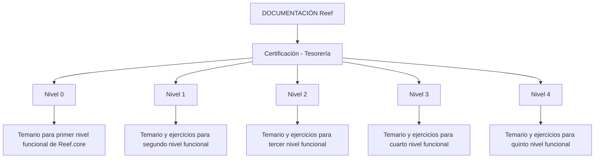
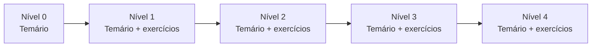

# Certificación Funcional de Tesorería en Reef.core

## 1. Metadados do Documento
- **Arquivo de Origem:** Não identificado no conteúdo fornecido
- **Tipo de Documento:** Procedimento / Material de certificação funcional
- **Domínio / Sistema:** Tesorería / Reef.core / Mapfre
- **Público-Alvo:** Profissionais que buscam certificação funcional em Reef.core
- **Data/Versão Identificada:** Não identificada

---

## 2. Resumo Executivo & Contexto de Negócio

O documento apresenta a estrutura de certificação de Tesorería associada ao sistema Reef.core. A certificação está organizada em cinco níveis, do nível 0 ao nível 4, descritos como progressivos dentro de uma trilha de certificação funcional.

O nível 0 é apresentado como o primeiro nível de certificação funcional de Reef.core e requer o conhecimento de um temário específico. Os níveis 1, 2, 3 e 4 também exigem temário e exercícios, correspondendo respectivamente ao segundo, terceiro, quarto e quinto níveis de certificação funcional.

O conteúdo aparenta estar publicado em uma área de documentação chamada “DOCUMENTACIÓN Reef”, no contexto “Mapfredocument”. A interface textual extraída também indica navegação corporativa para áreas como Soluciones, Arquitecturas, APIs, Componentes, Cloud, Documentación, Zeus e Reef.

O documento não detalha os conteúdos programáticos, critérios de aprovação, duração, responsáveis acadêmicos, formato dos exercícios ou mecanismos de avaliação de cada nível. A informação disponível limita-se à existência da trilha e aos requisitos gerais de temário e, a partir do nível 1, exercícios.

---

## 3. Arquitetura, Componentes & Tecnologias Envolvidas

Os elementos identificados são:

| Componente / Termo | Papel identificado |
| :--- | :--- |
| Tesorería | Domínio da certificação apresentada |
| Reef.core | Sistema ou produto para o qual a certificação funcional é direcionada |
| DOCUMENTACIÓN Reef | Área de documentação onde o conteúdo está disponível |
| Mapfredocument | Contexto, plataforma ou identificação exibida na extração |
| Zeus | Área de navegação citada na interface |
| Owner `user:agonzalez_mapfre.com` | Identificação de proprietário exibida no conteúdo |
| Lifecycle `Approved Source` | Estado de ciclo de vida exibido no conteúdo |
| VL | Valor ou identificação exibida junto ao ciclo de vida; sem detalhamento adicional |



> **Nota de Análise:** O documento não descreve arquitetura de software, integrações, APIs, ambientes, tecnologias de implementação ou fluxos técnicos entre componentes.

---

## 4. Regras de Negócio, Especificações Funcionais & Processos

### Estrutura da trilha de certificação

1. A certificação é denominada **CERTIFICACIÓN - TESORERÍA**.
2. Existem cinco níveis identificados: **Nível 0**, **Nível 1**, **Nível 2**, **Nível 3** e **Nível 4**.
3. Cada nível possui um temário que deve ser conhecido para obtenção da certificação funcional correspondente.
4. O **Nível 0** é descrito como o primeiro nível de certificação funcional de Reef.core.
5. O **Nível 1** requer temário e exercícios para obtenção do segundo nível de certificação funcional de Reef.core.
6. O **Nível 2** requer temário e exercícios para obtenção do terceiro nível de certificação funcional de Reef.core.
7. O **Nível 3** requer temário e exercícios para obtenção do quarto nível de certificação funcional de Reef.core.
8. O **Nível 4** requer temário e exercícios para obtenção do quinto nível de certificação funcional de Reef.core.

### Fluxo de progressão identificado



> **Nota de Análise:** O texto estabelece uma sequência ordinal entre os níveis, mas não declara explicitamente que a aprovação em um nível é pré-requisito formal para iniciar o próximo.

---

## 5. Tabelas de Parâmetros, Ambientes e Estruturas de Dados

| Item / Parâmetro | Descrição / Função | Tipo / Valores / Formato | Ambiente / Observações |
| :--- | :--- | :--- | :--- |
| Certificação | Trilha de certificação de Tesorería | `CERTIFICACIÓN - TESORERÍA` | Relacionada a Reef.core |
| Nível 0 | Primeiro nível de certificação funcional | Temário | Não há menção a exercícios |
| Nível 1 | Segundo nível de certificação funcional | Temário + exercícios | Associado a Reef.core |
| Nível 2 | Terceiro nível de certificação funcional | Temário + exercícios | Associado a Reef.core |
| Nível 3 | Quarto nível de certificação funcional | Temário + exercícios | Associado a Reef.core |
| Nível 4 | Quinto nível de certificação funcional | Temário + exercícios | Associado a Reef.core |
| Área documental | Local de documentação identificado | `DOCUMENTACIÓN Reef` | Também aparece como `Documentation / DOCUMENTACIÓN Reef` |
| Contexto exibido | Identificação textual exibida | `Mapfredocument` | Sem explicação adicional |
| Owner | Proprietário exibido na extração | `user:agonzalez_mapfre.com` | Não há atribuições detalhadas |
| Lifecycle | Estado de ciclo de vida exibido | `Approved Source` | Sem definição adicional |
| Valor associado | Texto exibido próximo ao lifecycle | `VL` | Significado não identificado |
| Idioma | Idioma apresentado na interface | `ES` | Conteúdo principal em espanhol |

---

## 6. Bateria de Perguntas & Respostas para RAG (FAQ Sintético)

### P1: Qual é o objetivo da certificação de Tesorería apresentada no documento?
**R:** O documento apresenta uma trilha de certificação funcional de Tesorería para Reef.core, estruturada em cinco níveis: nível 0, nível 1, nível 2, nível 3 e nível 4.

### P2: Quantos níveis existem na certificação funcional de Reef.core para Tesorería?
**R:** A certificação possui cinco níveis: nível 0, nível 1, nível 2, nível 3 e nível 4. Esses níveis são descritos como primeiro, segundo, terceiro, quarto e quinto níveis de certificação funcional de Reef.core.

### P3: O que é necessário para obter a certificação de nível 0?
**R:** Para obter o primeiro nível de certificação funcional de Reef.core, o documento informa que é necessário conhecer o temário correspondente ao nível 0. O texto não menciona exercícios para esse nível.

### P4: O nível 1 da certificação de Tesorería exige exercícios?
**R:** Sim. O documento declara que, para obter o segundo nível de certificação funcional de Reef.core, é necessário conhecer o temário e realizar exercícios.

### P5: Quais níveis incluem temário e exercícios?
**R:** Os níveis 1, 2, 3 e 4 incluem temário e exercícios. O nível 0 menciona apenas o temário necessário para o primeiro nível de certificação funcional.

### P6: O documento detalha o conteúdo programático de cada nível de certificação?
**R:** Não. O documento informa a existência de temários para todos os níveis e de exercícios nos níveis 1 a 4, mas não descreve os assuntos, módulos, critérios de avaliação ou exercícios específicos.

### P7: Onde a documentação da certificação está identificada?
**R:** A extração identifica a área documental como “DOCUMENTACIÓN Reef”, também apresentada como “Documentation / DOCUMENTACIÓN Reef”. O termo “Mapfredocument” também aparece no conteúdo.

### P8: Quem é o proprietário indicado no conteúdo extraído?
**R:** O campo `Owner` apresenta o valor `user:agonzalez_mapfre.com`. O documento não descreve as responsabilidades desse proprietário.

### P9: Qual é o estado de ciclo de vida exibido para o documento?
**R:** O campo `Lifecycle` apresenta o valor `Approved Source`. O documento não define o significado operacional desse estado.

### P10: O documento descreve APIs, ambientes, servidores ou integrações de Reef.core?
**R:** Não. A extração não apresenta URLs, APIs, contratos, ambientes, servidores, portas, tecnologias de desenvolvimento ou integrações técnicas.

---

## 7. Glossário de Termos, Siglas & Conceitos-Chave

- **Tesorería:** Domínio ou área funcional da certificação apresentada.
- **Reef.core:** Sistema ou produto associado aos níveis de certificação funcional.
- **DOCUMENTACIÓN Reef:** Área documental identificada no conteúdo.
- **Mapfredocument:** Termo exibido no conteúdo; não há definição adicional.
- **Owner:** Campo que indica o proprietário do conteúdo, com o valor `user:agonzalez_mapfre.com`.
- **Lifecycle:** Campo de ciclo de vida do conteúdo, com o valor `Approved Source`.
- **VL:** Termo exibido junto ao campo de ciclo de vida; sem significado definido no documento.
- **Zeus:** Item presente na navegação da interface; sem explicação funcional no texto.

---

## 8. Notas Críticas, Riscos & Limitações

- O documento não detalha o temário de nenhum dos cinco níveis de certificação.
- O documento não define critérios de aprovação, notas mínimas, formato de avaliação ou evidências exigidas.
- O documento não especifica se a conclusão de um nível é pré-requisito formal para o nível subsequente.
- Não há informações sobre duração, modalidades de treinamento, instrutores, responsáveis, calendário ou materiais de apoio.
- Não há documentação de arquitetura técnica, APIs, ambientes, integrações, modelos de dados ou requisitos de acesso.
- O termo `VL` é apresentado sem definição.
- O texto contém caracteres de extração aparentemente corrompidos em palavras como `certicación`; a transcrição bruta foi preservada para auditoria.

---

## 9. Conteúdo Bruto Estruturado (Referência Fiel)

```text
--- [PÁGINA 1 DE 1] ---

CERTIFICACIÓN - TESORERÍA
 En este apartado se encuentran los temarios de cada uno de los niveles de certicación de tesorería.
CERTIFICACIÓN DE NIVEL 0
En este apartado se encuentra el temario
que se necesita conocer para obtener el
primer nivel de certicación funcional de
Reef.core
CERTIFICACIÓN DE NIVEL 1
En este apartado se encuentra el temario
que se necesita conocer junto con
ejercicios para obtener el segundo nivel de
certicación funcional de Reef.core
CERTIFICACIÓN DE NIVEL 2
En este apartado se encuentra el temario
que se necesita conocer junto con
ejercicios para obtener el tercer nivel de
certicación funcional de Reef.core
CERTIFICACIÓN DE NIVEL 3
En este apartado se encuentra el temario
que se necesita conocer junto con
ejercicios para obtener el cuarto nivel de
certicación funcional de Reef.core
CERTIFICACIÓN DE NIVEL 4
En este apartado se encuentra el temario
que se necesita conocer junto con
ejercicios para obtener el quinto nivel de
certicación funcional de Reef.core
Documentation / DOCUMENTACIÓN Reef
DOCUMENTACIÓN Reef
Mapfredocument
DOCUMENTACIÓN Reef
Owner
user:agonzalez_mapfre.com
Lifecycle
Approved Source
 / 
 VL
Buscar Inicio Soluciones Arquitecturas APIs Componentes Cloud Documentación Zeus Reef Ayuda
ES
```
