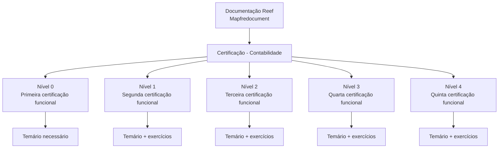

# Certificação de Contabilidade — Documentação Reef.core

## 1. Metadados do Documento
- **Arquivo de Origem:** Não identificado no conteúdo fornecido
- **Tipo de Documento:** Procedimento / Documentação de certificação funcional
- **Domínio / Sistema:** Reef.core — Contabilidade
- **Público-Alvo:** Profissionais que buscam certificação funcional de Reef.core
- **Data/Versão Identificada:** Não identificada

---

## 2. Resumo Executivo & Contexto de Negócio

O documento apresenta a estrutura de certificação de Contabilidade para o sistema Reef.core. A certificação está organizada em cinco níveis sequenciais, do Nível 0 ao Nível 4, correspondendo ao primeiro até o quinto nível de certificação funcional.

Cada nível descreve um temário necessário para a obtenção da respectiva certificação funcional. A partir do Nível 1, o material também menciona exercícios associados ao temário. O Nível 0 menciona somente o conhecimento do temário necessário.

O conteúdo está inserido na área de documentação Reef, identificada como “Mapfredocument”. O registro apresentado possui lifecycle “Approved Source” e indica `user:agonzalez_mapfre.com` como proprietário.

O documento não detalha os tópicos específicos dos temários, critérios de aprovação, formato dos exercícios, pré-requisitos entre níveis, duração, notas mínimas ou processo operacional de certificação.

---

## 3. Arquitetura, Componentes & Tecnologias Envolvidas

Os elementos identificados são:

| Componente / Elemento | Descrição |
| :--- | :--- |
| Reef.core | Sistema ou domínio funcional para o qual a certificação é oferecida. |
| Contabilidade | Área funcional coberta pelo percurso de certificação. |
| DOCUMENTACIÓN Reef | Área documental em que o conteúdo está publicado. |
| Mapfredocument | Identificação exibida no contexto da documentação. |
| Approved Source | Lifecycle exibido para o documento. |
| Owner | Campo de propriedade exibindo `user:agonzalez_mapfre.com`. |
| Níveis 0 a 4 | Estrutura progressiva de certificação funcional Reef.core. |



---

## 4. Regras de Negócio, Especificações Funcionais & Processos

1. A certificação está relacionada ao domínio de **Contabilidade** no contexto do Reef.core.
2. O percurso possui cinco níveis: Nível 0, Nível 1, Nível 2, Nível 3 e Nível 4.
3. O **Nível 0** corresponde ao primeiro nível de certificação funcional Reef.core.
4. O **Nível 1** corresponde ao segundo nível de certificação funcional Reef.core.
5. O **Nível 2** corresponde ao terceiro nível de certificação funcional Reef.core.
6. O **Nível 3** corresponde ao quarto nível de certificação funcional Reef.core.
7. O **Nível 4** corresponde ao quinto nível de certificação funcional Reef.core.
8. Para o Nível 0, o documento informa que é necessário conhecer o temário correspondente.
9. Para os Níveis 1, 2, 3 e 4, o documento informa que é necessário conhecer o temário e realizar exercícios.
10. O documento não apresenta conteúdos programáticos, exercícios, regras de correção, mecanismos de inscrição ou condições formais de progressão entre os níveis.

> **Nota de Análise:** O documento define a existência dos níveis e a necessidade de temário/exercícios, mas não detalha o conteúdo pedagógico, os requisitos de aprovação ou a sequência obrigatória de realização.

---

## 5. Tabelas de Parâmetros, Ambientes e Estruturas de Dados

| Item / Parâmetro | Descrição / Função | Tipo / Valores / Formato | Ambiente / Observações |
| :--- | :--- | :--- | :--- |
| Certificação de Contabilidade | Percurso de certificação funcional relacionado a Reef.core. | Estrutura de cinco níveis. | DOCUMENTACIÓN Reef |
| Nível 0 | Primeiro nível de certificação funcional Reef.core. | Temário necessário. | Não há exercícios mencionados. |
| Nível 1 | Segundo nível de certificação funcional Reef.core. | Temário e exercícios. | Conteúdo detalhado não apresentado. |
| Nível 2 | Terceiro nível de certificação funcional Reef.core. | Temário e exercícios. | Conteúdo detalhado não apresentado. |
| Nível 3 | Quarto nível de certificação funcional Reef.core. | Temário e exercícios. | Conteúdo detalhado não apresentado. |
| Nível 4 | Quinto nível de certificação funcional Reef.core. | Temário e exercícios. | Conteúdo detalhado não apresentado. |
| Owner | Proprietário exibido no registro documental. | `user:agonzalez_mapfre.com` | Campo exibido como Owner. |
| Lifecycle | Estado do documento no repositório. | `Approved Source` | Valor exibido no documento. |
| Fonte / Repositório | Identificação exibida para a documentação. | `Mapfredocument` | Não há detalhamento adicional. |
| Idioma da interface | Idioma indicado na navegação. | `ES` | O conteúdo está em espanhol. |

---

## 6. Bateria de Perguntas & Respostas para RAG (FAQ Sintético)

### P1: Qual é o objetivo da certificação de Contabilidade apresentada no documento?
**R:** A certificação de Contabilidade organiza o conhecimento necessário para obter níveis de certificação funcional do Reef.core. O documento descreve cinco níveis, do Nível 0 ao Nível 4.

### P2: Quantos níveis existem na certificação funcional de Reef.core para Contabilidade?
**R:** Existem cinco níveis: Nível 0, Nível 1, Nível 2, Nível 3 e Nível 4. Eles correspondem, respectivamente, ao primeiro, segundo, terceiro, quarto e quinto níveis de certificação funcional Reef.core.

### P3: O que é necessário para obter a certificação de Nível 0?
**R:** Para o Nível 0, o documento informa que é necessário conhecer o temário requerido para obter o primeiro nível de certificação funcional de Reef.core. Não há menção a exercícios para esse nível.

### P4: O Nível 1 da certificação Reef.core exige exercícios?
**R:** Sim. O Nível 1 requer o conhecimento do temário juntamente com exercícios para obter o segundo nível de certificação funcional de Reef.core.

### P5: Quais níveis incluem temário e exercícios?
**R:** Os níveis 1, 2, 3 e 4 incluem temário e exercícios. O Nível 0 menciona apenas o temário necessário.

### P6: Qual nível representa a terceira certificação funcional de Reef.core?
**R:** O Nível 2 representa o terceiro nível de certificação funcional de Reef.core e exige conhecimento do temário juntamente com exercícios.

### P7: Qual é o nível mais alto descrito no documento?
**R:** O nível mais alto descrito é o Nível 4. Ele é apresentado como o quinto nível de certificação funcional de Reef.core e requer temário e exercícios.

### P8: O documento informa os temas específicos ou critérios de aprovação para cada nível?
**R:** Não. O documento apenas informa que cada nível possui um temário e que os níveis 1 a 4 incluem exercícios. Não são apresentados os tópicos do temário, critérios de aprovação, pontuações ou formato dos exercícios.

### P9: Quem é o proprietário identificado na documentação?
**R:** O campo Owner apresenta `user:agonzalez_mapfre.com` como proprietário do conteúdo documental exibido.

### P10: Qual lifecycle está associado ao documento de certificação?
**R:** O lifecycle exibido é `Approved Source`.

---

## 7. Glossário de Termos, Siglas & Conceitos-Chave

- **Reef.core:** Sistema ou domínio funcional mencionado como objeto da certificação.
- **Certificação funcional:** Certificação relacionada ao conhecimento funcional do Reef.core.
- **Nível 0 a Nível 4:** Etapas da certificação funcional, do primeiro ao quinto nível.
- **Temário:** Conteúdo de estudo necessário para cada nível de certificação.
- **Exercícios:** Atividades mencionadas como parte dos níveis 1, 2, 3 e 4.
- **Owner:** Campo que identifica o proprietário do registro documental.
- **Lifecycle:** Campo que indica o estado do documento no repositório.
- **Approved Source:** Valor de lifecycle exibido para o documento.
- **DOCUMENTACIÓN Reef:** Área ou seção documental relacionada ao Reef.
- **Mapfredocument:** Identificação exibida no contexto documental.

---

## 8. Notas Críticas, Riscos & Limitações

- O documento não apresenta o conteúdo dos temários de nenhum nível.
- Não há exercícios detalhados, exemplos, respostas esperadas ou critérios de avaliação.
- Não são informados pré-requisitos formais entre níveis de certificação.
- O documento não especifica se os níveis devem ser concluídos sequencialmente.
- Não há informações sobre aprovação, duração, modalidade, responsáveis pela aplicação ou processo de inscrição.
- Não são fornecidos detalhes técnicos, arquiteturais, integrações, APIs, URLs, ambientes ou mecanismos operacionais do Reef.core.
- A identificação `VL`, exibida junto ao lifecycle, não possui explicação adicional no conteúdo fornecido.

---

## 9. Conteúdo Bruto Estruturado (Referência Fiel)

```text
--- [PÁGINA 1 DE 1] ---

CERTIFICACIÓN - CONTABILIDAD
 En este apartado se encuentran los temarios de cada uno de los niveles de certicación de contabilidad.
CERTIFICACIÓN DE NIVEL 0
En este apartado se encuentra el temario
que se necesita conocer para obtener el
primer nivel de certicación funcional de
Reef.core
CERTIFICACIÓN DE NIVEL 1
En este apartado se encuentra el temario
que se necesita conocer junto con
ejercicios para obtener el segundo nivel de
certicación funcional de Reef.core
CERTIFICACIÓN DE NIVEL 2
En este apartado se encuentra el temario
que se necesita conocer junto con
ejercicios para obtener el tercer nivel de
certicación funcional de Reef.core
CERTIFICACIÓN DE NIVEL 3
En este apartado se encuentra el temario
que se necesita conocer junto con
ejercicios para obtener el cuarto nivel de
certicación funcional de Reef.core
CERTIFICACIÓN DE NIVEL 4
En este apartado se encuentra el temario
que se necesita conocer junto con
ejercicios para obtener el quinto nivel de
certicación funcional de Reef.core
Documentation / DOCUMENTACIÓN Reef
DOCUMENTACIÓN Reef
Mapfredocument
DOCUMENTACIÓN Reef
Owner
user:agonzalez_mapfre.com
Lifecycle
Approved Source
 / 
 VL
Buscar Inicio Soluciones Arquitecturas APIs Componentes Cloud Documentación Zeus Reef Ayuda
ES
```
