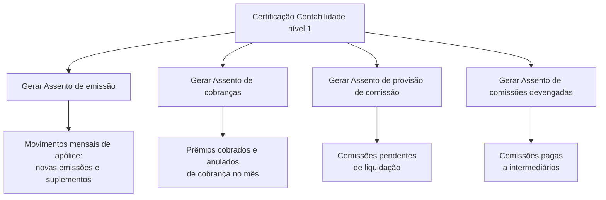

# Certificação Contabilidade Nível 1 — Processos de Geração de Assentos Contábeis no Reef

## 1. Metadados do Documento
- **Arquivo de Origem:** `Não identificado`
- **Tipo de Documento:** Procedimento
- **Domínio / Sistema:** Reef / Contabilidade
- **Público-Alvo:** Usuários responsáveis por processos contábeis e documentação Reef
- **Data/Versão Identificada:** Não identificada

---

## 2. Resumo Executivo & Contexto de Negócio

O conteúdo apresenta a certificação de **Contabilidad nivel 1**, descrevendo quatro processos de geração de assentos contábeis: emissão, cobranças, provisão de comissão e comissões devengadas.

O processo de geração de assento de emissão realiza a anotação contábil mensal dos movimentos de apólice relacionados a novas emissões e suplementos. O processo de geração de assento de cobranças registra contabilmente o valor dos prêmios cobrados e os anulados de cobrança ocorridos no mês.

A geração de assento de provisão de comissão corresponde ao registro contábil das comissões pendentes de liquidação. A geração de assento de comissões devengadas corresponde ao registro das comissões pagas a intermediários.

O conteúdo está associado à documentação Reef, classificada com ciclo de vida **Approved Source**, e indica `user:agonzalez_mapfre.com` como proprietário. Não há detalhamento adicional sobre interfaces, métodos de execução, integrações, regras de cálculo ou estruturas contábeis.

---

## 3. Arquitetura, Componentes & Tecnologias Envolvidas

Os elementos explicitamente citados são:

| Componente / Elemento | Papel identificado |
| :--- | :--- |
| Reef | Contexto de documentação associado aos processos. |
| Contabilidad nivel 1 | Certificação apresentada no conteúdo. |
| Gerar Assento de Emissão | Processo de anotação contábil mensal para novas emissões e suplementos. |
| Gerar Assento de Cobranças | Processo de anotação contábil para prêmios cobrados e anulados de cobrança no mês. |
| Gerar Assento de Provisão de Comissão | Processo de registro de comissões pendentes de liquidação. |
| Gerar Assento de Comissões Devengadas | Processo de registro de comissões pagas a intermediários. |
| Mapfredocument | Elemento listado na área de documentação Reef. |
| Zeus | Item disponível na navegação apresentada. |



---

## 4. Regras de Negócio, Especificações Funcionais & Processos

1. **Gerar Assento de Emissão**
   - Realiza anotação contábil mensal.
   - Abrange movimentos de apólice.
   - Considera novas emissões.
   - Considera suplementos.

2. **Gerar Assento de Cobranças**
   - Realiza anotação contábil pelo valor de prêmios cobrados.
   - Inclui anulados de cobrança.
   - O período indicado é o mês.

3. **Gerar Assento de Provisão de Comissão**
   - Gera anotação contábil referente a comissões.
   - Aplica-se a comissões pendentes de liquidação.

4. **Gerar Assento de Comissões Devengadas**
   - Corresponde à anotação contábil de comissões.
   - Aplica-se a comissões pagas a intermediários.

**Nota de Análise:** o conteúdo não detalha critérios de elegibilidade, datas de corte, contas contábeis, fórmulas de cálculo, exceções, aprovações, etapas operacionais, sistemas de origem ou destinos dos lançamentos.

---

## 5. Tabelas de Parâmetros, Ambientes e Estruturas de Dados

| Item / Parâmetro | Descrição / Função | Tipo / Valores / Formato | Ambiente / Observações |
| :--- | :--- | :--- | :--- |
| Certificação | Tema apresentado no documento | Contabilidad nivel 1 | Associada ao contexto de contabilidade. |
| Periodicidade do assento de emissão | Frequência da anotação de movimentos de apólice | Mensal | Aplicável a novas emissões e suplementos. |
| Movimentos de apólice | Movimentos contabilizados no assento de emissão | Novas emissões e suplementos | Não há detalhamento de campos ou origem. |
| Valores de cobrança | Valores contabilizados no assento de cobranças | Prêmios cobrados e anulados de cobrança | Referentes ao mês. |
| Provisão de comissão | Objeto do registro contábil | Comissões pendentes de liquidação | Não há regras de cálculo documentadas. |
| Comissões devengadas | Objeto do registro contábil | Comissões pagas a intermediários | O documento utiliza o termo “devengadas”. |
| Sistema / documentação | Contexto documental | Reef | Também aparece como “DOCUMENTACIÓN Reef”. |
| Proprietário | Identificação do owner da documentação | `user:agonzalez_mapfre.com` | Valor literal apresentado no conteúdo. |
| Ciclo de vida | Estado documental | Approved Source | Não há descrição do significado do status. |
| Navegação disponível | Itens apresentados na interface | Buscar, Inicio, Soluciones, Arquitecturas, APIs, Componentes, Cloud, Documentación, Zeus, Reef, Ayuda | Interface em idioma ES. |

---

## 6. Bateria de Perguntas & Respostas para RAG (FAQ Sintético)

### P1: O que faz o processo “Generar Asiento de emisión”?
**R:** O processo “Generar Asiento de emisión” realiza a anotação contábil mensal dos movimentos de apólice correspondentes a novas emissões e suplementos.

### P2: Qual é a periodicidade indicada para o assento de emissão?
**R:** A periodicidade indicada para a anotação contábil dos movimentos de apólice de novas emissões e suplementos é mensal.

### P3: Quais movimentos são considerados no assento de emissão?
**R:** O assento de emissão considera movimentos de apólice correspondentes a novas emissões e suplementos.

### P4: O que é registrado pelo processo “Generar Asiento de cobros”?
**R:** O processo “Generar Asiento de cobros” realiza a anotação contábil pelo valor das primas cobradas e dos anulados de cobrança no mês.

### P5: O assento de cobranças trata apenas de prêmios cobrados?
**R:** Não. Além dos valores de primas cobradas, o assento de cobranças também contempla anulados de cobrança ocorridos no mês.

### P6: Qual é a finalidade do assento de provisão de comissão?
**R:** O assento de provisão de comissão gera a anotação contábil correspondente às comissões pendentes de liquidação.

### P7: O que representa o assento de comissões devengadas?
**R:** O assento de comissões devengadas corresponde à anotação contábil das comissões pagas a intermediários.

### P8: Qual sistema ou domínio documental está associado ao conteúdo?
**R:** O conteúdo está associado à documentação Reef, apresentada como “DOCUMENTACIÓN Reef”.

### P9: Quem é o proprietário identificado na documentação?
**R:** O proprietário identificado no conteúdo é `user:agonzalez_mapfre.com`.

### P10: Qual ciclo de vida é apresentado para a documentação?
**R:** O ciclo de vida apresentado para a documentação é `Approved Source`.

---

## 7. Glossário de Termos, Siglas & Conceitos-Chave

- **Assento contábil:** Anotação contábil mencionada para processos de emissão, cobranças e comissões.
- **Cobros:** Cobranças; no conteúdo, relacionadas a primas cobradas e anulados de cobrança.
- **Comissões devengadas:** Termo apresentado para as comissões pagas a intermediários.
- **Emissão:** Processo relativo a movimentos de apólice de novas emissões e suplementos.
- **Intermediários:** Destinatários das comissões pagas, conforme o conteúdo.
- **Mapfredocument:** Elemento listado na documentação Reef; o documento não define sua função.
- **Primas:** Valores de prêmios cobrados mencionados no processo de cobranças.
- **Reef:** Contexto de documentação associado ao conteúdo.
- **Suplementos:** Movimentos de apólice considerados no assento de emissão.
- **Zeus:** Item listado na navegação; o documento não descreve sua função.

---

## 8. Notas Críticas, Riscos & Limitações

- O arquivo de origem, a data, a versão e o autor do documento não foram identificados no conteúdo fornecido.
- O conteúdo não apresenta contas contábeis, fórmulas, regras de cálculo, valores, moedas ou estruturas de lançamento.
- Não foram documentados endpoints, APIs, contratos JSON, métodos HTTP, jobs, integrações ou tecnologias de implementação.
- O documento não descreve procedimentos operacionais para executar, validar, aprovar, corrigir ou reprocessar os assentos.
- O significado operacional do status `Approved Source` não é explicado.
- O conteúdo lista `Mapfredocument` e `Zeus`, mas não detalha as respectivas funções ou relações com os processos contábeis.

---

## 9. Conteúdo Bruto Estruturado (Referência Fiel)

```text
--- [PÁGINA 1 DE 1] ---

CERTIFICACIÓN Contabilidad nivel 1
GENERAR Asiento de emisión
Realiza la anotación contable mensual de
movimientos de póliza correspondientes a
nuevas emisiones y suplementos
GENERAR Asiento de cobros
Realiza la anotación contable por el
importe de primas cobradas y anulados de
cobro en el mes
GENERAR Asiento de provisión de
comisión
Genera la anotación contable
correspondiente a las comisiones
pendientes de liquidar
GENERAR Asiento de comisiones
devengadas
Corresponde a la anotación contable de
las comisiones pagadas a intermediarios
Documentation / DOCUMENTACIÓN Reef
DOCUMENTACIÓN Reef
Mapfredocument
DOCUMENTACIÓN Reef
Owner
user:agonzalez_mapfre.com
Lifecycle
Approved Source
 /
 VL
Buscar Inicio Soluciones Arquitecturas APIs Componentes Cloud Documentación Zeus Reef Ayuda
ES
```
