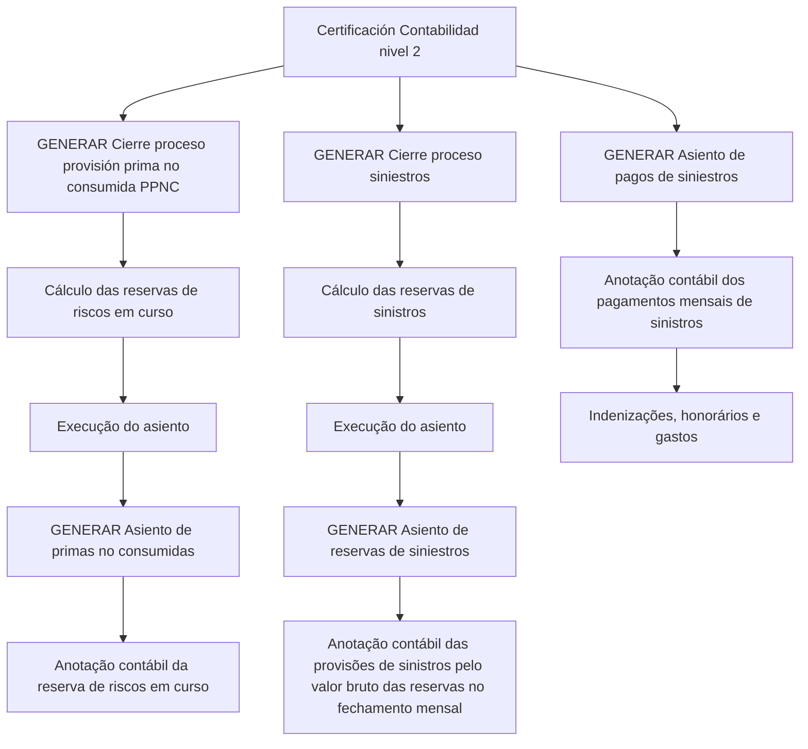

# Certificação Contábil Nível 2 — Processos de Provisões de Prêmios e Sinistros no Reef

## 1. Metadados do Documento
- **Arquivo de Origem:** Não identificado no conteúdo fornecido
- **Tipo de Documento:** Procedimento
- **Domínio / Sistema:** Reef / Contabilidade / Provisões de Prêmios e Sinistros
- **Público-Alvo:** Operação, Contabilidade e Negócio
- **Data/Versão Identificada:** Não identificada
- **Status identificado:** Approved Source
- **Owner identificado:** `user:agonzalez_mapfre.com`

---

## 2. Resumo Executivo & Contexto de Negócio

O documento apresenta processos de certificação de **Contabilidade nível 2** associados ao sistema ou domínio **Reef**. O conteúdo descreve atividades de geração de fechamentos e lançamentos contábeis relacionados a provisões de prêmios não consumidos e reservas de sinistros.

No processo de provisão de prima não consumida (PPNC), o documento diferencia o cálculo prévio da reserva de riscos em curso da geração do lançamento contábil correspondente. O fechamento calcula a reserva antes da execução do asiento, enquanto o processo de lançamento registra contabilmente essa reserva.

Para sinistros, o documento estabelece um fluxo equivalente: primeiro ocorre o cálculo das reservas de sinistros; depois, é gerado o lançamento contábil das provisões de sinistros pelo valor bruto das reservas no fechamento mensal. Há também um lançamento específico para pagamentos de sinistros realizados no mês.

O conteúdo não detalha tecnologias, contratos de integração, interfaces, critérios de cálculo, calendários operacionais, contas contábeis, valores, regras de arredondamento ou responsáveis pela execução dos processos.

---

## 3. Arquitetura, Componentes & Tecnologias Envolvidas

### Componentes e processos identificados

| Componente / Processo | Função identificada | Detalhamento disponível |
| :--- | :--- | :--- |
| Reef | Contexto de documentação e domínio citado no documento. | Não há descrição arquitetural adicional. |
| Certificación Contabilidad nivel 2 | Contexto de certificação associado aos processos contábeis listados. | Não há critérios de certificação descritos. |
| GENERAR Cierre proceso provisión prima no consumida (PPNC) | Calcula as reservas de riscos em curso antes da execução do lançamento. | Não são informadas fórmulas, entradas ou saídas. |
| GENERAR Asiento de primas no consumidas | Realiza o lançamento contábil da reserva de riscos em curso. | Não são informadas contas contábeis ou estrutura do lançamento. |
| GENERAR Cierre proceso siniestros | Calcula as reservas de sinistros antes da execução do lançamento. | Não são informadas regras de cálculo das reservas. |
| GENERAR Asiento de reservas de siniestros | Registra contabilmente provisões de sinistros pelo valor bruto das reservas ao fechamento do mês. | Não são informadas contas, eventos ou critérios adicionais. |
| GENERAR Asiento de pagos de siniestros | Registra contabilmente pagamentos de sinistros realizados no mês. | Abrange indenizações, honorários e gastos. |



> **Nota de Análise:** O documento não descreve uma arquitetura de software, servidores, microsserviços, APIs, bancos de dados, tecnologias, URLs ou integrações. O diagrama representa exclusivamente a sequência funcional explicitamente apresentada.

---

## 4. Regras de Negócio, Especificações Funcionais & Processos

### 4.1 Processo de provisão de prima não consumida (PPNC)

1. O processo **GENERAR Cierre proceso provisión prima no consumida (PPNC)** realiza o cálculo das reservas de riscos em curso.
2. O cálculo das reservas de riscos em curso ocorre antes da execução do lançamento contábil.
3. O processo **GENERAR Asiento de primas no consumidas** corresponde ao registro contábil da reserva de riscos em curso.

### 4.2 Processo de reservas de sinistros

1. O processo **GENERAR Cierre proceso siniestros** realiza o cálculo das reservas de sinistros.
2. O cálculo das reservas de sinistros ocorre antes da execução do lançamento contábil.
3. O processo **GENERAR Asiento de reservas de siniestros** realiza o lançamento contábil correspondente às provisões de sinistros.
4. O lançamento de reservas de sinistros é realizado pelo importe bruto das reservas no fechamento mensal.

### 4.3 Processo de pagamentos de sinistros

1. O processo **GENERAR Asiento de pagos de siniestros** corresponde ao lançamento contábil dos pagamentos de sinistros realizados no mês.
2. Os pagamentos de sinistros abrangem:
   - Indenizações;
   - Honorários;
   - Gastos.

> **Nota de Análise:** O documento não detalha fórmulas de cálculo, fontes de dados, condições de exceção, critérios de elegibilidade, contas contábeis, periodicidade além da referência ao fechamento mensal, nem mecanismos de aprovação ou reconciliação.

---

## 5. Tabelas de Parâmetros, Ambientes e Estruturas de Dados

| Item / Parâmetro | Descrição / Função | Tipo / Valores / Formato | Ambiente / Observações |
| :--- | :--- | :--- | :--- |
| PPNC | Provisão prima no consumida. | Sigla / processo contábil. | Associada ao cálculo de reservas de riscos em curso. |
| Reserva de riscos em curso | Reserva calculada antes da execução do lançamento de primas não consumidas. | Valor não especificado. | O documento não informa fórmula ou origem de dados. |
| Reserva de sinistros | Reserva calculada antes da execução do lançamento de reservas de sinistros. | Valor não especificado. | Associada ao fechamento de processo de sinistros. |
| Importe bruto das reservas | Base para a anotação contábil das provisões de sinistros. | Valor bruto; formato não especificado. | Referente ao fechamento de mês. |
| Indenizações | Categoria de pagamentos de sinistros registrada contabilmente. | Categoria de pagamento. | Realizadas no mês. |
| Honorários | Categoria de pagamentos de sinistros registrada contabilmente. | Categoria de pagamento. | Realizados no mês. |
| Gastos | Categoria de pagamentos de sinistros registrada contabilmente. | Categoria de pagamento. | Realizados no mês. |
| Owner | Proprietário identificado na documentação Reef. | `user:agonzalez_mapfre.com` | Valor literal extraído do conteúdo. |
| Lifecycle | Campo de ciclo de vida apresentado na documentação. | `Approved Source` | O documento não explica o significado operacional desse status. |
| Idioma | Idioma exibido na interface de documentação. | `ES` | Conteúdo principal apresentado em espanhol. |

---

## 6. Bateria de Perguntas & Respostas para RAG (FAQ Sintético)

### P1: Qual é a finalidade do processo “GENERAR Cierre proceso provisión prima no consumida (PPNC)”?
**R:** O processo “GENERAR Cierre proceso provisión prima no consumida (PPNC)” realiza o cálculo das reservas de riscos em curso antes da execução do lançamento contábil associado às primas não consumidas.

### P2: O que registra o processo “GENERAR Asiento de primas no consumidas”?
**R:** O processo “GENERAR Asiento de primas no consumidas” corresponde à anotação contábil da reserva de riscos em curso.

### P3: Qual é a sequência entre o fechamento de PPNC e o lançamento de primas não consumidas?
**R:** Primeiro, o processo de fechamento de provisão de prima não consumida calcula as reservas de riscos em curso. Depois, ocorre a execução do lançamento, representado pelo processo “GENERAR Asiento de primas no consumidas”.

### P4: Para que serve o processo “GENERAR Cierre proceso siniestros”?
**R:** O processo “GENERAR Cierre proceso siniestros” realiza o cálculo das reservas de sinistros antes da execução do lançamento contábil correspondente.

### P5: Como é realizado o lançamento contábil das reservas de sinistros?
**R:** O processo “GENERAR Asiento de reservas de siniestros” realiza a anotação contábil das provisões de sinistros pelo importe bruto das reservas no fechamento de mês.

### P6: Qual valor das reservas de sinistros é mencionado como base para o lançamento contábil?
**R:** O documento informa que o lançamento contábil das provisões de sinistros é realizado pelo importe bruto das reservas no fechamento mensal.

### P7: O que é registrado em “GENERAR Asiento de pagos de siniestros”?
**R:** O processo registra contabilmente pagamentos de sinistros realizados no mês, incluindo indenizações, honorários e gastos.

### P8: O documento define as fórmulas para calcular reservas de riscos em curso ou reservas de sinistros?
**R:** Não. O documento informa que os processos realizam cálculos de reservas, mas não apresenta fórmulas, parâmetros de entrada, regras de cálculo, fontes de dados ou critérios de validação.

### P9: O documento informa quais contas contábeis são utilizadas nos lançamentos?
**R:** Não. O conteúdo descreve a finalidade dos lançamentos contábeis, mas não identifica contas contábeis, débitos, créditos ou estruturas de partidas.

### P10: Qual sistema ou domínio é citado como contexto da documentação?
**R:** O conteúdo cita “Documentation / DOCUMENTACIÓN Reef” e “DOCUMENTACIÓN Reef”, identificando Reef como o contexto documental apresentado.

---

## 7. Glossário de Termos, Siglas & Conceitos-Chave

- **PPNC:** “Provisión prima no consumida”, expressão usada para o processo de provisão de prêmio não consumido.
- **Asiento:** Termo em espanhol usado no documento para indicar uma anotação ou lançamento contábil.
- **Reserva de riesgos en curso:** Reserva de riscos em curso calculada antes da execução do lançamento de primas não consumidas.
- **Reserva de siniestros:** Reserva de sinistros calculada antes da execução do lançamento contábil de provisões de sinistros.
- **Siniestros:** Sinistros; contexto associado a reservas e pagamentos contabilizados.
- **Importe bruto:** Valor bruto das reservas utilizado para a anotação contábil de provisões de sinistros no fechamento mensal.
- **Reef:** Nome citado no contexto de documentação; o documento não fornece expansão ou definição adicional.
- **Approved Source:** Status literal apresentado no campo Lifecycle; o significado operacional não é detalhado.

---

## 8. Notas Críticas, Riscos & Limitações

- O documento não identifica o arquivo de origem, data, versão, autores além do campo Owner, ou histórico de alterações.
- O documento não apresenta fórmulas, parâmetros de cálculo, critérios de validação ou fontes de dados para reservas de riscos em curso e reservas de sinistros.
- Não há identificação de contas contábeis, regras de débito/crédito, moeda, arredondamento, tratamento de erros ou reconciliação.
- Não são descritos APIs, interfaces, integrações, servidores, bancos de dados, URLs, tecnologias ou ambientes de execução.
- Não há detalhamento sobre a execução operacional dos processos, permissões necessárias, agenda de fechamento ou responsáveis por aprovação.
- A expressão “asiento” é usada no documento, mas não há contrato funcional ou estrutura técnica para os lançamentos.

---

## 9. Conteúdo Bruto Estruturado (Referência Fiel)

```text
--- [PÁGINA 1 DE 1] ---

CERTIFICACIÓN Contabilidad nivel 2
GENERAR Cierre proceso provisión prima
no consumida (PPNC)
Realiza el cálculo de las reservas de
riesgos en curso previo a la ejecución del
asiento
GENERAR Asiento de primas no
consumidas
Corresponde a la anotación contable de la
reserva de riesgos en curso
GENERAR Cierre proceso siniestros
Realiza el cálculo de las reservas de
siniestros previo a la ejecución del asiento
GENERAR Asiento de reservas de
siniestros
Realiza la anotación contable
correspondiente a provisiones de
siniestros por el importe bruto de las
reservas al cierre de mes
GENERAR Asiento de pagos de siniestros
Corresponde a la anotación contable de
pagos de siniestros realizados por
indemnizaciones, honorarios y gastos en
el mes.
Documentation / DOCUMENTACIÓN Reef
DOCUMENTACIÓN Reef
Mapfredocument
DOCUMENTACIÓN Reef
Owner
user:agonzalez_mapfre.com
Lifecycle
Approved Source
 / 
 VL
Buscar Inicio Soluciones Arquitecturas APIs Componentes Cloud Documentación Zeus Reef Ayuda
ES
```
