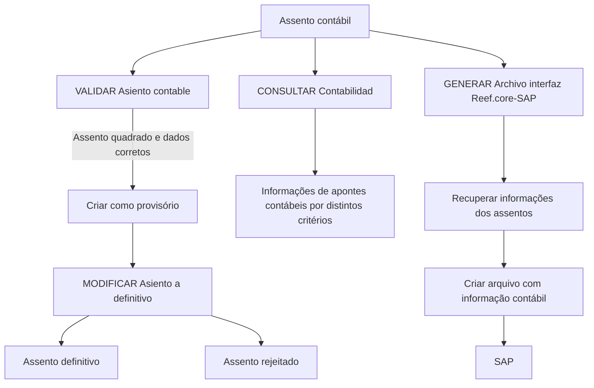

# Certificação Contabilidade Nível 3 — Operações de Assentos Contábeis e Interface Reef.core-SAP

## 1. Metadados do Documento
- **Arquivo de Origem:** Não identificado no conteúdo fornecido
- **Tipo de Documento:** Procedimento
- **Domínio / Sistema:** Contabilidade, Reef, Reef.core, SAP, Mapfredocument
- **Público-Alvo:** Negócio, Operação, Analistas Funcionais e Desenvolvedores
- **Data/Versão Identificada:** Não identificada

---

## 2. Resumo Executivo & Contexto de Negócio

O documento descreve operações de **Contabilidade nível 3** relacionadas ao ciclo de vida de assentos contábeis. O fluxo contempla a validação de assentos, a alteração de assentos provisórios para definitivos ou a sua rejeição, a consulta de apontes contábeis e a geração de um arquivo de interface para integração entre **Reef.core** e **SAP**.

A operação **VALIDAR Asiento contable** verifica se os assentos contábeis estão quadrados e se todos os dados estão corretos antes de serem criados como provisórios. A validação, portanto, é apresentada como uma condição anterior à criação de assentos provisórios.

A operação **MODIFICAR Asiento a definitivo** administra a transição de assentos provisórios. O documento informa que essa operação permite converter os assentos provisórios em definitivos ou rejeitá-los, sem detalhar critérios de aprovação, rejeição ou responsáveis pela decisão.

A operação **CONSULTAR Contabilidad** permite visualizar informações dos apontes contábeis por critérios distintos. A operação **GENERAR Archivo interfaz Reef.core-SAP** recupera informações dos assentos e cria um arquivo contendo informações contábeis para o SAP.

---

## 3. Arquitetura, Componentes & Tecnologias Envolvidas

Os elementos citados são:

- **Contabilidade nível 3:** Contexto funcional da certificação e das operações de assentos contábeis.
- **Assento contábil:** Entidade submetida à validação, criação provisória, alteração para definitivo ou rejeição.
- **Apontes contábeis:** Informações consultadas pela operação de consulta contábil.
- **Reef:** Sistema ou domínio referido na documentação.
- **Reef.core:** Origem ou componente associado à geração do arquivo de interface contábil.
- **SAP:** Destino do arquivo com informações contábeis.
- **Mapfredocument:** Repositório ou contexto documental mencionado no conteúdo.
- **Zeus:** Item listado na navegação da documentação, sem detalhamento funcional adicional.



> **Nota de Análise:** O conteúdo não especifica métodos HTTP, contratos JSON, tecnologias de implementação, formatos do arquivo de interface, periodicidade de geração, critérios de consulta ou ambientes técnicos.

---

## 4. Regras de Negócio, Especificações Funcionais & Processos

### 4.1 Validação de assentos contábeis

A operação **VALIDAR Asiento contable** possui as seguintes verificações explicitamente descritas:

1. Validar que os assentos contábeis estão **quadrados**.
2. Validar que **todos os dados** dos assentos contábeis estão corretos.
3. Criar os assentos contábeis como **provisórios** após a validação descrita.

> **Nota de Análise:** O documento não define o significado técnico ou contábil de “quadrados”, nem enumera os campos considerados na validação de dados.

### 4.2 Alteração de assento provisório

A operação **MODIFICAR Asiento a definitivo** permite:

1. Transformar assentos provisórios em assentos definitivos.
2. Rejeitar assentos provisórios.

> **Nota de Análise:** O documento não informa se um assento rejeitado pode ser corrigido, reprocessado, consultado ou novamente submetido à validação.

### 4.3 Consulta de contabilidade

A operação **CONSULTAR Contabilidad**:

1. Exibe informações dos apontes contábeis.
2. Permite a consulta por distintos critérios.

> **Nota de Análise:** O conteúdo não identifica quais critérios estão disponíveis, quais campos são exibidos ou quais permissões são necessárias para consultar apontes contábeis.

### 4.4 Geração da interface Reef.core-SAP

A operação **GENERAR Archivo interfaz Reef.core-SAP**:

1. Recupera informações dos assentos.
2. Cria um arquivo com informações contábeis.
3. Destina as informações contábeis para o **SAP**.

> **Nota de Análise:** O documento não informa o formato, a estrutura, o canal de entrega, a frequência ou o mecanismo de confirmação do arquivo de interface Reef.core-SAP.

---

## 5. Tabelas de Parâmetros, Ambientes e Estruturas de Dados

| Item / Parâmetro | Descrição / Função | Tipo / Valores / Formato | Ambiente / Observações |
| :--- | :--- | :--- | :--- |
| Certificação Contabilidade nível 3 | Contexto da certificação apresentada. | Não detalhado | Relacionado a operações contábeis. |
| VALIDAR Asiento contable | Valida se os assentos estão quadrados e se os dados estão corretos para criação provisória. | Operação | Não detalha regras de cálculo ou campos validados. |
| Assento provisório | Estado de criação do assento após a validação. | Estado do assento | Pode ser convertido em definitivo ou rejeitado. |
| MODIFICAR Asiento a definitivo | Permite converter assentos provisórios em definitivos ou rejeitá-los. | Operação | Não detalha critérios de transição. |
| Assento definitivo | Estado resultante da alteração de um assento provisório. | Estado do assento | Sem detalhamento adicional. |
| Assento rejeitado | Resultado alternativo da operação de modificação de assento provisório. | Estado do assento | Sem detalhamento adicional. |
| CONSULTAR Contabilidad | Mostra informações dos apontes contábeis por distintos critérios. | Operação | Critérios de consulta não identificados. |
| Apontes contábeis | Informações disponibilizadas pela operação de consulta contábil. | Dados contábeis | Estrutura não especificada. |
| GENERAR Archivo interfaz Reef.core-SAP | Recupera informações de assentos e gera arquivo contábil para SAP. | Operação | Formato do arquivo não especificado. |
| Reef.core | Componente ou sistema associado à interface de arquivo para SAP. | Sistema / componente | Não há arquitetura técnica detalhada. |
| SAP | Destino das informações contábeis do arquivo de interface. | Sistema | Não há detalhes de integração. |
| Mapfredocument | Nome citado no conteúdo documental. | Sistema ou repositório documental | Função não detalhada. |
| Owner | Identificação exibida no conteúdo documental. | Metadado documental | `user:agonzalez_mapfre.com` |
| Lifecycle | Metadado de ciclo de vida do documento. | Metadado documental | `Approved Source` |
| Idioma | Idioma exibido na navegação da documentação. | Configuração de interface | `ES` |

---

## 6. Bateria de Perguntas & Respostas para RAG (FAQ Sintético)

### P1: Qual é o objetivo da operação VALIDAR Asiento contable?
**R:** A operação VALIDAR Asiento contable valida que os assentos contábeis estão quadrados e que todos os dados estão corretos, permitindo que esses assentos sejam criados como provisórios.

### P2: Quais condições são verificadas antes de criar um assento como provisório?
**R:** O documento informa duas condições: o assento contábil deve estar quadrado e todos os seus dados devem estar corretos. Não são detalhados os campos, regras de cálculo ou critérios técnicos usados nessas verificações.

### P3: O que a operação MODIFICAR Asiento a definitivo permite fazer?
**R:** A operação MODIFICAR Asiento a definitivo permite passar assentos provisórios para definitivos ou rejeitar os assentos provisórios.

### P4: Um assento provisório pode ser rejeitado?
**R:** Sim. O documento declara que a operação MODIFICAR Asiento a definitivo permite converter assentos provisórios em definitivos ou rejeitá-los.

### P5: Quais informações a operação CONSULTAR Contabilidad apresenta?
**R:** A operação CONSULTAR Contabilidad mostra informações dos apontes contábeis por distintos critérios. O documento não especifica quais são esses critérios nem os campos exibidos.

### P6: Qual operação gera a interface entre Reef.core e SAP?
**R:** A operação GENERAR Archivo interfaz Reef.core-SAP recupera informações dos assentos e cria um arquivo com informações contábeis para SAP.

### P7: Qual é o destino das informações contábeis geradas pela interface Reef.core-SAP?
**R:** O destino explicitamente indicado para o arquivo com informações contábeis é o SAP.

### P8: O documento define o formato do arquivo da interface Reef.core-SAP?
**R:** Não. O documento somente afirma que a operação cria um arquivo com informação contábil para SAP; formato, layout, transporte e periodicidade não são descritos.

### P9: Quais são os estados de um assento contábil explicitamente mencionados?
**R:** O conteúdo menciona assentos provisórios, assentos definitivos e assentos rejeitados. A validação permite a criação de assentos como provisórios; posteriormente, eles podem ser convertidos em definitivos ou rejeitados.

### P10: O documento detalha os métodos HTTP ou contratos de integração de Reef.core com SAP?
**R:** Não. O documento menciona a geração de um arquivo de interface Reef.core-SAP, mas não detalha métodos HTTP, APIs, contratos JSON, protocolos ou mecanismos técnicos de integração.

---

## 7. Glossário de Termos, Siglas & Conceitos-Chave

- **Asiento contable:** Assento contábil submetido às operações de validação, criação provisória, alteração para definitivo ou rejeição.
- **Assento provisório:** Estado de um assento após a validação, antes de sua conversão em definitivo ou rejeição.
- **Assento definitivo:** Estado resultante da conversão de um assento provisório.
- **Apontes contábeis:** Informações contábeis exibidas pela operação CONSULTAR Contabilidad.
- **Reef:** Sistema ou domínio mencionado na documentação.
- **Reef.core:** Componente ou sistema associado à geração de arquivo de interface com SAP.
- **SAP:** Sistema destinatário das informações contábeis geradas pela interface.
- **Mapfredocument:** Nome citado como contexto ou repositório de documentação.
- **Zeus:** Item listado na navegação documental, sem definição adicional no conteúdo.
- **Lifecycle:** Metadado de ciclo de vida do documento, identificado como `Approved Source`.

---

## 8. Notas Críticas, Riscos & Limitações

- O conteúdo não identifica o nome do arquivo de origem, data, versão ou autoria documental completa.
- O documento não detalha os critérios técnicos ou contábeis para determinar se um assento está “quadrado”.
- Não há especificação dos dados obrigatórios, campos, regras de validação ou mensagens de erro relacionadas à operação VALIDAR Asiento contable.
- Os critérios para aprovar, converter em definitivo ou rejeitar um assento provisório não são apresentados.
- A operação CONSULTAR Contabilidad não informa filtros, permissões, estrutura dos apontes contábeis ou capacidade de exportação.
- A interface Reef.core-SAP não possui formato de arquivo, layout, protocolo, frequência, mecanismo de entrega, tratamento de falhas ou confirmação de recebimento descritos.
- Não são identificados ambientes, URLs, servidores, credenciais, logs, parâmetros de configuração ou contratos de API.

---

## 9. Conteúdo Bruto Estruturado (Referência Fiel)

```text
--- [PÁGINA 1 DE 1] ---

CERTIFICACIÓN Contabilidad nivel 3
VALIDAR Asiento contable
Proceso que valida que los asientos
contables están cuadrados y todos los
datos son correctos para crearlos como
provisionales
MODIFICAR Asiento a denitivo
Esta operación permite pasar los asientos
provisionales a denitivos o bien
rechazarlos
CONSULTAR Contabilidad
Muestra la información de los apuntes
contables por distintos criterios
GENERAR Archivo interfaz Reef.core-SAP
Recupera información de los asientos y
crea archivo con información contable
para SAP
Documentation / DOCUMENTACIÓN Reef
DOCUMENTACIÓN Reef
Mapfredocument
DOCUMENTACIÓN Reef
Owner
user:agonzalez_mapfre.com
Lifecycle
Approved Source
 / 
 VL
Buscar Inicio Soluciones Arquitecturas APIs Componentes Cloud Documentación Zeus Reef Ayuda
ES
```
