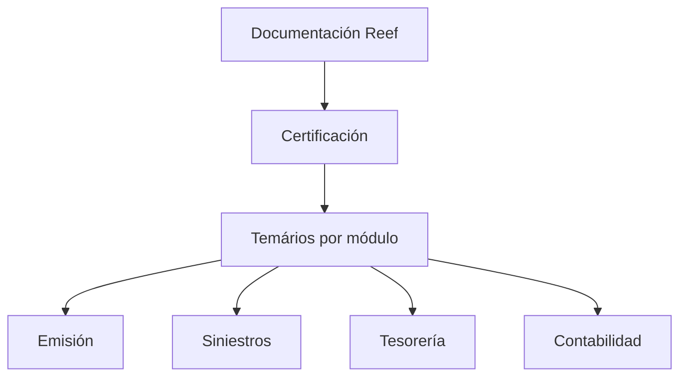

# Certificación — Documentación Reef: Temários por Módulo

## 1. Metadados do Documento
- **Arquivo de Origem:** Não identificado no conteúdo fornecido
- **Tipo de Documento:** Procedimento / Documentação corporativa
- **Domínio / Sistema:** Reef / Mapfre
- **Público-Alvo:** Usuários de documentação, certificação e treinamento
- **Data/Versão Identificada:** Não identificada

---

## 2. Resumo Executivo & Contexto de Negócio

O conteúdo apresenta uma seção denominada **“CERTIFICACIÓN”**, destinada a concentrar os temários dos diferentes níveis de certificação. Os temários são organizados por módulo, indicando uma estrutura de aprendizagem ou avaliação segmentada por áreas funcionais.

Os módulos explicitamente citados são **Emisión**, **Siniestros**, **Tesorería** e **Contabilidad**. O texto não detalha os níveis de certificação, os critérios de aprovação, a duração dos cursos, os responsáveis por cada módulo ou o conteúdo programático individual.

A documentação está associada ao domínio **Reef** e contém referências à navegação de uma plataforma documental Mapfre, incluindo áreas como Soluciones, Arquitecturas, APIs, Componentes, Cloud, Zeus e Reef. O conteúdo também identifica um proprietário documental.

O documento fornecido é predominantemente uma extração curta de interface e títulos. Portanto, não há evidência suficiente para descrever arquitetura técnica, fluxos operacionais, regras de negócio ou integrações.

---

## 3. Arquitetura, Componentes & Tecnologias Envolvidas

Sistemas, domínios e áreas citados:

| Componente / Termo | Contexto identificado |
| :--- | :--- |
| Reef | Domínio associado à documentação e à seção de certificação. |
| Mapfre | Organização ou contexto documental indicado por “Mapfredocument”. |
| Zeus | Item disponível na navegação documental. |
| Soluciones | Área de navegação da plataforma documental. |
| Arquitecturas | Área de navegação da plataforma documental. |
| APIs | Área de navegação da plataforma documental. |
| Componentes | Área de navegação da plataforma documental. |
| Cloud | Área de navegação da plataforma documental. |
| Ayuda | Área de ajuda da plataforma documental. |



**Nota de Análise:** O conteúdo não descreve componentes de software, microsserviços, protocolos, bancos de dados, APIs, ambientes ou relações técnicas entre Reef, Zeus e os demais itens de navegação.

---

## 4. Regras de Negócio, Especificações Funcionais & Processos

1. A seção **Certificación** contém os temários de cada nível de certificação.
2. Os temários são divididos por módulo.
3. Os módulos identificados são:
   - Emisión;
   - Siniestros;
   - Tesorería;
   - Contabilidad.
4. O conteúdo não especifica:
   - quais são os níveis de certificação;
   - os temas internos de cada módulo;
   - regras de elegibilidade;
   - critérios de avaliação ou aprovação;
   - sequência obrigatória entre módulos;
   - responsáveis pelos módulos;
   - processos de inscrição, emissão de certificado ou renovação.

---

## 5. Tabelas de Parâmetros, Ambientes e Estruturas de Dados

| Item / Parâmetro | Descrição / Função | Tipo / Valores / Formato | Ambiente / Observações |
| :--- | :--- | :--- | :--- |
| Certificación | Seção que reúne temários para níveis de certificação. | Seção documental | O texto não informa níveis nem critérios. |
| Temários | Conteúdo associado a cada nível de certificação. | Conteúdo documental | Dividido por módulo. |
| Emisión | Módulo de certificação citado. | Módulo | Sem detalhamento adicional. |
| Siniestros | Módulo de certificação citado. | Módulo | Sem detalhamento adicional. |
| Tesorería | Módulo de certificação citado. | Módulo | Sem detalhamento adicional. |
| Contabilidad | Módulo de certificação citado. | Módulo | Sem detalhamento adicional. |
| Owner | Campo de propriedade do documento. | Metadado | `user:agonzalez_mapfre.com` |
| Lifecycle | Campo de ciclo de vida exibido. | Metadado | `Approved Source` |
| Idioma | Idioma exibido na interface. | Código de idioma | `ES` |

---

## 6. Bateria de Perguntas & Respostas para RAG (FAQ Sintético)

### P1: Qual é o objetivo da seção “Certificación” na documentação Reef?
**R:** A seção “Certificación” reúne os temários de cada um dos níveis de certificação. O conteúdo informa que esses temários estão divididos por módulo.

### P2: Quais módulos de certificação são mencionados no documento?
**R:** O documento cita quatro módulos: Emisión, Siniestros, Tesorería e Contabilidad.

### P3: O documento informa o conteúdo detalhado do módulo Emisión?
**R:** Não. O documento apenas lista Emisión como módulo de certificação, sem apresentar temário, critérios, processo ou detalhamento adicional.

### P4: Existem critérios de aprovação para as certificações Reef?
**R:** Não identificados. O conteúdo fornecido não apresenta critérios de aprovação, avaliações, notas mínimas ou regras de certificação.

### P5: O documento descreve níveis específicos de certificação?
**R:** Não. O texto informa que existem temários para cada nível de certificação, mas não nomeia nem quantifica esses níveis.

### P6: Qual domínio documental está associado à certificação?
**R:** A certificação está associada à documentação Reef, indicada pelas expressões “Documentation / DOCUMENTACIÓN Reef” e “DOCUMENTACIÓN Reef”.

### P7: Quem é indicado como proprietário do documento?
**R:** O campo `Owner` apresenta o valor `user:agonzalez_mapfre.com`.

### P8: Qual é o estado de ciclo de vida informado para o documento?
**R:** O campo `Lifecycle` está associado ao valor `Approved Source`.

### P9: O documento apresenta URLs, ambientes ou servidores?
**R:** Não. O conteúdo fornecido não contém URLs, nomes de servidores, portas, variáveis de configuração ou mapeamentos de ambiente.

### P10: A documentação contém detalhes de APIs ou arquitetura de software?
**R:** Não. Embora a navegação mostre itens como APIs, Arquitecturas, Componentes e Cloud, o conteúdo não descreve APIs, componentes técnicos, integrações ou arquitetura.

---

## 7. Glossário de Termos, Siglas & Conceitos-Chave

- **Certificación:** Seção que concentra os temários dos níveis de certificação.
- **Emisión:** Módulo de certificação citado, sem detalhamento no conteúdo fornecido.
- **Siniestros:** Módulo de certificação citado, sem detalhamento no conteúdo fornecido.
- **Tesorería:** Módulo de certificação citado, sem detalhamento no conteúdo fornecido.
- **Contabilidad:** Módulo de certificação citado, sem detalhamento no conteúdo fornecido.
- **Reef:** Domínio ou sistema associado à documentação.
- **Mapfre:** Contexto organizacional/documental mencionado por “Mapfredocument”.
- **Zeus:** Item disponível na navegação documental, sem explicação adicional.
- **APIs:** Item de navegação documental; não há contratos ou especificações de API no conteúdo.
- **Cloud:** Item de navegação documental; não há arquitetura de nuvem descrita.
- **ES:** Código de idioma exibido na interface, correspondente ao espanhol.

---

## 8. Notas Críticas, Riscos & Limitações

- O conteúdo fornecido é uma extração curta e não contém o temário detalhado dos módulos.
- Não foram identificados nomes ou quantidades dos níveis de certificação.
- Não há regras de avaliação, aprovação, renovação ou inscrição.
- Não há documentação técnica de APIs, arquitetura, infraestrutura, ambientes ou integrações.
- A expressão original contém um caractere de extração potencialmente corrompido em `certicación`; foi preservada na referência bruta.
- **Nota de Análise:** Reef, Zeus, APIs, Componentes e Cloud aparecem apenas como elementos de navegação. O documento não descreve suas responsabilidades, relações ou implementação.

---

## 9. Conteúdo Bruto Estruturado (Referência Fiel)

```text
--- [PÁGINA 1 DE 1] ---

CERTIFICACIÓN
 En este apartado se encuentran los temarios de cada uno de los niveles de certicación. Los temarios están
divididos por módulo.
 EMISIÓN
  SINIESTROS
  TESORERÍA
 CONTABILIDAD
Documentation / DOCUMENTACIÓN Reef
DOCUMENTACIÓN Reef
Mapfredocument
DOCUMENTACIÓN Reef
Owner
user:agonzalez_mapfre.com
Lifecycle
Approved Source
 / 
 VL
Buscar Inicio Soluciones Arquitecturas APIs Componentes Cloud Documentación Zeus Reef Ayuda
ES
```
