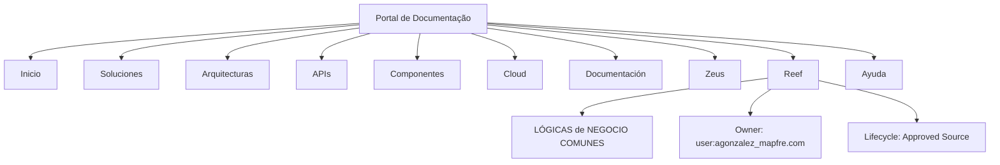

# Documentação Reef — Lógicas de Negócio Comuns

## 1. Metadados do Documento
- **Arquivo de Origem:** Não identificado
- **Tipo de Documento:** Documentação / referência corporativa
- **Domínio / Sistema:** Reef / Mapfre
- **Público-Alvo:** Não identificado
- **Data/Versão Identificada:** Não identificada

---

## 2. Resumo Executivo & Contexto de Negócio

O conteúdo apresentado identifica uma área de documentação denominada **Reef**, associada ao contexto corporativo **Mapfre**. A expressão “LÓGICAS de NEGOCIO COMUNES” indica que a documentação pode concentrar regras de negócio reutilizáveis ou transversais, mas o trecho não apresenta essas regras em detalhe.

A interface textual sugere um portal de consulta documental com categorias como **Soluciones**, **Arquitecturas**, **APIs**, **Componentes**, **Cloud**, **Documentación**, **Zeus**, **Reef** e **Ayuda**. A navegação está configurada para o idioma espanhol, indicado pela sigla `ES`.

O documento registra um responsável identificado como `user:agonzalez_mapfre.com` e o ciclo de vida `Approved Source`. Não há descrição funcional, arquitetural ou operacional adicional no conteúdo fornecido.

> **Nota de Análise:** O trecho menciona “LÓGICAS de NEGOCIO COMUNES”, mas não detalha regras, fluxos, sistemas integrados, APIs, contratos, tecnologias ou critérios de validação.

---

## 3. Arquitetura, Componentes & Tecnologias Envolvidas

Os elementos explicitamente citados são:

- **Reef:** domínio ou área documental.
- **Mapfre:** contexto organizacional identificado por `Mapfredocument`.
- **Zeus:** item de navegação do portal.
- **APIs:** categoria de consulta no portal.
- **Cloud:** categoria de consulta no portal.
- **Arquitecturas:** categoria de consulta no portal.
- **Componentes:** categoria de consulta no portal.
- **Approved Source:** estado de ciclo de vida apresentado.
- **ES:** idioma exibido na interface.



> **Nota de Análise:** O diagrama representa exclusivamente a relação de navegação e classificação indicada no conteúdo. Não há descrição de arquitetura de software, comunicação entre serviços ou fluxo de dados.

---

## 4. Regras de Negócio, Especificações Funcionais & Processos

O texto não descreve regras de negócio, parâmetros de cálculo, validações, processos operacionais ou fluxos funcionais detalhados.

Informações disponíveis:

1. Existe uma referência intitulada **“LÓGICAS de NEGOCIO COMUNES”**.
2. A referência está relacionada à documentação **Reef**.
3. O ciclo de vida exibido é **Approved Source**.
4. O proprietário informado é `user:agonzalez_mapfre.com`.
5. O portal apresenta categorias navegáveis, incluindo **APIs**, **Arquitecturas**, **Componentes**, **Cloud**, **Zeus** e **Reef**.
6. O idioma exibido é **ES**.

> **Nota de Análise:** Não foram fornecidos detalhes sobre as lógicas de negócio comuns, tais como condições, exceções, entradas, saídas ou responsáveis por execução.

---

## 5. Tabelas de Parâmetros, Ambientes e Estruturas de Dados

| Item / Parâmetro | Descrição / Função | Tipo / Valores / Formato | Ambiente / Observações |
| :--- | :--- | :--- | :--- |
| Título | Nome apresentado para a referência | `LÓGICAS de NEGOCIO COMUNES` | Associado à documentação Reef |
| Documentação | Área ou domínio documental citado | `Reef` | Aparece como “Documentation / DOCUMENTACIÓN Reef” |
| Contexto corporativo | Referência organizacional encontrada no conteúdo | `Mapfredocument` | Não há detalhamento adicional |
| Owner | Responsável indicado pela interface | `user:agonzalez_mapfre.com` | Valor literal extraído |
| Lifecycle | Estado de ciclo de vida | `Approved Source` | Não há definição do significado operacional |
| Idioma | Idioma exibido no portal | `ES` | Provavelmente espanhol, sem explicação adicional |
| Categoria de navegação | Acesso a soluções | `Soluciones` | Item de menu |
| Categoria de navegação | Acesso a arquiteturas | `Arquitecturas` | Item de menu |
| Categoria de navegação | Acesso a interfaces de programação | `APIs` | Item de menu |
| Categoria de navegação | Acesso a componentes | `Componentes` | Item de menu |
| Categoria de navegação | Acesso a recursos de nuvem | `Cloud` | Item de menu |
| Categoria de navegação | Acesso à documentação | `Documentación` | Item de menu |
| Categoria de navegação | Acesso a Zeus | `Zeus` | Item de menu |
| Categoria de navegação | Acesso a Reef | `Reef` | Item de menu |
| Categoria de navegação | Acesso à ajuda | `Ayuda` | Item de menu |

---

## 6. Bateria de Perguntas & Respostas para RAG (FAQ Sintético)

### P1: Qual é o título da documentação Reef apresentada no conteúdo?
**R:** O título apresentado é **“LÓGICAS de NEGOCIO COMUNES”**.

### P2: Qual domínio documental é citado no trecho?
**R:** O domínio documental citado é **Reef**, apresentado nas expressões “Documentation / DOCUMENTACIÓN Reef” e “DOCUMENTACIÓN Reef”.

### P3: Quem é o responsável indicado para a documentação?
**R:** O responsável indicado no campo **Owner** é `user:agonzalez_mapfre.com`.

### P4: Qual é o ciclo de vida registrado para a documentação Reef?
**R:** O campo **Lifecycle** apresenta o valor **Approved Source**.

### P5: O documento detalha as regras de negócio comuns?
**R:** Não. O conteúdo fornece apenas o título “LÓGICAS de NEGOCIO COMUNES”, sem descrever regras, condições, cálculos, validações ou exceções.

### P6: Quais categorias de navegação estão disponíveis no portal de documentação?
**R:** O portal apresenta as categorias `Inicio`, `Soluciones`, `Arquitecturas`, `APIs`, `Componentes`, `Cloud`, `Documentación`, `Zeus`, `Reef` e `Ayuda`.

### P7: O conteúdo identifica APIs específicas ou contratos de integração?
**R:** Não. O termo `APIs` aparece somente como categoria de navegação; não há APIs específicas, métodos HTTP, endpoints, contratos JSON ou protocolos descritos.

### P8: Existe uma arquitetura de software detalhada no conteúdo fornecido?
**R:** Não. O trecho menciona a categoria `Arquitecturas`, mas não apresenta componentes técnicos, camadas, servidores, fluxos de comunicação ou diagramas de arquitetura.

### P9: Qual idioma está selecionado no portal?
**R:** O idioma exibido é `ES`. O conteúdo não apresenta uma descrição adicional dessa configuração.

### P10: O que é Zeus no contexto do trecho?
**R:** `Zeus` é exibido como um item de navegação do portal. O conteúdo não fornece definição funcional, técnica ou relação detalhada entre Zeus e Reef.

---

## 7. Glossário de Termos, Siglas & Conceitos-Chave

- **API:** Termo exibido como categoria de navegação. O conteúdo não define o significado nem especifica interfaces.
- **Approved Source:** Valor apresentado no campo `Lifecycle`; o trecho não explica critérios, transições ou efeitos desse estado.
- **Cloud:** Categoria de navegação exibida no portal, sem detalhamento técnico.
- **ES:** Código exibido para o idioma da interface.
- **Lifecycle:** Campo que identifica o estado de ciclo de vida de uma referência documental.
- **Mapfre:** Nome presente na expressão `Mapfredocument`; não há detalhamento adicional.
- **Owner:** Campo que identifica o responsável pela documentação.
- **Reef:** Domínio ou área de documentação citada no conteúdo.
- **Zeus:** Item de navegação do portal, sem definição complementar.

---

## 8. Notas Críticas, Riscos & Limitações

- O conteúdo extraído é extremamente resumido e não contém especificações funcionais ou técnicas detalhadas.
- Não há regras de negócio efetivamente descritas, apesar do título indicar “LÓGICAS de NEGOCIO COMUNES”.
- Não há informações sobre ambientes, URLs, credenciais, servidores, logs, tecnologias, versões, endpoints ou contratos de integração.
- Não é possível inferir a finalidade técnica de **Reef**, **Zeus** ou `Approved Source` além das referências literais exibidas.
- O valor `user:agonzalez_mapfre.com` foi preservado exatamente como apresentado; o trecho não confirma se representa um e-mail, identificador de usuário ou outro formato corporativo.

---

## 9. Conteúdo Bruto Estruturado (Referência Fiel)

```text
--- [PÁGINA 1 DE 1] ---

LÓGICAS de NEGOCIO COMUNES
Documentation / DOCUMENTACIÓN Reef
DOCUMENTACIÓN Reef
Mapfredocument
DOCUMENTACIÓN Reef
Owner
user:agonzalez_mapfre.com
Lifecycle
Approved Source
 / 
 VL
Buscar Inicio Soluciones Arquitecturas APIs Componentes Cloud Documentación Zeus Reef Ayuda
ES
```
