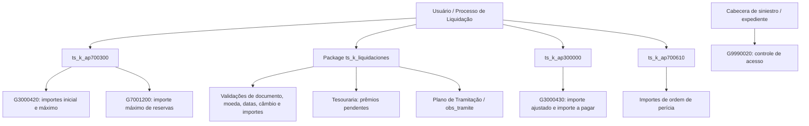

# Lógicas de Negocio de Siniestros — Facturación y Proceso de Liquidación de Expedientes

## 1. Metadados do Documento
- **Arquivo de Origem:** Não identificado no conteúdo extraído; referência interna a `Proceso_de_Liquidaciones_de_Siniestros.doc`
- **Tipo de Documento:** Especificação Técnica / Manual Funcional
- **Domínio / Sistema:** Reef / Reef.core — Siniestros, Facturación e Liquidaciones
- **Público-Alvo:** Desenvolvedores, Arquitetos, Operação e Analistas Funcionais
- **Data/Versão Identificada:** Não identificada

---

## 2. Resumo Executivo & Contexto de Negócio

O documento descreve lógicas de negócio, procedimentos e funções usados no processo de faturamento e liquidação de expedientes de sinistros no contexto Reef. O escopo declarado é remover conteúdos que não afetem a faturação de saúde; entretanto, o material também cita comportamentos relacionados a Autos, perícia, ordens de reparação, profissionais externos, tesouraria e gestão de expedientes.

A solução delega diversas validações e valores padrão a lógicas configuráveis por instalação. Essa abordagem é explicitamente justificada porque o tratamento e a validação dos campos das liquidações variam consideravelmente entre instalações. As lógicas podem devolver importes, beneficiários, dados documentais, moedas, datas, escritórios de pagamento e critérios de controle.

O processo de liquidação concentra procedimentos e funções no package `ts_k_liquidaciones`. As globais comuns transmitidas às rotinas incluem `cod_cia`, `num_sini` e `num_exp`; à medida que o usuário percorre os campos, valores são armazenados em globais para serem utilizados em validações posteriores.

O documento também especifica controles de acesso a programas, observações para o Plano de Tramitação, validações de moeda, documento, data, câmbio e importes liquidados. A documentação estabelece pontos de chamada concretos em packages como `ts_k_ap700300`, `ts_k_ap300000`, `ts_k_ap700610`, `ts_k_cabsini`, `ts_k_cabexp` e `ts_k_liquidaciones`.

---

## 3. Arquitetura, Componentes & Tecnologias Envolvidas

### Componentes e objetos identificados

| Componente / Objeto | Papel descrito |
| :--- | :--- |
| Reef / Reef.core | Contexto de aplicação citado para codificação de atividades e documentação. |
| `ts_k_liquidaciones` | Package que inclui procedimentos e funções do processo de liquidações de expedientes. |
| `ts_k_ap700300` | Chama lógicas para valor inicial/máximo e aceita liquidações. |
| `ts_k_ap300000` | Chama procedimentos de ajuste e determinação de importe a pagar na faturação. |
| `ts_k_ap700610` | Chama lógicas de importes inicial e máximo de ordens de perícia. |
| `ts_k_cabsini` | Executa controle de acesso na cabeceira de sinistros. |
| `ts_k_cabexp` | Executa controle de acesso na cabeceira de expedientes. |
| Plano de Tramitação | Pode recolher `obs_tramite` e inseri-la como observação. |
| Tesouraria | Recebe indicação sobre compensação de recibos/prêmios pendentes contra pagamento de sinistro. |
| `T_LSF_TRN_D_DSD` | Estrutura/tabela de valores padrão citada para liquidações e justificantes. |
| `DF_LSF_NWT_XX_PPD` | Tabela de definição da aplicação de prêmios pendentes. |
| G3000420 | Conceitos de cobrança e pagamento diverso por tipo de expediente e conceito de reserva. |
| G3000430 | Desdobramento de conceito de cobrança/pagamento diverso e conceito de reserva. |
| G7001200 | Importes por causa, consequência, cobertura, tipo de expediente e conceito de reserva. |
| G9990020 | Controle de acesso a programas. |
| G1002700 | Origem de `cod_nivel3` da oficina do usuário. |
| A5021105 | Definição da oficina de pagamento referenciada. |



> **Nota de Análise:** O documento cita packages, tabelas e rotinas Oracle/PLSQL, mas não detalha contratos de dados, esquemas físicos, tipos SQL, transações, tratamento de exceções ou métodos de integração externos.

---

## 4. Regras de Negócio, Especificações Funcionais & Processos

### Importes de conceitos de cobrança e pagamento

- `nom_prg_1` em G3000420 devolve o importe inicial para conceitos de cobrança e pagamento diverso das liquidações.
- O valor inicial é chamado por `ts_k_ap700300.p_devuelve_imp_liq_inicial`.
- Para uma indenização a oficina com perícia, o importe inicial pode ser o indicado na perícia.
- Para pagamentos a profissionais externos, o valor pode originar-se:
  - Do custo de serviço por atividade, registrado na informação do terceiro.
  - Dos honorários detalhados no módulo de juízos, quando o terceiro for advogado.
  - Da perícia, quando o terceiro for perito.
- A regra de obtenção do importe inicial varia por instalação.
- `nom_prg_2` em G3000420 devolve o importe máximo para conceitos de cobrança e pagamento diverso.
- O valor máximo é chamado por `ts_k_ap700300.p_v_imp_liq_fra_2`.

### Ajuste e pagamento na faturação

- `nom_prg_1` em G3000430 é executado na faturação.
- A rotina parte do importe faturado, desconta gastos não cobertos e devolve o importe ajustado.
- O documento cita como exemplos custos usuais, razoáveis e habituais em Saúde e perícia em Autos.
- `nom_prg_2` em G3000430 recebe o importe ajustado e devolve o importe a pagar.
- Deducíveis e esgotamentos de cobertura são critérios explicitamente citados para determinação do importe a pagar.

### Ordens de perícia

- `nom_prg_ini_orden` devolve o importe inicial da valoração de uma ordem de perícia, para conceito de cobrança/pagamento diverso e conceito de detalhe.
- `nom_prg_max_orden` devolve o importe máximo da valoração da ordem para os mesmos conceitos.
- As rotinas são chamadas, respectivamente, por `ts_k_ap700610.p_imp_cto_defecto` e `ts_k_ap700610.p_v_imp_cto`.

### Ajuste de reservas

- `nom_prg_validacion` em G7001200 devolve o importe máximo no ajuste de reservas e na mudança de valoração de expediente por cobertura e conceito de reserva.
- Quando o parâmetro da tabela indicar uso da mesma lógica da valoração máxima em liquidações, a lógica também é executada em liquidações por cobertura/conceito de reserva.
- A chamada ocorre a partir de `ts_k_ap700300.p_aceptar_liquidacion`.

### Controle de acesso e observações

- G9990020 permite definir, por setor, ramo e código de programa, lógicas que controlam se uma pessoa pode acessar um programa.
- A definição aceita setor e ramo `999`.
- O controle é disparado após a introdução do número de sinistro ou expediente.
- Cada lógica deve controlar a mensagem de erro e concatenar o código do programa cujo acesso foi negado.
- `nom_prg_obs_tramite` define lógicas que devolvem observações por meio da global `obs_tramite`.
- A global `nom_prg_obs_tramite` é carregada nas cabeceiras após informar sinistro e/ou expediente.
- A lógica é executada no fim de cada programa; quando chamada pelo Plano de Tramitação, esse plano recolhe `obs_tramite` e insere as observações.

### Valores padrão de liquidações

- `bnf_typ_prd_nam` devolve o tipo inicial de beneficiário para liquidações e justificantes soltos.
- `pym_thp_acv_prd_nam` devolve a atividade inicial do beneficiário.
- `pym_thp_prd_nam` devolve o código inicial de terceiro quando a atividade for codificada em Reef.core, geralmente fornecedores.
- `pym_thp_dcm_typ_prd_nam` devolve o tipo de documento inicial do terceiro.
- `pym_thp_dcm_prd_nam` devolve o número de documento do beneficiário.
- `pym_thr_lvl_prd_nam` devolve a oficina de pagamento padrão.
- `ts_f_liq_ofi_envio_defecto` devolve a oficina de envio padrão.
- `ts_f_liq_fec_recep_fra_def` devolve a data padrão de recepção da fatura; no núcleo, devolve a data do sistema.
- `ts_f_fec_est_pago` devolve a data estimada de pagamento; no núcleo, devolve `fec_proceso`.
- `ts_f_liq_tip_docto_defecto` devolve o tipo padrão de documento; no núcleo, devolve `FA`.
- `ts_f_tipo_iva_defecto` devolve o IVA padrão; no núcleo, devolve `E` (Exento).
- `ts_f_liq_mon_doc_defecto` devolve a moeda padrão do documento.

### Prêmios pendentes e controles extras

- A tabela `DF_LSF_NWT_XX_PPD` informa à Tesouraria se recibos/prêmios pendentes devem ser compensados contra pagamento de sinistro.
- `TYP_APY_RCP_PND` controla a referência temporal para cálculo dos recibos pendentes.
- `TYP_APY_RCP_PND_PRD_TYP_VAL` define se a regra é procedimento (`3`) ou função (`4`).
- `TYP_APY_RCP_PND_PRD_NAM` armazena o procedimento ou função correspondente.
- `ts_p_liq_valida_opcion` valida a opção Liquidação, Retificação, Justificante Solto ou Anulação.
- `ts_p_liq_anu_rect_liq` verifica se uma liquidação pode ser anulada ou retificada.
- `ts_f_liq_perm_con_ord_pend` determina se há liquidação apesar de ordens de reparação pendentes; no núcleo devolve `N`.
- `ts_f_liq_perm_cons_act` determina se o usuário pode visualizar pagamentos profissionais; no núcleo devolve `TRUE`.

---

## 5. Tabelas de Parâmetros, Ambientes e Estruturas de Dados

| Item / Parâmetro | Descrição / Função | Tipo / Valores / Formato | Ambiente / Observações |
| :--- | :--- | :--- | :--- |
| `cod_cia` | Código da companhia. | Entrada. | Usado em diversas rotinas. |
| `num_sini` | Número de sinistro. | Entrada. | Global do processo de liquidação. |
| `num_exp` | Número de expediente. | Entrada. | Global do processo de liquidação. |
| `cod_pgm` | Código de programa. | Entrada. | Controle de acesso. |
| `cod_ramo` | Código de ramo. | Entrada. | G3000420 e G7001200. |
| `tip_exp` | Tipo de expediente. | Entrada. | G3000420. |
| `cod_cob` | Código de cobertura. | Entrada. | Regras de importe e validação. |
| `cod_cto_rva` | Código de conceito de reserva. | Entrada. | Regras de importe. |
| `cod_cto_cob_pag` | Código de conceito de cobrança/pagamento. | Entrada. | G3000420, G3000430 e ordens. |
| `cod_causa_sini` | Código de causa do sinistro. | Entrada. | G3000420 e G3000430. |
| `tip_liquidacion` | Tipo de liquidação. | Entrada. | G3000420. |
| `cod_mon` | Código de moeda. | Entrada. | G3000420. |
| `num_liq` | Número de liquidação. | Entrada para retificação. | G3000420. |
| `num_insp`, `num_orden` | Número de inspeção e ordem. | Entrada para não retificação. | G3000420. |
| `imp_inicial` | Importe inicial. | Saída. | `p_devuelve_imp_liq_inicial`. |
| `suma_aseg` | Soma segurada / importe máximo devolvido. | Saída. | `p_v_imp_liq_fra_2` e G7001200. |
| `imp_cura` | Importe ajustado. | Entrada e saída. | G3000430. |
| `imp_pag` | Importe a pagar. | Entrada e saída. | G3000430. |
| `cod_det_cto` | Código de detalhe de conceito. | Entrada. | G3000430 e ordens. |
| `num_ocurrencia` | Número de ocorrência. | Entrada. | G3000430. |
| `imp_ini_orden` | Importe inicial da ordem. | Saída. | `p_imp_cto_defecto`. |
| `imp_max_orden` | Importe máximo da ordem. | Saída. | `p_v_imp_cto`. |
| `cod_sector` | Código de setor. | Entrada. | Ordens de perícia. |
| `tip_propiedad` | Tipo de propriedade. | Entrada. | Ordens de perícia. |
| `max_spto_40` | Parâmetro de importe máximo. | Entrada e saída. | G7001200. |
| `max_spto_apli_40` | Parâmetro de aplicação de máximo. | Entrada e saída. | G7001200. |
| `obs_tramite` | Observação para Plano de Tramitação. | Saída. | Devolvida por `nom_prg_obs_tramite`. |
| `TYP_APY_RCP_PND` | Tipo de aplicação de recibos pendentes. | `1`, `2` ou `3`. | 1: ocorrência; 2: vencimento; 3: não se aplica. |
| `TYP_APY_RCP_PND_PRD_TYP_VAL` | Tipo de rotina de prêmios pendentes. | `3` procedimento; `4` função. | Define interpretação de `TYP_APY_RCP_PND_PRD_NAM`. |
| `tip_dcto` | Tipo de documento. | Entrada. | Usado em `ts_f_tipo_iva_defecto`. |
| `cod_mon_liq` | Moeda da liquidação. | Entrada. | Validação de moeda de pagamento. |
| `cod_mon_pago` | Moeda de pagamento. | Entrada. | Validação de moeda de pagamento. |
| `cod_mon_fra` | Moeda do documento/fatura. | Entrada. | Validação de moeda de documento. |
| `fec_proceso` | Data de processo. | Entrada. | Valor padrão de data estimada de pagamento. |
| `cod_act_tercero` | Código de atividade do terceiro. | Global disponível em validações. | Associado ao beneficiário. |
| `tip_benef` | Tipo de beneficiário. | Global disponível em validações. | Processo de liquidações. |
| `tip_docum`, `cod_docum` | Tipo e código/número documental. | Globais disponíveis em validações. | Processo de liquidações. |

---

## 6. Bateria de Perguntas & Respostas para RAG (FAQ Sintético)

### P1: Como é determinado o importe inicial de um conceito de cobrança e pagamento diverso em liquidações?
**R:** A lógica `nom_prg_1` de G3000420 devolve o importe inicial e é chamada por `ts_k_ap700300.p_devuelve_imp_liq_inicial`. O documento exemplifica que uma indenização a oficina com perícia pode usar o importe indicado na perícia. Para profissionais externos, o valor pode provir do custo de serviço por atividade do terceiro, de honorários no módulo de juízos para advogados ou de dados de perícia para peritos. A origem pode variar por instalação.

### P2: Qual rotina determina o importe máximo de conceitos de cobrança e pagamento diverso?
**R:** A lógica `nom_prg_2` de G3000420 determina o importe máximo e é chamada por `ts_k_ap700300.p_v_imp_liq_fra_2`.

### P3: Como o sistema chega ao importe a pagar durante a faturação?
**R:** Em G3000430, `nom_prg_1` calcula o importe ajustado a partir do importe faturado menos gastos não cobertos. Em seguida, `nom_prg_2` usa o importe ajustado para obter o importe a pagar, considerando critérios citados como dedutíveis e esgotamentos de cobertura.

### P4: Quando a lógica de importe máximo do ajuste de reservas também é executada em liquidações?
**R:** A lógica `nom_prg_validacion` de G7001200 é executada em liquidações quando o parâmetro da tabela indicar que a mesma lógica de negócio de valoração máxima deve ser usada em liquidações. A chamada ocorre em `ts_k_ap700300.p_aceptar_liquidacion`.

### P5: Como é feito o controle de acesso a programas?
**R:** G9990020 permite configurar lógicas por setor, ramo e código de programa. As lógicas são disparadas nas cabeceiras de sinistro ou expediente após informar o identificador correspondente. A lógica deve definir a mensagem de erro e concatenar o código do programa cujo acesso foi negado.

### P6: Quais dados são comuns a procedimentos e funções de liquidações?
**R:** As globais `cod_cia`, `num_sini` e `num_exp` são passadas às rotinas do package `ts_k_liquidaciones`. O documento informa que valores de campos já percorridos também são armazenados em globais para uso em validações subsequentes.

### P7: Qual é o comportamento padrão para uma liquidação com ordem de reparação pendente?
**R:** A função `ts_f_liq_perm_con_ord_pend` verifica se liquidações podem ser realizadas quando existirem ordens de reparação pendentes de liquidar. Na versão de núcleo, a função devolve `N`.

### P8: Como são tratadas moedas diferentes de pagamento e liquidação?
**R:** `ts_p_valida_moneda_de_pago` valida que, se a moeda de pagamento e a moeda da liquidação forem diferentes, uma das duas deve ser a moeda do país. As entradas citadas são `cod_cia`, `num_sini`, `num_exp`, `cod_mon_liq` e `cod_mon_pago`.

### P9: Quais tipos de documento são citados para liquidações?
**R:** O documento cita Factura, Boleta e Nota de Crédito. `ts_f_liq_tip_docto_defecto` devolve o tipo padrão do documento e, na versão de núcleo, devolve `FA`. `ts_p_liq_tipo_de_documento` valida o tipo de documento.

### P10: Como a aplicação de prêmios pendentes é comunicada à Tesouraria?
**R:** A tabela `DF_LSF_NWT_XX_PPD` indica à Tesouraria se recibos/prêmios pendentes devem ser compensados contra o pagamento de sinistro. `TYP_APY_RCP_PND` define o critério: pendência na data de ocorrência, na data de vencimento da apólice ou não aplicação.

---

## 7. Glossário de Termos, Siglas & Conceitos-Chave

- **Reef / Reef.core:** Sistema/plataforma citada no documento.
- **Siniestro:** Sinistro.
- **Expediente:** Processo ou expediente associado ao sinistro.
- **Liquidación:** Processo de liquidação.
- **Rectificación:** Retificação de liquidação.
- **Justificante Suelto:** Justificante avulso.
- **Anulación:** Anulação.
- **Cobertura:** Cobertura de seguro.
- **Concepto de Reserva:** Conceito de reserva.
- **Concepto de Cobro y Pago Vario:** Conceito de cobrança e pagamento diverso.
- **Peritación:** Perícia / avaliação pericial.
- **Plan de Tramitación:** Plano de tramitação que pode receber observações.
- **IVA:** Imposto sobre Valor Agregado; no núcleo, `E` representa Exento.
- **DNI:** Documento Nacional de Identidad.
- **CIF:** Código de Identificación Fiscal.
- **FA:** Tipo de documento padrão devolvido pela versão de núcleo.
- **BV:** Tipo de documento citado.
- **NC:** Nota de Crédito.

---

## 8. Notas Críticas, Riscos & Limitações

- O documento afirma que o comportamento dos campos de liquidação varia consideravelmente por instalação. Portanto, resultados de funções e lógicas não devem ser assumidos como universais.
- Diversas rotinas da versão de núcleo devolvem `NULL`, `N`, `TRUE`, `FA`, `E` ou a data do sistema; implementações locais podem substituir esses comportamentos.
- O documento cita o arquivo `Proceso_de_Liquidaciones_de_Siniestros.doc` como fonte de detalhamento adicional, mas esse material não foi fornecido.
- Não há detalhamento dos contratos de entrada/saída completos, mensagens de erro concretas, tabelas físicas, regras de conversão de moeda, políticas de auditoria ou permissões por perfil.
- O texto tem extração com caracteres corrompidos em termos como “Rectificación”, “definir”, “beneficiario” e “oficina”; a interpretação foi limitada ao conteúdo legível.

---

## 9. Conteúdo Bruto Estruturado (Referência Fiel)

```text
--- [PÁGINA 1 DE 10] ---

LÓGICAS de NEGOCIO SINIESTROS- FACTURACIÓN
ELIMINAR TODO LO QUE NO AFECTE A LA FACTURACIÓN DE SALUD.ESTE DOCUMENTO ES UN A COPIA DE LAS LIQUIDACIONES.
Liquidaciones
Conceptos Cobro y pago vario por Tipo de Expediente y concepto de reserva (G3000420)
nom_prg_1
Importe inicial para los conceptos de cobro y pago vario de las liquidaciones.
Lanzado desde ts_k_ap700300.p_devuelve_imp_liq_inicial

--- [PÁGINA 2 DE 10] ---

Ejemplos: En el caso de concepto de cobro y pago vario indemnización al taller, el importe inicial, si se tiene una peritación, sería el indicado en la peritación.
En caso de conceptos de cobro y pago varios para pagar a profesionales externos podríamos obtenerlo de:
- Si tenemos el coste de servicio por actividad, en la información del tercero, se tomaría de ahí.
- Si es un abogado y se ha detallado los honorarios en el módulo de juicio, se obtendría del módulo de juicios.
- Si es un perito y se ha detallado en la peritación...
Esto cambia por instalación.
nom_prg_2
Importe máximo para los conceptos de cobro y pago vario de las liquidaciones.
Lanzado desde ts_k_ap700300.p_v_imp_liq_fra_2
Desglose de Concepto de cobro y pago vario y concepto de reserva (G3000430)
nom_prg_1
Se lanza en la facturación. Partiendo del importe facturado menos los gastos no amparados, nos devuelve el importe ajustado.
nom_prg_2
Se lanza en la facturación. Partiendo del importe ajustado, se obtiene el importe a pagar. (Deducibles y agotamientos de cobertura).

--- [PÁGINA 3-5 DE 10] ---

nom_prg_ini_orden: importe inicial de valoración de orden de peritación.
nom_prg_max_orden: importe máximo de valoración de orden.
Importes Causa/Consec./Cob./Tipo Exp./Cto.Rva. (G7001200)
nom_prg_validacion: devuelve el importe máximo en ajuste de reservas y cambio de valoración.
Control de acceso a programas (G9990020)
Definición por sector, ramo y código de programa. Se aceptan sector y ramo 999.
Lanzado desde ts_k_cabsini.pp_control_acceso_programa y ts_k_cabexp.pp_control_acceso_programa.

--- [PÁGINA 6-7 DE 10] ---

nom_prg_obs_tramite devuelve observaciones mediante la global obs_tramite.
Proceso de Liquidación de Expedientes (AP700300)
Procedimientos y funciones incluidos en package ts_k_liquidaciones.
Globales: cod_cia, num_sini, num_exp.
Valores por defecto T_LSF_TRN_D_DSD:
bnf_typ_prd_nam, pym_thp_acv_prd_nam, pym_thp_prd_nam,
pym_thp_dcm_typ_prd_nam, pym_thp_dcm_prd_nam, pym_thr_lvl_prd_nam.
ts_f_liq_ofi_envio_defecto
ts_f_liq_fec_recep_fra_def
ts_f_fec_est_pago
ts_f_liq_tip_docto_defecto
ts_f_liq_tip_aprovecha
ts_f_tipo_iva_defecto
ts_f_liq_mon_doc_defecto

--- [PÁGINA 8-10 DE 10] ---

Aplicación Primas Pendientes (DF_LSF_NWT_XX_PPD)
TYP_APY_RCP_PND:
1 = Importe pendiente a la fecha de ocurrencia del siniestro
2 = Importe pendiente a la fecha de vencimiento de la póliza
3 = No se aplica

Controles Extras de las Liquidaciones:
ts_p_liq_valida_opcion
ts_p_liq_anu_rect_liq
ts_f_liq_perm_con_ord_pend
ts_f_liq_perm_cons_act

Validaciones de campos:
ts_p_liq_documento_benef
ts_p_valida_moneda_de_pago
ts_p_valida_mon_documento
ts_p_liq_val_cambio_pago
ts_p_liq_val_fec_recep_fra
ts_p_liq_fec_est_pago
ts_p_liq_tipo_de_documento
ts_p_liq_moneda_exp
ts_p_liq_num_documento
ts_p_liq_fec_documento
ts_p_liq_emisor_documento
ts_p_liq_observaciones
ts_p_liq_valida_imp_liq
```
