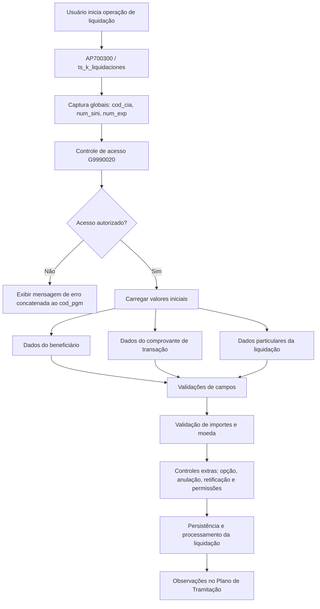
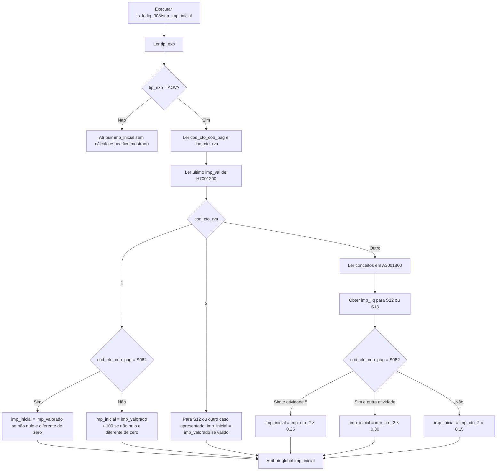

# Lógicas de Negócio de Sinistros — Liquidações no Reef.core

## 1. Metadados do Documento
- **Arquivo de Origem:** Não identificado no conteúdo extraído
- **Tipo de Documento:** Especificação Técnica
- **Domínio / Sistema:** Sinistros, Liquidações e Reef.core
- **Público-Alvo:** Desenvolvedores, Arquitetos, Operação e Analistas Funcionais
- **Data/Versão Identificada:** Versão `1.00` no package `ts_k_liq_308tst`; funções exemplificadas com versão `1.0`; datas de criação citadas em `2011/05/09`, `98/04/16` e `MS-2011-03-00313`.

---

## 2. Resumo Executivo & Contexto de Negócio

O documento descreve lógicas de negócio, atributos configuráveis, procedimentos e funções envolvidos no processo de liquidações de expedientes de sinistros no ambiente Reef.core. O foco funcional é determinar valores iniciais, limites máximos, dados padrão, permissões de acesso, validações de documentos e controles complementares para pagamentos vinculados a sinistros.

A configuração é extensível por instalação. O documento afirma que o tratamento e a validação dos campos podem variar consideravelmente entre instalações; por isso, grande parte dos atributos do processo de liquidação possui uma lógica de negócio específica ou uma função responsável por devolver um valor selecionado ou padrão.

A implementação apresentada utiliza objetos PL/SQL e globais gerenciadas por `trn_k_global`. Entre as globais recorrentes estão companhia, sinistro, expediente, cobertura, conceito de reserva, conceito de cobrança/pagamento, moeda, beneficiário e informações de documento. Essas globais transitam entre os pontos de validação para permitir que lógicas posteriores consultem os valores já informados na liquidação.

O package `ts_k_liq_308tst` exemplifica personalizações para o ramo `308`, incluindo cálculo de importe inicial (`p_imp_inicial`) e importe máximo (`p_imp_maximo`) quando o tipo de expediente é `AOV`. O cálculo depende de cobertura, conceito de reserva, conceito de cobrança/pagamento, atividade do terceiro, valores de valoração e soma assegurada.

O processo também integra controles de acesso a programas, observações de tramitação, aplicação de prêmios pendentes, validações monetárias, validações documentais, controle de anulação/retificação e permissões para pagamentos profissionais ou expedientes com ordens pendentes.

---

## 3. Arquitetura, Componentes & Tecnologias Envolvidas

### Componentes, objetos e tabelas identificados

| Componente / Objeto | Papel identificado no documento |
| :--- | :--- |
| `Reef.core` | Ambiente mencionado como consumidor das lógicas de liquidação e compatibilidade entre versões. |
| `AP700300` | Processo de Liquidação de Expedientes. |
| `ts_k_liquidaciones` | Package que inclui procedimentos e funções de validação, valores padrão e controles do processo de liquidações. |
| `ts_k_liq_308tst` | Package PL/SQL de personalização de importes máximos e iniciais para o ramo 308. |
| `trn_k_global` | Mecanismo de leitura, atribuição e persistência de globais usadas pelas lógicas de negócio. |
| `G3000420` | Tabela de conceitos de cobrança e pagamento diversos por tipo de expediente e conceito de reserva. |
| `G7001200` | Tabela “Importes Causa/Consec./Cob./Tipo Exp./Cto.Rva.”; também referenciada para valores de valoração e importes iniciais. |
| `G9990020` | Tabela de controle de acesso a programas por setor, ramo e código de programa. |
| `A3001800` | Origem de conceitos e importes usados no cálculo para determinados conceitos de reserva. |
| `A7001000` | Fonte de tipo de expediente e moeda do expediente. |
| `A2000040` | Fonte de suplementos, aplicações, cobertura e soma assegurada. |
| `A7000900` | Fonte do período associado ao sinistro. |
| `A5021105` | Fonte da relação entre escritório de envio do usuário e escritório de pagamento. |
| `G1002700` | Fonte do `cod_nivel3` do usuário. |
| `G1010031` | Tabela mencionada para valores do tipo de IVA. |
| `DF_LSF_NWT_XX_PPD` | Tabela de definição para aplicação de prêmios pendentes no pagamento de sinistro. |
| `ts_k_cabexp.pp_control_acceso_programa` | Ponto de disparo do controle de acesso a programas no Reef.core. |
| `ts_k_a7001000` | Objeto usado para leitura de dados do expediente, inclusive moeda. |
| `dc_k_g1002700` | Objeto usado para leitura da estrutura organizacional do usuário. |
| `em_k_a2000040` | Objeto usado para leitura de soma assegurada. |
| `em_f_max_spto_a2000040` | Função usada para localizar o suplemento máximo aplicável. |
| `em_f_max_spto_apli_a40` | Função usada para localizar o suplemento de aplicação máximo. |
| `ts_k_a7000900` | Objeto usado para leitura do período do sinistro. |

### Fluxo de alto nível das liquidações



### Fluxo de cálculo do importe inicial do ramo 308



> **Nota de Análise:** O documento menciona tabelas e objetos de banco de dados, mas não detalha seu modelo físico integral, chaves, contratos de integração, APIs HTTP, URLs, ambientes, portas ou mecanismos de autenticação.

---

## 4. Regras de Negócio, Especificações Funcionais & Processos

### 4.1. Lógica de importe inicial de liquidações

A lógica de negócio do importe inicial devolve o valor inicial para conceitos de cobrança e pagamento diversos das liquidações. Antes da execução, são atribuídas as globais de entrada `cod_cto_rva`, `cod_cto_cob_pag`, `cod_mon` e, conforme o caso, `num_liq` para retificação ou `num_insp` e `num_orden` para não retificação.

Exemplos funcionais informados:

- Para pagamento de indenização a uma oficina, se houver perícia, o importe inicial pode ser o valor indicado na perícia.
- Para profissionais externos, o importe pode ser obtido do custo de serviço por atividade no cadastro do terceiro.
- Para advogado, caso os honorários estejam detalhados no módulo de juízos, o importe pode ser obtido desse módulo.
- Para perito, o texto indica obtenção a partir da perícia.
- O documento declara explicitamente que a lógica pode variar por instalação.

No exemplo `ts_k_liq_308tst.p_imp_inicial`, o cálculo específico é executado apenas quando `tip_exp = 'AOV'`.

#### Regras do exemplo `p_imp_inicial`

| Condição | Resultado |
| :--- | :--- |
| `tip_exp` diferente de `AOV` | O trecho apresentado não define cálculo específico. |
| `cod_cto_rva = 1` e `cod_cto_cob_pag = 'S06'` | Se `imp_valorado` não for nulo e for diferente de zero, `imp_inicial = imp_valorado`. |
| `cod_cto_rva = 1` e `cod_cto_cob_pag` diferente de `S06` | Se `imp_valorado` não for nulo e for diferente de zero, `imp_inicial = imp_valorado + 100`. |
| `cod_cto_rva = 2` e `cod_cto_cob_pag = 'S12'` | Se `imp_valorado` não for nulo e for diferente de zero, `imp_inicial = imp_valorado`. |
| `cod_cto_rva = 2` e outro caso mostrado | Se `imp_valorado` não for nulo e for diferente de zero, `imp_inicial = imp_valorado`. |
| `cod_cto_rva` diferente de `1` e `2` | A lógica percorre registros de `A3001800` e usa valores associados a `S12` ou `S13`. |
| Conceito de pagamento `S08`, atividade de terceiro `5` | `imp_inicial = imp_cto_2 × 0,25`. |
| Conceito de pagamento `S08`, atividade diferente de `5` | `imp_inicial = imp_cto_2 × 0,30`. |
| Conceito de pagamento diferente de `S08`, no ramo lógico final apresentado | `imp_inicial = imp_cto_2 × 0,15`. |

Em qualquer erro no procedimento, a implementação exemplificada executa `RAISE_APPLICATION_ERROR(-20000, '[ts_k_liq_308_tst.p_imp_inicial]' || SQLERRM)`.

### 4.2. Lógica de validação de importe liquidado

A lógica de validação de importe liquidado garante que o importe liquidado não ultrapasse determinado limite. As globais adicionais indicadas são `cod_cto_rva`, `cod_mon`, e `num_liq` em retificação ou `num_insp` e `num_orden` em não retificação. A saída é `suma_aseg`.

Exemplos funcionais:

- Se o documento de pagamento estiver registrado, o importe total da liquidação não deve superar o valor da fatura registrada.
- Se o pagamento for destinado à oficina e existir perícia, o importe não deve superar o valor registrado na perícia.

### 4.3. Lógica de importe máximo do ramo 308

O procedimento `ts_k_liq_308tst.p_imp_maximo` calcula a saída `suma_aseg` para `tip_exp = 'AOV'`. A implementação consulta suplemento, aplicação, período, cobertura `1040`, soma assegurada e conceitos de reserva/cobrança-pagamento.

| Condição | Regra para `suma_aseg` |
| :--- | :--- |
| `cod_cto_rva = 1` e `cod_cto_cob_pag = 'S06'` | `suma_aseg = imp_aseg` |
| `cod_cto_rva = 1` e conceito diferente de `S06` | `suma_aseg = imp_aseg × 0,8` |
| `cod_cto_rva = 2` | `suma_aseg = imp_aseg × 0,5` |
| Outro `cod_cto_rva` | `suma_aseg = imp_aseg × 0,25` |

A lógica atribui `suma_aseg` à global por meio de `trn_k_global.p_asigna`. Em caso de erro, lança `RAISE_APPLICATION_ERROR(-20000, '[ts_k_liq_308_tst.p_imp_maximo]' || SQLERRM)`.

### 4.4. Valoração máxima em `G7001200`

A tabela `G7001200` contém lógica de negócio que devolve o importe máximo no ajuste de reservas e na alteração de valoração de um expediente por cobertura e conceito de reserva.

- Entradas: `cod_cob` e `cod_cto_rva`.
- Saída: `suma_aseg`.
- Se não houver uma lógica específica de importe máximo e a marca indicar aplicação em liquidações, o máximo do conceito de reserva/conceito de cobrança e pagamento diverso para toda a cobertura será a soma assegurada.

### 4.5. Controle de acesso a programas

A tabela `G9990020` define, por setor, ramo e código de programa, lógicas de negócio executadas no início dos programas para verificar se uma pessoa pode acessar a operação. A definição aceita setor e ramo `999`.

No contexto de liquidações, o controle é disparado no cabeçalho de expedientes após informar número de sinistro e número de expediente. É executado a partir dos cabeçalhos de Liquidação e Justificante Solto, no Reef.core, via `ts_k_cabexp.pp_control_acceso_programa`.

| Entrada | Uso |
| :--- | :--- |
| `cod_cia` | Companhia. |
| `num_sini` | Número do sinistro. |
| `num_exp` | Número do expediente. |
| `cod_pgm` | Código do programa cujo acesso está sendo validado. |

Cada lógica deve controlar a mensagem de erro exibida e concatenar o código de programa ao qual o acesso está sendo negado.

Exemplos de políticas possíveis no documento:

- Autorizar a liquidação somente ao tramitador responsável pelo expediente.
- Autorizar a liquidação somente a tramitadores que compartilhem o mesmo supervisor do tramitador responsável.

### 4.6. Observações no Plano de Tramitação

O atributo `nom_prg_obs_tramite` define lógicas de negócio que, por meio da global `obs_tramite`, devolvem observações a serem gravadas no Plano de Tramitação.

Após a introdução de sinistro e/ou expediente, os cabeçalhos carregam a global `nom_prg_obs_tramite`. A lógica é executada ao final de cada programa. Quando invocada pelo Plano de Tramitação, esse plano coleta `obs_tramite` e a insere como observação.

| Entrada | Saída |
| :--- | :--- |
| `nom_prg_obs_tramite` | `obs_tramite` |

### 4.7. Valores padrão de beneficiário

| Atributo | Finalidade | Comportamento de núcleo apresentado |
| :--- | :--- | :--- |
| `bnf_typ_prd_nam` | Devolve o tipo inicial de beneficiário. | `ts_k_liquidaciones.f_tip_benef_defecto` chama `ts_f_liq_tip_benef_defecto`; retorna `NULL`. |
| `pym_thp_acv_prd_nam` | Devolve a atividade inicial do beneficiário. | `ts_k_liquidaciones.f_cod_act_tercero_defecto` chama `ts_f_liq_act_tercero_def`; retorna `NULL`. |
| `pym_thp_prd_nam` | Devolve o código inicial do terceiro quando a atividade é codificada no Reef.core. | `ts_k_liquidaciones.f_cod_tercero_defecto` chama `ts_f_liq_cod_tercero_def`; retorna `NULL`. |
| `pym_thp_dcm_typ_prd_nam` | Devolve tipo inicial de documento identificador do terceiro. | Chama `ts_f_liq_tip_docum_defecto`; no exemplo retorna `DNI`. |
| `pym_thp_dcm_prd_nam` | Devolve número do documento do beneficiário. | Chama `ts_f_liq_cod_docum_defecto`; no exemplo retorna `NULL`. |

### 4.8. Valores padrão de comprovante de transação

| Atributo | Regra / comportamento apresentado |
| :--- | :--- |
| `tsy_dcm_prd_nam` | Define tipo de documento de pagamento por padrão. No núcleo, para companhia de automóveis e gerais retorna `FA` — Fatura; para companhia de vida ou outra retorna `IN` — Indenização. No exemplo de função, `cod_cia = 1` retorna `FA`; demais retornam `IN`. |
| `dcm_dat_prd_nam` | Define data padrão do documento de pagamento. No núcleo, devolve a data de processo de sinistros. O exemplo usa `TO_DATE(trn_k_global.devuelve('fec_proceso'), 'DDMMYYYY')`. |
| `dcm_rcn_dat_prd_nam` | Define data de recebimento do documento de pagamento pela companhia. A versão de núcleo devolve a data do dia; o exemplo usa `SYSDATE`. |
| `est_pym_dat_prd_nam` | Define data estimada de pagamento. O exemplo devolve `p_fec_proceso`. |
| `dcm_crn_dat_prd_nam` | Define moeda padrão do documento. A versão de núcleo devolve a moeda do expediente, consultada em `A7001000`. |

### 4.9. Valores particulares da liquidação

| Atributo | Regra / comportamento apresentado |
| :--- | :--- |
| `pym_thr_lvl_prd_nam` | Devolve escritório de pagamento padrão. Usa `cod_nivel3_envio`, correspondente ao escritório do usuário, e obtém o escritório de pagamento por `ts_f_a5021105_1`. |
| `snd_thr_lvl_prd_nam` | Devolve o escritório de envio padrão, correspondente ao escritório do usuário. Consulta `dc_k_g1002700.f_cod_nivel3`. |
| Tipo de IVA | É executado no início da rotina de impostos. No núcleo, devolve `E` — Exento. |
| `thp_tax_typ_nam` | Devolve o tipo de IVA do terceiro; executado no início da rotina de impostos, como `AS700001` ou a rotina correspondente. No núcleo, devolve `E`. |

### 4.10. Aplicação de prêmios pendentes

A tabela `DF_LSF_NWT_XX_PPD` é utilizada no processo de liquidações para indicar à Tesouraria se recibos/prêmios pendentes devem ser compensados com o pagamento do sinistro.

| Atributo | Regra |
| :--- | :--- |
| `typ_apy_rcp_pnd_prd_typ_val` | Define o tipo a aplicar: `3` para procedimento; `4` para função. |
| `typ_apy_rcp_pnd_prd_nam` | Armazena o procedimento ou a função que determina como os prêmios pendentes são aplicados. |
| Entrada | `TIP_APLICA_REC`. |

### 4.11. Validações de campos

| Objeto | Finalidade | Ponto de disparo |
| :--- | :--- | :--- |
| `ts_p_liq_documento_benef` | Validação do documento do beneficiário. | `ts_k_liquidaciones.p_valida_documento_benef` |
| `ts_p_valida_moneda_de_pago` | Garante que, quando moeda de pagamento e moeda de liquidação diferirem, uma delas seja a moeda do país. | `ts_k_liquidaciones.p_valida_moneda_de_pago` |
| `ts_p_valida_mon_documento` | Valida moeda do documento; o valor é introduzido nessa moeda e internamente convertido para moeda da liquidação/expediente. | `ts_k_liquidaciones.p_valida_moneda_documento` |
| `ts_p_liq_val_cambio_pago` | Valida a taxa de câmbio aplicada ao pagamento. | `ts_k_liquidaciones.p_valida_val_cambio_pago` |
| `ts_p_liq_val_fec_recep_fra` | Valida data de recebimento da fatura. | `ts_k_liquidaciones.p_val_fec_recep_fra` |
| `ts_p_liq_fec_est_pago` | Valida data estimada de pagamento. | `ts_k_liquidaciones.p_valida_fec_est_pago` |
| `ts_p_liq_tipo_de_documento` | Valida tipo de documento: Fatura, Boleta ou Nota de Crédito. | `ts_k_liquidaciones.p_valida_tipo_de_documento` |
| `ts_p_liq_moneda_exp` | Valida moeda do expediente considerando moeda e tipo de documento. | `ts_k_liquidaciones.p_valida_moneda_expediente` |
| `ts_p_liq_num_documento` | Valida número de documento: Fatura, Boleta ou Nota de Crédito. | `ts_k_liquidaciones.p_valida_num_documento` |
| `ts_p_liq_fec_documento` | Valida data do documento: Fatura, Boleta ou Nota de Crédito. | `ts_k_liquidaciones.p_valida_fec_documento` |
| `ts_p_liq_emisor_documento` | Valida emissor do documento. | `ts_k_liquidaciones.p_valida_emisor_documento` |
| `ts_p_liq_observaciones` | Executa validações necessárias antes da aceitação dos Dados Fixos da Liquidação. | `ts_k_liquidaciones.p_valida_observaciones` |

### 4.12. Controles extras

| Objeto | Regra / finalidade | Ponto de disparo |
| :--- | :--- | :--- |
| `ts_p_liq_valida_opcion` | Valida a opção selecionada após informar o sinistro: Liquidação, Retificação, Justificante Solto ou Anulação. | `ts_k_liquidaciones.p_valida_opcion` |
| `ts_p_liq_anu_rect_liq` | Verifica se uma liquidação pode ser anulada ou retificada. | `ts_k_liquidaciones.p_puedo_anu_rect_liquidacion` |
| `ts_f_liq_perm_con_ord_pend` | Verifica se liquidações podem ser executadas com ordens de reparação pendentes. No núcleo, retorna `N`. | `ts_k_liquidaciones.f_perm_con_ord_pend` |
| `ts_f_liq_perm_cons_act` | Determina se o usuário pode visualizar pagamentos profissionais. No núcleo, retorna `TRUE`. | `ts_k_liquidaciones.f_perm_cons_act` |
| `ts_p_liq_valida_imp_liq` | Valida importe liquidado por cobertura, conceito de reserva e conceito de cobrança/pagamento diverso; permite controle por tipo de documento além da lógica máxima em `G3000420`. | `ts_k_liquidaciones.p_valida_imp_liq` |
| `ts_p_liq_val_cambio_pago` | Valida a taxa de câmbio vigente no pagamento. | `ts_k_liquidaciones.p_valida_val_cambio_pago` |

---

## 5. Tabelas de Parâmetros, Ambientes e Estruturas de Dados

### Globais e dados de entrada/saída

| Item / Parâmetro | Descrição / Função | Tipo / Valores / Formato | Ambiente / Observações |
| :--- | :--- | :--- | :--- |
| `cod_cia` | Código da companhia. | Global. | Usado em acesso, moeda, cobertura e escritório. |
| `num_sini` | Número do sinistro. | Global. | Usado no cabeçalho e em consultas de expediente. |
| `num_exp` | Número do expediente. | Global. | Usado no processo de liquidação. |
| `cod_pgm` | Código do programa. | Entrada. | Usado no controle de acesso; deve ser concatenado à mensagem de negação. |
| `cod_cto_rva` | Código de conceito de reserva. | Entrada. | Usado nos cálculos de importe inicial, máximo e validações. |
| `cod_cto_cob_pag` | Código de conceito de cobrança/pagamento. | Entrada. | Valores citados: `S05`, `S06`, `S08`, `S09`, `S12`, `S13`. |
| `cod_mon` | Código de moeda. | Entrada. | Associado a lógicas de liquidação. |
| `cod_mon_liq` | Moeda da liquidação. | Entrada. | Usada na validação de moeda de pagamento e documento. |
| `cod_mon_pago` | Moeda de pagamento. | Entrada. | Usada na validação de moeda de pagamento e documento. |
| `cod_mon_fra` | Moeda da fatura/documento. | Entrada. | Usada na validação de moeda do documento. |
| `num_liq` | Número da liquidação. | Entrada em retificação. | Indicado para regras de importe inicial e liquidado. |
| `num_insp` | Número de inspeção. | Entrada em não retificação. | Indicado para regras de importe inicial e liquidado. |
| `num_orden` | Número da ordem. | Entrada em não retificação. | Indicado para regras de importe inicial e liquidado. |
| `imp_inicial` | Importe inicial calculado. | Saída. | Atribuído por `trn_k_global.p_asigna`. |
| `suma_aseg` | Limite máximo / soma assegurada calculada. | Saída. | Atribuído por `trn_k_global.p_asigna`. |
| `imp_valorado` | Importe de valoração. | Valor numérico. | Lido de `H7001200`, no movimento máximo. |
| `imp_aseg` | Soma assegurada recuperada. | Valor numérico. | Lido de `A2000040`. |
| `cod_act_tercero` | Código da atividade do terceiro. | Global. | Atividade `5` é tratada como médico no exemplo. |
| `tip_benef` | Tipo do beneficiário. | Valor padrão possível. | Função padrão exemplificada retorna `NULL`. |
| `tip_docum` | Tipo de documento identificador do terceiro. | Valor padrão possível. | Função padrão exemplificada retorna `DNI`. |
| `cod_docum` | Número/código do documento do beneficiário. | Valor padrão possível. | Função padrão exemplificada retorna `NULL`. |
| `fec_proceso` | Data de processo. | Formato `DDMMYYYY` no exemplo. | Usada como data padrão do documento e data estimada de pagamento. |
| `cod_nivel3_envio` | Escritório de envio. | Código numérico no exemplo. | Derivado do usuário e usado para calcular escritório de pagamento. |
| `obs_tramite` | Observações para o Plano de Tramitação. | Global. | Produzida por lógica ligada a `nom_prg_obs_tramite`. |
| `TIP_APLICA_REC` | Entrada da aplicação de prêmios pendentes. | Não detalhado. | Usado por procedimento/função configurada. |

### Valores codificados explicitamente

| Item / Parâmetro | Descrição / Função | Tipo / Valores / Formato | Ambiente / Observações |
| :--- | :--- | :--- | :--- |
| `AOV` | Tipo de expediente que ativa as lógicas do exemplo do ramo 308. | Texto. | Comparado com `tip_exp`. |
| `S05` | Conceito citado para atividade 18, clínicas. | Texto. | Mencionado em comentário de código. |
| `S06` | Conceito associado ao tomador na lógica de reserva `1`. | Texto. | Para `cod_cto_rva = 1`, usa 100% de `imp_valorado`. |
| `S08` | Conceito usado no cálculo percentual com atividade de terceiro. | Texto. | Percentuais de 25% ou 30%. |
| `S09` | Conceito citado para atividade 5, médico. | Texto. | No fluxo final apresentado, resulta em 15% de `imp_cto_2`. |
| `S12` | Conceito associado a atividade 5, médico. | Texto. | Usado em regras de reserva `2` e leitura de `A3001800`. |
| `S13` | Conceito associado a atividade 6, advogado. | Texto. | Usado em regras de reserva `2` e leitura de `A3001800`. |
| `1040` | Código de cobertura usado por `p_imp_maximo`. | Numérico. | Passado a `em_k_a2000040.p_lee`. |
| `FA` | Tipo padrão de documento de pagamento: Fatura. | Texto. | Retornado quando `cod_cia = 1` no exemplo. |
| `IN` | Tipo padrão de documento de pagamento: Indenização. | Texto. | Retornado para companhia diferente de `1` no exemplo. |
| `DNI` | Tipo padrão de documento identificador. | Texto. | Retornado por `ts_f_liq_tip_docum_defecto_trn`. |
| `E` | Tipo de IVA: Exento. | Texto. | Retornado pela lógica padrão de tipo de IVA. |
| `I` | Tipo de IVA: Incluido. | Texto. | Valor documentado na `G1010031`. |
| `S` | Tipo de IVA: Soportado; IVA compras/crédito. | Texto. | Valor documentado na `G1010031`. |
| `R` | Tipo de IVA: Repercutido; IVA vendas/débito. | Texto. | Valor documentado na `G1010031`. |
| `3` | Configuração de aplicação de prêmios pendentes por procedimento. | Numérico. | Valor de `typ_apy_rcp_pnd_prd_typ_val`. |
| `4` | Configuração de aplicação de prêmios pendentes por função. | Numérico. | Valor de `typ_apy_rcp_pnd_prd_typ_val`. |
| `N` | Não permite liquidações com ordens pendentes no núcleo. | Texto. | Retorno de `ts_f_liq_perm_con_ord_pend`. |
| `TRUE` | Permite visualizar pagamentos profissionais no núcleo. | Booleano textual. | Retorno de `ts_f_liq_perm_cons_act`. |

### Ambientes, URLs e rotas

| Item / Parâmetro | Descrição / Função | Tipo / Valores / Formato | Ambiente / Observações |
| :--- | :--- | :--- | :--- |
| Ambientes | Não detalhados. | Não identificado. | O conteúdo cita Reef.core e documentação Reef, sem URLs de ambiente. |
| URLs | Não detalhadas. | Não identificado. | Não há URL técnica sustentada pelo texto extraído. |
| Rotas de log | Não detalhadas. | Não identificado. | Não foram identificados caminhos, arquivos ou níveis de log. |

---

## 6. Bateria de Perguntas & Respostas para RAG (FAQ Sintético)

### P1: Como o processo de liquidação calcula o importe inicial no ramo 308 para expedientes do tipo `AOV`?
**R:** O procedimento `ts_k_liq_308tst.p_imp_inicial` executa uma lógica específica quando `tip_exp = 'AOV'`. Ele consulta `cod_cto_cob_pag`, `cod_cto_rva` e o último `imp_val` da tabela `H7001200`. Para `cod_cto_rva = 1`, o conceito `S06` usa o valor integral de `imp_valorado`; os demais casos apresentados usam `imp_valorado + 100`. Para `cod_cto_rva = 2`, os casos apresentados usam o valor de `imp_valorado`. Para outros conceitos de reserva, a lógica consulta importes de `A3001800` e aplica percentuais de 25%, 30% ou 15%, conforme conceito de cobrança/pagamento e atividade do terceiro.

### P2: Qual é o limite máximo de uma liquidação para o conceito de reserva 1 no exemplo do ramo 308?
**R:** Em `ts_k_liq_308tst.p_imp_maximo`, quando `tip_exp = 'AOV'` e `cod_cto_rva = 1`, o limite depende do conceito de cobrança/pagamento. Se `cod_cto_cob_pag = 'S06'`, a saída `suma_aseg` recebe 100% de `imp_aseg`. Para outro conceito, `suma_aseg` recebe 80% de `imp_aseg`.

### P3: O que ocorre quando não existe lógica específica de importe máximo para uma liquidação?
**R:** Para a lógica de importe máximo associada à `G7001200`, se não existir lógica de negócio específica e a marca da tabela indicar que a lógica se aplica em liquidações, o valor máximo do conceito de reserva/conceito de cobrança e pagamento diverso para toda a cobertura será a soma assegurada.

### P4: Onde o controle de acesso a programas de liquidação é configurado e quando ele é executado?
**R:** O controle é configurado na tabela `G9990020`, por setor, ramo e código de programa. No contexto de liquidações, é executado no cabeçalho de expedientes após a introdução do número de sinistro e do número de expediente. O texto identifica o disparo no Reef.core por `ts_k_cabexp.pp_control_acceso_programa`.

### P5: Quais informações são passadas ao controle de acesso de programas?
**R:** As entradas documentadas são `cod_cia`, `num_sini`, `num_exp` e `cod_pgm`. A lógica pode decidir, por exemplo, se apenas o tramitador responsável ou tramitadores que compartilhem seu supervisor podem liquidar o expediente. Em caso de negação, a lógica deve controlar a mensagem de erro e concatenar o código do programa negado.

### P6: Qual tipo de documento de pagamento é preenchido por padrão nas liquidações?
**R:** A lógica `ts_f_liq_tip_docto_defecto_trn` recebe globalmente `cod_cia`, `num_sini` e `num_exp`. No exemplo fornecido, se `cod_cia = 1`, a função devolve `FA`; caso contrário, devolve `IN`. O texto associa `FA` a Fatura e `IN` a Indenização.

### P7: Como é definida a moeda padrão do documento de uma liquidação?
**R:** O atributo `dcm_crn_dat_prd_nam` contém a lógica para a moeda padrão do documento. A versão de núcleo devolve a moeda do expediente. No exemplo, a função lê `cod_cia`, `num_sini` e `num_exp`, executa `ts_k_a7001000.p_lee_a7001000` e devolve `ts_k_a7001000.f_cod_mon`.

### P8: Que regra é aplicada quando a moeda de pagamento é diferente da moeda da liquidação?
**R:** O procedimento `ts_p_valida_moneda_de_pago`, chamado por `ts_k_liquidaciones.p_valida_moneda_de_pago`, valida que, se a moeda de pagamento e a moeda de liquidação forem diferentes, uma das duas deve ser a moeda do país. As entradas documentadas são `cod_mon_liq` e `cod_mon_pago`.

### P9: Como o processo determina o escritório de pagamento padrão?
**R:** O atributo `pym_thr_lvl_prd_nam` devolve o escritório de pagamento padrão. A função exemplificada lê as globais `cod_cia` e `cod_nivel3_envio`, sendo este último associado ao escritório do usuário, e invoca `ts_f_a5021105_1(gl_cod_cia, gl_cod_nivel3_envio)` para obter `cod_nivel3_pago`.

### P10: Quais opções de operação são validadas após informar o sinistro?
**R:** O procedimento `ts_p_liq_valida_opcion`, chamado por `ts_k_liquidaciones.p_valida_opcion`, valida a opção selecionada após a introdução do número de sinistro. As opções explicitamente citadas são Liquidação, Retificação, Justificante Solto e Anulação.

### P11: Como é tratado o IVA padrão do documento de pagamento?
**R:** O atributo de tipo de IVA é disparado no início da rotina de impostos. A lógica padrão exemplificada em `ts_f_tipo_iva_defecto_trn` devolve `E`, correspondente a Exento. O documento também lista os valores `I` para Incluido, `S` para Soportado — IVA de compras/crédito — e `R` para Repercutido — IVA de vendas/débito.

### P12: Como a aplicação de prêmios pendentes é configurada para pagamentos de sinistro?
**R:** A tabela `DF_LSF_NWT_XX_PPD` informa à Tesouraria se recibos ou prêmios pendentes devem ser compensados contra o pagamento do sinistro. O campo `typ_apy_rcp_pnd_prd_typ_val` define `3` para procedimento ou `4` para função. O campo `typ_apy_rcp_pnd_prd_nam` armazena o procedimento ou função que determina a forma de aplicação, recebendo a entrada `TIP_APLICA_REC`.

---

## 7. Glossário de Termos, Siglas & Conceitos-Chave

- **AOV:** Valor de `tip_exp` que ativa a lógica específica apresentada no package `ts_k_liq_308tst`.
- **AP700300:** Processo de Liquidação de Expedientes.
- **Beneficiário:** Terceiro associado à liquidação, identificado por atributos como tipo de beneficiário, atividade, documento e código de terceiro.
- **Cobertura:** Elemento usado na determinação de importes máximos e soma assegurada; o exemplo usa a cobertura `1040`.
- **Conceito de cobrança/pagamento:** Código que identifica uma categoria de cobrança ou pagamento diverso em uma liquidação, como `S06`, `S08`, `S12` e `S13`.
- **Conceito de reserva (`cod_cto_rva`):** Código usado para determinar regras de importe inicial, importe máximo e validações.
- **Expediente:** Registro associado ao sinistro, identificado por `num_exp`.
- **G3000420:** Tabela de conceitos de cobrança e pagamento diversos por tipo de expediente e conceito de reserva.
- **G7001200:** Tabela de importes por causa, consequência, cobertura, tipo de expediente e conceito de reserva.
- **G9990020:** Tabela de controle de acesso a programas.
- **IVA:** Imposto sobre valor agregado; valores citados: `I`, `S`, `R` e `E`.
- **Justificante Solto:** Uma das opções de operação de liquidação citadas no processo.
- **Liquidação:** Processo de pagamento ou registro financeiro associado a expediente de sinistro.
- **NWT:** Sigla citada somente no contexto de compatibilidade com TW; significado não expandido no documento.
- **Plano de Tramitação:** Destino das observações produzidas pela global `obs_tramite`.
- **Prêmios pendentes:** Recibos ou prêmios que podem ser compensados com um pagamento de sinistro.
- **Reef.core:** Plataforma/versão de referência para compatibilidade de objetos e lógicas de liquidação.
- **Retificação:** Opção de operação que utiliza `num_liq` conforme as entradas documentadas.
- **Soma assegurada (`suma_aseg`):** Saída usada como limite máximo em regras de liquidação.
- **Tesouraria:** Área destinatária da indicação sobre compensação de prêmios pendentes contra o pagamento de sinistro.
- **TW:** Sigla citada somente no contexto de compatibilidade com Reef.core/NWT; significado não expandido no documento.

---

## 8. Notas Críticas, Riscos & Limitações

- O documento declara que o tratamento e a validação dos campos variam consideravelmente por instalação. Portanto, exemplos de funções e packages não devem ser tratados automaticamente como comportamento universal.
- O texto fornece exemplos de código e regras para o ramo `308` e `tip_exp = 'AOV'`; não descreve as regras de outros ramos ou tipos de expediente.
- Diversas funções de núcleo retornam `NULL`, `N`, `TRUE`, `E`, `DNI`, `FA` ou `IN`. Esses retornos são exemplos explícitos de comportamento de núcleo ou das funções apresentadas, não uma garantia de configuração em todas as instalações.
- O documento informa que `G7001200` pode aplicar a soma assegurada quando não houver lógica específica de importe máximo e a marca de aplicação em liquidações estiver ativa, mas não detalha o nome técnico dessa marca ou sua estrutura.
- Não foram identificados contratos de APIs, métodos HTTP, payloads JSON, credenciais, URLs, ambientes, servidores, portas, políticas de retenção de logs ou mecanismos de deploy.
- As siglas `NWT` e `TW` são citadas apenas como contexto de compatibilidade; o documento não apresenta suas expansões.
- O documento referencia “Proceso_de_Liquidaciones_de_Siniestros.doc” para detalhamento adicional, mas esse documento não foi fornecido nesta extração.
- O trecho extraído do package `ts_k_liq_308tst` não apresenta a totalidade de possíveis caminhos de negócio fora das condições exibidas.

---

## 9. Conteúdo Bruto Estruturado (Referência Fiel)

```text
--- [PÁGINA 1 DE 16] ---

LÓGICAS de NEGOCIO SINIESTROS- LIQUIDACIONES
Liquidaciones
Tablas Generales
Tablas General Liquidaciones G3000420
Tabla General Atributo de Liquidaciones G7001200
Control Acceso programas (G9990020)
Valores Iniciales Liquidaciones
Datos Beneficiario
Datos Comprobante de la transacción
Datos Particulares de La liquidación
Validaciones de campos
Tablas Generales de Liquidaciones
Conceptos Cobro y pago vario por Tipo de Expediente y concepto de reserva (G3000420)
Lógica de Negocio para importe inicial de las liquidaciones
Este atributo contiene una Lógica de Negocio que devuelve el Importe inicial para los conceptos de cobro y pago vario de las liquidaciones.
Además de todas las globales de todos los atributos por los que se ha ido pasando y validando, antes de lanzar esta lógica de negocio se van
a asignar las siguientes:
ENTRADA SALIDA
cod_cto_rva imp_inicial
cod_cto_cob_pag
cod_mon
Rectificación: num_liq
NO Rectificación: num_insp, num_orden
Ejemplos:
En el caso de concepto de cobro y pago vario indemnización al taller, el importe inicial, si se tiene una peritación, sería el indicado en la
peritación.
En caso de conceptos de cobro y pago varios para pagar a profesionales externos podríamos obtenerlo de:
Documentation / DOCUMENTACIÓN Reef
DOCUMENTACIÓN Reef
Mapfredocument
DOCUMENTACIÓN Reef
Owner
user:agonzalez_mapfre.com
Lifecycle
Approved Source / VL
Buscar Inicio Soluciones Arquitecturas APIs Componentes Cloud Documentación Zeus Reef Ayuda
ES

--- [PÁGINA 2 DE 16] ---

Si tenemos el coste de servicio por actividad, en la información del tercero, se obtendría de ahí.
Si es un abogado y se ha detallado los honorarios en el módulo de juicio, se obtendría del módulo de juicios.
Si es un perito y se ha detallado en la peritación...
Esto puede cambiar para cada instalación.

CREATE OR REPLACE PACKAGE BODY ts_k_liq_308tst AS
/* DESCRIPCION:
   Contiene los procedimientos para personalizar importes maximos e importes iniciales
   del ramo 308 para la liquidacion.
*/
/* VERSION = 1.00 */

/* p_imp_inicial: calcula el importe inicial de la cobertura concepto de reserva */
PROCEDURE p_imp_inicial IS
  lv_tip_exp          a7001000.tip_exp%TYPE;
  lv_cod_cto_rva      g3000440.cod_cto_rva%TYPE;
  lv_cod_act_tercero  g3000440.cod_act_tercero%TYPE;
  lv_cod_cto_cob_pag  g3000440.cod_cto_cob_pag%TYPE;
  lv_imp_valorado     h7001200.imp_val%TYPE;
  lv_imp_inicial      g7001200.imp_inicial%TYPE := NULL;
  lv_imp_cto_2        g7001200.imp_inicial%TYPE;
  l_num_reg_a3001800  NUMBER;

  CURSOR c_h7001200 (
    c_cod_cia h7001200.cod_cia%TYPE,
    c_num_sini h7001200.num_sini%TYPE,
    c_num_exp h7001200.num_exp%TYPE,
    c_cod_cto_rva h7001200.cod_cto_rva%TYPE
  ) IS
    SELECT a.imp_val
      FROM h7001200 a
     WHERE a.cod_cia = c_cod_cia
       AND a.num_sini = c_num_sini
       AND a.num_exp = c_num_exp
       AND a.cod_cto_rva = c_cod_cto_rva
       AND a.num_mvto = (
         SELECT MAX(t.num_mvto)
           FROM h7001200 t
          WHERE t.cod_cia = c_cod_cia
            AND t.num_sini = c_num_sini
            AND t.num_exp = c_num_exp
            AND t.cod_cto_rva = c_cod_cto_rva
       );

BEGIN
  lv_tip_exp := trn_k_global.devuelve('tip_exp');

  IF lv_tip_exp = 'AOV' THEN
    lv_cod_cto_cob_pag := trn_k_global.devuelve('cod_cto_cob_pag');
    lv_cod_cto_rva := trn_k_global.devuelve('cod_cto_rva');

    OPEN c_h7001200(
      trn_k_global.devuelve('COD_CIA'),
      trn_k_global.devuelve('NUM_SINI'),
      trn_k_global.devuelve('NUM_EXP'),
      lv_cod_cto_rva
    );
    FETCH c_h7001200 INTO lv_imp_valorado;
    CLOSE c_h7001200;

--- [PÁGINA 3 DE 16] ---

IF lv_cod_cto_rva = 1 THEN
  IF lv_cod_cto_cob_pag = 'S06' THEN
    IF lv_imp_valorado IS NOT NULL AND lv_imp_valorado != 0 THEN
      lv_imp_inicial := lv_imp_valorado;
    END IF;
  ELSE
    IF lv_imp_valorado IS NOT NULL AND lv_imp_valorado != 0 THEN
      lv_imp_inicial := lv_imp_valorado + 100;
    END IF;
  END IF;
ELSIF lv_cod_cto_rva = 2 THEN
  IF lv_cod_cto_cob_pag = 'S12' THEN
    IF lv_imp_valorado IS NOT NULL AND lv_imp_valorado != 0 THEN
      lv_imp_inicial := lv_imp_valorado;
    END IF;
  ELSE
    IF lv_imp_valorado IS NOT NULL AND lv_imp_valorado != 0 THEN
      lv_imp_inicial := lv_imp_valorado;
    END IF;
  END IF;
ELSE
  l_num_reg_a3001800 := NVL(ts_k_a3001800_1.f_nro_max_cptos, 0);

  IF l_num_reg_a3001800 > 0 THEN
    FOR i IN 1..l_num_reg_a3001800 LOOP
      IF ts_k_a3001800_1.f_cod_cto_cob_pag(i) = 'S12' THEN
        lv_imp_cto_2 := NVL(ts_k_a3001800_1.f_imp_liq(i), 0);
      END IF;

      IF ts_k_a3001800_1.f_cod_cto_cob_pag(i) = 'S13' THEN
        lv_imp_cto_2 := NVL(ts_k_a3001800_1.f_imp_liq(i), 0);
      END IF;
    END LOOP;
  END IF;

--- [PÁGINA 4 DE 16] ---

Lógica de negocio para validar importe liquidado
En este atributo se ubica la Lógica de Negocio que validará que el importe liquidado no sobrepase un límite.
Además de todas las globales de todos los atributos por los que se ha ido pasando y validando, antes de lanzar esta lógica de negocio se van
a asignar las siguientes:
ENTRADA SALIDA
cod_cto_rva suma_aseg
cod_mon
si Rectificación: num_liq
si NO Rectificación: num_insp, num_orden
Ejemplos:
Si el documento de pago está registrado, que el importe total de la liquidación no supere el importe de la Factura registrada.
Si se está generando el pago para el taller y hay una peritación, que el importe no supere el importe registrado en la peritación.

lv_cod_act_tercero := trn_k_global.devuelve('cod_act_tercero');

IF lv_cod_cto_cob_pag = 'S08' THEN
  IF lv_cod_act_tercero = 5 THEN
    lv_imp_inicial := lv_imp_cto_2 * 0.25;
  ELSE
    lv_imp_inicial := lv_imp_cto_2 * 0.3;
  END IF;
ELSE
  lv_imp_inicial := lv_imp_cto_2 * 0.15;
END IF;

trn_k_global.p_asigna(p_variable => 'imp_inicial', p_valor => lv_imp_inicial);

EXCEPTION
  WHEN OTHERS THEN
    RAISE_APPLICATION_ERROR(-20000, '[ts_k_liq_308_tst.p_imp_inicial]' || SQLERRM);
END p_imp_inicial;

PROCEDURE p_imp_maximo IS
  lv_tip_exp a7001000.tip_exp%TYPE;
  lv_num_spto a2000040.num_spto%TYPE;

--- [PÁGINA 5 DE 16] ---

lv_num_spto_apli a2000040.num_spto_apli%TYPE;
lv_suma_aseg a2000040.suma_aseg%TYPE;
lv_imp_aseg a2000040.suma_aseg%TYPE;
lv_cod_cto_rva g3000440.cod_cto_rva%TYPE;
lv_cod_act_tercero g3000440.cod_act_tercero%TYPE;
lv_cod_cto_cob_pag g3000440.cod_cto_cob_pag%TYPE;
lv_num_periodo a7000900.num_periodo%TYPE;

BEGIN
  lv_tip_exp := trn_k_global.devuelve('tip_exp');

  IF lv_tip_exp = 'AOV' THEN
    IF trn_k_global.devuelve('num_apli') = 0 THEN
      lv_num_spto := em_f_max_spto_a2000040(
        p_cod_cia => trn_k_global.devuelve('cod_cia'),
        p_num_poliza => trn_k_global.devuelve('num_poliza'),
        p_num_riesgo => trn_k_global.devuelve('num_riesgo'),
        p_num_spto => trn_k_global.devuelve('num_spto_riesgo'),
        p_fecha => trn_k_global.f_devuelve_f('fec_sini'),
        p_temporal => 'S',
        p_cod_ramo => trn_k_global.devuelve('cod_ramo')
      );
      lv_num_spto_apli := 0;
    ELSE
      lv_num_spto := trn_k_global.devuelve('num_spto');
      lv_num_spto_apli := em_f_max_spto_apli_a40(
        p_cod_cia => trn_k_global.devuelve('cod_cia'),
        p_num_poliza => trn_k_global.devuelve('num_poliza'),
        p_num_spto => trn_k_global.devuelve('num_spto'),
        p_num_apli => trn_k_global.devuelve('num_apli'),
        p_num_spto_apli => trn_k_global.devuelve('num_spto_riesgo'),
        p_cod_ramo => trn_k_global.devuelve('cod_ramo')
      );
    END IF;

    trn_k_global.asigna(p_variable => 'max_spto_40', p_valor => lv_num_spto);
    trn_k_global.asigna(p_variable => 'max_spto_apli_40', p_valor => lv_num_spto_apli);

    BEGIN
      lv_num_periodo := trn_k_global.devuelve('num_periodo');
    EXCEPTION
      WHEN OTHERS THEN
        ts_k_a7000900.p_lee_a7000900(
          p_cod_cia => trn_k_global.devuelve('cod_cia'),
          p_num_sini => trn_k_global.devuelve('num_sini')
        );
        lv_num_periodo := ts_k_a7000900.f_num_periodo;
    END;

    em_k_a2000040.p_lee(
      p_cod_cia => trn_k_global.devuelve('cod_cia'),
      p_num_poliza => trn_k_global.devuelve('num_poliza'),
      p_num_spto => lv_num_spto,
      p_num_apli => trn_k_global.devuelve('num_apli'),
      p_num_spto_apli => lv_num_spto_apli,
      p_num_riesgo => trn_k_global.devuelve('num_riesgo'),
      p_num_periodo => lv_num_periodo,
      p_cod_cob => 1040,
      p_cod_ramo => trn_k_global.devuelve('cod_ramo')
    );

    lv_imp_aseg := em_k_a2000040.f_suma_aseg;
    lv_cod_cto_rva := trn_k_global.devuelve('cod_cto_rva');
    lv_cod_cto_cob_pag := trn_k_global.devuelve('cod_cto_cob_pag');

--- [PÁGINA 6 DE 16] ---

Importes Causa/Consec./Cob./Tipo Exp./Cto.Rva. (G7001200)
Lógica de negocio para validación importe máximo valoración
Lógica de Negocio que devuelve el Importe máximo en el ajuste de reservas y cambio de valoración de un expediente, para cada cobertura,
concepto de reserva. Si el parámetro de la tabla indica que es la misma lógica de Lógica de Negocio de valoración máxima, se utilice en las
liquidaciones, se lanzará también en las liquidaciones de un expediente por cobertura / concepto de reserva.
ENTRADA SALIDA
cod_cob suma_aseg
cod_cto_rva
Importante En el caso de que NO haya lógica de Negocio específica para el importe máximo y la marca indique que se aplica en las
liquidaciones, significará que el valor máximo del concepto de reserva concepto de cobro y pago vario para toda la cobertura, va a ser la
suma asegurada.

Control de acceso a programas (G9990020)
En esta tabla, por sector, ramo y código de programa, se definirán las lógicas de negocio que se quieran lanzar al inicio de cada uno de los
programas para controlar si la persona tiene o no acceso. En dicha definición, se aceptan el sector y el ramo 999.
cod_procedimiento
En el caso de las liquidaciones se lanzará en la cabecera de expedientes una vez que se hayan introducido el número de siniestro y el número
de expediente.

IF lv_cod_cto_rva = 1 THEN
  IF lv_cod_cto_cob_pag = 'S06' THEN
    lv_suma_aseg := lv_imp_aseg;
  ELSE
    lv_suma_aseg := lv_imp_aseg * 0.8;
  END IF;
ELSIF lv_cod_cto_rva = 2 THEN
  lv_suma_aseg := lv_imp_aseg * 0.5;
ELSE
  lv_suma_aseg := lv_imp_aseg * 0.25;
END IF;

trn_k_global.p_asigna(p_variable => 'suma_aseg', p_valor => lv_suma_aseg);

EXCEPTION
  WHEN OTHERS THEN
    RAISE_APPLICATION_ERROR(-20000, '[ts_k_liq_308_tst.p_imp_maximo]' || SQLERRM);
END p_imp_maximo;
END ts_k_liq_308tst;

--- [PÁGINA 7 DE 16] ---

Se lanza desde las cabeceras de la operación de Liquidación y justificante suelto. En Reef.core, Lanzado desde:
ts_k_cabexp.pp_control_acceso_programa.
ENTRADA
cod_cia
num_sini
num_exp
cod_pgm
Ejemplo:
Se le puede especificar en esta lógica de negocio que sólo pueda liquidar un expediente, el tramitador responsable del mismo. O que
solamente lo pueden liquidar todos los tramitadores que tenga el mismo supervisor que el tramitador responsable del expediente.
Cada lógica de Negocio, deberá controlar el mensaje de error que quiere que aparezca y se le debe concatenar el código del programa al cual
se le está negando el acceso.

nom_prg_obs_tramite
En esta tabla, por sector, ramo y código de programa, se definirán los Lógicas de Negocios que mediante la global ‘obs_tramite’ nos
devolverán las observaciones que quieren grabarse en el Plan de Tramitación.
En las cabeceras de siniestros y de expedientes se cargará la global ‘nom_prg_obs_tramite’ una vez que se haya introducido el siniestro y/o el
expediente. Este Lógica de Negocio, se lanzará al final de cada uno de los programas y si es llamado por el Plan de Tramitación, este será el
encargado de recoger la global ‘obs_tramite’ e insertarla como observaciones del Plan.
ENTRADA SALIDA
nom_prg_obs_tramite obs_tramite

Proceso de Liquidación de Expedientes (AP700300)
Debido a que en cada instalación, el tratamiento y validación de cada uno de los campos varía considerablemente, prácticamente por cada
uno de los campos que se piden en el proceso de Liquidaciones de expedientes, se ha realizado una lógica de negocio de validación o una
función que nos devuelve el valor elegido.
Aparte de las validaciones de los campos, también hay objetos de base de datos para realizar otros procesos, como la exclusión de órdenes
de pago, tratamiento de Libros de Compras etc.
Cada uno de dichos procedimientos y funciones se incluyen en un package ts_k_liquidaciones.
Las globales que se pasan a cada uno de los procedimientos y funciones son la cod_cia, num_sini y num_exp. Además, cada vez que
pasamos por un campo, dicho valor se almacena en una global.
Para una información más detallada, ver Documento “Proceso_de_Liquidaciones_de_Siniestros.doc”.

--- [PÁGINA 8 DE 16] ---

VALORES INICIALES - VALORES POR DEFECTO T_LSF_TRN_D_DSD
Datos Beneficiario

bnf_typ_prd_nam
En este atributo se ubica la lógica de negocio que devuelve el tipo de beneficiario inicial a las liquidaciones y justificantes sueltos.
En la versión de núcleo el atributo contiene ts_k_liquidaciones.f_tip_benef_defecto que llama al ts_f_liq_tip_benef_defecto.
Núcleo tiene esta funcionalidad por compatibilidad Reef.core- TW. Devuelve NULL.

pym_thp_acv_prd_nam
En este atributo está la lógica que devuelve el código de actividad del beneficiario inicial a las liquidaciones.
En la versión de núcleo contiene ts_k_liquidaciones.f_cod_act_tercero_defecto que llama al ts_f_liq_act_tercero_def,
por compatibilidad entre versiones. Devuelve NULL.

pym_thp_prd_nam
Este atributo contendrá la Lógica de Negocio que devuelve el código de tercero inicial, siempre y cuando sea una actividad que esté definida
como que se codifica en Reef.core, que suelen ser los proveedores.
En la versión de núcleo contiene ts_k_liquidaciones.f_cod_tercero_defecto que llama al ts_f_liq_cod_tercero_def,
por compatibilidad NWT-TW, devuelve NULL.

CREATE OR REPLACE FUNCTION ts_f_liq_tip_benef_defecto_trn
  RETURN a3001700.tip_benef%TYPE
IS
BEGIN
  RETURN NULL;
END ts_f_liq_tip_benef_defecto_trn;

CREATE OR REPLACE FUNCTION ts_f_liq_act_tercero_def_trn
  RETURN a3001700.cod_act_tercero%TYPE
IS
BEGIN
  RETURN NULL;
END ts_f_liq_act_tercero_def_trn;

CREATE OR REPLACE FUNCTION ts_f_liq_cod_tercero_def_trn
  RETURN a3001700.cod_tercero%TYPE
IS
BEGIN
  RETURN NULL;
END ts_f_liq_cod_tercero_def_trn;

--- [PÁGINA 9 DE 16] ---

pym_thp_dcm_typ_prd_nam
Este atributo contendrá la Lógica de Negocio que devuelve el tipo de documento que identifica a un tercero, inicial.
En la versión de núcleo contiene ts_k_liquidaciones.f_tip_docum_defecto que llama al ts_f_liq_tip_docum_defecto por compatibilidad NWT-TW,
devuelve NULL.

pym_thp_dcm_prd_nam
Este atributo contendrá la lógica de Negocio que devuelve el número del documento del beneficiario en las liquidaciones.
En la versión de núcleo contiene ts_k_liquidaciones.f_cod_docum_defecto que llama al ts_f_liq_cod_docum_defecto,
por compatibilidad TW-NWT.

Datos Comprobante de la transacción
tsy_dcm_prd_nam

CREATE OR REPLACE FUNCTION ts_f_liq_tip_docum_defecto_trn
  RETURN a3001700.tip_docum%TYPE
IS
BEGIN
  RETURN 'DNI';
END ts_f_liq_tip_docum_defecto_trn;

CREATE OR REPLACE FUNCTION ts_f_liq_cod_docum_defecto_trn
  RETURN a3001700.cod_docum%TYPE
IS
BEGIN
  RETURN NULL;
END ts_f_liq_cod_docum_defecto_trn;

--- [PÁGINA 10 DE 16] ---

Lógica de Negocio que devuelve el tipo de documento de pago por defecto que se utiliza en las liquidaciones.
En la versión de núcleo contiene ts_k_liquidaciones.f_cod_documento_defecto que llama al ts_f_liq_tip_docto_defecto,
por compatibilidad TW-NWT.
En la versión de núcleo si la compañía es de autos y generales devuelve ‘FA’ - Factura, como tipo de documento de pago por defecto,
si la compañía es de vida u otra compañía devuelve 'IN' - Indemnización.

dcm_dat_prd_nam
Lógica de Negocio que devuelve la fecha del documento de pago por defecto que se utiliza en las liquidaciones.
En la versión de núcleo contiene ts_k_liquidaciones.f_fec_fra_defecto que llama al ts_f_liq_fec_fra_defecto,
por compatibilidad TW-NWT. En la versión de núcleo devuelve la fecha de proceso de siniestros.

dcm_rcn_dat_prd_nam
Lógica de Negocio que devuelve la fecha de recepción del documento de pago en la compañía, que se utiliza en las liquidaciones.

CREATE OR REPLACE FUNCTION ts_f_liq_tip_docto_defecto_trn
  RETURN VARCHAR2
IS
  g_cod_cia a1000900.COD_CIA%TYPE;
  g_tip_docto a3001700.tip_docto%TYPE;
BEGIN
  g_cod_cia := trn_k_global.devuelve('cod_cia');

  IF g_cod_cia = 1 THEN
    g_tip_docto := 'FA';
  ELSE
    g_tip_docto := 'IN';
  END IF;

  RETURN g_tip_docto;
END ts_f_liq_tip_docto_defecto_trn;

CREATE OR REPLACE FUNCTION ts_f_liq_fec_fra_defecto_trn
  RETURN DATE
IS
BEGIN
  RETURN TO_DATE(trn_k_global.devuelve('fec_proceso'), 'DDMMYYYY');
END ts_f_liq_fec_fra_defecto_trn;

--- [PÁGINA 11 DE 16] ---

La versión de núcleo devuelve la fecha del día.

est_pym_dat_prd_nam
Lógica de Negocio que devuelve la fecha estimada de pago para la liquidación.
En la versión de núcleo contiene el objeto ts_k_liquidaciones.f_fec_est_pago_defecto que llama al ts_f_fec_est_pago,
por compatibilidad entre versiones de Reef.core.

dcm_crn_dat_prd_nam
Lógica de Negocio que devuelve la moneda del documento que se va a utilizar por defecto en las liquidaciones.
En la versión de núcleo contiene el objeto ts_k_liquidaciones.f_moneda_docum_defecto que llama al ts_f_liq_mon_doc_defecto,
por compatibilidad entre versiones de Reef.core. Devuelve la moneda del expediente.

CREATE OR REPLACE FUNCTION ts_f_liq_fec_recep_fra_def_trn
  RETURN DATE
IS
BEGIN
  RETURN SYSDATE;
END ts_f_liq_fec_recep_fra_def_trn;

CREATE OR REPLACE FUNCTION ts_f_fec_est_pago_trn(
  p_cod_cia a3001700.cod_cia%TYPE,
  p_cod_ramo a3001700.cod_ramo%TYPE,
  p_num_sini a3001700.num_sini%TYPE,
  p_num_exp a3001700.num_exp%TYPE,
  p_fec_proceso a3001700.fec_liq%TYPE,
  p_cod_act_tercero a3001700.cod_act_tercero%TYPE := NULL,
  p_tip_docum a3001700.tip_docum%TYPE := NULL,
  p_cod_docum a3001700.cod_docum%TYPE := NULL
) RETURN DATE
IS
  l_fec_retorno DATE;
BEGIN
  l_fec_retorno := p_fec_proceso;
  RETURN l_fec_retorno;
EXCEPTION
  WHEN OTHERS THEN
    RAISE_APPLICATION_ERROR(SQLCODE, SQLERRM || ' [TS_F_FEC_EST_PAGO]');
END ts_f_fec_est_pago_trn;

--- [PÁGINA 12 DE 16] ---

Datos Particulares de La liquidación

pym_thr_lvl_prd_nam
Atributo que contiene una lógica de Negocio que devuelve la oficina de pago que se va a utilizar por defecto en las liquidaciones.
En la versión de núcleo contiene el objeto ts_k_liquidaciones.f_oficina_pago_defecto que llama al ts_f_liq_ofi_pago_defecto,
por compatibilidad entre versiones de Reef.core.
Devuelve La oficina de pago que corresponde a la oficina del usuario (cod_nivel3 de la g1002700) y que está definida en la a5021105.
ENTRADA SALIDA
cod_nivel3_envio código de la oficina

CREATE OR REPLACE FUNCTION ts_f_liq_mon_doc_defecto_trn
  RETURN NUMBER
IS
  l_cod_cia a7000900.cod_cia%TYPE;
  l_num_sini a7000900.num_sini%TYPE;
  l_num_exp a2000220.num_exp%TYPE;
BEGIN
  l_cod_cia := trn_k_global.devuelve('cod_cia');
  l_num_sini := trn_k_global.devuelve('num_sini');
  l_num_exp := trn_k_global.devuelve('num_exp');

  ts_k_a7001000.p_lee_a7001000(
    p_cod_cia => l_cod_cia,
    p_num_sini => l_num_sini,
    p_num_exp => l_num_exp
  );

  RETURN ts_k_a7001000.f_cod_mon;
END ts_f_liq_mon_doc_defecto_trn;

CREATE OR REPLACE FUNCTION ts_f_liq_ofi_pago_defecto_trn
  RETURN NUMBER
IS
  gl_cod_cia a3001700.cod_cia%TYPE;
  gl_cod_nivel3_envio a3001700.cod_nivel3_envio%TYPE;
  l_cod_nivel3_pago a3001700.cod_nivel3_pago%TYPE;
BEGIN
  gl_cod_cia := trn_k_global.devuelve('cod_cia');
  gl_cod_nivel3_envio := trn_k_global.devuelve('cod_nivel3_envio');
  l_cod_nivel3_pago := ts_f_a5021105_1(gl_cod_cia, gl_cod_nivel3_envio);

--- [PÁGINA 13 DE 16] ---

RETURN l_cod_nivel3_pago;
END ts_f_liq_ofi_pago_defecto_trn;

snd_thr_lvl_prd_nam
Este atributo contiene la Lógica de Negocio que devuelve a las liquidaciones la oficina de envío.
En la versión de núcleo contiene el objeto ts_k_liquidaciones.f_oficina_envio_defecto que llama al ts_f_liq_ofi_envio_defecto,
por compatibilidad entre versiones de Reef.core. Devuelve la oficina del usuario.

Tipo de IVA
Este atributo devuelve el tipo de IVA que inicialmente tiene el documento de pago.
Se lanza en el inicio de la Rutina de Impuestos.
En la versión de núcleo contiene el objeto ts_k_liquidaciones.f_tipo_iva_defecto que llama ts_f_tipo_iva_defecto,
por compatibilidad entre versiones de Reef.core. Devuelve ‘E’ (Exento).
Parámetro de ENTRADA: tip_dcto.

CREATE OR REPLACE FUNCTION ts_f_liq_ofi_envio_defecto_trn
  RETURN NUMBER
IS
  gl_cod_cia a3001700.cod_cia%TYPE;
  gl_cod_usr a3001700.cod_usr%TYPE;
  l_cod_nivel3_envio a3001700.cod_nivel3_envio%TYPE;
BEGIN
  gl_cod_cia := trn_k_global.cod_cia;
  gl_cod_usr := trn_k_global.cod_usr;

  dc_k_g1002700.p_lee(gl_cod_cia, gl_cod_usr);
  l_cod_nivel3_envio := dc_k_g1002700.f_cod_nivel3;

  RETURN l_cod_nivel3_envio;
END ts_f_liq_ofi_envio_defecto_trn;

CREATE OR REPLACE FUNCTION ts_f_tipo_iva_defecto_trn(
  p_tip_dcto a5021608.tip_dcto%TYPE
) RETURN VARCHAR2
IS
BEGIN
  /* G1010031:
     I = Incluido
     S = Soportado (IVA Compras - Credito)
     R = Repercutido (IVA Ventas - Debito)
     E = Exento
  */
  RETURN 'E';
EXCEPTION
  WHEN OTHERS THEN
    RAISE_APPLICATION_ERROR(SQLCODE, SQLERRM);
END ts_f_tipo_iva_defecto_trn;

--- [PÁGINA 14 DE 16] ---

thp_tax_typ_nam
Este atributo devuelve el tipo de IVA del tercero. Se lanza en el inicio de la Rutina de Impuestos
(AS700001 o la que corresponda). En la versión de núcleo contiene el objeto ts_k_liquidaciones.f_tipo_iva_defecto
que llama ts_f_tipo_iva_defecto, por compatibilidad entre versiones de Reef.core. Devuelve ‘E’ (Exento).
Parámetro de ENTRADA: tip_dcto.

Aplicación Primas Pendientes (DF_LSF_NWT_XX_PPD)
Tabla de definición utilizada en el proceso de liquidaciones de expedientes, para indicar a Tesorería si en caso de tener recibos/primas
pendientes, se netea contra el pago del siniestro.

typ_apy_rcp_pnd_prd_typ_val
Será una lógica de negocio o una función el que devuelva el tipo a aplicar:
3 = Procedimiento.
4 = Función.

typ_apy_rcp_pnd_prd_nam
Procedimiento/Función que nos indica la forma en la que se aplican las primas pendientes.
Si el campo anterior (TYP_APY_RCP_PND_PRD_TYP_VAL) es un 3, se almacena un procedimiento.
Si el campo anterior es un 4 se almacena una función.
ENTRADA
TIP_APLICA_REC

--- [PÁGINA 15 DE 16] ---

Validaciones de campos

ts_p_liq_documento_benef
LANZADO desde ts_k_liquidaciones.p_valida_documento_benef

ts_p_valida_moneda_de_pago
Valida que, si la moneda de pago y la de la liquidación son
