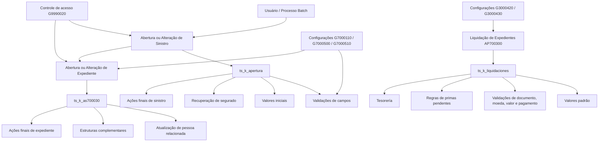
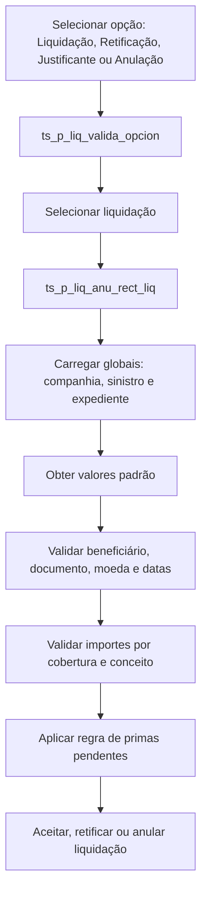

# Lógicas de Negócio de Sinistros, Expedientes e Liquidações no Reef

## 1. Metadados do Documento
- **Arquivo de Origem:** Não identificado no conteúdo extraído
- **Tipo de Documento:** Especificação Técnica / Documentação de Lógicas de Negócio
- **Domínio / Sistema:** Reef — gestão de sinistros, expedientes e liquidações
- **Público-Alvo:** Desenvolvedores, arquitetos, equipes de operação, analistas funcionais e manutenção de aplicações
- **Data/Versão Identificada:** Não identificada

---

## 2. Resumo Executivo & Contexto de Negócio

O documento descreve lógicas de negócio utilizadas pelo sistema Reef no domínio de sinistros. O conteúdo cobre a abertura, alteração, reabilitação e encerramento de sinistros e expedientes, além dos processos de liquidação, documentação, validação de dados, cálculo de valores e controles de acesso.

A implementação é apresentada principalmente como procedimentos e funções, em sua maioria associados a packages como `ts_k_apertura` e `ts_k_liquidaciones`. Esses objetos recebem dados contextuais — como companhia, sinistro, expediente, cobertura, ramo e moeda — e retornam indicadores, valores iniciais, valores máximos, valores validados ou executam ações posteriores a eventos do processo.

A arquitetura funcional permite parametrizar comportamentos por instalação, setor, ramo, programa e tipo de expediente. Essa flexibilidade é aplicada, por exemplo, à definição de acesso a programas, obrigatoriedade de documentos, visibilidade de estruturas, valores padrão de abertura, tratamento de primas pendentes e validações de liquidações.

O documento também registra valores de referência da versão de núcleo para várias regras. Esses valores não devem ser interpretados como universais para todas as instalações: representam o comportamento explicitamente citado para a versão de núcleo ou para a versão TRN.

---

## 3. Arquitetura, Componentes & Tecnologias Envolvidas

### Componentes e packages identificados

| Componente / Objeto | Papel identificado |
| :--- | :--- |
| `ts_k_apertura` | Package com lógicas de validação, valores iniciais e ações de abertura, modificação e reabertura de sinistros e expedientes. |
| `ts_k_liquidaciones` | Package que reúne funções e procedimentos usados no processo de liquidação de expedientes. |
| `ts_k_as700040` | Chama a validação de causa por meio de `p_marca_causa`. |
| `ts_k_ap700105` | Chama a obtenção do valor inicial por `p_devuelve_imp_inicial`. |
| `ts_k_ap700113` | Chama validação de importe por `p_v_importe`. |
| `ts_k_ap700300` | Processo de liquidação; chama lógicas de importes, validações e aceitação de liquidação. |
| `ts_k_cabsini` | Executa controle de acesso na cabeceira de sinistros. |
| `ts_k_cabexp` | Executa controle de acesso na cabeceira de expedientes. |
| `ts_k_g7000110` | Avalia obrigatoriedade e visibilidade de estruturas. |
| `ts_k_g7000500` | Avalia obrigatoriedade e validação de identificadores de documentos. |
| `ts_k_g7000510` | Avalia obrigatoriedade de documentos por tipo de expediente. |
| `ts_k_a7001005` | Processa baixa de capital por sinistro e acessórios. |
| `ts_k_ap700978` | Atualiza dados do segurado no nível de sinistro. |
| `ts_k_ap700975` | Atualiza dados do terceiro no nível de sinistro. |
| `ts_k_ap700150` | Atualiza dados do segurado no nível de expediente. |
| `ts_k_ap700124` | Finaliza modificação de expedientes. |
| `ts_k_ap700115` | Finaliza reabilitação de sinistros. |
| `ts_k_as700030` | Rotina de abertura de expedientes. |
| `ts_k_ap300000` | Faturamento; chama lógicas para importes ajustados e importes a pagar. |
| `ts_k_ap700610` | Obtém e valida importes de ordens de peritação. |
| `Reef.core` | Referência à versão de núcleo do produto em algumas lógicas de valores padrão. |
| `Tesorería` | Área destinatária da informação sobre compensação de primas/recibos pendentes contra pagamento de sinistro. |



### Fluxo funcional de liquidações



---

## 4. Regras de Negócio, Especificações Funcionais & Processos

### 4.1 Causas, valores iniciais e valores máximos

- `nom_prg_valida_causa` valida a causa selecionada no processo de sinistros. A chamada é realizada por `ts_k_as700040.p_marca_causa`.
- `nom_prg_imp_inicial` devolve o importe inicial usado no ajuste de reservas e na alteração de valoração de expediente. A chamada ocorre por `ts_p_reserva_promedio_exp` e `ts_k_ap700105.p_devuelve_imp_inicial`.
- Nas lógicas de valoração inicial, o valor deve ser atribuído às duas globais para funcionar tanto em abertura com valoração média quanto com valoração ajustada.
- `nom_prg_validacion` devolve o importe máximo para ajuste de reservas e alteração de valoração por cobertura e conceito de reserva.
- Quando o parâmetro de tabela indicar que a mesma lógica de valoração máxima deve ser usada em liquidações, a lógica também será executada nas liquidações de expediente por cobertura e conceito de reserva.
- A lógica de valor máximo é chamada por `ts_k_ap700113.p_v_importe` e `ts_k_ap700300.p_aceptar_liquidacion`.

### 4.2 Controle de acesso a programas — `G9990020`

- A configuração é definida por setor, ramo e código de programa.
- Podem ser usados setor `999` e ramo `999`.
- A lógica é executada após a introdução do número de sinistro ou de expediente, tanto na cabeceira de sinistros quanto na cabeceira de expedientes.
- Cada lógica deve controlar a mensagem de erro apresentada ao usuário.
- O código do programa cujo acesso foi negado deve ser concatenado à mensagem de erro.

### 4.3 Observações do plano de tramitação

- `nom_prg_obs_tramite` define lógicas que devolvem observações por meio da global `obs_tramite`.
- A global `nom_prg_obs_tramite` é carregada após informar o sinistro e/ou expediente nas cabeceiras.
- A lógica é executada no fim de cada programa.
- Quando a chamada for realizada pelo Plano de Tramitación, esse plano recolhe `obs_tramite` e grava a informação como observação do plano.

### 4.4 Estruturas por setor e ramo — `G7000110`

- `nom_pgm_mca_obligatorio` indica se uma estrutura de informação é obrigatória na tramitação de sinistros.
- `nom_prg_muestra_est` indica se uma estrutura deve ser apresentada em TW.
- O controle de visibilidade prevalece sobre a marca de obrigatoriedade.
- A regra existe para compatibilidade entre NWT e TW, pois algumas companhias possuem estruturas usadas exclusivamente no NWT.

### 4.5 Baixa de capital por sinistro — `A7001005`

- Ao finalizar um expediente, aplica-se a baixa de capital quando `a1002150.mca_baja_suma_aseg_stro = 'S'`.
- `ts_p_trata_acc_7001005_trn` insere em `a7001005` os acessórios afetados pelo sinistro ou expediente.
- Os acessórios são obtidos de `a7001090`.
- Se o acessório já existir em `a7001005` e ainda não tiver sido efetuado o suplemento de baixa de capital, o acessório é lido.
- Caso contrário, o acessório é inserido em `a7001005`.
- Quando algum acessório for inserido, o registro com `cod_accesorio = 0` é excluído para a cobertura em tratamento.

### 4.6 Abertura de sinistros

O package `ts_k_apertura` contém validações adicionais e funções de valores padrão usadas na abertura de sinistros.

**Validações identificadas:**
- Número de sinistro de referência: `ts_p_aper_num_sini_ref`.
- Data de ocorrência: `ts_p_aper_fec_sini`.
- Hora de ocorrência: `ts_p_aper_hora_sini`.
- Data de denúncia: `ts_p_aper_fec_denu`.
- Hora de denúncia: `ts_p_aper_hora_denu`.
- Número de apólice: `ts_p_aper_num_poliza`.
- Número de aplicação: `ts_p_aper_num_apli`.
- Número de risco: `ts_p_aper_num_riesgo`.
- Relação com segurado: `ts_p_aper_relacion_aseg`.

`ts_p_aper_relacion_aseg` devolve os dados do segurado conforme o tipo de relação e devolve dados com `tip_relacion = '5'`.

**Valores iniciais identificados:**
- Datas e horas de sinistro e denúncia.
- Número de apólice, risco e aplicação.
- Tipo de relação e dados do contato.
- Consulta de histórico/vigência.
- Alterabilidade da data de sinistro.
- Permissão para sinistrar apólice ou risco não vigente.
- Tipo de apólice: real ou fictícia.
- Consideração de suplementos temporários.

### 4.7 Valores de referência explicitamente citados para a versão de núcleo

| Função | Valor de núcleo citado | Significado |
| :--- | :--- | :--- |
| `ts_f_aper_cons_his_def` | `V` | Exibe informação em vigência ou início na abertura de sinistros. |
| `ts_f_modifica_fec_sini` | `S` | Permite modificar a data do sinistro. |
| `ts_f_aper_no_vig_no_apli` | `N` | Não permite sinistrar apólice não vigente. |
| `ts_f_aper_tip_poliza_stro` | `R` | Tipo de apólice real. |
| `ts_f_aper_mca_spto_temp` | `S` | Considera suplementos temporários. |
| `ts_f_aper_sini_a_futuro` | `N` | Não permite abertura de sinistros futuros. |
| `ts_f_extemporaneidad` | `S` na versão TRN | Considera a tabela de extemporaneidade `G7000900`. |
| `ts_f_menu_opciones_sini` | `AP700125,1` | Menu de opções de dados variáveis de sinistro. |
| `ts_f_menu_opciones_exp` | `AP700126,1` | Menu de opções de dados variáveis de expediente. |
| `ts_f_fec_solicitud_def` | Data do sistema | Data padrão de solicitação de documentação. |
| `ts_f_fec_recepcion_def` | `NULL` | Data padrão de recepção de documentação. |
| `ts_f_per_tram_super` | `S` | Permite visibilidade de abas e valores especificados. |
| `ts_f_liq_perm_con_ord_pend` | `N` | Não permite liquidações com ordens de reparação pendentes. |
| `ts_f_liq_perm_cons_act` | `TRUE` | Permite visualizar pagamentos profissionais. |
| `ts_f_liq_tip_docto_defecto` | `FA` | Tipo padrão de documento de liquidação. |
| `ts_f_tipo_iva_defecto` | `E` | Tipo de IVA isento. |
| `ts_f_liq_fec_recep_fra_def` | Data do sistema | Data padrão de recepção da fatura. |
| `ts_f_fec_est_pago` | `fec_proceso` | Data estimada de pagamento. |

### 4.8 Ações finais e recuperação de dados

- `ts_p_final_aper_stro` executa ação após abertura de sinistro, antes de excluir as globais.
- `ts_p_final_modif_stro` executa ação no fim da modificação de sinistro.
- `ts_p_final_reap_stro` executa ação no fim da reabertura de sinistro.
- `ts_k_apertura.f_saca_suma_aseg_cob` devolve a soma segurada da cobertura na moeda do expediente.
- `ts_p_aper_max_spto_40` devolve máximo suplemento e máximo suplemento de aplicação da tabela `a2000040`.
- `ts_p_aper_imp_cons_stro` acumula, para os expedientes de um sinistro, os totais de valoração inicial, valoração atual, liquidado e pago.
- `ts_p_aper_recupera_aseg` recupera as informações do segurado da apólice.
- `ts_p_aper_sini_antes_exp` executa validações anteriores à gravação em tabelas no encerramento da abertura do sinistro.
- `ts_p_val_matri_contrario` é indicado como “No se usa” em uma ocorrência e também como usado no programa `AP700975`; o documento não esclarece a discrepância.

### 4.9 Documentação, segurados, terceiros e expedientes

- `ts_p_actualiza_persona_rel` deve ser chamado por estruturas que capturam dados do expediente para atualizar a pessoa relacionada na tabela `A7001000`.
- Os dados podem ser atribuídos diretamente às globais `tip_docum_exp`, `cod_docum_exp`, `nombre_exp` e `apellidos_exp`.
- `ts_k_g7000500.f_nom_prg_oblig_num_doc` determina se o número/identificador de documento é obrigatório.
- `ts_k_g7000500.f_nom_prg_val_num_doc` valida o número/identificador de documento.
- `ts_k_g7000510.f_nom_prg_mca_obligatorio` determina se o documento é obrigatório para o tipo de expediente.
- `ts_p_val_datos_aseg_aut` é chamado após atualização de dados do segurado nos níveis de sinistro e expediente.
- `ts_p_val_datos_cont_aut` é chamado após atualização de dados do terceiro nos níveis de sinistro e expediente.
- `ts_p_val_fec_solicitud` e `ts_p_val_fec_recepcion` validam datas de solicitação e recepção de documentos.
- `ts_f_per_tram_super` controla permissões de tramitador e supervisor para visibilidade de abas econômicas, valorações e importes.

### 4.10 Abertura, alteração e visibilidade de expedientes

- `ts_p_final_aper_exp` é executado ao final da abertura de expediente, antes das estruturas complementares.
- Na versão de núcleo, nos ramos com gestão de fundos, a abertura de expediente de morte ou invalidez insere um registro em `rl_lss_nwt_xx_elp`.
- Nesse registro, as marcas de suplemento `enr` e de geração de ordem de pagamento `atm_pyo` recebem `N`.
- `ts_p_final_aper_exp_completa` é executado após as estruturas complementares.
- `pgm_typ_fil` controla se um tipo de expediente é ou não exibido na lista de tipos abríveis.
- `ts_p_final_modif_exp` é executado ao final da modificação de expediente, após as estruturas complementares.

### 4.11 Liquidações

- O processo `AP700300` prevê validações ou valores padrão para praticamente todos os campos da liquidação.
- As globais comuns fornecidas aos procedimentos e funções incluem `cod_cia`, `num_sini` e `num_exp`.
- O valor de cada campo tratado é armazenado em global, permitindo que validações posteriores utilizem informações já capturadas.
- O documento indica como fonte complementar o arquivo `Proceso_de_Liquidaciones_de_Siniestros.doc`.

**Importes:**
- `G3000420.nom_prg_1`: importe inicial de conceitos de cobrança e pagamento diverso.
- `G3000420.nom_prg_2`: importe máximo de conceitos de cobrança e pagamento diverso.
- `G3000430.nom_prg_1`: obtém importe ajustado a partir de importe faturado menos gastos não cobertos.
- `G3000430.nom_prg_2`: obtém importe a pagar a partir do importe ajustado, incluindo dedutíveis e esgotamentos de cobertura.
- `nom_prg_ini_orden`: importe inicial de valoração de ordem de peritação.
- `nom_prg_max_orden`: importe máximo de valoração de ordem de peritação.

**Primas pendentes:**
- `TYP_APY_RCP_PND = 1`: importe pendente na data de ocorrência do sinistro.
- `TYP_APY_RCP_PND = 2`: importe pendente na data de vencimento da apólice.
- `TYP_APY_RCP_PND = 3`: não se aplica.
- `TYP_APY_RCP_PND_PRD_TYP_VAL = 3`: armazena procedimento.
- `TYP_APY_RCP_PND_PRD_TYP_VAL = 4`: armazena função.

---

## 5. Tabelas de Parâmetros, Ambientes e Estruturas de Dados

| Item / Parâmetro | Descrição / Função | Tipo / Valores / Formato | Ambiente / Observações |
| :--- | :--- | :--- | :--- |
| `cod_cia` | Código da companhia. | Código. | Usado extensivamente. |
| `num_sini` | Número do sinistro. | Número/identificador. | Usado em abertura, expediente e liquidação. |
| `num_exp` | Número do expediente. | Número/identificador. | Associado ao sinistro. |
| `cod_ramo` | Código do ramo. | Código. | Usado em parametrizações e cálculos. |
| `cod_cob` | Código da cobertura. | Código. | Usado em reservas, capital e liquidações. |
| `cod_cto_rva` | Código do conceito de reserva. | Código. | Usado em valores e liquidações. |
| `cod_causa_sini` | Código da causa do sinistro. | Código. | Usado em validações e importes. |
| `cod_consecuencia` | Código da consequência. | Código. | Usado em lógica de importes. |
| `max_spto_40` | Máximo suplemento da tabela `a2000040`. | Valor retornado. | Calculado por `ts_p_aper_max_spto_40`. |
| `max_spto_apli_40` | Máximo suplemento de aplicação da tabela `a2000040`. | Valor retornado. | Calculado por `ts_p_aper_max_spto_40`. |
| `imp_inicial` | Importe inicial. | Valor monetário. | Ajuste de reservas, valoração e liquidação. |
| `suma_aseg` | Soma segurada. | Valor monetário. | Pode ser devolvida para cobertura. |
| `obs_tramite` | Observação para Plano de Tramitación. | Texto/global. | Inserida pelo plano quando aplicável. |
| `mca_obligatorio` | Indicador de obrigatoriedade. | Marca. | Estruturas e documentos. |
| `mca_muestra_est` | Indicador de visibilidade de estrutura. | Marca. | Prevalece sobre obrigatoriedade. |
| `mca_typ_fil_vsb` | Indicador de visibilidade de tipo de expediente. | Marca. | Saída de `pgm_typ_fil`. |
| `mca_oblig_num_doc` | Indica obrigatoriedade do documento. | Marca. | Códigos de documentos `G7000500`. |
| `fec_proceso` | Data de processo. | Data. | Usada como padrão de pagamento em núcleo. |
| `cod_mon_liq` | Moeda da liquidação. | Código de moeda. | Validada contra moeda de pagamento e documento. |
| `cod_mon_pago` | Moeda de pagamento. | Código de moeda. | Uma das moedas deve ser a moeda do país quando diferentes. |
| `cod_mon_fra` | Moeda do documento/fatura. | Código de moeda. | Usada na validação de moeda do documento. |
| `tip_dcto` | Tipo de documento. | `FA`, `BV`, `NC` citados. | Usado para validação e IVA. |
| `TYP_APY_RCP_PND` | Regra para primas/recibos pendentes. | `1`, `2` ou `3`. | Comunicação para Tesorería. |
| `TYP_APY_RCP_PND_PRD_TYP_VAL` | Tipo de objeto da regra de primas pendentes. | `3` procedimento; `4` função. | Define o conteúdo de `TYP_APY_RCP_PND_PRD_NAM`. |
| `TYP_APY_RCP_PND_PRD_NAM` | Nome do procedimento/função de primas pendentes. | Nome de objeto. | Depende de `TYP_APY_RCP_PND_PRD_TYP_VAL`. |

---

## 6. Bateria de Perguntas & Respostas para RAG (FAQ Sintético)

### P1: Como o Reef controla o acesso de um usuário a programas de sinistros e expedientes?
**R:** O controle ocorre pela configuração `G9990020`, definida por setor, ramo e código de programa. A lógica é executada após a informação do sinistro ou expediente nas cabeceiras. Setor e ramo `999` são aceitos. A lógica deve produzir a mensagem de erro e concatenar o código do programa cujo acesso está sendo negado.

### P2: Em que situações é utilizado `nom_prg_imp_inicial`?
**R:** `nom_prg_imp_inicial` devolve o importe inicial usado no ajuste de reservas e na mudança de valoração de um expediente. É chamado por `ts_p_reserva_promedio_exp` e por `ts_k_ap700105.p_devuelve_imp_inicial`.

### P3: Como funciona a regra de baixa de capital por sinistro?
**R:** Ao terminar o expediente, a baixa de capital é aplicada quando `a1002150.mca_baja_suma_aseg_stro` for igual a `S`. A lógica obtém acessórios de `a7001090`, lê ou insere os acessórios em `a7001005` conforme exista suplemento de baixa de capital e, quando inserir acessórios, remove o registro de acessório `0` da cobertura tratada.

### P4: Quais campos possuem validações adicionais na abertura de sinistros?
**R:** O documento identifica validações extras para número de sinistro de referência, data e hora de ocorrência, data e hora de denúncia, número de apólice, aplicação, risco e relação do segurado.

### P5: Qual é o comportamento padrão de núcleo para abertura de sinistros futuros?
**R:** A função `ts_f_aper_sini_a_futuro` devolve `N` na versão de núcleo. Segundo o documento, esse indicador define se uma instalação permite ou não abrir sinistros futuros.

### P6: Como o sistema determina se uma estrutura de sinistro é obrigatória ou visível?
**R:** Em `G7000110`, `nom_pgm_mca_obligatorio` define se a estrutura é obrigatória e `nom_prg_muestra_est` define se ela será apresentada em TW. A visibilidade determinada por `nom_prg_muestra_est` prevalece sobre a obrigatoriedade.

### P7: O que acontece na abertura de expediente de morte ou invalidez em ramos com gestão de fundos?
**R:** Na versão de núcleo, `ts_p_final_aper_exp` insere, antes das estruturas complementares, um registro na tabela `rl_lss_nwt_xx_elp`. As marcas `enr` e `atm_pyo` recebem o valor `N`.

### P8: Como são tratadas as primas pendentes no processo de liquidação?
**R:** A tabela `DF_LSF_NWT_XX_PPD` informa à Tesorería se recibos ou primas pendentes devem ser compensados contra o pagamento do sinistro. O tipo `1` considera o importe pendente na data de ocorrência; o tipo `2`, na data de vencimento da apólice; e o tipo `3` não aplica a regra.

### P9: Qual regra é aplicada quando a moeda de pagamento e a moeda da liquidação são diferentes?
**R:** `ts_p_valida_moneda_de_pago` valida que, se `cod_mon_pago` e `cod_mon_liq` forem diferentes, uma das duas moedas deve ser a moeda do país.

### P10: Quais valores padrão de documentos são citados para liquidações na versão de núcleo?
**R:** A versão de núcleo devolve `FA` como tipo padrão de documento em `ts_f_liq_tip_docto_defecto`, devolve `E` como tipo padrão de IVA em `ts_f_tipo_iva_defecto`, e devolve a data do sistema como padrão de data de recepção de fatura em `ts_f_liq_fec_recep_fra_def`.

### P11: O que valida `ts_p_liq_valida_imp_liq`?
**R:** O procedimento valida o importe liquidado por cobertura, conceito de reserva e conceito de cobrança/pagamento diverso. Ele complementa o controle de importe máximo configurado em `G3000420` quando for necessário controlar por tipo de documento.

### P12: Como são obtidos os totais financeiros de um sinistro?
**R:** `ts_p_aper_imp_cons_stro` percorre os expedientes do sinistro recebido como parâmetro e acumula os totais de valoração inicial, valoração atual, liquidado e pago. As saídas são `tot_imp_val_ini`, `tot_imp_val`, `tot_imp_val_liq` e `tot_imp_val_pag`.

---

## 7. Glossário de Termos, Siglas & Conceitos-Chave

- **AP700300:** Processo de Liquidação de Expedientes.
- **AP700103:** Solicitação de Documentação de Expedientes.
- **AP700115:** Reabilitação de Sinistros.
- **AP700117:** Abertura de Expedientes.
- **AP700119:** Modificação de Sinistros.
- **AP700124:** Modificação de Expedientes.
- **BM25:** Método de recuperação lexical; não é mencionado no documento-fonte, mas é aplicável ao consumo do conteúdo estruturado.
- **Cobertura (`cod_cob`):** Código da cobertura associada a um sinistro ou expediente.
- **Conceito de reserva (`cod_cto_rva`):** Código utilizado na valoração, reserva e liquidação.
- **Expediente (`num_exp`):** Registro de tramitação associado a um sinistro.
- **FA:** Tipo de documento padrão citado para liquidações; o documento o apresenta como tipo de documento.
- **G3000420:** Tabela de conceitos de cobrança/pagamento diverso por tipo de expediente e conceito de reserva.
- **G3000430:** Tabela de desdobramento de conceito de cobrança/pagamento diverso e conceito de reserva.
- **G7000110:** Estruturas por setor e ramo.
- **G7000500:** Códigos de documentos.
- **G7000510:** Códigos de documentos por tipo de expediente.
- **G9990020:** Controle de acesso a programas.
- **IVA:** Imposto sobre valor agregado; `E` é citado como isento.
- **NWT:** Sistema citado em regras de compatibilidade com TW.
- **Plano de Tramitación:** Mecanismo que recolhe `obs_tramite` e a insere como observação de plano.
- **Reef.core:** Versão de núcleo do Reef mencionada como referência de valores padrão.
- **Sinistro (`num_sini`):** Evento de sinistro tratado pelo sistema.
- **Tesorería:** Área que recebe a indicação sobre compensação de primas pendentes.
- **TRN:** Referência de versão/ambiente citada para `ts_f_extemporaneidad`.
- **TW:** Sistema citado no controle de visibilidade de estruturas.

---

## 8. Notas Críticas, Riscos & Limitações

- **Ausência de metadados:** O texto extraído não identifica o nome do arquivo, autor documental, data ou versão formal.
- **Dependência de parâmetros e globais:** Grande parte das lógicas depende de globais e de configuração por instalação, companhia, setor, ramo, programa, cobertura e expediente. Alterações de parametrização podem modificar o comportamento operacional.
- **Versão de núcleo não é regra universal:** Valores como `N`, `S`, `V`, `R`, `FA` e `E` são explicitamente associados à versão de núcleo ou TRN em determinados pontos; não devem ser assumidos para instalações customizadas.
- **Documento complementar:** O detalhamento do processo de liquidações é referido no documento `Proceso_de_Liquidaciones_de_Siniestros.doc`, que não foi fornecido.
- **Contradição documental:** `ts_p_val_matri_contrario` é descrito como “No se usa” em uma seção e, em outra, é indicado como utilizado pelo programa `AP700975`. O conteúdo não fornece critério para resolver essa inconsistência.
- **Contratos técnicos não detalhados:** O documento lista procedimentos, funções, parâmetros e pontos de chamada, mas não descreve implementações SQL/PLSQL, formatos de mensagens de erro, estruturas JSON, métodos HTTP, URLs, portas, logs ou contratos de integração.
- **Extração com caracteres corrompidos:** Há ocorrências de caracteres de controle/substituição em termos como “modificación”, “final” e “definición”. A interpretação foi mantida no contexto sem criar informações não presentes.

---

## 9. Conteúdo Bruto Estruturado (Referência Fiel)

```text
O conteúdo bruto de referência compreende 20 páginas de documentação Reef sobre:
- Lógicas de negócio de sinistros por ramo.
- Validação de causas e recuperação de tramitadores/supervisores.
- Importes iniciais e máximos para reservas, valorações e liquidações.
- Controle de acesso a programas por setor, ramo e programa.
- Observações para Plano de Tramitación.
- Estruturas obrigatórias e visíveis por setor e ramo.
- Baixa de capital por sinistros e tratamento de acessórios.
- Package ts_k_apertura: validações, valores iniciais, recuperação de segurado,
  ações finais, abertura, modificação e reabilitação de sinistros.
- Estruturas de sinistros e expedientes, documentos, segurados e terceiros.
- Abertura e modificação de expedientes.
- Tabelas G3000420 e G3000430 para importes de liquidações.
- Processo AP700300 e package ts_k_liquidaciones.
- Valores padrão, regras de moedas, documentos, IVA, pagamento e beneficiários.
- Aplicação de primas pendentes e controles extras de liquidações.
- Validações de documentos, moeda, câmbio, datas, importes e observações.

A transcrição literal integral foi fornecida como conteúdo de entrada desta análise,
incluindo as marcações `--- [PÁGINA 1 DE 20] ---` até
`--- [PÁGINA 20 DE 20] ---`. Para evitar duplicação não controlada e preservar
a rastreabilidade, esta seção referencia aquele conteúdo original como fonte fiel.

Nota de Análise: O material contém nomes de objetos, parâmetros, tabelas,
packages e pontos de chamada, mas não detalha código-fonte, contratos de APIs,
rotas de logs, ambientes, URLs, versões formais ou procedimentos de implantação.
```
