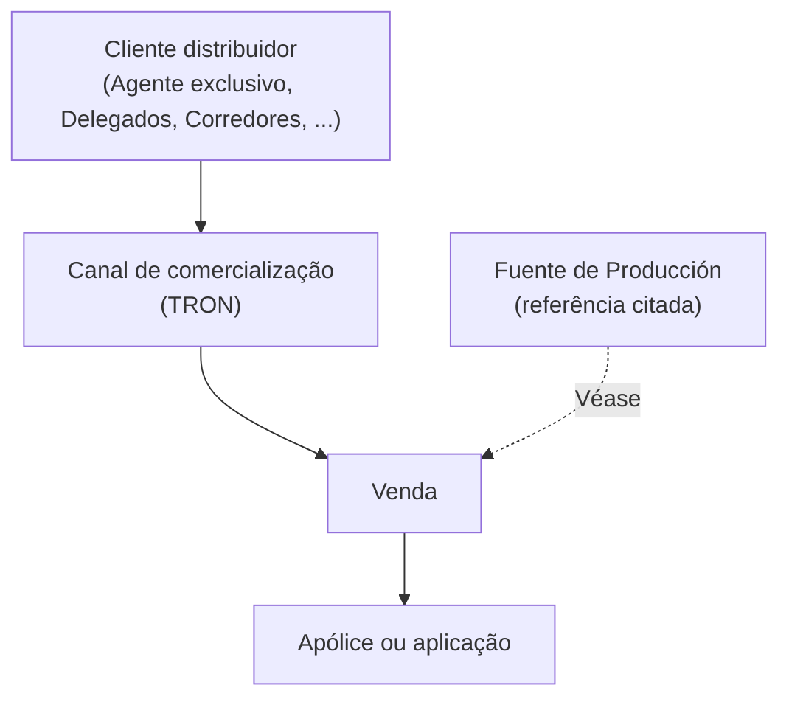

# TRON — Definição de Canal de Comercialização

## 1. Metadados do Documento
- **Arquivo de Origem:** Não identificado no conteúdo fornecido
- **Tipo de Documento:** Documentação corporativa
- **Domínio / Sistema:** TRON; Reef; Mapfredocument
- **Público-Alvo:** Negócio, arquitetura e usuários de documentação
- **Data/Versão Identificada:** Não identificada

---

## 2. Resumo Executivo & Contexto de Negócio

O conteúdo apresenta uma definição funcional de **Canal** no domínio TRON. Um canal de comercialização é descrito como a forma específica pela qual um cliente distribuidor conclui a venda de uma apólice ou aplicação.

Os exemplos de clientes distribuidores listados são **Agente exclusivo**, **Delegados** e **Corredores**. O texto também referencia a entidade ou conceito **Fuente de Producción** como fonte complementar para a compreensão da venda de uma apólice ou aplicação.

O material está associado a referências de documentação denominadas **Documentation / DOCUMENTACIÓN Reef**, **DOCUMENTACIÓN Reef** e **Mapfredocument**. O conteúdo registra ainda um proprietário identificado como `user:agonzalez_mapfre.com` e ciclo de vida `Approved`.

O extrato não apresenta detalhes adicionais sobre arquitetura técnica, APIs, contratos, métodos HTTP, estruturas de dados, ambientes, regras de validação ou processos operacionais.

---

## 3. Arquitetura, Componentes & Tecnologias Envolvidas

Os elementos explicitamente citados são TRON, Canal, cliente distribuidor, apólice, aplicação, Fuente de Producción, Reef, Mapfredocument e Zeus.



**Nota de Análise:** O documento não descreve interfaces técnicas, integrações, responsabilidades de componentes, tecnologias de implementação ou fluxos de dados além da relação conceitual entre canal, cliente distribuidor e venda.

---

## 4. Regras de Negócio, Especificações Funcionais & Processos

1. Um **Canal de comercialização** é a forma específica pela qual um cliente distribuidor fecha uma venda.
2. A venda mencionada pode corresponder a uma **apólice** ou a uma **aplicação**.
3. Os tipos exemplificados de cliente distribuidor são:
   - Agente exclusivo;
   - Delegados;
   - Corredores.
4. O conteúdo orienta consultar **Fuente de Producción** para referência relacionada à venda de apólice ou aplicação.
5. Não foram fornecidos critérios de elegibilidade, validações, cálculos, estados operacionais, exceções ou regras de roteamento para canais.

---

## 5. Tabelas de Parâmetros, Ambientes e Estruturas de Dados

| Item / Parâmetro | Descrição / Função | Tipo / Valores / Formato | Ambiente / Observações |
| :--- | :--- | :--- | :--- |
| Canal | Forma específica pela qual um cliente distribuidor fecha uma venda. | Conceito de comercialização | Domínio TRON |
| Cliente distribuidor | Participante que realiza o fechamento da venda por meio de um canal. | Agente exclusivo; Delegados; Corredores; `...` | Exemplos fornecidos no texto |
| Venda | Ação concluída pelo cliente distribuidor através de um canal. | Venda de apólice ou aplicação | Referência a Fuente de Producción |
| Apólice | Um dos objetos de venda citados. | Não detalhado | Sem especificação adicional |
| Aplicação | Um dos objetos de venda citados. | Não detalhado | Sem especificação adicional |
| Fuente de Producción | Referência indicada pelo texto com “Véase Fuente de Producción”. | Não detalhado | Relação e conteúdo não detalhados |
| Documentation / DOCUMENTACIÓN Reef | Referência de documentação exibida. | Nome/área de documentação | Sem detalhamento adicional |
| Mapfredocument | Nome exibido no conteúdo. | Não detalhado | Sem relação técnica explicitada |
| Owner | Proprietário registrado na documentação. | `user:agonzalez_mapfre.com` | Literalmente informado |
| Lifecycle | Estado de ciclo de vida registrado. | `Approved` | Literalmente informado |
| Navegação | Itens exibidos na página de documentação. | Buscar, Inicio, Soluciones, Arquitecturas, APIs, Componentes, Cloud, Documentación, Zeus, Reef, Ayuda | Idioma exibido: `ES` |

---

## 6. Bateria de Perguntas & Respostas para RAG (FAQ Sintético)

### P1: O que é um Canal no contexto TRON?
**R:** Um Canal é a forma específica pela qual um cliente distribuidor fecha a venda de uma apólice ou aplicação.

### P2: Quem pode atuar como cliente distribuidor na definição de Canal?
**R:** O texto cita como exemplos de cliente distribuidor um Agente exclusivo, Delegados e Corredores, além de indicar que podem existir outros tipos por meio da reticência `...`.

### P3: Qual é o objeto da venda realizada por um cliente distribuidor?
**R:** A venda pode ser de uma apólice ou de uma aplicação, conforme a definição de Canal apresentada no conteúdo.

### P4: Qual referência complementar é indicada para compreender a venda?
**R:** O texto indica “Véase Fuente de Producción”, isto é, recomenda consultar Fuente de Producción. O conteúdo fornecido não detalha essa referência.

### P5: O documento especifica como os canais são implementados tecnicamente?
**R:** Não. O conteúdo não apresenta tecnologias, APIs, métodos HTTP, contratos JSON, bancos de dados, URLs ou detalhes de implementação técnica.

### P6: O documento informa regras de validação para venda por canal?
**R:** Não. A definição descreve apenas que o canal é a forma pela qual um cliente distribuidor fecha uma venda de apólice ou aplicação.

### P7: Qual é o estado de ciclo de vida informado para a documentação?
**R:** O estado de ciclo de vida informado é `Approved`.

### P8: Quem é o proprietário registrado no conteúdo?
**R:** O proprietário registrado é `user:agonzalez_mapfre.com`.

### P9: Quais referências de documentação são mencionadas?
**R:** São mencionadas `Documentation / DOCUMENTACIÓN Reef`, `DOCUMENTACIÓN Reef` e `Mapfredocument`.

### P10: O que a navegação exibida revela sobre o portal de documentação?
**R:** A navegação apresenta as opções Buscar, Inicio, Soluciones, Arquitecturas, APIs, Componentes, Cloud, Documentación, Zeus, Reef e Ayuda. O texto não descreve o conteúdo dessas áreas.

---

## 7. Glossário de Termos, Siglas & Conceitos-Chave

- **TRON:** Contexto ou domínio indicado no título “TÉRMINOS (TRON)”; o conteúdo não expande a sigla ou nome.
- **Canal:** Forma específica pela qual um cliente distribuidor fecha a venda de uma apólice ou aplicação.
- **Cliente distribuidor:** Entidade que utiliza um canal de comercialização para fechar uma venda.
- **Agente exclusivo:** Exemplo de cliente distribuidor citado no texto.
- **Delegados:** Exemplo de cliente distribuidor citado no texto.
- **Corredores:** Exemplo de cliente distribuidor citado no texto.
- **Apólice:** Um dos objetos de venda mencionados.
- **Aplicação:** Um dos objetos de venda mencionados.
- **Fuente de Producción:** Referência complementar citada para consulta; sem definição adicional no extrato.
- **Reef:** Nome presente nas referências de documentação e na navegação.
- **Zeus:** Nome presente na navegação; sem definição adicional.
- **Mapfredocument:** Nome presente no conteúdo; sem definição adicional.
- **Lifecycle:** Campo de ciclo de vida da documentação, com valor `Approved`.
- **Owner:** Campo de proprietário da documentação.

---

## 8. Notas Críticas, Riscos & Limitações

- O conteúdo é resumido e define somente o conceito de Canal no contexto TRON.
- Não há detalhamento sobre métodos HTTP, APIs, contratos de integração, campos de dados, autenticação, ambientes, logs, servidores ou URLs.
- A referência a **Fuente de Producción** não contém explicação complementar no texto fornecido.
- TRON, Reef, Zeus e Mapfredocument são citados, mas suas responsabilidades e relações técnicas não são especificadas.
- **Nota de Análise:** O documento lista a navegação de uma plataforma de documentação, porém não detalha os conteúdos funcionais ou técnicos de cada área.

---

## 9. Conteúdo Bruto Estruturado (Referência Fiel)

```text
--- [PÁGINA 1 DE 1] ---

TÉRMINOS (TRON)
Canal
Un Canal de comercialización es la forma especíca por la cual un cliente distribuidor (Agente exclusivo, Delegados, Corredores, ... ) cierra la
venta de una póliza o aplicación (Véase Fuente de Producción)
Documentation / DOCUMENTACIÓN Reef
DOCUMENTACIÓN Reef
Mapfredocument
DOCUMENTACIÓN Reef
Owner
user:agonzalez_mapfre.com
Lifecycle
Approved Source
 / 
 VL
Buscar Inicio Soluciones Arquitecturas APIs Componentes Cloud Documentación Zeus Reef Ayuda
ES
```
