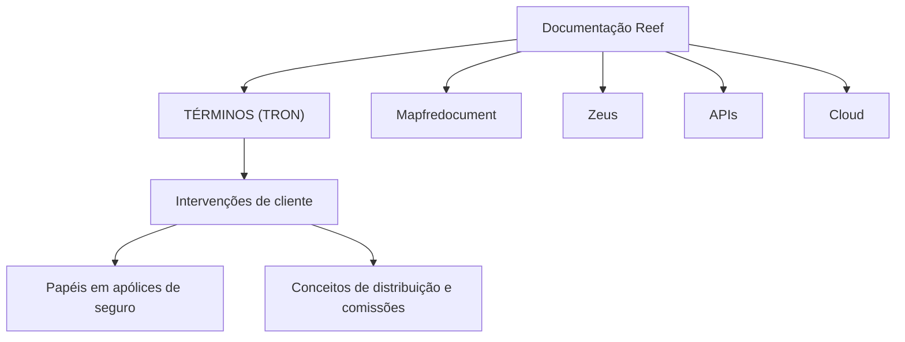

# Glossário de Intervenientes de Cliente e Conceitos de Seguros — TRON

## 1. Metadados do Documento
- **Arquivo de Origem:** `Não identificado no conteúdo fornecido`
- **Tipo de Documento:** `Documentação de referência / glossário`
- **Domínio / Sistema:** `TRON; documentação Reef; MAPFRE`
- **Público-Alvo:** `Negócio, analistas funcionais, desenvolvedores e operação`
- **Data/Versão Identificada:** `Não identificada`

---

## 2. Resumo Executivo & Contexto de Negócio

O conteúdo apresenta um glossário de termos relacionados a intervenientes de cliente, papéis em apólices de seguro e conceitos associados à atividade de distribuição e contratação de seguros. O material está identificado como “TÉRMINOS (TRON)” e referencia a documentação Reef.

O foco principal é estabelecer definições para pessoas físicas, pessoas jurídicas e figuras de negócio que podem participar de uma apólice, incluindo tomadores, segurados, condutores, proprietários, beneficiários, agentes, subagentes, pagadores e representantes legais.

O documento também registra conceitos complementares ao ecossistema de seguros, como consórcio, endossatário, preventor, subsídio e Trébol. O conceito de subsídio é relacionado à conta corrente do agente no processo de liquidação de comissões da entidade seguradora.

A extração não descreve fluxos transacionais, métodos de integração, contratos de API, modelos de dados, ambientes técnicos ou regras de validação implementadas pelo sistema TRON. O conteúdo é predominantemente terminológico e conceitual.

---

## 3. Arquitetura, Componentes & Tecnologias Envolvidas

Os elementos técnicos e documentais explicitamente identificados são:

| Componente / Termo | Papel identificado no conteúdo |
| :--- | :--- |
| TRON | Contexto identificado no título “TÉRMINOS (TRON)”. O documento não explica a função técnica do sistema TRON. |
| Reef | Repositório ou contexto de documentação mencionado como “DOCUMENTACIÓN Reef”. |
| Mapfredocument | Item exibido na navegação da documentação Reef. |
| Zeus | Item exibido na navegação da documentação Reef. |
| Cloud | Item exibido na navegação da documentação Reef. |
| APIs | Item exibido na navegação da documentação Reef. |
| Owner | Campo de propriedade documental exibindo `user:agonzalez_mapfre.com`. |
| Lifecycle | Campo documental exibindo o estado `Approved Source`. |
| VL | Valor exibido junto ao estado do ciclo de vida. O significado não é detalhado. |



> **Nota de Análise:** O conteúdo apresenta uma navegação da documentação Reef, mas não detalha integrações, protocolos, APIs, microsserviços, tecnologias de implementação ou fluxo de dados entre TRON, Reef, Mapfredocument e Zeus.

---

## 4. Regras de Negócio, Especificações Funcionais & Processos

### 4.1 Intervenientes e papéis associados a apólices

- **Agente:** pessoa física ou jurídica que, em troca de remuneração, realiza atividade de distribuição e contratação de seguros.
- **Tomador:** terceiro que contrata o seguro com a seguradora e se obriga ao pagamento do prêmio.
- **Tomadores alternos:** figura aplicável quando uma apólice possui mais de um tomador; tomadores adicionais são associados ao tomador padrão.
- **Segurado:** pessoa que, individualmente, em seus bens ou em seus interesses econômicos, está exposta ao risco.
- **Condutor:** pessoa que conduz o veículo segurado.
- **Proprietário:** pessoa que detém o direito de propriedade sobre algum bem.
- **Beneficiário:** pessoa designada na apólice pelo segurado ou contratante como titular dos direitos indenizatórios estabelecidos no documento.
- **Beneficiário vida:** pessoa designada na apólice pelo segurado ou contratante como titular dos direitos indenizatórios estabelecidos no documento.
- **Proponente:** pessoa ou entidade que propõe algo ou alguém.
- **Endossatário:** pessoa física ou jurídica, terceiro, à qual foram cedidos os direitos que corresponderiam ao segurado em caso de sinistro que afetasse o objeto segurado.
- **Tutor legal:** pessoa designada pelo juiz para, sob sua vigilância e controle, representar e administrar legalmente pessoas ou bens de menor de idade ou de incapazes.
- **Subagente:** empregado de um agente colegiado.
- **Pagador:** pessoa responsável por pagar os recibos quando o tomador não realiza esse pagamento.
- **Beneficiário irrevogável:** pessoa designada na apólice pelo segurado ou contratante como titular dos direitos indenizatórios estabelecidos no documento.
- **Beneficiário de cessão de direitos/penhor:** pessoa designada na apólice pelo segurado ou contratante como titular dos direitos indenizatórios estabelecidos no documento.
- **Beneficiários legais:** pessoa designada na apólice pelo segurado ou contratante como titular dos direitos indenizatórios estabelecidos no documento.
- **Beneficiário contingente vida:** termo listado no documento; a definição aparece deslocada na segunda página e corresponde à descrição de pessoa designada na apólice como titular dos direitos indenizatórios.

### 4.2 Conceitos organizacionais e financeiros

- **Consórcio:** agrupamento de empresas ou sociedades para o desenvolvimento conjunto de um negócio importante.
- **Subvenção:** conceito aplicável à conta corrente do agente, dentro do processo de liquidação de comissões da entidade seguradora. Representa ajuda econômica concedida pela realização de atividade considerada de interesse para a companhia, incluindo cobrança de recibos não domiciliados, produtividade na comercialização de apólices e manutenção de apólices de carteira.
- **Trébol:** moeda utilizada no plano de fidelização das entidades MAPFRE. Na Espanha, 1 Trébol equivale a 1 € de desconto no pagamento dos prêmios de seguro dos clientes.
- **Ace:** termo listado sem definição adicional no conteúdo extraído.
- **Preventor:** termo listado sem definição adicional no conteúdo extraído.

> **Nota de Análise:** O documento não especifica regras sistêmicas para cadastrar, validar, priorizar ou relacionar os intervenientes de cliente em uma apólice. As definições são conceituais.

---

## 5. Tabelas de Parâmetros, Ambientes e Estruturas de Dados

| Item / Parâmetro | Descrição / Função | Tipo / Valores / Formato | Ambiente / Observações |
| :--- | :--- | :--- | :--- |
| Agente | Realiza distribuição e contratação de seguros mediante remuneração. | Pessoa física ou jurídica | Domínio de seguros |
| Tomador | Contrata o seguro e se obriga ao pagamento do prêmio. | Terceiro / pessoa | Domínio de seguros |
| Tomadores alternos | Representam tomadores adicionais associados ao tomador padrão. | Um ou mais tomadores adicionais | Aplicável a apólice com mais de um tomador |
| Segurado | Pessoa exposta ao risco em si, em seus bens ou em seus interesses econômicos. | Pessoa | Domínio de seguros |
| Condutor | Conduz o veículo segurado. | Pessoa | Relacionado a veículo segurado |
| Proprietário | Detém direito de propriedade sobre algum bem. | Pessoa | Domínio de seguros |
| Beneficiário | Titular de direitos indenizatórios definidos na apólice. | Pessoa designada | Designado pelo segurado ou contratante |
| Beneficiário vida | Titular de direitos indenizatórios definidos na apólice. | Pessoa designada | Contexto de vida |
| Proponente | Propõe algo ou alguém. | Pessoa ou entidade | Sem detalhamento adicional |
| Endossatário | Recebe cessão dos direitos do segurado em caso de sinistro. | Pessoa física ou jurídica; terceiro | Relacionado ao objeto segurado |
| Consórcio | Agrupamento para desenvolvimento conjunto de negócio importante. | Empresas ou sociedades | Sem detalhamento adicional |
| Ace | Termo listado. | Não informado | Sem definição adicional |
| Tutor legal | Representa e administra legalmente pessoas ou bens de menores ou incapazes. | Pessoa designada pelo juiz | Sob vigilância e controle judicial |
| Subagente | Empregado de agente colegiado. | Pessoa | Domínio de distribuição de seguros |
| Pagador | Realiza pagamento dos recibos quando o tomador não o faz. | Pessoa | Associado ao pagamento de recibos |
| Beneficiário irrevogável | Titular de direitos indenizatórios definidos na apólice. | Pessoa designada | Sem detalhamento adicional |
| Beneficiário de cessão de direitos/penhor | Titular de direitos indenizatórios definidos na apólice. | Pessoa designada | Sem detalhamento adicional |
| Beneficiários legais | Titular de direitos indenizatórios definidos na apólice. | Pessoa designada | Sem detalhamento adicional |
| Subvenção | Ajuda econômica relacionada à conta corrente do agente e à liquidação de comissões. | Ajuda econômica | Exemplos: cobrança, produtividade e manutenção de carteira |
| Trébol | Moeda do plano de fidelização MAPFRE. | 1 Trébol = 1 € de desconto | Equivalência indicada para Espanha |
| Owner | Proprietário documental. | `user:agonzalez_mapfre.com` | Documentação Reef |
| Lifecycle | Estado documental. | `Approved Source` | Documentação Reef |
| VL | Valor exibido junto ao ciclo de vida. | `VL` | Significado não detalhado |

---

## 6. Bateria de Perguntas & Respostas para RAG (FAQ Sintético)

### P1: Qual é a diferença entre tomador e pagador em uma apólice de seguro?
**R:** O tomador é o terceiro que contrata o seguro com a seguradora e se obriga ao pagamento do prêmio. O pagador é a pessoa que realiza o pagamento dos recibos quando o tomador não se encarrega desse pagamento.

### P2: Quando a figura de tomadores alternos se aplica?
**R:** A figura de tomadores alternos se aplica quando uma apólice possui mais de um tomador. Nessa situação, tomadores adicionais são associados ao tomador padrão.

### P3: Quem é considerado segurado segundo o glossário TRON?
**R:** O segurado é a pessoa que, em sentido estrito, está exposta ao risco em si mesma, em seus bens ou em seus interesses econômicos.

### P4: Qual é a função do endossatário em caso de sinistro?
**R:** O endossatário é a pessoa física ou jurídica, considerada terceiro, à qual foram cedidos os direitos que corresponderiam ao segurado caso ocorra um sinistro que afete o objeto segurado.

### P5: O que caracteriza um agente no contexto de distribuição de seguros?
**R:** O agente é uma pessoa física ou jurídica que, em troca de remuneração, realiza uma atividade de distribuição e contratação de seguros.

### P6: Qual é a diferença entre beneficiário e beneficiário vida no documento?
**R:** Tanto beneficiário quanto beneficiário vida são definidos como a pessoa designada na apólice pelo segurado ou contratante como titular dos direitos indenizatórios estabelecidos nesse documento. O conteúdo não apresenta distinção adicional entre as duas figuras.

### P7: Como o documento define subvenção?
**R:** Subvenção é uma ajuda econômica concedida no contexto da conta corrente do agente durante o processo de liquidação de comissões da entidade seguradora. Pode estar associada a atividades de interesse para a companhia, como cobrança de recibos não domiciliados, produtividade na comercialização de apólices e manutenção de apólices de carteira.

### P8: Qual é a equivalência do Trébol na Espanha?
**R:** No plano de fidelização das entidades MAPFRE, o Trébol é a moeda utilizada. Na Espanha, 1 Trébol equivale a 1 € de desconto no pagamento dos prêmios de seguros dos clientes.

### P9: Quem pode atuar como subagente?
**R:** O subagente é definido como empregado de um agente colegiado.

### P10: O documento descreve APIs ou contratos técnicos do sistema TRON?
**R:** Não. Embora o conteúdo esteja identificado como “TÉRMINOS (TRON)” e a navegação Reef mencione APIs, o documento não detalha métodos HTTP, contratos JSON, endpoints, tecnologias, integrações ou comportamentos técnicos do sistema TRON.

---

## 7. Glossário de Termos, Siglas & Conceitos-Chave

- **TRON:** nome citado no título “TÉRMINOS (TRON)”; o significado ou expansão não é informado.
- **Reef:** contexto ou repositório de documentação citado como “DOCUMENTACIÓN Reef”; a função técnica não é detalhada.
- **MAPFRE:** entidade mencionada no plano de fidelização associado ao Trébol.
- **Agente:** pessoa física ou jurídica remunerada para distribuir e contratar seguros.
- **Tomador:** pessoa que contrata o seguro e assume a obrigação de pagar o prêmio.
- **Tomadores alternos:** tomadores adicionais associados ao tomador padrão.
- **Segurado:** pessoa, bem ou interesse econômico exposto ao risco.
- **Condutor:** pessoa que conduz o veículo segurado.
- **Proprietário:** pessoa que possui direito de propriedade sobre algum bem.
- **Beneficiário:** titular dos direitos indenizatórios estabelecidos na apólice.
- **Endossatário:** terceiro que recebe cessão de direitos do segurado.
- **Consórcio:** agrupamento de empresas ou sociedades para desenvolver conjuntamente um negócio importante.
- **Tutor legal:** representante e administrador legal de pessoas ou bens de menores ou incapazes, nomeado pelo juiz.
- **Subagente:** empregado de agente colegiado.
- **Pagador:** pessoa que paga recibos quando o tomador não o faz.
- **Subvenção:** ajuda econômica associada à conta corrente do agente e à liquidação de comissões.
- **Trébol:** moeda do programa de fidelização das entidades MAPFRE.
- **VL:** valor exibido no ciclo de vida documental; sem definição no conteúdo.
- **Ace:** termo listado sem definição adicional.
- **Preventor:** termo listado sem definição adicional.

---

## 8. Notas Críticas, Riscos & Limitações

- O conteúdo é um glossário e não contém especificação técnica de TRON.
- Não há descrição de APIs, contratos, endpoints, métodos HTTP, autenticação, ambientes, servidores, bancos de dados ou logs.
- Não há regras de implementação para determinar como os papéis de intervenientes devem ser armazenados, relacionados ou validados.
- Os termos **Ace** e **Preventor** são listados sem definição.
- O significado de **VL** não é explicado.
- A extração possui caracteres não normalizados em palavras como “figura”, “beneficiários” e “fidelização”, preservados no conteúdo bruto para fins de auditoria.
- A definição de “Beneficiarios contingente vida” está visualmente deslocada no início da segunda página; a associação foi inferida exclusivamente pela continuidade textual da definição exibida.

---

## 9. Conteúdo Bruto Estruturado (Referência Fiel)

```text
--- [PÁGINA 1 DE 2] ---

TÉRMINOS (TRON)
Agente
Toda persona física o jurídica que, a cambio de una remuneración, realiza una actividad de distribución y contratación de seguros.
Intervenciones de cliente
Tomador
Es la persona (tercero) que contrata el seguro al asegurador, y se obliga al pago de la prima
Tomadores alternos
Esta gura aplica cuando una póliza tiene más de un tomador. Es decir, bajo esta gura se asocian tomadores adicionales al estándar
Asegurados
En sentido estricto, es la persona que en sí misma o en sus bienes o intereses económicos está expuesta al riesgo
Conductores
Persona que conduce el vehículo asegurado
Propietarios
Persona que ostenta el derecho de propiedad sobre alguna cosa
Beneciarios
Persona designada en la póliza por el asegurado o contratante como titular de los derechos indemnizatorios que en dicho documento se
establecen
Beneciarios vida
Persona designada en la póliza por el asegurado o contratante como titular de los derechos indemnizatorios que en dicho documento se
establecen
Proponente
Dicho de una persona o de una entidad, que propone algo o a alguien
Endosatario
Persona física o jurídica (tercero) al que se le han cedido los derechos que le corresponderían al asegurado en caso de siniestro que afectase
al objeto asegurado
Preventor
Beneciarios contingente vida
Documentation / DOCUMENTACIÓN Reef
DOCUMENTACIÓN Reef
Mapfredocument
DOCUMENTACIÓN Reef
Owner
user:agonzalez_mapfre.com
Lifecycle
Approved Source
 / 
 VL
Buscar Inicio Soluciones Arquitecturas APIs Componentes Cloud Documentación Zeus Reef Ayuda
ES


--- [PÁGINA 2 DE 2] ---

Persona designada en la póliza por el asegurado o contratante como titular de los derechos indemnizatorios que en dicho documento se
establecen
Consorcio
Agrupación de empresas o sociedades para el desarrollo conjunto de un negocio importante
Ace
Tutor legal
Persona designada por el Juez para que, bajo su vigilancia y control, represente y administre legalmente las personas o bienes del menor o de
los incapacitados
Sub-Agentes
Empleado de un agente colegiado
Pagador
Persona que se encarga de realizar el pago de los recibos cuando el tomador no se encarga de ello
Beneciario irrevocable
Persona designada en la póliza por el asegurado o contratante como titular de los derechos indemnizatorios que en dicho documento se
establecen
Beneciario cesión derechos/pignoración
Persona designada en la póliza por el asegurado o contratante como titular de los derechos indemnizatorios que en dicho documento se
establecen
Beneciarios legales
Persona designada en la póliza por el asegurado o contratante como titular de los derechos indemnizatorios que en dicho documento se
establecen
Subvención
Este concepto aplica, como parte de la cuenta corriente del agente dentro del proceso de liquidación de comisiones de la entidad
aseguradora, como una ayuda económica que se le da por realizar una actividad considerada de interés para la compañía (Realizar la
cobranza de los recibos no domiciliados, por productividad en la comercialización de pólizas, por el mantenimiento de las pólizas de
cartera,...)
Trébol
El trébol es la moneda empleada en el plan de delización de las entidades MAPFRE (En España 1 Trébol equivale a 1 € de descuento en el
pago de las primas de los seguros de los clientes).
```
