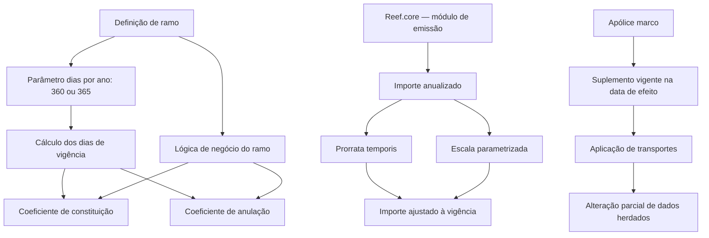
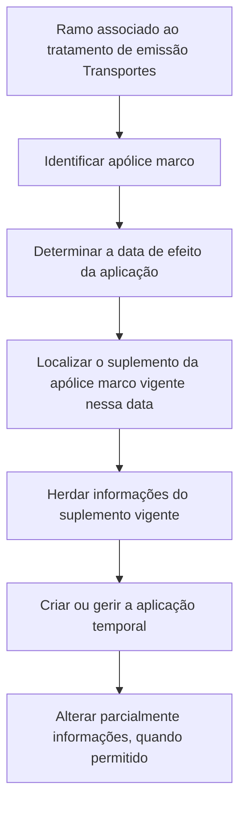

# Glossário Funcional e Regras de Emissão — Reef.core / TRON

## 1. Metadados do Documento
- **Arquivo de Origem:** Não identificado; conteúdo bruto extraído fornecido na solicitação.
- **Tipo de Documento:** Manual funcional / documentação de termos de negócio.
- **Domínio / Sistema:** Reef.core, TRON, emissão e gestão de apólices de seguros.
- **Público-Alvo:** Desenvolvedores, arquitetos, analistas funcionais, operação e negócio.
- **Data/Versão Identificada:** Não identificada.

---

## 2. Resumo Executivo & Contexto de Negócio

O documento define conceitos funcionais usados no módulo de emissão do **Reef.core**, com foco em apólices, suplementos, cálculos proporcionais, anulações, renovações, coasseguro, aplicações de transportes e revalorização de capital. O conteúdo é predominantemente um glossário corporativo com regras de cálculo e classificações operacionais.

A precificação no módulo de emissão do Reef.core parte de valores anualizados. O valor correspondente ao período efetivo de vigência é calculado posteriormente, seja por prorrata temporis, seja por uma escala parametrizada por ramo e período de vigência. Os parâmetros de dias por ano identificados são 365 e 360, com regras distintas para o cálculo dos dias de vigência.

O documento descreve a relação entre apólices marco e aplicações de transportes. Uma aplicação é uma apólice temporal cujo conteúdo é herdado da apólice marco, especificamente do suplemento da apólice marco vigente na data de efeito da aplicação. A aplicação pode alterar apenas parte das informações herdadas.

Também são definidos tipos de emissão, suplemento, póliza, temporalidade, coasseguro, revalorização de capital e modalidades de transporte. Diversas classificações apresentam operações associadas, enquanto alguns tipos permanecem explicitamente marcados como **“EN CONSTRUCCIÓN”**, sem detalhamento adicional.

---

## 3. Arquitetura, Componentes & Tecnologias Envolvidas

### Componentes e domínios identificados

| Componente / Conceito | Função descrita |
| :--- | :--- |
| **Reef.core** | Sistema no qual o módulo de emissão retorna inicialmente importes anualizados e onde são criadas novas apólices com suplemento de tipo Emissão. |
| **TRON** | Contexto em que o conceito de aplicação é usado quando um ramo possui o tratamento de emissão Transportes. |
| **Módulo de emissão** | Módulo do Reef.core que calcula importes anuais e executa operações de emissão, alteração, anulação, renovação, reabilitação e outras. |
| **Apólice marco** | Apólice de referência da qual uma aplicação de transportes herda informações. |
| **Aplicação** | Apólice temporal associada a uma apólice marco; recebe informações do suplemento da marco vigente na data de efeito. |
| **Suplemento** | Movimento ou tipo de saída associado à apólice ou aplicação, capaz de alterar informações e, conforme o tipo, efeitos econômicos. |
| **Ramo** | Definição que influencia regras como dias por ano, lógica de negócio, anulação, constituição e escala. |
| **Oracle** | Tecnologia citada na expressão usada para cálculo de dias de vigência quando o parâmetro dias/ano é 360. |



### Fluxo funcional de uma aplicação de transportes



> **Nota de Análise:** O documento não detalha métodos HTTP, contratos JSON, bases de dados, URLs, portas, interfaces técnicas ou integrações entre serviços.

---

## 4. Regras de Negócio, Especificações Funcionais & Processos

### 4.1 Aplicação de transportes

- O conceito de **aplicação** é usado quando um ramo possui associado o tratamento de emissão **Transportes**.
- A aplicação é uma apólice temporal baseada em outra apólice, denominada **apólice marco**.
- As informações herdadas pela aplicação devem ser obtidas do suplemento da apólice marco que estiver vigente na data de efeito da aplicação.
- A aplicação pode alterar parte das informações herdadas da apólice marco, mas não todas.

### 4.2 Coeficiente de anulação

- O coeficiente de anulação determina o valor a devolver em uma anulação de apólice ou de risco.
- O coeficiente é usado exclusivamente:
  - em anulações de apólice;
  - em baixas de risco cuja definição de ramo indique que devem usar as mesmas regras de anulação de apólice.
- O coeficiente varia conforme o tipo de anulação:
  - **a prorrata**;
  - **a escala**.
- O coeficiente pode ser alterado por uma lógica de negócio definida no suplemento.
- Fórmula apresentada para cálculo proporcional:

```text
coeficiente_de_anulación :=
ROUND(
  días_de_vigencia_suplemento_actual /
  días_de_vigencia_suplemento_anterior_vigente,
  6
)
```

### 4.3 Coeficiente de constituição

- O coeficiente de constituição determina qual fração do importe anualizado, que é a base tarifária no Reef.core, é aplicável a um movimento.
- O coeficiente permite determinar o valor a cobrar ou devolver conforme os dias de vigência.
- O coeficiente é expresso em tanto por um, isto é, uma razão de 1/100 conforme descrito no documento.
- Uma lógica de negócio definida no ramo também pode afetar o coeficiente.
- Fórmula apresentada:

```text
coeficiente_de_constitución :=
ROUND(días_de_vigencia / días_año, 6)
```

### 4.4 Importes anualizados, prorrata e escala

- Qualquer cálculo do módulo de emissão do Reef.core retorna inicialmente um importe anual.
- O importe anualizado é calculado para um ano, sem depender de o ano ser bissexto ou não.
- Após o cálculo anual, o Reef.core ajusta automaticamente o valor conforme o período de vigência.
- Na prorrata, o valor anualizado é proporcional ao período de vigência da operação de apólice ou aplicação.
- Na escala, a proporção não é determinada por prorrata temporis; ela é definida manualmente por parametrização de ramo e intervalo de vigência em dias.
- A escala pode produzir percentuais superiores a 100%, conforme o exemplo de 365 dias e 110%.

### 4.5 Dias de vigência

- Os dias de vigência são os dias existentes entre a data de efeito e a data de vencimento.
- A regra depende do parâmetro **días año** da definição de ramo.
- Para 365 dias/ano: dias de vigência = data de vencimento − data de efeito.
- Para 360 dias/ano: usa-se a expressão Oracle:

```text
CEIL(MONTHS_BETWEEN(fecha de vencimiento, fecha de efecto) * 30)
```

### 4.6 Temporalidade de apólice

| Temporalidade | Regra |
| :--- | :--- |
| **Anual prorrogable** | Dura um ano e, ao vencer, renova por mais um ano. |
| **Temporal no renovable** | Ao vencer, não é renovada e fica expirada. |
| **Temporal renovable por su periodo** | Dura menos de um ano e, ao renovar, mantém o mesmo período de tempo. |
| **Temporal renovable por su temporalidad** | Dura menos de um ano e, ao renovar, preserva a mesma duração temporal. |
| **Temporal renovable** | Dura menos de um ano; na primeira renovação passa a ter vigência anual prorrogável. |

### 4.7 Tipos de anulação a escala

| Tipo | Regra de cálculo |
| :--- | :--- |
| **Directo sobre el porcentaje de anulación** | Para os dias entre efeito e vencimento, utiliza diretamente o percentual de anulação parametrizado. |
| **Proporcional sobre el porcentaje de constitución** | Usa o percentual de constituição atual dividido pelo percentual de constituição do último suplemento. |
| **Proporcional sobre el porcentaje de anulación** | Usa o percentual de anulação atual dividido pelo percentual de constituição do último suplemento. |

### 4.8 Tipos de coasseguro

| Tipo | Regra |
| :--- | :--- |
| **Exento** | A apólice não possui coasseguro. |
| **Cedido** | MAPFRE gere a apólice, cobra prémios, liquida a totalidade dos sinistros e posteriormente abona ou cobra os valores das demais coasseguradoras. |
| **Aceptado** | MAPFRE aceita parte da responsabilidade de uma apólice gerida por outra companhia. |

### 4.9 Tipos de apólice de transportes

| Tipo | Regra |
| :--- | :--- |
| **Póliza fija** | Apólice padrão. |
| **Póliza marco con prima en depósito** | Cliente faz pagamento inicial; no vencimento ocorre regularização por suplemento. |
| **Póliza marco sin prima en depósito** | Cliente não faz pagamento inicial; no fim da vigência ocorre regularização por suplemento. |

### 4.10 Revalorização de capital

| Tipo principal | Regra |
| :--- | :--- |
| **No revaloriza** | O capital não é revalorizado nem depreciado; não varia na renovação. |
| **Especial** | Deve ser definida a forma de revalorização do capital. |
| **Por riesgo** | A definição é delegada ao momento de emissão da apólice. |

| Tipo de revalorização especial | Regra |
| :--- | :--- |
| **No revaloriza** | O capital não varia na renovação, salvo alteração manual. |
| **Capital actual** | Revaloriza o capital vigente do elemento. |
| **Capital inicial** | Revaloriza o capital original do elemento. |
| **IPC** | Revaloriza conforme informação associada ao Índice de Preços ao Consumidor. |
| **Otro índice** | Revaloriza conforme índice definido no sistema, identificado neste ponto. |
| **Lógica de negocio** | Revaloriza conforme resultado de uma lógica de negócio cujo nome é indicado. |

### 4.11 Tipos de suplemento com regras explicitadas

| Tipo de suplemento | Regras e particularidades |
| :--- | :--- |
| **Indeterminado** | Permite múltiplas alterações que podem variar o prémio; não se conhece previamente o tipo de suplemento na saída; aplica-se à anualidade atual. |
| **Regularización** | Afeta a anualidade anterior para ajustar a situação da apólice; pode ser usado quando o capital não é fixo durante a vigência; deve ser suplemento temporal; não calcula importe não consumido. |
| **Emisión** | Representa a primeira emissão de uma apólice; toda nova apólice criada no Reef.core fica armazenada com este tipo de suplemento. |
| **Disminución por siniestro** | Reduz a soma segurada das coberturas afetadas por sinistro; não implica devolução de prémio; não permite outras modificações na apólice/aplicação. |
| **Restitución de capital** | Restaura capital antes reduzido por suplemento DS; pode aumentar o prémio se a soma segurada participar no cálculo de prémio. |
| **Nominativo** | Concebido como saída; indica alterações sem impacto econômico, comissões ou geração de quotas. |

---

## 5. Tabelas de Parâmetros, Ambientes e Estruturas de Dados

### 5.1 Coeficiente de constituição — parâmetro dias/ano = 365

| Cenário | Efeito | Vencimento | Dias de vigência | Coeficiente de constituição | Observação |
| :--- | :--- | :--- | ---: | ---: | :--- |
| 1 | 01 Janeiro 2023 | 01 Janeiro 2024 | 365 | 1,000000 | Aplica 100% do importe anual. |
| 2 | 01 Janeiro 2023 | 01 Outubro 2023 | 273 | 0,747945 | Aplica 74,79% do importe anual. |
| 3 | 01 Janeiro 2023 | 01 Julho 2023 | 181 | 0,495890 | Aplica 49,59% do importe anual. |
| 4 | 01 Janeiro 2023 | 01 Abril 2023 | 90 | 0,246575 | Aplica 24,66% do importe anual. |

### 5.2 Coeficiente de constituição — parâmetro dias/ano = 360

| Cenário | Efeito | Vencimento | Dias de vigência | Coeficiente de constituição | Observação |
| :--- | :--- | :--- | ---: | ---: | :--- |
| 1 | 01 Janeiro 2023 | 01 Janeiro 2024 | 360 | 1,000000 | Aplica 100% do importe anual. |
| 2 | 01 Janeiro 2023 | 01 Outubro 2023 | 270 | 0,750000 | Aplica 75% do importe anual. |
| 3 | 01 Janeiro 2023 | 01 Julho 2023 | 180 | 0,500000 | Aplica 50% do importe anual. |
| 4 | 01 Janeiro 2023 | 01 Abril 2023 | 90 | 0,250000 | Aplica 25% do importe anual. |

### 5.3 Exemplos de prorrata

| Cenário | Período de vigência | Dias | Percentual | Importe anualizado | Importe prorateado |
| :--- | :--- | ---: | ---: | ---: | ---: |
| 1 | 01 Janeiro 2023 / 01 Janeiro 2024 | 365 | 100,00% | 1000,00 | 1000,00 |
| 2 | 01 Janeiro 2023 / 01 Outubro 2023 | 273 | 74,79% | 1000,00 | 747,95 |
| 3 | 01 Janeiro 2023 / 01 Julho 2023 | 181 | 49,59% | 1000,00 | 495,89 |
| 4 | 01 Janeiro 2023 / 01 Abril 2023 | 90 | 24,66% | 1000,00 | 246,58 |

### 5.4 Exemplos de escala

| Cenário | Período de vigência | Dias | Percentual parametrizado | Importe anualizado | Importe calculado |
| :--- | :--- | ---: | ---: | ---: | ---: |
| 1 | 01 Janeiro 2023 / 01 Janeiro 2024 | 365 | 110,00% | 1000,00 | 1100,00 |
| 2 | 01 Janeiro 2023 / 01 Outubro 2023 | 273 | 80,00% | 1000,00 | 800,00 |
| 3 | 01 Janeiro 2023 / 01 Julho 2023 | 181 | 60,00% | 1000,00 | 600,00 |
| 4 | 01 Janeiro 2023 / 01 Abril 2023 | 90 | 30,00% | 1000,00 | 300,00 |

### 5.5 Cálculo de dias de vigência

| Parâmetro dias/ano | Regra | Exemplo |
| :--- | :--- | :--- |
| 365 | `fecha de vencimiento - fecha de efecto` | 01 Janeiro 2023 a 01 Fevereiro 2023 = 31 dias; 01 Janeiro 2023 a 15 Fevereiro 2023 = 45 dias. |
| 360 | `CEIL(MONTHS_BETWEEN(fecha de vencimiento, fecha de efecto) * 30)` | 01 Janeiro 2023 a 01 Fevereiro 2023 = 30 dias; 01 Janeiro 2023 a 15 Fevereiro 2023 = 44 dias. |

### 5.6 Escala usada nos exemplos de anulação

| Dias de vigência | Percentual de constituição | Percentual de anulação |
| ---: | ---: | ---: |
| 15 | 10% | 90% |
| 30 | 20% | 80% |

### 5.7 Resultados — anulação direta sobre percentual de anulação

| Cenário | Efeito da anulação | Vencimento | Dias | Percentual para cálculo | Anulação a prorrata |
| :--- | :--- | :--- | ---: | ---: | ---: |
| 1 | 17 Dezembro 2023 | 01 Janeiro 2024 | 15 | 90% | 50% |
| 2 | 02 Dezembro 2023 | 01 Janeiro 2024 | 30 | 80% | 100% |

### 5.8 Resultados — proporcional sobre percentual de constituição

| Cenário | Efeito da anulação | Vencimento | Dias | Percentual para cálculo |
| :--- | :--- | :--- | ---: | :--- |
| 1 | 17 Dezembro 2023 | 01 Janeiro 2024 | 15 | 50% (10 / 20) |
| 2 | 02 Dezembro 2023 | 01 Janeiro 2024 | 30 | 100% (20 / 20) |

### 5.9 Escala para anulação proporcional sobre percentual de anulação

| Dias de vigência | Percentual de constituição | Percentual de anulação |
| ---: | ---: | ---: |
| 15 | 10% | 05% |
| 30 | 20% | 10% |

| Cenário | Efeito da anulação | Vencimento | Dias | Percentual para cálculo |
| :--- | :--- | :--- | ---: | :--- |
| 1 | 17 Dezembro 2023 | 01 Janeiro 2024 | 15 | 25% (05 / 20) |
| 2 | 02 Dezembro 2023 | 01 Janeiro 2024 | 30 | 50% (10 / 20) |

### 5.10 Tipos de emissão e operações

| Tipo de emissão | Operações identificadas |
| :--- | :--- |
| **Solicitud** | COTIZAR póliza; EMITIR presupuesto; EMITIR presupuesto desde presupuesto; EMITIR presupuesto desde suspensión; EMITIR presupuestos desde póliza. |
| **Póliza** | EMITIR póliza; EMITIR póliza desde presupuesto; EMITIR póliza desde suspensión; EMITIR póliza multiusuario. |
| **Suplemento** | ALTERAR póliza; ALTERAR póliza anualidad anterior; ALTERAR póliza cambio agente; ALTERAR póliza desde suspensión; ALTERAR póliza plan pago; ALTERAR póliza plan pago temporal; ALTERAR póliza temporalmente; ANULAR póliza; ANULAR póliza extinción riesgo; ANULAR póliza modificación; ANULAR póliza modificación anualidad anterior; ANULAR póliza modificación temporal; DISMINUIR póliza por siniestro; EXTENDER póliza vigencia; LIQUIDAR póliza; PRERENOVAR póliza; REGULARIZAR póliza; REHABILITAR póliza; REHABILITAR póliza extensión vigencia; REHABILITAR póliza sin extensión vigencia; RENOVAR póliza; RENOVAR póliza desde prerenovación; RENOVAR póliza desde suspensión; RESTITUIR póliza capital. |
| **Póliza grupo** | EMITIR póliza; EMITIR póliza desde presupuesto; EMITIR póliza desde suspensión; EMITIR póliza multiusuario. |
| **Remplazada** | REEMPLAZAR póliza; REEMPLAZAR póliza renovando. |
| **Aplicaciones** | EMITIR aplicación; EMITIR aplicación desde declaración; EMITIR aplicación desde supensión. |
| **Suplemento aplicación** | ALTERAR aplicación; ALTERAR aplicación cambio agente; ALTERAR aplicación desde suspensión; ALTERAR aplicación plan pago; ALTERAR aplicação plan pago temporal; ALTERAR aplicação temporalmente; ANULAR aplicação; ANULAR aplicação modificación; ANULAR aplicação modificación temporal; LIQUIDAR aplicação; REHABILITAR aplicação. |
| **Declaraciones previas** | EMITIR declaración. |
| **Reemplazada renovación** | CONVERTIR RENOVACIÓN (cargas en el sistema, renovando). |

---

## 6. Bateria de Perguntas & Respostas para RAG (FAQ Sintético)

### P1: Como uma aplicação de transportes determina quais dados herdar da apólice marco?
**R:** A aplicação deve identificar a data de efeito e herdar as informações do suplemento da apólice marco que estiver vigente nessa data. A aplicação pode modificar parte das informações herdadas, mas não todas.

### P2: Como o Reef.core calcula o coeficiente de constituição?
**R:** O coeficiente de constituição determina a parcela do importe anualizado aplicável a um movimento. A fórmula apresentada é `ROUND(días_de_vigencia / días_año, 6)`. O valor pode ser influenciado por lógica de negócio definida no ramo.

### P3: Qual a diferença entre cálculo a prorrata e cálculo a escala?
**R:** Na prorrata, o importe anualizado é ajustado proporcionalmente aos dias de vigência. Na escala, o percentual aplicável é definido por uma parametrização de ramo e intervalo de vigência em dias, podendo diferir do percentual temporal e até ser superior a 100%.

### P4: Como são calculados os dias de vigência quando o parâmetro dias/ano é 360?
**R:** Para 360 dias/ano, os dias de vigência são calculados pela expressão Oracle `CEIL(MONTHS_BETWEEN(fecha de vencimiento, fecha de efecto) * 30)`. No exemplo de 01 Janeiro 2023 a 15 Fevereiro 2023, o resultado é 44 dias.

### P5: Quando o coeficiente de anulação é utilizado?
**R:** O coeficiente de anulação é usado exclusivamente em anulações de apólice e em baixas de risco cujo ramo determine a aplicação das mesmas regras de anulação. Ele varia conforme a anulação seja a prorrata ou a escala e pode ser alterado por lógica de negócio definida no suplemento.

### P6: O que caracteriza uma apólice temporal renovável?
**R:** Uma apólice temporal renovável tem duração inferior a um ano. Quando chega ao vencimento e é renovada, passa a ter duração anual prorrogável a partir da primeira renovação.

### P7: O que significa coasseguro cedido no documento?
**R:** No coasseguro cedido, a MAPFRE é responsável pela gestão da apólice, pela cobrança dos prémios e pela liquidação total dos sinistros. Depois disso, a MAPFRE abona ou cobra das demais companhias coasseguradoras os valores correspondentes.

### P8: Qual tipo de suplemento é atribuído a uma nova apólice criada no Reef.core?
**R:** Toda nova apólice criada no Reef.core é armazenada com o tipo de suplemento **Emisión**, que representa a primeira emissão da apólice.

### P9: O suplemento de diminuição por sinistro devolve prémio?
**R:** Não. O suplemento de diminuição por sinistro reduz a soma segurada das coberturas afetadas por um sinistro, mas essa redução não implica devolução de prémio. Esse suplemento também não permite outras modificações na apólice ou aplicação.

### P10: Em que situação o suplemento de restituição de capital pode aumentar o prémio?
**R:** A restituição de capital pode aumentar o prémio quando a soma segurada participa no cálculo do prémio. O suplemento restaura capital que havia sido reduzido por um suplemento de diminuição por sinistro do tipo DS.

### P11: Qual a diferença entre uma póliza marco com e sem prima em depósito?
**R:** Na póliza marco com prima em depósito, o cliente realiza um pagamento inicial e ocorre uma regularização por suplemento no vencimento. Na póliza marco sem prima em depósito, não há pagamento inicial e a regularização também é feita por suplemento ao término da vigência.

### P12: Quais são os tipos de revalorização especial de capital?
**R:** Os tipos identificados são: No revaloriza, Capital actual, Capital inicial, IPC, Otro índice e Lógica de negocio. Cada tipo determina se o capital permanece inalterado ou qual base, índice ou lógica será usada na revalorização.

---

## 7. Glossário de Termos, Siglas & Conceitos-Chave

- **Aplicación:** Apólice temporal de transportes cuja informação é baseada em uma apólice marco.
- **Apólice marco:** Apólice de referência da aplicação.
- **Coeficiente de anulación:** Fator utilizado para determinar o importe a devolver em anulação de apólice ou risco.
- **Coeficiente de constitución:** Fator utilizado para determinar a parcela do importe anualizado que se aplica a um movimento.
- **Coaseguro aceptado:** Modalidade em que a MAPFRE aceita parte da responsabilidade de uma apólice gerida por outra companhia.
- **Coaseguro cedido:** Modalidade em que a MAPFRE gere a apólice e realiza acertos com coasseguradoras.
- **DS:** Código de saída do suplemento de diminuição por sinistro.
- **IPC:** Índice de Preços ao Consumidor.
- **Importe anualizado:** Valor anual retornado inicialmente pelos cálculos do módulo de emissão do Reef.core.
- **Ocurrencia:** Formulário de perguntas requerido repetidamente, como no cadastro de múltiplas joias seguradas.
- **Prorrata temporis:** Proporção de um importe anualizado conforme a duração da vigência.
- **Póliza grupo:** Conjunto de apólices independentes associadas a um número de apólice grupo.
- **Póliza multi-riesgo:** Apólice que reúne riscos de natureza semelhante de um tomador, registrados de forma independente.
- **Reef.core:** Sistema citado como responsável pelo módulo de emissão e pelos cálculos anualizados.
- **Ramo:** Definição de negócio que influencia parâmetros de dias por ano, cálculo e lógica de negócio.
- **Suplemento:** Movimento associado a uma apólice ou aplicação.
- **TRON:** Contexto citado para aplicações quando o ramo usa tratamento de emissão Transportes.

---

## 8. Notas Críticas, Riscos & Limitações

- O conteúdo não identifica versão, data, autor técnico, URL de referência, ambiente, servidor, endpoint ou contrato de integração.
- O documento cita uma ligação para informação técnica mais detalhada sobre importes anualizados, mas o URL não está presente no texto extraído.
- Múltiplos tipos de suplemento estão marcados explicitamente como **“EN CONSTRUCCIÓN”**; não há detalhamento suficiente para inferir regras funcionais, entradas ou saídas.
- O texto extraído contém artefatos de OCR, como caracteres corrompidos em palavras originalmente acentuadas; a interpretação foi limitada ao conteúdo semanticamente recuperável.
- **Nota de Análise:** O documento cita lógica de negócio em ramo e suplemento, porém não define os nomes, critérios, algoritmos ou pontos de configuração dessas lógicas.
- **Nota de Análise:** As operações de emissão são listadas, mas o documento não detalha pré-condições, permissões, estados, transições ou contratos de dados de cada operação.

---

## 9. Conteúdo Bruto Estruturado (Referência Fiel)

```text
--- [PÁGINA 1 DE 14] ---

TÉRMINOS (TRON)
Aplicación
Este concepto aplica cuando a un ramo se le asocia al tratamiento de emisión el valor Transportes. Realmente es una póliza temporal, cuya información se basa en otra póliza llamada póliza marco. Es decir, es una póliza (aplicación) cuya información se basa en otra (marco).
Dependiendo de la fecha de efecto de la aplicación, la información que hereda de la póliza marco corresponde a un suplemento de esta última. Es decir, la información que toma una aplicación de su póliza marco, la toma del suplemento de esta, que está vigente a la fecha de efecto de la aplicación. Una aplicación puede alterar parte de la información de la marco, pero no toda.

Coeficiente de anulación
Se utiliza para determinar el importe que hay que devolver en caso de anulación de póliza o riesgo. Es utilizado exclusivamente en las anulaciones de póliza y en las bajas de riesgo cuya definición de ramo indique que se apliquen las mismas reglas de la anulación de póliza.
Este coeficiente varía si la anulación es a prorrata o escala y puede ser alterado mediante una lógica de negocio definida en el suplemento.

Prorrata
Son los días de vigencia del movimiento que se está realizando, dividido por los días de vigencia del último suplemento vigente que afectó a la póliza, expresado en tanto por uno (1/100). Es decir se aplica la fórmula:
coeficiente_de_anulación := ROUND(días_de_vigencia_suplemento_actual / días_de_vigencia_suplemento_anterior_vigente, 6)

Escala
Para este caso existe una definición que determina la forma en la que se halla este coeficiente. Este es el tipo de anulación a escala.

Coeficiente de constitución
Se usa para determinar cuanto importe del anualizado (que es la base de la tarifa en Reef.core) aplica a un movimiento. Es decir, cuanto importe corresponde cobrar (o devolver) en base a los días de vigencia. Está expresado en tanto por uno (1/100).
Este coeficiente también puede verse afectado ya que existe una lógica definida a nivel de ramo.
coeficiente_de_constitución := ROUND(días_de_vigencia / días_año, 6)

--- [PÁGINA 2 DE 14] ---

PARÁMETRO DÍAS AÑO: 365
ESCENARIO | EFECTO | VENCIMIENTO | DÍAS VIGENCIA | COEFICIENTE DE CONSTITUCIÓN | OBSERVACIONES
1 | 01 Enero 2023 | 01 Enero 2024 | 365 | 1,000000 | Aplica el 100% del importe anual
2 | 01 Enero 2023 | 01 Octubre 2023 | 273 | 0,747945 | Aplica el 74,79% del importe anual
3 | 01 Enero 2023 | 01 Julio 2023 | 181 | 0,495890 | Aplica el 49,59% del importe anual
4 | 01 Enero 2023 | 01 Abril 2023 | 90 | 0,246575 | Aplica el 24,66% del importe anual

PARÁMETRO DÍAS AÑO: 360
1 | 01 Enero 2023 | 01 Enero 2024 | 360 | 1,000000 | Aplica el 100% del importe anual
2 | 01 Enero 2023 | 01 Octubre 2023 | 270 | 0,750000 | Aplica el 75% del importe anual
3 | 01 Enero 2023 | 01 Julio 2023 | 180 | 0,500000 | Aplica el 50% del importe anual
4 | 01 Enero 2023 | 01 Abril 2023 | 90 | 0,250000 | Aplica el 25% del importe anual

Compañía líder
Entidad aseguradora o reaseguradora que asume una participación mayoritaria en el contrato y determina las decisiones a seguir por el resto de coaseguradores o reaseguradores.

Importe anualizado
Un detalle importante a destacar es que en el módulo de emisión de Reef.core, cualquier cálculo devuelve importes anuales. Es decir, cualquier importe que se halla inicialmente es el que corresponde a un año independientemente de si el año es bisiesto o no. Posteriormente y dependiendo del periodo de vigencia, este importe se ajusta de forma automática.

Ocurrencia
Se puede definir como que es un formulario compuesto por una serie de cuestiones y ese formulario se solicita más de una vez.

--- [PÁGINA 3 DE 14] ---

Ejemplo de ocurrencia: declaración de joyas cubiertas. Para cada joya se informa tipo de joya, descripción de la joya y valor de la joya.

Prorrata
Aplica a los cálculos de los importes de cobertura y concepto de desglose. Estos cálculos se realizan de forma proporcional (prorrata temporis) al tiempo. Partiendo siempre de un importe anualizado se aplica la proporción correspondiente al periodo de vigencia.

ESCENARIO | PERIODO | DÍAS | % | IMPORTE ANUALIZADO | IMPORTE PRORRATEADO
1 | 01 Enero 2023 / 01 Enero 2024 | 365 | 100,00% | 1000,00 | 1000,00
2 | 01 Enero 2023 / 01 Octubre 2023 | 273 | 74,79% | 1000,00 | 747,95
3 | 01 Enero 2023 / 01 Julio 2023 | 181 | 49,59% | 1000,00 | 495,89
4 | 01 Enero 2023 / 01 Abril 2023 | 90 | 24,66% | 1000,00 | 246,58

Escala
Cuando los cálculos son a escala no se aplica la proporción prorrata temporis; la proporción se determina manualmente mediante parametrización por ramo y periodo de vigencia en días.

ESCENARIO | PERIODO | DÍAS | % | IMPORTE ANUALIZADO | IMPORTE PRORRATEADO
1 | 01 Enero 2023 / 01 Enero 2024 | 365 | 110,00% | 1000,00 | 1100,00
2 | 01 Enero 2023 / 01 Octubre 2023 | 273 | 80,00% | 1000,00 | 800,00
3 | 01 Enero 2023 / 01 Julio 2023 | 181 | 60,00% | 1000,00 | 600,00
4 | 01 Enero 2023 / 01 Abril 2023 | 90 | 30,00% | 1000,00 | 300,00

--- [PÁGINA 4 DE 14] ---

Días de vigencia
Corresponde a los días que hay entre el efecto y el vencimiento. La forma de calcularlo depende de la definición del ramo de los días que tiene un año.

PARÁMETRO DÍAS AÑO | DÍAS DE VIGENCIA ORACLE
360 | Meses entre el vencimiento y el efecto multiplicado por 30 días mes: CEIL(MONTHS_BETWEEN(fecha de vencimiento, fecha de efecto) * 30)
365 | Días entre el vencimiento y el efecto: fecha de vencimiento - fecha de efecto

Póliza grupo
Conjunto de pólizas independientes cuyos riesgos pueden ser de la misma o distinta naturaleza, del mismo o distinto tomador, en las que cada póliza puede ser mono-riesgo o multi-riesgo y está asociada a un número de póliza grupo.

Póliza multi-riesgo
Póliza que alberga todos los riesgos de naturaleza semejante de un tomador. Los riesgos se registran independientemente dentro de una única póliza.

Periodo de vigencia
Tiempo entre la emisión inicial o la última renovación y el vencimiento.

--- [PÁGINA 5 DE 14] ---

Temporalidad de póliza
- Anual prorrogable: duración anual; se renueva anualmente al vencimiento.
- Temporal no renovable: al vencer no se renueva y queda expirada.
- Temporal renovable por su periodo: duración menor a un año; al renovar conserva el mismo periodo.
- Temporal renovable por su temporalidad: duración menor a un año; al renovar conserva la misma duración.
- Temporal renovable: duración menor a un año; tras la primera renovación pasa a anual prorrogable.

Tipo de anulación a escala
PARÁMETRO DÍAS AÑO: 365.

--- [PÁGINA 6 DE 14] ---

DÍAS DE VIGENCIA | PORCENTAJE DE CONSTITUCIÓN | PORCENTAJE DE ANULACIÓN
15 | 10 | 90
30 | 20 | 80

Movimiento: Nueva póliza; efecto 02 Diciembre 2023; vencimiento 01 Enero 2024; días de vigencia 30; porcentaje de constitución 20%.

Directo sobre el porcentaje de anulación
Para los días entre el efecto y vencimiento toma el porcentaje definido como porcentaje de anulación.

Proporcional sobre el porcentaje de constitución
Para los días entre efecto y vencimiento toma el porcentaje de constitución. Además, se determina el porcentaje de constitución del último suplemento y se aplica:
%_de_anulación := %_de_suplemento_actual / %_de_suplemento_anterior

Proporcional sobre el porcentaje de anulación
Es igual al anterior, pero toma la columna de porcentaje de anulación y el porcentaje de constitución del último suplemento.

--- [PÁGINA 7 DE 14] ---

DÍAS DE VIGENCIA | PORCENTAJE DE CONSTITUCIÓN | PORCENTAJE DE ANULACIÓN
15 | 10 | 05
30 | 20 | 10

ESCENARIO | EFECTO ANULACIÓN | VENCIMIENTO | DÍAS | PORCENTAJE PARA CÁLCULO
1 | 17 Diciembre 2023 | 01 Enero 2024 | 15 | 25% (05 / 20)
2 | 02 Diciembre 2023 | 01 Enero 2024 | 30 | 50% (10 / 20)

Tipo de emisión
Solicitud:
- COTIZAR póliza
- EMITIR presupuesto
- EMITIR presupuesto desde presupuesto
- EMITIR presupuesto desde suspensión
- EMITIR presupuestos desde póliza

Póliza:
- EMITIR póliza
- EMITIR póliza desde presupuesto
- EMITIR póliza desde suspensión
- EMITIR póliza multiusuario

--- [PÁGINA 8 DE 14] ---

Suplemento:
- ALTERAR póliza
- ALTERAR póliza anualidad anterior
- ALTERAR póliza cambio agente
- ALTERAR póliza desde suspensión
- ALTERAR póliza plan pago
- ALTERAR póliza plan pago temporal
- ALTERAR póliza temporalmente
- ANULAR póliza
- ANULAR póliza extinción riesgo
- ANULAR póliza modificación
- ANULAR póliza modificación anualidad anterior
- ANULAR póliza modificación temporal
- DISMINUIR póliza por siniestro
- EXTENDER póliza vigencia
- LIQUIDAR póliza
- PRERENOVAR póliza
- REGULARIZAR póliza
- REHABILITAR póliza
- REHABILITAR póliza extensión vigencia
- REHABILITAR póliza sin extensión vigencia
- RENOVAR póliza
- RENOVAR póliza desde prerenovación
- RENOVAR póliza desde suspensión
- RESTITUIR póliza capital

Póliza grupo:
- EMITIR póliza
- EMITIR póliza desde presupuesto
- EMITIR póliza desde suspension
- EMITIR póliza multiusuario

--- [PÁGINA 9 DE 14] ---

Remplazada:
- REEMPLAZAR póliza
- REEMPLAZAR póliza renovando

Aplicaciones:
- EMITIR aplicación
- EMITIR aplicación desde declaración
- EMITIR aplicación desde supension

Suplemento aplicación:
- ALTERAR aplicación
- ALTERAR aplicación cambio agente
- ALTERAR aplicación desde suspensión
- ALTERAR aplicación plan pago
- ALTERAR aplicación plan pago temporal
- ALTERAR aplicación temporalmente
- ANULAR aplicación
- ANULAR aplicación modificación

--- [PÁGINA 10 DE 14] ---

Suplemento aplicación:
- ANULAR aplicación modificación temporal
- LIQUIDAR aplicación
- REHABILITAR aplicación

Declaraciones previas:
- EMITIR declaración

Reemplazada renovación:
- CONVERTIR RENOVACIÓN (cargas en el sistema, renovando)

Tipo de coaseguro:
- Exento: la póliza no tiene coaseguro.
- Cedido: MAPFRE gestiona la póliza, cobra primas, liquida siniestros y regulariza importes con coaseguradoras.
- Aceptado: MAPFRE acepta parte de la responsabilidad de una póliza gestionada por otra compañía.

Tipo de póliza de transportes:
- Póliza fija.
- Póliza marco con prima en depósito.
- Póliza marco sin prima en depósito.

--- [PÁGINA 11 DE 14] ---

Tipo de revalorización de capital:
- No revaloriza.
- Especial.
- Por riesgo.

Tipo de revalorización especial:
- No revaloriza.
- Capital actual.
- Capital inicial.
- IPC.
- Otro índice.
- Lógica de negocio.

Tipo de suplemento — Indeterminado:
Permite múltiples cambios que pueden hacer variar la prima. Aplica a la anualidad actual.
ENTRADA: IN
SALIDA: AD, AP o SM

Otros tipos indicados como EN CONSTRUCCIÓN:
- Anulación
- Rehabilitación
- Cambio forma pago
- Cambio de agente
- Extensión vigencia
- Renovación

--- [PÁGINA 12 DE 14] ---

Regularización
Suplemento que afecta a la anualidad anterior para ajustar la situación de la póliza. Puede usarse cuando el capital no es fijo durante toda la vigencia. Debe estar definido como suplemento temporal y no se halla importe no consumido.
ENTRADA: RG
SALIDA: AD, AP o SM

Emisión
Representa la primera emisión de una póliza. Toda póliza nueva creada en Reef.core queda almacenada con este tipo de suplemento.
ENTRADA: No aplica
SALIDA: XX

Tipos marcados como EN CONSTRUCCIÓN:
- Anticipo
- Recobro de anticipo
- Rescate
- Reducción
- Rehabilitación póliza reducida
- Aportaciones extraordinarias
- Anulación de suplemento
- Extinción del riesgo

--- [PÁGINA 13 DE 14] ---

Tipos marcados como EN CONSTRUCCIÓN:
- Seguro prorrogado (vida)
- Liquidación de transportes
- Anulación parcial
- Adicional
- Suplemento anualidad anterior
- Anulación suplemento anualidad anterior
- Anulación suplemento temporal
- Rescate parcial

Disminución por siniestro
Permite reducir la suma asegurada de las coberturas afectadas por un siniestro. No implica devolución de prima y no permite otras modificaciones a la póliza/aplicación.
ENTRADA: DS
SALIDA: AP

Restitución de capital
Permite restaurar la suma asegurada reducida por un suplemento DS. Puede aumentar la prima si la suma asegurada interviene en el cálculo de la prima.
ENTRADA: RC
SALIDA: AD

Nominativo
Tipo de salida que indica modificaciones sin impacto económico, de comisiones o cuotas.

--- [PÁGINA 14 DE 14] ---

Nominativo:
ENTRADA: No aplica
SALIDA: SM

1. Son los días que hay entre el efecto y el vencimiento.

Checking links...
```
