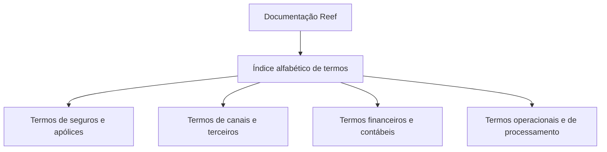

# Índice Alfabético de Termos da Documentação Reef

## 1. Metadados do Documento
- **Arquivo de Origem:** Não identificado no conteúdo fornecido
- **Tipo de Documento:** Índice de termos / documentação corporativa
- **Domínio / Sistema:** Reef; Reef.core; documentação Mapfre
- **Público-Alvo:** Usuários de documentação, analistas funcionais, desenvolvedores, arquitetos e operação
- **Data/Versão Identificada:** Não identificada

---

## 2. Resumo Executivo & Contexto de Negócio

O conteúdo apresenta um índice alfabético de termos da documentação Reef, hospedada ou referenciada em um ambiente de documentação corporativa identificado como “Documentation / DOCUMENTACIÓN Reef”. O índice organiza conceitos de negócio, operação, seguros, contabilidade, canais comerciais, terceiros, sinistros, políticas, comissões e processamento.

A documentação é associada visualmente a Mapfre e identifica o ciclo de vida como “Approved Source”. O conteúdo também referencia o proprietário `agonzalez_mapfre.com`, embora não detalhe responsabilidades, escopo de governança ou processo de aprovação do material.

Os termos catalogados indicam que o domínio Reef abrange operações típicas de seguros, incluindo apólices, recibos, prêmios, cobertura, sinistros, resseguros ou cosseguros, canais de distribuição, intermediários, clientes distribuidores, comissões, reservas e regras de vigência.

O documento não contém especificações funcionais detalhadas, contratos de APIs, rotas técnicas, ambientes, métodos HTTP, tecnologias de implementação, regras de cálculo ou fluxos operacionais completos. A principal finalidade identificável é servir como índice de navegação terminológica para a documentação Reef.

---

## 3. Arquitetura, Componentes & Tecnologias Envolvidas

Os elementos técnicos e sistêmicos explicitamente citados são:

| Componente / Termo | Evidência no documento | Detalhamento disponível |
| :--- | :--- | :--- |
| Reef | “DOCUMENTACIÓN Reef” | Sistema ou domínio de documentação; não há arquitetura descrita. |
| Reef.core | “Operación Reef.core” | Operação ou conceito relacionado a Reef.core; não há detalhes técnicos. |
| Mapfre | “Mapfredocument” e referência visual ao domínio Mapfre | Contexto corporativo ou repositório documental; relação técnica não detalhada. |
| APIs | Item de navegação “APIs” | Não há APIs, endpoints, contratos ou protocolos descritos. |
| Cloud | Item de navegação “Cloud” | Não há provedor, ambiente, serviço ou arquitetura Cloud descritos. |
| Zeus | Item de navegação “Zeus” | Não há descrição funcional ou técnica. |
| VL | “Approved Source / VL” | Sigla não expandida no conteúdo. |

O conteúdo não descreve integrações, camadas, microsserviços, bancos de dados, protocolos ou fluxo de dados. O diagrama abaixo representa apenas a organização documental explicitamente observável.



> **Nota de Análise:** O documento cita “Operación Reef.core”, “APIs”, “Cloud” e “Zeus”, mas não detalha arquitetura, interfaces, tecnologias, métodos HTTP, contratos JSON ou dependências entre esses elementos.

---

## 4. Regras de Negócio, Especificações Funcionais & Processos

O material não apresenta regras de negócio formalizadas, critérios de validação, cálculos, condições de elegibilidade ou procedimentos passo a passo. O conteúdo limita-se à enumeração de termos que potencialmente representam conceitos funcionais do domínio Reef.

Os seguintes grupos funcionais são identificáveis exclusivamente pelos nomes dos termos:

1. **Apólices e vigência**
   - Póliza cliente
   - Póliza grupo
   - Nueva producción (póliza)
   - Renovación previa
   - Periodo de vigencia
   - Días de vigencia
   - Temporalidad de póliza
   - Tipo de emisión
   - Tipo de suplemento
   - Tipo de póliza de transportes
   - Formato de numeración de póliza

2. **Comissões, antecipações e compensação**
   - Comisión de cartera
   - Comisión de nueva producción
   - Cartera (comisión)
   - Nueva producción (comisión)
   - Subvención Agentes
   - Forma de compensación
   - Tipo de anticipo
   - Tipo de devolución del préstamo o anticipo de comisión

3. **Sinistros e tramitação**
   - Siniestro
   - Causa siniestro
   - Consecuencia siniestro
   - Nivel de tramitación
   - Plan de tramitación
   - Trámite
   - Tarea
   - Expediente
   - Intervención

4. **Cobertura, capitais e prêmio**
   - Cobertura
   - Suma asegurada, referenciada por “Intervalo”, “Límite” e tipos de revalorização
   - Prima de riesgo
   - Importe anualizado
   - Importe mínimo
   - Prorrata
   - Coeficiente de anulación
   - Coeficiente de constitución

5. **Terceiros, usuários e estruturas comerciais**
   - Agente (Intermediario)
   - Intermediario (Agente)
   - Agrupación (terceros)
   - Categoría terceros
   - Clasificación terceros
   - Causa inhabilitación (terceros)
   - Causa inhabilitación por actividad (terceros)
   - Cliente distribuidor (estructura de canales)
   - Usuario (del sistema)
   - Usuario (de la entidad)

6. **Financeiro, cobrança e contabilidade**
   - Concepto de cobro y pago
   - Concepto de reserva
   - Orden de pago
   - Liquidación
   - Nota de crédito y nota de débito
   - Moneda
   - Tipo de cambio (moneda)
   - Asiento contable
   - Ramo contable
   - Ramo contable por atributo
   - Registro diario
   - Régimen fiscal

> **Nota de Análise:** Os termos acima constituem referências terminológicas. O documento não define regras, valores, fórmulas, responsáveis, eventos de disparo, entradas, saídas ou exceções para esses conceitos.

---

## 5. Tabelas de Parâmetros, Ambientes e Estruturas de Dados

| Item / Parâmetro | Descrição / Função | Tipo / Valores / Formato | Ambiente / Observações |
| :--- | :--- | :--- | :--- |
| Lifecycle | Estado de ciclo de vida do material documental | `Approved Source` | Associado à documentação Reef. |
| Owner | Identificação do proprietário do conteúdo | `agonzalez_mapfre.com` | Não há papel ou responsabilidade detalhada. |
| VL | Referência apresentada junto ao ciclo de vida | `VL` | Sigla não expandida. |
| Idioma | Idioma exibido na interface documental | `ES` | O conteúdo principal está em espanhol. |
| Navegação | Itens de navegação visíveis | Buscar, Inicio, Soluciones, Arquitecturas, APIs, Componentes, Cloud, Documentación, Zeus, Reef, Ayuda | Não há URLs ou rotas informadas. |
| Estado de links | Situação exibida no fim do conteúdo | `Checking links...` | Não há resultado da verificação de links. |
| Índice alfabético | Organização do conteúdo | Letras A a Z | As letras G, H, J, K, N, Q, U, V, W, X, Y e Z não apresentam termos adicionais ou apresentam apenas cabeçalhos no trecho. |

### Termos por área de domínio

| Área | Termos identificados |
| :--- | :--- |
| Estrutura e canais | Agrupación (estructura de canales), Canal (fuente de producción), Cliente distribuidor, Estructura canales, Estructura comercial, Estructura geográfica, Fuente de producción |
| Apólices e seguros | Cobertura, Póliza cliente, Póliza grupo, Prima de riesgo, Ramo, Recibo, Renovación previa, Siniestro, Temporalidad de póliza |
| Financeiro e contábil | Asiento contable, Concepto de cobro y pago, Liquidación, Moneda, Orden de pago, Ramo contable, Registro diario, Tipo de cambio |
| Terceiros e pessoas | Agente, Intermediario, Agrupación (terceros), Categoría terceros, Clasificación terceros, Parentesco, Persona políticamente expuesta, Perfil financiero |
| Processamento e operação | Fechas de proceso, Lógica de negocio, Operación, Operación Reef.core, Plan de tramitación, Tarea, Trámite |
| Produtos e condições | Escala, Intervalo, Límite, Lista de valores, Plan de pago, Tipo de emisión, Tipo de suplemento, Unit Linked |

---

## 6. Bateria de Perguntas & Respostas para RAG (FAQ Sintético)

### P1: Qual é o objetivo principal do documento de documentação Reef?
**R:** O documento funciona como um índice alfabético de termos associados ao domínio Reef. Ele relaciona conceitos de seguros, apólices, sinistros, comissões, canais, terceiros, contabilidade, cobrança, tramitação e operações, sem apresentar definições detalhadas para a maioria dos termos.

### P2: O documento descreve a arquitetura técnica do Reef?
**R:** Não. O conteúdo menciona Reef, Reef.core, APIs, Cloud e Zeus como referências ou itens de navegação, mas não descreve componentes técnicos, integrações, bancos de dados, microsserviços, protocolos, ambientes ou diagramas de arquitetura.

### P3: Quais termos do índice estão relacionados a apólices?
**R:** O índice contém, entre outros, os termos “Póliza cliente”, “Póliza grupo”, “Nueva producción (póliza)”, “Renovación previa”, “Periodo de vigencia”, “Días de vigencia”, “Temporalidad de póliza”, “Tipo de emisión”, “Tipo de suplemento”, “Tipo de póliza de transportes” e “Formato de numeración de póliza”.

### P4: Quais conceitos de comissão são citados na documentação Reef?
**R:** O documento lista “Cartera (comisión)”, “Comisión de cartera”, “Comisión de nueva producción”, “Nueva producción (comisión)”, “Subvención Agentes”, “Forma de compensación”, “Tipo de anticipo” e “Tipo de devolución del préstamo o anticipo de comisión”. Não são fornecidas regras de cálculo, percentuais ou critérios de elegibilidade.

### P5: O que o índice menciona sobre sinistros?
**R:** O conteúdo inclui “Siniestro”, “Causa siniestro”, “Consecuencia siniestro”, “Nivel de tramitación”, “Plan de tramitación”, “Trámite”, “Tarea”, “Expediente” e “Intervención”. O documento não detalha o processo de abertura, análise, liquidação ou encerramento de sinistros.

### P6: Quais termos se relacionam a terceiros e intermediários?
**R:** Os termos identificados são “Agente (Intermediario)”, “Intermediario (Agente)”, “Agrupación (terceros)”, “Categoría terceros”, “Clasificación terceros”, “Causa inhabilitación (terceros)”, “Causa inhabilitación por actividad (terceros)” e “Cliente distribuidor (estructura de canales)”.

### P7: O documento fornece endpoints ou contratos de APIs?
**R:** Não. Embora “APIs” apareça na navegação da interface documental, o conteúdo extraído não inclui URLs, rotas, métodos HTTP, autenticação, payloads, contratos JSON, códigos de erro ou especificações de integração.

### P8: Quais elementos financeiros e contábeis são citados?
**R:** O índice inclui “Asiento contable”, “Concepto de cobro y pago”, “Concepto de reserva”, “Liquidación”, “Nota de crédito y nota de débito”, “Moneda”, “Orden de pago”, “Ramo contable”, “Ramo contable por atributo”, “Registro diario”, “Régimen fiscal” e “Tipo de cambio (moneda)”.

### P9: Qual é o estado de ciclo de vida identificado para a documentação?
**R:** O documento apresenta o campo “Lifecycle” com o valor “Approved Source”. Não há explicação sobre os critérios para esse estado, fluxo de aprovação, responsáveis ou versões anteriores.

### P10: Quem é apontado como proprietário da documentação Reef?
**R:** O conteúdo identifica o campo “Owner” com o valor `agonzalez_mapfre.com`. O documento não informa o nome completo da pessoa, equipe responsável, canal de contato ou responsabilidades associadas à propriedade.

### P11: O que significa a sigla P.E.P. no documento?
**R:** O índice apresenta o termo “Persona políticamente expuesta (P.E.P)”. O conteúdo não fornece uma definição adicional, critérios de classificação ou regras de tratamento para pessoas politicamente expostas.

### P12: Existem informações de ambientes, servidores ou logs?
**R:** Não. O conteúdo não apresenta URLs de ambientes, nomes de servidores, portas, caminhos de logs, variáveis de configuração, credenciais, rotas de monitoramento ou procedimentos operacionais.

---

## 7. Glossário de Termos, Siglas & Conceitos-Chave

- **APIs:** Item de navegação exibido na interface documental. O documento não expande a sigla nem apresenta interfaces de programação.
- **P.E.P.:** “Persona políticamente expuesta”, termo listado no índice.
- **Reef:** Nome do sistema, domínio ou conjunto de documentação referenciado como “DOCUMENTACIÓN Reef”.
- **Reef.core:** Termo apresentado como “Operación Reef.core”; não há detalhamento funcional ou técnico.
- **VL:** Sigla exibida junto ao estado “Approved Source”; significado não identificado.
- **Agente / Intermediario:** Termos apresentados como equivalentes no índice: “Agente (Intermediario)” e “Intermediario (Agente)”.
- **Agrupación:** Termo listado em dois contextos: “Agrupación (estructura de canales)” e “Agrupación (terceros)”.
- **Cartera:** Termo listado em dois contextos: “Cartera (comisión)” e “Cartera (póliza)”.
- **Nueva producción:** Termo listado em dois contextos: “Nueva producción (comisión)” e “Nueva producción (póliza)”.
- **Rating / Calificación:** Termos apresentados como correspondentes: “Calificación (rating)” e “Rating (calificación)”.
- **Subacuerdo / Subcontrato:** Termos apresentados de forma cruzada: “Subacuerdo (subcontrato)” e “Subcontrato (subacuerdo)”.
- **Unit Linked:** Termo listado no índice sem definição adicional.
- **Trébol:** Termo listado no índice sem definição adicional.

---

## 8. Notas Críticas, Riscos & Limitações

- O conteúdo é um índice terminológico, não uma especificação técnica, manual operacional completo ou documento de arquitetura.
- Não há definições formais para a maior parte dos termos apresentados.
- Não há regras de negócio verificáveis, fórmulas, parâmetros numéricos, critérios de validação ou fluxos de exceção.
- Não há URLs, endpoints, servidores, portas, ambientes, credenciais, rotas de log ou detalhes de observabilidade.
- Não há contratos de integração, métodos HTTP, esquemas de dados ou exemplos de requisições e respostas.
- A sigla **VL** é exibida, mas não é expandida.
- O texto extraído contém caracteres potencialmente corrompidos em palavras como “Calicación”, “Coeciente”, “geográca”, “nanciero”, “scal” e “delización”. A transcrição bruta foi preservada para auditoria.
- O estado “Checking links...” sugere que havia uma verificação de links em andamento, mas não apresenta resultado, falhas, links analisados ou evidências de integridade.
- O documento referencia “Operación Reef.core”, mas não fornece detalhes sobre o componente, suas operações ou contratos expostos.

---

## 9. Conteúdo Bruto Estruturado (Referência Fiel)

```text
--- [PÁGINA 1 DE 8] ---

EN CONSTRUCCIÓN
TÉRMINOS - Índice
A
Accesorio
Actividad
Actividad económica
Acuerdo (contrato)
Agrupación (estructura de canales)
Agrupación (terceros)
Agente (Intermediario)
Agrupación (Estructura de Canales)
Aplicación
Asiento contable
Atributo
B
Documentation / DOCUMENTACIÓN Reef
DOCUMENTACIÓN Reef
Mapfredocument
DOCUMENTACIÓN Reef
Owner
user:agonzalez_mapfre.com
Lifecycle
Approved Source
 / 
 VL
Buscar Inicio Soluciones Arquitecturas APIs Componentes Cloud Documentación Zeus Reef Ayuda
ES


--- [PÁGINA 2 DE 8] ---

Buzón
C
Calidad
Calicación (rating)
Canal (fuente de producción)
Cartera (comisión)
Cartera (póliza)
Categoría terceros
Causa siniestro
Causa inhabilitación (terceros)
Causa inhabilitación por actividad (terceros)
Clasicación terceros
Cliente distribuidor (estructura de canales)
Cobertura
Coeciente de anulación
Coeciente de constitución
Comisión de cartera
Comisión de nueva producción
Compañía líder
Concepto de cobro y pago
Concepto de reserva
Consecuencia siniestro
Consentimiento


--- [PÁGINA 3 DE 8] ---

Contrato (acuerdo)
Control técnico
Cuadro de coaseguro
Cuota (plan de renta)
Cuota (recibo)
D
Días de adelanto/atraso
Días de vigencia
Documento identicador
E
Elemento
Entidad comercializadora (medios de pago)
Escala
Estructura canales
Estructura comercial
Estructura geográca
Estructura producto
Expediente
F
Fechas de proceso
Forma de compensación
Formato de numeración de póliza


--- [PÁGINA 4 DE 8] ---

Fuente de producción (estructura de canales)
G
H
I
Intervalo (suma asegurada)
Intermediario (Agente)
Intervención
Importe anualizado
Importe mínimo
J
K
L
Límite (suma asegurada)
Liquidación
Lista de valores
Lógica de negocio
M
Marca
Moneda
N


--- [PÁGINA 5 DE 8] ---

Nivel de estudios
Nivel de tramitación
Nota de crédito y nota de débito
Nueva producción (comisión)
Nueva producción (póliza)
O
Operación
Operación Reef.core
Orden de pago
P
Panel
Parentesco
Perl nanciero
Periodo de vigencia
Persona políticamente expuesta (P.E.P)
Plan de pago
Plan de tramitación
Póliza cliente
Póliza grupo
Prima de riesgo
Programa de delización
Prorrata


--- [PÁGINA 6 DE 8] ---

Q
R
Ramo
Ramo contable
Ramo contable por atributo
Rating (calicación)
Recibo
Régimen scal
Registro diario
Renovación previa
S
Sector
Siniestro
Subacuerdo (subcontrato)
Subcontrato (subacuerdo)
Subsector
Subvención Agentes
T
Tarea
Temporalidad de póliza
Textos


--- [PÁGINA 7 DE 8] ---

Tipo de anticipo
Tipo de anulación a escala
Tipo de cambio (moneda)
Tipo de clase de gestor
Tipo de coaseguro
Tipo de concepto de cobro y pago
Tipo de devolución del préstamo o anticipo de comisión
Tipo de emisión
Tipo de póliza de transportes
Tipo de revalorización de capital
Tipo de revalorización especial
Tipo de suplemento
Titulación
Token
Trámite
Tratamiento
Trébol
U
Unit Linked
Usuario (del sistema)
Usuario (de la entidad)
V


--- [PÁGINA 8 DE 8] ---

W
X
Y
Z
Checking links...
```
