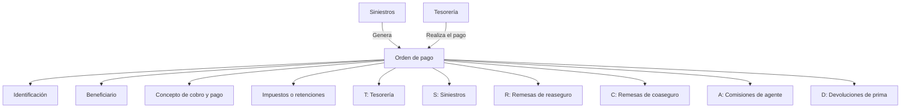

# Glossário Operacional TRON: Tesouraria, Ordens de Pagamento e Gestão de Cobros/Pagamentos

## 1. Metadados do Documento
- **Arquivo de Origem:** Não informado; conteúdo extraído fornecido em 3 páginas.
- **Tipo de Documento:** Manual Operacional / Glossário Funcional.
- **Domínio / Sistema:** TRON, Tesouraria, Contabilidade, Siniestros, Reaseguro, Coaseguro e Comissões de Agentes.
- **Público-Alvo:** Analistas funcionais, equipes de Tesouraria, Contabilidade, Siniestros, agentes e operação.
- **Data/Versão Identificada:** Não identificada.

---

## 2. Resumo Executivo & Contexto de Negócio

O documento apresenta definições funcionais relacionadas ao domínio financeiro-operacional do sistema TRON. O conteúdo cobre registros contábeis, notas de crédito e débito, ordens de pagamento, registro diário, antecipações e empréstimos ligados a comissões, gestores de cobrança/pagamento e classificações de conceitos de cobrança e pagamento.

A ordem de pagamento é o principal artefato operacional descrito. Ela permite que a companhia realize pagamentos a pessoas físicas ou jurídicas que possuam relação com a organização. O documento define modalidades de ordem de pagamento vinculadas a Tesouraria, Siniestros, remessas de reaseguro, remessas de coaseguro, comissões de agente e devoluções de prêmio.

No contexto de Siniestros, as ordens de pagamento são geradas no módulo específico de sinistros, enquanto o pagamento é executado pela Tesouraria. Essas ordens são chamadas de “Liquidaciones de expedientes” e podem ser negativas quando tratam de cobrança ou recuperação de valores de sinistros, como dedutíveis ou recuperações junto a outra companhia.

O material também estabelece classificações funcionais para gestores, conceitos de cobrança/pagamento e formas de devolução de empréstimos ou antecipações de comissão. Essas classificações determinam responsabilidades operacionais, âmbito de uso de conceitos financeiros e regras para liquidação de valores de agentes.

O texto contém referências à documentação Reef e a Mapfredocument, mas não descreve integrações, interfaces, arquitetura técnica, URLs de ambiente, contratos de API ou mecanismos de persistência. As ocorrências de caracteres inválidos na extração — por exemplo, `reeja`, `ocina` e `Especica` — foram preservadas na referência bruta por fidelidade ao conteúdo fornecido.

---

## 3. Arquitetura, Componentes & Tecnologias Envolvidas

O documento não apresenta uma arquitetura de software, tecnologias, servidores, APIs, bancos de dados ou ambientes técnicos. Os elementos funcionais citados são:

| Componente / Domínio | Papel descrito |
| :--- | :--- |
| TRON | Sistema ou domínio associado aos termos funcionais apresentados. |
| Tesouraria | Responsável pela realização de pagamentos e associada a ordens de pagamento do tipo `T`. |
| Siniestros | Módulo que gera ordens de pagamento de sinistros, chamadas de liquidações de expedientes. |
| Reaseguro | Domínio associado a ordens de pagamento de remessa de reaseguro e conceitos de cobrança/pagamento. |
| Coaseguro cedido | Domínio associado a ordens de pagamento e conceitos de coaseguro cedido. |
| Coaseguro aceptado | Domínio associado a conceitos de coaseguro aceito e a gestores pilotos de coaseguro. |
| Agentes comisiones | Domínio de conceitos utilizados para ordens de pagamento de comissões de agentes. |
| Reef | Referência de documentação exibida no conteúdo extraído. |
| Mapfredocument | Referência exibida sob a seção de documentação Reef. |



> **Nota de Análise:** O diagrama representa exclusivamente as relações funcionais explicitamente descritas. O documento não detalha fluxos de rede, protocolos, APIs, bancos de dados, eventos ou contratos entre módulos.

---

## 4. Regras de Negócio, Especificações Funcionais & Processos

### 4.1 Asiento contable

Um asiento contable é uma anotação realizada no livro de contabilidade para registrar uma entrada ou saída de dinheiro, como uma compra ou um pagamento.

Cada asiento contable é refletido por duas anotações:

- **Debe:** utilizado quando se trata de um gasto.
- **Haber:** utilizado quando se trata de um ingresso.

### 4.2 Nota de crédito e nota de débito

Notas de crédito e notas de débito são documentos legais utilizados para ajustar valores incorretos ocorridos no momento da faturação.

Devem ser emitidas nas seguintes situações:

1. Corrigir faturas com valores incorretos.
2. Anular faturas emitidas por erro.
3. Aplicar descontos não considerados durante a faturação.
4. Tratar outros ajustes de faturação compatíveis com a finalidade desses documentos.

A diferença principal definida pelo documento é:

- **Nota de crédito:** representa uma saída de dinheiro para a companhia.
- **Nota de débito:** representa uma entrada de dinheiro para a companhia.

### 4.3 Ordens de pagamento

Uma ordem de pagamento é o meio pelo qual a companhia pode realizar pagamento a pessoas físicas ou jurídicas que tenham mantido relação com a organização.

As categorias identificadas são:

- `T`: Tesorería.
- `S`: Siniestros.
- `R`: Remesas de reaseguro.
- `C`: Remesas de coaseguro.
- `A`: Comisiones de agente.
- `D`: Devoluciones de prima.

#### Regras para ordens de pagamento de siniestros

1. As ordens de pagamento de sinistros são geradas no próprio módulo de Siniestros.
2. A realização do pagamento ocorre a partir da Tesouraria.
3. Essas ordens de pagamento são denominadas **Liquidaciones de expedientes**.
4. Podem existir liquidações negativas para cobrança e recuperação de sinistros.
5. Exemplos mencionados de liquidações negativas:
   - Deducibles.
   - Recuperación de siniestros de otra compañía.

### 4.4 Composição da ordem de pagamento

A ordem de pagamento é composta pelos seguintes blocos:

1. **Identificación**
   - Datas estimadas de pagamento.
   - Moeda do pagamento.
   - Dados da fatura, quando o pagamento for realizado por uma fatura.

2. **Beneficiario**
   - Tipo e código do documento do terceiro a pagar.
   - Forma pela qual o pagamento é realizado, como efetivo, cheque ou transferência bancária.

3. **Concepto de cobro y pago**
   - Conceito de pagamento conforme a natureza do gasto.

4. **Impuestos o retenciones**
   - Impostos e retenções associados ao conceito de cobrança e pagamento.

### 4.5 Registro diario

O registro diário é um documento no qual todas as operações diárias de uma empresa são registradas cronologicamente na forma de asiento contable.

O registro diário pode incluir:

- Dívidas.
- Inventário.
- Gastos.
- Vendas.
- Qualquer movimento realizado em dinheiro.

### 4.6 Tipos de anticipo

O documento estabelece três tipos:

- **Anticipo:** antecipação de comissão.
- **Préstamo:** empréstimo.
- **Montos:** desconto de comissão no momento da cobrança do recibo.

### 4.7 Tipo de clase de gestor

A classe de gestor especifica quem pode administrar a cobrança ou o pagamento.

| Classe de gestor | Responsável pela gestão |
| :--- | :--- |
| Agente | O agente principal. |
| Banco | Um banco. |
| Cobrador | Um cobrador. |
| Débito automático em conta | Um banco. |
| Gestor directo | A oficina. |
| Gestor piloto coaseguro | A companhia líder em um coaseguro aceito. |
| Oficina comercial | Uma oficina comercial. |
| Débito com cartão de crédito | Um banco. |
| Gestor de impagos | Indica que o recibo passou pelo processo de impagos. |

### 4.8 Tipo de concepto de cobro y pago

O tipo de conceito de cobrança e pagamento identifica a classificação à qual o conceito pertence. Essa classificação determina o âmbito de uso do conceito.

| Classificação | Uso definido |
| :--- | :--- |
| Siniestros | Geração de ordens de pagamento de sinistros. |
| Reaseguro | Ordens de pagamento de remessa de reaseguro. |
| Coaseguro cedido | Ordens de pagamento de coaseguro cedido. |
| Coaseguro aceptado | Ordens de pagamento de coaseguro aceito. |
| Cobros y pagos varios | Ordens de pagamento de cobranças e pagamentos diversos de Tesouraria. |
| Agentes comisiones | Ordens de pagamento de comissões. |
| Conceptos vida | Ramos de vida. |

### 4.9 Tipo de devolución del préstamo o anticipo de comisión

O documento define três modalidades de devolução:

1. **Por número de cuotas**
   - O empréstimo ou antecipação é devolvido em uma determinada quantidade de parcelas.

2. **Vencimiento**
   - O empréstimo ou antecipação é devolvido em uma única parcela, em data de vencimento acordada.

3. **Porcentaje**
   - Um percentual do empréstimo ou antecipação é devolvido em cada liquidação de comissões do agente.
   - Essa devolução ocorre até uma data de vencimento acordada.
   - Ao chegar a data de vencimento, o valor restante deve ser devolvido.

---

## 5. Tabelas de Parâmetros, Ambientes e Estruturas de Dados

| Item / Parâmetro | Descrição / Função | Tipo / Valores / Formato | Ambiente / Observações |
| :--- | :--- | :--- | :--- |
| Tipo de ordem de pagamento | Classifica a finalidade da ordem de pagamento. | `T`, `S`, `R`, `C`, `A`, `D` | Não há ambiente técnico informado. |
| `T` | Ordem de pagamento de Tesouraria. | Código de tipo | Tesouraria. |
| `S` | Ordem de pagamento de Siniestros. | Código de tipo | Gerada no módulo de Siniestros; paga pela Tesouraria. |
| `R` | Ordem de pagamento de remessa de reaseguro. | Código de tipo | Reaseguro. |
| `C` | Ordem de pagamento de remessa de coaseguro. | Código de tipo | Coaseguro. |
| `A` | Ordem de pagamento de comissões de agente. | Código de tipo | Agentes. |
| `D` | Ordem de pagamento de devoluções de prêmio. | Código de tipo | Devoluções de prima. |
| Fechas estimadas de pago | Datas previstas para pagamento. | Data; formato não informado | Parte da identificação da ordem de pagamento. |
| Moneda del pago | Moeda utilizada no pagamento. | Moeda; valores não informados | Parte da identificação da ordem de pagamento. |
| Datos de la factura | Dados de fatura associados ao pagamento. | Não especificado | Aplicável quando o pagamento é realizado por uma fatura. |
| Tipo y código de documento del tercero | Identifica o terceiro beneficiário do pagamento. | Tipo e código; formato não informado | Parte do bloco Beneficiario. |
| Forma de pago | Forma pela qual o pagamento é realizado. | Efetivo, cheque, transferência bancária, entre outros não detalhados | Parte do bloco Beneficiario. |
| Concepto de pago | Define o conceito conforme a natureza do gasto. | Classificação funcional | Parte do bloco Concepto de cobro y pago. |
| Impuestos o retenciones | Impostos e retenções ligados ao conceito de cobrança e pagamento. | Não especificado | Parte da ordem de pagamento. |
| Anticipo | Antecipação de comissão. | Tipo de anticipo | Associado a comissões. |
| Préstamo | Empréstimo. | Tipo de anticipo | Regras de devolução descritas no documento. |
| Montos | Desconto de comissão no momento da cobrança do recibo. | Tipo de anticipo | Documento não apresenta fórmula de cálculo. |
| Por número de cuotas | Forma de devolução em múltiplas parcelas. | Tipo de devolución | Quantidade de parcelas não especificada. |
| Vencimiento | Forma de devolução em parcela única em data acordada. | Tipo de devolución | Data de vencimento acordada. |
| Porcentaje | Forma de devolução por percentual em cada liquidação de comissões. | Tipo de devolución | Saldo restante é devolvido ao chegar o vencimento. |
| Reef | Referência de documentação. | Nome de plataforma ou área documental; não detalhado | O conteúdo mostra “DOCUMENTACIÓN Reef”. |
| Mapfredocument | Referência documental apresentada junto a Reef. | Não especificado | Não há integração ou URL detalhada. |

> **Nota de Análise:** O documento não apresenta URLs, servidores, portas, variáveis de configuração, caminhos de log, formatos de arquivos, modelos de dados ou estruturas JSON/XML.

---

## 6. Bateria de Perguntas & Respostas para RAG (FAQ Sintético)

### P1: O que é um asiento contable no contexto do documento TRON?
**R:** Um asiento contable é uma anotação no livro de contabilidade destinada a registrar uma entrada ou saída de dinheiro, como uma compra ou pagamento. Cada asiento contable é refletido por duas anotações: Debe e Haber. Gastos são refletidos no Debe, enquanto ingressos são registrados no Haber.

### P2: Quando uma nota de crédito deve ser emitida?
**R:** Uma nota de crédito deve ser emitida para ajustar valores incorretos ocorridos na faturação, como correção de faturas com importes errados, anulação de faturas emitidas por erro ou aplicação de descontos não aplicados durante a faturação. Para a companhia, a nota de crédito representa saída de dinheiro.

### P3: Qual é a diferença entre nota de crédito e nota de débito?
**R:** Ambas são documentos legais utilizados para corrigir ajustes de faturação. A nota de crédito representa uma saída de dinheiro para a companhia, enquanto a nota de débito representa uma entrada de dinheiro para a companhia.

### P4: Quais tipos de ordem de pagamento são definidos no documento?
**R:** O documento define seis tipos de ordem de pagamento: `T` para Tesorería, `S` para Siniestros, `R` para remessas de reaseguro, `C` para remessas de coaseguro, `A` para comissões de agente e `D` para devoluções de prêmio.

### P5: Onde são geradas e pagas as ordens de pagamento de sinistros?
**R:** As ordens de pagamento de sinistros são geradas no módulo de Siniestros, mas o pagamento é realizado pela Tesouraria. Essas ordens são chamadas de Liquidaciones de expedientes.

### P6: Uma liquidação de expediente de sinistro pode ter valor negativo?
**R:** Sim. O documento informa que podem existir liquidações negativas para cobrança e recuperação de sinistros. Os exemplos citados incluem dedutíveis e recuperação de sinistros de outra companhia.

### P7: Quais informações compõem a identificação de uma ordem de pagamento?
**R:** A identificação da ordem de pagamento inclui datas estimadas de pagamento, moeda do pagamento e dados da fatura quando o pagamento é realizado por meio de uma fatura.

### P8: Quais dados são necessários para o beneficiário de uma ordem de pagamento?
**R:** Para o beneficiário, o documento menciona o tipo e o código do documento do terceiro a pagar, além da forma de realização do pagamento, como efetivo, cheque ou transferência bancária.

### P9: O que determina o tipo de conceito de cobrança e pagamento?
**R:** O tipo de conceito de cobrança e pagamento identifica a classificação à qual o conceito pertence. Essa classificação determina o âmbito de uso do conceito, como Siniestros, Reaseguro, Coaseguro cedido, Coaseguro aceptado, Cobros y pagos varios, Agentes comisiones e Conceptos vida.

### P10: Quem pode gerir uma cobrança ou pagamento?
**R:** A gestão pode ser atribuída a agente, banco, cobrador, banco em caso de débito automático em conta, oficina por meio de gestor direto, companhia líder em coaseguro aceito por meio de gestor piloto de coaseguro, oficina comercial, banco em débito com cartão de crédito ou gestor de impagos quando o recibo passa pelo processo de impagos.

### P11: Quais são os tipos de anticipo apresentados?
**R:** Os tipos são Anticipo, que corresponde a uma antecipação de comissão; Préstamo, que corresponde a um empréstimo; e Montos, definido como um desconto de comissão no momento da cobrança do recibo.

### P12: Como funciona a devolução por porcentaje de um empréstimo ou antecipação de comissão?
**R:** Na modalidade Porcentaje, um percentual do empréstimo ou antecipação é devolvido em cada liquidação de comissões do agente até uma data de vencimento acordada. Quando a data de vencimento é alcançada, o valor que ainda restar deve ser devolvido.

---

## 7. Glossário de Termos, Siglas & Conceitos-Chave

- **TRON:** Sistema ou domínio mencionado no título “TÉRMINOS (TRON)”; o documento não expande a sigla.
- **Asiento contable:** Registro contábil de entrada ou saída de dinheiro.
- **Debe:** Anotação contábil utilizada quando há gasto.
- **Haber:** Anotação contábil utilizada quando há ingresso.
- **Nota de crédito:** Documento legal para ajuste de faturação que representa saída de dinheiro para a companhia.
- **Nota de débito:** Documento legal para ajuste de faturação que representa entrada de dinheiro para a companhia.
- **Orden de pago:** Meio para a companhia realizar pagamento a pessoas físicas ou jurídicas relacionadas à organização.
- **Tesorería:** Área associada à realização de pagamentos.
- **Siniestros:** Domínio ou módulo de sinistros que gera ordens de pagamento de sinistros.
- **Liquidaciones de expedientes:** Nome dado às ordens de pagamento de sinistros.
- **Deducibles:** Exemplo de situação associada a liquidação negativa para cobrança e recuperação de sinistros.
- **Reaseguro:** Domínio associado a remessas e ordens de pagamento de reaseguro.
- **Coaseguro cedido:** Classificação de conceito para ordens de pagamento de coaseguro cedido.
- **Coaseguro aceptado:** Classificação de conceito e contexto do gestor piloto de coaseguro.
- **Beneficiario:** Terceiro a pagar em uma ordem de pagamento.
- **Registro diario:** Documento que registra cronologicamente operações diárias em forma de asiento contable.
- **Anticipo:** Antecipação de comissão.
- **Préstamo:** Empréstimo.
- **Montos:** Desconto de comissão aplicado no momento da cobrança do recibo.
- **Gestor:** Entidade ou papel que pode gerir cobrança ou pagamento.
- **Impagos:** Processo pelo qual o recibo passou, associado ao gestor de impagos.
- **Cobros y pagos varios:** Classificação destinada a ordens de pagamento de cobranças e pagamentos diversos de Tesouraria.
- **Conceptos vida:** Conceitos utilizados para ramos de vida.
- **Reef:** Referência de documentação exibida no texto.
- **Mapfredocument:** Referência documental exibida junto à documentação Reef.

---

## 8. Notas Críticas, Riscos & Limitações

- O documento é predominantemente um glossário funcional e não apresenta detalhes de implementação técnica.
- Não há descrição de arquitetura de software, integrações, APIs, métodos HTTP, contratos JSON/XML, banco de dados, filas, autenticação, servidores, portas ou ambientes.
- Não há definição de regras de cálculo para valores, impostos, retenções, descontos, percentuais, parcelas ou moedas.
- Não são informadas validações para criação, aprovação, cancelamento ou pagamento de ordens de pagamento.
- O fluxo de tratamento de liquidações negativas é citado, mas não detalha responsáveis, critérios de aprovação, contabilização ou etapas de recuperação.
- O documento menciona Reef e Mapfredocument, porém não esclarece o papel técnico ou funcional dessas referências.
- Há caracteres potencialmente corrompidos na extração do texto, incluindo `reeja`, `ocina`, `Especica`, `clasicación` e `identica`.
- **Nota de Análise:** O material lista tipos de ordem de pagamento e conceitos funcionais, mas não detalha os métodos, telas, processos sistêmicos, permissões ou contratos necessários para operacionalizá-los.

---

## 9. Conteúdo Bruto Estruturado (Referência Fiel)

```text
--- [PÁGINA 1 DE 3] ---

TÉRMINOS (TRON)
Asiento contable
Es la anotación que se realiza en el libro de contabilidad para registrar una entrada o salida de dinero, es decir, una compra o un pago. Cada
asiento contable se reeja a través de dos anotaciones: Debe y Haber.
Cuando se trata de un gasto se reeja en el Debe
Cuando es un ingreso se registra en el Haber
Nota de crédito y nota de débito
Se trata de documentos legales que se utilizan para ajustar valores erróneos que se presentan en el momento de la facturación.
Deben emitirse para corregir facturas con importes erróneos, anular facturas emitidas por error, aplicar descuentos no aplicados en la
facturación, etc.
La principal diferencia entre ambos radica en que la nota de crédito representa una salida de dinero, mientras que la nota de débito
representa una entrada de dinero, para la compañía.
Orden de pago
Es el medio por el cual la compañía va a poder realizar el pago a personas físicas o jurídicas que hayan tenido relación con la misma.
Existen diferentes tipos de órdenes de pago:
T: Tesorería
S: Siniestros
R: Remesas de reaseguro
C: Remesas de coaseguro
A: Comisiones de agente
D: Devoluciones de prima
Las órdenes de pago de siniestros, se generan en el propio módulo, aunque el pago se realiza desde tesorería. Estas órdenes de pago son las
llamadas Liquidaciones de expedientes. Pueden existir liquidaciones negativas para el cobro y recuperación de siniestros, por ejemplo,
deducibles, recuperación de siniestros de otra compañía, etc.
Composición de la orden de pago
ORDEN DE PAGO
IDENTIFICACIÓN BENEFICIARIO CONCEPTO DE
COBRO PAGO IMPUESTOS O RETENCIONES
IDENTIFICACIÓN:
Fechas estimadas de pago
Moneda del pago
Datos de la factura (siempre que el pago se haga por una factura)
Documentation / DOCUMENTACIÓN Reef
DOCUMENTACIÓN Reef
Mapfredocument
DOCUMENTACIÓN Reef
Owner
user:agonzalez_mapfre.com
Lifecycle
Approved Source
 / 
 VL
Buscar Inicio Soluciones Arquitecturas APIs Componentes Cloud Documentación Zeus Reef Ayuda
ES

--- [PÁGINA 2 DE 3] ---

etc.
BENEFICIARIO:
Tipo y código de documento del tercero a pagar
Forma en la que se realiza el pago (efectivo, cheque, transferencia bancaria, etc.)
CONCEPTO DE COBRO PAGO:
Concepto de pago según la naturaleza del gasto
IMPUESTOS O RETENCIONES:
Impuestos y retenciones asociados al concepto de cobro y pago
Registro diario
Se trata de un documento en el que se registran todas las operaciones diarias de una empresa de manera cronológica y en forma de asiento
contable. Es decir, incluye deudas, inventario, gastos, ventas y cualquier movimiento realizado en efectivo.
Tipo de anticipo
Anticipo
Se trata de un anticipo de comisión.
Préstamo
Se trata de un préstamo.
Montos
Se trata de un descuento de comisión en el momento del cobro del recibo.
Tipo de clase de gestor
Especica quien puede gestionar el cobro/pago.
Agente
Es el agente principal quien se se encarga de gestionar.
Banco
Es un banco quien se encarga de gestionar.
Cobrador
Es un cobrador quien se encarga de gestionar.
Débito automático en cuenta
Es un banco quien se encarga de gestionar.
Gestor directo
Es la ocina quien se encarga de gestionar.
Gestor piloto coaseguro
Es la Compañía líder en un coaseguro aceptado quien se encarga de gestionar.
Ocina comercial
Es una ocina comercial quien se encarga de gestionar.

--- [PÁGINA 3 DE 3] ---

Debito con tarjeta de credito
Es un banco quien se encarga de gestionar.
Gestor de impagos
El recibo ha pasado al proceso de impagos.
Tipo de concepto de cobro y pago
Identica la clasicación a la que pertenece el concepto de cobro y pago, esta clasicación determina el ámbito de uso del mismo.
Siniestros
Concepto utilizado para generar órdenes de pago de siniestros.
Reaseguro
Concepto utilizado para órdenes de pago de remesa de reaseguro.
Coaseguro cedido
Concepto utilizado para órdenes de pago de coaseguro cedido.
Coaseguro aceptado
Concepto utilizado para órdenes de pago de coaseguro aceptado.
Cobros y pagos varios.
Concepto utilizado para órdenes de pago de cobros y pagos varios de tesorería.
Agentes comisiones
Conceptos utilizados para órdenes de pago de comisiones.
Conceptos vida
Conceptos utilizados para ramos de vida.
Tipo de devolución del préstamo o anticipo de comisión
Por numero de cuotas
El préstamo o anticipo se devolverá en un determinado número de cuotas.
Vencimiento
El préstamo o anticipo se devolverá en una única cuota con una fecha de vencimiento acordada.
Porcentaje
Se devolverá un porcentaje del préstamo o anticipo en cada liquidación de comisiones del agente, hasta una fecha de vencimiento acordada.
Llegada la fecha de vencimiento se devolverá lo que reste del préstamo o anticipo.
```
