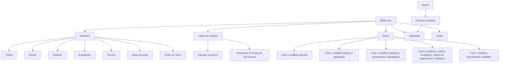
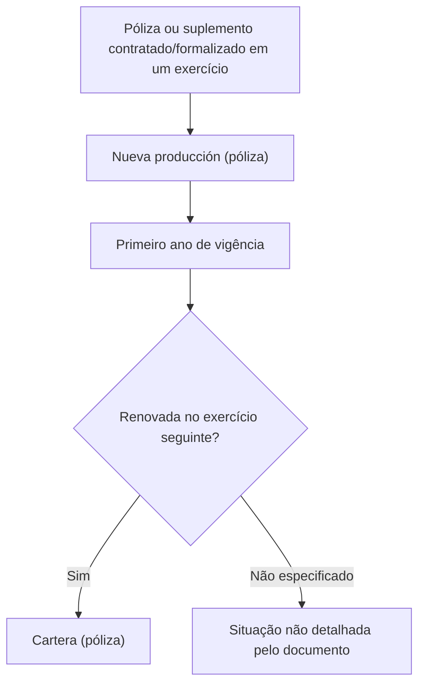

# Glossário de Termos do REEF.core: Operações, Apólices, Comissões e Elementos de Seguro

## 1. Metadados do Documento
- **Arquivo de Origem:** Não identificado — conteúdo bruto fornecido com 2 páginas.
- **Tipo de Documento:** Manual Operacional / Documentação de Termos.
- **Domínio / Sistema:** REEF.core / seguros / documentação MAPFRE.
- **Público-Alvo:** Desenvolvedores, Arquitetos, Operação e Negócio.
- **Data/Versão Identificada:** Não identificada.

---

## 2. Resumo Executivo & Contexto de Negócio

O documento apresenta definições terminológicas associadas ao sistema REEF.core e ao domínio de seguros. O conteúdo esclarece conceitos utilizados para operações sobre clientes, agentes, apólices, suplementos, sinistros, recibos, comissões, ordens de pagamento, ordens de cobrança e registros contábeis.

A documentação diferencia conceitos de produção nova e carteira, tanto para apólices quanto para comissões. A distinção é baseada principalmente no primeiro ano de vigência da apólice ou suplemento: operações e comissões do primeiro ano são classificadas como nova produção; após renovação no exercício seguinte, a apólice passa a compor a carteira.

O documento também descreve o conceito genérico de elemento em REEF.core. Um elemento pode ser uma apólice, recibo, sinistro, expediente, terceiro, ordem de pagamento ou ordem de cobrança. Essa classificação estabelece uma linguagem comum para representar objetos funcionais gerados pelo sistema.

Também são definidos mecanismos operacionais como buzón, tarefa e lógica de negócio. O buzón registra informações novas ou modificações destinadas a uma operação em processo massivo; a tarefa é um programa que executa uma ação concreta e pode exigir parâmetros; a lógica de negócio corresponde a uma rotina de software associada para personalizar o comportamento do REEF.core.

O conteúdo não fornece detalhes de arquitetura física, contratos de API, URLs operacionais, ambientes, versões de software, servidores, protocolos ou métodos HTTP. A referência visual indica a origem em documentação REEF/MAPFRE e o estado de ciclo de vida como “Approved”.

---

## 3. Arquitetura, Componentes & Tecnologias Envolvidas

O único sistema explicitamente citado é o **REEF.core**, apresentado como o contexto funcional no qual são gerados elementos, executadas operações e associadas rotinas de lógica de negócio.

Componentes e conceitos identificados:

| Componente / Conceito | Papel identificado no documento |
| :--- | :--- |
| REEF.core | Sistema no qual são gerados elementos e cujo comportamento pode ser personalizado por lógica de negócio. |
| Elemento | Denominação genérica para conceitos gerados em REEF.core. |
| Lógica de negócio | Peça de software ou rotina associada para personalizar comportamentos do REEF.core. |
| Tarefa | Programa informático com sequência de instruções para realizar uma ação concreta, potencialmente com parâmetros. |
| Buzón | Local de registro de novas informações ou modificações para operação em processo massivo. |
| Ramo | Conjunto de características que determina o comportamento de módulos do REEF.core. |
| Documentation / DOCUMENTACIÓN Reef | Referência de navegação/origem documental exibida no conteúdo bruto. |
| MAPFRE | Organização mencionada no contexto do recebimento ou devolução de custos de quota. |



**Nota de Análise:** O documento não detalha uma arquitetura de infraestrutura, microsserviços, banco de dados, integração externa, APIs, protocolos ou ambientes de execução do REEF.core.

---

## 4. Regras de Negócio, Especificações Funcionais & Processos

### 4.1 Classificação de elementos no REEF.core

O documento define **elemento** como denominação genérica para qualquer conceito gerado no REEF.core. Um elemento pode corresponder a:

1. Póliza.
2. Recibo.
3. Siniestro.
4. Expediente.
5. Tercero.
6. Orden de pago.
7. Orden de cobro.

### 4.2 Buzón e processamento massivo

O **buzón** é o local onde se registra:

- Nova informação sobre um elemento.
- Modificações desejadas sobre um elemento.
- Informações ou modificações que serão submetidas a uma operação em processo massivo.

O documento não especifica o formato do registro, os critérios de processamento, estados de processamento, responsáveis, nem mecanismos de erro ou reprocessamento do buzón.

### 4.3 Lógica de negócio

A expressão **lógica de negócio** significa que deve ser associada uma peça de software, denominada rotina, para personalizar o comportamento do REEF.core.

Os exemplos explícitos de objetivos de uma rotina de lógica de negócio são:

- Calcular uma prima.
- Determinar o montante de uma reserva.

O objetivo concreto da rotina depende do local no qual a rotina é associada. O documento não informa linguagem de programação, mecanismo de extensão, interface técnica, eventos, entradas ou saídas dessas rotinas.

### 4.4 Comissões de nova produção e carteira

#### Nova produção — comissão

As comissões de nova produção são geradas exclusivamente durante o primeiro ano de vigência da póliza ou aplicação.

#### Carteira — comissão

As comissões de carteira são geradas a partir do primeiro ano de vigência da póliza ou suplemento.

**Nota de Análise:** O documento apresenta ambas as definições, mas não detalha regras de cálculo, percentuais, eventos de geração, periodicidade ou critérios de exceção para comissões.

### 4.5 Nova produção e carteira de apólices

#### Nova produção — póliza

Nova produção é o conjunto de apólices ou suplementos contratados ou formalizados em um exercício. Em geral, o termo é utilizado para distinguir novas operações de seguros das operações que compõem a carteira, obtidas em anos anteriores.

Uma apólice de nova produção torna-se uma apólice de carteira quando:

1. O primeiro ano de vigência da apólice termina.
2. A apólice é renovada no exercício seguinte.

#### Carteira — póliza

Carteira é o conjunto de apólices ou suplementos contratados ou formalizados em anos anteriores.



### 4.6 Operações no REEF.core

Uma **operação** consiste em ações relacionadas à funcionalidade do REEF.core. Os exemplos fornecidos são:

- Criar um cliente.
- Modificar um agente.
- Emitir uma póliza.
- Terminar um siniestro.
- Cobrar um recibo.

O documento não estabelece pré-condições, permissões, fluxos de aprovação, responsáveis ou efeitos contábeis para cada operação.

### 4.7 Ramo e comportamento modular

O **ramo** é o conjunto de características que determina como os diversos módulos do REEF.core irão se comportar. Esse comportamento abrange:

1. Criar e modificar clientes.
2. Criar e modificar pólizas e aplicações.
3. Criar e modificar siniestros, expedientes e liquidações.
4. Criar e modificar recibos, comissões, ordens de pagamento e ordens de cobrança.
5. Criar e modificar lançamentos contábeis.

### 4.8 Quota e recibo

A **quota** é o custo resultante da criação ou modificação de uma póliza ou aplicação, distribuído em frações conforme o plano de pagamento.

Características identificadas:

- A quota pode ter valor positivo: MAPFRE recebe o valor.
- A quota pode ter valor negativo: MAPFRE devolve o valor.
- A distribuição da quota depende do plano de pagamento.

O **recibo** é o documento pelo qual o pagador reconhece ao devedor o pagamento de uma dívida. O recibo é composto pelas quotas geradas para uma póliza nos diferentes suplementos que produziram um montante.

### 4.9 Conceitos de seguro de vida e investimento

- **Prima de riesgo:** em seguro de vida, é a parte do prêmio destinada exclusivamente a cobrir a possibilidade de morte ou invalidez do segurado.
- **Unit Linked:** produto de investimento no qual o tomador contrata seguro de vida e escolhe os ativos nos quais deseja investir durante determinado período.

### 4.10 Renovação prévia

A **renovación previa** é o processo de renovação anterior de uma póliza para conhecer a situação na qual a póliza ficará, incluindo:

- Coberturas.
- Capitais.
- Primas.
- Outros atributos indicados implicitamente pela expressão “etc.” no conteúdo original.

### 4.11 Tarefa

Uma **tarefa** é um programa informático composto por uma sequência de instruções que realiza uma ação concreta. A execução de uma tarefa pode necessitar de determinados parâmetros.

O documento não identifica os tipos de parâmetros, mecanismos de agendamento, critérios de execução, logs ou formas de monitoramento de tarefas.

---

## 5. Tabelas de Parâmetros, Ambientes e Estruturas de Dados

| Item / Parâmetro | Descrição / Função | Tipo / Valores / Formato | Ambiente / Observações |
| :--- | :--- | :--- | :--- |
| Buzón | Registra nova informação ou modificações sobre um elemento para operação em processo massivo. | Conceito funcional / ponto de registro. | Processo massivo; formato não especificado. |
| Elemento | Denominação genérica de conceitos gerados em REEF.core. | Póliza, recibo, siniestro, expediente, tercero, orden de pago ou orden de cobro. | REEF.core. |
| Póliza | Um dos tipos de elemento; pode ser classificada como nova produção ou carteira. | Apólice de seguro. | REEF.core; detalhes técnicos não informados. |
| Suplemento | Objeto mencionado no contexto de apólices, carteira, nova produção e recibos. | Não especificado. | Pode gerar montante associado a quotas de recibo. |
| Cartera (póliza) | Conjunto de pólizas ou suplementos contratados/formalizados em anos anteriores. | Classificação de apólice/suplemento. | Uma apólice de nova produção torna-se carteira após primeiro ano e renovação no exercício seguinte. |
| Nueva producción (póliza) | Conjunto de pólizas ou suplementos contratados/formalizados em um exercício. | Classificação de apólice/suplemento. | Refere-se, em geral, a operações novas de seguros. |
| Cartera (comisión) | Comissões geradas a partir do primeiro ano de vigência da póliza ou suplemento. | Classificação de comissão. | Critérios financeiros não detalhados. |
| Nueva producción (comisión) | Comissões geradas exclusivamente no primeiro ano de vigência da póliza ou aplicação. | Classificação de comissão. | Critérios financeiros não detalhados. |
| Cuota | Custo de criação ou modificação de póliza/aplicação, distribuído em frações pelo plano de pagamento. | Valor positivo ou negativo. | Positivo: MAPFRE recebe; negativo: MAPFRE devolve. |
| Recibo | Documento de reconhecimento do pagamento de uma dívida. | Documento composto por quotas. | Quotas são geradas para uma póliza em suplementos que produziram um montante. |
| Lógica de negócio | Rotina associada para personalizar o comportamento do REEF.core. | Peça de software / rotina. | Exemplos: calcular prima; determinar montante de reserva. |
| Operação | Ação relacionada à funcionalidade do REEF.core. | Criar cliente; modificar agente; emitir póliza; terminar siniestro; cobrar recibo. | Fluxos e permissões não especificados. |
| Ramo | Conjunto de características que determina comportamentos dos módulos do REEF.core. | Configuração ou conceito funcional. | Abrange clientes, pólizas, siniestros, expedientes, liquidações, recibos, comissões, ordens e contabilidade. |
| Prima de riesgo | Parte do prêmio de seguro de vida destinada à cobertura de morte ou invalidez. | Conceito de prêmio de seguro. | Seguro de vida. |
| Renovación previa | Processo de renovação prévio para conhecer a situação futura da póliza. | Processo de negócio. | Considera coberturas, capitais e primas. |
| Tarea | Programa informático com sequência de instruções para ação concreta. | Pode necessitar parâmetros de execução. | Parâmetros e execução não detalhados. |
| Unit Linked | Produto de investimento em que o tomador contrata seguro de vida e escolhe ativos. | Produto de investimento / seguro de vida. | Investimento realizado durante período determinado. |
| Lifecycle | Estado exibido no conteúdo documental. | Approved. | Referência de navegação/documentação. |
| Owner | Identificação exibida no conteúdo documental. | `user:agonzalez_mapfre.com` | Não há detalhamento sobre responsabilidade ou governança. |

---

## 6. Bateria de Perguntas & Respostas para RAG (FAQ Sintético)

### P1: O que é um elemento no REEF.core?
**R:** Elemento é a denominação genérica para qualquer conceito gerado no REEF.core. O documento identifica como possíveis elementos uma póliza, recibo, siniestro, expediente, tercero, orden de pago e orden de cobro.

### P2: Para que serve o buzón no processo operacional?
**R:** O buzón é o local onde são registradas novas informações ou modificações desejadas sobre um elemento quando se pretende realizar uma operação por meio de um processo massivo. O documento não detalha formatos de entrada, estados ou regras de processamento do buzón.

### P3: Qual é a diferença entre nueva producción e cartera para uma póliza?
**R:** Nueva producción corresponde ao conjunto de pólizas ou suplementos contratados ou formalizados em um exercício, normalmente associado a novas operações de seguro. Cartera corresponde a pólizas ou suplementos contratados ou formalizados em anos anteriores. Uma póliza de nueva producción passa a ser cartera quando termina seu primeiro ano de vigência e ela é renovada no exercício seguinte.

### P4: Quando são geradas comissões de nueva producción?
**R:** As comissões de nueva producción são geradas exclusivamente durante o primeiro ano de vigência da póliza ou aplicação. O documento não fornece percentuais, fórmulas, periodicidade ou eventos financeiros adicionais para essas comissões.

### P5: O que caracteriza uma comissão de cartera?
**R:** Uma comissão de cartera é aquela gerada a partir do primeiro ano de vigência da póliza ou suplemento. O conteúdo não especifica como a comissão é calculada nem quais operações a disparam.

### P6: O que é uma cuota e quando ela pode ser positiva ou negativa?
**R:** Cuota é o custo resultante da criação ou modificação de uma póliza ou aplicação, distribuído em frações conforme o plano de pagamento. A cuota é positiva quando MAPFRE recebe o valor e negativa quando MAPFRE devolve o valor.

### P7: Como o documento define um recibo?
**R:** Recibo é o documento pelo qual o pagador reconhece ao devedor o pagamento de uma dívida. O recibo é formado pelas cuotas geradas para uma póliza nos diferentes suplementos que geraram um montante.

### P8: O que é lógica de negócio no contexto do REEF.core?
**R:** Lógica de negócio significa que uma peça de software, chamada rotina, deve ser associada para personalizar o comportamento do REEF.core. Dependendo do local de associação, a rotina possui um objetivo específico, como calcular uma prima ou determinar o montante de uma reserva.

### P9: Quais operações do REEF.core são exemplificadas na documentação?
**R:** O documento exemplifica as operações de criar um cliente, modificar um agente, emitir uma póliza, terminar um siniestro e cobrar um recibo. Não são informados fluxos detalhados, permissões ou contratos técnicos dessas operações.

### P10: Qual é o papel do ramo no REEF.core?
**R:** Ramo é o conjunto de características que define como os módulos do REEF.core se comportam. Esse comportamento inclui criar e modificar clientes; pólizas e aplicações; siniestros, expedientes e liquidações; recibos, comissões e ordens de pagamento ou cobrança; além de lançamentos contábeis.

### P11: O que é renovación previa?
**R:** Renovación previa é o processo de renovação prévio de uma póliza, realizado para conhecer a situação em que a póliza ficará. O documento cita como exemplos de informações analisadas as coberturas, os capitais e as primas.

### P12: O que significa prima de riesgo?
**R:** Em seguro de vida, prima de riesgo é a parte da prima destinada exclusivamente a cobrir a possibilidade de morte ou invalidez do segurado.

### P13: O que é um produto Unit Linked segundo o documento?
**R:** Unit Linked é um produto de investimento em que o tomador contrata um seguro de vida e escolhe os ativos nos quais deseja investir durante um período de tempo determinado.

### P14: O que é uma tarea?
**R:** Tarea é um programa informático formado por uma sequência de instruções que realiza uma ação concreta. A execução de uma tarea pode exigir determinados parâmetros, embora o documento não especifique quais parâmetros podem ser necessários.

---

## 7. Glossário de Termos, Siglas & Conceitos-Chave

- **REEF.core:** Sistema citado como origem dos elementos e contexto de operações, módulos e lógica de negócio.
- **Buzón:** Local para registrar novas informações ou modificações sobre um elemento para operação em processo massivo.
- **Cartera (comisión):** Comissões geradas a partir do primeiro ano de vigência da póliza ou suplemento.
- **Cartera (póliza):** Conjunto de pólizas ou suplementos contratados ou formalizados em anos anteriores.
- **Cuota:** Custo de criação ou modificação de póliza/aplicação distribuído em frações de acordo com o plano de pagamento.
- **Elemento:** Denominação genérica para conceitos gerados em REEF.core.
- **Expediente:** Tipo de elemento citado no REEF.core; sem detalhamento adicional.
- **Lógica de negócio:** Rotina de software associada para personalizar o comportamento do REEF.core.
- **Nueva producción (comisión):** Comissão gerada exclusivamente no primeiro ano de vigência da póliza ou aplicação.
- **Nueva producción (póliza):** Pólizas ou suplementos contratados/formalizados em um exercício, normalmente relativos a operações novas.
- **Operación:** Ação relacionada à funcionalidade do REEF.core.
- **Orden de cobro:** Tipo de elemento citado no REEF.core; sem detalhamento adicional.
- **Orden de pago:** Tipo de elemento citado no REEF.core; sem detalhamento adicional.
- **Póliza:** Apólice; tipo de elemento e objeto sujeito à classificação entre nueva producción e cartera.
- **Prima de riesgo:** Parcela da prima de seguro de vida destinada exclusivamente à cobertura de morte ou invalidez.
- **Ramo:** Conjunto de características que define o comportamento dos módulos do REEF.core.
- **Recibo:** Documento que reconhece o pagamento de uma dívida e é formado por cuotas associadas a uma póliza.
- **Renovación previa:** Processo de renovação anterior para conhecer a situação futura da póliza.
- **Siniestro:** Tipo de elemento citado no REEF.core; ocorre também como objeto de operações.
- **Suplemento:** Conceito associado a pólizas, carteira, nova produção e composição de recibos.
- **Tarea:** Programa informático com sequência de instruções para executar ação concreta.
- **Tercero:** Tipo de elemento citado no REEF.core; sem detalhamento adicional.
- **Unit Linked:** Produto de investimento em seguro de vida com escolha de ativos pelo tomador.

---

## 8. Notas Críticas, Riscos & Limitações

- O documento é predominantemente um glossário funcional e não apresenta arquitetura técnica detalhada do REEF.core.
- Não foram identificados métodos HTTP, contratos JSON, APIs, bancos de dados, filas, servidores, URLs de ambiente, portas, credenciais ou integrações externas.
- O documento cita a lógica de negócio como rotina de software, mas não especifica linguagem, ciclo de vida, interface, mecanismos de associação ou governança dessas rotinas.
- O conceito de buzón é apresentado para processos massivos, porém não há informação sobre validação, processamento assíncrono, monitoramento, rejeições, reprocessamento ou auditoria.
- As regras de comissões de nueva producción e cartera definem apenas a relação com o período de vigência; fórmulas de cálculo, percentuais, exceções e eventos de liquidação não foram informados.
- As definições de ramo descrevem abrangência funcional, mas não apresentam a estrutura de parametrização, hierarquia de ramos ou impacto operacional detalhado.
- **Nota de Análise:** O documento lista termos como expediente, tercero, orden de pago e orden de cobro, porém não fornece detalhamento adicional sobre suas propriedades, fluxos ou relações.

---

## 9. Conteúdo Bruto Estruturado (Referência Fiel)

```text
--- [PÁGINA 1 DE 2] ---

TÉRMINOS (TRON)
Buzón
Lugar donde se registra la nueva información o las modicaciones que se desean realizar sobre un elemento cuando se pretende realizar la
operación en un proceso masivo.
Cartera (comisión)
Son comisiones que se generan a partir del primer año de vigencia de la póliza/suplemento.
Cartera (póliza)
Conjunto de pólizas (o suplementos) contratados o formalizados en años anteriores.
Cuota
Es el coste que resulta al crear o modicar una póliza/aplicación, distribuido en fracciones según indica el plan de pago. Este coste puede ser
positivo (MAPFRE lo recibe) o negativo (MAPFRE lo devuelve). Para mayor información, se puede seguir en siguiente enlace.
Elemento
Es la denominación genérica para cualquier concepto generado en Reef.core. Es decir, un elemento puede ser un/una:
Póliza
Recibo
Siniestro
Expediente
Tercero
Orden de pago
Orden de cobro
Lógica de negocio
Cuando se hace referencia a este término se está especicando que es necesario asociar una pieza de software (rutina) que permite
personalizar el comportamiento de Reef.core. Estas rutinas dependiendo del lugar donde se asocien tienen un objetivo muy concreto. Por
ejemplo:
Calcular una prima
Determinar el monto de una reserva
etc.
Nueva producción (comisión)
Documentation / DOCUMENTACIÓN Reef
DOCUMENTACIÓN Reef
Mapfredocument
DOCUMENTACIÓN Reef
Owner
user:agonzalez_mapfre.com
Lifecycle
Approved Source
 / 
 VL
Buscar Inicio Soluciones Arquitecturas APIs Componentes Cloud Documentación Zeus Reef Ayuda
ES


--- [PÁGINA 2 DE 2] ---

Son aquellas que se generan exclusivamente durante el primer año de vigencia de la póliza/aplicación.
Nueva producción (póliza)
Conjunto de pólizas (o suplementos) contratados o formalizados en un ejercicio. Generalmente se da este nombre a las operaciones nuevas
de seguros para distinguirlas de aquellas que componen la cartera (es decir, las conseguidas en años anteriores).
En este sentido, una póliza de nueva producción se convierte en póliza de cartera al vencer su primer año de vigencia y renovarse en el
ejercicio siguiente.
Operación
Acciones relacionadas con la funcionalidad de Reef.core. Por ejemplo:
CREAR un cliente
MODIFICAR un Agente
EMITIR una póliza
TERMINAR un siniestro
COBRAR un recibo
Prima de riesgo
En el seguro de vida, se da este nombre a la parte de prima destinada a cubrir exclusivamente la posibilidad de muerte o invalidez del
asegurado.
Ramo
Es el conjunto de características que determinan como se van a comportar los distintos módulos de Reef.core. Es decir, determina el
comportamiento a la hora de:
Crear y modicar clientes
Crear y modicar pólizas y aplicaciones
Crear y modicar siniestros, expedientes y liquidaciones
Crear y modicar recibos, comisiones, órdenes de pago y órdenes de cobro
Crear y modicar asientos contables
Recibo
Documento mediante el cual el pagador reconoce al deudor el pago de una deuda. Este documento está formado por las cuotas generadas
para una póliza en los distintos suplementos que generaron un monto.
Renovación previa
Es el proceso de renovación previo de una póliza, con el n de conocer la situación en la que queda esta (coberturas, capitales, primas, etc.).
Tarea
Es un programa informático con una secuencia de instrucciones que realizar una acción concreta y cuya ejecución puede necesitar de
determinados parámetros.
Unit Linked
Es un producto de inversión, en el que el tomador contrata un seguro de vida, eligiendo los activos en los que quiere invertir, durante un
período de tiempo determinado.
```
