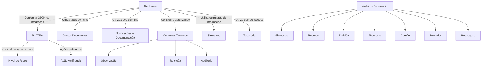
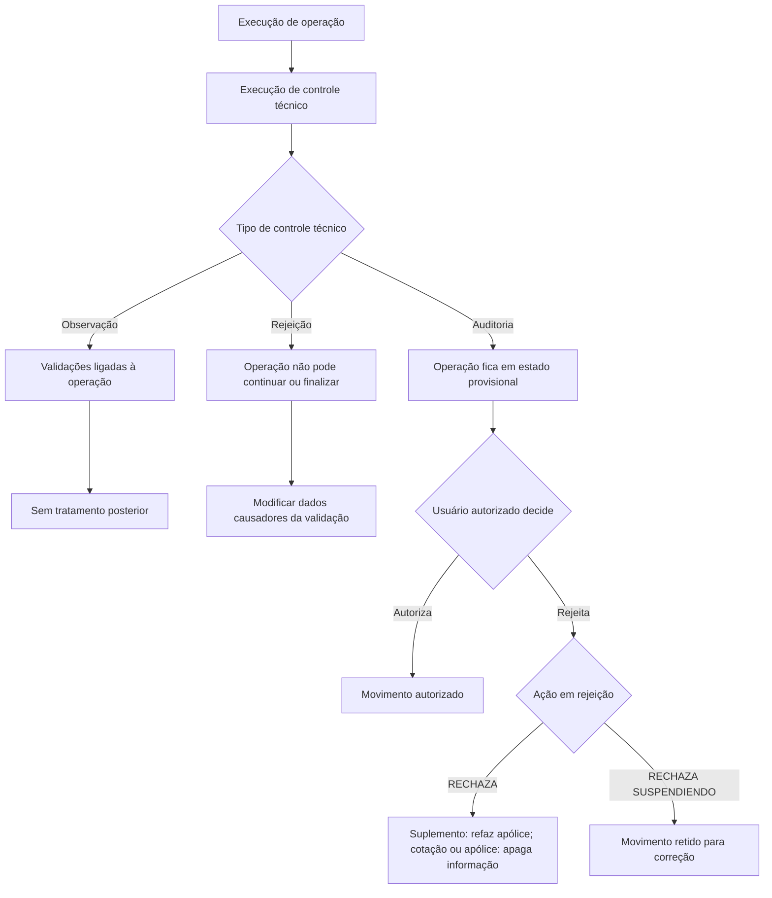

# Tipos Comuns do Reef.core — Documentação Reef

## 1. Metadados do Documento
- **Arquivo de Origem:** `Não identificado no conteúdo extraído`
- **Tipo de Documento:** `Especificação Técnica`
- **Domínio / Sistema:** `Reef.core / Documentación Reef / Mapfre`
- **Público-Alvo:** `Desenvolvedores, Arquitetos, Operação, Negócio`
- **Data/Versão Identificada:** `Não identificada`
- **Owner identificado:** `user:agonzalez_mapfre.com`
- **Lifecycle identificado:** `Approved`
- **Fonte identificada:** `VL`

---

## 2. Resumo Executivo & Contexto de Negócio

O documento apresenta um catálogo de tipos, códigos e descrições utilizados no sistema **Reef.core**. O conteúdo define domínios de valores para funcionalidades de seguros, sinistros, emissão, tesouraria, documentação, notificações, fraude, controles técnicos, estruturas de informação e acesso parcial à informação.

Os tipos documentados padronizam comportamentos e classificações do sistema. Entre os exemplos estão a determinação de ramo contábil por cobertura, o nível de risco de indicadores antifraude em PLATEA, a origem de dados para composição de JSON de integração com PLATEA, canais de distribuição de notificações e métodos de indexação documental.

O catálogo também descreve regras operacionais relevantes para **Controles Técnicos**, incluindo as diferenças entre controles de observação, rejeição e auditoria. Para controles de auditoria, o documento define os efeitos de rejeitar um movimento ou rejeitá-lo mantendo-o suspenso para posterior correção.

O domínio de sinistros é detalhado por meio de conceitos lógicos e operações funcionais codificadas. Essas operações incluem criação, modificação, consulta, liquidação, faturação, salvamento, inspeção, juízo, fraude, IQRF, planos de renda e trâmites.

O documento não apresenta contratos de API, endpoints HTTP, URLs de ambientes, topologias de infraestrutura, versões de componentes ou detalhes de persistência. A finalidade identificável é documentar códigos de domínio e respectivas regras funcionais aplicáveis ao Reef.core.

---

## 3. Arquitetura, Componentes & Tecnologias Envolvidas

### Sistemas, módulos e domínios identificados

| Componente / Domínio | Papel identificado no documento | Observações |
| :--- | :--- | :--- |
| **Reef.core** | Núcleo do sistema no qual os tipos e regras documentados são utilizados. | O documento menciona Reef.core na autorização de controles técnicos e na composição de JSON para PLATEA. |
| **PLATEA** | Sistema relacionado a indicadores e ações antifraude. | São definidos níveis de risco, ações antifraude e origem de dados para JSON de integração. |
| **Gestor Documental** | Componente de indexação de documentos. | Possui tipos de indexação como pessoa física/jurídica, apólice/aplicação, suplemento, sinistro e expediente. |
| **Notificações / Documentação Entrada** | Domínio de distribuição e obtenção de documentos ou notificações. | Inclui canais, âmbito funcional, destinatários e modalidades síncrona/assíncrona. |
| **Controle Técnico** | Mecanismo de validação e tratamento de movimentos. | Tipos: observação, rejeição e auditoria. |
| **Siniestros** | Domínio de sinistros. | Associado a conceitos lógicos, operações funcionais e estruturas de informação. |
| **Tesorería** | Domínio de tesouraria. | Associado ao tipo de compensação e ao âmbito funcional `TSY`. |
| **Reaseguro** | Módulo funcional e de autorização de controles técnicos. | Código de âmbito funcional `RNS`. |
| **TRON / Tronador** | Módulo funcional identificado pelo código `TRN`. | Não há detalhamento adicional. |
| **Emisión** | Módulo funcional identificado pelo código `ISU`. | Também participa da obtenção de data contábil para emissão de apólices e contratos. |
| **Terceros** | Módulo funcional identificado pelo código `THP`. | Há restrições de acesso relacionadas a terceiros. |
| **PL/SQL** | Tipo de programa. | Código `1`. |
| **COBOL** | Tipo de programa. | Código `2`. |
| **SHELL (UNIX)** | Tipo de programa. | Código `3`. |



> **Nota de Análise:** O documento identifica Reef.core, PLATEA, Gestor Documental e diversos módulos funcionais, mas não detalha serviços, métodos HTTP, contratos JSON, filas, bancos de dados, URLs ou topologia de implantação.

---

## 4. Regras de Negócio, Especificações Funcionais & Processos

### 4.1 Ramo contábil por cobertura

O tipo de ramo contábil determina as formas de obtenção do ramo contábil associado a uma cobertura:

- `1 — RAMO CONTABLE ESTÁNDAR POR COBERTURA`
- `2 — RAMO CONTABLE DEPENDIENTE POR DATO VARIABLE`

### 4.2 Indicadores antifraude em PLATEA

O tipo de nível de risco determina o nível de risco do indicador antifraude em PLATEA. Os valores previstos são:

- `100 — CRÍTICO`
- `75 — ALTO`
- `50 — MEDIO`
- `25 — BAJO`
- `-1 — SIN RESPUESTA`

O tipo de ação antifraude em PLATEA determina a ação associada ao indicador antifraude:

- `1 — CONTROL TÉCNICO`
- `2 — NUEVO TRÁMITE`
- `3 — NUEVO NIVEL EN PLAN DE TRAMITACIÓN`
- `4 — SIN ACCIÓN`

### 4.3 Origem de dados para integração com PLATEA

O tipo de continente do dado determina a origem do dado no Reef.core para conformar o JSON de integração com PLATEA:

- `1 — DATO FIJO`
- `2 — INTERVENCIÓN`
- `3 — DATO VARIABLE`
- `4 — CONCEPTO DESGLOSE`
- `5 — NO APLICA`

### 4.4 Documentos, notificações e distribuição

Os documentos ou notificações podem ser distribuídos usando os canais `LOCAL`, `CORREO ELECTRÓNICO`, `FAX`, `MENSAJERÍA (SMS)`, `FILE SYSTEM`, `WEB`, `GESTOR DOCUMENTAL`, `PEX`, `FIRMA ELECTRÓNICA` e `WEBPLUS`.

O âmbito funcional de documento ou notificação pode ser:

- `1 — ENTRADA`
- `2 — SALIDA`

A obtenção de documento ou notificação pode ser:

- `1 — SÍNCRONA`
- `2 — ASÍNCRONA`

Os destinatários em anotações de e-mail podem ser classificados como:

- `1 — NORMAL (PARA)`
- `2 — CON COPIA (CC)`
- `3 — CON COPIA OCULTA (CCO)`

### 4.5 Indexação em Gestor Documental

O método de indexação do documento é determinado conforme modelo e tipos documentais definidos localmente. Os tipos identificados são:

- `1 — PERSONA FÍSICA Y JURÍDICA`
- `2 — póliza/aplicación`
- `3 — SUPLEMENTO`
- `4 — SINIESTRO`
- `5 — EXPEDIENTE`
- `6 — EXPEDIENTE / PLAN DE TRAM.`
- `7 — RECIBO`
- `8 — RECIBO / PÓLIZA`

### 4.6 Controles técnicos

O documento define três tipos de controles técnicos:

1. **Observação (`1`)**  
   As validações ficam ligadas à operação em que foram executadas e não requerem tratamento posterior.

2. **Rejeição (`2`)**  
   As validações implementadas não ficam refletidas na operação e não permitem continuar ou finalizar a operação. É obrigatório modificar os dados que provocaram a execução do controle.

3. **Auditoria (`3`)**  
   As validações implementadas ficam refletidas e vinculadas à operação. A operação permanece em estado `provisional` até que um usuário habilitado e com autoridade suficiente autorize ou rejeite o movimento.

Para um controle técnico de auditoria rejeitado:

- Quando executado em um **suplemento**, o sistema refaz a apólice, deixando-a no estado em que se encontrava anteriormente.
- Quando executado em uma **cotação ou apólice**, o sistema apaga a informação do sistema. A entidade pode decidir quais dados do movimento deseja manter por questões de auditoria, comerciais ou técnicas.

Para um controle técnico de auditoria com ação **rechaza suspendiendo**:

- O sistema deixa o movimento retido.
- O usuário, ou outro usuário conforme configuração explícita, pode retomar o movimento.
- O movimento pode ser modificado para corrigir a informação que provocou o controle técnico.



### 4.7 Autorização de controles técnicos

O procedimento de autorização determina o domínio do sistema no qual Reef.core considera a autorização do controle técnico:

- `1 — Control Técnico STANDARD`
- `2 — Control Técnico de INSPECCIONES`
- `3 — Control Técnico Módulo de REASEGURO`
- `4 — Control Técnico Módulo NOTIFICACIONES / Documentación ENTRADA`

### 4.8 Estruturas de informação de sinistros

As estruturas de informação podem utilizar conceitos lógicos e operações funcionais, desde que as agrupações associadas correspondam a agrupações específicas de sinistros.

Os conceitos lógicos incluem condutor, danos materiais, danos a pessoas, defesa penal, documentação, lugar do sinistro, relato, testemunha, dados de veículo, acessório, segurado e beneficiário.

As operações funcionais incluem operações de criação, modificação, término, reabilitação, consulta, liquidação, faturação, salvamento, inspeção, juízo, fraude, IQRF, histórico de modificações, reassociação de tramitador e trâmites.

### 4.9 Acesso à informação parcial

O tipo de papel no acesso à informação parcial determina os papéis considerados na visualização de informação por usuários. O documento contempla operações, restrições por domínio, informação parcial por conceito lógico, atributo e fila, além de acesso a dados.

O tipo de restrição de acesso à informação define:

- `O — OCULTO`
- `L — SOLO LECTURA`
- `C — SOLO CREACIÓN`

### 4.10 Data contábil de emissão

No processo de emissão de apólices e contratos, a data de emissão do movimento para contabilização de prêmios pode ser obtida conforme as seguintes opções:

- `1 — MAYOR FECHA CONTABLE Y FECHA EMISIÓN SUPLEMENTO`
- `2 — POR OBJETO`
- `3 — MAYOR FECHA CONTABLE Y FECHA EFECTO SUPLEMENTO`

---

## 5. Tabelas de Parâmetros, Ambientes e Estruturas de Dados

### 5.1 Tipos de ramo contábil, PLATEA e origem de dados

| Item / Parâmetro | Descrição / Função | Tipo / Valores / Formato | Ambiente / Observações |
| :--- | :--- | :--- | :--- |
| Tipo de Ramo Contable | Determina as formas de obtenção do ramo contábil associado à cobertura. | `1 — RAMO CONTABLE ESTÁNDAR POR COBERTURA`; `2 — RAMO CONTABLE DEPENDIENTE POR DATO VARIABLE` | Cobertura |
| Tipo de Nivel de Riesgo | Determina o nível de risco do indicador antifraude. | `100 — CRÍTICO`; `75 — ALTO`; `50 — MEDIO`; `25 — BAJO`; `-1 — SIN RESPUESTA` | PLATEA |
| Tipo de Continente del Dato | Determina a origem do dado no Reef.core para conformar JSON de integração. | `1 — DATO FIJO`; `2 — INTERVENCIÓN`; `3 — DATO VARIABLE`; `4 — CONCEPTO DESGLOSE`; `5 — NO APLICA` | Integração Reef.core–PLATEA |
| Tipo de Acción Antifraude | Determina a ação antifraude associada ao indicador. | `1 — CONTROL TÉCNICO`; `2 — NUEVO TRÁMITE`; `3 — NUEVO NIVEL EN PLAN DE TRAMITACIÓN`; `4 — SIN ACCIÓN` | PLATEA |

### 5.2 Notificações, documentos e indexação

| Item / Parâmetro | Descrição / Função | Tipo / Valores / Formato | Ambiente / Observações |
| :--- | :--- | :--- | :--- |
| Canal de Distribución | Determina o canal de distribuição de documentos ou notificações. | `1 LOCAL`; `2 CORREO ELECTRÓNICO`; `3 FAX`; `4 MENSAJERÍA (SMS)`; `5 FILE SYSTEM`; `6 WEB`; `7 GESTOR DOCUMENTAL`; `8 PEX`; `9 FIRMA ELECTRÓNICA`; `10 WEBPLUS` | Ferramenta de geração e envio |
| Indexación en Gestor Documental | Determina o método de indexação conforme modelo e tipos documentais locais. | `1 PERSONA FÍSICA Y JURÍDICA`; `2 póliza/aplicación`; `3 SUPLEMENTO`; `4 SINIESTRO`; `5 EXPEDIENTE`; `6 EXPEDIENTE / PLAN DE TRAM.`; `7 RECIBO`; `8 RECIBO / PÓLIZA` | Gestor Documental |
| Ámbito Funcional del Documento o Notificación | Determina o âmbito funcional de uso do documento ou notificação. | `1 ENTRADA`; `2 SALIDA` | Documentos e notificações |
| Obtención del Documento o Notificación | Determina a forma de obtenção do documento ou notificação. | `1 SÍNCRONA`; `2 ASÍNCRONA` | Documentos e notificações |
| Destinatario en Anotaciones | Determina o âmbito do e-mail no qual o destinatário se enquadra. | `1 NORMAL (PARA)`; `2 CON COPIA (CC)`; `3 CON COPIA OCULTA (CCO)` | Notificação por e-mail |
| Nivel Nota | Define o nível da nota. | `P PÓLIZA`; `R RIESGO`; `T CONTROL TÉCNICO`; `X NO REPORTE` | Notas |
| Tipo Nota | Define o tipo da nota. | `M CORREO`; `L CARTA`; `F FICHERO` | Notas |

### 5.3 Âmbitos, papéis e restrições

| Item / Parâmetro | Descrição / Função | Tipo / Valores / Formato | Ambiente / Observações |
| :--- | :--- | :--- | :--- |
| Ámbito Funcional do Concepto Lógico e/ou Propiedad | Determina o módulo funcional associado a papel de informação parcial, conceito lógico e propriedades. | `LSS SINIESTROS`; `THP TERCEROS`; `ISU EMISIÓN`; `TSY TESORERÍA`; `CMN COMÚN`; `TRN TRONADOR`; `RNS REASEGURO` | Informação parcial |
| Rol en Acceso a la Información Parcial | Determina papéis considerados na visualização de informação por usuários. | `01 OPERACIONES`; `1 OPERACIONES`; `10 RESTRICCIONES - Terceros`; `11 RESTRICCIONES - Emisión`; `12 RESTRICCIONES - Control técnico`; `13 RESTRICCIONES - CAJEROS - Definición`; `14 RESTRICCIONES - CAJEROS - Tipos de orden de pago`; `15 RESTRICCIONES - CAJEROS - Cuentas simplificadas`; `16 RESTRICCIONES - CAJEROS - Conceptos de cobro/pago`; `20 INFORMACIÓN PARCIAL - Concepto lógico`; `21 INFORMACIÓN PARCIAL - Atributo`; `22 INFORMACIÓN PARCIAL - Fila`; `30 ACCESO A DATOS` | Acesso à informação parcial |
| Restricción en Acceso a la Información | Determina a restrição do usuário no acesso à informação. | `O OCULTO`; `L SOLO LECTURA`; `C SOLO CREACIÓN` | Controle de acesso |

### 5.4 Controles técnicos, tarefas e programas

| Item / Parâmetro | Descrição / Função | Tipo / Valores / Formato | Ambiente / Observações |
| :--- | :--- | :--- | :--- |
| Acción en Rechazo de Control Técnico | Define o comportamento do sistema quando um usuário rejeita controle técnico de auditoria. | `2 RECHAZA`; `3 RECHAZA SUSPENDIENDO` | Auditoria |
| Procedimiento de Autorización de Controles Técnicos | Determina o domínio considerado por Reef.core para autorização do controle técnico. | `1 STANDARD`; `2 INSPECCIONES`; `3 Módulo de REASEGURO`; `4 Módulo NOTIFICACIONES / Documentación ENTRADA` | Reef.core |
| Control Técnico | Determina tipos de controles técnicos existentes no sistema. | `1 OBSERVACIÓN`; `2 RECHAZO`; `3 AUDITORÍA` | Sistema |
| Tarea | Determina tipos de tarefas existentes no núcleo do sistema. | `1 PROGRAMA`; `2 LISTADO`; `3 CARTAS` | Núcleo do sistema |
| Programa | Determina o tipo de programa. | `1 PL/SQL`; `2 COBOL`; `3 SHELL (UNIX)` | Programas |

### 5.5 Conceitos lógicos de estruturas de informação

| Código | Conceito lógico | Contexto |
| :--- | :--- | :--- |
| `1` | CONDUCTOR | Estruturas de informação associadas a agrupações específicas de sinistros |
| `2` | DAÑO MATERIAL | Estruturas de informação associadas a agrupações específicas de sinistros |
| `3` | DAÑO PERSONA | Estruturas de informação associadas a agrupações específicas de sinistros |
| `4` | DEFENSA PENAL | Estruturas de informação associadas a agrupações específicas de sinistros |
| `5` | DOCUMENTACIÓN | Estruturas de informação associadas a agrupações específicas de sinistros |
| `6` | LUGAR SINIESTRO | Estruturas de informação associadas a agrupações específicas de sinistros |
| `7` | RELATO | Estruturas de informação associadas a agrupações específicas de sinistros |
| `8` | TESTIGO | Estruturas de informação associadas a agrupações específicas de sinistros |
| `9` | DATO VEHÍCULO | Estruturas de informação associadas a agrupações específicas de sinistros |
| `10` | ACCESORIO | Estruturas de informação associadas a agrupações específicas de sinistros |
| `11` | ASEGURADO | Estruturas de informação associadas a agrupações específicas de sinistros |
| `12` | BENEFICIARIO | Estruturas de informação associadas a agrupações específicas de sinistros |

### 5.6 Compensação, consultas, data contábil e procedência comercial

| Item / Parâmetro | Descrição / Função | Tipo / Valores / Formato | Ambiente / Observações |
| :--- | :--- | :--- | :--- |
| Compensación | Determina o âmbito em que compensações de tesouraria podem ser realizadas. | `1 AMBOS`; `2 COBROS`; `3 PAGOS` | Tesorería |
| Opciones en Consultas | Determina opções de consulta em programas de consultas de informação. | `T TERCEROS`; `P AGENTE`; `G GRUPO DE INFORMACIÓN`; `E ESTRUCTURA COMERCIAL`; `C NUM.CONTRATO/PÓLIZA GRUPO`; `J EJECUTIVOS DE CUENTAS` | Consultas |
| Opciones para obtener la Fecha Contable | Determina opções para obter data de emissão do movimento para contabilização de prêmios. | `1 MAYOR FECHA CONTABLE Y FECHA EMISIÓN SUPLEMENTO`; `2 POR OBJETO`; `3 MAYOR FECHA CONTABLE Y FECHA EFECTO SUPLEMENTO` | Emissão de apólices e contratos |
| Procedencia Comercial del Concepto Económico | Determina a procedência do conceito econômico no processo de liquidação de comissões. | `1 Comisiones de Conceptos Económicos - Derechos`; `2 Comisiones de Conceptos Económicos - Campañas Derechos Comerciales` | Liquidação de comissões |

### 5.7 Operações funcionais em estruturas de informação

| Código | Operação funcional |
| :--- | :--- |
| `L1` | Crear siniestro |
| `L2` | Crear expediente |
| `L3` | Valorar expediente |
| `L4` | Valorar expediente promedio |
| `L5` | Modificar siniestro |
| `L6` | Terminar siniestro |
| `L7` | Rehabilitar siniestro |
| `L8` | Modificar expediente |
| `L9` | Modificar valoración expediente |
| `L10` | Terminar expediente |
| `L11` | Rehabilitar expediente |
| `L12` | Generar liquidación |
| `L13` | Modificar liquidación |
| `L14` | Anular liquidación |
| `L15` | Justificante suelto |
| `L16` | Crear información inspección solicitud |
| `L17` | Modificar información inspección solicitud |
| `L18` | Crear información inspección resultado |
| `L19` | Modificar información inspección resultado |
| `L20` | Crear dao inspección |
| `L21` | Modificar dao inspección |
| `L22` | Crear orden reparación |
| `L23` | Modificar orden reparación con definición |
| `L24` | Anular orden reparación |
| `L25` | Crear entrada salvamento |
| `L26` | Crear salida salvamento |
| `L27` | Crear salvamento |
| `L28` | Modificar salvamento |
| `L29` | Asociar siniestro a salvamento |
| `L30` | Asociar expediente a salvamento |
| `L31` | Crear subasta |
| `L32` | Asociar inventario a subasta |
| `L33` | Modificar subasta |
| `L34` | Vender salvamento |
| `L35` | Liberar salvamento |
| `L36` | Anular salvamento |
| `L37` | Crear juicio demanda con definición |
| `L38` | Crear juicio sentencia con definición |
| `L39` | Modificar juicio demanda con definición |
| `L40` | Crear juicio sentencia con definición |
| `L41` | Asociar expediente juicio con definición |
| `L42` | CREAR intervención juicio |
| `L43` | MODIFICAR intervención juicio |
| `L44` | Crear plan renta |
| `L45` | Anular plan renta |
| `L46` | Terminar plan renta |
| `L47` | Terminar plan renta sin anular |
| `L48` | CREAR facturación |
| `L49` | MODIFICAR facturación liquidada |
| `L50` | MODIFICAR facturación no liquidada |
| `L51` | GENERAR liquidación facturación |
| `L52` | ANULAR facturación liquidada |
| `L53` | ANULAR facturación no liquidada |
| `L54` | TRATAR facturación MULTIPLE |
| `L55` | TRATAR facturación MULTIPLE LIQUIDACIÓN |
| `L56` | TRATAR facturación MULTIPLE JUSTIFICANTE |
| `L74` | TRATAR control técnico siniestro |
| `L78` | Activar Tramite |
| `L79` | FINALIZAR TRAMITE |
| `L94` | Consultar Siniestro |
| `L95` | Consultar Expediente |
| `L96` | CONSULTAR inspección |
| `L97` | CONSULTAR juicio |
| `L98` | Consulta de Plan de Renta |
| `L99` | Consulta de Salvamentos |
| `L1C` | Crear siniestro completo |
| `LA1` | Consulta de Facturación |
| `LA2` | Consulta de Inventarios de un siniestro |
| `LA4` | CONSULTAR juicio genérico |
| `LA6` | Consultar Tramites |
| `LB1` | CREAR FRAUDE SINIESTRO |
| `LB2` | MODIFICAR FRAUDE SINIESTRO |
| `LB3` | CONSULTAR FRAUDE SINIESTRO |
| `LB4` | CREAR FRAUDE EXPEDIENTE |
| `LB5` | MODIFICAR FRAUDE EXPEDIENTE |
| `LB6` | CONSULTAR FRAUDE EXPEDIENTE |
| `LC1` | EXPEDIENTES PROVEEDORES |
| `LD1` | CREAR IQRF SINIESTRO |
| `LD2` | MODIFICAR IQRF SINIESTRO |
| `LD3` | CONSULTAR IQRF SINIESTRO |
| `LD4` | CREAR IQRF EF EXPEDIENTE |
| `LD5` | MODIFICAR IQRF EXPEDIENTE |
| `LD6` | CONSULTAR IQRF EXPEDIENTE |
| `LE1` | HISTÓRICO MODIFICACIONES SINIESTRO |
| `LE2` | HISTÓRICO MODIFICACIONES EXPEDIENTE |
| `LE3` | REASIGNAR TRAMITADOR EXPEDIENTE |

---

## 6. Bateria de Perguntas & Respostas para RAG (FAQ Sintético)

### P1: Quais níveis de risco antifraude podem ser enviados ou tratados no contexto do PLATEA?
**R:** O tipo de nível de risco do indicador antifraude em PLATEA contempla `100 — CRÍTICO`, `75 — ALTO`, `50 — MEDIO`, `25 — BAJO` e `-1 — SIN RESPUESTA`. O documento define esses valores como o domínio que determina o nível de risco de um indicador antifraude em PLATEA.

### P2: Quais são as origens possíveis de um dado usado para conformar o JSON de integração entre Reef.core e PLATEA?
**R:** O tipo de continente do dado define cinco origens: `1 — DATO FIJO`, `2 — INTERVENCIÓN`, `3 — DATO VARIABLE`, `4 — CONCEPTO DESGLOSE` e `5 — NO APLICA`. O documento afirma que esse tipo determina a origem do dado no Reef.core para conformar o JSON de integração com PLATEA.

### P3: O que acontece quando um controle técnico de auditoria é rejeitado em um suplemento?
**R:** Quando um controle técnico de auditoria é rejeitado e foi executado em um suplemento, o sistema refaz a apólice, deixando-a no estado em que se encontrava previamente.

### P4: Qual é o comportamento de “RECHAZA SUSPENDIENDO” em um controle técnico de auditoria?
**R:** A ação `3 — RECHAZA SUSPENDIENDO` deixa o movimento retido. O usuário, ou outro usuário conforme configuração explicitamente realizada, pode retomar o movimento para modificar a informação que provocou a existência do controle técnico.

### P5: Qual a diferença entre controles técnicos de observação, rejeição e auditoria?
**R:** Em controles de **observação**, as validações ficam ligadas à operação e não exigem tratamento posterior. Em controles de **rejeição**, as validações não ficam refletidas na operação e impedem continuar ou finalizar a operação, sendo obrigatório modificar os dados causadores. Em controles de **auditoria**, as validações ficam refletidas e ligadas à operação, que permanece em estado `provisional` até um usuário habilitado autorizar ou rejeitar o movimento.

### P6: Quais canais de distribuição são suportados para documentos ou notificações?
**R:** O catálogo identifica dez canais: `LOCAL`, `CORREO ELECTRÓNICO`, `FAX`, `MENSAJERÍA (SMS)`, `FILE SYSTEM`, `WEB`, `GESTOR DOCUMENTAL`, `PEX`, `FIRMA ELECTRÓNICA` e `WEBPLUS`.

### P7: Quais modalidades de obtenção de documento ou notificação existem?
**R:** O tipo de obtenção de documento ou notificação oferece duas modalidades: `1 — SÍNCRONA` e `2 — ASÍNCRONA`.

### P8: Quais métodos de indexação documental existem no Gestor Documental?
**R:** O documento lista indexação para `PERSONA FÍSICA Y JURÍDICA`, `póliza/aplicación`, `SUPLEMENTO`, `SINIESTRO`, `EXPEDIENTE`, `EXPEDIENTE / PLAN DE TRAM.`, `RECIBO` e `RECIBO / PÓLIZA`. O método deve ser definido conforme o modelo e tipos documentais definidos localmente.

### P9: Qual código representa a consulta de sinistro nas operações funcionais de estruturas de informação?
**R:** O código `L94` representa a operação `Consultar Siniestro`. A mesma tabela também prevê `L95 — Consultar Expediente`, `L96 — CONSULTAR inspección`, `L97 — CONSULTAR juicio`, `L98 — Consulta de Plan de Renta` e `L99 — Consulta de Salvamentos`.

### P10: Quais tipos de restrição de acesso à informação são definidos?
**R:** O documento define três tipos de restrição: `O — OCULTO`, `L — SOLO LECTURA` e `C — SOLO CREACIÓN`. Esses tipos determinam a restrição aplicada ao usuário no acesso à informação.

### P11: Como pode ser obtida a data contábil na emissão de apólices e contratos?
**R:** Há três opções: `1 — MAYOR FECHA CONTABLE Y FECHA EMISIÓN SUPLEMENTO`; `2 — POR OBJETO`; e `3 — MAYOR FECHA CONTABLE Y FECHA EFECTO SUPLEMENTO`. Essas opções determinam como obter a data de emissão do movimento para contabilizar os prêmios.

### P12: Quais programas são reconhecidos pelo tipo de programa do núcleo do sistema?
**R:** O documento reconhece `1 — PL/SQL`, `2 — COBOL` e `3 — SHELL (UNIX)` como tipos de programa.

---

## 7. Glossário de Termos, Siglas & Conceitos-Chave

- **CMN:** `COMÚN`; âmbito funcional listado para conceito lógico e/ou propriedade.
- **CC:** `CON COPIA`; destinatário de anotação por e-mail.
- **CCO:** `CON COPIA OCULTA`; destinatário de anotação por e-mail.
- **Gestor Documental:** Componente associado à indexação de documentos conforme modelos e tipos documentais locais.
- **IQRF:** Sigla presente nas operações funcionais `LD1` a `LD6`; o documento não expande seu significado.
- **ISU:** `EMISIÓN`; âmbito funcional.
- **JSON:** Formato citado para integração entre Reef.core e PLATEA; o documento não especifica o contrato JSON.
- **LSS:** `SINIESTROS`; âmbito funcional.
- **PEX:** Canal de distribuição de documentos ou notificações; o documento não expande o termo.
- **PLATEA:** Sistema associado a indicadores, níveis de risco e ações antifraude.
- **PL/SQL:** Tipo de programa identificado pelo código `1`.
- **RNS:** `REASEGURO`; âmbito funcional.
- **SHELL (UNIX):** Tipo de programa identificado pelo código `3`.
- **THP:** `TERCEROS`; âmbito funcional.
- **TRN:** `TRONADOR`; âmbito funcional.
- **TSY:** `TESORERÍA`; âmbito funcional.
- **Reef.core:** Sistema no qual são aplicados os tipos documentados e que compõe JSON de integração com PLATEA.

---

## 8. Notas Críticas, Riscos & Limitações

- O documento é um catálogo de tipos e códigos; não detalha o modelo de dados físico, tabelas de banco, serviços, APIs, endpoints, métodos HTTP, payloads JSON ou mecanismos de autenticação.
- Não há URLs, portas, nomes de servidores, ambientes de implantação, rotas de log, pipelines de CI/CD ou tecnologias de mensageria identificadas.
- As siglas `IQRF`, `PEX`, `LSS`, `THP`, `ISU`, `TSY`, `CMN`, `TRN` e `RNS` não são integralmente expandidas pelo conteúdo. Apenas as expansões explicitamente presentes foram registradas.
- O documento determina efeitos importantes para a rejeição de controles técnicos de auditoria. A implementação desses comportamentos deve preservar a distinção entre suplemento, cotação e apólice.
- Para controles técnicos de rejeição, o movimento não pode continuar nem ser finalizado até que os dados que causaram a validação sejam modificados.
- **Nota de Análise:** O documento lista operações funcionais, mas não detalha pré-condições, permissões por operação, transições de estado, contratos de entrada ou efeitos de persistência de cada código.
- **Nota de Análise:** O documento menciona a conformação de JSON para PLATEA, porém não detalha campos, estrutura, serialização, protocolos de transporte ou tratamento de falhas da integração.

---

## 9. Conteúdo Bruto Estruturado (Referência Fiel)

```text
--- [PÁGINA 1 DE 12] ---

TIPOS (COMUNES)
TIPO de RAMO CONTABLE
Determina las formas de obtención del Ramo Contable asociado a la Cobertura.
TIPO DESCRIPCIÓN
1 RAMO CONTABLE ESTÁNDAR POR COBERTURA
2 RAMO CONTABLE DEPENDIENTE POR DATO VARIABLE
TIPO de NIVEL de RIESGO de los Indicadores Antifraude en PLATEA
Determina el Nivel del Riesgo del Indicador Antifraude.
TIPO DESCRIPCIÓN
100 CRÍTICO
75 ALTO
50 MEDIO
25 BAJO
-1 SIN RESPUESTA
TIPO de CONTINENTE del Dato
Determina el Origen del Dato en Reef.core para conformar el json de integración con PLATEA.
TIPO DESCRIPCIÓN
1 DATO FIJO
2 INTERVENCIÓN
3 DATO VARIABLE
4 CONCEPTO DESGLOSE
Documentation / DOCUMENTACIÓN Reef
DOCUMENTACIÓN Reef
Mapfredocument
DOCUMENTACIÓN Reef
Owner
user:agonzalez_mapfre.com
Lifecycle
Approved Source
 / 
 VL
Buscar Inicio Soluciones Arquitecturas APIs Componentes Cloud Documentación Zeus Reef Ayuda
ES


--- [PÁGINA 2 DE 12] ---

TIPO DESCRIPCIÓN
5 NO APLICA
TIPO de CANAL de DISTRIBUCIÓN en Noticaciones
Determina el Canal de Distribución por el que los Documentos o Noticaciones pueden ser distribuidos mediante el uso de la herramienta de
generación y envío.
TIPO DESCRIPCIÓN
1 LOCAL
2 CORREO ELECTRÓNICO
3 FAX
4 MENSAJERÍA (SMS)
5 FILE SYSTEM
6 WEB
7 GESTOR DOCUMENTAL
8 PEX
9 FIRMA ELECTRÓNICA
10 WEBPLUS
TIPO de ACCIÓN Antifraude en PLATEA
Determina el Nivel del Riesgo del Indicador Antifraude.
TIPO DESCRIPCIÓN
1 CONTROL TÉCNICO
2 NUEVO TRÁMITE
3 NUEVO NIVEL EN PLAN DE TRAMITACIÓN
4 SIN ACCIÓN
TIPO de INDEXACIÓN en Gestor Documental
Determina el método de indexación del Documento de acuerdo con el Modelo y Tipos documentales denidos localmente.
TIPO DESCRIPCIÓN
1 PERSONA FÍSICA Y JURÍDICA


--- [PÁGINA 3 DE 12] ---

TIPO DESCRIPCIÓN
2 póliza/aplicación
3 SUPLEMENTO
4 SINIESTRO
5 EXPEDIENTE
6 EXPEDIENTE / PLAN DE TRAM.
7 RECIBO
8 RECIBO / PÓLIZA
TIPO de ÁMBITO FUNCIONAL del Documento o Noticación
Determina el ámbito Funcional en el que se circunscribe el uso del Documento o Noticación.
TIPO DESCRIPCIÓN
1 ENTRADA
2 SALIDA
TIPO de ÁMBITO FUNCIONAL del Concepto Lógico y/o Propiedad
Determina el Módulo Funcional en el que se inscribe la asignación al Rol de Información Parcial, el Concepto Lógico y sus Propiedades.
TIPO DESCRIPCIÓN
LSS SINIESTROS
THP TERCEROS
ISU EMISIÓN
TSY TESORERÍA
CMN COMÚN
TRN TRONADOR
RNS REASEGURO
TIPO de OBTENCIÓN del Documento o Noticación
Determina la manera en la que se obtiene del Documento o Noticación.
TIPO DESCRIPCIÓN
1 SÍNCRONA


--- [PÁGINA 4 DE 12] ---

TIPO DESCRIPCIÓN
2 ASÍNCRONA
TIPO de ROL en el Acceso a la Información Parcial
Determina los Roles que se pueden considerar en la visualización de la información por parte de los Usuarios.
TIPO DESCRIPCIÓN
01 OPERACIONES
1 OPERACIONES
10 RESTRICCIONES - Terceros
11 RESTRICCIONES - Emisión
12 RESTRICCIONES - Control técnico
13 RESTRICCIONES - CAJEROS - Denición
14 RESTRICCIONES - CAJEROS - Tipos de orden de pago
15 RESTRICCIONES - CAJEROS - Cuentas simplicadas
16 RESTRICCIONES - CAJEROS - Conceptos de cobro/pago
20 INFORMACIÓN PARCIAL - Concepto lógico
21 INFORMACIÓN PARCIAL - Atributo
22 INFORMACIÓN PARCIAL - Fila
30 ACCESO A DATOS
TIPO de ACCIÓN en RECHAZO de Control Técnico
Determina la manera en la que el Sistema se va a comportar en el supuesto que cualquier Usuario rechace un Control Técnico cuya tipología
sea de Auditoría.
TIPO DESCRIPCIÓN
2 RECHAZA
3 RECHAZA SUSPENDIENDO
En el caso que se 'rechace' el Control Técnico de Auditoría:
Si se ha ejecutado en un suplemento, el sistema rehace la póliza dejándola en el estado en el que se encontrara previamente.
Si se ha ejecutado en una cotización o póliza, el sistema borra la información del sistema (pudiendo la entidad decidir qué datos del
movimiento desea mantener por cuestiones de auditoría, comerciales, técnicas...)
En el caso que se 'rechace suspendiendo' el Control Técnico de Auditoría, el sistema dejará el movimiento retenido permitiendo al Usuario (o a
cualquier Usuario de acuerdo con la conguración explícitamente efectuada) retomar el movimiento para modicar la información que


--- [PÁGINA 5 DE 12] ---

provocó la existencia del control técnico.
TIPO de PROCEDIMIENTO de AUTORIZACIÓN de Controles Técnicos
Determina el dominio del Sistema en el que Reef.core va a considerar la autorización del Control Técnico.
TIPO DESCRIPCIÓN
1 Control Técnico STANDARD
2 Control Técnico de INSPECCIONES
3 Control Técnico Módulo de REASEGURO
4 Control Técnico Módulo NOTIFICACIONES / Documentación ENTRADA
TIPO de CONCEPTOS LÓGICOS utilizados en Estructuras de Información
Determina los posibles conceptos funcionales sobre los que se van a poder emplear Estructuras de Información (siempre y cuando las
Agrupaciones asociadas a estas Estructuras de Información se correspondan con Agrupaciones especícas de Siniestros)
TIPO DESCRIPCIÓN
1 CONDUCTOR
2 DAÑO MATERIAL
3 DAÑO PERSONA
4 DEFENSA PENAL
5 DOCUMENTACIÓN
6 LUGAR SINIESTRO
7 RELATO
8 TESTIGO
9 DATO VEHÍCULO
10 ACCESORIO
11 ASEGURADO
12 BENEFICIARIO
TIPO de COMPENSACIÓN
Determina el ámbito en el que las compensaciones de la Tesorería se pueden realizar.
TIPO DESCRIPCIÓN
1 AMBOS


--- [PÁGINA 6 DE 12] ---

TIPO DESCRIPCIÓN
2 COBROS
3 PAGOS
TIPO de DESTINATARIO en Anotaciones
Determina el ámbito del correo electrónico en el que se circunscribe el destinatario de la Noticación.
TIPO DESCRIPCIÓN
1 NORMAL (PARA)
2 CON COPIA (CC)
3 CON COPIA OCULTA (CCO)
TIPO NIVEL NOTA
TIPO DESCRIPCIÓN
P PÓLIZA
R RIESGO
T CONTROL TÉCNICO
X NO REPORTE
TIPO NOTA
TIPO DESCRIPCIÓN
M CORREO
L CARTA
F FICHERO
TIPO de OPCIONES en CONSULTAS
Determina las posibles opciones de consultas contempladas en los Programas de Consultas de información
TIPO DESCRIPCIÓN
T TERCEROS
P AGENTE
G GRUPO DE INFORMACIÓN


--- [PÁGINA 7 DE 12] ---

TIPO DESCRIPCIÓN
E ESTRUCTURA COMERCIAL
C NUM.CONTRATO/PÓLIZA GRUPO
J EJECUTIVOS DE CUENTAS
TIPO de OPERACIONES FUNCIONALES utilizados en Estructuras de Información
Determina las posibles operaciones funcionales sobre los que se van a poder emplear Estructuras de Información (siempre y cuando las
Agrupaciones asociadas a estas Estructuras de Información se correspondan con Agrupaciones especícas de Siniestros)
TIPO DESCRIPCIÓN
L1 Crear siniestro
L2 Crear expediente
L3 Valorar expediente
L4 Valorar expediente promedio
L5 Modicar siniestro
L6 Terminar siniestro
L7 Rehabilitar siniestro
L8 Modicar expediente
L9 Modicar valoración expediente
L10 Terminar expediente
L11 Rehabilitar expediente
L12 Generar liquidación
L13 Modicar liquidación
L14 Anular liquidación
L15 Justicante suelto
L16 Crear información inspección solicitud
L17 Modicar información inspección solicitud
L18 Crear información inspección resultado
L19 Modicar información inspección resultado
L20 Crear dao inspección


--- [PÁGINA 8 DE 12] ---

TIPO DESCRIPCIÓN
L21 Modicar dao inspección
L22 Crear orden reparación
L23 Modicar orden reparación con denición
L24 Anular orden reparación
L25 Crear entrada salvamento
L26 Crear salida salvamento
L27 Crear salvamento
L28 Modicar salvamento
L29 Asociar siniestro a salvamento
L30 Asociar expediente a salvamento
L31 Crear subasta
L32 Asociar inventario a subasta
L33 Modicar subasta
L34 Vender salvamento
L35 Liberar salvamento
L36 Anular salvamento
L37 Crear juicio demanda con denición
L38 Crear juicio sentencia con denición
L39 Modicar juicio demanda con denición
L40 Crear juicio sentencia con denición
L41 Asociar expediente juicio con denición
L42 CREAR intervención juicio
L43 MODIFICAR intervención juicio
L44 Crear plan renta
L45 Anular plan renta
L46 Terminar plan renta


--- [PÁGINA 9 DE 12] ---

TIPO DESCRIPCIÓN
L47 Terminar plan renta sin anular
L48 CREAR facturación
L49 MODIFICAR facturación liquidada
L50 MODIFICAR facturación no liquidada
L51 GENERAR liquidación facturación
L52 ANULAR facturación liquidada
L53 ANULAR facturación no liquidada
L54 TRATAR facturación MULTIPLE
L55 TRATAR facturación MULTIPLE LIQUIDACIÓN
L56 TRATAR facturación MULTIPLE JUSTIFICANTE
L74 TRATAR control técnico siniestro
L78 Activar Tramite
L79 FINALIZAR TRAMITE
L94 Consultar Siniestro
L95 Consultar Expediente
L96 CONSULTAR inspección
L97 CONSULTAR juicio
L98 Consulta de Plan de Renta
L99 Consulta de Salvamentos
L1C Crear siniestro completo
LA1 Consulta de Facturación
LA2 Consulta de Inventarios de un siniestro
LA4 CONSULTAR juicio genérico
LA6 Consultar Tramites
LB1 CREAR FRAUDE SINIESTRO
LB2 MODIFICAR FRAUDE SINIESTRO


--- [PÁGINA 10 DE 12] ---

TIPO DESCRIPCIÓN
LB3 CONSULTAR FRAUDE SINIESTRO
LB4 CREAR FRAUDE EXPEDIENTE
LB5 MODIFICAR FRAUDE EXPEDIENTE
LB6 CONSULTAR FRAUDE EXPEDIENTE
LC1 EXPEDIENTES PROVEEDORES
LD1 CREAR IQRF SINIESTRO
LD2 MODIFICAR IQRF SINIESTRO
LD3 CONSULTAR IQRF SINIESTRO
LD4 CREAR IQRF EF EXPEDIENTE
LD6 CONSULTAR IQRF EXPEDIENTE
LE1 HISTÓRICO MODIFICACIONES SINIESTRO
LE2 HISTÓRICO MODIFICACIONES EXPEDIENTE
LE3 REASIGNAR TRAMITADOR EXPEDIENTE
LD5 MODIFICAR IQRF EXPEDIENTE
TIPO PROGRAMA
TIPO DESCRIPCIÓN
1 PL/SQL
2 COBOL
3 SHELL (UNIX)
TIPO de CONTROL TÉCNICO
Determina los distintos Tipos de Controles Técnicos existentes en el Sistema.
TIPO DESCRIPCIÓN
1 OBSERVACIÓN
2 RECHAZO
3 AUDITORÍA


--- [PÁGINA 11 DE 12] ---

En los Controles Técnicos de OBSERVACIÓN, La validación o validaciones quedan ligadas a la operación sobre las que se han ejecutado y no
requieren ningún tipo de tratamiento posterior.
En los Controles Técnicos de AUDITORÍA, la validación o validaciones implementadas quedan reejadas y ligadas a la operación sobre las
que se han ejecutado, quedando ésta en un estado 'provisional' hasta que algún Usuario habilitado con la Autoridad suciente decida su
procedencia o improcedencia autorizando o rechazando respectivamente el movimiento realizado.
Por último, en los Controles Técnicos de RECHAZO La validación o validaciones implementadas ni quedan reejadas en la operación ni
permiten continuar o nalizarla por lo que es obligatorio modicar aquellos datos que provocan su ejecución.
TIPO de TAREA
Determina los tipos de Tareas Existentes en el Núcleo del Sistema.
TIPO DESCRIPCIÓN
1 PROGRAMA
2 LISTADO
3 CARTAS
TIPO de OPCIONES para obtener la FECHA CONTABLE
Determina las posibles opciones por las que se puede obtener en el proceso de emisión de pólizas y contratos la fecha de emisión del
movimiento para contabilizar las primas
TIPO DESCRIPCIÓN
1 MAYOR FECHA CONTABLE Y FECHA EMISIÓN SUPLEMENTO
2 POR OBJETO
3 MAYOR FECHA CONTABLE Y FECHA EFECTO SUPLEMENTO
TIPO de RESTRICCIÓN en el Acceso a la Información
Determina los Tipos de Restricción del Usuario en el acceso a la información.
TIPO DESCRIPCIÓN
O OCULTO
L SOLO LECTURA
C SOLO CREACIÓN
TIPO de PROCEDENCIA COMERCIAL del Concepto Económico
Determina la procedencia del concepto económico afecto al proceso de Liquidación de Comisiones.
TIPO DESCRIPCIÓN
1 Comisiones de Conceptos Económicos - Derechos


--- [PÁGINA 12 DE 12] ---

TIPO DESCRIPCIÓN
2 Comisiones de Conceptos Económicos - Campañas Derechos Comerciales
```
