# Reef — Tipos de Configuración para Proveedores e I.Q.R.F.

## 1. Metadados do Documento
- **Arquivo de Origem:** `Não identificado no conteúdo extraído`
- **Tipo de Documento:** `Especificação Funcional / Documentação de Configuração`
- **Domínio / Sistema:** `Reef / Mapfre — Proveedores e I.Q.R.F.`
- **Público-Alvo:** `Desenvolvedores, Arquitetos, Operação e Analistas Funcionais`
- **Data/Versão Identificada:** `Não identificada`
- **Lifecycle identificado:** `Approved`
- **Owner identificado:** `user:agonzalez_mapfre.com`

---

## 2. Resumo Executivo & Contexto de Negócio

O documento apresenta catálogos de tipos configuráveis do domínio de **Proveedores** no sistema Reef. Os catálogos determinam regras de controle de importes, permissões de acesso do fornecedor a módulos operacionais, estados de relacionamento com a entidade seguradora, tipos de serviço, zonas geográficas, recursos e períodos de atendimento.

A documentação também descreve parâmetros associados à avaliação de desempenho de fornecedores, tratamento de fraude e operações batch. Esses parâmetros definem valores codificados que podem ser utilizados pela configuração do sistema, por processos de negócio e por rotinas de gestão de fornecedores.

O módulo **I.Q.R.F.** é coberto por catálogos para incidências, queixas, reclamações e felicitações. A especificação define códigos para tipo de incidente, impacto, estado, procedência, motivo, identificador e formas de abertura de data e hora.

O conteúdo extraído é predominantemente um dicionário funcional de códigos e respectivas descrições. O documento não detalha entidades físicas, APIs, contratos JSON, métodos HTTP, banco de dados, URLs de ambiente, controles de autenticação ou fluxos técnicos de integração.

---

## 3. Arquitetura, Componentes & Tecnologias Envolvidas

### Componentes e domínios identificados

| Componente / Domínio | Descrição sustentada pelo documento |
| :--- | :--- |
| Reef | Sistema ou domínio documental identificado como “Documentación Reef”. |
| Proveedores | Domínio de fornecedores, incluindo acessos, estados, serviços, zonas, recursos, fraude, avaliações e processos batch. |
| I.Q.R.F. | Módulo de Incidencias, Quejas, Reclamaciones y Felicitaciones. |
| Mapfre | Referência corporativa presente no cabeçalho documental e no identificador do proprietário. |
| Avaliações de desempenho | Configuração de métricas aplicáveis à avaliação de fornecedores. |
| Fraudes | Domínio com tipos de defraudador, fraude dinâmica e acesso do fornecedor a fraudes. |
| Processos batch de fornecedores | Processos habilitados para criação, alteração e atualização de informações de fornecedores. |

### Modelo conceitual dos catálogos configuráveis

```mermaid
graph TD
  Reef[Reef]
  Proveedores[Proveedores]
  IQRF[I.Q.R.F.]

  Reef --> Proveedores
  Reef --> IQRF

  Proveedores --> Controles[Controles de importe]
  Proveedores --> Accesos[Acessos do fornecedor]
  Proveedores --> Estados[Estados do fornecedor]
  Proveedores --> Servicios[Tipos de serviço]
  Proveedores --> Zonas[Zonas geográficas]
  Proveedores --> Atencion[Tramos de atenção]
  Proveedores --> Recursos[Recursos]
  Proveedores --> Evaluaciones[Avaliação de desempenho]
  Proveedores --> Fraudes[Fraudes]
  Proveedores --> Batch[Processos batch]

  IQRF --> Incidentes[Tipos de incidente]
  IQRF --> Impactos[Impactos]
  IQRF --> EstadosIQRF[Estados]
  IQRF --> Procedencia[Procedência]
  IQRF --> Motivos[Motivos]
  IQRF --> Identificadores[Identificadores]
  IQRF --> Apertura[Configuração de abertura]
```



> **Nota de Análise:** o documento não descreve uma arquitetura de software em camadas, interfaces técnicas, integrações entre microsserviços ou tecnologias de implementação. O diagrama representa exclusivamente a estrutura conceitual dos catálogos documentados.

---

## 4. Regras de Negócio, Especificações Funcionais & Processos

### 4.1 Controles padrão de cálculo de importes

- O **Método de Controle por Defeito para realizar el cálculo del importe de los Honorarios** determina como o controle de fraude do importe de honorários deve ser considerado para fornecedores.
  - `2`: Lógica de Negocio.
  - `3`: Sin Importe.

- O **Método de Controle por Defeito para realizar el cálculo del importe de los Salvamentos** determina como o controle de fraude do importe de salvamentos deve ser considerado para fornecedores.
  - `1`: Suma Conceptos Indemnización.
  - `2`: Lógica de Negocio.
  - `3`: Sin Importe.

### 4.2 Acessos de fornecedores

Os catálogos de acesso abaixo compartilham a mesma semântica de autorização:

- `N`: NO ACCESIBLE.
- `C`: SOLO CONSULTA.
- `S`: ACTUALIZACIÓN Y CONSULTA.

Essa matriz de acesso é aplicável a:

1. Zonas de Asignación.
2. Tarifas.
3. Servicios.
4. Servicios de Valor Añadido.
5. Datos de Atención.
6. Capacidades.
7. I.Q.R.F.'s.
8. Fraudes.
9. Evaluaciones.
10. Formaciones.

### 4.3 Estados de fornecedores

Os fornecedores podem estar nos seguintes estados, sob a perspectiva da relação com a entidade seguradora:

- `AC`: ACTIVO.
- `SA`: SUSPENDIDO ASIGNACIÓN.
- `BA`: BAJA.

Para reabilitar ou reativar um fornecedor anteriormente marcado como **BAJA** ou **SUSPENDIDO ASIGNACIÓN**, deve ser atribuído novamente o estado `AC`. O documento indica que, habitualmente, deve ser informada uma causa específica que identifique a situação de reabilitação ou reativação.

### 4.4 Tipos de serviço, zona, atendimento e recurso

- Os serviços providos por fornecedores podem ser classificados como serviço normal ou serviço de valor acrescentado.
- As zonas geográficas podem ser zonas de tarifa, zonas de asignación ou ambas.
- Os tramos de atenção incluem dias completos, manhã de segunda-feira e três tramos específicos por dia, conforme os códigos configurados.
- Os recursos empregados pelos fornecedores podem ser ambulâncias, guinchos, vagas de oficina ou profissionais.

### 4.5 Avaliação de desempenho

As métricas de avaliação de desempenho de fornecedores podem utilizar as seguintes unidades ou tipos:

- Check.
- Importe.
- Porcentaje.
- Días.
- Horas.

### 4.6 Fraude

O catálogo de defraudadores contempla:

- Asegurado.
- Tercero.
- Proveedor.
- Conductor.

O catálogo de fraude dinâmica contempla:

- `1`: SECUENCIAL.
- `2`: FUNCIÓN DINÁMICA.

### 4.7 I.Q.R.F.

I.Q.R.F. significa **Incidencias, Quejas, Reclamaciones y Felicitaciones**.

As regras configuráveis do módulo incluem:

- Tipo de incidente: incidência, queixa, reclamação ou felicitação.
- Impacto: alto, médio ou baixo.
- Estado: pendente de resolução ou terminado.
- Procedência: procedente ou improcedente.
- Motivo: abertura, encerramento ou reabertura.
- Identificador: sequencial ou função dinâmica.
- Abertura da data: função dinâmica, sistema ou nenhum.
- Abertura da hora: função dinâmica, sistema ou nenhum.

### 4.8 Processos batch de fornecedores

O documento lista processos batch habilitados para fornecedores:

1. `110`: Crear fraude proveedor.
2. `111`: Modificar fraude proveedor.
3. `115`: Crear IQRF proveedor.
4. `116`: Modificar IQRF proveedor.
5. `117`: Actualizar numero recursos asignados.
6. `118`: Modificar evaluación/métricas proveedor.

---

## 5. Tabelas de Parâmetros, Ambientes e Estruturas de Dados

### 5.1 Métodos de controle de importes

| Item / Parâmetro | Descrição / Função | Tipo / Valores / Formato | Ambiente / Observações |
| :--- | :--- | :--- | :--- |
| Método de controle por defeito — Honorários | Determina a forma de considerar o controle de fraude do importe de honorários para fornecedores. | `2 = Lógica de Negocio`; `3 = Sin Importe` | Não informado. |
| Método de controle por defeito — Salvamentos | Determina a forma de considerar o controle de fraude do importe de salvamentos para fornecedores. | `1 = Suma Conceptos Indemnización`; `2 = Lógica de Negocio`; `3 = Sin Importe` | Não informado. |

### 5.2 Matriz de acessos de fornecedores

| Item / Parâmetro | Descrição / Função | Tipo / Valores / Formato | Ambiente / Observações |
| :--- | :--- | :--- | :--- |
| Acesso a Zonas de Asignación | Determina os acessos do fornecedor às zonas de atribuição. | `N = NO ACCESIBLE`; `C = SOLO CONSULTA`; `S = ACTUALIZACIÓN Y CONSULTA` | Não informado. |
| Acesso a Tarifas | Determina os acessos do fornecedor às tarifas do sistema. | `N = NO ACCESIBLE`; `C = SOLO CONSULTA`; `S = ACTUALIZACIÓN Y CONSULTA` | Não informado. |
| Acesso a Servicios | Determina os acessos do fornecedor aos serviços. | `N = NO ACCESIBLE`; `C = SOLO CONSULTA`; `S = ACTUALIZACIÓN Y CONSULTA` | Não informado. |
| Acesso a Servicios de Valor Añadido | Determina os acessos do fornecedor aos serviços de valor acrescentado. | `N = NO ACCESIBLE`; `C = SOLO CONSULTA`; `S = ACTUALIZACIÓN Y CONSULTA` | Não informado. |
| Acesso a Datos de Atención | Determina os acessos do fornecedor aos dados de atendimento. | `N = NO ACCESIBLE`; `C = SOLO CONSULTA`; `S = ACTUALIZACIÓN Y CONSULTA` | Não informado. |
| Acesso a Capacidades | Determina os acessos do fornecedor às capacidades. | `N = NO ACCESIBLE`; `C = SOLO CONSULTA`; `S = ACTUALIZACIÓN Y CONSULTA` | Não informado. |
| Acesso a I.Q.R.F.'s | Determina os acessos do fornecedor ao módulo I.Q.R.F. | `N = NO ACCESIBLE`; `C = SOLO CONSULTA`; `S = ACTUALIZACIÓN Y CONSULTA` | Não informado. |
| Acesso a Fraudes | Determina os acessos do fornecedor às fraudes. | `N = NO ACCESIBLE`; `C = SOLO CONSULTA`; `S = ACTUALIZACIÓN Y CONSULTA` | Não informado. |
| Acesso a Evaluaciones | Determina os acessos do fornecedor às avaliações. | `N = NO ACCESIBLE`; `C = SOLO CONSULTA`; `S = ACTUALIZACIÓN Y CONSULTA` | Não informado. |
| Acesso a Formaciones | Determina os acessos do fornecedor às formações. | `N = NO ACCESIBLE`; `C = SOLO CONSULTA`; `S = ACTUALIZACIÓN Y CONSULTA` | Não informado. |

### 5.3 Estados, serviços, zonas e recursos de fornecedores

| Item / Parâmetro | Descrição / Função | Tipo / Valores / Formato | Ambiente / Observações |
| :--- | :--- | :--- | :--- |
| Estado de Proveedores | Estado do fornecedor na perspectiva da relação com a entidade seguradora. | `AC = ACTIVO`; `SA = SUSPENDIDO ASIGNACIÓN`; `BA = BAJA` | Para reabilitar ou reativar fornecedor em BAJA ou SUSPENDIDO ASIGNACIÓN, atribuir `AC` novamente. |
| Tipo de Servicio de Proveedores | Tipo de serviço provido pelo fornecedor. | `1 = SERVICIO NORMAL`; `2 = SERVICIO DE VALOR AÑADIDO` | Não informado. |
| Tipo de Zona Geográfica | Tipo de zona geográfica utilizada por fornecedores. | `1 = ZONA DE TARIFA`; `2 = ZONA DE ASIGNACIÓN`; `3 = AMBAS` | Não informado. |
| Tipo de Recurso de Proveedores | Recurso empregado por fornecedores. | `A = AMBULANCIAS`; `G = GRÚAS`; `T = PLAZAS TALLER`; `P = PROFESIONALES` | Não informado. |

### 5.4 Tramos de atención

| Código | Descrição | Tipo / Valores / Formato | Ambiente / Observações |
| :--- | :--- | :--- | :--- |
| `L` | LUNES | Tipo de atención | Não informado. |
| `M` | MARTES | Tipo de atención | Não informado. |
| `X` | MIÉRCOLES | Tipo de atención | Não informado. |
| `J` | JUEVES | Tipo de atención | Não informado. |
| `V` | VIERNES | Tipo de atención | Não informado. |
| `S` | SÁBADO | Tipo de atención | Não informado. |
| `D` | DOMINGO | Tipo de atención | Não informado. |
| `L1` | LUNES-MAÑANA | Tipo de atención | Não informado. |
| `L-A` | Lunes Tramo1 | Tipo de atención | Não informado. |
| `L-B` | Lunes Tramo2 | Tipo de atención | Não informado. |
| `L-C` | Lunes Tramo3 | Tipo de atención | Não informado. |
| `M-A` | Martes Tramo1 | Tipo de atención | Não informado. |
| `M-B` | Martes Tramo2 | Tipo de atención | Não informado. |
| `M-C` | Martes Tramo3 | Tipo de atención | Não informado. |
| `X-A` | Miércoles Tramo1 | Tipo de atención | Não informado. |
| `X-B` | Miércoles Tramo2 | Tipo de atención | Não informado. |
| `X-C` | Miércoles Tramo3 | Tipo de atención | Não informado. |
| `J-A` | Jueves Tramo1 | Tipo de atención | Não informado. |
| `J-B` | Jueves Tramo2 | Tipo de atención | Não informado. |
| `J-C` | Jueves Tramo3 | Tipo de atención | Não informado. |
| `V-A` | Viernes Tramo1 | Tipo de atención | Não informado. |
| `V-B` | Viernes Tramo2 | Tipo de atención | Não informado. |
| `V-C` | Viernes Tramo3 | Tipo de atención | Não informado. |
| `S-A` | Sábado Tramo1 | Tipo de atención | Não informado. |
| `S-B` | Sábado Tramo2 | Tipo de atención | Não informado. |
| `S-C` | Sábado Tramo3 | Tipo de atención | Não informado. |
| `D-A` | Domingo Tramo1 | Tipo de atención | Não informado. |
| `D-B` | Domingo Tramo2 | Tipo de atención | Não informado. |
| `D-C` | Domingo Tramo3 | Tipo de atención | Não informado. |

### 5.5 Avaliação, fraude e I.Q.R.F.

| Item / Parâmetro | Descrição / Função | Tipo / Valores / Formato | Ambiente / Observações |
| :--- | :--- | :--- | :--- |
| Métrica para Evaluaciones del Desempeño | Tipo de métrica na configuração de parâmetros de avaliação de desempenho de fornecedores. | `C = CHECK`; `I = IMPORTE`; `P = PORCENTAJE`; `D = DIAS`; `H = HORAS` | Não informado. |
| Tipo de Defraudador | Tipo de defraudador. | `INY = ASEGURADO`; `THP = TERCERO`; `SPL = PROVEEDOR`; `DRV = CONDUCTOR` | Não informado. |
| Tipo de Fraude Dinámico | Tipo de fraude dinâmica. | `1 = SECUENCIAL`; `2 = FUNCIÓN DINÁMICA` | Não informado. |
| Tipo de Incidente I.Q.R.F. | Tipo de incidente do módulo I.Q.R.F. | `I = INCIDENCIA`; `Q = QUEJA`; `R = RECLAMACIÓN`; `F = FELICITACIÓN` | Não informado. |
| Tipo de Impacto I.Q.R.F. | Impacto de I.Q.R.F. | `A = ALTO`; `M = MEDIO`; `B = BAJO` | Não informado. |
| Tipo de Estado I.Q.R.F. | Estado de I.Q.R.F. | `P = PENDIENTE DE RESOLUCIÓN`; `T = TERMINADA` | Não informado. |
| Tipo de Procedencia | Procedência de I.Q.R.F. | `P = PROCEDENTE`; `I = IMPROCEDENTE` | Não informado. |
| Tipo de Motivo I.Q.R.F. | Motivo de realização de I.Q.R.F. | `A = APERTURA`; `C = CIERRE`; `R = REAPERTURA` | Não informado. |
| Tipo de Identificador I.Q.R.F. | Tipo de identificador de I.Q.R.F. | `1 = SECUENCIAL`; `2 = FUNCIÓN DINÁMICA` | Não informado. |
| Tipo de Apertura de Fecha de Apertura I.Q.R.F. | Forma de abertura da data de abertura de I.Q.R.F. | `1 = FUNCIÓN DINÁMICA`; `2 = SISTEMA`; `3 = NINGUNO` | Não informado. |
| Tipo de Apertura de Hora de Apertura I.Q.R.F. | Forma de abertura da hora de abertura de I.Q.R.F. | `1 = FUNCIÓN DINÁMICA`; `2 = SISTEMA`; `3 = NINGUNO` | Não informado. |

### 5.6 Processos batch de fornecedores

| Item / Parâmetro | Descrição / Função | Tipo / Valores / Formato | Ambiente / Observações |
| :--- | :--- | :--- | :--- |
| Processo batch `110` | Criar fraude de fornecedor. | `Crear fraude proveedor` | Processo batch habilitado para Proveedores. |
| Processo batch `111` | Modificar fraude de fornecedor. | `Modificar fraude proveedor` | Processo batch habilitado para Proveedores. |
| Processo batch `115` | Criar I.Q.R.F. de fornecedor. | `Crear IQRF proveedor` | Processo batch habilitado para Proveedores. |
| Processo batch `116` | Modificar I.Q.R.F. de fornecedor. | `Modificar IQRF proveedor` | Processo batch habilitado para Proveedores. |
| Processo batch `117` | Atualizar número de recursos atribuídos. | `Actualizar numero recursos asignados` | Processo batch habilitado para Proveedores. |
| Processo batch `118` | Modificar avaliação ou métricas de fornecedor. | `Modificar evaluación/métricas proveedor` | Processo batch habilitado para Proveedores. |

---

## 6. Bateria de Perguntas & Respostas para RAG (FAQ Sintético)

### P1: Quais são os valores configurados para o controle padrão do importe de honorários de fornecedores?
**R:** O controle padrão para cálculo do importe de honorários possui os valores `2 = Lógica de Negocio` e `3 = Sin Importe`. O documento informa que esse parâmetro determina como deve ser considerado o controle de fraude do importe de honorários para fornecedores.

### P2: Qual é a diferença entre os métodos de controle de honorários e de salvamentos?
**R:** Para honorários, o catálogo contém `2 = Lógica de Negocio` e `3 = Sin Importe`. Para salvamentos, o catálogo contém adicionalmente `1 = Suma Conceptos Indemnización`, além de `2 = Lógica de Negocio` e `3 = Sin Importe`.

### P3: Quais permissões podem ser atribuídas a um fornecedor em Reef?
**R:** Os catálogos de acesso utilizam três valores: `N = NO ACCESIBLE`, `C = SOLO CONSULTA` e `S = ACTUALIZACIÓN Y CONSULTA`. Esses valores são aplicáveis a zonas de asignación, tarifas, serviços, serviços de valor acrescentado, dados de atendimento, capacidades, I.Q.R.F., fraudes, avaliações e formações.

### P4: Como reativar ou reabilitar um fornecedor em estado BAJA ou SUSPENDIDO ASIGNACIÓN?
**R:** Para reabilitar ou reativar um fornecedor que tenha sido previamente marcado como `BA = BAJA` ou `SA = SUSPENDIDO ASIGNACIÓN`, o documento determina que deve ser atribuído novamente o estado `AC = ACTIVO`. O texto indica que, habitualmente, deve ser informada uma causa específica para identificar a situação.

### P5: Quais estados um fornecedor pode ter no relacionamento com a entidade seguradora?
**R:** Os estados possíveis são `AC = ACTIVO`, `SA = SUSPENDIDO ASIGNACIÓN` e `BA = BAJA`. O documento define esses estados sob a perspectiva e relação do fornecedor com a entidade seguradora.

### P6: Quais são os tipos de serviço e de zona geográfica disponíveis para fornecedores?
**R:** Os tipos de serviço são `1 = SERVICIO NORMAL` e `2 = SERVICIO DE VALOR AÑADIDO`. Os tipos de zona geográfica são `1 = ZONA DE TARIFA`, `2 = ZONA DE ASIGNACIÓN` e `3 = AMBAS`.

### P7: Quais recursos podem ser configurados para fornecedores?
**R:** O catálogo de recursos contém `A = AMBULANCIAS`, `G = GRÚAS`, `T = PLAZAS TALLER` e `P = PROFESIONALES`. O documento define esses valores como os tipos de recursos empregados pelos fornecedores.

### P8: Quais métricas podem ser usadas na avaliação de desempenho de fornecedores?
**R:** O catálogo de métricas de desempenho disponibiliza `C = CHECK`, `I = IMPORTE`, `P = PORCENTAJE`, `D = DIAS` e `H = HORAS`. Esses tipos são usados na configuração dos parâmetros de avaliação do desempenho de fornecedores.

### P9: O que significa I.Q.R.F. e quais tipos de incidente existem?
**R:** I.Q.R.F. significa **Incidencias, Quejas, Reclamaciones y Felicitaciones**. Os tipos de incidente configurados são `I = INCIDENCIA`, `Q = QUEJA`, `R = RECLAMACIÓN` e `F = FELICITACIÓN`.

### P10: Quais estados e níveis de impacto estão disponíveis para I.Q.R.F.?
**R:** Os estados de I.Q.R.F. são `P = PENDIENTE DE RESOLUCIÓN` e `T = TERMINADA`. Os impactos possíveis são `A = ALTO`, `M = MEDIO` e `B = BAJO`.

### P11: Como são configurados os identificadores e a data ou hora de abertura de I.Q.R.F.?
**R:** O identificador de I.Q.R.F. pode ser `1 = SECUENCIAL` ou `2 = FUNCIÓN DINÁMICA`. Tanto a data quanto a hora de abertura podem utilizar `1 = FUNCIÓN DINÁMICA`, `2 = SISTEMA` ou `3 = NINGUNO`.

### P12: Quais processos batch de fornecedores tratam fraude e I.Q.R.F.?
**R:** Os processos batch são `110 = Crear fraude proveedor`, `111 = Modificar fraude proveedor`, `115 = Crear IQRF proveedor` e `116 = Modificar IQRF proveedor`. O catálogo também contém `117 = Actualizar numero recursos asignados` e `118 = Modificar evaluación/métricas proveedor`.

---

## 7. Glossário de Termos, Siglas & Conceitos-Chave

- **AC:** Código de estado `ACTIVO` para fornecedores.
- **BA:** Código de estado `BAJA` para fornecedores.
- **Batch:** Processo batch habilitado para executar operações sobre fornecedores.
- **Defraudador:** Entidade ou perfil associado a fraude; pode ser asegurado, tercero, proveedor ou conductor.
- **I.Q.R.F.:** Incidencias, Quejas, Reclamaciones y Felicitaciones.
- **IQRF:** Forma sem pontuação utilizada na descrição dos processos batch de criação e modificação de I.Q.R.F.
- **Proveedor:** Fornecedor no domínio Reef.
- **SA:** Código de estado `SUSPENDIDO ASIGNACIÓN` para fornecedores.
- **THP:** Código de defraudador `TERCERO`.
- **Tramo de Atención:** Faixa ou período de atendimento configurável por dia e tramo.
- **Zona de Asignación:** Tipo de zona geográfica associado à atribuição.
- **Zona de Tarifa:** Tipo de zona geográfica associado à tarifa.

---

## 8. Notas Críticas, Riscos & Limitações

- O conteúdo não identifica o nome do arquivo de origem, data, versão documental ou ambiente de implantação.
- O documento não detalha APIs, endpoints, métodos HTTP, contratos de integração, estruturas de banco de dados, tecnologias de implementação ou rotas de log.
- Não são especificadas regras de precedência entre permissões, nem o comportamento do sistema quando um fornecedor possui acesso `N`, `C` ou `S`.
- O texto indica que a reativação ou reabilitação de fornecedores normalmente envolve uma causa específica, mas não define o formato, os valores permitidos ou a obrigatoriedade desse dado.
- Os processos batch são identificados por código e descrição, mas não possuem agendamento, gatilho de execução, parâmetros de entrada, tratamento de erro ou impacto operacional documentados.
- **Nota de Análise:** o documento lista catálogos de configuração, mas não detalha onde os valores são persistidos, como são administrados ou quais componentes do Reef os consomem.

---

## 9. Conteúdo Bruto Estruturado (Referência Fiel)

```text
--- [PÁGINA 1 DE 9] ---

TIPOS (PROVEEDORES)
MÉTODO de CONTROL por DEFECTO para realizar el cálculo del importe de los Honorarios
En los Proveedores, determina la manera que se debe considerar para controlar el fraude del importe de los Honorarios.
En idioma español la relación de posibles valores configurada es:
TIPO DESCRIPCIÓN
2 Lógica de Negocio
3 Sin Importe
MÉTODO de CONTROL por DEFECTO para realizar el cálculo del importe de los Salvamentos
En los Proveedores, determina la manera que se debe considerar para controlar el fraude del importe de los Salvamentos.
En idioma español la relación de posibles valores configurada es:
TIPO DESCRIPCIÓN
1 Suma Conceptos Indemnización
2 Lógica de Negocio
3 Sin Importe
TIPO de ACCESO a ZONAS de ASIGNACIÓN
Determina los posibles Accesos del Proveedor a las Zonas de Asignación.
En idioma español la relación de posibles valores es:
TIPO DESCRIPCIÓN
N NO ACCESIBLE
C SOLO CONSULTA
S ACTUALIZACIÓN Y CONSULTA
TIPO de ACCESO a TARIFAS
Documentation / DOCUMENTACIÓN Reef
DOCUMENTACIÓN Reef
Mapfredocument
DOCUMENTACIÓN Reef
Owner
user:agonzalez_mapfre.com
Lifecycle
Approved Source
 /
 VL
Buscar Inicio Soluciones Arquitecturas APIs Componentes Cloud Documentación Zeus Reef Ayuda
ES


--- [PÁGINA 2 DE 9] ---

Determina los posibles Accesos del Proveedor a las Tarifas del Sistema.
En idioma español la relación de posibles valores es:
TIPO DESCRIPCIÓN
N NO ACCESIBLE
C SOLO CONSULTA
S ACTUALIZACIÓN Y CONSULTA
TIPO de ACCESO a SERVICIOS
Determina los posibles Accesos del Proveedor a los Servicios.
En idioma español la relación de posibles valores es:
TIPO DESCRIPCIÓN
N NO ACCESIBLE
C SOLO CONSULTA
S ACTUALIZACIÓN Y CONSULTA
TIPO de ACCESO a SERVICIOS de VALOR AÑADIDO
Determina los posibles Accesos del Proveedor a los Servicios de Valor Añadido.
En idioma español la relación de posibles valores es:
TIPO DESCRIPCIÓN
N NO ACCESIBLE
C SOLO CONSULTA
S ACTUALIZACIÓN Y CONSULTA
TIPO de ACCESO a DATOS de ATENCIÓN
Determina los posibles Accesos del Proveedor a los Datos de Atención.
En idioma español la relación de posibles valores es:
TIPO DESCRIPCIÓN
N NO ACCESIBLE
C SOLO CONSULTA
S ACTUALIZACIÓN Y CONSULTA
TIPO de ACCESO a CAPACIDADES


--- [PÁGINA 3 DE 9] ---

Determina los posibles Accesos del Proveedor a las Capacidades.
En idioma español la relación de posibles valores es:
TIPO DESCRIPCIÓN
N NO ACCESIBLE
C SOLO CONSULTA
S ACTUALIZACIÓN Y CONSULTA
TIPO de ACCESO a I.Q.R.F's
Determina los posibles Accesos del Proveedor a las I.Q.R.F. (Incidencias, Quejas, Reclamaciones y Felicitaciones).
En idioma español la relación de posibles valores es:
TIPO DESCRIPCIÓN
N NO ACCESIBLE
C SOLO CONSULTA
S ACTUALIZACIÓN Y CONSULTA
TIPO de ACCESO a FRAUDES
Determina los posibles Accesos del Proveedor a los Fraudes.
En idioma español la relación de posibles valores es:
TIPO DESCRIPCIÓN
N NO ACCESIBLE
C SOLO CONSULTA
S ACTUALIZACIÓN Y CONSULTA
TIPO de ACCESO a EVALUACIONES
Determina los posibles Accesos del Proveedor a las Evaluaciones.
En idioma español la relación de posibles valores es:
TIPO DESCRIPCIÓN
N NO ACCESIBLE
C SOLO CONSULTA
S ACTUALIZACIÓN Y CONSULTA
TIPO de ACCESO a FORMACIONES


--- [PÁGINA 4 DE 9] ---

Determina los posibles Accesos del Proveedor a las Formaciones.
En idioma español la relación de posibles valores es:
TIPO DESCRIPCIÓN
N NO ACCESIBLE
C SOLO CONSULTA
S ACTUALIZACIÓN Y CONSULTA
TIPO de ESTADO de los PROVEEDORES
Determina los posibles Estados en los que se pueden encontrar los Proveedores (desde la perspectiva y relación con la entidad aseguradora).
En idioma español la relación de posibles valores es:
TIPO DESCRIPCIÓN
AC ACTIVO
SA SUSPENDIDO ASIGNACIÓN
BA BAJA
NOTA: Para Rehabilitar o Reactivar un Proveedor que haya sido previamente dado de Baja o Suspendido de Asignación respectivamente, se
le debe asignar nuevamente un estado 'AC' (habitualmente indicando una causa específica que identifique una de estas situaciones).
TIPO de SERVICIO de los PROVEEDORES
Determina los posibles Tipos de Servicios Provistos por el Proveedor.
En idioma español la relación de posibles valores es:
TIPO DESCRIPCIÓN
1 SERVICIO NORMAL
2 SERVICIO DE VALOR AÑADIDO
TIPO de ZONA GEOGRÁFICA
Determina los posibles Tipos de Zonas Geográficas utilizadas por los Proveedores.
En idioma español la relación de posibles valores es:
TIPO DESCRIPCIÓN
1 ZONA DE TARIFA
2 ZONA DE ASIGNACIÓN
3 AMBAS
TIPO de TRAMO de ATENCIÓN


--- [PÁGINA 5 DE 9] ---

Determina los posibles Tipos de Atención utilizadas por los Proveedores.
En idioma español la relación de posibles valores es:
TIPO DESCRIPCIÓN
L LUNES
M MARTES
X MIÉRCOLES
J JUEVES
V VIERNES
S SÁBADO
D DOMINGO
L1 LUNES-MAÑANA
L-A Lunes Tramo1
L-B Lunes Tramo2
L-C Lunes Tramo3
M-A Martes Tramo1
M-B Martes Tramo2
M-C Martes Tramo3
X-A Miércoles Tramo1
X-B Miércoles Tramo2
X-C Miércoles Tramo3
J-A Jueves Tramo1
J-B Jueves Tramo2
J-C Jueves Tramo3
V-A Viernes Tramo1
V-B Viernes Tramo2
V-C Viernes Tramo3
S-A Sábado Tramo1
S-B Sábado Tramo2


--- [PÁGINA 6 DE 9] ---

TIPO DESCRIPCIÓN
S-C Sábado Tramo3
D-A Domingo Tramo1
D-B Domingo Tramo2
D-C Domingo Tramo3
TIPO de RECURSO de los PROVEEDORES
Determina los posibles Tipos de Recursos empleados por los Proveedores.
En idioma español la relación de posibles valores es:
TIPO DESCRIPCIÓN
A AMBULANCIAS
G GRÚAS
T PLAZAS TALLER
P PROFESIONALES
TIPO de MÉTRICA para EVALUACIONES del DESEMPEÑO de los PROVEEDORES
Determina los posibles Tipos de Métricas existentes en la configuración de los parámetros de Evaluación del Desempeño de los Proveedores.
En idioma español la relación de posibles valores es:
TIPO DESCRIPCIÓN
C CHECK
I IMPORTE
P PORCENTAJE
D DIAS
H HORAS
TIPO de DEFRAUDADOR
Determina los posibles Tipos de Defraudadores.
En idioma español la relación de posibles valores es:
TIPO DESCRIPCIÓN
INY ASEGURADO
THP TERCERO


--- [PÁGINA 7 DE 9] ---

TIPO DESCRIPCIÓN
SPL PROVEEDOR
DRV CONDUCTOR
TIPO de FRAUDE DINÁMICO
Determina los posibles Tipos de Fraude Dinámico.
En idioma español la relación de posibles valores es:
TIPO DESCRIPCIÓN
1 SECUENCIAL
2 FUNCIÓN DINÁMICA
TIPO de INCIDENTE I.Q.R.F's
Determina los posibles Tipos de Incidentes del Módulo I.Q.R.F.
En idioma español la relación de posibles valores es:
TIPO DESCRIPCIÓN
I INCIDENCIA
Q QUEJA
R RECLAMACIÓN
F FELICITACIÓN
TIPO de IMPACTO de las I.Q.R.F's
Determina los posibles Tipos de Impacto de las I.Q.R.F's.
En idioma español la relación de posibles valores es:
TIPO DESCRIPCIÓN
A ALTO
M MEDIO
B BAJO
TIPO de ESTADO de las I.Q.R.F's
Determina los posibles Estados de las I.Q.R.F's.
En idioma español la relación de posibles valores es:


--- [PÁGINA 8 DE 9] ---

TIPO DESCRIPCIÓN
P PENDIENTE DE RESOLUCIÓN
T TERMINADA
TIPO de PROCEDENCIA
Determina la procedencia o no de las I.Q.R.F's.
En idioma español la relación de posibles valores es:
TIPO DESCRIPCIÓN
P PROCEDENTE
I IMPROCEDENTE
TIPO de MOTIVO de las I.Q.R.F's
Determina los posibles Motivos por los que se realizan las I.Q.R.F's.
En idioma español la relación de posibles valores es:
TIPO DESCRIPCIÓN
A APERTURA
C CIERRE
R REAPERTURA
TIPO de IDENTIFICADOR
Determina los posibles Tipos de Identificadores de las I.Q.R.F's.
En idioma español la relación de posibles valores es:
TIPO DESCRIPCIÓN
1 SECUENCIAL
2 FUNCIÓN DINÁMICA
TIPO de APERTURA de la FECHA de APERTURA en las I.Q.R.F's
Determina los posibles Tipos de Apertura en la Fecha de Apertura de las I.Q.R.F's.
En idioma español la relación de posibles valores es:
TIPO DESCRIPCIÓN
1 FUNCIÓN DINÁMICA
2 SISTEMA


--- [PÁGINA 9 DE 9] ---

TIPO DESCRIPCIÓN
3 NINGUNO
TIPO de APERTURA de la HORA de APERTURA en las I.Q.R.F's
Determina los posibles Tipos de Apertura en la Hora de Apertura de las I.Q.R.F's.
En idioma español la relación de posibles valores es:
TIPO DESCRIPCIÓN
1 FUNCIÓN DINÁMICA
2 SISTEMA
3 NINGUNO
TIPO de PROCESO BATCH de PROVEEDORES
Determina los posibles Procesos Batch habilitados para los Proveedores.
En idioma español la relación de posibles valores es:
TIPO DESCRIPCIÓN
110 Crear fraude proveedor
111 Modificar fraude proveedor
115 Crear IQRF proveedor
116 Modificar IQRF proveedor
117 Actualizar numero recursos asignados
118 Modificar evaluación/métricas proveedor
```
